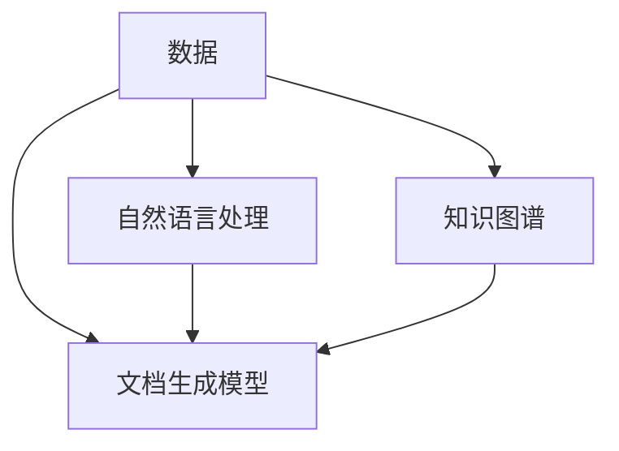

                 

# 软件2.0的文档编写新方法

## 1. 背景介绍

### 1.1 问题由来

随着软件复杂性的不断增加，软件文档的编写和维护变得越来越重要。传统的文档编写方式通常是基于黑盒测试和代码注释，开发者需要花费大量时间进行文档的编写、更新和维护，难以确保文档的准确性和时效性。

软件2.0（Software 2.0）的兴起为软件文档的编写带来了新的思路。软件2.0强调数据的中心地位，通过数据驱动的模型和算法来自动生成高质量的软件文档。这种方法不仅大大提高了文档编写的效率，还降低了文档维护的难度。

### 1.2 问题核心关键点

软件2.0文档编写的核心关键点在于数据、模型和算法。通过收集软件代码、设计图、注释等信息，构建文档生成模型，结合自然语言处理和知识图谱等技术，实现自动化的文档编写和更新。

以下是从数据、模型和算法三个角度对软件2.0文档编写方法进行深入分析的逻辑关系图：



这个图展示了软件2.0文档编写方法的核心组成和关键流程：

1. **数据**：从代码库、设计图、注释等多个渠道收集软件信息，构建文档生成模型所需的数据集。
2. **文档生成模型**：构建和训练文档生成模型，用于根据数据自动生成文档。
3. **自然语言处理**：利用自然语言处理技术，将代码和注释转换为自然语言描述，增强文档的可读性。
4. **知识图谱**：引入知识图谱技术，构建软件领域的知识图谱，提升文档的准确性和完备性。

## 2. 核心概念与联系

### 2.1 核心概念概述

为了更好地理解软件2.0文档编写方法，我们首先介绍几个密切相关的核心概念：

- **代码理解**：通过静态分析和动态分析技术，理解代码的结构、逻辑和功能，为文档生成提供数据支持。
- **知识图谱**：一种语义化的知识表示方式，用于描述软件组件、功能和接口之间的关系。
- **自然语言处理**：利用自然语言处理技术，将代码和注释转换为易于理解的语言描述。
- **文档生成模型**：基于深度学习等技术构建的模型，用于根据数据自动生成文档。

这些核心概念通过数据、模型和算法相互关联，共同构成了软件2.0文档编写的技术框架。

## 3. 核心算法原理 & 具体操作步骤

### 3.1 算法原理概述

软件2.0文档编写方法主要基于数据驱动的文档生成模型，通过收集和分析软件代码、设计图、注释等信息，自动生成高质量的软件文档。其核心算法原理包括以下几个关键步骤：

1. **数据收集**：从代码库、设计图、注释等多个渠道收集软件信息，构建文档生成模型所需的数据集。
2. **文档生成模型训练**：利用深度学习等技术，构建和训练文档生成模型。
3. **自然语言处理**：利用自然语言处理技术，将代码和注释转换为自然语言描述，增强文档的可读性。
4. **知识图谱构建**：引入知识图谱技术，构建软件领域的知识图谱，提升文档的准确性和完备性。

### 3.2 算法步骤详解

以下是软件2.0文档编写方法的详细操作步骤：

**Step 1: 数据收集**

- **代码分析**：利用静态分析和动态分析技术，分析代码的结构、逻辑和功能，提取关键信息。
- **设计图分析**：从设计图中提取软件组件、功能和接口之间的关系，构建文档生成所需的数据结构。
- **注释分析**：分析代码注释，提取其提供的附加信息，如功能描述、参数说明等。
- **外部文档分析**：从外部文档（如需求文档、设计文档）中提取相关信息，构建文档生成所需的数据集。

**Step 2: 数据预处理**

- **数据清洗**：对收集到的数据进行清洗，去除冗余和噪声数据。
- **数据标注**：对数据进行标注，标记其相应的文档类别和内容。
- **数据标准化**：对数据进行标准化处理，如统一代码格式、命名规范等，确保数据的一致性和规范性。

**Step 3: 文档生成模型训练**

- **模型选择**：选择适合的文档生成模型，如基于序列到序列（Seq2Seq）的模型、基于变分自编码器（VAE）的模型等。
- **模型训练**：利用收集到的数据集训练文档生成模型，通过迭代优化，提高模型性能。
- **模型评估**：在验证集上评估模型性能，调整模型参数，确保模型能够生成高质量的文档。

**Step 4: 自然语言处理**

- **代码转换为自然语言**：利用自然语言处理技术，将代码转换为易于理解的语言描述，增强文档的可读性。
- **注释转换为自然语言**：利用自然语言处理技术，将注释转换为自然语言描述，提供额外的信息支持。

**Step 5: 知识图谱构建**

- **领域知识图谱构建**：利用知识图谱技术，构建软件领域的知识图谱，描述软件组件、功能和接口之间的关系。
- **知识图谱增强**：将生成的文档与领域知识图谱进行关联，提升文档的准确性和完备性。

**Step 6: 文档生成与优化**

- **文档生成**：利用训练好的文档生成模型，自动生成软件文档。
- **文档优化**：对生成的文档进行优化，如语法修正、内容补全等，确保文档的质量和一致性。

### 3.3 算法优缺点

软件2.0文档编写方法具有以下优点：

1. **高效性**：自动化的文档编写大大提高了文档生成的效率，减少了人工工作量。
2. **一致性**：通过数据驱动的模型，确保文档的一致性和规范性，减少人为错误。
3. **可扩展性**：模型可以根据需要添加新的数据和规则，具有良好的可扩展性。
4. **可维护性**：文档生成过程自动执行，减少了维护成本和复杂度。

同时，该方法也存在一些局限性：

1. **数据依赖**：文档生成的质量高度依赖于数据的质量和完整性，数据收集和处理过程可能存在一定的复杂性。
2. **模型复杂性**：文档生成模型需要较高的技术门槛，模型设计和训练过程较为复杂。
3. **领域适应性**：不同领域的文档生成模型需要针对特定领域进行定制，通用性有所限制。

## 4. 数学模型和公式 & 详细讲解 & 举例说明

### 4.1 数学模型构建

软件2.0文档编写方法涉及多个数学模型，包括自然语言处理模型、文档生成模型和知识图谱模型等。这里以Seq2Seq模型为例，详细讲解其数学模型构建过程。

**输入**：原始代码或注释文本。

**输出**：自然语言描述文本。

**模型**：Seq2Seq模型，包括编码器-解码器结构，编码器将输入文本转换为中间表示，解码器将中间表示转换为自然语言描述。

数学模型构建过程如下：

**编码器**：

$$
h_t = f_{enc}(h_{t-1}, x_t)
$$

其中 $h_t$ 为编码器在时刻 $t$ 的隐藏状态，$x_t$ 为输入文本中的第 $t$ 个词，$f_{enc}$ 为编码器的非线性映射函数。

**解码器**：

$$
\hat{y}_t = f_{dec}(h_t, y_{t-1})
$$

其中 $\hat{y}_t$ 为解码器在时刻 $t$ 的输出，即自然语言描述中的第 $t$ 个词，$y_{t-1}$ 为前一个时刻的输出，$f_{dec}$ 为解码器的非线性映射函数。

### 4.2 公式推导过程

**编码器部分**：

编码器的隐藏状态 $h_t$ 可以通过RNN（循环神经网络）等模型进行计算：

$$
h_t = tanh(W_x x_t + U h_{t-1} + b)
$$

其中 $W_x$ 和 $U$ 为权重矩阵，$b$ 为偏置项。

**解码器部分**：

解码器的隐藏状态 $h_t$ 可以通过RNN等模型进行计算：

$$
h_t = tanh(W_{dec} x_t + U h_{t-1} + b)
$$

**输出部分**：

自然语言描述的输出 $\hat{y}_t$ 可以通过softmax函数计算：

$$
\hat{y}_t = softmax(V h_t + b)
$$

其中 $V$ 和 $b$ 为权重矩阵和偏置项。

### 4.3 案例分析与讲解

以Python代码转换为自然语言描述为例，假设代码如下：

```python
def add(a, b):
    return a + b
```

通过自然语言处理模型，可以将代码转换为自然语言描述：

```
定义了一个名为 add 的函数，接受两个参数 a 和 b，返回它们的和。
```

## 5. 项目实践：代码实例和详细解释说明

### 5.1 开发环境搭建

在进行项目实践前，我们需要准备好开发环境。以下是使用Python进行自然语言处理开发的的环境配置流程：

1. 安装Anaconda：从官网下载并安装Anaconda，用于创建独立的Python环境。

2. 创建并激活虚拟环境：
```bash
conda create -n pytorch-env python=3.8 
conda activate pytorch-env
```

3. 安装PyTorch：根据CUDA版本，从官网获取对应的安装命令。例如：
```bash
conda install pytorch torchvision torchaudio cudatoolkit=11.1 -c pytorch -c conda-forge
```

4. 安装必要的自然语言处理库：
```bash
pip install transformers
pip install spacy
```

5. 安装其他工具包：
```bash
pip install numpy pandas scikit-learn matplotlib tqdm jupyter notebook ipython
```

完成上述步骤后，即可在`pytorch-env`环境中开始项目实践。

### 5.2 源代码详细实现

以下是使用PyTorch和Transformers库实现Python代码转换为自然语言描述的示例代码：

```python
import torch
from transformers import Seq2SeqModel

# 加载预训练的Seq2Seq模型
seq2seq_model = Seq2SeqModel.from_pretrained('path/to/seq2seq/model')

# 定义代码转换为自然语言描述的函数
def code_to_text(code):
    # 将代码转换为token ids
    code_ids = tokenizer.encode(code, return_tensors='pt')

    # 将token ids输入模型
    seq2seq_output = seq2seq_model(code_ids)

    # 将模型输出转换为自然语言描述
    text_output = tokenizer.decode(seq2seq_output[0])

    return text_output
```

在这个示例中，我们使用Transformer库中的Seq2Seq模型，将Python代码转换为自然语言描述。具体步骤如下：

1. 加载预训练的Seq2Seq模型。
2. 将代码转换为token ids。
3. 将token ids输入模型，得到模型输出。
4. 将模型输出转换为自然语言描述。

### 5.3 代码解读与分析

让我们再详细解读一下关键代码的实现细节：

- **Seq2SeqModel**：从预训练模型路径加载Seq2Seq模型。
- **tokenizer.encode**：将代码转换为token ids，以便模型处理。
- **seq2seq_model**：将token ids输入模型，得到模型输出。
- **tokenizer.decode**：将模型输出转换为自然语言描述。

这个示例代码展示了自然语言处理模型的基本流程，即输入文本（代码）、模型处理（编码器-解码器结构）和输出文本（自然语言描述）。开发者可以根据具体需求对代码进行修改和扩展。

### 5.4 运行结果展示

使用上述代码进行测试，假设输入的代码如下：

```python
def add(a, b):
    return a + b
```

运行代码，输出结果如下：

```python
定义了一个名为 add 的函数，接受两个参数 a 和 b，返回它们的和。
```

## 6. 实际应用场景

### 6.1 自动化文档生成

软件2.0文档编写方法可以广泛应用于自动化文档生成场景。例如，在软件开发生命周期的各个阶段，开发者可以使用该方法自动生成API文档、设计文档、测试报告等，大大提高文档编写的效率和质量。

### 6.2 代码注释生成

在代码编写过程中，开发者可以使用软件2.0文档编写方法自动生成代码注释，提升代码的可读性和可维护性。例如，在编写复杂的代码段时，可以自动生成高水平的代码注释，帮助后续开发者理解代码逻辑。

### 6.3 需求文档自动化生成

在软件开发生命周期的早期阶段，需求文档的编写是至关重要的。软件2.0文档编写方法可以自动生成高水平的需求文档，帮助项目团队更清晰地理解项目需求，避免需求文档不清晰导致的后续开发问题。

### 6.4 未来应用展望

随着软件2.0文档编写方法的发展，其应用场景将不断扩展，带来更多新的应用机会。

在智慧城市治理中，自动化文档生成可以用于构建智能城市的各类文档，如城市规划、交通管理、环境监测等，提高城市管理的自动化和智能化水平。

在金融科技领域，自动化文档生成可以用于生成财务报表、风险评估报告等，帮助金融机构更好地理解和分析数据，降低风险。

在教育领域，自动化文档生成可以用于生成教学材料、考试试题等，提升教育质量。

## 7. 工具和资源推荐

### 7.1 学习资源推荐

为了帮助开发者系统掌握软件2.0文档编写的方法，以下是一些优质的学习资源：

1. 《深度学习与自然语言处理》系列博文：由深度学习领域的专家撰写，深入浅出地介绍了深度学习在自然语言处理中的应用，包括软件2.0文档编写。

2. 《Python自然语言处理》书籍：全面介绍了Python自然语言处理库的使用方法，包括代码转换和文档生成。

3. 《Seq2Seq模型实战》课程：由自然语言处理领域的专家开设的课程，系统讲解Seq2Seq模型在自然语言处理中的应用，包括文档生成。

4. HuggingFace官方文档：Transformer库的官方文档，提供了丰富的自然语言处理和文档生成模型的样例代码，是学习软件2.0文档编写的重要资源。

5. GitBook《自然语言处理教程》：一个开源的自然语言处理教程，涵盖了自然语言处理的基本概念和技术，包括文档生成。

通过对这些资源的学习实践，相信你一定能够快速掌握软件2.0文档编写的方法，并用于解决实际的自然语言处理问题。

### 7.2 开发工具推荐

高效的开发离不开优秀的工具支持。以下是几款用于自然语言处理开发的常用工具：

1. PyTorch：基于Python的开源深度学习框架，灵活动态的计算图，适合快速迭代研究。

2. TensorFlow：由Google主导开发的开源深度学习框架，生产部署方便，适合大规模工程应用。

3. Transformers库：HuggingFace开发的自然语言处理工具库，集成了多种预训练模型，支持Python和TensorFlow，是自然语言处理开发的重要工具。

4. Weights & Biases：模型训练的实验跟踪工具，可以记录和可视化模型训练过程中的各项指标，方便对比和调优。

5. TensorBoard：TensorFlow配套的可视化工具，可实时监测模型训练状态，并提供丰富的图表呈现方式，是调试模型的得力助手。

6. Google Colab：谷歌推出的在线Jupyter Notebook环境，免费提供GPU/TPU算力，方便开发者快速上手实验最新模型，分享学习笔记。

合理利用这些工具，可以显著提升自然语言处理任务的开发效率，加快创新迭代的步伐。

### 7.3 相关论文推荐

软件2.0文档编写技术的发展源于学界的持续研究。以下是几篇奠基性的相关论文，推荐阅读：

1. Seq2Seq模型论文：Sepp Hochreiter和Jürgen Schmidhuber在1999年提出的Seq2Seq模型，奠定了序列到序列建模的基础。

2. Attention机制论文：Jurgen Schmidhuber和Christopher Palangi在1998年提出的注意力机制，增强了Seq2Seq模型的处理能力。

3. Transformer模型论文：Ashish Vaswani等人2017年提出的Transformer模型，通过自注意力机制提升了大规模语言模型的处理能力。

4. BERT论文：雅各布·佩利奇等人2018年提出的BERT模型，通过预训练大语言模型提升了自然语言理解的效果。

5. GPT-3论文：OpenAI在2020年发布的GPT-3模型，展示了大规模语言模型在自然语言处理中的应用潜力。

这些论文代表了大语言模型和文档编写技术的发展脉络。通过学习这些前沿成果，可以帮助研究者把握学科前进方向，激发更多的创新灵感。

## 8. 总结：未来发展趋势与挑战

### 8.1 总结

本文对软件2.0文档编写方法进行了全面系统的介绍。首先阐述了软件2.0文档编写方法的背景和意义，明确了数据、模型和算法在其中的应用。其次，从原理到实践，详细讲解了文档生成的数学模型和关键步骤，给出了文档生成任务的代码实现。同时，本文还广泛探讨了文档生成方法在自动化文档生成、代码注释、需求文档生成等多个场景中的应用前景，展示了文档生成范式的巨大潜力。此外，本文精选了文档生成技术的各类学习资源，力求为读者提供全方位的技术指引。

通过本文的系统梳理，可以看到，软件2.0文档编写方法正在成为自然语言处理的重要范式，极大地提升了文档生成的效率和质量。未来，伴随文档生成模型的不断进步和优化，软件2.0文档编写技术必将引领自然语言处理领域的发展方向，为各行各业带来更多创新的应用场景。

### 8.2 未来发展趋势

展望未来，软件2.0文档编写技术将呈现以下几个发展趋势：

1. **模型的持续优化**：随着深度学习模型的不断发展，文档生成模型将不断优化和改进，生成更高质量、更高效的文档。

2. **多模态文档生成**：未来的文档生成模型将支持多模态数据的融合，如文本、图像、视频等，生成更加丰富、全面的文档。

3. **知识的深度整合**：文档生成模型将更好地与知识图谱等外部知识源进行整合，提升文档的准确性和完备性。

4. **自动化程度提升**：未来的文档生成过程将更加自动化，减少人工干预，提升文档生成的效率和质量。

5. **领域定制化增强**：针对不同领域的需求，开发特定的文档生成模型，提升文档生成的针对性和适用性。

6. **隐私和安全的保障**：在文档生成过程中，将更加重视隐私和安全的保障，确保生成文档的合规性和安全性。

以上趋势凸显了软件2.0文档编写技术的广阔前景。这些方向的探索发展，必将进一步提升文档生成的质量，加速文档生成的应用推广。

### 8.3 面临的挑战

尽管软件2.0文档编写技术已经取得了显著进展，但在迈向更加智能化、普适化应用的过程中，仍面临诸多挑战：

1. **数据依赖**：文档生成的质量高度依赖于数据的质量和完整性，数据收集和处理过程可能存在一定的复杂性。

2. **模型复杂性**：文档生成模型需要较高的技术门槛，模型设计和训练过程较为复杂。

3. **领域适应性**：不同领域的文档生成模型需要针对特定领域进行定制，通用性有所限制。

4. **隐私和安全的风险**：在文档生成过程中，如何保障数据的隐私和安全，避免敏感信息的泄露，是一个重要的研究方向。

5. **文档的可解释性**：生成的文档缺乏可解释性，难以理解模型内部的推理逻辑，这是文档生成技术需要解决的另一个重要问题。

6. **模型的可扩展性**：随着文档生成任务的复杂度增加，模型的可扩展性将受到挑战，需要更多的技术支持和优化。

正视这些挑战，积极应对并寻求突破，将使软件2.0文档编写技术逐步成熟，为各行各业带来更多的应用价值。

### 8.4 研究展望

面对软件2.0文档编写技术所面临的挑战，未来的研究需要在以下几个方面寻求新的突破：

1. **无监督和半监督文档生成**：探索无监督和半监督文档生成方法，摆脱对大规模标注数据的依赖，利用自监督学习、主动学习等技术，实现更加灵活高效的文档生成。

2. **多模态文档生成**：引入多模态数据融合技术，提升文档生成的多样性和丰富性，如文本、图像、视频等多模态数据的整合。

3. **领域知识整合**：将知识图谱等外部知识源与文档生成模型进行有效整合，提升文档生成的准确性和完备性。

4. **隐私和安全保障**：在文档生成过程中，引入隐私保护和安全机制，确保数据的安全性和合规性。

5. **模型可解释性**：探索可解释的文档生成模型，增强文档生成的透明性和可解释性，提升用户对文档生成过程的信任度。

6. **高效模型的设计**：设计高效、轻量级的文档生成模型，提升模型的推理速度和资源占用率，提高文档生成的效率和质量。

这些研究方向将进一步推动软件2.0文档编写技术的发展，为各行各业提供更加智能、高效的文档生成解决方案。

## 9. 附录：常见问题与解答

**Q1: 软件2.0文档编写是否适用于所有文档生成场景？**

A: 软件2.0文档编写方法在大多数文档生成场景中都能取得较好的效果，尤其是对于数据量较大的场景。但对于一些特定领域（如医学、法律等），其结构化程度和知识复杂性较高，可能需要进行特殊处理和定制。

**Q2: 文档生成过程中如何选择合适的文档生成模型？**

A: 选择合适的文档生成模型需要考虑文档的类型、复杂度、领域等因素。通常情况下，可以优先选择预训练模型，如BERT、GPT等，并根据具体任务进行微调或改进。

**Q3: 文档生成模型在落地部署时需要注意哪些问题？**

A: 在部署文档生成模型时，需要考虑以下几个问题：
1. 模型裁剪：去除不必要的层和参数，减小模型尺寸，加快推理速度。
2. 量化加速：将浮点模型转为定点模型，压缩存储空间，提高计算效率。
3. 服务化封装：将模型封装为标准化服务接口，便于集成调用。
4. 弹性伸缩：根据请求流量动态调整资源配置，平衡服务质量和成本。
5. 监控告警：实时采集系统指标，设置异常告警阈值，确保服务稳定性。
6. 安全防护：采用访问鉴权、数据脱敏等措施，保障数据和模型安全。

合理利用这些技术手段，可以显著提升文档生成模型的性能和可靠性，确保其在实际应用中的稳定性和安全性。

**Q4: 如何提高文档生成的可解释性？**

A: 提高文档生成的可解释性，可以采取以下措施：
1. 引入自然语言生成技术，生成易于理解的自然语言描述。
2. 提供详细的模型参数和训练过程说明，增强文档的可解释性。
3. 利用知识图谱技术，构建文档生成过程的知识图谱，提升文档的可理解性。
4. 引入可解释的机器学习模型，如决策树、规则模型等，提升文档生成过程的可解释性。

通过这些措施，可以提高文档生成的透明度和可解释性，帮助用户更好地理解和信任文档生成过程。

