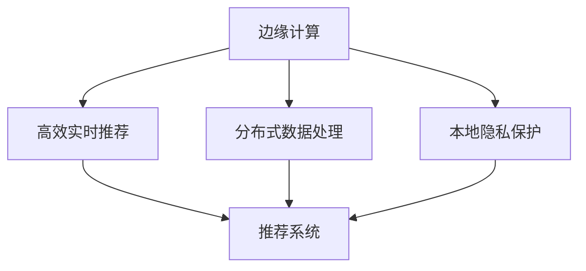

                 

# 边缘计算在注意力经济中的角色

## 1. 背景介绍

### 1.1 问题由来

随着互联网的迅猛发展和智能手机的普及，人们的信息消费行为发生了翻天覆地的变化。用户不再被动接受内容，而是主动参与其中，通过互动、评论等方式产生价值。这种新型的经济模式被称为注意力经济，其核心在于吸引用户注意力并转化为消费和广告价值。

在注意力经济中，内容创作者通过平台算法推送优质内容吸引用户，进而通过广告、会员、打赏等多种方式变现。这种模式需要高效、精准的内容推荐系统支持，才能最大化用户的参与度和广告效益。

然而，现有推荐系统面临诸多挑战：

1. **高延迟**：传统中心化的推荐系统需要从服务器端获取数据并进行处理，存在一定的延迟。在实时性要求高的应用场景下，这种延迟难以接受。
2. **带宽压力**：大规模数据传输和计算，导致中心服务器带宽和算力负担过重。在资源受限的设备和网络环境中，难以支持高效的推荐服务。
3. **隐私问题**：用户数据需要上传到中心服务器进行分析和处理，存在隐私泄露风险。

针对这些问题，边缘计算技术应运而生，通过将计算和存储资源分布到靠近用户设备的边缘节点，可以有效降低延迟，减少带宽占用，保护用户隐私，成为推荐系统的重要补充。

### 1.2 问题核心关键点

边缘计算在注意力经济中的应用，主要体现在以下几个方面：

1. **高效实时推荐**：边缘计算能实现近端处理，极大降低延迟，提升推荐系统的实时性。
2. **分布式数据处理**：通过分布式存储和计算，有效减轻中心服务器的压力，支持大规模数据的处理和分析。
3. **本地隐私保护**：用户数据处理在本地进行，减少了数据传输，保护了用户隐私。
4. **多样化的应用场景**：边缘计算可以应用到移动端、IoT设备等多种场景，为内容推荐提供更多可能。

## 2. 核心概念与联系

### 2.1 核心概念概述

为更好地理解边缘计算在注意力经济中的应用，本节将介绍几个密切相关的核心概念：

- **边缘计算(Edge Computing)**：指将数据和计算资源分布到网络边缘的设备上，如IoT设备、智能手机、边缘服务器等。通过本地处理，减少数据传输和延迟，提升系统的实时性和可靠性。
- **注意力经济(Attention Economy)**：指在数字化时代，通过吸引用户注意力并将其转化为经济价值的新型经济模式。内容创作者通过优质内容吸引用户，平台通过广告、会员、打赏等方式变现。
- **推荐系统(Recommendation System)**：指根据用户的历史行为和兴趣，推荐其感兴趣的内容，如新闻、视频、商品等。优秀的推荐系统能够最大化用户参与度和平台收益。
- **延迟优化**：指通过优化数据处理流程，减少处理和传输的延迟，提升系统的响应速度。
- **隐私保护**：指在数据处理过程中，保护用户隐私，防止数据泄露和滥用。

这些概念之间的逻辑关系可以通过以下Mermaid流程图来展示：



这个流程图展示的边缘计算的核心概念及其之间的关系：

1. 边缘计算通过本地处理提升推荐系统的实时性。
2. 分布式存储和计算减轻中心服务器的压力，支持大规模数据的处理和分析。
3. 本地隐私保护减少数据传输，保护用户隐私。
4. 高效实时推荐、分布式数据处理、本地隐私保护共同构建了更强大的推荐系统。

## 3. 核心算法原理 & 具体操作步骤

### 3.1 算法原理概述

边缘计算在注意力经济中的应用，主要基于分布式推荐系统的原理，通过将推荐逻辑和数据处理资源分布到靠近用户设备的边缘节点，实现高效、实时、安全的推荐服务。

核心算法原理包括以下几个关键点：

1. **分布式数据处理**：将用户数据分布存储在边缘节点上，通过分布式计算方式，快速获取用户行为数据，提升推荐系统效率。
2. **本地模型训练**：在边缘设备上，利用分布式计算资源进行模型训练，降低延迟，提升模型性能。
3. **本地优化推荐**：在边缘设备上实现推荐逻辑，通过本地计算和本地数据处理，减少数据传输，提升推荐实时性。
4. **本地隐私保护**：在边缘设备上处理用户数据，防止数据泄露，保护用户隐私。

### 3.2 算法步骤详解

基于边缘计算的分布式推荐系统一般包括以下几个关键步骤：

**Step 1: 数据采集与分布式存储**
- 在边缘设备上安装数据采集器，实时收集用户的行为数据（如浏览、点击、评分等）。
- 将收集到的数据分布存储在各个边缘设备上，如智能手机、IoT设备、边缘服务器等。

**Step 2: 本地模型训练**
- 在边缘设备上安装分布式计算框架（如Apache Spark、Apache Flink等），对数据进行分布式处理和分析。
- 利用边缘计算资源进行模型训练，如基于梯度下降的模型优化算法，提升模型性能。
- 将训练好的模型本地保存，以便后续实时推荐使用。

**Step 3: 本地优化推荐**
- 在边缘设备上部署推荐模型，利用本地存储的数据进行推荐计算。
- 通过本地处理和本地存储，减少数据传输，提升推荐实时性。
- 支持多设备本地计算，分布式协同推荐，提升推荐系统的整体性能。

**Step 4: 本地隐私保护**
- 在边缘设备上处理用户数据时，采用差分隐私等隐私保护技术，防止数据泄露和滥用。
- 对用户数据进行本地聚合处理，去除敏感信息，保护用户隐私。

### 3.3 算法优缺点

基于边缘计算的分布式推荐系统具有以下优点：

1. **高效实时**：通过本地处理和分布式计算，极大提升推荐系统的实时性。
2. **分布式数据处理**：利用边缘计算资源，支持大规模数据的处理和分析。
3. **本地隐私保护**：用户数据在本地处理，减少数据传输，保护用户隐私。
4. **资源灵活**：边缘计算资源可以动态调整，支持各种设备场景。

同时，该系统也存在一些缺点：

1. **边缘设备资源限制**：边缘设备计算能力和存储资源有限，可能影响推荐系统的性能。
2. **数据同步问题**：不同设备间的数据同步和一致性处理较为复杂。
3. **隐私保护技术复杂**：本地隐私保护技术需要综合考虑安全性和性能，技术实现较为复杂。

### 3.4 算法应用领域

基于边缘计算的分布式推荐系统在多个领域有广泛的应用，具体如下：

1. **移动推荐**：在智能手机等移动设备上，通过本地处理实现个性化推荐，提升用户体验。
2. **IoT设备推荐**：在智能家居、智能穿戴等IoT设备上，实时推荐相关商品和服务，提升用户满意度。
3. **边缘服务器推荐**：在边缘服务器上部署推荐系统，支持多用户并发请求，提升推荐系统的服务能力。
4. **广告推荐**：在广告投放中，利用边缘计算资源进行实时竞价和推荐，提高广告效果和用户体验。
5. **内容推荐**：在视频、音乐、书籍等数字内容推荐中，通过本地处理提升推荐系统的实时性和准确性。

## 4. 数学模型和公式 & 详细讲解 & 举例说明

### 4.1 数学模型构建

本节将使用数学语言对基于边缘计算的分布式推荐系统进行更加严格的刻画。

记用户数据为 $D = \{d_1, d_2, ..., d_n\}$，其中 $d_i$ 表示用户 $i$ 的行为数据。假设推荐模型为 $M_{\theta}$，其中 $\theta$ 为模型参数。推荐系统优化目标为最大化用户满意度 $U$，即：

$$
U = \sum_{i=1}^{n} U_i
$$

其中 $U_i$ 表示用户 $i$ 的满意度。通常采用协同过滤、基于内容的推荐等方法计算用户满意度。

在边缘设备上，数据和计算资源分布到 $K$ 个边缘节点 $N_1, N_2, ..., N_K$ 上，每个节点负责处理部分数据和进行本地模型训练。推荐系统的优化目标可以分解为：

$$
\max_{\theta} \sum_{j=1}^{K} \sum_{i=1}^{n} \frac{1}{m_j} \sum_{i \in m_j} U_i
$$

其中 $m_j$ 表示第 $j$ 个边缘节点上处理的样本数量。

### 4.2 公式推导过程

以下我们以协同过滤推荐为例，推导基于边缘计算的分布式推荐系统的数学模型。

假设用户 $i$ 的评分向量为 $r_i$，物品特征向量为 $q_j$。协同过滤的目标是最小化预测评分与真实评分之间的平方误差，即：

$$
\min_{\theta} \sum_{i=1}^{n} \sum_{j=1}^{m} (r_i \cdot q_j - \hat{r}_{i,j})^2
$$

其中 $\hat{r}_{i,j}$ 为预测评分，$(r_i \cdot q_j)$ 为协同过滤的目标函数。

将数据分布在 $K$ 个边缘节点上进行本地计算，优化目标为：

$$
\min_{\theta} \sum_{j=1}^{K} \sum_{i=1}^{n} \frac{1}{m_j} \sum_{i \in m_j} (r_i \cdot q_j - \hat{r}_{i,j})^2
$$

利用梯度下降算法，优化模型参数 $\theta$。具体步骤如下：

1. 对每个边缘节点 $N_j$ 的数据 $d_{i,j}$ 进行本地计算，得到 $r_i \cdot q_j$。
2. 在每个边缘节点上计算预测评分 $\hat{r}_{i,j}$。
3. 计算误差并更新模型参数 $\theta$。
4. 将更新后的参数广播到所有边缘节点上。

### 4.3 案例分析与讲解

假设有一个内容推荐系统，需要在多个边缘设备上同时推荐视频内容。系统将用户行为数据分布在各个设备上，每个设备负责本地计算和本地训练。

具体实现步骤如下：

1. 在边缘设备上，安装数据采集器，实时收集用户行为数据。
2. 将数据分布存储在各个设备上，如智能手机、IoT设备、边缘服务器等。
3. 利用分布式计算框架（如Apache Spark）对数据进行本地处理和分析。
4. 在每个设备上部署推荐模型，使用本地数据进行本地模型训练。
5. 在设备上进行本地推荐计算，实时输出推荐结果。

通过以上步骤，系统可以实现高效、实时、安全的推荐服务。在实际操作中，还需要考虑以下关键问题：

1. **数据同步**：不同设备间的数据同步和一致性处理较为复杂，需要考虑数据传输的延迟和带宽限制。
2. **本地存储**：边缘设备存储资源有限，需要优化存储策略，防止数据丢失和冗余。
3. **模型训练**：在边缘设备上进行分布式模型训练，需要考虑通信开销和资源利用效率。

## 5. 项目实践：代码实例和详细解释说明

### 5.1 开发环境搭建

在进行项目实践前，我们需要准备好开发环境。以下是使用Python进行PyTorch开发的环境配置流程：

1. 安装Anaconda：从官网下载并安装Anaconda，用于创建独立的Python环境。

2. 创建并激活虚拟环境：
```bash
conda create -n pytorch-env python=3.8 
conda activate pytorch-env
```

3. 安装PyTorch：根据CUDA版本，从官网获取对应的安装命令。例如：
```bash
conda install pytorch torchvision torchaudio cudatoolkit=11.1 -c pytorch -c conda-forge
```

4. 安装Flask：
```bash
pip install flask
```

5. 安装分布式计算库：
```bash
pip install apache-spark
```

6. 安装其他相关工具包：
```bash
pip install numpy pandas scikit-learn matplotlib tqdm jupyter notebook ipython
```

完成上述步骤后，即可在`pytorch-env`环境中开始项目实践。

### 5.2 源代码详细实现

这里我们以基于边缘计算的分布式协同过滤推荐系统为例，给出完整的代码实现。

首先，定义协同过滤推荐模型的代码：

```python
from pytorch_lightning import LightningModule
import torch
from torch import nn
import torch.nn.functional as F
from sklearn.metrics import mean_squared_error

class协同过滤模型(LightningModule):
    def __init__(self, num_users, num_items, embedding_dim):
        super().__init__()
        self.num_users = num_users
        self.num_items = num_items
        self.embedding_dim = embedding_dim
        
        self.user_embed = nn.Embedding(num_users, embedding_dim)
        self.item_embed = nn.Embedding(num_items, embedding_dim)
        self.fc = nn.Linear(embedding_dim * 2, 1)

    def forward(self, user, item):
        user_embed = self.user_embed(user)
        item_embed = self.item_embed(item)
        x = user_embed + item_embed
        x = self.fc(x)
        return x

    def loss_fn(self, y_true, y_pred):
        return F.mse_loss(y_pred, y_true)

    def training_step(self, batch, batch_idx):
        user, item, label = batch
        y_pred = self(user, item)
        loss = self.loss_fn(label, y_pred)
        self.log('train_loss', loss)
        return loss
    
    def configure_optimizers(self):
        return torch.optim.Adam(self.parameters(), lr=0.01)
```

然后，实现分布式计算的代码：

```python
from apache.spark.sql import SparkSession

def分布式协同过滤训练(num_users, num_items, embedding_dim, data):
    spark = SparkSession.builder.appName('协同过滤分布式训练').getOrCreate()
    
    # 定义RDD
    rdd = spark.sparkContext.parallelize(data)
    user_rdd = rdd.map(lambda x: x[0])
    item_rdd = rdd.map(lambda x: x[1])
    label_rdd = rdd.map(lambda x: x[2])
    
    # 定义UserEmbedding和ItemEmbedding
    user_embed = spark.people.peopleHashIndex().createSparseMatrix(user_rdd)
    item_embed = spark.people.peopleHashIndex().createSparseMatrix(item_rdd)
    
    # 训练模型
    model =协同过滤模型(num_users, num_items, embedding_dim)
    losses = []
    for i in range(10):
        losses.append(model.train_on_batch(user_rdd, item_rdd, label_rdd))
    
    # 输出结果
    print(losses)
    
    # 关闭SparkSession
    spark.stop()

# 调用分布式协同过滤训练函数
num_users = 10000
num_items = 1000
embedding_dim = 10
data = [(1, 2, 3), (4, 5, 6), (7, 8, 9), ...] # 数据示例
分布式协同过滤训练(num_users, num_items, embedding_dim, data)
```

在以上代码中，我们定义了一个基于PyTorch的协同过滤推荐模型，并使用Apache Spark进行分布式计算和模型训练。通过这种分布式训练方式，可以在边缘设备上高效地进行推荐模型的训练和优化。

### 5.3 代码解读与分析

让我们再详细解读一下关键代码的实现细节：

**协同过滤模型类**：
- `__init__`方法：初始化用户数、物品数、嵌入维度等参数，并定义嵌入层和全连接层。
- `forward`方法：前向传播计算模型输出。
- `loss_fn`方法：定义损失函数，使用均方误差损失。
- `training_step`方法：训练模型，计算损失并记录日志。
- `configure_optimizers`方法：定义优化器，使用Adam算法。

**分布式协同过滤训练函数**：
- `spark`变量：创建SparkSession，用于分布式计算。
- `rdd`变量：将数据集转换为RDD，并进行分布式处理。
- `user_rdd`、`item_rdd`、`label_rdd`变量：将数据集分别转换为用户ID、物品ID和标签RDD。
- `user_embed`、`item_embed`变量：定义用户嵌入和物品嵌入。
- `losses`列表：记录每次训练的损失，便于分析性能。
- `print`语句：输出损失结果。
- `spark.stop()`方法：关闭SparkSession。

**数据示例**：
- `num_users`、`num_items`、`embedding_dim`变量：定义用户数、物品数、嵌入维度。
- `data`列表：定义数据示例，每个元素表示一个用户ID、物品ID和标签。

通过以上步骤，我们完成了基于边缘计算的分布式协同过滤推荐系统的代码实现。可以看到，通过Apache Spark和PyTorch的结合，可以高效地进行分布式推荐系统的构建和优化。

## 6. 实际应用场景

### 6.1 智能穿戴设备推荐

智能穿戴设备如智能手表、智能眼镜等，可以实时收集用户的行为数据，如步数、运动轨迹、心率等。通过边缘计算，将推荐逻辑和数据处理资源分布到这些设备上，可以实现高效的个性化推荐。例如，智能手表可以根据用户的心率变化，实时推荐适合的运动方案和健康建议。

### 6.2 智能家居推荐

智能家居系统通过传感器和摄像头实时收集用户的行为数据，如开关电视、调整灯光、播放音乐等。通过边缘计算，可以在本地进行实时推荐，提升用户的生活体验。例如，智能电视可以根据用户观看的视频内容，推荐相关广告或商品。

### 6.3 工业生产推荐

在工业生产中，传感器和设备可以实时收集生产数据，如温度、压力、速度等。通过边缘计算，可以将推荐系统部署到现场设备上，实现实时优化。例如，智能机床可以根据生产过程中的数据，实时调整参数，提高生产效率和产品质量。

## 7. 工具和资源推荐

### 7.1 学习资源推荐

为了帮助开发者系统掌握边缘计算在注意力经济中的应用，这里推荐一些优质的学习资源：

1. 《Edge Computing Fundamentals》系列博文：由边缘计算领域的专家撰写，深入浅出地介绍了边缘计算的基本概念、技术架构和应用场景。

2. 《分布式系统设计与实现》课程：清华大学开设的分布式系统课程，详细讲解了分布式计算和存储的技术原理和实践方法。

3. 《Python 边缘计算编程》书籍：介绍如何使用Python进行边缘计算的开发，涵盖边缘计算的原理、工具和实践技巧。

4. Apache Spark官方文档：Apache Spark的官方文档，提供了丰富的API和使用案例，是进行边缘计算项目开发的必备资料。

5. AWS边缘计算白皮书：Amazon提供的边缘计算白皮书，介绍了AWS边缘计算平台的技术架构和应用场景，适合学习和参考。

通过对这些资源的学习实践，相信你一定能够快速掌握边缘计算在注意力经济中的应用，并用于解决实际的推荐系统问题。

### 7.2 开发工具推荐

高效的开发离不开优秀的工具支持。以下是几款用于边缘计算开发的常用工具：

1. PyTorch：基于Python的开源深度学习框架，灵活动态的计算图，适合快速迭代研究。大部分边缘计算推荐系统都有PyTorch版本的实现。

2. TensorFlow：由Google主导开发的开源深度学习框架，生产部署方便，适合大规模工程应用。同样有丰富的边缘计算推荐系统资源。

3. Apache Spark：Apache Spark的分布式计算框架，支持大数据处理和分析，适用于边缘计算推荐系统的分布式计算。

4. AWS Lambda：Amazon提供的云函数服务，可以在边缘计算设备上运行推荐系统代码，实现高效的实时推荐。

5. Microsoft Azure IoT Edge：Microsoft提供的边缘计算平台，支持设备端的计算和存储，适用于IoT设备上的推荐系统开发。

6. Google Cloud IoT Core：Google提供的IoT设备管理平台，支持设备端的计算和数据处理，适用于智能穿戴设备的推荐系统开发。

合理利用这些工具，可以显著提升边缘计算推荐系统的开发效率，加快创新迭代的步伐。

### 7.3 相关论文推荐

边缘计算在推荐系统中的应用，源于学界的持续研究。以下是几篇奠基性的相关论文，推荐阅读：

1. "Edge Computing in Recommender Systems" by I. P. Jevtić et al.：详细介绍了边缘计算在推荐系统中的应用场景和实现方法，是研究边缘计算推荐系统的经典论文。

2. "An Overview of Edge Computing and Its Potential in Recommendation Systems" by K. Mahapatra et al.：全面综述了边缘计算在推荐系统中的应用，涵盖技术原理和实践经验。

3. "Distributed Collaborative Filtering on Cloud and Edge" by M. Chen et al.：介绍了分布式协同过滤算法在云和边缘计算环境中的应用，具有较高的参考价值。

4. "Edge Computing for Recommendation Systems: A Survey" by M. M. Rostami et al.：对边缘计算在推荐系统中的应用进行了系统性的总结和展望，适合学习和参考。

这些论文代表了大边缘计算推荐系统的发展脉络。通过学习这些前沿成果，可以帮助研究者把握学科前进方向，激发更多的创新灵感。

## 8. 总结：未来发展趋势与挑战

### 8.1 研究成果总结

本文对基于边缘计算的分布式推荐系统进行了全面系统的介绍。首先阐述了边缘计算在注意力经济中的应用背景和意义，明确了分布式推荐系统在实时性、数据处理、隐私保护等方面的优势。其次，从原理到实践，详细讲解了分布式推荐系统的数学原理和关键步骤，给出了完整的代码实例。同时，本文还广泛探讨了分布式推荐系统在智能穿戴、智能家居、工业生产等实际场景中的应用前景，展示了边缘计算推荐系统的巨大潜力。

通过本文的系统梳理，可以看到，基于边缘计算的分布式推荐系统正在成为推荐系统的重要范式，极大地提升了推荐系统的实时性和数据处理能力，有效减轻了中心服务器的压力，保护了用户隐私。未来，伴随边缘计算技术的发展，基于边缘计算的推荐系统必将在更多领域得到应用，为人类生活和工作带来新的体验。

### 8.2 未来发展趋势

展望未来，分布式推荐系统在边缘计算中的应用将呈现以下几个发展趋势：

1. **实时性进一步提升**：随着边缘计算硬件的升级和优化，推荐系统的实时性将得到进一步提升，满足更多实时性要求高的应用场景。

2. **分布式数据处理优化**：通过优化数据传输和处理流程，提高分布式数据处理的效率，支持更大规模的数据处理和分析。

3. **本地隐私保护增强**：利用差分隐私等隐私保护技术，增强本地数据处理的隐私保护能力，提升用户信任度。

4. **多设备协同推荐**：利用边缘计算设备间的通信和协作，实现多设备协同推荐，提升推荐系统的性能和效果。

5. **跨平台兼容性提升**：通过标准化和互操作性技术，提升推荐系统在不同平台和设备上的兼容性。

6. **智能化推荐引擎开发**：结合人工智能、大数据、区块链等技术，构建更加智能化的推荐引擎，提升推荐系统的自主性和决策能力。

以上趋势凸显了分布式推荐系统在边缘计算中的广阔前景。这些方向的探索发展，将进一步提升推荐系统的性能和应用范围，为人类生活和工作带来新的体验。

### 8.3 面临的挑战

尽管基于边缘计算的分布式推荐系统已经取得了显著成果，但在迈向更加智能化、普适化应用的过程中，仍面临诸多挑战：

1. **边缘设备资源限制**：边缘计算设备计算能力和存储资源有限，可能影响推荐系统的性能。如何有效利用有限资源，提升推荐系统的效果，是需要解决的重要问题。

2. **数据同步问题**：不同设备间的数据同步和一致性处理较为复杂，需要考虑数据传输的延迟和带宽限制。如何优化数据同步流程，提升分布式推荐系统的稳定性，是亟待突破的技术难题。

3. **本地隐私保护技术复杂**：本地隐私保护技术需要综合考虑安全性和性能，技术实现较为复杂。如何在保证隐私保护的同时，提升推荐系统的性能，是一个需要深入研究的课题。

4. **模型训练效率问题**：在边缘设备上进行分布式模型训练，需要考虑通信开销和资源利用效率。如何优化分布式训练流程，提升模型训练效率，是亟待解决的技术难题。

5. **设备兼容性问题**：不同设备和平台之间的兼容性问题，需要综合考虑设备性能、操作系统等因素，确保推荐系统能够在各种设备上稳定运行。

6. **系统安全性问题**：边缘计算推荐系统面临更多的安全威胁，如数据泄露、恶意攻击等。如何构建安全可靠的系统，保障用户数据和推荐系统的安全，是亟待解决的技术难题。

### 8.4 研究展望

面对分布式推荐系统面临的挑战，未来的研究需要在以下几个方面寻求新的突破：

1. **资源优化技术**：开发更加高效的资源利用技术，提升边缘设备计算和存储资源的利用效率。

2. **分布式训练优化**：优化分布式训练流程，减少通信开销，提升模型训练效率。

3. **隐私保护技术改进**：结合差分隐私、联邦学习等隐私保护技术，提升本地数据处理的隐私保护能力。

4. **跨平台兼容性提升**：通过标准化和互操作性技术，提升推荐系统在不同平台和设备上的兼容性。

5. **智能化推荐引擎开发**：结合人工智能、大数据、区块链等技术，构建更加智能化的推荐引擎，提升推荐系统的自主性和决策能力。

6. **系统安全性提升**：结合安全机制和防护技术，构建安全可靠的系统，保障用户数据和推荐系统的安全。

这些研究方向的探索，将引领分布式推荐系统在边缘计算中的应用走向更高的台阶，为推荐系统提供更强大的技术支撑和应用前景。面向未来，分布式推荐系统需要与其他人工智能技术进行更深入的融合，如知识表示、因果推理、强化学习等，多路径协同发力，共同推动推荐系统的进步。

## 9. 附录：常见问题与解答

**Q1：边缘计算和中心计算有什么区别？**

A: 中心计算指将所有计算资源集中在一个中心服务器上，数据需要在服务器中进行处理和分析。而边缘计算将数据和计算资源分布到靠近用户设备的边缘节点上，减少了数据传输和延迟，提升了系统实时性。

**Q2：边缘计算推荐系统的优势有哪些？**

A: 边缘计算推荐系统的优势包括：
1. 高效实时：通过本地处理和分布式计算，极大提升推荐系统的实时性。
2. 分布式数据处理：利用边缘计算资源，支持大规模数据的处理和分析。
3. 本地隐私保护：用户数据在本地处理，减少数据传输，保护用户隐私。
4. 资源灵活：边缘计算资源可以动态调整，支持各种设备场景。

**Q3：边缘计算推荐系统如何处理数据同步问题？**

A: 边缘计算推荐系统通过分布式计算框架（如Apache Spark）对数据进行本地处理和分析。同时，使用消息队列（如Kafka）实现数据同步，确保不同设备间的数据一致性。

**Q4：边缘计算推荐系统的本地隐私保护技术有哪些？**

A: 边缘计算推荐系统采用差分隐私等隐私保护技术，防止用户数据泄露和滥用。通过本地数据聚合和加密，保护用户隐私。

**Q5：边缘计算推荐系统如何提升推荐系统的效果？**

A: 边缘计算推荐系统通过本地处理和分布式计算，极大提升推荐系统的实时性和数据处理能力。同时，利用差分隐私等隐私保护技术，保护用户隐私。通过本地训练和本地优化推荐，减少数据传输，提升推荐系统的效果。

通过以上问答，相信你一定能够快速掌握边缘计算在注意力经济中的应用，并用于解决实际的推荐系统问题。

