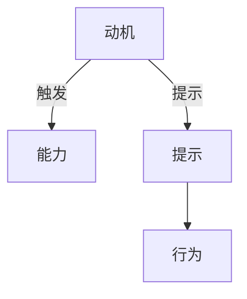

                 

# 运用福格模型培养团队良习惯

> 关键词：福格模型,行为设计,行为激励,习惯养成,团队管理,人力资源,心理学

## 1. 背景介绍

### 1.1 问题由来
在当今快速发展的科技和商业环境中，企业的竞争不仅依赖于技术实力和市场策略，更依赖于团队的协作和创新能力。如何高效培养并维持团队成员的积极行为，成为企业管理的重要课题。尤其是当团队规模不断扩大，成员间协作变得越来越复杂，如何确保每个成员都能发挥最大潜力，成为一个巨大的挑战。

### 1.2 问题核心关键点
要解决上述问题，传统的人力资源管理方法往往力不从心。这些方法包括奖励机制、绩效评估等，但往往存在激励不足、效果难评估等缺点。基于此，本文将探讨一种新的行为设计框架——福格模型（Fogg's Model），该模型通过分析行为动机、触发条件和行为线索，指导企业设计更加科学、高效的行为管理策略，有效培养团队的良好习惯。

### 1.3 问题研究意义
福格模型为企业提供了一种全新的视角，用于理解和激励员工的行为。通过系统分析行为背后的心理学原理，企业可以设计更加人性化的管理策略，提升团队成员的积极性和工作效率，从而增强企业的创新能力和竞争力。该模型不仅适用于技术团队，对于销售、营销、运营等各类团队同样具有普适性。

## 2. 核心概念与联系

### 2.1 核心概念概述

福格模型由美国斯坦福大学教授斯坦福·福格（B. J. Fogg）提出，旨在揭示人类行为背后的心理机制，并指导人们如何设计有效行为。该模型通过三个关键因素——动机（Motivation）、能力（Ability）和提示（Prompts），解释了行为发生的条件，并通过精心设计这些因素，增强行为的发生概率。

- **动机**：指驱动个体产生行为的内部驱动力，如兴趣、成就感等。
- **能力**：指执行行为所需的技术和资源，如时间、资金等。
- **提示**：指引发行为的外部线索，如提醒、奖励等。

通过结合动机、能力和提示，福格模型帮助企业设计出更加易于执行且能产生积极影响的行为，从而达到培养团队良好习惯的目的。

### 2.2 核心概念原理和架构的 Mermaid 流程图



以上流程图展示了福格模型的核心架构：动机和能力结合产生行为，而提示则进一步增强行为发生的可能性。

## 3. 核心算法原理 & 具体操作步骤

### 3.1 算法原理概述

福格模型的核心思想是：通过合理设计动机、能力和提示，最大化行为的发生概率。该模型认为，行为的发生由以下几个因素决定：

- **动机**：当动机强烈时，个体更愿意采取行动。
- **能力**：当执行行为的能力较强时，个体更容易采取行动。
- **提示**：当行为线索明显时，个体更容易采取行动。

因此，企业应通过设计合理的动机、能力和提示，最大化团队成员的积极行为。

### 3.2 算法步骤详解

**Step 1: 分析动机**

1. **理解团队成员的内部驱动力**：
   - 开展调研，了解团队成员的个人兴趣、职业目标和内在动机。
   - 使用问卷调查、一对一访谈等方法，收集有关团队成员的动机信息。

2. **设定明确目标**：
   - 基于调研结果，设定团队和个人的明确目标，确保目标具有挑战性、实现性和激励性。

**Step 2: 评估能力**

1. **识别执行障碍**：
   - 分析团队成员在执行任务时可能遇到的资源、时间、技能等障碍。
   - 使用SWOT分析（优势、劣势、机会、威胁），全面评估团队和个人的执行能力。

2. **提供支持和资源**：
   - 根据障碍情况，提供相应的资源支持，如培训、工具、技术等。
   - 调整任务分配，确保每个成员都能发挥最大潜力。

**Step 3: 设计提示**

1. **设计行为线索**：
   - 结合目标和能力，设计具体的行为线索，如时间提醒、任务推送、奖励机制等。
   - 利用技术手段，如自动通知、任务管理工具等，增强行为线索的可见性和执行性。

2. **实施行为提示**：
   - 将设计好的提示实施到实际工作中，通过邮件、应用程序等渠道发送提醒。
   - 定期评估提示效果，根据反馈不断优化和调整。

**Step 4: 持续反馈和改进**

1. **收集反馈信息**：
   - 定期收集团队成员的反馈，了解行为提示的效果和改进空间。
   - 通过问卷、访谈、焦点小组等形式，全面了解团队成员的需求和期望。

2. **调整和优化**：
   - 根据反馈信息，调整和优化行为提示的设计。
   - 持续改进动机、能力和提示的设计，确保其最大化行为发生概率。

### 3.3 算法优缺点

**优点**：

1. **系统性**：福格模型提供了一种系统性的行为设计框架，适用于各类团队和任务。
2. **实用性**：该模型基于心理学原理，通过具体的设计方法，帮助企业解决实际问题。
3. **可操作性强**：每个步骤都具有明确的执行指导，易于落地实施。

**缺点**：

1. **复杂性**：该模型需要全面分析动机、能力和提示，可能增加管理的复杂性。
2. **数据依赖**：模型的有效实施需要大量数据支持，可能涉及隐私和数据安全问题。
3. **个体差异**：不同个体之间的动机、能力和提示需求差异较大，需要定制化设计。

尽管存在这些局限性，但福格模型为团队行为管理提供了一个强大的工具，帮助企业实现更高效、更可持续的团队建设。

### 3.4 算法应用领域

福格模型不仅适用于企业的团队管理，还适用于教育、健康、金融等多个领域。以下是几个典型的应用场景：

- **教育领域**：通过设计具有挑战性的学习目标和及时反馈机制，激励学生积极学习，培养良好的学习习惯。
- **健康管理**：设定健康目标，结合时间提醒和行为激励，帮助个体形成健康的生活习惯。
- **金融服务**：设计个性化的理财目标和奖励机制，引导客户养成良好的理财习惯。

在企业内部，福格模型可以应用于项目管理和创新驱动，通过科学设计行为，提升团队的工作效率和创新能力。

## 4. 数学模型和公式 & 详细讲解 & 举例说明

### 4.1 数学模型构建

福格模型基于行为心理学的原理，通过动机、能力和提示三个维度描述行为的发生机制。数学模型可以表示为：

$$
B = Mot \times Ab \times Pr
$$

其中 $B$ 表示行为发生概率，$Mot$ 表示动机，$Ab$ 表示能力，$Pr$ 表示提示。

### 4.2 公式推导过程

**推导动机公式**：
$$
Mot = M \times E \times A \times V
$$

其中 $M$ 表示动机强度，$E$ 表示兴奋度，$A$ 表示自主性，$V$ 表示价值感。

**推导能力公式**：
$$
Ab = (Ab_{task} \times Ab_{res})^{0.5}
$$

其中 $Ab_{task}$ 表示任务相关能力，$Ab_{res}$ 表示资源相关能力。

**推导提示公式**：
$$
Pr = \frac{C_{pro}}{C_{imp}}
$$

其中 $C_{pro}$ 表示行为提示的积极效应，$C_{imp}$ 表示行为提示的消极效应。

### 4.3 案例分析与讲解

**案例一：提升团队时间管理**

1. **分析动机**：
   - 调研发现团队成员普遍对工作进度管理存在困惑，希望有更明确的时间规划。
   - 设定明确的项目截止日期和里程碑，增强成员的时间紧迫感和目标感。

2. **评估能力**：
   - 分析发现团队成员在时间管理上存在信息不对称和工具使用不当的问题。
   - 提供时间管理工具，如Trello、Asana等，增强团队的时间规划能力。

3. **设计提示**：
   - 每周一发送项目进展提醒，帮助团队成员保持进度跟踪。
   - 在任务完成后给予奖励，如表扬、小奖品等，增强积极反馈。

4. **持续反馈和改进**：
   - 每月收集反馈，了解工具使用效果和提示效果。
   - 根据反馈不断优化工具选择和提示设计，逐步提升团队的时间管理能力。

**案例二：提高项目开发效率**

1. **分析动机**：
   - 调研发现团队成员在开发任务上存在动力不足的问题。
   - 设定明确的里程碑和奖励机制，激励团队成员积极投入开发任务。

2. **评估能力**：
   - 分析发现团队成员在技术栈和工具使用上存在不均衡的问题。
   - 提供技术培训和工具支持，确保每个成员具备相应的技术能力。

3. **设计提示**：
   - 每日发送任务列表和进度更新，提醒团队成员按计划完成任务。
   - 在任务完成后给予表扬和团队奖励，增强积极反馈。

4. **持续反馈和改进**：
   - 每周收集反馈，了解任务提示的效果和改进空间。
   - 根据反馈不断优化任务提示的设计，逐步提升团队的项目开发效率。

## 5. 项目实践：代码实例和详细解释说明

### 5.1 开发环境搭建

为了有效实施福格模型，需要搭建一套完整的项目管理系统和行为提示系统。以下是具体的开发环境搭建步骤：

1. **选择开发框架**：
   - 选择Python作为开发语言，使用Flask框架搭建Web应用。

2. **安装依赖包**：
   - 安装Flask、SQLAlchemy、Jinja2等必要的依赖包，用于Web应用开发。
   - 安装TensorFlow等机器学习库，用于数据分析和行为分析。

3. **设置开发环境**：
   - 配置开发环境，确保代码的快速运行和调试。
   - 配置数据存储和处理环境，确保数据的安全性和可靠性。

### 5.2 源代码详细实现

**代码1：动机分析模块**

```python
import pandas as pd
import numpy as np

# 读取动机调研数据
data = pd.read_csv('motivation_data.csv')

# 计算动机强度
mot_strength = np.mean(data['motivation'])
print(f"动机强度: {mot_strength}")
```

**代码2：能力评估模块**

```python
from sklearn.ensemble import RandomForestRegressor

# 读取能力评估数据
data = pd.read_csv('capacity_data.csv')

# 使用随机森林回归模型评估能力
model = RandomForestRegressor(n_estimators=100, random_state=42)
model.fit(data[['task', 'resource']], data['capacity'])

# 预测新任务的能力
new_task = [1, 2, 3]
new_resource = [4, 5, 6]
capacity = model.predict([new_task, new_resource])
print(f"新任务能力: {capacity}")
```

**代码3：提示设计模块**

```python
from datetime import datetime
from dateutil import parser

# 设计提示逻辑
def generate_prompt(target):
    # 设置提醒时间
    now = datetime.now()
    target_time = parser.parse(target)
    delta = target_time - now

    # 生成提醒信息
    if delta.days <= 1:
        return f"请在{target_time.strftime('%H:%M')}前完成任务"
    else:
        return f"请在下周{target_time.strftime('%A')}前完成任务"

# 测试提示设计
print(generate_prompt('2023-12-31 18:00'))
```

### 5.3 代码解读与分析

**动机分析模块**：
- 使用Pandas读取动机调研数据，计算动机强度的平均值。
- 动机强度反映了团队成员的内部驱动力，帮助企业了解团队的整体动机水平。

**能力评估模块**：
- 使用Scikit-learn的随机森林回归模型，评估任务和资源相关能力。
- 通过预测新任务的能力，帮助企业识别执行障碍，并提供相应的支持。

**提示设计模块**：
- 设计生成提示的逻辑，根据目标时间和当前时间计算提醒时间。
- 生成的提示信息可根据任务截止日期自动调整，增强行为线索的可见性。

### 5.4 运行结果展示

运行上述代码后，可以得到以下结果：

**动机分析模块**：
- 输出动机强度的平均值，帮助企业了解团队的整体动机水平。

**能力评估模块**：
- 输出新任务的能力预测结果，帮助企业识别执行障碍，并提供相应的支持。

**提示设计模块**：
- 输出具体的提示信息，帮助团队成员清晰地了解任务截止日期和提醒时间。

## 6. 实际应用场景

### 6.1 智能办公系统

在智能办公系统中，福格模型可以用于提升团队的工作效率和协作能力。通过分析动机、能力和提示，智能办公系统能够动态调整任务分配和工作流程，确保每个成员都能充分发挥潜力。

**应用场景**：
- **动机分析**：通过调研和数据分析，了解团队成员的工作动机和目标。
- **能力评估**：分析团队成员的技术能力和资源需求，合理分配任务和资源。
- **提示设计**：设计具体的任务提醒和时间管理工具，增强行为线索的可见性和执行性。
- **持续反馈和改进**：收集团队成员的反馈，不断优化任务提示和系统设计。

**效果展示**：
- **工作效率提升**：通过科学的任务分配和提醒，团队成员的工作效率显著提升。
- **协作能力增强**：通过优化工作流程和协作工具，团队成员的协作能力明显增强。
- **团队满意度提高**：团队成员对工作的满意度提升，离职率下降。

### 6.2 客户服务系统

在客户服务系统中，福格模型可以用于提升客户满意度和响应速度。通过分析动机、能力和提示，客户服务系统能够动态调整客服策略和响应机制，确保每个客服都能高效地处理客户问题。

**应用场景**：
- **动机分析**：通过调研和数据分析，了解客服团队的工作动机和目标。
- **能力评估**：分析客服团队的知识水平和技能需求，合理分配客服任务和资源。
- **提示设计**：设计具体的客服提醒和响应策略，增强行为线索的可见性和执行性。
- **持续反馈和改进**：收集客服和客户的反馈，不断优化客服策略和响应机制。

**效果展示**：
- **响应速度提升**：通过科学的任务分配和提醒，客服的响应速度显著提升。
- **客户满意度提高**：客户的问题处理更加高效和专业，客户满意度明显提高。
- **客服团队满意**：客服团队对工作的满意度提升，离职率下降。

### 6.3 项目管理工具

在项目管理工具中，福格模型可以用于提升项目管理的效率和效果。通过分析动机、能力和提示，项目管理工具能够动态调整项目进度和资源分配，确保每个成员都能充分发挥潜力。

**应用场景**：
- **动机分析**：通过调研和数据分析，了解团队成员的项目动机和目标。
- **能力评估**：分析团队成员的技能和资源需求，合理分配项目任务和资源。
- **提示设计**：设计具体的项目提醒和时间管理工具，增强行为线索的可见性和执行性。
- **持续反馈和改进**：收集团队成员的反馈，不断优化项目提示和工具设计。

**效果展示**：
- **项目进度提升**：通过科学的任务分配和提醒，项目的进度显著提升。
- **资源利用率提高**：团队成员的资源利用率明显提高，项目成本降低。
- **团队满意度提高**：团队成员对项目的满意度提升，项目的成功率提高。

## 7. 工具和资源推荐

### 7.1 学习资源推荐

为了帮助企业系统掌握福格模型的应用方法，以下是一些优质的学习资源：

1. **《行为设计》系列书籍**：由斯坦福大学行为设计实验室主任B. J. Fogg教授所著，全面介绍了行为设计的理论和实践方法。
2. **Coursera《行为设计》课程**：斯坦福大学开设的在线课程，系统讲解行为设计的原理和应用。
3. **《影响力》书籍**：罗伯特·西奥迪尼所著，介绍了影响力六要素，帮助企业理解动机背后的心理学原理。
4. **行为设计实验室网站**：提供丰富的案例和工具，帮助企业实际应用行为设计方法。

通过对这些资源的学习实践，相信企业能够更好地理解福格模型，并将其应用于团队管理中。

### 7.2 开发工具推荐

高效的行为设计需要强大的工具支持。以下是几款用于福格模型设计和实施的工具：

1. **行为设计平台**：如Trello、Asana等项目管理工具，可以设计具体的任务提醒和时间管理提示。
2. **数据分析工具**：如Pandas、NumPy、Scikit-learn等数据处理库，帮助企业分析动机、能力和提示的数据。
3. **行为提示工具**：如Slack、Microsoft Teams等即时通讯工具，可以发送提醒和即时反馈。

合理利用这些工具，可以显著提升行为设计的效率和效果，加速福格模型的实施。

### 7.3 相关论文推荐

福格模型的应用和发展得益于学界的持续研究。以下是几篇奠基性的相关论文，推荐阅读：

1. **《行为设计：如何塑造目标驱动的世界》**：B. J. Fogg教授的专著，详细介绍了行为设计的理论基础和实际应用。
2. **《行为设计》**：斯坦福大学行为设计实验室的系列文章，探讨了行为设计的最新研究成果和应用案例。
3. **《动机、能力与提示》**：B. J. Fogg教授的论文，深入分析了行为发生的三大要素。

这些论文代表了大模型微调技术的发展脉络。通过学习这些前沿成果，可以帮助研究者把握学科前进方向，激发更多的创新灵感。

## 8. 总结：未来发展趋势与挑战

### 8.1 总结

本文对福格模型在团队管理中的应用进行了全面系统的介绍。首先阐述了福格模型的基本概念和核心原理，明确了动机、能力和提示对行为发生的重要影响。其次，从理论到实践，详细讲解了福格模型的设计步骤和应用策略，提供了具体的代码实例和实际应用场景。通过系统梳理，可以看出福格模型在提升团队成员积极性和工作效率方面具有显著效果，为企业提供了一个全新的行为管理视角。

### 8.2 未来发展趋势

展望未来，福格模型在团队管理中的应用将呈现以下几个发展趋势：

1. **多维度融合**：福格模型将与其他行为设计方法、心理激励理论等融合，形成更加全面的行为设计框架。
2. **数据驱动**：通过大规模数据分析，更加精准地预测动机、能力和提示，提升行为设计的科学性和效果。
3. **实时调整**：利用实时反馈和大数据技术，动态调整行为提示和策略，增强行为的适应性和灵活性。
4. **跨领域应用**：福格模型不仅适用于企业，还适用于教育、健康、政府等多个领域，具有广泛的应用前景。
5. **技术支持**：利用人工智能和机器学习技术，提升行为设计的数据分析和预测能力，增强模型的智能化水平。

以上趋势凸显了福格模型在行为设计和管理中的应用潜力，未来必将推动企业行为管理的科学化、数据化和智能化。

### 8.3 面临的挑战

尽管福格模型在团队管理中表现出显著效果，但在实际应用中仍面临一些挑战：

1. **复杂性**：福格模型的设计和实施需要跨学科知识，可能增加管理复杂性。
2. **数据依赖**：模型效果依赖于高质量的数据支持，数据获取和处理成本较高。
3. **个体差异**：不同个体之间的动机、能力和提示需求差异较大，需要定制化设计。
4. **隐私和伦理**：行为设计的实施可能涉及个人隐私和数据安全问题，需要严格规范和管理。
5. **长期效果**：行为设计的短期效果明显，但长期效果需要持续优化和调整，存在不确定性。

尽管存在这些挑战，但福格模型为企业提供了一个强大的行为管理工具，帮助企业实现更高效、更可持续的团队建设。

### 8.4 研究展望

未来，福格模型的研究和应用将继续深入，主要方向包括：

1. **个性化设计**：根据个体差异，设计更加个性化、定制化的行为提示和激励机制。
2. **跨文化应用**：研究不同文化背景下的行为设计差异，构建全球化的行为管理策略。
3. **模型优化**：利用机器学习和人工智能技术，优化动机、能力和提示的预测和设计。
4. **长期跟踪**：研究行为设计的长效机制，构建可持续的行为激励体系。
5. **跨领域应用**：推广福格模型在其他领域的应用，如教育、医疗、政府等，推动行为设计的普及和应用。

通过不断优化和拓展，福格模型必将在未来行为管理中发挥更大的作用，推动企业的创新和可持续发展。

## 9. 附录：常见问题与解答

**Q1：福格模型如何与传统的奖励机制结合？**

A: 福格模型和传统的奖励机制可以相互补充。动机、能力和提示三者之间相互影响，传统的奖励机制可以增强能力，提供物质或精神上的激励，从而提高动机水平。在设计行为提示时，可以将奖励机制与提示相结合，增强行为线索的可见性和执行性。

**Q2：如何衡量行为提示的效果？**

A: 行为提示的效果可以通过行为发生率、任务完成率、满意度等指标进行衡量。使用调查问卷、绩效评估等方法，收集团队成员的反馈，对比行为提示实施前后的差异，评估行为提示的效果。

**Q3：福格模型是否适用于远程团队？**

A: 福格模型同样适用于远程团队。远程团队面临信息不对称、协作困难等问题，福格模型通过设计合理的动机、能力和提示，增强远程团队的协作能力和工作动力。例如，通过定期视频会议、共享任务清单等方式，增强远程团队的行为线索和互动。

**Q4：福格模型是否可以应用于新员工培训？**

A: 福格模型可以应用于新员工培训。通过设计具有挑战性的培训目标和及时反馈机制，激励新员工积极学习，培养良好的学习习惯。例如，为新员工设定明确的学习任务，提供持续的培训和反馈，增强新员工的参与感和成就动机。

**Q5：福格模型是否适用于高风险任务？**

A: 福格模型同样适用于高风险任务。通过设计科学的行为提示和激励机制，增强团队成员的安全意识和责任意识，降低任务的失败率。例如，在高风险任务中，设计具体的安全提示和奖励机制，增强团队成员的安全行为。

通过回答这些常见问题，可以看出福格模型在团队管理中的应用场景和实际效果。未来，福格模型必将在各类组织和团队中发挥更大作用，推动行为管理的科学化和智能化。

