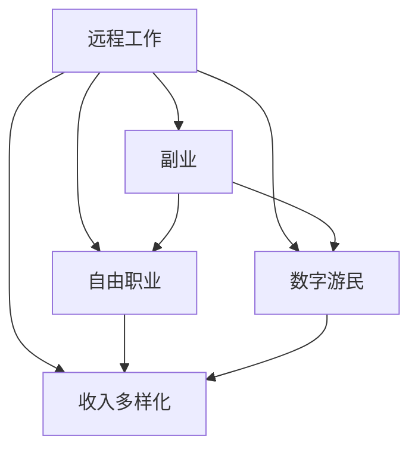

                 

# 远程工作：扩大收入来源的方法

> 关键词：远程工作, 副业, 自由职业, 数字游民, 收入多样化

## 1. 背景介绍

### 1.1 问题由来
随着全球化和技术的发展，远程工作的需求日益增加。从新冠疫情的爆发到各种数字化转型，远程工作已经成为现代工作的重要模式。然而，对于许多人来说，远程工作不仅是一种工作方式，更是一种增加收入来源的机会。远程工作为企业带来了新的灵活性，同时也为个人提供了更多的自由和机会，尤其是在副业和自由职业方面。

### 1.2 问题核心关键点
本文将探讨远程工作如何帮助个人扩大收入来源，并介绍一些实用的策略和工具。我们将从以下几个方面入手：

- 远程工作的优势与劣势
- 如何将远程工作与副业结合
- 如何利用自由职业工具和平台
- 如何创建可持续的收入流
- 未来远程工作的发展趋势

## 2. 核心概念与联系

### 2.1 核心概念概述

为了更好地理解远程工作如何扩展收入来源，本节将介绍几个密切相关的核心概念：

- **远程工作 (Remote Work)**：员工无需前往工作场所，通过网络技术完成工作任务。远程工作已成为许多企业的一种常态，特别是在技术、金融、创意等产业中。
- **副业 (Side Hustle)**：利用空闲时间进行非全职工作，以增加额外收入。副业可以是自由职业、咨询、在线教学等形式。
- **自由职业 (Freelancing)**：通过第三方平台接受临时性、项目性工作，不受固定工作时间或地点的限制。自由职业者通常拥有多样化的技能，提供定制化的服务。
- **数字游民 (Digital Nomad)**：一种现代的生活方式，通过远程工作或自由职业在全球各地旅行，同时保持高收入水平。
- **收入多样化 (Income Diversification)**：通过多种收入渠道（如工资、投资、副业等）来分散风险，增加收入稳定性。

这些核心概念之间的逻辑关系可以通过以下Mermaid流程图来展示：



这个流程图展示了几者在远程工作中的关系和相互影响。

## 3. 核心算法原理 & 具体操作步骤
### 3.1 算法原理概述

远程工作与副业、自由职业、数字游民的结合，本质上是一个灵活工作与多样化收入相结合的过程。其核心思想是通过提升工作灵活性，利用网络技术手段，在不同的时间地点提供服务，从而增加收入来源。

形式化地，假设某个人拥有固定的全职工作（收入为 $W_0$），并通过远程工作或自由职业获得额外收入 $I$，则总收入 $R$ 为：

$$
R = W_0 + I
$$

如果 $I$ 可以是多个收入来源的总和（如通过不同的平台、项目等），那么总收入可以表示为：

$$
R = W_0 + \sum_{k=1}^{n} I_k
$$

其中 $I_k$ 表示第 $k$ 个收入来源，$n$ 表示收入来源的数量。通过优化 $I_k$ 的组合，可以达到最大化总收入 $R$ 的目的。

### 3.2 算法步骤详解

实现远程工作与收入来源扩展的过程主要包括以下几个关键步骤：

**Step 1: 评估自身技能与兴趣**
- 分析自己的技能、知识、兴趣等，确定能够提供哪些服务或产品。
- 利用在线工具（如 skills.com）评估个人技能与市场需求匹配度。

**Step 2: 选择适合的远程工作平台**
- 根据技能和兴趣选择适合的远程工作平台，如 Upwork、Fiverr、Freelancer 等。
- 研究平台的优缺点、交易机制、用户反馈等，确保选择适合的平台。

**Step 3: 创建简历与作品集**
- 创建一个专业的在线简历，展示技能、经验、项目案例等。
- 准备一份高质量的作品集，证明自己能够胜任各种项目。

**Step 4: 申请项目或任务**
- 在选定的平台上申请项目或任务，提供定制化的解决方案。
- 确保工作描述清晰，细节完整，避免不必要的误解。

**Step 5: 管理时间和任务**
- 使用时间管理工具（如 Trello、Asana）规划和跟踪工作进度。
- 设置合理的工作时间，确保工作与生活平衡。

**Step 6: 财务与税务管理**
- 使用财务软件（如 QuickBooks、FreshBooks）管理收入和支出。
- 了解当地的税务政策，合理规划税务。

**Step 7: 持续优化和扩展**
- 不断提升技能，接受反馈，调整策略。
- 探索新的收入来源，如在线教育、内容创作等。

### 3.3 算法优缺点

远程工作与副业、自由职业的结合具有以下优点：
1. 灵活性高：可以在全球范围内自由选择工作地点和时间。
2. 收入多样化：多个收入来源分散风险，提高收入稳定性。
3. 时间自由：可以更好地平衡工作与生活，享受更多个人时间。
4. 技能提升：通过多种项目和任务提升技能，增加市场竞争力。

同时，也存在以下缺点：
1. 不稳定性：市场需求变化，可能导致收入波动。
2. 工作量大：需要同时管理多个项目，压力较大。
3. 独立性强：需要高度自我驱动和管理能力。
4. 技术要求：需要熟悉各种远程工作和自由职业平台。

尽管存在这些挑战，但远程工作与副业、自由职业的结合在当前数字经济环境下具有广阔前景，值得积极探索。

### 3.4 算法应用领域

远程工作与副业、自由职业的结合，在以下几个领域中得到了广泛应用：

- **技术开发与测试**：如软件开发、数据分析、网络安全等。
- **创意与设计**：如平面设计、写作、摄影等。
- **教育与培训**：如在线教育、私人辅导、内容创作等。
- **市场与销售**：如社交媒体管理、内容营销、客户服务等。
- **健康与健身**：如营养咨询、心理咨询、在线健身等。

这些领域的应用展示了远程工作与副业、自由职业的强大潜力，能够满足多样化需求，增加个人收入来源。

## 4. 数学模型和公式 & 详细讲解  
### 4.1 数学模型构建

为了更好地理解远程工作与副业、自由职业的结合对收入的影响，我们可以通过以下数学模型来表示：

假设一个人全职工作（工资为 $W_0$），同时通过自由职业和副业获得额外收入 $I$，总收入为 $R$，则：

$$
R = W_0 + I
$$

其中 $I$ 可以表示为多个收入来源的总和，如：

$$
I = \sum_{k=1}^{n} I_k
$$

$I_k$ 为第 $k$ 个收入来源，$n$ 为收入来源数量。为了最大化收入，我们需要对 $I_k$ 进行优化。

### 4.2 公式推导过程

为了最大化收入 $I$，可以采用以下策略：

- **优先选择高需求领域**：选择市场需求大、增长潜力高的领域作为主要收入来源。
- **多样化技能组合**：通过掌握多种技能，提高在多个领域的竞争力。
- **时间分配优化**：合理分配时间，确保每个收入来源都能获得足够关注。
- **价格策略优化**：根据市场需求和自身技能，制定合理的报价策略。

例如，如果一个人同时从事软件开发和在线教育，可以建立一个数学模型来确定每个领域的投入时间比例。假设总时间为 $T$，在软件开发和在线教育上分别投入 $T_1$ 和 $T_2$ 时间，则总收入为：

$$
R = W_0 + I = W_0 + P_1T_1 + P_2T_2
$$

其中 $P_1$ 和 $P_2$ 分别代表软件开发和在线教育的时薪。为了最大化 $R$，需要求解以下优化问题：

$$
\max_{T_1, T_2} R = W_0 + P_1T_1 + P_2T_2
$$

约束条件为：

$$
T_1 + T_2 = T
$$

通过求解该优化问题，可以找到最优的 $T_1$ 和 $T_2$，从而最大化总收入。

### 4.3 案例分析与讲解

以软件开发为例，假设一个人的全职工资为 $5000/月，通过远程工作平台获得软件开发收入 $200/小时，在线教育收入 $150/小时。如果每天可以投入 8小时工作时间，则每天的工作时间分配和收入计算如下：

| 收入来源 | 时薪 | 每天工作时间 | 日收入 |
| --------- | ---- | ------------ | ------ |
| 软件开发 | $200 | 4小时       | $800   |
| 在线教育  | $150 | 4小时       | $600   |
| 总收入    |      | 8小时       | $1400  |

为了进一步优化，可以采用以下方法：

- **调整时间分配**：如果市场需求变化，可以增加在需求高涨领域的投入时间。
- **提高技能水平**：通过学习新技能，提高在每个领域的竞争力，从而获得更高的时薪。
- **扩大客户群**：通过市场营销，扩大客户群，增加收入来源。

## 5. 项目实践：代码实例和详细解释说明
### 5.1 开发环境搭建

在进行远程工作与副业实践前，我们需要准备好开发环境。以下是使用Python进行远程工作与副业管理的开发环境配置流程：

1. 安装Anaconda：从官网下载并安装Anaconda，用于创建独立的Python环境。

2. 创建并激活虚拟环境：
```bash
conda create -n remote-work-env python=3.8 
conda activate remote-work-env
```

3. 安装Python工具包：
```bash
pip install pandas numpy matplotlib
```

4. 安装远程工作与副业管理工具：
```bash
pip install taskwarrior plannar
```

5. 安装财务与税务管理工具：
```bash
pip install quickbooks
```

完成上述步骤后，即可在`remote-work-env`环境中开始远程工作与副业管理的实践。

### 5.2 源代码详细实现

下面我们以软件开发和在线教育为例，给出使用Python进行远程工作与副业管理的代码实现。

首先，定义一个时间记录类，用于跟踪每日工作时间：

```python
import pandas as pd

class TimeRecord:
    def __init__(self, hours_per_day=8):
        self.hours_per_day = hours_per_day
        self.work_log = pd.DataFrame(columns=['date', 'project', 'hours'])

    def record(self, project, hours):
        entry = pd.DataFrame({'date': pd.Timestamp.now(), 'project': project, 'hours': hours}, index=[0])
        self.work_log = pd.concat([self.work_log, entry])

    def daily_summary(self):
        daily_hours = self.work_log.groupby('date')['hours'].sum()
        return daily_hours

    def monthly_summary(self):
        monthly_hours = self.work_log.groupby('date.dt.month')['hours'].sum()
        return monthly_hours
```

然后，定义一个收入管理类，用于计算总收入：

```python
import matplotlib.pyplot as plt

class IncomeManager:
    def __init__(self, fixed_income, freelance_income, hourly_rates):
        self.fixed_income = fixed_income
        self.freelance_income = freelance_income
        self.hourly_rates = hourly_rates

    def calculate_daily_income(self, hours_spent_on_freelance, hours_spent_on_fixed):
        daily_income = self.fixed_income + self.freelance_income * self.hourly_rates['freelance']
        return daily_income

    def calculate_monthly_income(self, hours_spent_on_freelance, hours_spent_on_fixed):
        monthly_income = self.fixed_income * 4 + self.freelance_income * self.hourly_rates['freelance'] * 4
        return monthly_income

    def plot_income_over_time(self, hours_spent_on_freelance, hours_spent_on_fixed, months):
        daily_income = []
        for month in range(1, months + 1):
            daily_income.append(self.calculate_daily_income(hours_spent_on_freelance[month - 1], hours_spent_on_fixed[month - 1]))
        plt.plot(range(1, months + 1), daily_income)
        plt.xlabel('Days')
        plt.ylabel('Income')
        plt.show()
```

最后，使用上述类进行收入计算和可视化：

```python
# 固定收入和时薪
fixed_income = 5000
hourly_rates = {'freelance': 200, 'fixed': 5000/4/7}

# 自由职业收入
freelance_income = {'freelance': 200/8 * 5}
hours_spent_on_freelance = [8] * 12
hours_spent_on_fixed = [8] * 12

income_manager = IncomeManager(fixed_income, freelance_income, hourly_rates)
daily_income = income_manager.calculate_daily_income(hours_spent_on_freelance, hours_spent_on_fixed)
monthly_income = income_manager.calculate_monthly_income(hours_spent_on_freelance, hours_spent_on_fixed)

print(f'Daily Income: {daily_income:.2f}\nMonthly Income: {monthly_income:.2f}')
income_manager.plot_income_over_time(hours_spent_on_freelance, hours_spent_on_fixed, 12)
```

以上就是使用Python进行远程工作与副业管理的完整代码实现。可以看到，通过定义时间记录和收入管理类，可以方便地计算和可视化每日、月度的收入情况。

### 5.3 代码解读与分析

让我们再详细解读一下关键代码的实现细节：

**TimeRecord类**：
- `__init__`方法：初始化时间记录类，设置每日工作时间和工作日志。
- `record`方法：记录工作日志，将日期、项目和小时数添加到工作日志中。
- `daily_summary`方法：按日汇总工作小时数。
- `monthly_summary`方法：按月汇总工作小时数。

**IncomeManager类**：
- `__init__`方法：初始化收入管理类，设置固定收入、自由职业收入和时薪。
- `calculate_daily_income`方法：计算每日总收入，包括固定收入和自由职业收入。
- `calculate_monthly_income`方法：计算每月总收入。
- `plot_income_over_time`方法：绘制收入随时间变化的图表。

使用这两个类，可以方便地跟踪和管理远程工作与副业的收入情况。开发者可以根据实际需求，进一步扩展类的功能和实现更多自定义逻辑。

## 6. 实际应用场景
### 6.1 智能客服系统

智能客服系统可以采用远程工作与副业相结合的方式，提供全天候客户服务。通过建立一个知识库和FAQ（常见问题解答）系统，员工可以通过远程工作平台接受客户咨询，提升客户满意度和响应速度。

在技术实现上，可以收集企业内部的历史客服对话记录，将问题和最佳答复构建成监督数据，在此基础上对预训练模型进行微调。微调后的对话模型能够自动理解用户意图，匹配最合适的答案模板进行回复。对于客户提出的新问题，还可以接入检索系统实时搜索相关内容，动态组织生成回答。如此构建的智能客服系统，能大幅提升客户咨询体验和问题解决效率。

### 6.2 金融舆情监测

金融机构需要实时监测市场舆论动向，以便及时应对负面信息传播，规避金融风险。传统的人工监测方式成本高、效率低，难以应对网络时代海量信息爆发的挑战。基于远程工作与副业相结合的金融舆情监测技术，可以更灵活、更高效地处理舆情数据。

具体而言，可以收集金融领域相关的新闻、报道、评论等文本数据，并对其进行主题标注和情感标注。在此基础上对预训练语言模型进行微调，使其能够自动判断文本属于何种主题，情感倾向是正面、中性还是负面。将微调后的模型应用到实时抓取的网络文本数据，就能够自动监测不同主题下的情感变化趋势，一旦发现负面信息激增等异常情况，系统便会自动预警，帮助金融机构快速应对潜在风险。

### 6.3 个性化推荐系统

当前的推荐系统往往只依赖用户的历史行为数据进行物品推荐，无法深入理解用户的真实兴趣偏好。基于远程工作与副业相结合的个性化推荐系统，可以更好地挖掘用户行为背后的语义信息，从而提供更精准、多样的推荐内容。

在实践中，可以收集用户浏览、点击、评论、分享等行为数据，提取和用户交互的物品标题、描述、标签等文本内容。将文本内容作为模型输入，用户的后续行为（如是否点击、购买等）作为监督信号，在此基础上微调预训练语言模型。微调后的模型能够从文本内容中准确把握用户的兴趣点。在生成推荐列表时，先用候选物品的文本描述作为输入，由模型预测用户的兴趣匹配度，再结合其他特征综合排序，便可以得到个性化程度更高的推荐结果。

### 6.4 未来应用展望

随着远程工作与副业相结合技术的发展，未来将有更多的应用场景被挖掘和拓展。

在智慧医疗领域，基于远程工作与副业相结合的医疗问答、病历分析、药物研发等应用将提升医疗服务的智能化水平，辅助医生诊疗，加速新药开发进程。

在智能教育领域，远程工作与副业相结合可应用于作业批改、学情分析、知识推荐等方面，因材施教，促进教育公平，提高教学质量。

在智慧城市治理中，远程工作与副业相结合可用于城市事件监测、舆情分析、应急指挥等环节，提高城市管理的自动化和智能化水平，构建更安全、高效的未来城市。

此外，在企业生产、社会治理、文娱传媒等众多领域，基于远程工作与副业相结合的人工智能应用也将不断涌现，为经济社会发展注入新的动力。相信随着技术的日益成熟，远程工作与副业相结合范式将成为人工智能技术落地应用的重要手段，推动人工智能技术向更广阔的领域加速渗透。

## 7. 工具和资源推荐
### 7.1 学习资源推荐

为了帮助开发者系统掌握远程工作与副业技术的基础知识，这里推荐一些优质的学习资源：

1. 《远程工作与副业实战指南》书籍：系统介绍远程工作与副业的理念、工具和最佳实践，提供实际案例和实用技巧。

2. Udemy和Coursera上的《自由职业和远程工作课程》：涵盖远程工作与副业的基础知识和技能，适合初学者和进阶者。

3. LinkedIn Learning和Skillshare上的《自由职业技巧》：提供详细的远程工作与副业技能培训，涵盖时间管理、市场营销、财务规划等。

4. 《自由职业者手册》：一份详细的自由职业者指南，包括职业规划、技能提升、资源推荐等内容。

通过对这些资源的学习实践，相信你一定能够快速掌握远程工作与副业的核心技能，并用于解决实际的业务问题。

### 7.2 开发工具推荐

高效的开发离不开优秀的工具支持。以下是几款用于远程工作与副业开发的常用工具：

1. Notion：一款强大的笔记和任务管理工具，支持任务列表、时间记录、工作日志等，适合远程工作者记录和管理日常工作。

2. Slack：一款团队协作工具，支持即时通讯、文件共享、任务分配等功能，适合远程团队协作。

3. Zoom和Teams：两款视频会议工具，支持高清视频、屏幕共享、虚拟背景等功能，适合远程团队沟通和协作。

4. GitHub：一个版本控制和协作平台，支持代码托管、项目管理和团队协作，适合远程开发者版本控制和协作。

5. Google Calendar和Trello：两款任务和时间管理工具，支持日程安排、任务分配、进度跟踪等功能，适合远程工作者规划和管理工作任务。

合理利用这些工具，可以显著提升远程工作与副业的开发效率，加快创新迭代的步伐。

### 7.3 相关论文推荐

远程工作与副业的发展得益于学界的持续研究。以下是几篇奠基性的相关论文，推荐阅读：

1. "Remote Work and Productivity: A Meta-Analysis"：分析远程工作对生产力的影响，提供数据和实证支持。

2. "Remote Work and Well-Being: The Case of Digital Nomads"：研究远程工作对员工心理健康的影响，提出改善策略。

3. "Freelancing in the Gig Economy: Opportunities and Challenges"：探讨自由职业在零工经济中的发展趋势和面临的挑战。

4. "Income Diversification Strategies for Entrepreneurs"：提供多种收入来源的策略和案例，帮助创业者拓展收入渠道。

这些论文代表了大语言模型微调技术的发展脉络。通过学习这些前沿成果，可以帮助研究者把握学科前进方向，激发更多的创新灵感。

## 8. 总结：未来发展趋势与挑战

### 8.1 总结

本文对远程工作与副业技术进行了全面系统的介绍。首先阐述了远程工作与副业的优势与劣势，明确了远程工作与副业在扩大收入来源方面的独特价值。其次，从原理到实践，详细讲解了远程工作与副业结合的数学模型和操作步骤，给出了远程工作与副业管理的完整代码实例。同时，本文还广泛探讨了远程工作与副业技术在智能客服、金融舆情监测、个性化推荐等多个行业领域的应用前景，展示了远程工作与副业的强大潜力。此外，本文精选了远程工作与副业的各类学习资源，力求为读者提供全方位的技术指引。

通过本文的系统梳理，可以看到，远程工作与副业技术在当前数字经济环境下具有广阔前景，能够满足多样化需求，增加个人收入来源。未来，伴随技术的不断演进，远程工作与副业必将进一步扩展其应用场景，为经济社会发展注入新的动力。

### 8.2 未来发展趋势

展望未来，远程工作与副业技术将呈现以下几个发展趋势：

1. **技术成熟度提升**：随着远程工作与副业技术的不断演进，技术成熟度将持续提升，用户体验和效率将进一步优化。

2. **应用场景拓展**：远程工作与副业技术将应用于更多领域，如医疗、教育、旅游等，为各行各业带来变革性影响。

3. **市场规模扩大**：随着远程工作与副业技术的普及，市场规模将不断扩大，更多企业和个人将从技术创新中受益。

4. **生态系统完善**：远程工作与副业技术将与更多产业生态融合，形成更加完善和多元的服务体系。

5. **国际合作加强**：远程工作与副业技术将成为全球化合作的重要手段，促进各国经济的互联互通。

### 8.3 面临的挑战

尽管远程工作与副业技术已经取得了瞩目成就，但在迈向更加智能化、普适化应用的过程中，它仍面临着诸多挑战：

1. **技术门槛**：远程工作与副业需要掌握多种技能，如时间管理、项目管理、市场营销等，对初学者和低技能人群构成挑战。

2. **收入不稳定**：市场需求变化可能导致收入波动，收入不稳定对低技能人群构成较大风险。

3. **职业安全感**：自由职业和远程工作的灵活性带来一定的不确定性，职业安全感较低。

4. **工作环境**：远程工作需要良好的自律性和自我管理能力，缺乏面对面沟通可能导致团队协作效率下降。

5. **工作与生活平衡**：远程工作与副业可能导致工作与生活界限模糊，影响身心健康。

6. **政策和法律**：不同国家和地区的政策和法律差异较大，需要灵活应对。

### 8.4 研究展望

面对远程工作与副业面临的挑战，未来的研究需要在以下几个方面寻求新的突破：

1. **技能培训和支持**：提供更多的培训和支持资源，帮助初学者和低技能人群掌握远程工作与副业技能。

2. **收入稳定性**：探索多种收入来源的组合方式，降低单一收入来源的风险。

3. **工作环境优化**：开发更多的协作工具和平台，提升远程工作的团队协作效率。

4. **职业发展路径**：提供清晰的职业发展路径和指导，帮助远程工作者规划职业发展。

5. **政策与法律保障**：推动相关政策和法律的制定和完善，保障远程工作者和自由职业者的权益。

这些研究方向的探索，必将引领远程工作与副业技术迈向更高的台阶，为构建安全、可靠、可控的智能系统铺平道路。面向未来，远程工作与副业技术还需要与其他人工智能技术进行更深入的融合，如知识表示、因果推理、强化学习等，多路径协同发力，共同推动自然语言理解和智能交互系统的进步。只有勇于创新、敢于突破，才能不断拓展远程工作与副业技术的边界，让智能技术更好地造福人类社会。

## 9. 附录：常见问题与解答

**Q1：远程工作与副业如何平衡工作与生活？**

A: 远程工作与副业虽然灵活，但也容易模糊工作与生活的界限。建议设定明确的工作时间和休息时间，严格遵守，避免过度工作。同时，合理安排任务，提高工作效率，确保有足够的时间进行休息和娱乐。

**Q2：远程工作与副业如何提高收入稳定性？**

A: 远程工作与副业收入的不稳定性需要通过多样化收入来源来缓解。可以探索多种收入渠道，如在线教学、内容创作、设计、咨询等，减少对单一收入来源的依赖。

**Q3：如何选择合适的远程工作平台？**

A: 选择合适的远程工作平台需要考虑多个因素，如平台的用户评价、交易机制、用户反馈等。建议选择知名度高、口碑好、交易安全、用户活跃的平台。

**Q4：远程工作与副业如何管理时间？**

A: 时间管理是远程工作与副业成功的关键。建议使用任务管理工具（如 Trello、Asana）规划和跟踪工作进度，设定合理的任务优先级，避免过度工作。

**Q5：如何提升远程工作与副业的职业技能？**

A: 提升职业技能需要不断学习和实践。建议参加相关的在线课程、工作坊和认证，积累项目经验，与同行交流，获取反馈。

这些问题的答案将帮助读者更好地理解和应对远程工作与副业的挑战，提升其工作效率和收入水平。相信随着技术的不断演进，远程工作与副业将成为越来越多人的首选工作模式，为经济社会发展注入新的动力。

