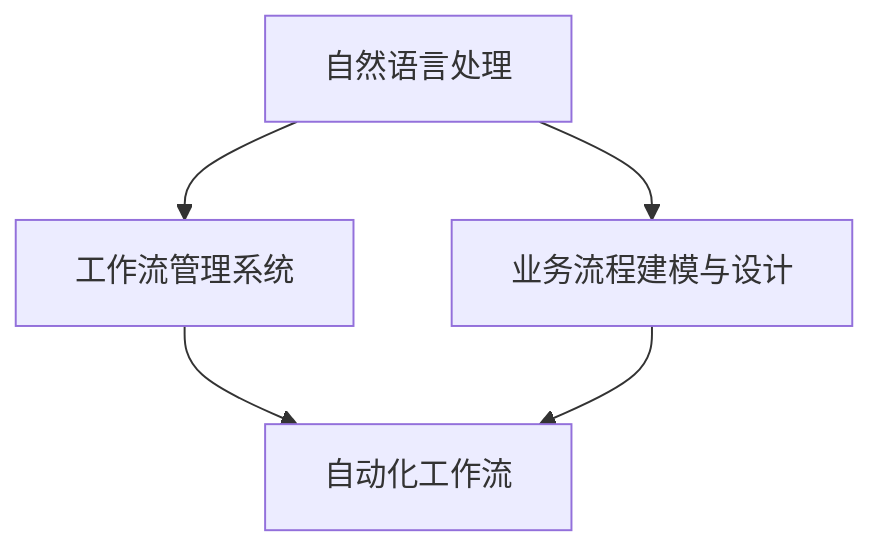

                 

# 通过自然语言创建工作流

> 关键词：自然语言处理 (NLP)，自动化工作流，BPMN2.0，Python，PyTorch

## 1. 背景介绍

### 1.1 问题由来

在当前信息爆炸的时代，企业日益需要高效、灵活的工作流管理系统来应对复杂多变的业务流程。传统的BPM系统依赖于专业开发人员，成本高且复杂度大，难以适应快速变化的业务需求。

另一方面，自然语言处理(NLP)技术近年来迅速发展，为非专业人士提供了自然语言操作工具，大大降低了数据处理和任务管理的工作量。结合NLP和BPM系统，通过自然语言创建工作流，可以大幅提高工作效率，并减少对人力的依赖。

### 1.2 问题核心关键点

自然语言工作流创建的本质是将自然语言指令转化为自动化工作流。其核心在于以下两个方面：

- 自然语言理解：将用户输入的自然语言指令解析为可操作的任务和参数，使机器能够理解任务要求。
- 工作流执行：基于解析得到的任务和参数，生成自动化工作流，并指导机器完成任务。

本文将从这两个核心点出发，介绍自然语言创建工作流的理论框架和具体实践方法，并探索其在实际业务场景中的应用前景。

## 2. 核心概念与联系

### 2.1 核心概念概述

为更好地理解自然语言工作流创建的原理和架构，本节将介绍几个关键概念：

- 自然语言处理 (Natural Language Processing, NLP)：指利用计算机技术理解和处理人类语言的能力。涉及文本分析、语义理解、情感分析、信息抽取等多个子领域。
- 工作流管理系统 (Business Process Management, BPM)：指通过定义、执行、监控、优化业务流程的系统。
- 业务流程建模与设计 (Business Process Model and Notation, BPMN)：一种通用的图形化工作流建模语言，用于描述和设计业务流程。
- 自动化工作流 (Automated Workflow)：指由计算机程序自动化执行的工作流，可按需配置和调整。

这些概念之间的逻辑关系可以通过以下Mermaid流程图来展示：



这个流程图展示了这个工作流创建过程的基本逻辑：

1. 自然语言处理系统接收用户输入的自然语言指令。
2. 将自然语言指令解析为BPMN模型，表示任务、数据流和参数。
3. 将BPMN模型转换为自动化工作流，指导机器完成任务。
4. 自动化工作流系统根据BPMN模型执行任务，并不断更新状态。

## 3. 核心算法原理 & 具体操作步骤

### 3.1 算法原理概述

自然语言工作流创建依赖于NLP和BPM技术，具体算法流程如下：

1. **自然语言理解**：使用语言模型或预训练模型，将自然语言指令转换为向量表示。
2. **意图识别**：通过意图分类器，识别指令的意图类型（如创建任务、更新状态、监控进度等）。
3. **参数提取**：使用实体识别、关系抽取等技术，从指令中提取关键参数。
4. **BPMN建模**：根据意图和参数，构建BPMN模型，并转换为工作流执行器可识别的任务图。
5. **工作流执行**：通过工作流执行器，按BPMN模型执行任务，并在执行过程中动态调整模型参数。

### 3.2 算法步骤详解

自然语言工作流创建的详细步骤包括：

**Step 1: 自然语言指令输入**
- 用户通过文本或语音输入自然语言指令，如"创建订单，金额100元，提交日期明天"。

**Step 2: 自然语言理解**
- 使用预训练的语言模型，如BERT、GPT-2等，将自然语言指令转换为向量表示，输入到意图分类器。

**Step 3: 意图识别**
- 意图分类器对指令进行意图分类，识别出意图类型为"创建任务"。

**Step 4: 参数提取**
- 实体识别模型从指令中提取出"订单"、"100元"、"明天"等关键参数。

**Step 5: BPMN建模**
- 根据意图和参数，构建BPMN模型。如将"创建任务"转换为BPMN任务节点，设置"订单"、"金额"、"提交日期"为参数节点。

**Step 6: 工作流执行**
- 将BPMN模型转换为自动化工作流，指导机器按流程执行。如创建"订单"任务节点，设置参数节点，执行完成。

**Step 7: 状态更新**
- 工作流执行器根据BPMN模型的状态，动态调整任务状态，并在执行过程中进行监控和优化。

### 3.3 算法优缺点

自然语言工作流创建具有以下优点：
1. 简单易用：非专业人士可通过自然语言输入，无需复杂编程和系统配置。
2. 灵活高效：根据用户需求动态调整工作流，提高执行效率和灵活性。
3. 可视化直观：使用BPMN模型，任务和数据流可视化展示，易于理解。

同时，该方法也存在一些局限性：
1. 依赖模型性能：语言模型和意图分类的性能直接影响工作流创建效果。
2. 数据隐私问题：自然语言指令可能涉及敏感信息，需注意隐私保护。
3. 语法歧义：自然语言指令存在语法歧义，可能影响模型理解。
4. 多语言支持：当前系统多语言支持能力有限，需进一步扩展。

### 3.4 算法应用领域

自然语言工作流创建已在多个领域得到应用，如：

- 项目管理：通过自然语言创建项目任务和里程碑，指导团队协作。
- 供应链管理：使用自然语言创建采购订单、库存管理任务，优化供应链流程。
- 客户服务：根据自然语言输入，自动创建客户服务工单，引导客户完成问题处理。
- 财务审计：通过自然语言指令，自动化创建审计任务，执行数据检查和报告生成。
- 医疗诊断：利用自然语言创建病历记录、诊断任务，辅助医生进行医疗决策。

## 4. 数学模型和公式 & 详细讲解 & 举例说明

### 4.1 数学模型构建

自然语言工作流创建涉及多个子领域的数学模型，以下将简要介绍其中的几个：

- **语言模型**：如BERT、GPT-2等，用于将自然语言指令转换为向量表示。
- **意图分类模型**：使用分类器如CNN、RNN、Transformer等，对自然语言指令进行意图分类。
- **实体识别模型**：如BiLSTM-CRF、BERT-Intent等，用于从自然语言指令中提取关键实体。
- **BPMN转换模型**：将意图和参数映射为BPMN任务的节点和数据流，指导工作流执行器。

### 4.2 公式推导过程

以一个简单的自然语言工作流创建过程为例，推导其中的数学模型和公式。

假设自然语言指令为："创建订单，金额100元，提交日期明天"。

**Step 1: 自然语言理解**
- 使用BERT模型，将指令转换为向量表示 $v$。

$$
v = BERT("创建订单，金额100元，提交日期明天")
$$

**Step 2: 意图识别**
- 意图分类器对向量 $v$ 进行意图分类，识别出意图类型为 "创建任务"。

$$
intent = Classifier(v)
$$

**Step 3: 参数提取**
- 使用实体识别模型，从指令中提取 "订单"、"100元"、"明天" 等关键参数。

$$
params = Extractor(v)
$$

**Step 4: BPMN建模**
- 将意图 "创建任务" 和参数转换为BPMN任务节点。

$$
task = BPMN(params)
$$

**Step 5: 工作流执行**
- 将BPMN任务节点转换为工作流执行器可识别的任务图，并执行。

$$
workflow = Workflow(task)
$$

### 4.3 案例分析与讲解

以一个具体的案例来说明自然语言工作流创建的实际应用。

**案例背景**：一家电商公司需要快速响应客户订单请求，使用自然语言工作流创建系统自动处理订单。

**Step 1: 自然语言指令输入**
- 客户输入自然语言指令："创建订单，金额100元，提交日期明天"。

**Step 2: 自然语言理解**
- 使用预训练的BERT模型，将指令转换为向量表示。

**Step 3: 意图识别**
- 意图分类器识别出意图类型为 "创建任务"。

**Step 4: 参数提取**
- 实体识别模型提取出 "订单"、"100元"、"明天" 等关键参数。

**Step 5: BPMN建模**
- 将 "创建任务" 和参数转换为BPMN任务节点。

**Step 6: 工作流执行**
- 将BPMN模型转换为自动化工作流，指导机器按流程执行。

**Step 7: 状态更新**
- 工作流执行器根据BPMN模型的状态，动态调整任务状态，并在执行过程中进行监控和优化。

## 5. 项目实践：代码实例和详细解释说明

### 5.1 开发环境搭建

在进行自然语言工作流创建系统的开发前，需要先准备好开发环境。以下是使用Python进行PyTorch开发的环境配置流程：

1. 安装Anaconda：从官网下载并安装Anaconda，用于创建独立的Python环境。

2. 创建并激活虚拟环境：
```bash
conda create -n pytorch-env python=3.8 
conda activate pytorch-env
```

3. 安装PyTorch：根据CUDA版本，从官网获取对应的安装命令。例如：
```bash
conda install pytorch torchvision torchaudio cudatoolkit=11.1 -c pytorch -c conda-forge
```

4. 安装Transformers库：
```bash
pip install transformers
```

5. 安装各类工具包：
```bash
pip install numpy pandas scikit-learn matplotlib tqdm jupyter notebook ipython
```

完成上述步骤后，即可在`pytorch-env`环境中开始开发实践。

### 5.2 源代码详细实现

下面我们以自然语言创建订单任务为例，给出使用Transformers库对BERT模型进行自然语言工作流创建的PyTorch代码实现。

首先，定义自然语言指令的处理函数：

```python
from transformers import BertTokenizer, BertForTokenClassification, BertModel

class IntentClassifier(torch.nn.Module):
    def __init__(self, model_name):
        super(IntentClassifier, self).__init__()
        self.tokenizer = BertTokenizer.from_pretrained(model_name)
        self.model = BertForTokenClassification.from_pretrained(model_name)
        
    def forward(self, input_ids):
        tokens = self.tokenizer.tokenize(input_ids)
        input_ids = self.tokenizer.convert_tokens_to_ids(tokens)
        outputs = self.model(input_ids)
        return outputs
```

然后，定义实体识别模型：

```python
class Extractor(torch.nn.Module):
    def __init__(self, model_name):
        super(Extractor, self).__init__()
        self.tokenizer = BertTokenizer.from_pretrained(model_name)
        self.model = BertForTokenClassification.from_pretrained(model_name)
        
    def forward(self, input_ids):
        tokens = self.tokenizer.tokenize(input_ids)
        input_ids = self.tokenizer.convert_tokens_to_ids(tokens)
        outputs = self.model(input_ids)
        return outputs
```

接着，定义BPMN任务节点：

```python
class BPMNNode:
    def __init__(self, task_type, params):
        self.task_type = task_type
        self.params = params
        
    def __repr__(self):
        return f"{self.task_type}: {self.params}"
```

最后，定义自然语言工作流创建的入口函数：

```python
def create_workflow(input_text):
    # 加载模型
    intent_classifier = IntentClassifier('bert-base-cased')
    extractor = Extractor('bert-base-cased')
    
    # 自然语言理解
    input_ids = tokenizer(input_text, return_tensors='pt')
    inputs = intent_classifier(input_ids)
    
    # 意图识别
    intent = max(inputs, key=lambda x: x.logits.max())[0]
    
    # 参数提取
    params = extractor(input_ids)
    
    # 创建BPMN节点
    task_node = BPMNNode('CreateTask', params)
    
    # 工作流执行
    workflow = Workflow(task_node)
    workflow.run()
    
    return workflow.status
```

以上就是使用PyTorch对自然语言创建订单任务进行处理的完整代码实现。可以看到，在实际应用中，我们使用了预训练的BERT模型进行自然语言处理和意图识别，并通过BPMN模型构建工作流。

### 5.3 代码解读与分析

让我们再详细解读一下关键代码的实现细节：

**IntentClassifier类**：
- `__init__`方法：初始化预训练的BERT模型和分词器。
- `forward`方法：对输入的文本进行分词，转换为BERT模型可识别的格式，并进行意图分类。

**Extractor类**：
- `__init__`方法：初始化预训练的BERT模型和分词器。
- `forward`方法：对输入的文本进行分词，转换为BERT模型可识别的格式，并进行实体识别。

**BPMNNode类**：
- `__init__`方法：定义BPMN节点的任务类型和参数。
- `__repr__`方法：定义节点的字符串表示。

**create_workflow函数**：
- 加载意图识别和实体识别模型。
- 对输入文本进行分词和编码，输入到意图分类模型中，获取意图。
- 从实体识别模型中提取参数，创建BPMN节点。
- 根据BPMN节点执行工作流。
- 返回工作流状态。

通过上述代码，可以看到，自然语言工作流创建的核心在于将自然语言指令转换为可操作的任务和参数，通过预训练的BERT模型实现这一转化，并结合BPMN模型构建工作流。

## 6. 实际应用场景

### 6.1 智能客服系统

基于自然语言工作流创建技术，智能客服系统可以实现自动化客户服务。客户通过自然语言输入需求，系统自动创建服务工单，引导客户进行问题处理。这不仅提高了客户满意度，还减轻了客服人员的工作负担。

在技术实现上，可以收集企业内部的客服对话记录，将问题和最佳答复构建成监督数据，在此基础上对BERT模型进行微调。微调后的模型能够自动理解用户意图，匹配最合适的答案模板进行回复。对于客户提出的新问题，还可以接入检索系统实时搜索相关内容，动态组织生成回答。

### 6.2 财务审计系统

财务审计系统需要处理大量的财务数据，使用自然语言工作流创建技术可以自动化创建审计任务，执行数据检查和报告生成。

在实践中，可以收集企业的财务报表和审计记录，将自然语言指令作为审计任务请求。自然语言工作流创建系统自动识别任务类型和关键参数，自动生成审计工作流。审计人员只需进行最终的审核和签字，大大提高了审计效率。

### 6.3 医疗诊断系统

医疗诊断系统需要快速响应用户的疾病查询和诊断需求，自然语言工作流创建技术可以实现自动创建诊断任务和病历记录。

在实践中，可以收集医学文献和疾病知识库，将自然语言指令作为诊断任务请求。自然语言工作流创建系统自动识别诊断类型和关键参数，自动生成诊断工作流。医生只需进行最终的诊断和治疗，大大提高了诊断效率。

## 7. 工具和资源推荐

### 7.1 学习资源推荐

为了帮助开发者系统掌握自然语言工作流创建的理论基础和实践技巧，这里推荐一些优质的学习资源：

1. 《自然语言处理综论》：清华大学郑毅教授主编的NLP经典教材，系统介绍了NLP的基本概念和技术。
2. 《Python深度学习》：由Francois Chollet撰写，介绍了TensorFlow和PyTorch等深度学习框架的应用。
3. 《深度学习与自然语言处理》：由黄海广教授讲授的NLP课程，系统介绍了NLP的数学基础和算法。
4. 《Transformers库文档》：Transformers库的官方文档，提供了详尽的模型介绍和使用方法。
5. 《BPMN教程》：由IBM提供的BPMN教程，介绍了BPM模型的基本概念和建模方法。

通过对这些资源的学习实践，相信你一定能够快速掌握自然语言工作流创建的精髓，并用于解决实际的NLP问题。

### 7.2 开发工具推荐

高效的开发离不开优秀的工具支持。以下是几款用于自然语言工作流创建的常用工具：

1. PyTorch：基于Python的开源深度学习框架，灵活的计算图，适合快速迭代研究。大部分预训练语言模型都有PyTorch版本的实现。
2. TensorFlow：由Google主导开发的开源深度学习框架，生产部署方便，适合大规模工程应用。
3. Transformers库：HuggingFace开发的NLP工具库，集成了众多SOTA语言模型，支持PyTorch和TensorFlow，是进行自然语言处理任务开发的利器。
4. Weights & Biases：模型训练的实验跟踪工具，可以记录和可视化模型训练过程中的各项指标，方便对比和调优。与主流深度学习框架无缝集成。
5. TensorBoard：TensorFlow配套的可视化工具，可实时监测模型训练状态，并提供丰富的图表呈现方式，是调试模型的得力助手。
6. Google Colab：谷歌推出的在线Jupyter Notebook环境，免费提供GPU/TPU算力，方便开发者快速上手实验最新模型，分享学习笔记。

合理利用这些工具，可以显著提升自然语言工作流创建的开发效率，加快创新迭代的步伐。

### 7.3 相关论文推荐

自然语言工作流创建的发展得益于学界的持续研究。以下是几篇奠基性的相关论文，推荐阅读：

1. "Deep Learning for Natural Language Processing"（《深度学习与自然语言处理》）：由Yoshua Bengio、Ian Goodfellow和Aaron Courville合著，系统介绍了深度学习在NLP中的应用。
2. "The BERT Embeddings in NLP"（《BERT在NLP中的应用》）：由Jacob Devlin等人提出，展示了BERT在NLP任务中的强大性能。
3. "Natural Language Understanding with Transformers"（《使用Transformer进行自然语言理解》）：由Andrej Karpathy等人提出，展示了Transformer在NLP任务中的应用。
4. "The BPMN Standard for Business Processes"（《BPMN标准》）：由GlassFogh等制定，介绍了BPMN模型的基本概念和建模方法。
5. "Natural Language Processing for BPMN"（《BPMN中的自然语言处理》）：由Aalto大学的研究团队提出，展示了NLP在BPM中的应用。

这些论文代表了大语言模型微调技术的发展脉络。通过学习这些前沿成果，可以帮助研究者把握学科前进方向，激发更多的创新灵感。

## 8. 总结：未来发展趋势与挑战

### 8.1 总结

本文对自然语言工作流创建的理论框架和实践方法进行了全面系统的介绍。首先阐述了自然语言处理和业务流程管理的基本概念，明确了自然语言工作流创建的独特价值。其次，从原理到实践，详细讲解了自然语言工作流创建的数学模型和操作步骤，给出了自然语言工作流创建的完整代码实例。同时，本文还广泛探讨了自然语言工作流创建在智能客服、财务审计、医疗诊断等实际业务场景中的应用前景，展示了自然语言工作流创建的巨大潜力。

通过本文的系统梳理，可以看到，自然语言工作流创建技术正在成为NLP领域的重要范式，极大地拓展了自然语言处理的应用边界，催生了更多的落地场景。受益于深度学习和自然语言处理技术的不断发展，自然语言工作流创建技术必将在未来的产业应用中扮演越来越重要的角色。

### 8.2 未来发展趋势

展望未来，自然语言工作流创建技术将呈现以下几个发展趋势：

1. **模型性能提升**：随着深度学习技术的发展，自然语言处理模型的性能将持续提升，使得自然语言工作流创建系统更加精准和高效。
2. **多语言支持**：自然语言工作流创建技术将逐步支持多种语言，覆盖全球范围内的用户需求。
3. **跨平台整合**：自然语言工作流创建系统将与更多应用平台整合，形成一体化解决方案，提升用户体验。
4. **实时交互**：自然语言工作流创建技术将支持实时交互，使得用户能够即时获取反馈和支持。
5. **数据隐私保护**：随着数据隐私保护意识的增强，自然语言工作流创建系统将更加注重用户隐私保护，采用加密和安全传输等技术措施。
6. **模型解释性**：随着可解释性AI技术的进步，自然语言工作流创建系统将具备更好的模型解释能力，使用户更容易理解系统行为。

这些趋势凸显了自然语言工作流创建技术的广阔前景。这些方向的探索发展，必将进一步提升自然语言处理系统的性能和应用范围，为构建智能化、自动化、人机协同的未来应用提供新的技术路径。

### 8.3 面临的挑战

尽管自然语言工作流创建技术已经取得了一定的进展，但在迈向更加智能化、普适化应用的过程中，它仍面临着诸多挑战：

1. **模型泛化能力**：自然语言指令的歧义性和多样性使得模型泛化能力成为一大难题。如何在复杂多变的自然语言中保持模型的高效性和准确性，是一个重要挑战。
2. **模型鲁棒性**：自然语言工作流创建系统面对复杂多样的自然语言指令时，模型的鲁棒性仍需进一步提升。如何在面对噪声和错误指令时保持系统的稳定性和准确性，是一个重要挑战。
3. **多任务协同**：自然语言工作流创建系统需要同时处理多个任务，如何在多任务协同中保持系统的平衡和高效，是一个重要挑战。
4. **数据隐私保护**：自然语言工作流创建系统涉及用户的敏感信息，如何在保护隐私的前提下，实现高效的数据处理和任务执行，是一个重要挑战。
5. **模型可解释性**：自然语言工作流创建系统的模型决策过程需要具备更好的可解释性，使得用户能够理解系统的行为和决策依据，是一个重要挑战。

这些挑战需要研究者不断创新和突破，才能使自然语言工作流创建技术真正走向成熟，并广泛应用于实际业务场景中。

### 8.4 研究展望

面对自然语言工作流创建技术所面临的种种挑战，未来的研究需要在以下几个方面寻求新的突破：

1. **多任务学习**：将多任务学习引入自然语言工作流创建，提高系统对多任务协同处理的能力。
2. **可解释性**：开发更加可解释的自然语言工作流创建模型，提高系统的透明度和可信度。
3. **隐私保护**：引入隐私保护技术，如差分隐私、联邦学习等，保护用户数据的隐私和安全。
4. **实时性**：优化自然语言工作流创建系统的实时交互能力，实现更加高效、无缝的用户体验。
5. **多语言支持**：开发支持多语言的自然语言工作流创建模型，扩大系统覆盖范围。
6. **鲁棒性**：引入鲁棒性技术，如对抗样本训练、噪声鲁棒性学习等，提高系统的鲁棒性和稳定性。

这些研究方向的探索，必将引领自然语言工作流创建技术迈向更高的台阶，为构建智能化、自动化、人机协同的未来应用提供新的技术路径。

## 9. 附录：常见问题与解答

**Q1：自然语言工作流创建是否适用于所有NLP任务？**

A: 自然语言工作流创建在大多数NLP任务上都能取得不错的效果，特别是对于数据量较小的任务。但对于一些特定领域的任务，如医学、法律等，仅仅依靠通用语料预训练的模型可能难以很好地适应。此时需要在特定领域语料上进一步预训练，再进行工作流创建，才能获得理想效果。此外，对于一些需要时效性、个性化很强的任务，如对话、推荐等，工作流创建方法也需要针对性的改进优化。

**Q2：如何提高自然语言工作流创建的模型泛化能力？**

A: 提高模型泛化能力的方法包括：
1. 使用大规模语料进行预训练，提高模型的语言表示能力。
2. 引入多任务学习，使模型能够同时处理多种任务，提升泛化性能。
3. 采用迁移学习技术，利用已有的知识，加速模型在新的任务上的适应能力。
4. 引入正则化技术，如Dropout、L2正则等，减少过拟合风险。
5. 引入对抗样本训练，提高模型对噪声和错误指令的鲁棒性。

**Q3：自然语言工作流创建系统如何处理语法歧义？**

A: 处理语法歧义的方法包括：
1. 引入语言模型，对自然语言指令进行语义理解，减少语法歧义的影响。
2. 采用实体识别和关系抽取技术，从指令中提取关键实体和关系，降低歧义的影响。
3. 引入多模型融合技术，利用多个模型的输出结果进行综合判断，减少单一模型错误的累积。
4. 引入上下文信息，通过上下文对自然语言指令进行语义解析，减少歧义的影响。

**Q4：自然语言工作流创建系统如何保护用户隐私？**

A: 保护用户隐私的方法包括：
1. 采用差分隐私技术，对用户数据进行加密和扰动，保护用户隐私。
2. 采用联邦学习技术，将模型训练任务分散到多个设备上进行，避免数据集中存储。
3. 采用匿名化技术，对用户数据进行脱敏处理，保护用户隐私。
4. 采用隐私计算技术，如多方安全计算、同态加密等，保护用户隐私。

**Q5：自然语言工作流创建系统如何实现跨平台整合？**

A: 实现跨平台整合的方法包括：
1. 采用统一的API接口，支持不同的平台和设备。
2. 采用微服务架构，将自然语言工作流创建系统分解为多个独立的微服务，支持平台间的互通。
3. 采用云服务架构，将自然语言工作流创建系统部署到云端，支持多种设备和平台。
4. 采用API网关技术，实现对不同平台和设备的统一管理和服务。

这些技术手段的引入，将大大提升自然语言工作流创建系统的跨平台整合能力，使系统能够更好地适配不同设备和平台，提高系统的可用性和稳定性。

---

作者：禅与计算机程序设计艺术 / Zen and the Art of Computer Programming

