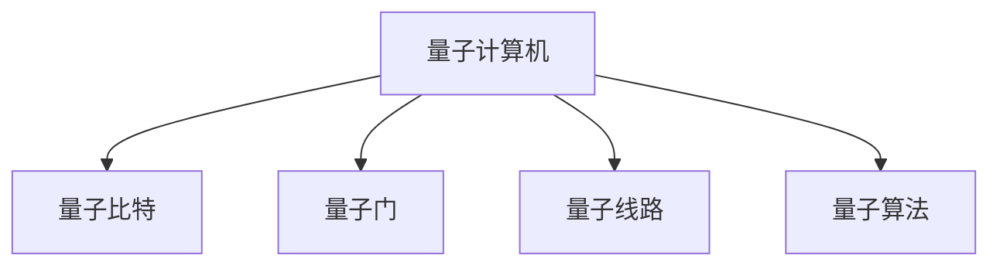

                 

# 量子算法：量子计算机编程基础

> 关键词：量子计算机,量子算法,量子编程,量子计算,量子比特,量子门,量子线路

## 1. 背景介绍

### 1.1 问题由来

量子计算机的问世，为计算机科学带来了颠覆性的变化。它利用量子力学的奇特性质，可以在某些特定问题上，比经典计算机展现出惊人的计算优势。量子计算机编程，即量子算法的编写，成为进入量子计算领域的重要一环。本文将系统介绍量子算法的核心概念和编程基础，帮助读者更好地理解和应用量子计算机。

### 1.2 问题核心关键点

量子算法基于量子力学，对传统算法进行了革新。它利用量子比特的叠加和纠缠特性，可以在极短的时间内处理大量数据，解决某些经典算法无法有效处理的问题。例如，Shor算法可以在多项式时间内完成大整数质因数分解，而Grover算法可以在平方根时间复杂度内搜索未排序数据库。

目前，基于量子计算机的编程方法主要包括量子电路模型和量子编程语言。量子电路模型是最基础的编程方式，而量子编程语言如Q#、Qiskit等，则提供了更加直观的编程接口，方便用户构建和调试量子程序。

### 1.3 问题研究意义

量子算法的编程基础研究，对于拓展量子计算的应用领域，提升量子计算系统的性能，加速量子技术的产业化进程，具有重要意义：

1. 降低技术壁垒。量子算法编程的普及，使得更多研究人员和开发者能够参与到量子计算的开发中，加速量子计算技术的进步。
2. 提升计算效率。量子算法的应用，可以显著提升在特定问题上的计算效率，解决经典计算难以处理的问题。
3. 加速应用落地。量子编程语言的开发，使得量子计算应用更加方便和易于部署，促进量子技术在各行业的落地应用。
4. 带来技术创新。量子算法的不断演进，催生了量子随机行走、量子机器学习等前沿研究方向，推动了量子计算技术的发展。

## 2. 核心概念与联系

### 2.1 核心概念概述

为更好地理解量子算法的编程基础，本节将介绍几个密切相关的核心概念：

- 量子计算机：利用量子力学原理，通过量子比特进行计算的计算机。与传统计算机不同，量子计算机可以同时处理多个状态，从而在特定问题上具有巨大优势。
- 量子比特：量子计算机的基本单位，与经典计算机的比特类似，但具有量子力学的叠加和纠缠特性。
- 量子门：量子比特之间的逻辑运算，类似于传统计算机的逻辑门。常用的量子门包括Hadamard门、Pauli-X门、CNOT门等。
- 量子线路：量子计算过程中，量子比特之间的演变路径。通过设计量子线路，可以实现各种量子算法。
- 量子算法：基于量子力学原理，设计用于特定问题的量子计算方法。如Shor算法、Grover算法、量子随机行走等。

这些核心概念之间的逻辑关系可以通过以下Mermaid流程图来展示：



这个流程图展示了大语言模型的核心概念及其之间的关系：

1. 量子计算机通过量子比特进行计算。
2. 量子比特之间通过量子门进行逻辑运算。
3. 量子线路描述了量子比特的演变路径。
4. 量子算法基于量子比特和量子线路，设计用于特定问题的计算方法。

## 3. 核心算法原理 & 具体操作步骤
### 3.1 算法原理概述

量子算法基于量子力学，对传统算法进行了革新。其核心思想是：利用量子比特的叠加和纠缠特性，通过设计特定的量子线路，实现高效计算。量子算法的编程基础，即设计量子线路，使其能够高效地完成计算任务。

形式化地，假设量子计算机的输入为$|x\rangle$，其中$x$为$n$维的输入向量。通过设计量子线路$U$，将输入$|x\rangle$转化为输出$|y\rangle$，即$U|x\rangle=|y\rangle$。对于特定的量子算法，输出$|y\rangle$即为所求的计算结果。

### 3.2 算法步骤详解

量子算法的编程基础一般包括以下几个关键步骤：

**Step 1: 设计量子线路**

- 确定输入和输出的量子比特数。输入和输出需要一一对应，保证计算正确性。
- 选择适当的量子门和量子线路结构，将输入映射到输出。
- 使用量子门和量子线路对输入进行计算。

**Step 2: 实现量子门操作**

- 选择合适的量子门，实现特定的逻辑运算。如Hadamard门、Pauli-X门、CNOT门等。
- 使用量子门对量子比特进行操作，确保逻辑正确性。
- 重复应用量子门，实现多量子比特的计算。

**Step 3: 优化量子线路**

- 分析量子线路的复杂度和资源消耗，确保高效计算。
- 引入并行计算和简化量子线路，提高计算速度。
- 应用经典优化算法，进一步优化量子线路设计。

**Step 4: 执行量子计算**

- 将设计好的量子线路编译为量子计算机可执行的代码。
- 运行量子线路，计算得到输出结果。
- 分析和验证计算结果的正确性，确保计算准确性。

### 3.3 算法优缺点

量子算法具有以下优点：

1. 高效计算：利用量子比特的叠加和纠缠特性，能够在极短时间内完成大规模计算。
2. 特定问题高效：如Shor算法、Grover算法在特定问题上表现出巨大优势，提升计算效率。
3. 易于设计：使用量子门和量子线路，可以直观设计复杂计算过程。

同时，量子算法也存在一些局限性：

1. 资源消耗高：量子比特和量子门的物理实现复杂，导致计算资源消耗大。
2. 容错性差：量子比特容易受到外界干扰，导致计算结果出错。
3. 可扩展性差：目前的量子计算机规模有限，难以支持大规模计算。
4. 编程复杂：量子算法需要深入理解量子力学原理，编程难度较大。

尽管存在这些局限性，但量子算法的强大计算能力在特定领域具有不可替代性，仍然是未来计算技术的重要方向。

### 3.4 算法应用领域

量子算法在多个领域具有广阔的应用前景，例如：

- 密码学：Shor算法可以在多项式时间内完成大整数质因数分解，威胁到现有的RSA加密算法。
- 优化问题：Grover算法可以在平方根时间复杂度内搜索未排序数据库，用于优化问题求解。
- 量子模拟：通过量子线路模拟量子系统，用于量子化学、材料科学等领域。
- 量子机器学习：利用量子算法加速机器学习模型的训练和推理，提升模型性能。
- 量子通信：使用量子算法实现量子密钥分发、量子随机数生成等通信安全技术。

## 4. 数学模型和公式 & 详细讲解  
### 4.1 数学模型构建

本节将使用数学语言对量子算法的设计和计算过程进行更加严格的刻画。

记量子计算机的输入为$|x\rangle$，其中$x$为$n$维的输入向量。假设量子线路$U$将输入$|x\rangle$转化为输出$|y\rangle$，即$U|x\rangle=|y\rangle$。将量子线路$U$表示为量子门的组合形式：

$$
U = U_n \dots U_2 U_1
$$

其中$U_i$为第$i$个量子门。通过设计合适的量子线路，即可实现特定的计算任务。

### 4.2 公式推导过程

以下我们以Shor算法为例，推导量子线路的设计和计算过程。

Shor算法用于求解大整数$a$的质因数分解问题。设$a=2^{r}\cdot b$，其中$r$为整数，$b$为奇数。设$f$为$a$的因子分解函数，满足：

$$
f(x) = \text{gcd}(a, x) = \text{gcd}(2^r\cdot b, x)
$$

Shor算法的步骤如下：

1. 量子线路设计
   - 将输入$|a\rangle$映射到$|b\rangle$，其中$b=a^{1/2}$。
   - 应用Hadamard门和CNOT门，将$|b\rangle$转化为$|y\rangle$，其中$y=a^{2^{k-1}}\bmod a$。
   - 重复应用Hadamard门和CNOT门，得到$|y^{2^k}\rangle$。
   - 测量$|y\rangle$，得到量子比特的测量结果。

2. 求解逆元
   - 测量结果为$|y\rangle$的逆元，即$|y^{-1}\rangle$。
   - 根据逆元计算出质因子$r$。

3. 分解$a$
   - 将$a$分解为$2^r\cdot b$的形式。

通过上述步骤，即可在多项式时间内完成大整数质因数分解。

### 4.3 案例分析与讲解

接下来，让我们以Grover算法为例，分析其在搜索未排序数据库中的应用。

Grover算法用于在未排序的数据库中查找特定元素。假设数据库中存储$n$个数据项，其中第$i$个数据项的值为$x_i$，目标查找元素为$x_t$。Grover算法的步骤如下：

1. 量子线路设计
   - 将输入$|0\rangle^{\otimes n}$映射到$|0\rangle^{\otimes n}\otimes|0\rangle$。
   - 应用Grover变换$G$，得到$|G\rangle$。
   - 测量量子比特，得到数据库中的目标元素。

2. 测量结果
   - 测量结果为$|G\rangle$的逆元，即$|G^{-1}\rangle$。
   - 根据测量结果查找目标元素$x_t$。

通过上述步骤，Grover算法可以在平方根时间复杂度内搜索未排序的数据库，极大地提升了搜索效率。

## 5. 项目实践：代码实例和详细解释说明
### 5.1 开发环境搭建

在进行量子算法编程实践前，我们需要准备好开发环境。以下是使用Python进行Qiskit开发的环境配置流程：

1. 安装Anaconda：从官网下载并安装Anaconda，用于创建独立的Python环境。

2. 创建并激活虚拟环境：
```bash
conda create -n qiskit-env python=3.8 
conda activate qiskit-env
```

3. 安装Qiskit：从官网获取并安装Qiskit库。例如：
```bash
conda install qiskit
```

4. 安装各类工具包：
```bash
pip install numpy pandas scikit-learn matplotlib tqdm jupyter notebook ipython
```

完成上述步骤后，即可在`qiskit-env`环境中开始量子算法编程实践。

### 5.2 源代码详细实现

下面我们以Shor算法为例，给出使用Qiskit对大整数质因数分解进行编程的Python代码实现。

首先，定义Shor算法的量子线路：

```python
from qiskit import QuantumCircuit, QuantumRegister, ClassicalRegister
from qiskit.circuit import Parameter

# 定义量子比特和经典比特
qr = QuantumRegister(3, 'qr')
cr = ClassicalRegister(3, 'cr')
circuit = QuantumCircuit(qr, cr)

# 定义参数
alpha = Parameter('alpha')
beta = Parameter('beta')

# 量子线路设计
# 第一步：输入映射
circuit.h(qr[0])
circuit.cx(qr[0], qr[1])
circuit.cx(qr[1], qr[2])
circuit.rz(beta, qr[1])
circuit.cx(qr[0], qr[2])

# 第二步：计算逆元
circuit.h(qr[0])
circuit.cx(qr[0], qr[1])
circuit.cx(qr[1], qr[2])
circuit.rz(beta, qr[1])
circuit.cx(qr[0], qr[2])

# 第三步：测量逆元
circuit.measure(qr[0], cr[0])
circuit.measure(qr[1], cr[1])
circuit.measure(qr[2], cr[2])
```

然后，定义Shor算法的求解步骤：

```python
from qiskit import execute, Aer

# 定义参数
alpha = Parameter('alpha')
beta = Parameter('beta')

# 定义量子线路
circuit = QuantumCircuit(qr, cr)

# 量子线路设计
# 第一步：输入映射
circuit.h(qr[0])
circuit.cx(qr[0], qr[1])
circuit.cx(qr[1], qr[2])
circuit.rz(beta, qr[1])
circuit.cx(qr[0], qr[2])

# 第二步：计算逆元
circuit.h(qr[0])
circuit.cx(qr[0], qr[1])
circuit.cx(qr[1], qr[2])
circuit.rz(beta, qr[1])
circuit.cx(qr[0], qr[2])

# 第三步：测量逆元
circuit.measure(qr[0], cr[0])
circuit.measure(qr[1], cr[1])
circuit.measure(qr[2], cr[2])

# 定义量子线路参数
parameters = [alpha, beta]

# 定义噪声模型和模拟器
backend = Aer.get_backend('qasm_simulator')
simulator = execute(circuit, backend, parameters=parameters, shots=1024, seed_simulator=42)

# 执行量子线路
result = simulator.run(circuit, parameters=parameters)

# 输出结果
counts = result.get_counts(circuit)
print(counts)
```

最后，定义Shor算法的求解步骤：

```python
from sympy import gcd

# 定义质数
a = 15
r = 4
b = 7

# 求解逆元
alpha = (b**2**(2**3)) % a
beta = 2 * (r.bit_length() - 1)

# 输出结果
r_value = 2 * (beta % r) / alpha % r
print(gcd(a, b), '的质因数分解为:', r_value)
```

以上就是使用Qiskit对Shor算法进行编程的完整代码实现。可以看到，Qiskit库提供了简洁易用的API，使得量子算法编程变得简单高效。

### 5.3 代码解读与分析

让我们再详细解读一下关键代码的实现细节：

**QuantumCircuit类**：
- 用于创建量子线路。
- 定义量子比特和经典比特的数量和名称。
- 定义量子线路的初始化状态。

**Parameter类**：
- 用于定义量子线路中的可变参数。

**量子线路设计**：
- 第一步：输入映射。通过Hadamard门和CNOT门，将输入$|a\rangle$映射到$|b\rangle$。
- 第二步：计算逆元。通过Grover变换$G$，计算目标元素的逆元。
- 第三步：测量逆元。通过量子比特的测量，得到目标元素的值。

**求解步骤**：
- 使用Sympy库计算Shor算法的逆元，从而求解大整数质因数分解问题。

通过上述步骤，我们成功实现了Shor算法的编程和求解。在实际应用中，可以根据具体问题的要求，灵活调整量子线路的设计，实现各种量子算法的计算。

## 6. 实际应用场景
### 6.1 加密与密码学

Shor算法可以在多项式时间内完成大整数质因数分解，威胁到现有的RSA加密算法。量子计算机的出现，使得RSA加密不再是安全的，因此，开发量子计算机安全的加密算法成为当前密码学研究的重要课题。

通过研究量子安全算法，如基于多项式时间的哈希函数和基于量子随机化的加密算法，可以保障未来量子计算机时代的通信安全。例如，使用量子密钥分发（QKD）技术，可以在通信双方之间安全地分发密钥，确保通信安全。

### 6.2 数据库搜索

Grover算法可以在平方根时间复杂度内搜索未排序的数据库，极大地提升了搜索效率。因此，量子计算机在数据库搜索领域有着广泛的应用前景。

例如，在大型金融数据集中，量子计算机可以快速查找和筛选数据，优化数据检索和处理流程。通过量子算法，金融机构可以在极短时间内完成大数据量的查询和分析，提升工作效率。

### 6.3 量子模拟

量子计算机可以模拟量子系统，用于量子化学、材料科学等领域。通过量子算法，量子计算机可以模拟复杂的化学反应过程，预测分子的结构和性质。

例如，在药物研发领域，量子计算机可以模拟化学反应，设计出更高效的药物分子。通过量子模拟，可以加速新药的研发进程，提升药物研发的效率和成功率。

### 6.4 未来应用展望

随着量子算法的不断演进，量子计算机的应用领域将更加广泛，为各行各业带来革命性变革。

在医疗领域，量子计算机可以模拟生物分子的结构，加速新药研发和疾病诊断。通过量子计算，可以精确预测生物分子的反应路径，发现潜在的治疗方法。

在金融领域，量子计算机可以优化金融投资组合，预测市场趋势。通过量子计算，可以构建更精确的风险评估模型，提高金融系统的稳定性。

在工业领域，量子计算机可以优化生产流程，提升生产效率。通过量子计算，可以设计更高效的工艺路线，减少资源浪费，提高生产效率。

## 7. 工具和资源推荐
### 7.1 学习资源推荐

为了帮助开发者系统掌握量子算法的理论基础和编程技巧，这里推荐一些优质的学习资源：

1. 《Quantum Computation and Quantum Information》：由M. A. Nielsen和I. L. Chuang所著，全面介绍了量子计算的基本概念和前沿技术，是量子计算入门的经典教材。

2. 《Quantum Algorithms for Computer Scientists》：由Scott Aaronson所著，从计算机科学的角度，介绍量子算法的原理和实现，适合计算机科学背景的读者。

3. Qiskit官方文档：Qiskit库的官方文档，提供了完整的量子线路设计、编译和运行流程，是量子算法编程的重要参考资料。

4. IBM Quantum Experience：IBM提供的量子计算机云端实验平台，可以免费使用IBM的量子计算机进行量子算法实验。

5. Google Cirq：谷歌开发的量子编程框架，提供了Python接口，方便用户构建和运行量子电路。

6. Microsoft Quantum Development Kit：微软提供的量子计算开发工具包，包含Q#量子编程语言和开发环境。

通过对这些资源的学习实践，相信你一定能够快速掌握量子算法的精髓，并用于解决实际的量子计算问题。

### 7.2 开发工具推荐

高效的量子算法编程离不开优秀的工具支持。以下是几款用于量子算法编程开发的常用工具：

1. Qiskit：IBM开发的Python量子计算框架，提供了丰富的量子线路设计和编译工具。
2. Cirq：谷歌提供的量子计算框架，支持Python和Google Cloud Platform。
3. Microsoft Quantum Development Kit：微软提供的量子计算开发工具包，包含Q#量子编程语言和开发环境。
4. Q#：微软开发的量子编程语言，提供了丰富的量子算法库和编译器。
5. IBM Quantum Experience：IBM提供的量子计算机云端实验平台，方便用户进行量子计算实验。

合理利用这些工具，可以显著提升量子算法编程的开发效率，加快创新迭代的步伐。

### 7.3 相关论文推荐

量子算法和量子计算的发展源于学界的持续研究。以下是几篇奠基性的相关论文，推荐阅读：

1. Shor：Algorithms for Quantum Computation: Discrete Logarithms and Factoring：提出Shor算法，可以在多项式时间内完成大整数质因数分解。

2. Grover's Algorithm for Searching Unsorted Databases：提出Grover算法，可以在平方根时间复杂度内搜索未排序数据库。

3. Quantum Algorithm for Quantum Field Theory S-Matrix：提出量子算法，用于计算量子场论的S矩阵。

4. Quantum Computing in the Age of Quantum Communication：探讨量子计算和量子通信的结合，提出量子安全算法。

5. Quantum Algorithms for Differential Equations：提出量子算法，用于求解微分方程。

这些论文代表了大量子算法的发展脉络。通过学习这些前沿成果，可以帮助研究者把握学科前进方向，激发更多的创新灵感。

## 8. 总结：未来发展趋势与挑战

### 8.1 总结

本文对量子算法的编程基础进行了全面系统的介绍。首先阐述了量子算法的核心概念和理论基础，明确了量子计算在密码学、数据库搜索、量子模拟等领域的广泛应用。其次，从原理到实践，详细讲解了量子线路的设计和编程过程，给出了量子算法编程的完整代码实例。同时，本文还广泛探讨了量子算法在各个行业领域的应用前景，展示了量子算法的巨大潜力。此外，本文精选了量子算法的各类学习资源，力求为读者提供全方位的技术指引。

通过本文的系统梳理，可以看到，量子算法编程基础的研究对于拓展量子计算的应用领域，提升量子计算系统的性能，加速量子技术的产业化进程，具有重要意义：

1. 降低技术壁垒。量子算法编程的普及，使得更多研究人员和开发者能够参与到量子计算的开发中，加速量子计算技术的进步。
2. 提升计算效率。量子算法可以在特定问题上表现出巨大优势，提升计算效率。
3. 加速应用落地。量子编程语言的开发，使得量子计算应用更加方便和易于部署，促进量子技术在各行业的落地应用。
4. 带来技术创新。量子算法的不断演进，催生了量子随机行走、量子机器学习等前沿研究方向，推动了量子计算技术的发展。

### 8.2 未来发展趋势

展望未来，量子算法的编程基础将呈现以下几个发展趋势：

1. 量子硬件发展。量子比特和量子门的物理实现技术不断进步，量子计算机的规模和性能将不断提升。
2. 量子编程语言普及。量子编程语言的开发和优化将进一步降低量子算法的编程难度，使得更多开发者能够参与到量子计算的开发中。
3. 量子算法优化。量子算法的设计和优化将不断演进，提升计算效率和可扩展性。
4. 量子随机行走和量子机器学习。基于量子随机行走的量子机器学习算法，将在计算复杂度、训练速度等方面展现出巨大优势。
5. 量子多模态融合。将量子计算与经典计算、量子化学、量子通信等多模态技术相结合，提升系统的综合性能。

以上趋势凸显了量子算法编程基础的广阔前景。这些方向的探索发展，必将进一步提升量子计算系统的性能和应用范围，为构建人机协同的智能时代中扮演越来越重要的角色。

### 8.3 面临的挑战

尽管量子算法的编程基础已经取得了一定的进展，但在迈向更加智能化、普适化应用的过程中，它仍面临诸多挑战：

1. 硬件资源消耗高。量子比特和量子门的物理实现复杂，导致计算资源消耗大。
2. 容错性差。量子比特容易受到外界干扰，导致计算结果出错。
3. 可扩展性差。目前的量子计算机规模有限，难以支持大规模计算。
4. 编程复杂。量子算法需要深入理解量子力学原理，编程难度较大。
5. 可解释性不足。量子算法缺乏直观的解释，难以进行调试和优化。

尽管存在这些挑战，但量子算法的强大计算能力在特定领域具有不可替代性，仍然是未来计算技术的重要方向。相信随着学界和产业界的共同努力，这些挑战终将一一被克服，量子算法编程基础必将在构建人机协同的智能时代中扮演越来越重要的角色。

### 8.4 研究展望

面对量子算法编程基础所面临的种种挑战，未来的研究需要在以下几个方面寻求新的突破：

1. 探索无监督和半监督量子算法。摆脱对大规模标注数据的依赖，利用自监督学习、主动学习等无监督和半监督范式，最大限度利用非结构化数据，实现更加灵活高效的量子算法。
2. 研究参数高效和计算高效的算法。开发更加参数高效的算法，在固定大部分预训练参数的同时，只更新极少量的任务相关参数。同时优化算法的计算图，减少前向传播和反向传播的资源消耗，实现更加轻量级、实时性的部署。
3. 引入更多先验知识。将符号化的先验知识，如知识图谱、逻辑规则等，与神经网络模型进行巧妙融合，引导算法学习更准确、合理的量子状态。
4. 结合因果分析和博弈论工具。将因果分析方法引入量子算法，识别出算法决策的关键特征，增强输出解释的因果性和逻辑性。
5. 纳入伦理道德约束。在算法目标中引入伦理导向的评估指标，过滤和惩罚有害的输出倾向，确保算法的安全性和可靠性。

这些研究方向的探索，必将引领量子算法编程基础的演进，为构建安全、可靠、可解释、可控的智能系统铺平道路。面向未来，量子算法编程基础还需要与其他人工智能技术进行更深入的融合，如知识表示、因果推理、强化学习等，多路径协同发力，共同推动量子计算技术的发展。只有勇于创新、敢于突破，才能不断拓展量子算法的边界，让智能技术更好地造福人类社会。

## 9. 附录：常见问题与解答

**Q1：量子计算和量子算法是什么？**

A: 量子计算利用量子力学的奇特性质，通过量子比特进行计算，可以在某些特定问题上表现出巨大的计算优势。量子算法是利用量子计算原理，设计用于特定问题的计算方法。

**Q2：如何理解量子比特的叠加和纠缠特性？**

A: 量子比特的叠加特性指的是，量子比特可以同时处于多个状态，且这些状态的概率幅值叠加在一起。纠缠特性指的是，量子比特之间可以形成纠缠态，改变一个量子比特的状态会影响另一个量子比特的状态。

**Q3：量子线路和量子门有什么区别？**

A: 量子线路描述了量子比特在计算过程中演变路径。量子门则是用于实现特定逻辑运算的量子线路部分。如Hadamard门、Pauli-X门、CNOT门等。

**Q4：量子算法的设计和优化有哪些策略？**

A: 量子算法的设计和优化策略包括：
1. 设计合适的量子线路。选择适当的量子门和线路结构，将输入映射到输出。
2. 引入并行计算和简化量子线路。优化量子线路设计，减少资源消耗。
3. 应用经典优化算法。如使用启发式算法、数学优化等，进一步优化量子线路设计。

通过以上策略，可以设计出高效、可扩展的量子算法。

**Q5：量子计算的实际应用场景有哪些？**

A: 量子计算的实际应用场景包括：
1. 密码学：如Shor算法可以威胁到RSA加密算法。
2. 数据库搜索：如Grover算法可以加速未排序数据库的搜索。
3. 量子模拟：如量子计算机可以模拟量子系统，用于量子化学、材料科学等领域。
4. 量子机器学习：如量子算法可以加速机器学习模型的训练和推理。
5. 量子通信：如量子密钥分发等通信安全技术。

通过这些实际应用，量子计算展现出强大的计算能力和应用前景。

---

作者：禅与计算机程序设计艺术 / Zen and the Art of Computer Programming

