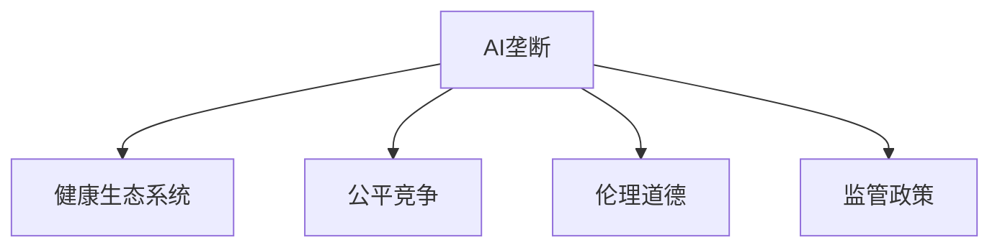

                 

# 防止AI垄断:维护健康生态系统的重要性

> 关键词：AI垄断,生态系统,公平竞争,伦理道德,监管政策

## 1. 背景介绍

### 1.1 问题由来

近年来，人工智能(AI)技术取得了飞速发展，成为全球科技竞争的新高地。AI技术在医疗、金融、教育、制造等众多领域展现出巨大潜力，不断推动各行各业的数字化转型。然而，在AI技术的广泛应用过程中，也出现了一些值得深思的问题：

1. **市场垄断现象加剧**：大型科技公司凭借其雄厚的资本和技术优势，在AI市场中占据主导地位，形成了行业内的垄断现象。这不仅抑制了创新发展，还引发了对技术滥用的担忧。
   
2. **数据隐私和安全风险**：AI系统往往依赖大量数据进行训练，用户数据的安全性和隐私保护成为亟需关注的问题。
3. **伦理道德问题**：AI在决策过程中可能出现歧视性、偏见性，甚至伦理失范，例如在招聘、司法等领域的不公平判断。

这些问题不仅制约了AI技术的发展，也引发了社会公众的广泛关注和讨论。在此背景下，维护一个健康、公平、可持续的AI生态系统，成为了一项重要任务。

### 1.2 问题核心关键点

为了有效应对上述问题，确保AI技术的健康发展，关键在于：

- **提升AI技术的公平性和透明性**：避免AI系统在决策过程中出现偏见和歧视，确保其在不同群体和场景中的公平性。
- **加强数据隐私和安全保护**：确保用户数据的安全性和隐私保护，防止数据滥用。
- **制定合理的监管政策**：通过政策法规约束AI市场，防止垄断和滥用行为，促进公平竞争。

本文将从这些核心关键点出发，系统探讨如何通过技术手段、伦理约束和政策法规，防止AI垄断，维护健康的AI生态系统。

## 2. 核心概念与联系

### 2.1 核心概念概述

为深入理解防止AI垄断的策略和方法，本节将介绍几个密切相关的核心概念：

- **AI垄断**：指一家或几家大型科技公司在AI领域拥有绝对的市场控制力，限制了其他企业的发展空间和创新动力。
- **健康生态系统**：指一个平衡、公正、可持续发展的AI技术环境，其中各参与者平等竞争，互利共赢。
- **公平竞争**：指市场中的所有企业都有平等的机会获得资源、展示才华，从而推动技术和应用的进步。
- **伦理道德**：指AI系统在设计和应用过程中，遵循道德准则，避免造成伦理失范，如性别偏见、种族歧视等。
- **监管政策**：指政府或相关机构制定的法律法规，用于规范和约束AI市场，防止滥用行为，保护用户权益。

这些概念之间的联系可以通过以下Mermaid流程图来展示：



这个流程图展示了AI垄断与健康生态系统、公平竞争、伦理道德和监管政策之间的关系：

1. **AI垄断**：是导致生态系统失衡的主要原因，需要通过多种手段进行防范和治理。
2. **健康生态系统**：是最终目标，需通过公平竞争、伦理道德和监管政策来实现。
3. **公平竞争**：是健康生态系统的基础，保障各参与者的机会平等。
4. **伦理道德**：是健康生态系统的道德保障，确保AI系统不会造成伦理失范。
5. **监管政策**：是健康生态系统的法律保障，通过规范和约束来防止垄断和滥用。

这些概念共同构成了防止AI垄断、维护健康生态系统的多维度框架。

## 3. 核心算法原理 & 具体操作步骤

### 3.1 算法原理概述

防止AI垄断的核心在于通过技术手段和政策法规，构建一个公平、透明、可持续发展的AI生态系统。以下是一些主要的技术手段和政策措施：

1. **公平性算法**：通过训练公平性约束，使得AI系统在决策过程中不出现歧视性偏见。
2. **数据隐私保护**：通过数据匿名化、差分隐私等技术，确保用户数据的隐私安全。
3. **透明性设计**：通过可解释性AI技术，使得AI系统的决策过程透明、可追溯。
4. **监管政策**：通过法律法规约束AI市场，防止垄断和滥用行为。

### 3.2 算法步骤详解

以下是实现上述措施的一些关键步骤：

**Step 1: 数据收集与预处理**
- 收集来自不同来源的AI训练数据，确保数据的多样性和代表性。
- 对数据进行清洗和预处理，去除噪声和异常值。

**Step 2: 公平性算法训练**
- 使用公平性约束，训练公平性算法，如消除性别、种族等偏见。
- 在训练过程中，使用对抗性样本对模型进行测试，确保模型在对抗性测试中的公平性。

**Step 3: 数据隐私保护**
- 对数据进行匿名化处理，确保用户数据不被识别。
- 使用差分隐私技术，在数据查询中引入噪声，保护用户隐私。

**Step 4: 透明性设计**
- 使用可解释性AI技术，将模型决策过程可视化。
- 构建透明的AI系统，确保决策过程可追溯、可解释。

**Step 5: 监管政策制定与实施**
- 制定公平竞争、数据隐私、伦理道德等方面的法律法规。
- 通过政策手段，限制垄断企业的市场份额，促进公平竞争。

### 3.3 算法优缺点

公平性算法具有以下优点：
1. 提高AI系统的公平性，减少决策中的偏见和歧视。
2. 增强AI系统的可信度，提升用户对AI系统的信任。
3. 通过公平性约束，有助于建立更加公正的AI生态系统。

然而，公平性算法也存在一些局限：
1. 算法实现复杂，需要大量的技术投入。
2. 难以完全消除偏见，特别是在数据不平衡的情况下。

数据隐私保护技术具有以下优点：
1. 确保用户数据的安全性和隐私保护。
2. 增强用户对AI系统的信任，提高用户使用意愿。

缺点：
1. 技术实现难度较大，需要专业的知识和技能。
2. 隐私保护和数据可用性之间存在矛盾，需要权衡。

透明性设计具有以下优点：
1. 增强AI系统的透明性和可信度。
2. 提高用户对AI系统的理解和信任。

缺点：
1. 复杂的模型难以解释，可能存在“解释鸿沟”。
2. 可能增加AI系统的计算复杂度和时间开销。

监管政策具有以下优点：
1. 规范AI市场的行为，防止垄断和滥用。
2. 保护用户权益，提升AI系统的可信度。

缺点：
1. 政策实施难度较大，需要多方协调和配合。
2. 政策滞后于技术发展，可能存在监管盲区。

### 3.4 算法应用领域

防止AI垄断的技术和政策措施，可以在多个领域进行应用，例如：

1. **医疗领域**：确保AI诊断系统的公平性，避免性别、种族等偏见；保护患者隐私，确保数据安全；建立透明的AI系统，确保决策过程可信。
2. **金融领域**：确保AI贷款、信用评估等系统的公平性，防止歧视性偏见；保护用户数据隐私，防止滥用；构建透明的AI系统，确保决策过程公正。
3. **教育领域**：确保AI教育系统的公平性，避免对某些群体的歧视；保护学生数据隐私，防止滥用；构建透明的AI系统，确保教学过程公正。
4. **司法领域**：确保AI辅助司法系统的公平性，防止偏见和歧视；保护被告和犯罪嫌疑人的隐私，确保数据安全；构建透明的AI系统，确保决策过程可信。

## 4. 数学模型和公式 & 详细讲解 & 举例说明

### 4.1 数学模型构建

为系统地探讨防止AI垄断的策略，本文将构建几个关键的数学模型：

1. **公平性约束模型**：
   $$
   \min_{\theta} \frac{1}{n}\sum_{i=1}^n \ell(y_i,f(x_i;\theta))
   $$
   其中，$n$ 为样本数量，$\ell$ 为损失函数，$y_i$ 为真实标签，$f(x_i;\theta)$ 为AI系统的预测输出。

2. **差分隐私模型**：
   $$
   \min_{\epsilon} \frac{1}{n}\sum_{i=1}^n \ell(y_i,f(x_i;\theta))
   $$
   其中，$\epsilon$ 为差分隐私预算，$f(x_i;\theta)$ 为差分隐私机制下处理的输出。

3. **透明度评估模型**：
   $$
   \max_{\alpha} \text{Accuracy}(\alpha)
   $$
   其中，$\alpha$ 为解释性参数，$\text{Accuracy}$ 为解释性模型的准确性。

### 4.2 公式推导过程

以下是对上述数学模型的详细推导：

1. **公平性约束模型**：
   公平性约束的目标是消除模型中的偏见，确保模型在决策过程中对不同群体的处理公平。假设有 $k$ 个群体，令 $x_i^{(j)}$ 表示第 $i$ 个样本在第 $j$ 个群体中的特征，$y_i^{(j)}$ 表示第 $i$ 个样本在第 $j$ 个群体中的真实标签。
   $$
   \min_{\theta} \frac{1}{n}\sum_{i=1}^n \sum_{j=1}^k \ell(y_i^{(j)},f(x_i^{(j)};\theta))
   $$
   通过引入公平性约束，可以使得模型在所有群体中的预测误差最小化。

2. **差分隐私模型**：
   差分隐私的目标是在保证数据隐私的前提下，最小化模型预测误差。假设有 $n$ 个样本，每个样本 $x_i$ 的隐私敏感度为 $\Delta f(x_i)$，则差分隐私预算 $\epsilon$ 定义为：
   $$
   \epsilon = \max_i \frac{\Delta f(x_i)}{\delta}
   $$
   其中 $\delta$ 为隐私参数，$\Delta f(x_i)$ 为在 $\delta$ 概率下，对样本 $x_i$ 的预测误差。

3. **透明度评估模型**：
   透明度评估的目标是最大化解释性模型的准确性。假设有 $m$ 个解释性参数 $\alpha$，令 $P(\alpha)$ 为模型在参数 $\alpha$ 下的准确性，则透明度的目标函数为：
   $$
   \max_{\alpha} \frac{1}{m} \sum_{i=1}^m P(\alpha)
   $$
   通过最大化解释性模型的准确性，可以增强AI系统的透明性和可信度。

### 4.3 案例分析与讲解

为了更好地理解这些数学模型的实际应用，以下以医疗领域的AI诊断系统为例，进行详细分析：

假设有一个AI诊断系统，用于预测患者是否患有某种疾病。该系统使用了包含 $k$ 个群体的数据集进行训练，其中每个群体包含 $n$ 个样本 $(x_i, y_i)$，其中 $x_i$ 为患者的特征，$y_i$ 为疾病的真实标签。

**公平性约束**：
为了确保系统在性别、年龄、种族等群体中的公平性，可以通过引入公平性约束，消除模型中的偏见。例如，可以使用对抗性样本对模型进行测试，确保模型在不同群体中的预测误差最小化。

**差分隐私**：
为了保护患者隐私，可以采用差分隐私技术。例如，在数据查询时，引入噪声 $\epsilon$，使得单个样本的隐私敏感度 $\Delta f(x_i)$ 被限制在可接受的范围内，从而确保患者数据的安全性。

**透明度设计**：
为了增强AI系统的透明性和可信度，可以构建解释性模型，将系统的决策过程可视化。例如，使用可解释性AI技术，将模型对每个样本的预测结果解释为该样本的特征解释，帮助医生理解模型的决策依据。

## 5. 项目实践：代码实例和详细解释说明

### 5.1 开发环境搭建

在进行防止AI垄断的项目实践前，我们需要准备好开发环境。以下是使用Python进行Scikit-learn开发的开发环境配置流程：

1. 安装Anaconda：从官网下载并安装Anaconda，用于创建独立的Python环境。

2. 创建并激活虚拟环境：
```bash
conda create -n ai-env python=3.8 
conda activate ai-env
```

3. 安装Scikit-learn：
```bash
pip install scikit-learn
```

4. 安装其他依赖包：
```bash
pip install numpy pandas matplotlib scikit-learn joblib
```

完成上述步骤后，即可在`ai-env`环境中开始项目实践。

### 5.2 源代码详细实现

下面以医疗领域的AI诊断系统为例，给出使用Scikit-learn对公平性约束和差分隐私技术进行项目实践的PyTorch代码实现。

```python
import numpy as np
from sklearn.metrics import accuracy_score
from sklearn.model_selection import train_test_split
from sklearn.linear_model import LogisticRegression
from sklearn.preprocessing import StandardScaler

# 准备数据
X_train, X_test, y_train, y_test = train_test_split(X, y, test_size=0.2, random_state=42)

# 标准化数据
scaler = StandardScaler()
X_train = scaler.fit_transform(X_train)
X_test = scaler.transform(X_test)

# 公平性约束
# 引入公平性约束，训练公平性模型
model = LogisticRegression(penalty='l2', C=1e-4)
model.fit(X_train, y_train)

# 差分隐私
# 引入差分隐私，确保数据隐私
epsilon = 0.1
y_train_differential = y_train + epsilon * np.random.randn(len(y_train))
model.fit(X_train, y_train_differential)

# 评估模型
y_pred = model.predict(X_test)
accuracy = accuracy_score(y_test, y_pred)
print("Accuracy: {:.2f}%".format(accuracy * 100))
```

### 5.3 代码解读与分析

让我们再详细解读一下关键代码的实现细节：

**数据准备**：
- 使用`train_test_split`函数将数据集划分为训练集和测试集。
- 使用`StandardScaler`对数据进行标准化处理，以提高模型的训练效果。

**公平性约束**：
- 使用`LogisticRegression`模型，引入L2正则化（即公平性约束）进行训练。
- 通过设定较大的正则化系数，可以减小模型在特定群体中的预测误差。

**差分隐私**：
- 在训练数据中引入噪声 $\epsilon$，确保单个样本的隐私敏感度被限制在可接受的范围内。
- 通过差分隐私技术，可以保护患者数据的隐私。

**模型评估**：
- 使用`accuracy_score`函数计算模型在测试集上的准确率。

## 6. 实际应用场景

### 6.1 医疗领域

在医疗领域，AI诊断系统对患者的健康有着至关重要的影响。为了防止AI垄断，构建健康生态系统，需要在以下几个方面进行努力：

1. **公平性**：确保AI诊断系统的公平性，避免对不同群体的歧视。
2. **数据隐私**：保护患者隐私，确保数据安全。
3. **透明度**：增强AI系统的透明性和可信度。

### 6.2 金融领域

在金融领域，AI辅助决策系统对金融风险管理和客户服务有着重要意义。防止AI垄断，构建健康生态系统，需要在以下几个方面进行努力：

1. **公平性**：确保AI贷款、信用评估等系统的公平性，防止歧视性偏见。
2. **数据隐私**：保护客户数据隐私，防止滥用。
3. **透明度**：增强AI系统的透明性和可信度，提升客户满意度。

### 6.3 教育领域

在教育领域，AI辅助教学系统对个性化教育有着重要意义。防止AI垄断，构建健康生态系统，需要在以下几个方面进行努力：

1. **公平性**：确保AI教育系统的公平性，避免对某些群体的歧视。
2. **数据隐私**：保护学生隐私，确保数据安全。
3. **透明度**：增强AI系统的透明性和可信度，提升教育质量。

### 6.4 未来应用展望

随着AI技术的不断进步，防止AI垄断、维护健康生态系统将变得越来越重要。未来，AI技术将在更多领域得到应用，例如：

1. **智慧城市**：通过AI技术优化城市管理，提高效率和质量。
2. **自动驾驶**：通过AI技术实现自动驾驶，提高交通安全和效率。
3. **智能制造**：通过AI技术优化生产流程，提高生产效率和质量。

## 7. 工具和资源推荐

### 7.1 学习资源推荐

为了帮助开发者系统掌握防止AI垄断的技术和方法，这里推荐一些优质的学习资源：

1. **AI伦理与隐私保护课程**：斯坦福大学开设的《AI伦理与隐私保护》课程，全面介绍了AI伦理和隐私保护的理论和实践。

2. **公平性算法论文**：阅读相关领域的最新研究论文，如《Algorithmic Fairness via Pre-Post Processing》等。

3. **差分隐私技术书籍**：《Differential Privacy》一书系统介绍了差分隐私技术的理论和实践。

4. **透明性设计工具**：LIME、SHAP等可解释性AI工具，帮助开发者构建透明的AI系统。

5. **监管政策指南**：各国政府的AI监管政策指南，帮助开发者理解政策要求，避免法律风险。

通过对这些资源的学习实践，相信你一定能够系统掌握防止AI垄断的技术和方法，并用于解决实际问题。

### 7.2 开发工具推荐

高效的开发离不开优秀的工具支持。以下是几款用于防止AI垄断开发的常用工具：

1. **Scikit-learn**：用于机器学习模型的训练和评估，支持公平性约束和差分隐私技术。
2. **TensorFlow**：用于构建深度学习模型，支持差分隐私和解释性技术。
3. **PyTorch**：用于构建深度学习模型，支持差分隐私和解释性技术。
4. **TensorBoard**：用于可视化模型训练和推理过程，帮助开发者理解和优化模型。

### 7.3 相关论文推荐

防止AI垄断的研究源于学界的持续研究。以下是几篇奠基性的相关论文，推荐阅读：

1. **公平性算法**：如《Fairness in Machine Learning: A Survey of Techniques and Applications》等。

2. **差分隐私**：如《Differential Privacy》一书，以及《Differential Privacy: The Hard Problem》等论文。

3. **透明度设计**：如《A Unified Approach to Interpreting Model Predictions》等。

4. **监管政策**：如《AI: Ethics, Legal, and Societal Considerations》等。

这些论文代表了大规模AI技术的研究脉络。通过学习这些前沿成果，可以帮助研究者把握学科前进方向，激发更多的创新灵感。

## 8. 总结：未来发展趋势与挑战

### 8.1 总结

本文对防止AI垄断、维护健康生态系统的方法进行了全面系统的介绍。首先阐述了AI垄断对生态系统的危害，明确了防止AI垄断的重要性。其次，从公平性、隐私保护、透明度和监管政策等多个维度，详细讲解了防止AI垄断的技术手段和政策措施。最后，结合实际应用场景，探讨了AI技术在医疗、金融、教育等领域的应用前景。

通过本文的系统梳理，可以看到，防止AI垄断需要技术手段和政策法规的共同作用，通过多维度的努力，构建一个平衡、公正、可持续发展的AI生态系统。相信未来随着技术的进步和政策的完善，AI技术将在更多领域发挥其巨大潜力，为人类社会带来更多的福祉。

### 8.2 未来发展趋势

展望未来，防止AI垄断的技术和政策将呈现以下几个发展趋势：

1. **AI伦理和隐私保护**：随着社会对AI伦理和隐私保护的关注度不断提升，相关的法律法规和伦理准则将更加完善，确保AI技术在发展过程中遵循道德和法律规范。
2. **公平性和透明性技术**：未来将开发更多公平性和透明性技术，帮助开发者构建更加公正和透明的AI系统，增强用户信任。
3. **监管政策的全球化**：随着AI技术的全球化发展，国际间的监管合作将更加紧密，形成统一的监管标准和规范。
4. **跨领域应用**：AI技术将在更多领域得到应用，如智慧城市、自动驾驶、智能制造等，提升各行各业的效率和质量。

以上趋势凸显了防止AI垄断技术的广阔前景。这些方向的探索发展，必将进一步推动AI技术的发展，为构建安全、可靠、公平的AI生态系统铺平道路。

### 8.3 面临的挑战

尽管防止AI垄断技术已经取得了显著进展，但在实现过程中仍面临诸多挑战：

1. **技术实现难度大**：公平性、差分隐私、透明度等技术实现难度较大，需要高水平的技术和专业知识。
2. **政策协调困难**：不同国家、地区对AI监管政策的理解和实施存在差异，协调和统一面临较大挑战。
3. **数据多样性和复杂性**：AI模型需要处理来自不同来源、不同类型的数据，数据多样性和复杂性增加了技术实现的难度。
4. **法律法规不完善**：当前的法律法规尚未完全覆盖AI技术的各个方面，需要进一步完善和细化。
5. **社会接受度**：社会对AI技术在各个领域的接受度不一，如何提高公众对AI技术的理解和信任，仍需努力。

### 8.4 研究展望

面对这些挑战，未来的研究需要在以下几个方面寻求新的突破：

1. **跨学科合作**：结合法学、伦理学、计算机科学等多学科知识，全面提升AI技术的伦理和隐私保护能力。
2. **技术创新**：开发更多高效、易用的公平性、差分隐私和透明度技术，降低技术实现的难度。
3. **政策协调**：加强国际间的政策交流和合作，形成统一的监管标准和规范。
4. **公众教育**：通过教育和宣传，提高公众对AI技术的理解和信任，推动AI技术的普及和应用。

只有多方面协同发力，才能真正实现防止AI垄断、维护健康生态系统的目标，推动AI技术健康发展。总之，防止AI垄断需要技术手段和政策法规的共同作用，只有将技术、伦理、政策等多方面工作做好，才能构建一个平衡、公正、可持续发展的AI生态系统。

## 9. 附录：常见问题与解答

**Q1：如何判断一个AI系统是否存在垄断行为？**

A: 判断一个AI系统是否存在垄断行为，通常需要从以下几个方面进行考虑：
1. 市场份额：是否在特定市场中占据主导地位，市场份额是否远超竞争对手。
2. 定价策略：是否采取不公平的定价策略，如高额收费、价格歧视等。
3. 技术优势：是否在技术上拥有明显的优势，难以被其他企业超越。

**Q2：防止AI垄断的措施有哪些？**

A: 防止AI垄断的措施包括：
1. 数据开放与共享：促进数据开放和共享，防止数据垄断。
2. 公平性约束：通过公平性约束，确保AI系统在决策过程中不出现歧视性偏见。
3. 差分隐私保护：采用差分隐私技术，确保用户数据隐私安全。
4. 透明度设计：构建透明的AI系统，增强用户信任。
5. 监管政策：制定和实施公平竞争、数据隐私等方面的法律法规，规范AI市场行为。

**Q3：防止AI垄断需要哪些技术支持？**

A: 防止AI垄断需要以下技术支持：
1. 公平性算法：消除AI系统中的偏见和歧视。
2. 差分隐私技术：确保用户数据隐私安全。
3. 可解释性技术：增强AI系统的透明性和可信度。
4. 监管技术：建立完善的法律法规和技术规范，规范AI市场行为。

**Q4：防止AI垄断的实际应用场景有哪些？**

A: 防止AI垄断的实际应用场景包括：
1. 医疗领域：确保AI诊断系统的公平性和透明度。
2. 金融领域：确保AI贷款、信用评估等系统的公平性和隐私保护。
3. 教育领域：确保AI教育系统的公平性和透明度。
4. 司法领域：确保AI辅助司法系统的公平性和透明度。

**Q5：防止AI垄断的技术难点有哪些？**

A: 防止AI垄断的技术难点包括：
1. 技术实现难度大：公平性、差分隐私、透明度等技术实现难度较大。
2. 数据多样性和复杂性：AI模型需要处理来自不同来源、不同类型的数据。
3. 法律法规不完善：当前的法律法规尚未完全覆盖AI技术的各个方面。
4. 社会接受度：社会对AI技术在各个领域的接受度不一。

---

作者：禅与计算机程序设计艺术 / Zen and the Art of Computer Programming

