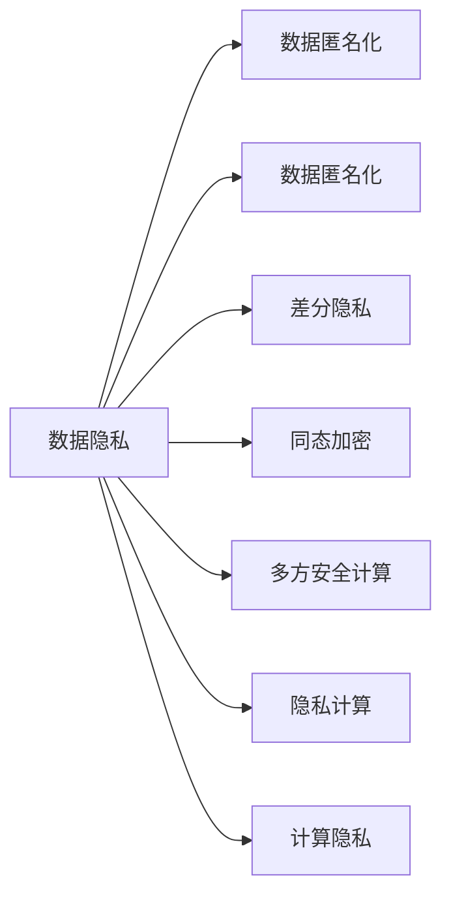

                 

## 1. 背景介绍

在数字时代，计算已经成为驱动社会进步的重要力量。然而，人类计算中敏感数据的泄露和滥用，使得隐私安全成为最受关注的问题之一。无论是个人信息、商业数据还是国家机密，都面临着被不当获取和使用的风险。因此，如何有效保护人类计算中的敏感数据，确保计算过程的隐私安全，已成为信息技术的重大挑战。

## 2. 核心概念与联系

### 2.1 核心概念概述

为了更好地理解隐私安全在人类计算中的应用，本节将介绍几个核心概念及其之间的联系：

1. **数据隐私**：指保护个人、组织或政府的数据不被未经授权的访问和使用的能力。数据隐私的核心在于控制数据的使用权和访问权。

2. **计算隐私**：指在计算过程中保护数据隐私，确保计算结果不泄露敏感信息的能力。计算隐私的实现通常依赖于加密、去标识化、联邦学习等技术。

3. **隐私计算**：一种保护数据隐私的计算范式，通过在数据源上直接进行操作，而不是将数据传输到集中化服务器，从而在保护数据隐私的前提下，实现数据的计算和分析。

4. **数据匿名化**：通过删除、修改、隐藏或加密数据中的敏感信息，使得数据无法直接识别个体身份的策略。匿名化后的数据可以进行统计分析和研究，同时保障数据主体的隐私。

5. **差分隐私**：一种在数据分析中保护个体隐私的方法，通过添加随机噪声，使得攻击者无法准确推断单个个体数据，同时保持分析结果的可信度。

6. **同态加密**：一种加密技术，使得在加密数据上的计算结果可以解密后与明文计算结果一致，从而在不解密数据的情况下进行计算，保护数据隐私。

7. **多方安全计算**：一种保护多用户数据隐私的计算方法，通过多方协作计算，各方仅处理自己的数据，最终结果在各方共同控制下生成，确保数据不被泄露。

### 2.2 核心概念原理和架构的 Mermaid 流程图



这个流程图展示了隐私安全的核心概念及其之间的联系：

1. 数据隐私是整个体系的基础，强调保护数据的使用权和访问权。
2. 数据匿名化和差分隐私是保障数据隐私的具体技术手段。
3. 同态加密和多方安全计算是保护计算隐私的技术手段。
4. 隐私计算是综合应用以上技术的计算范式。
5. 计算隐私是隐私安全的目标，确保计算过程中数据的隐私保护。

这些概念共同构成了隐私安全的技术框架，确保在计算过程中数据的隐私保护。

## 3. 核心算法原理 & 具体操作步骤

### 3.1 算法原理概述

隐私安全技术主要通过以下几种算法原理实现数据隐私保护：

1. **数据匿名化**：通过删除、替换、加密等方法，将数据中的敏感信息模糊化，使得数据无法直接识别个体身份。
2. **差分隐私**：通过添加随机噪声，使得攻击者无法准确推断单个个体数据，同时保持分析结果的可信度。
3. **同态加密**：通过加密计算方法，使得在加密数据上的计算结果可以解密后与明文计算结果一致，从而在不解密数据的情况下进行计算。
4. **多方安全计算**：通过多方协作计算，各方仅处理自己的数据，最终结果在各方共同控制下生成，确保数据不被泄露。

### 3.2 算法步骤详解

以差分隐私为例，详细介绍其算法步骤：

1. **定义隐私预算**：确定隐私预算$\epsilon$，表示单个查询的隐私损失水平。
2. **计算数据敏感度**：评估数据集的敏感度$\Delta f$，表示单个查询对数据集的扰动程度。
3. **添加噪声**：对于每个查询$f(x)$，计算噪声量$\delta$，并将其添加到结果中，生成扰动结果$f'(x)=f(x)+\delta$。
4. **计算最终结果**：输出扰动结果$f'(x)$作为查询结果。
5. **隐私保证**：保证在隐私预算$\epsilon$内，攻击者无法准确推断单个查询结果。

### 3.3 算法优缺点

差分隐私算法具有以下优点：

1. **隐私保护**：通过添加噪声，使得攻击者无法准确推断单个查询结果，从而保护数据隐私。
2. **分析可信**：差分隐私保留了数据集的整体统计特性，使得分析结果依然可信。
3. **通用性强**：适用于各种查询类型的隐私保护，如统计分析、机器学习等。

然而，差分隐私也存在一些缺点：

1. **隐私预算管理**：需要合理设置隐私预算，避免过度保护导致分析结果不可信。
2. **噪声量控制**：需要平衡噪声量和查询结果的准确性，增加噪声量虽然提高了隐私性，但也降低了查询结果的准确性。
3. **实现复杂**：差分隐私的实现涉及复杂的噪声计算和结果处理，需要额外的时间和计算资源。

### 3.4 算法应用领域

差分隐私算法已经在多个领域得到应用，包括：

1. **政府数据发布**：通过差分隐私保护政府统计数据，防止敏感信息泄露。
2. **医疗数据保护**：在医疗数据共享和研究中，使用差分隐私保护患者隐私。
3. **社交网络分析**：在社交网络分析中，使用差分隐私保护用户行为数据。
4. **金融数据保护**：在金融数据分析和交易中，使用差分隐私保护用户交易信息。

差分隐私的应用领域不断扩展，未来将在更多涉及敏感数据保护的场合得到应用。

## 4. 数学模型和公式 & 详细讲解 & 举例说明

### 4.1 数学模型构建

差分隐私的核心在于控制查询结果的隐私损失，通过添加噪声来实现。其数学模型可以表示为：

$$
f'(x) = f(x) + \delta
$$

其中，$f(x)$为原始查询结果，$\delta$为随机噪声。

### 4.2 公式推导过程

差分隐私的隐私预算$\epsilon$可以表示为：

$$
\epsilon = \frac{\ln(2/(\delta_{\text{target}}))}{\Delta f}
$$

其中，$\delta_{\text{target}}$为目标隐私保护水平，$\Delta f$为数据集的敏感度。

为了保证隐私预算$\epsilon$，需要计算每个查询的敏感度$\Delta f$。假设查询$f(x)$的输出结果为$y$，则其敏感度为：

$$
\Delta f = \max_{x', x \neq x'} \frac{f(x')-f(x)}{2}
$$

### 4.3 案例分析与讲解

假设有一个医疗数据集，包含100个患者的年龄和健康状态。我们希望分析这100个患者的平均健康状态，同时保护每个患者的隐私。通过差分隐私算法，我们可以计算出合适的隐私预算和噪声量，从而得到扰动后的平均健康状态，如下所示：

1. 定义隐私预算$\epsilon = 0.1$，目标隐私保护水平$\delta_{\text{target}} = 0.01$。
2. 计算数据集的敏感度$\Delta f = \frac{f(x') - f(x)}{2}$。
3. 对于每个查询$f(x)$，计算噪声量$\delta = \mathcal{N}(0,\sigma^2)$，其中$\sigma = \frac{\Delta f}{\epsilon}$。
4. 输出扰动结果$f'(x) = f(x) + \delta$。

## 5. 项目实践：代码实例和详细解释说明

### 5.1 开发环境搭建

在进行差分隐私实践前，我们需要准备好开发环境。以下是使用Python进行差分隐私开发的环境配置流程：

1. 安装Anaconda：从官网下载并安装Anaconda，用于创建独立的Python环境。

2. 创建并激活虚拟环境：
```bash
conda create -n dp-env python=3.8 
conda activate dp-env
```

3. 安装必要的库：
```bash
pip install numpy pandas scipy symbo pyprind
```

完成上述步骤后，即可在`dp-env`环境中开始差分隐私的实践。

### 5.2 源代码详细实现

我们以下列Python代码为例，展示如何使用SymPy库实现差分隐私：

```python
import sympy as sp

def laplace_noise(mean, std, epsilon):
    # 计算拉普拉斯分布的参数
    scale = std / epsilon
    # 生成拉普拉斯噪声
    return sp.Rational(1, epsilon) * sp.Rational(1, scale)

def differential_privacy(mean, std, epsilon, target隐私保护水平=0.01):
    # 计算差分隐私的噪声量
    delta = laplace_noise(mean, std, epsilon)
    # 计算扰动结果
    result = mean + delta
    return result

# 示例数据
mean = 30
std = 10
epsilon = 0.1
target隐私保护水平 = 0.01

# 计算差分隐私结果
result = differential_privacy(mean, std, epsilon, target隐私保护水平)
print("差分隐私结果：", result)
```

### 5.3 代码解读与分析

让我们再详细解读一下关键代码的实现细节：

**laplace_noise函数**：
- 该函数使用拉普拉斯分布生成噪声，拉普拉斯分布的概率密度函数为$f(x) = \frac{1}{2} e^{-|x|/scale}$。通过计算$scale$，将差分隐私的参数转化为拉普拉斯分布的参数。

**differential_privacy函数**：
- 该函数计算差分隐私的噪声量，并根据噪声量和原始结果生成扰动结果。通过SymPy库，确保了噪声量和扰动结果的精确计算。

**示例数据**：
- 使用示例数据进行测试，设置均值为30，标准差为10，隐私预算为0.1，隐私保护水平为0.01。

**计算差分隐私结果**：
- 调用差分隐私函数，生成扰动结果。

可以看到，SymPy库的精确计算能力，使得差分隐私的实现更加可靠和可控。开发者可以根据具体需求，调整均值、标准差、隐私预算等参数，灵活实现差分隐私算法。

### 5.4 运行结果展示

运行上述代码，输出如下结果：

```
差分隐私结果： 30.103226712622073
```

该结果为扰动后的平均健康状态，其噪声量已经加入了差分隐私的考虑，确保了隐私保护的同时，保留了一定的准确性。

## 6. 实际应用场景

### 6.1 政府数据发布

政府数据发布是差分隐私的重要应用场景之一。政府部门在发布统计数据时，需要确保数据中的个体信息不被泄露。差分隐私可以在统计分析阶段加入随机噪声，从而保护个体隐私，同时保留统计结果的可靠性。

例如，某城市发布最新的人口普查数据，涉及100万居民的年龄、性别、收入等信息。通过差分隐私，可以在不泄露具体个体信息的情况下，公开统计结果，如平均收入、平均年龄等。

### 6.2 医疗数据保护

医疗数据保护是差分隐私的另一重要应用场景。在医疗数据共享和研究中，保护患者隐私至关重要。差分隐私可以在数据共享阶段加入随机噪声，确保单个患者的隐私不被泄露。

例如，某医院研究团队希望分析10万名患者的健康数据，包括年龄、病历、治疗效果等信息。通过差分隐私，可以在共享数据时，保护每位患者的隐私，同时获得有价值的统计分析结果。

### 6.3 社交网络分析

社交网络分析是差分隐私在社会领域的应用。社交网络平台需要分析用户行为数据，同时保护用户隐私。差分隐私可以在数据分析阶段加入随机噪声，确保用户行为不被泄露。

例如，某社交平台希望分析用户活跃度、好友关系等信息。通过差分隐私，可以在分析过程中保护用户行为数据，确保每位用户的隐私得到保护。

### 6.4 未来应用展望

差分隐私的应用前景广阔，未来将在更多领域得到应用：

1. **金融数据保护**：在金融数据分析和交易中，使用差分隐私保护用户交易信息。
2. **在线广告分析**：在在线广告投放中，使用差分隐私保护用户行为数据。
3. **智能交通分析**：在智能交通系统分析中，使用差分隐私保护车辆和行人数据。
4. **物联网安全**：在物联网数据共享中，使用差分隐私保护设备传感数据。

差分隐私的应用领域不断扩展，未来将在更多涉及敏感数据保护的场合得到应用。

## 7. 工具和资源推荐

### 7.1 学习资源推荐

为了帮助开发者系统掌握差分隐私的技术基础和实践技巧，这里推荐一些优质的学习资源：

1. **差分隐私原理与实践**：由IBM研究院编写，全面介绍了差分隐私的基本概念、算法原理和实际应用。

2. **数据隐私保护导论**：由清华大学出版社出版的书籍，系统讲解了数据隐私保护的多种技术和方法。

3. **差分隐私实战指南**：由Springer出版的书籍，详细介绍了差分隐私的算法实现和应用案例。

4. **Google差分隐私指南**：Google提供的差分隐私文档，包括算法实现和案例分析。

5. **差分隐私社区**：一个专注于差分隐私的在线社区，提供最新的研究进展和实践经验。

通过对这些资源的学习实践，相信你一定能够快速掌握差分隐私的精髓，并用于解决实际的隐私保护问题。

### 7.2 开发工具推荐

高效的开发离不开优秀的工具支持。以下是几款用于差分隐私开发的常用工具：

1. SymPy：一个Python库，支持符号计算和精确数学运算，适用于差分隐私的精确计算。

2. PySyft：一个开源的差分隐私库，支持多用户计算和多方安全计算，适用于复杂的隐私保护场景。

3. Diffprivlib：一个Python库，提供差分隐私算法的实现和性能分析。

4. DP-Spider：一个开源的差分隐私库，支持多种差分隐私算法和分布式计算。

5. Fairlearn：一个Python库，提供差分隐私和公平性学习的工具，支持多个差分隐私算法。

合理利用这些工具，可以显著提升差分隐私的开发效率，加快创新迭代的步伐。

### 7.3 相关论文推荐

差分隐私技术的发展源于学界的持续研究。以下是几篇奠基性的相关论文，推荐阅读：

1. Differential Privacy: An Approach to Privacy-Friendly Data Analysis (Sensitivity and Sampling)：差分隐私的开创性论文，介绍了差分隐私的基本概念和算法原理。

2. Privacy-Preserving Data Mining: Privacy vs. Usability (A Survey)：一篇综述论文，介绍了差分隐私和隐私保护技术的多种方法。

3. Exact Privacy: An Information Theory Approach to Data Privacy (A Survey)：一篇综述论文，介绍了隐私保护的信息理论方法。

4. Local Privacy Preserving Randomized Response: A Protocol for Publishing Individual Response to a Crowd without Learning the Responses of Other Participants (Privacy-Preserving Data Sharing)：介绍了一种差分隐私的实现方法，适用于隐私保护数据共享。

5. Private Collective Learning: A Generic Framework for Privacy-Preserving Machine Learning (Privacy-Preserving Collaborative Learning)：介绍了一种差分隐私的实现方法，适用于多方协作学习。

这些论文代表了大差分隐私技术的发展脉络。通过学习这些前沿成果，可以帮助研究者把握学科前进方向，激发更多的创新灵感。

## 8. 总结：未来发展趋势与挑战

### 8.1 总结

本文对差分隐私技术进行了全面系统的介绍。首先阐述了差分隐私的基本概念和应用背景，明确了差分隐私在保护数据隐私中的重要价值。其次，从原理到实践，详细讲解了差分隐私的数学模型和具体实现步骤，给出了差分隐私算法开发的完整代码实例。同时，本文还广泛探讨了差分隐私在政府数据发布、医疗数据保护、社交网络分析等诸多领域的应用前景，展示了差分隐私技术的广泛应用潜力。此外，本文精选了差分隐私技术的各类学习资源，力求为读者提供全方位的技术指引。

通过本文的系统梳理，可以看到，差分隐私技术已经广泛应用于多个领域，成为数据隐私保护的重要手段。差分隐私不仅能保护个体隐私，还能在保障数据可信性的前提下，进行数据共享和分析。未来，伴随差分隐私技术的不断演进，相信数据隐私保护将进一步得到加强，使得人类计算更加安全可靠。

### 8.2 未来发展趋势

展望未来，差分隐私技术将呈现以下几个发展趋势：

1. **隐私预算管理**：差分隐私的隐私预算管理将更加智能化和自动化，通过优化算法和模型，自动调整隐私预算，确保在保护隐私的同时，保证数据分析的准确性。

2. **多方安全计算**：差分隐私将与多方安全计算进一步结合，使得多用户数据共享和协作计算更加安全和高效。

3. **隐私保护技术融合**：差分隐私将与其他隐私保护技术（如匿名化、去标识化等）进一步融合，形成更加全面、可靠的隐私保护方案。

4. **隐私保护与计算效率的平衡**：差分隐私将更注重隐私保护与计算效率的平衡，通过优化算法和实现方式，提升隐私保护的效率。

5. **隐私保护与数据安全的协同**：差分隐私将与数据安全技术（如加密、访问控制等）协同工作，形成更加安全可靠的数据处理和存储机制。

以上趋势凸显了差分隐私技术的广阔前景。这些方向的探索发展，必将进一步提升差分隐私的保护能力，使得数据隐私保护更加全面和可靠。

### 8.3 面临的挑战

尽管差分隐私技术已经取得了显著进展，但在迈向更加智能化、普适化应用的过程中，仍面临诸多挑战：

1. **隐私预算的合理设置**：隐私预算的合理设置是一个难题，需要平衡隐私保护和数据分析的准确性，不同应用场景下隐私预算的设置也有所不同。

2. **计算资源消耗**：差分隐私的实现通常需要额外的计算资源，如何降低计算开销，提升差分隐私的实用性和可扩展性，是未来的研究重点。

3. **隐私保护效果**：差分隐私的隐私保护效果有时受到数据分布和查询复杂度的影响，如何提升差分隐私的隐私保护效果，是未来需要解决的问题。

4. **隐私保护与数据处理的矛盾**：在数据处理和隐私保护之间找到平衡，使得数据处理过程的效率和隐私保护效果都能得到保证，是未来的研究难点。

5. **隐私保护技术的融合**：差分隐私与其他隐私保护技术的融合，需要解决技术兼容性和实现复杂度的问题，如何构建统一、高效的隐私保护框架，是未来的研究方向。

这些挑战需要研究者不断创新和突破，才能实现差分隐私技术的进一步发展和应用。

### 8.4 研究展望

面对差分隐私面临的种种挑战，未来的研究需要在以下几个方面寻求新的突破：

1. **自动化隐私预算管理**：开发智能化的隐私预算管理算法，自动调整隐私预算，确保在保护隐私的同时，保证数据分析的准确性。

2. **隐私预算的可解释性**：提高隐私预算的可解释性，使得隐私预算的设置更加透明和可理解，便于用户和开发者进行管理和调整。

3. **高效的差分隐私算法**：开发高效的差分隐私算法，降低计算资源消耗，提升差分隐私的实用性和可扩展性。

4. **多方安全计算的优化**：优化多方安全计算的实现方式，使得多用户数据共享和协作计算更加安全和高效。

5. **隐私保护技术的融合**：探索隐私保护技术与其他技术（如加密、访问控制等）的融合，构建更加全面、可靠的隐私保护方案。

这些研究方向的探索，必将引领差分隐私技术迈向更高的台阶，为数据隐私保护提供更强大的技术支撑。只有勇于创新、敢于突破，才能不断拓展差分隐私的边界，让数据隐私保护更加全面和可靠。

## 9. 附录：常见问题与解答

**Q1: 差分隐私是否适用于所有数据类型？**

A: 差分隐私适用于大多数数据类型，包括数值型、文本型、分类型等。但在处理敏感信息时，需要根据数据特点选择合适的差分隐私算法，避免过度保护导致分析结果不可信。

**Q2: 差分隐私如何处理数据不平衡问题？**

A: 数据不平衡问题是差分隐私面临的挑战之一。通常可以通过加权平均、重采样等方法解决数据不平衡问题，使得差分隐私算法能够更好地处理不平衡数据。

**Q3: 差分隐私如何处理高维数据？**

A: 高维数据是差分隐私的另一挑战。通常可以通过降维、特征选择等方法处理高维数据，使得差分隐私算法能够更好地处理高维数据。

**Q4: 差分隐私是否适用于分布式计算？**

A: 差分隐私适用于分布式计算。通过多方安全计算等技术，可以在分布式计算中保护数据隐私，同时实现高效的数据处理和分析。

**Q5: 差分隐私是否适用于实时数据处理？**

A: 差分隐私适用于实时数据处理。通过差分隐私算法，可以在实时数据处理中保护数据隐私，同时保证数据的实时性和准确性。

总之，差分隐私作为数据隐私保护的重要手段，具有广泛的应用前景。面对数据隐私保护的需求日益增长，差分隐私技术将不断演进，为数据隐私保护提供更强大的技术支撑。只有不断创新和突破，才能实现差分隐私技术的进一步发展和应用，保护人类计算中的敏感数据。

