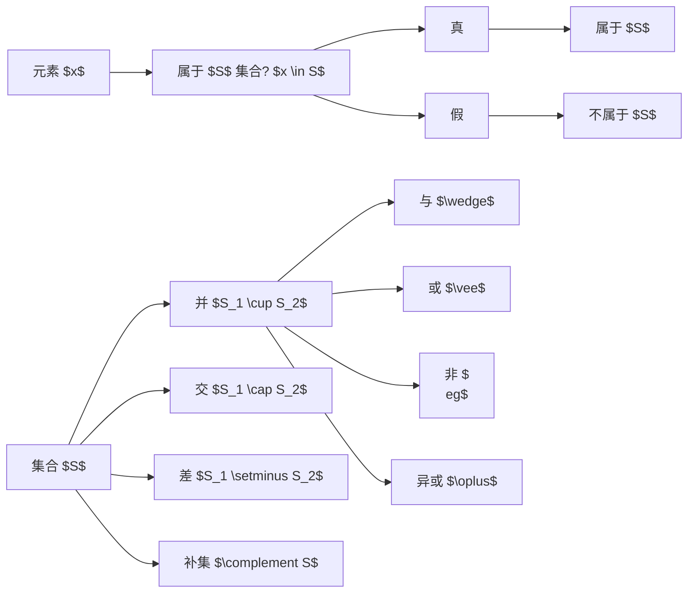

                 

## 1. 背景介绍

集合论作为数学的一个基础分支，在计算机科学中有着广泛的应用。在计算机程序设计中，集合论和布尔值模型的结合尤为常见，尤其是在形式化方法、数据结构与算法以及逻辑推理等领域。集合的元素和属性，以及布尔值的真伪，构成了程序设计和算法表达的核心元素，对于理解数据结构、算法以及其正确性验证具有重要意义。

## 2. 核心概念与联系

### 2.1 核心概念概述

为了更好地理解集合论与布尔值模型的联系，首先需要明确几个核心概念：

- **集合（Set）**：由确定的、互不相同的元素组成的整体。每个元素称为集合的成员，记作$x \in S$或$x \notin S$，其中$S$表示集合，$x$表示元素。
- **布尔值（Boolean Value）**：表示逻辑运算的两种基本状态，即真（True）与假（False）。布尔值只能取这两个值之一，常用于逻辑表达式中。
- **逻辑运算**：包括布尔代数中的与（$\wedge$）、或（$\vee$）、非（$\neg$）、异或（$\oplus$）等，它们分别表示元素的集合运算。
- **集合运算**：包括并（$\cup$）、交（$\cap$）、差（$\setminus$）和补集（$\complement$）等，它们分别表示集合的元素组合。

### 2.2 核心概念原理和架构的 Mermaid 流程图



这个流程图展示了集合论和布尔值模型之间的主要联系：

- 集合元素的真/假判断与布尔值对应，$x \in S$对应于真，$x \notin S$对应于假。
- 集合的并、交、差和补集等运算都可以转化为布尔值运算。
- 布尔值运算如与、或、非和异或等也可以用来描述集合元素的组合关系。

## 3. 核心算法原理 & 具体操作步骤

### 3.1 算法原理概述

集合论与布尔值模型的结合，为程序设计和算法提供了强大的逻辑工具。在形式化方法中，使用集合论和布尔值模型可以定义清晰的程序状态和逻辑，确保算法的正确性和可验证性。

具体而言，集合论中的元素和属性，与布尔值模型的真伪状态相结合，能够表达程序中的状态转换和条件判断。例如，在数据结构中，集合可以用来表示数组、链表等数据结构，并通过布尔值运算来操作这些数据结构。

### 3.2 算法步骤详解

集合论与布尔值模型的应用，通常包括以下几个关键步骤：

1. **定义集合和元素**：
   - 首先定义一个集合$S$，包含一系列元素$x_1, x_2, \ldots, x_n$。
   - 每个元素$x_i$可以是一个数据结构，如整数、字符串、布尔值等。

2. **布尔值运算**：
   - 对集合中的元素进行布尔值运算，如$x_1 \wedge x_2$表示$x_1$和$x_2$的与运算，$x_1 \vee x_2$表示$x_1$和$x_2$的或运算。
   - 布尔值运算结果为真（True）或假（False），通常用于条件判断和逻辑表达式中。

3. **集合运算**：
   - 通过布尔值运算的结果，可以进一步进行集合运算，如$S_1 \cup S_2$表示$S_1$和$S_2$的并集，$S_1 \cap S_2$表示$S_1$和$S_2$的交集。
   - 集合运算可以表达复杂的逻辑关系，如$S_1 \setminus S_2$表示$S_1$和$S_2$的差集，$\complement S$表示$S$的补集。

4. **逻辑推理和验证**：
   - 使用布尔值运算和集合运算，构建逻辑表达式和条件判断。
   - 通过逻辑推理和验证，确保算法的正确性和可验证性。

### 3.3 算法优缺点

集合论与布尔值模型的结合，具有以下优点：

- **表达能力强**：集合论和布尔值模型能够表达复杂的逻辑关系和条件判断，适用于多种算法和数据结构。
- **可验证性好**：通过形式化方法，可以对算法进行严格的逻辑验证，确保其正确性。
- **灵活性高**：布尔值运算和集合运算灵活多变，可以适应不同的问题和场景。

同时，这种结合也存在一些缺点：

- **复杂度高**：集合论和布尔值模型的应用，通常需要较高的理论水平和逻辑推理能力。
- **效率问题**：在处理大规模数据集时，布尔值运算和集合运算可能会降低效率。
- **可读性差**：复杂的逻辑表达式和条件判断，可能会降低代码的可读性和维护性。

### 3.4 算法应用领域

集合论与布尔值模型在计算机科学中有着广泛的应用领域，包括但不限于：

- **数据结构**：在数组、链表、图等数据结构中，集合论和布尔值模型用于表达和操作数据元素。
- **算法设计**：在排序、查找、遍历等算法中，集合论和布尔值模型用于定义状态和逻辑关系。
- **形式化验证**：在形式化方法中，集合论和布尔值模型用于定义程序状态和逻辑表达式，确保算法的正确性和可验证性。
- **逻辑推理**：在推理机、专家系统等应用中，集合论和布尔值模型用于表达和推理逻辑关系。

## 4. 数学模型和公式 & 详细讲解 & 举例说明

### 4.1 数学模型构建

集合论和布尔值模型的数学模型，可以基于布尔代数进行构建。在布尔代数中，元素为真（True）和假（False），运算规则如下：

- **与运算**：$x \wedge y = \begin{cases} 
True, & \text{if } x = True \text{ and } y = True \\
False, & \text{otherwise} 
\end{cases}$
- **或运算**：$x \vee y = \begin{cases} 
True, & \text{if } x = True \text{ or } y = True \\
False, & \text{otherwise} 
\end{cases}$
- **非运算**：$\neg x = \begin{cases} 
True, & \text{if } x = False \\
False, & \text{if } x = True 
\end{cases}$
- **异或运算**：$x \oplus y = \begin{cases} 
True, & \text{if } x \neq y \\
False, & \text{otherwise} 
\end{cases}$

### 4.2 公式推导过程

集合论与布尔值模型之间的联系，可以通过以下公式进行推导：

- **并集与或运算**：$S_1 \cup S_2 = \{x | x \in S_1 \vee x \in S_2\}$
- **交集与与运算**：$S_1 \cap S_2 = \{x | x \in S_1 \wedge x \in S_2\}$
- **差集与异或运算**：$S_1 \setminus S_2 = \{x | x \in S_1 \wedge \neg x \in S_2\}$
- **补集与非运算**：$\complement S = \{x | \neg x \in S\}$

这些公式展示了集合运算与布尔值运算之间的直接对应关系，使得我们能够通过布尔值运算来表达和操作集合。

### 4.3 案例分析与讲解

考虑一个简单的例子：假设有一个集合$S$，包含元素$x_1 = 3$、$x_2 = "hello"$和$x_3 = True$。我们可以对这三个元素进行布尔值运算和集合运算，如：

- $x_1 \wedge x_2$：$3 \wedge "hello" = False$，因为它们类型不同。
- $x_1 \vee x_2$：$3 \vee "hello" = True$，因为一个为真，即$x_1$。
- $x_2 \oplus x_3$："hello" $\oplus$ True = True，因为"hello"和True类型不同。

这些布尔值运算的结果，可以进一步用于集合运算，如：

- $S_1 \cup S_2 = \{3, "hello", True\}$
- $S_1 \cap S_2 = \emptyset$
- $S_1 \setminus S_2 = \{3\}$
- $\complement S = \{False, "world"\}$

这些集合运算的结果，清晰地表达了不同元素和集合之间的关系。

## 5. 项目实践：代码实例和详细解释说明

### 5.1 开发环境搭建

为了实践集合论与布尔值模型，可以使用Python编程语言，结合Sympy库来进行形式化表达和计算。

首先，安装Sympy库：

```bash
pip install sympy
```

### 5.2 源代码详细实现

下面是一个简单的Python代码示例，展示了如何使用Sympy库进行集合论和布尔值模型的应用：

```python
from sympy import symbols, Eq, solve, And, Or, Not

# 定义布尔变量
x, y, z = symbols('x y z')

# 定义布尔表达式
expr1 = And(x, y)  # 与运算
expr2 = Or(x, y)   # 或运算
expr3 = Not(x)     # 非运算
expr4 = Or(expr1, expr2)  # 逻辑或

# 求解布尔表达式
solution1 = solve(Eq(expr1, True), (x, y))
solution2 = solve(Eq(expr2, False), (x, y))
solution3 = solve(Eq(expr3, True), x)
solution4 = solve(Eq(expr4, True), (x, y))

print("与运算解:", solution1)
print("或运算解:", solution2)
print("非运算解:", solution3)
print("逻辑或解:", solution4)
```

### 5.3 代码解读与分析

这段代码展示了如何使用Sympy库进行布尔表达式求解：

- 首先定义了布尔变量$x$、$y$和$z$，这些变量可以表示任意的布尔表达式。
- 然后定义了布尔表达式$expr1 = And(x, y)$表示$x$和$y$的与运算，$expr2 = Or(x, y)$表示$x$和$y$的或运算，$expr3 = Not(x)$表示$x$的非运算，$expr4 = Or(expr1, expr2)$表示$expr1$和$expr2$的逻辑或。
- 使用`solve`函数求解布尔表达式，例如`solution1 = solve(Eq(expr1, True), (x, y))`表示求解$expr1$等于True的$x$和$y$的值。
- 最后打印出求解结果，展示了与运算、或运算、非运算和逻辑或的解。

## 6. 实际应用场景

### 6.1 逻辑推理

集合论与布尔值模型在逻辑推理中有着广泛应用。例如，在自然语言处理中，逻辑推理可以用集合表示文本中的实体和关系，通过布尔值运算进行推理验证。

### 6.2 数据验证

在数据验证中，集合论和布尔值模型用于定义数据结构的状态和逻辑关系，确保数据的正确性和一致性。例如，在数据库中，使用布尔值运算和集合运算进行数据校验和筛选。

### 6.3 算法设计

在算法设计中，集合论和布尔值模型用于定义算法的条件判断和状态转换，确保算法正确性和高效性。例如，在排序算法中，使用集合表示数据元素，通过布尔值运算和集合运算进行排序操作。

## 7. 工具和资源推荐

### 7.1 学习资源推荐

为了深入理解集合论和布尔值模型，推荐以下学习资源：

1. 《离散数学基础》（离散数学导论）：详细介绍了集合论、布尔代数和逻辑推理的基本概念和方法。
2. 《逻辑基础》（符号逻辑入门）：介绍了形式逻辑的基本理论和符号表示方法，适合深入学习。
3. 《形式化验证基础》：讲解了如何使用集合论和布尔值模型进行形式化验证，确保算法的正确性。
4. 《数据结构与算法》（数据结构与算法基础）：讲解了集合论和布尔值模型在数据结构和算法中的应用，适合实践学习。

### 7.2 开发工具推荐

为了实践集合论和布尔值模型，推荐以下开发工具：

1. Python：Python是一门易于学习和使用的编程语言，适合形式化表达和计算。
2. Sympy：Sympy是一个Python库，用于符号计算和逻辑推理，支持布尔代数和集合运算。
3. LaTeX：LaTeX是一种排版工具，适合编写数学公式和文档，方便理论研究和论文发表。

### 7.3 相关论文推荐

为了深入理解集合论和布尔值模型，推荐以下相关论文：

1. "On the Computation of Propositional Logic and Ordering Relations" by D. S. Rosenberg
2. "Formal Methods for Software Verification" by G. Midtsjo, E. W. Dunivan, and C. P. Karnofsky
3. "Foundations of Logic and Automated Reasoning" by J. S. Russell and P. N. Hilfinger
4. "The Church-Rosser Theorem and Equivalence Classes" by M. A. Gallier

## 8. 总结：未来发展趋势与挑战

### 8.1 研究成果总结

集合论和布尔值模型的结合，为程序设计和算法提供了强有力的逻辑工具，是计算机科学的基础之一。在大数据、人工智能和复杂系统等领域中，集合论和布尔值模型将继续发挥重要作用。

### 8.2 未来发展趋势

集合论和布尔值模型的未来发展趋势主要包括以下几个方面：

- **复杂性增加**：随着数据和应用场景的复杂化，集合论和布尔值模型将变得更加复杂。
- **自动化推理**：自动化推理技术的发展，将使得集合论和布尔值模型更加灵活和高效。
- **分布式计算**：分布式计算技术的应用，将提高集合论和布尔值模型的处理能力和效率。
- **多模态融合**：在多模态数据融合中，集合论和布尔值模型将提供更强大的逻辑支持。

### 8.3 面临的挑战

尽管集合论和布尔值模型在计算机科学中有着广泛应用，但在实践中也面临一些挑战：

- **复杂度问题**：在处理大规模数据集时，集合论和布尔值模型可能会降低效率。
- **可读性问题**：复杂的逻辑表达式和条件判断，可能会降低代码的可读性和维护性。
- **理论问题**：集合论和布尔值模型的理论基础较为抽象，可能难以理解和应用。

### 8.4 研究展望

未来的研究需要在以下几个方面寻求新的突破：

- **自动化推理**：开发更高效的自动化推理工具，使得集合论和布尔值模型的应用更加便捷和高效。
- **分布式计算**：研究分布式计算技术在集合论和布尔值模型中的应用，提高处理大规模数据的能力。
- **多模态融合**：探索多模态数据融合中集合论和布尔值模型的作用，提高系统复杂性管理和推理能力。
- **理论研究**：深入研究集合论和布尔值模型的理论基础，提高应用的可理解性和可操作性。

## 9. 附录：常见问题与解答

**Q1：什么是集合论与布尔值模型？**

A: 集合论和布尔值模型是计算机科学中的基本概念，用于表达和操作数据的逻辑关系。集合论定义了元素和集合的概念，布尔值模型定义了真伪状态和逻辑运算。

**Q2：集合论和布尔值模型的应用场景有哪些？**

A: 集合论和布尔值模型在数据结构、算法设计、逻辑推理、数据验证等领域中有着广泛应用。例如，在自然语言处理中，用于文本的实体关系推理；在数据库中，用于数据校验和筛选。

**Q3：集合论和布尔值模型的优缺点有哪些？**

A: 优点包括表达能力强、可验证性好、灵活性高等。缺点包括复杂度高、效率问题、可读性差等。

**Q4：如何提高集合论和布尔值模型的应用效率？**

A: 可以通过自动化推理、分布式计算、多模态融合等技术手段，提高集合论和布尔值模型的应用效率和灵活性。

**Q5：如何处理集合论和布尔值模型的复杂性问题？**

A: 可以通过优化算法、分布式计算等技术手段，提高处理大规模数据的能力，并简化复杂逻辑表达。

---

作者：禅与计算机程序设计艺术 / Zen and the Art of Computer Programming

