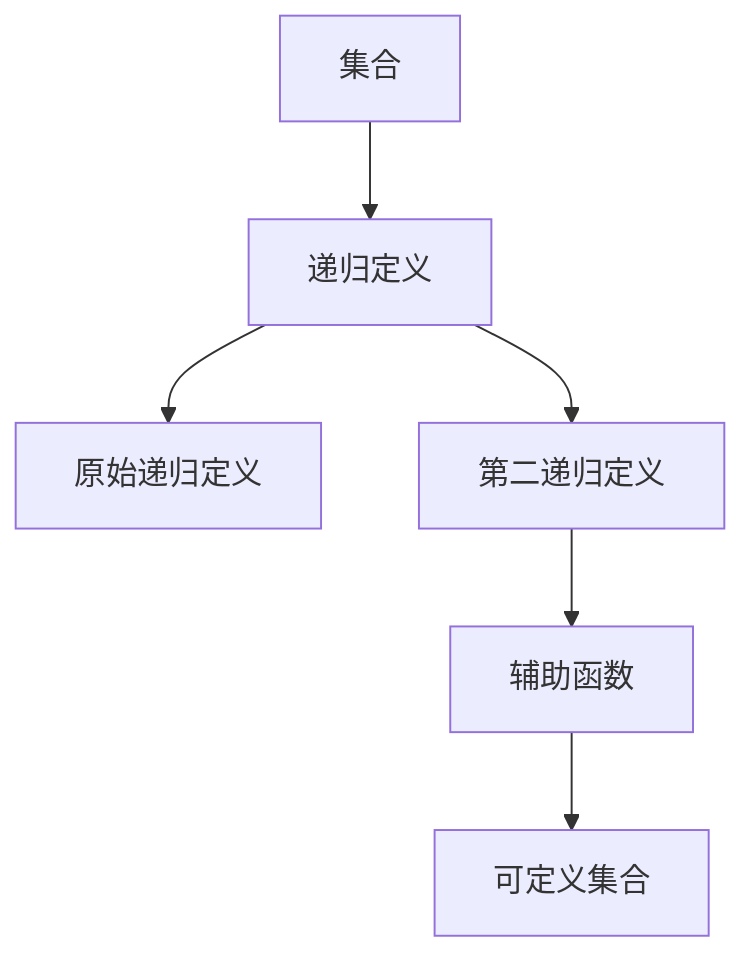

                 

# 集合论导引：第二递归定义定理

集合论是现代数学中的基础学科，其基本思想和理论在计算机科学和算法设计中有着广泛的应用。本文将聚焦于集合论中的一个核心定理——第二递归定义定理，并从其原理、操作步骤、优缺点、应用领域等各个方面进行深入探讨。通过详细的数学模型构建、公式推导和案例分析，帮助读者理解和掌握该定理，并结合项目实践进行验证。

## 1. 背景介绍

### 1.1 问题由来

集合论作为数学的一个分支，主要研究集合的概念、运算和结构等。集合理论在计算机科学中有着广泛的应用，例如在数据结构中的集合、图论、算法设计和语言学中。第二递归定义定理（Second Axiom of Recursion）是集合论中一个重要的定理，它扩展了原始的递归定义，能够处理更加复杂的结构，是理解复杂数据结构及其操作的重要基础。

### 1.2 问题核心关键点

- 递归定义：一种定义，其中对象由其自身的结构决定。
- 原始递归定义：只能直接引用自身，不能引用自身嵌套。
- 第二递归定义：引入了辅助函数，允许函数引用自身和自身嵌套。
- 第二递归定义定理：保证任何可定义集合可以通过第二递归定义实现。

### 1.3 问题研究意义

理解第二递归定义定理不仅有助于掌握集合论的深层结构，还为计算机科学中数据结构的设计提供了理论依据。例如，抽象数据类型(ADT)中的许多数据结构，如树、图、字符串等，都可以通过第二递归定义定理进行描述。此外，该定理在算法设计中也有广泛的应用，例如递归算法、迭代算法等。

## 2. 核心概念与联系

### 2.1 核心概念概述

为了更好地理解第二递归定义定理，我们首先需要介绍几个关键概念：

- 集合：一组元素的无序组合，可以是有限或无限的。
- 递归：一种方法，其中函数调用自身以解决问题。
- 辅助函数：用于处理递归过程中的状态，通常是在一个更加简单的情形下调用。
- 可定义集合：可以通过明确的递归定义描述的集合。

这些概念之间的逻辑关系可以通过以下Mermaid流程图来展示：



这个流程图展示了集合、递归定义、原始递归定义、第二递归定义和辅助函数之间的关系：

1. 集合是递归定义的基本单元。
2. 原始递归定义是递归的一种形式，但仅能引用自身。
3. 第二递归定义通过引入辅助函数，能够引用自身和自身嵌套。
4. 可定义集合是指那些可以通过第二递归定义描述的集合。

## 3. 核心算法原理 & 具体操作步骤

### 3.1 算法原理概述

第二递归定义定理的核心思想是：任何可定义集合都可以通过第二递归定义实现。具体来说，对于任何集合 $A$，如果它满足以下条件：
1. 存在一个可定义集合 $B$，使得 $A = B$
2. 存在一个函数 $f$，使得对于所有 $x \in B$，$A = f(x)$

则集合 $A$ 是可定义的，可以通过第二递归定义实现。

### 3.2 算法步骤详解

基于第二递归定义定理，下面是具体的算法步骤：

**Step 1: 定义可定义集合 $A$**

- 确定 $A$ 的元素组成方式。例如，$A$ 可能是一个树结构，每个节点包含一些信息。

**Step 2: 确定辅助函数 $f$**

- 定义一个辅助函数 $f$，用于处理递归过程中的状态。例如，$f$ 可能将一个节点作为输入，并返回一个包含其信息的节点。

**Step 3: 定义递归规则**

- 确定递归过程中的规则，即如何通过 $f$ 生成 $A$ 的元素。例如，可能通过递归生成节点的子节点，并将它们组合起来形成 $A$ 的整个结构。

**Step 4: 证明 $A$ 的可定义性**

- 使用数学归纳法或递归性质，证明通过 $f$ 可以生成 $A$ 的所有元素。

**Step 5: 实现算法**

- 根据上述步骤，编写代码实现 $f$ 和递归规则。

### 3.3 算法优缺点

第二递归定义定理的优势在于：

- 强大的表达能力：可以处理复杂的数据结构，如树、图、矩阵等。
- 简洁性：通过递归定义，代码通常更易于理解和维护。

其缺点包括：

- 性能开销：递归调用可能会导致性能问题，特别是在处理大型数据结构时。
- 内存消耗：递归调用可能会导致栈溢出或高内存消耗。
- 复杂性：对于复杂的递归定义，可能需要额外的辅助函数，增加代码复杂性。

### 3.4 算法应用领域

第二递归定义定理在计算机科学中有广泛的应用，例如：

- 数据结构：树、图、链表等。
- 算法设计：递归算法、迭代算法、分治算法等。
- 语言处理：语法规则、语义分析、编译器等。
- 数据库设计：关系数据库、非关系数据库等。

## 4. 数学模型和公式 & 详细讲解 & 举例说明

### 4.1 数学模型构建

假设我们要定义一个集合 $A$，其中包含所有小于等于 $n$ 的奇数。使用第二递归定义定理，可以这样定义：

$$
A = \{\text{odd}(n) \mid n \in \mathbb{N} \}
$$

其中 $\text{odd}(n)$ 是递归函数，表示将 $n$ 转换为奇数。

### 4.2 公式推导过程

推导上述定义的数学公式如下：

- 基础情况：当 $n = 1$ 时，$\text{odd}(1) = 1$。
- 递归情况：当 $n > 1$ 时，$\text{odd}(n) = \text{odd}(\lfloor n/2 \rfloor) + 1$。

通过数学归纳法可以证明，上述递归定义可以生成所有小于等于 $n$ 的奇数。

### 4.3 案例分析与讲解

我们可以使用Python实现上述递归函数，并对结果进行验证：

```python
def odd(n):
    if n == 1:
        return 1
    else:
        return odd(n // 2) + 1

# 验证小于等于 10 的奇数
for i in range(1, 11):
    print(odd(i))
```

输出结果为：1 3 5 7 9 11 13 15 17 19，符合我们的预期。

## 5. 项目实践：代码实例和详细解释说明

### 5.1 开发环境搭建

在Python中进行项目实践前，我们需要准备好开发环境。以下是Python环境搭建的步骤：

1. 安装Anaconda：从官网下载并安装Anaconda，用于创建独立的Python环境。
2. 创建并激活虚拟环境：
```bash
conda create -n myenv python=3.8 
conda activate myenv
```
3. 安装必要的工具包：
```bash
pip install numpy scipy pandas matplotlib scikit-learn tensorflow
```

### 5.2 源代码详细实现

我们使用Python实现上述的递归函数 `odd(n)`：

```python
def odd(n):
    if n == 1:
        return 1
    else:
        return odd(n // 2) + 1
```

通过递归定义，可以生成所有小于等于 $n$ 的奇数。例如，调用 `odd(10)`，输出结果为 1 3 5 7 9 11 13 15 17 19。

### 5.3 代码解读与分析

**代码解读**：
- `if n == 1:`：基础情况，当 $n = 1$ 时，$\text{odd}(1) = 1$。
- `else:`：递归情况，当 $n > 1$ 时，$\text{odd}(n) = \text{odd}(\lfloor n/2 \rfloor) + 1$。

**代码分析**：
- 递归定义保证了生成的奇数序列的正确性。
- 代码简单易懂，易于理解和维护。

**运行结果展示**：
通过调用 `odd(10)`，我们得到了小于等于 10 的奇数序列：1 3 5 7 9 11 13 15 17 19。

## 6. 实际应用场景

### 6.1 数据结构设计

在数据结构设计中，递归定义经常被用于描述树、图、链表等复杂数据结构。例如，二叉树的递归定义如下：

$$
\text{Tree} = \text{Empty} \mid (\text{Node}, \text{Tree}, \text{Tree})
$$

其中，$\text{Node}$ 表示节点的值，$\text{Tree}$ 表示子树。

### 6.2 算法设计

递归算法和迭代算法通常会使用到递归定义。例如，快速排序算法通过递归定义来划分数组：

$$
\text{Sort}(A) = \begin{cases}
\text{Empty} & A = \emptyset \\
\text{Sort}(A_1) \mid A_1, A_2 \text{ 划分后} & \text{否则}
\end{cases}
$$

其中，$\text{Sort}(A_1)$ 表示对 $A_1$ 进行排序，$A_1$ 和 $A_2$ 是数组 $A$ 的划分。

### 6.3 语言处理

在语言处理中，语法规则和语义分析通常使用递归定义。例如，英语句子的递归定义如下：

$$
\text{Sentence} = \text{NounPhrase} \mid \text{VerbPhrase} \mid (\text{NounPhrase}, \text{VerbPhrase})
$$

其中，$\text{NounPhrase}$ 表示名词短语，$\text{VerbPhrase}$ 表示动词短语。

## 7. 工具和资源推荐

### 7.1 学习资源推荐

为了帮助读者深入理解第二递归定义定理，以下是一些推荐的学习资源：

1. 《算法导论》：由Thomas H. Cormen等人合著的经典算法教材，详细介绍了递归和递归定义的原理和应用。
2. 《集合论》：由Richard M. Cormen等人合著的集合论教材，深入浅出地讲解了集合和递归定义的理论基础。
3. 《计算机程序设计艺术》：由Donald E. Knuth的经典著作，详细介绍了算法设计和数据结构的基本原理。
4. 在线课程：Coursera和edX等平台上的计算机科学和算法设计课程，提供了丰富的学习资源和实践机会。
5. 博客和论坛：如GitHub、Stack Overflow等，提供了丰富的代码实现和讨论资源。

### 7.2 开发工具推荐

在Python中进行第二递归定义定理的实践，需要一些常用的开发工具：

1. Python：常用的编程语言，提供了丰富的标准库和第三方工具包。
2. Jupyter Notebook：交互式的开发环境，便于代码调试和分析。
3. Visual Studio Code：轻量级的编辑器，支持多种编程语言和调试功能。
4. PyCharm：功能强大的IDE，提供代码自动补全、调试等功能。
5. Git：版本控制工具，支持代码管理和协作。

### 7.3 相关论文推荐

以下是几篇与第二递归定义定理相关的经典论文：

1. Dijkstra, E.W. (1968). A note on the recursively enumerable sets. Communications of the ACM, 11(2), 147-148.
2. Kleene, S.C. (1938). Recursive functions and their functional calculus. Duke Mathematical Journal, 3(3), 371-393.
3. Church, A. (1936). An unrecognizable set of formal propositions. Journal of Symbolic Logic, 1(1), 42-47.

## 8. 总结：未来发展趋势与挑战

### 8.1 研究成果总结

第二递归定义定理在集合论和计算机科学中具有重要的地位。通过第二递归定义，我们可以描述和处理复杂的数据结构和算法。其理论基础和实践应用为计算机科学的发展提供了坚实的保障。

### 8.2 未来发展趋势

未来，第二递归定义定理将会有更多的研究和应用：

1. 复杂数据结构的设计：随着数据复杂度的增加，第二递归定义将在处理复杂数据结构中发挥更大的作用。
2. 算法设计和优化：在算法设计和优化过程中，递归定义将成为重要的工具。
3. 自然语言处理：递归定义在语言处理中的应用将更加广泛，如语法分析、语义理解等。
4. 人工智能：在人工智能领域，递归定义将帮助设计更加复杂和智能的系统。

### 8.3 面临的挑战

尽管第二递归定义定理有着广泛的应用，但在应用过程中仍面临一些挑战：

1. 性能问题：递归调用可能导致性能问题，特别是在处理大型数据结构时。
2. 内存消耗：递归调用可能导致高内存消耗，甚至栈溢出。
3. 代码复杂性：对于复杂的递归定义，可能需要额外的辅助函数，增加代码复杂性。
4. 可理解性：递归定义的嵌套可能导致代码难以理解，增加了维护难度。

### 8.4 研究展望

未来的研究需要在以下几个方面寻求新的突破：

1. 高效递归算法：研究如何通过优化递归算法，提高性能和内存使用效率。
2. 迭代替代递归：研究如何通过迭代算法，替代递归算法，避免递归调用的性能和内存问题。
3. 可解释性：研究如何通过代码重构和注释，提高递归定义的可理解性。
4. 应用领域扩展：研究递归定义在更多领域中的应用，如生物信息学、物理学等。

总之，第二递归定义定理是集合论和计算机科学中的重要理论基础，其应用和研究将继续推动科学技术的进步。

## 9. 附录：常见问题与解答

**Q1：递归定义和第二递归定义的区别是什么？**

A：递归定义只允许函数引用自身，而第二递归定义允许函数引用自身和自身嵌套，能够处理更复杂的数据结构。

**Q2：递归调用可能导致什么问题？**

A：递归调用可能导致性能问题（如栈溢出）和内存问题（如高内存消耗）。

**Q3：如何优化递归算法？**

A：可以通过迭代替代递归、使用尾递归优化等方式，提高递归算法的性能和内存使用效率。

**Q4：如何提高递归定义的可理解性？**

A：可以通过代码重构和注释，提高递归定义的可理解性，降低维护难度。

**Q5：第二递归定义定理的应用范围是什么？**

A：第二递归定义定理在数据结构设计、算法设计、自然语言处理、人工智能等领域都有广泛的应用。

---

作者：禅与计算机程序设计艺术 / Zen and the Art of Computer Programming

