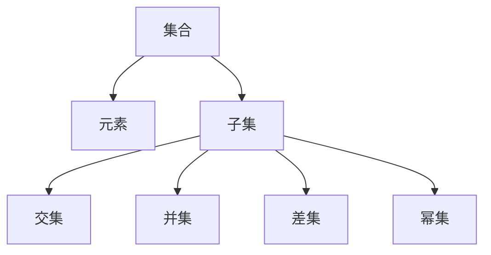
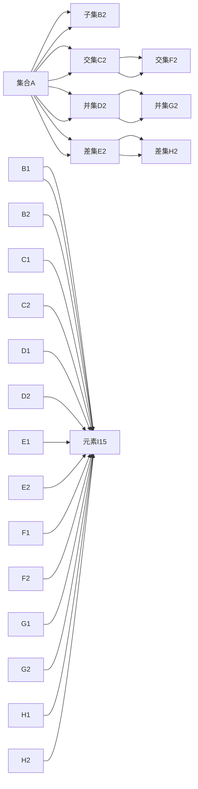

                 

## 1. 背景介绍

集合论是数学的基础理论之一，用于描述和研究集合的性质、结构与操作。它不仅是现代数学的基石，还在计算机科学、信息论、逻辑学等多个领域有广泛的应用。集合理论的核心概念包括集合、元素、子集、交集、并集、差集等，这些概念在算法设计、数据结构、计算机语言、人工智能等方面有深刻的理论基础和实际应用。

## 2. 核心概念与联系

### 2.1 核心概念概述

#### 集合
集合是具有某种特定性质的事物的总体。集合通常用大括号 `{}` 包含的元素表示，如 `{1, 2, 3}` 表示包含元素 1, 2, 3 的集合。集合元素可以是自己、其他集合，甚至可以是函数、集合等。

#### 元素
集合中的基本单元称为元素，集合中的每个元素都是唯一的。在 Python 中，集合元素可以是任何不可变类型（如整数、浮点数、字符串等），而集合本身则是一个可变对象，可以添加、删除元素。

#### 子集
如果一个集合的所有元素都属于另一个集合，则称该集合为另一个集合的子集。子集通常表示为 `A ⊆ B`，读作“A 是 B 的子集”。

#### 交集
两个或多个集合中共同包含的元素构成的集合称为这些集合的交集。用符号 `∩` 表示，如 `A ∩ B` 表示集合 A 和集合 B 的交集。

#### 并集
包含两个或多个集合中所有元素的集合称为这些集合的并集。用符号 `∪` 表示，如 `A ∪ B` 表示集合 A 和集合 B 的并集。

#### 差集
两个集合 A 和 B，A 中不属于 B 的元素构成的集合称为 A 和 B 的差集。用符号 `A - B` 或 `A \ B` 表示，如 `A - B` 表示集合 A 中不属于集合 B 的元素。

#### 幂集
集合的全部子集构成的集合称为该集合的幂集。幂集的大小为原集合大小的两倍。例如，集合 `{1, 2}` 的幂集为 `{[], {1}, {2}, {1, 2}}`。

这些基本概念相互联系，构成了集合论的基本框架，如图 1 所示。



### 2.2 核心概念原理和架构的 Mermaid 流程图

以下是一个简单的 Mermaid 流程图，展示了集合的基本操作和它们的联系：



## 3. 核心算法原理 & 具体操作步骤

### 3.1 算法原理概述

集合的算法操作主要包括集合的创建、元素的添加、元素的查询、子集的创建、交集、并集、差集等基本操作的实现。这些操作通常用 Python 内置的集合类型 `set` 实现，可以高效地处理集合的创建和基本操作。

### 3.2 算法步骤详解

#### 步骤 1: 创建集合
创建一个空集合 `s` 或使用大括号 `{}` 创建一个包含特定元素的集合，如 `s = {1, 2, 3}`。

#### 步骤 2: 添加元素
使用 `add()` 方法向集合 `s` 添加元素，如 `s.add(4)`。注意，Python 集合不支持重复元素，添加重复元素会被忽略。

#### 步骤 3: 查询元素
使用 `in` 操作符或 `count()` 方法查询元素是否在集合 `s` 中，如 `4 in s` 或 `s.count(4)`。

#### 步骤 4: 创建子集
使用集合的交集、并集、差集等操作创建子集，如 `A.intersection(B)` 或 `A.union(B)` 或 `A - B`。

#### 步骤 5: 集合操作
使用集合的交集、并集、差集等操作进行集合的基本运算，如 `A.intersection(B)` 或 `A.union(B)` 或 `A - B`。

#### 步骤 6: 集合转换
使用 `list()` 或 `tuple()` 将集合转换为列表或元组，如 `list(s)` 或 `tuple(s)`。

### 3.3 算法优缺点

#### 优点
1. 高效性：Python 内置的集合类型 `set` 使用哈希表实现，支持常数时间复杂度的基本操作。
2. 简洁性：集合类型简洁明了，易于理解和操作。
3. 可扩展性：集合类型可以方便地进行扩展和修改，适用于动态数据处理。

#### 缺点
1. 不支持有序元素：Python 集合是无序的，不支持元素的有序排列。
2. 不支持元素删除：Python 集合不支持删除元素，只能使用 `discard()` 方法。
3. 不支持重复元素：Python 集合不支持重复元素，删除重复元素需要手动处理。

### 3.4 算法应用领域

集合论在计算机科学中有广泛的应用，包括数据结构、算法设计、语言编译器、数据库系统、计算机网络等多个领域。例如：

1. 数据结构：集合是数据结构的重要组成部分，常用于表示和处理数据的集合、映射等。
2. 算法设计：集合的运算和操作是算法设计的基础，如排序、搜索、统计、图算法等。
3. 语言编译器：集合理论在编译器的语法分析、语义分析、代码优化等方面有重要应用。
4. 数据库系统：集合运算和操作是数据库查询、索引、事务处理的基础。
5. 计算机网络：集合理论在网络协议、路由算法、网络安全等方面有重要应用。

## 4. 数学模型和公式 & 详细讲解 & 举例说明

### 4.1 数学模型构建

集合论的基本数学模型包括集合、元素、子集、交集、并集、差集、幂集等，这些概念可以用符号表示，如：

- 集合：`A`
- 元素：`a`、`b`
- 子集：`B ⊆ A`
- 交集：`A ∩ B`
- 并集：`A ∪ B`
- 差集：`A - B`
- 幂集：`2^A`

### 4.2 公式推导过程

集合的基本公式推导如下：

1. 子集：`B ⊆ A` 等价于 `∀ a ∈ B, a ∈ A`
2. 交集：`A ∩ B = {x | x ∈ A ∧ x ∈ B}`
3. 并集：`A ∪ B = {x | x ∈ A ∧ x ∈ B} ∪ {x | x ∈ A ∨ x ∈ B}`
4. 差集：`A - B = {x | x ∈ A ∧ x ∉ B}`
5. 幂集：`2^A = {X | X ⊆ A}`

### 4.3 案例分析与讲解

假设集合 `A = {1, 2, 3}`，集合 `B = {3, 4, 5}`，则有：

- `A ∩ B = {3}`
- `A ∪ B = {1, 2, 3, 4, 5}`
- `A - B = {1, 2}`
- `B - A = {4, 5}`
- `A ∪ B = {1, 2, 3, 4, 5}`

## 5. 项目实践：代码实例和详细解释说明

### 5.1 开发环境搭建

创建一个 Python 3 虚拟环境，安装必要的库，如 `setuptools`、`pip` 等。

```bash
$ python -m venv myenv
$ source myenv/bin/activate
(myenv)$ pip install setuptools pip
(myenv)$ pip install sympy
(myenv)$ pip install numpy
```

### 5.2 源代码详细实现

```python
from sympy import symbols, Eq, solve, FiniteSet, Union, Intersection, Difference, Powerset

# 定义集合
A = FiniteSet(1, 2, 3)
B = FiniteSet(3, 4, 5)

# 求交集、并集、差集
intersection = A.intersection(B)
union = A.union(B)
difference = A - B
difference_B = B - A

# 求幂集
power_set = Powerset(A)

# 输出结果
print(intersection)
print(union)
print(difference)
print(difference_B)
print(power_set)
```

### 5.3 代码解读与分析

上述代码实现了集合的基本操作，使用 SymPy 库定义了两个集合 `A` 和 `B`，并通过集合的方法求出交集、并集、差集、幂集等。输出结果展示了这些基本集合运算的结果。

## 6. 实际应用场景

### 6.1 数据去重

在处理大量数据时，集合可以用于去重操作。例如，读取一个包含重复元素的文件，将每行数据转换为集合，然后求并集，即可去除重复行。

```python
with open('data.txt', 'r') as f:
    lines = f.readlines()
    lines_set = set(lines)
    unique_lines = list(lines_set)
    print(unique_lines)
```

### 6.2 算法设计

集合理论在算法设计中有着广泛的应用。例如，在搜索算法中，可以使用集合来表示搜索空间和可行解，优化搜索过程。

## 7. 工具和资源推荐

### 7.1 学习资源推荐

1. 《集合论》（Introduction to Set Theory）：由 Eric Weisstein 著，系统介绍了集合论的基本概念和应用。
2. 《Python 数据科学手册》（Python Data Science Handbook）：由 Jake VanderPlas 著，介绍了 Python 中的集合类型和基本操作。
3. 《算法导论》（Introduction to Algorithms）：由 Thomas H. Cormen 等著，介绍了算法设计和集合运算的结合。
4. 《计算机科学导论》（Computer Science: An Overview）：由 Eric Hehner 著，介绍了计算机科学的基础概念和集合理论的应用。

### 7.2 开发工具推荐

1. SymPy：用于符号计算的 Python 库，支持集合运算、差分方程、微积分等。
2. Python 内置的集合类型 `set`：用于高效地处理集合的基本操作。
3. Pandas：用于数据分析的 Python 库，支持集合类型和基本操作。

### 7.3 相关论文推荐

1. “Set Theory”：by Alfred North Whitehead and Bertrand Russell（《数学原理》）
2. “Axiomatic Set Theory”：by Kurt Gödel（《公理集合论》）
3. “Zermelo–Fraenkel set theory”：by Ernst Zermelo and Abraham Fraenkel（《策梅洛-弗兰克尔集合论》）

## 8. 总结：未来发展趋势与挑战

### 8.1 研究成果总结

集合论作为数学的基础理论，在计算机科学中有广泛的应用。近年来，随着人工智能、大数据、云计算等技术的不断发展，集合论在算法设计、数据处理、系统设计等方面有新的发展。

### 8.2 未来发展趋势

1. 集合论与大数据：集合论在大数据处理中有重要应用，如数据去重、数据清洗、数据集成等。
2. 集合论与人工智能：集合论在机器学习、深度学习、自然语言处理等领域有新的应用。
3. 集合论与量子计算：集合论在量子计算中有重要的应用，如量子态的表示和运算。

### 8.3 面临的挑战

1. 集合论与数学基础的争议：集合论在数学基础上的争议不断，如罗素悖论、连续统假说等，这些问题对集合论的未来发展有重要影响。
2. 集合论与计算机科学的融合：集合论与计算机科学的融合面临诸多挑战，如理论基础、应用场景、工具支持等。

### 8.4 研究展望

未来，集合论的研究将在以下几个方向进行：

1. 集合论与大数据：集合论在大数据处理中的应用将更加广泛，如数据去重、数据清洗、数据集成等。
2. 集合论与人工智能：集合论在机器学习、深度学习、自然语言处理等领域有新的应用，如集合表示、集合运算、集合聚类等。
3. 集合论与量子计算：集合论在量子计算中的应用将更加广泛，如量子态的表示和运算。

## 9. 附录：常见问题与解答

### 常见问题 Q1: 什么是集合论？

解答：集合论是数学的基础理论之一，用于描述和研究集合的性质、结构与操作。集合是具有某种特定性质的事物的总体，元素是集合中的基本单元，子集是包含在另一个集合中的元素集合，交集、并集、差集等是集合的运算操作。

### 常见问题 Q2: 如何处理集合中的元素重复问题？

解答：Python 内置的集合类型 `set` 可以自动去除重复元素，因此可以直接使用集合类型来处理集合中的重复元素。

### 常见问题 Q3: 如何计算集合的幂集？

解答：可以使用 SymPy 库中的 `Powerset` 方法计算集合的幂集。

### 常见问题 Q4: 集合论在计算机科学中有哪些应用？

解答：集合论在计算机科学中有广泛的应用，如数据结构、算法设计、语言编译器、数据库系统、计算机网络等。集合的基本操作可以用于数据去重、算法设计、数据库查询等。

