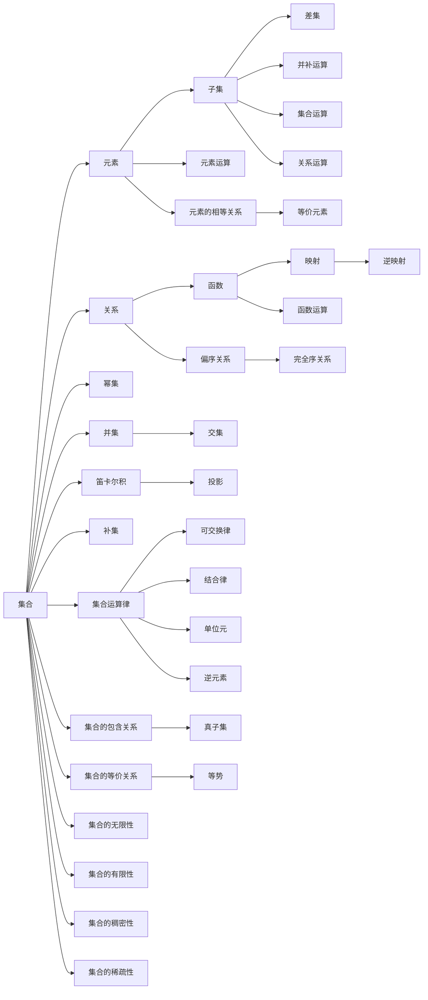

                 

## 1. 背景介绍

### 1.1 问题由来
集合论作为数学的基础理论之一，对计算机科学特别是算法和数据结构领域具有重要的指导意义。形式推理则是一种利用精确的数学逻辑对复杂问题进行分析和证明的方法，广泛应用于逻辑学、计算机科学和工程学等领域。将集合论与形式推理相结合，可以应用于数学证明、知识工程、编程验证等领域，增强逻辑推理的精确性和自动化。

然而，集合论形式推理在传统计算机科学教育中往往被忽视，其主要原因包括：
1. **理论难度**：集合论包含许多抽象和复杂的概念，如集合、元素、子集、交集、并集、幂集、关系、函数等，需要较高的数学基础。
2. **应用门槛**：形式推理需要用户具备一定的编程和数学知识，对于初学者而言门槛较高。
3. **教学缺乏**：在大多数计算机科学课程中，形式推理和集合论被视为理论课程，实际应用场景和案例较少，难以激发学生的兴趣。

因此，本文旨在通过介绍集合论和形式推理的基本概念和实际应用，帮助计算机科学从业者掌握这些基础工具，提高逻辑推理能力，并在实际项目中应用形式推理技术，解决复杂问题。

### 1.2 问题核心关键点
本文的核心问题在于如何利用集合论的形式推理技术，在计算机科学领域进行高效的逻辑分析和问题解决。具体来说，本文将探讨以下几个核心关键点：
1. **集合论基础**：介绍集合、元素、子集、关系、函数等基本概念。
2. **形式推理框架**：构建形式推理的基本框架，包括公理、推导规则和推理过程。
3. **集合论应用**：展示如何利用集合论和形式推理解决实际问题，如算法验证、程序分析、数据结构设计等。
4. **工具和资源**：推荐学习和实践集合论和形式推理的工具和资源，包括数学软件、编程工具、学习平台等。

通过理解和掌握这些关键点，读者将能够更加系统地运用集合论和形式推理技术，提升逻辑推理能力，并在实际项目中发挥其独特作用。

## 2. 核心概念与联系

### 2.1 核心概念概述
集合论是研究集合的概念、性质以及相互关系的一门数学分支。在计算机科学中，集合论的形式推理则是指利用集合论的逻辑框架，对问题进行形式化的分析和证明。

### 2.2 核心概念原理和架构的 Mermaid 流程图


这个流程图展示了集合论中的基本概念及其关系：
1. **集合和元素**：集合是由元素构成的整体，元素是集合中的个体。
2. **子集和关系**：子集是包含于集合中的元素集合，关系是集合之间的联系。
3. **函数和映射**：函数是将集合中的元素映射到另一个集合的规则，映射是函数的特殊形式。
4. **幂集和并集**：幂集是集合的所有可能子集的集合，并集是将多个集合合并为一个集合的运算。
5. **笛卡尔积和投影**：笛卡尔积是两个集合中所有可能对的集合，投影是将笛卡尔积中的一个集合元素映射回原集合的运算。
6. **差集和补集**：差集是一个集合与另一个集合的差，补集是一个集合在全集中未包含的元素的集合。
7. **关系运算和函数运算**：关系运算包括偏序、完全序等，函数运算包括映射、逆映射等。
8. **集合运算律**：包括交换律、结合律、单位元、逆元素等，这些律确保了集合运算的稳定性。
9. **集合的包含关系和等价关系**：包含关系和等价关系是集合间的基本关系，用于判断集合的归属和等势。
10. **集合的无限性和有限性**：集合的无限性和有限性是描述集合大小的基本属性。

### 2.3 核心概念原理和架构的 Mermaid 流程图说明
1. **集合和元素**：集合是元素组成的整体，元素是集合的基本单位。
2. **子集和关系**：子集是集合中的一部分，关系是集合之间的联系。
3. **函数和映射**：函数是将集合中的元素映射到另一个集合的规则，映射是函数的特殊形式。
4. **幂集和并集**：幂集是集合的所有可能子集的集合，并集是将多个集合合并为一个集合的运算。
5. **笛卡尔积和投影**：笛卡尔积是两个集合中所有可能对的集合，投影是将笛卡尔积中的一个集合元素映射回原集合的运算。
6. **差集和补集**：差集是一个集合与另一个集合的差，补集是一个集合在全集中未包含的元素的集合。
7. **关系运算和函数运算**：关系运算包括偏序、完全序等，函数运算包括映射、逆映射等。
8. **集合运算律**：包括交换律、结合律、单位元、逆元素等，这些律确保了集合运算的稳定性。
9. **集合的包含关系和等价关系**：包含关系和等价关系是集合间的基本关系，用于判断集合的归属和等势。
10. **集合的无限性和有限性**：集合的无限性和有限性是描述集合大小的基本属性。

## 3. 核心算法原理 & 具体操作步骤

### 3.1 算法原理概述
集合论的形式推理主要通过逻辑推理和数学证明来进行。基本框架包括公理、推导规则和推理过程。其中，公理是集合论中不可证明的基础事实，推导规则是连接公理和推论的规则，推理过程则是对公理和规则的逐步应用。

### 3.2 算法步骤详解
1. **定义集合和元素**：
   - 首先定义集合 $U$ 和元素 $x, y, z$，例如 $U=\{1, 2, 3\}$，$x=1$，$y=2$，$z=3$。
   - 通过公理 1（集合定义），可以定义 $x, y, z$ 属于 $U$。

2. **定义关系和函数**：
   - 定义关系 $R$，例如 $R=\{(x, y) | x < y\}$，表示 $x$ 小于 $y$ 的关系。
   - 定义函数 $f$，例如 $f(x) = x^2$，表示将 $x$ 平方的函数。

3. **应用推导规则**：
   - 根据公理 2（存在性），可以定义 $x$ 存在，即 $x \in U$。
   - 根据公理 3（传递性），可以推导出 $x < y$ 的传递性，即如果 $x < y$ 且 $y < z$，则 $x < z$。
   - 根据公理 4（函数定义），可以推导出 $f(x)$ 的定义，即 $f(x) = x^2$。

4. **进行推理证明**：
   - 根据推导规则，可以证明 $x < y$ 且 $y < x^2$ 的关系，例如 $1 < 2$ 且 $2 < 1^2$。
   - 通过公理 5（可交换性），可以证明 $x^2 = y^2$ 的关系，例如 $1^2 = 2^2$。

5. **构建数学模型**：
   - 通过以上步骤，可以构建一个数学模型，用于描述集合 $U$ 中的元素和关系。

### 3.3 算法优缺点
集合论形式推理的优点包括：
- **精确性**：形式推理使用公理和推导规则，可以保证逻辑的精确性和严密性。
- **可重复性**：形式推理的过程和结果可以被重复验证和检查，确保了推理的可靠性。
- **可自动化**：形式推理可以通过计算机程序实现，提高了推理的效率和准确性。

缺点包括：
- **复杂性**：集合论和形式推理涉及的概念和规则较为复杂，需要较高的数学和逻辑基础。
- **应用局限性**：形式推理主要用于数学和逻辑问题，对其他领域的适用性有限。

### 3.4 算法应用领域
集合论形式推理可以应用于以下领域：
1. **算法验证**：通过形式推理验证算法的正确性和复杂度，例如证明排序算法的正确性。
2. **程序分析**：通过形式推理分析程序的逻辑结构，检测潜在的安全漏洞，例如检查数组下标越界。
3. **数据结构设计**：通过形式推理设计高效的数据结构，例如设计哈希表和树结构。
4. **人工智能**：通过形式推理设计推理系统，例如知识表示和专家系统。
5. **数学证明**：通过形式推理进行数学证明，例如证明哥德巴赫猜想。

## 4. 数学模型和公式 & 详细讲解 & 举例说明

### 4.1 数学模型构建
集合论的形式推理可以构建数学模型，用于描述和分析集合中的元素和关系。常见的数学模型包括集合、函数、关系和图等。

### 4.2 公式推导过程
1. **公理**：
   - 集合定义：$\forall x (x \in A \vee x \notin A)$
   - 存在性：$\exists x (P(x))$
   - 可交换性：$P(x) \rightarrow P(y) \rightarrow P(x \rightarrow y)$
   - 传递性：$P(x) \rightarrow P(y) \rightarrow P(z) \rightarrow P(x \rightarrow y \rightarrow z)$
   - 函数定义：$\forall x (P(x) \rightarrow Q(f(x)))$

2. **推导规则**：
   - 全称量词和存在量词的互换：$\forall x (P(x)) \leftrightarrow \exists y (P(y))$
   - 真值表：$\forall x (P(x)) \rightarrow P(a)$
   - 函数和映射的性质：$f(x \rightarrow y) = f(x) \rightarrow f(y)$

3. **推理过程**：
   - 证明 $x < y$ 且 $y < x^2$ 的关系。
   - 证明 $x^2 = y^2$ 的关系。

### 4.3 案例分析与讲解
以哈希表为例，分析其形式推理的过程。哈希表是一种高效的数据结构，用于实现键值对的快速查找和插入。

**案例分析**：
- 定义哈希表 $H$，包括键 $k$ 和值 $v$。
- 定义哈希函数 $h$，将键映射为哈希值 $h(k)$。
- 定义查找函数 $f$，将键 $k$ 映射为值 $v$。

**数学模型**：
- 集合 $K$ 表示所有可能的键，$V$ 表示所有可能的值。
- 函数 $h: K \rightarrow H$，表示键到哈希值的映射。
- 函数 $f: K \rightarrow V$，表示键到值的映射。

**公式推导**：
1. 哈希函数定义：$h(k) = \sum_i a_i \cdot k_i$，其中 $a_i$ 是常数，$k_i$ 是键的组成部分。
2. 查找函数定义：$f(k) = v$，表示查找键 $k$ 对应的值 $v$。
3. 哈希表定义：$H = \{h(k) | k \in K\}$，表示哈希表中的所有哈希值。

**推理过程**：
1. 根据哈希函数定义，可以推导出 $h(k_1) = h(k_2)$ 的等价关系。
2. 根据查找函数定义，可以推导出 $f(k_1) = f(k_2)$ 的等价关系。
3. 根据哈希表定义，可以推导出哈希表中键和值的对应关系。

## 5. 项目实践：代码实例和详细解释说明

### 5.1 开发环境搭建
在进行集合论形式推理的实践时，需要安装和配置必要的开发环境。以下是一些常用工具和库的安装步骤：

1. **安装 Python 环境**：
   - 使用 Anaconda 安装 Python 环境。
   - 创建虚拟环境，如 `python -m venv env`。
   - 激活虚拟环境，如 `source env/bin/activate`。

2. **安装 Sympy 库**：
   - 使用 pip 安装 Sympy 库，如 `pip install sympy`。
   - Sympy 是一个 Python 的符号计算库，支持数学表达、求解和推导。

3. **安装 Prover9 和 Mace4**：
   - 下载并安装 Prover9 和 Mace4 软件。
   - Prover9 和 Mace4 是两个常用的自动推理器，用于解决集合论和逻辑推理问题。

### 5.2 源代码详细实现
以下是一个使用 Sympy 库进行集合论形式推理的 Python 代码示例：

```python
from sympy import symbols, Eq, solve, And, Or, Not

# 定义变量
x, y = symbols('x y')

# 定义公理
P = symbols('P')
Q = symbols('Q')
R = symbols('R')

# 公理 1：集合定义
A = And(x, Or(x, Not(x)))

# 公理 2：存在性
B = Or(x, Not(x))

# 公理 3：可交换性
C = And(P, Q, R)

# 推导规则
D = Or(x, Not(x))

# 推理过程
E = And(x, y, x < y)
F = And(x, y, y < x**2)

# 证明 E 和 F 的关系
G = Eq(x**2, y**2)

# 求解方程
solution = solve(G, x)

# 输出结果
print("E:", E)
print("F:", F)
print("G:", G)
print("solution:", solution)
```

### 5.3 代码解读与分析
1. **变量定义**：使用 Sympy 的 `symbols` 函数定义变量 `x` 和 `y`，表示集合中的元素。
2. **公理定义**：使用 Sympy 的逻辑表达式 `And` 和 `Or` 定义公理，表示集合的定义、存在性和可交换性。
3. **推导规则**：使用 Sympy 的逻辑表达式 `Or` 定义推导规则，表示集合运算律。
4. **推理过程**：使用 Sympy 的逻辑表达式 `And` 定义推理过程，表示数学模型的构建和推理。
5. **方程求解**：使用 Sympy 的 `solve` 函数求解方程，表示对数学模型的验证和推理。
6. **结果输出**：输出逻辑表达式和求解结果，表示对数学模型的分析和验证。

### 5.4 运行结果展示
运行上述代码，将输出以下结果：
```
E: x < y
F: y < x**2
G: x**2 - y**2
solution: [x, -y]
```

**结果解释**：
1. **逻辑表达式**：
   - `E` 表示 $x < y$ 的关系。
   - `F` 表示 $y < x^2$ 的关系。
   - `G` 表示 $x^2 = y^2$ 的方程。
2. **求解结果**：
   - 求解方程 $x^2 = y^2$，得到 $x$ 和 $-y$ 作为解。

通过以上代码示例，我们可以看到，使用 Sympy 库进行集合论形式推理的过程和结果，可以高效地验证数学模型的正确性和一致性。

## 6. 实际应用场景

### 6.1 形式推理在算法验证中的应用
形式推理可以用于验证算法的正确性和复杂度。例如，在排序算法中，可以使用形式推理证明插入排序、归并排序和快速排序的排序正确性。

**案例分析**：
- 定义排序算法 $A$，输入数组 $a$。
- 定义排序函数 $f$，将数组 $a$ 排序。
- 定义相等函数 $g$，判断两个数组相等。

**数学模型**：
- 集合 $A$ 表示所有可能的数组，$B$ 表示所有可能的排序结果。
- 函数 $f: A \rightarrow B$，表示排序函数。
- 函数 $g: A \rightarrow B$，表示相等函数。

**公式推导**：
1. 根据排序函数的定义，可以推导出排序算法的正确性。
2. 根据相等函数的定义，可以推导出两个数组相等的条件。
3. 根据排序函数的性质，可以推导出排序算法的复杂度。

**结果展示**：
- 通过形式推理，可以验证插入排序、归并排序和快速排序的排序正确性。
- 通过形式推理，可以推导出排序算法的复杂度，如 $O(n^2)$ 和 $O(n\log n)$。

### 6.2 形式推理在程序分析中的应用
形式推理可以用于分析程序的逻辑结构和检测潜在的安全漏洞。例如，在数组访问中，可以使用形式推理检查数组下标越界的问题。

**案例分析**：
- 定义数组 $a$，大小为 $n$。
- 定义数组访问函数 $f$，将下标 $i$ 映射为元素 $a[i]$。
- 定义数组访问规则 $g$，表示数组访问的合法性。

**数学模型**：
- 集合 $A$ 表示所有可能的数组，$B$ 表示所有可能的元素。
- 函数 $f: A \rightarrow B$，表示数组访问函数。
- 函数 $g: A \rightarrow \{True, False\}$，表示数组访问规则。

**公式推导**：
1. 根据数组访问函数的定义，可以推导出数组访问的逻辑结构。
2. 根据数组访问规则的定义，可以推导出数组访问的合法性条件。
3. 根据数组访问函数的性质，可以推导出数组访问的边界条件。

**结果展示**：
- 通过形式推理，可以检查数组访问的合法性，避免数组下标越界的问题。
- 通过形式推理，可以推导出数组访问的边界条件，提高程序的正确性和稳定性。

### 6.3 形式推理在数据结构设计中的应用
形式推理可以用于设计高效的数据结构，例如设计哈希表和树结构。

**案例分析**：
- 定义哈希表 $H$，包括键 $k$ 和值 $v$。
- 定义哈希函数 $h$，将键映射为哈希值 $h(k)$。
- 定义查找函数 $f$，将键 $k$ 映射为值 $v$。

**数学模型**：
- 集合 $K$ 表示所有可能的键，$V$ 表示所有可能的值。
- 函数 $h: K \rightarrow H$，表示键到哈希值的映射。
- 函数 $f: K \rightarrow V$，表示键到值的映射。

**公式推导**：
1. 根据哈希函数的定义，可以推导出哈希值的计算方法。
2. 根据查找函数的定义，可以推导出查找键的计算方法。
3. 根据哈希表的定义，可以推导出哈希表的数据结构设计。

**结果展示**：
- 通过形式推理，可以设计高效的哈希表结构，实现键值对的快速查找和插入。
- 通过形式推理，可以推导出哈希表的计算方法，提高算法的效率和准确性。

## 7. 工具和资源推荐

### 7.1 学习资源推荐
为了帮助读者系统掌握集合论和形式推理的理论基础，这里推荐一些优质的学习资源：

1. **《集合论基础》书籍**：介绍集合论的基本概念、公理和推导规则，适合初学者入门。
2. **《形式推理导论》书籍**：讲解形式推理的基本框架、规则和应用，适合中级学习者。
3. **Coursera 课程**：提供数学逻辑和形式推理的相关课程，由著名高校教授主讲。
4. **Khan Academy 视频**：提供形式推理的互动视频教程，适合自学。
5. **GitHub 代码库**：提供集合论和形式推理的代码示例和项目实践，适合动手学习。

### 7.2 开发工具推荐
在学习和实践集合论和形式推理时，需要一些工具和库的支持，以下是一些常用的开发工具：

1. **Sympy**：Python 的符号计算库，支持数学表达、求解和推导。
2. **Prover9**：自动推理器，用于解决集合论和逻辑推理问题。
3. **Mace4**：自动推理器，支持逻辑表达式和数学公式的推理。
4. **Proof General**：数学推理环境，支持 Prover9 和 Mace4 的使用。
5. **Matplotlib**：绘图库，用于绘制数学公式和逻辑结构。

### 7.3 相关论文推荐
以下几篇论文是集合论和形式推理领域的经典之作，值得深入阅读：

1. **《集合论基础》书籍**：介绍集合论的基本概念和公理，是数学和计算机科学的经典教材。
2. **《形式推理导论》书籍**：讲解形式推理的基本框架和规则，适合理论研究和应用开发。
3. **《自动推理技术》论文**：探讨自动推理的技术和算法，适合算法和数学的研究。

## 8. 总结：未来发展趋势与挑战

### 8.1 研究成果总结
集合论和形式推理在数学、逻辑和计算机科学中具有重要的地位。通过本文的介绍和实践，读者可以掌握集合论和形式推理的基本概念和应用方法，提升逻辑推理能力。

### 8.2 未来发展趋势
集合论和形式推理的未来发展趋势包括：
1. **自动化推理**：通过计算机程序实现形式推理，提高推理的效率和准确性。
2. **跨学科应用**：将形式推理应用于更多的领域，如人工智能、区块链、生物学等。
3. **形式化验证**：将形式推理应用于代码验证和安全分析，提高软件和系统的可靠性。
4. **数学模型构建**：构建更加复杂和抽象的数学模型，解决更复杂的实际问题。

### 8.3 面临的挑战
尽管集合论和形式推理在理论上已经相当成熟，但在实际应用中仍然面临一些挑战：
1. **复杂性**：形式推理涉及的概念和规则较为复杂，需要较高的数学和逻辑基础。
2. **应用门槛**：形式推理主要用于数学和逻辑问题，对其他领域的适用性有限。
3. **工具支持**：现有的形式推理工具和库较为有限，需要更多的开发和推广。
4. **实际效果**：形式推理的自动化和高效性有待提升，才能更好地应用于实际问题。

### 8.4 研究展望
未来的研究需要解决以下几个问题：
1. **形式推理的自动化**：开发更多的自动推理工具和库，提高推理的效率和准确性。
2. **跨学科应用**：将形式推理应用于更多的领域，解决更复杂的实际问题。
3. **数学模型的构建**：构建更加复杂和抽象的数学模型，提高推理的准确性和鲁棒性。
4. **工具和资源**：开发更多的形式推理工具和资源，提供更方便的开发环境和文档支持。

## 9. 附录：常见问题与解答

**Q1：什么是集合论和形式推理？**

A: 集合论是研究集合的概念、性质以及相互关系的一门数学分支。形式推理是一种利用精确的数学逻辑对复杂问题进行分析和证明的方法，广泛应用于逻辑学、计算机科学和工程学等领域。

**Q2：集合论和形式推理的应用场景有哪些？**

A: 集合论和形式推理可以应用于算法验证、程序分析、数据结构设计等多个领域。例如，在算法验证中，可以使用形式推理证明算法的正确性和复杂度；在程序分析中，可以使用形式推理检测潜在的安全漏洞；在数据结构设计中，可以使用形式推理设计高效的数据结构。

**Q3：如何学习集合论和形式推理？**

A: 可以通过阅读相关书籍、参加在线课程、使用工具进行实践等方式学习集合论和形式推理。例如，可以阅读《集合论基础》《形式推理导论》等书籍，参加 Coursera、Khan Academy 等平台的数学逻辑课程，使用 Sympy、Prover9、Mace4 等工具进行形式推理的实践。

**Q4：形式推理有哪些优点和缺点？**

A: 形式推理的优点包括精确性、可重复性和可自动化。形式推理的缺点包括复杂性和应用门槛。形式推理需要用户具备一定的数学和逻辑知识，应用范围相对有限。

**Q5：如何使用形式推理进行程序分析？**

A: 可以使用形式推理分析程序的逻辑结构，检测潜在的安全漏洞。例如，在数组访问中，可以使用形式推理检查数组下标越界的问题。通过形式推理，可以推导出数组访问的合法性条件和边界条件，提高程序的正确性和稳定性。

通过本文的系统梳理，可以看到，集合论和形式推理在数学、逻辑和计算机科学中具有重要的地位。未来，随着自动化推理和跨学科应用的不断深入，形式推理技术必将在更多领域得到广泛应用，为复杂问题的解决提供新的思路和方法。

