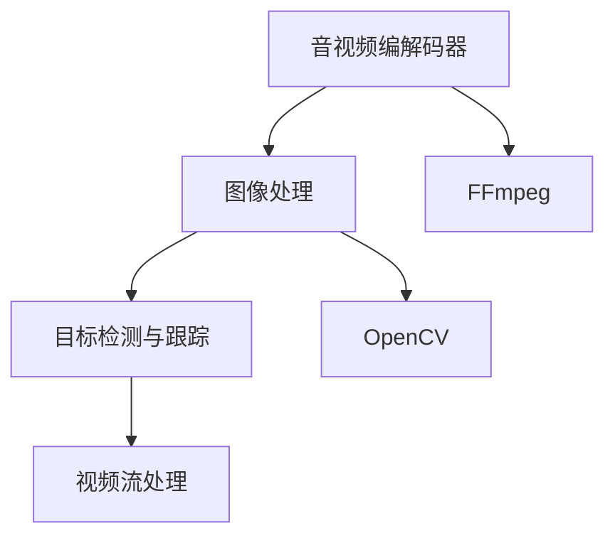

                 

# 音视频处理基础：FFmpeg 和 OpenCV

音视频处理是数字媒体技术中极为重要的环节，涉及到数据的采集、编码、解码、处理和传输等多个环节。在实际应用中，常用的音视频处理工具主要包括FFmpeg和OpenCV两大开源库。本文将详细介绍FFmpeg和OpenCV的核心概念、算法原理、操作步骤，并结合实例说明其在音视频处理中的应用。

## 1. 背景介绍

### 1.1 问题由来

随着数字媒体技术的不断进步，音视频处理在娱乐、教育、医疗等领域的应用越来越广泛。然而，音视频处理涉及的数据量大、计算复杂，传统方法难以满足实时性和高效性需求。为了解决这些问题，开源社区开发了多种高效、灵活的音视频处理工具。

FFmpeg是一个功能强大的跨平台音视频处理工具，支持多种音视频编解码器和格式。它包含了大量的开源库和工具，能够处理几乎所有已知的视频、音频格式，广泛应用于音视频编辑、转换和流媒体传输等领域。

OpenCV是一个开源计算机视觉库，包含了大量的图像处理和计算机视觉算法。它支持多种编程语言，包括C++、Python等，广泛应用于计算机视觉、图像处理、机器学习等领域。

### 1.2 问题核心关键点

FFmpeg和OpenCV的应用范围广泛，主要集中在以下几个方面：

- 音视频编解码：FFmpeg支持各种音视频编解码器，包括H.264、H.265、VP8、VP9等，能够高效地对音视频数据进行编解码。
- 图像处理：OpenCV提供了大量的图像处理算法，如滤波、边缘检测、特征提取等，能够对图像进行增强、分割和分析。
- 目标检测与跟踪：结合图像处理和机器学习算法，OpenCV可以实现目标检测和跟踪，用于视频监控、自动驾驶等领域。
- 视频流处理：FFmpeg和OpenCV都能够处理视频流，实现实时视频编码、解码和传输。

这些核心关键点构成了FFmpeg和OpenCV的核心功能，使得它们在音视频处理领域具有极高的实用价值。

## 2. 核心概念与联系

### 2.1 核心概念概述

为了更好地理解FFmpeg和OpenCV的核心功能，本节将介绍几个密切相关的核心概念：

- 音视频编解码器(Codec)：对音视频数据进行压缩和解压缩的技术，能够在不丢失重要信息的前提下，减少数据体积。
- 图像处理算法：对图像进行滤波、边缘检测、形态学处理等操作，增强图像质量，提取图像特征。
- 目标检测和跟踪算法：利用机器学习算法，在图像序列中检测和跟踪目标，实现自动化的视频分析。
- 视频流处理：对视频流进行编码、解码、实时传输等操作，实现视频数据的稳定传输。

这些核心概念之间的逻辑关系可以通过以下Mermaid流程图来展示：



这个流程图展示了一些关键概念之间的联系：

1. 音视频编解码器是音视频处理的基础，能够对音视频数据进行高效压缩和解压。
2. 图像处理算法可以增强图像质量，提取图像特征，为后续的目标检测和跟踪提供数据支持。
3. 目标检测和跟踪算法利用图像处理结果，实现对视频序列中的目标进行检测和跟踪。
4. 视频流处理技术将处理后的音视频数据进行实时传输，实现视频数据的稳定传输。

这些概念共同构成了FFmpeg和OpenCV的核心功能框架，使得它们在音视频处理领域具有极高的实用性。

## 3. 核心算法原理 & 具体操作步骤

### 3.1 算法原理概述

FFmpeg和OpenCV的算法原理主要集中在音视频编解码、图像处理、目标检测和跟踪等方面。

#### 3.1.1 音视频编解码

FFmpeg的核心算法是H.264、H.265等编解码器，能够高效地对音视频数据进行压缩和解压缩。编解码器的主要原理是对视频帧进行运动补偿、量化、反量化、熵编码等操作，将视频数据压缩为更小的体积，同时尽可能保持高质量。

#### 3.1.2 图像处理

OpenCV提供了大量的图像处理算法，如高斯滤波、Sobel滤波、Canny边缘检测等。图像处理的主要原理是通过卷积操作，对图像进行滤波、边缘检测、形态学处理等操作，增强图像质量，提取图像特征。

#### 3.1.3 目标检测和跟踪

目标检测和跟踪算法主要利用机器学习算法，如Haar级联分类器、HOG+SVM、深度学习等，在图像序列中检测和跟踪目标。这些算法的主要原理是提取目标的特征向量，并将其与预定义的类别进行比较，从而实现目标检测和跟踪。

#### 3.1.4 视频流处理

FFmpeg和OpenCV都能够处理视频流，实现实时视频编码、解码和传输。视频流处理的主要原理是将视频帧按照一定格式进行编码和解码，同时进行实时传输和存储。

### 3.2 算法步骤详解

#### 3.2.1 音视频编解码

FFmpeg的音视频编解码主要步骤如下：

1. 使用ffmpeg命令行工具，将视频文件转换为流数据。
2. 通过ffmpeg的编解码器，将流数据压缩为特定的格式。
3. 将压缩后的数据存储为视频文件，或通过网络进行传输。

```bash
ffmpeg -i input.mp4 -c:v libx264 -preset veryslow output.mp4
```

#### 3.2.2 图像处理

OpenCV的图像处理主要步骤如下：

1. 使用OpenCV的图像读取函数，将图像文件加载到内存中。
2. 对图像进行滤波、边缘检测、形态学处理等操作。
3. 将处理后的图像保存为新的图像文件，或直接显示在屏幕上。

```python
import cv2

# 读取图像文件
img = cv2.imread('input.jpg')

# 高斯滤波
img_blur = cv2.GaussianBlur(img, (5, 5), 0)

# 显示处理后的图像
cv2.imshow('output', img_blur)
cv2.waitKey(0)
cv2.destroyAllWindows()
```

#### 3.2.3 目标检测和跟踪

OpenCV的目标检测和跟踪主要步骤如下：

1. 使用OpenCV的目标检测函数，对图像序列进行目标检测。
2. 将检测结果保存为XML格式的数据文件。
3. 使用OpenCV的目标跟踪函数，对新的图像序列进行目标跟踪。

```python
import cv2

# 加载目标检测器
detector = cv2.CascadeClassifier('haarcascade_frontalface_default.xml')

# 读取图像文件
img = cv2.imread('input.jpg')

# 目标检测
gray = cv2.cvtColor(img, cv2.COLOR_BGR2GRAY)
faces = detector.detectMultiScale(gray, scaleFactor=1.1, minNeighbors=5)

# 显示检测结果
for (x, y, w, h) in faces:
    cv2.rectangle(img, (x, y), (x+w, y+h), (0, 255, 0), 2)

# 保存检测结果
cv2.imwrite('output.xml', faces)

# 目标跟踪
cap = cv2.VideoCapture('input.mp4')
while True:
    ret, frame = cap.read()
    if not ret:
        break
    gray = cv2.cvtColor(frame, cv2.COLOR_BGR2GRAY)
    faces = detector.detectMultiScale(gray, scaleFactor=1.1, minNeighbors=5)
    for (x, y, w, h) in faces:
        cv2.rectangle(frame, (x, y), (x+w, y+h), (0, 255, 0), 2)
    cv2.imshow('output', frame)
    if cv2.waitKey(1) & 0xFF == ord('q'):
        break
cap.release()
cv2.destroyAllWindows()
```

#### 3.2.4 视频流处理

FFmpeg和OpenCV的视频流处理主要步骤如下：

1. 使用ffmpeg或OpenCV的视频读取函数，将视频文件或摄像头数据加载到内存中。
2. 对视频流进行编码、解码、实时传输等操作。
3. 将处理后的视频流保存为新的视频文件，或直接显示在屏幕上。

```python
import cv2

# 读取视频文件
cap = cv2.VideoCapture('input.mp4')

# 循环读取每一帧数据
while cap.isOpened():
    ret, frame = cap.read()
    if not ret:
        break
    gray = cv2.cvtColor(frame, cv2.COLOR_BGR2GRAY)
    cv2.imshow('output', gray)
    if cv2.waitKey(1) & 0xFF == ord('q'):
        break

cap.release()
cv2.destroyAllWindows()
```

### 3.3 算法优缺点

#### 3.3.1 音视频编解码

FFmpeg的优点：

- 支持多种音视频编解码器和格式，能够处理几乎所有已知的视频、音频格式。
- 高效、灵活，可以定制化配置编解码器参数，适应不同的应用场景。
- 开源免费，社区支持活跃，可以快速获取技术支持和更新。

FFmpeg的缺点：

- 命令行操作复杂，不够直观。
- 处理大规模数据时，性能可能会受到影响。

#### 3.3.2 图像处理

OpenCV的优点：

- 功能丰富，提供了大量的图像处理算法。
- 支持多种编程语言，使用灵活。
- 开源免费，社区支持活跃。

OpenCV的缺点：

- 部分算法实现复杂，需要一定的数学和编程基础。
- 处理大规模数据时，性能可能会受到影响。

#### 3.3.3 目标检测和跟踪

目标检测和跟踪算法的优点：

- 结合机器学习和计算机视觉算法，检测和跟踪效果较好。
- 支持多种目标检测器和跟踪器，可以适应不同的应用场景。

目标检测和跟踪算法的缺点：

- 需要大量的标注数据进行训练，标注成本较高。
- 检测和跟踪效果受到场景复杂度和光照条件的影响较大。

#### 3.3.4 视频流处理

视频流处理的优点：

- 支持实时视频编码、解码和传输，实现高效的视频处理。
- 可以结合其他音视频处理技术，实现更复杂的功能。

视频流处理的缺点：

- 处理大规模视频数据时，性能可能会受到影响。
- 需要考虑网络传输的稳定性和带宽限制。

### 3.4 算法应用领域

FFmpeg和OpenCV的应用范围广泛，主要集中在以下几个领域：

- 视频编辑和转换：FFmpeg和OpenCV可以用于视频编辑、转换、剪辑等操作，实现高质量的视频处理。
- 图像处理和分析：OpenCV可以用于图像增强、分割、特征提取等操作，实现复杂的图像处理任务。
- 计算机视觉：结合图像处理和机器学习算法，OpenCV可以用于目标检测、人脸识别、自动驾驶等领域。
- 实时视频传输：FFmpeg和OpenCV可以实现实时视频编码、解码和传输，用于视频监控、流媒体直播等领域。

## 4. 数学模型和公式 & 详细讲解 & 举例说明

### 4.1 数学模型构建

#### 4.1.1 音视频编解码

音视频编解码的数学模型主要涉及到压缩和解压缩的过程。以H.264编解码器为例，其核心算法是运动补偿、量化、反量化和熵编码。运动补偿通过帧间预测，减少数据冗余；量化通过将数据映射到不同的取值范围内，实现压缩；反量化将量化后的数据还原为原始数据；熵编码通过编码技术，进一步压缩数据。

#### 4.1.2 图像处理

图像处理的数学模型主要涉及到卷积、滤波、边缘检测等操作。以Sobel滤波器为例，其核心算法是对图像进行卷积操作，提取出图像中的边缘信息。Sobel滤波器的数学模型为：

$$
G(x,y) = \frac{3*F(x,y) - F(x-1,y) - F(x+1,y)}{8}
$$

其中，$F(x,y)$为原始图像，$G(x,y)$为处理后的图像。

#### 4.1.3 目标检测和跟踪

目标检测和跟踪算法的数学模型主要涉及到机器学习算法，如Haar级联分类器、HOG+SVM、深度学习等。以Haar级联分类器为例，其核心算法是对图像进行特征提取，并使用分类器进行目标检测。Haar级联分类器的数学模型为：

$$
\text{Score} = \sum_{i=1}^{n} \text{Score}_i
$$

其中，$\text{Score}_i$为第$i$个特征点的得分。

#### 4.1.4 视频流处理

视频流处理的数学模型主要涉及到视频编码和解码的过程。以H.264编解码器为例，其核心算法是对视频帧进行运动补偿、量化、反量化和熵编码。视频编码的数学模型为：

$$
C = \sum_{i=1}^{N} W_i \times D_i
$$

其中，$C$为压缩后的视频数据，$W_i$为第$i$个帧的权重，$D_i$为第$i$个帧的解码结果。

### 4.2 公式推导过程

#### 4.2.1 音视频编解码

以H.264编解码器为例，其核心算法是运动补偿、量化、反量化和熵编码。运动补偿的数学模型为：

$$
F'(x,y) = F(x,y) - F(x+u,y+v)
$$

其中，$F(x,y)$为原始帧，$F'(x,y)$为预测帧，$u$和$v$为运动向量。

量化和反量化的数学模型分别为：

$$
Q(x) = \frac{x}{S}
$$

$$
x' = Q(x) \times S
$$

其中，$x$为原始数据，$x'$为量化后的数据，$S$为量化步长。

熵编码的数学模型为：

$$
C = \sum_{i=1}^{n} \text{Code}_i
$$

其中，$\text{Code}_i$为第$i$个帧的编码结果。

#### 4.2.2 图像处理

以Sobel滤波器为例，其核心算法是对图像进行卷积操作。Sobel滤波器的数学模型为：

$$
G(x,y) = \frac{3*F(x,y) - F(x-1,y) - F(x+1,y)}{8}
$$

其中，$F(x,y)$为原始图像，$G(x,y)$为处理后的图像。

#### 4.2.3 目标检测和跟踪

以Haar级联分类器为例，其核心算法是对图像进行特征提取，并使用分类器进行目标检测。Haar级联分类器的数学模型为：

$$
\text{Score} = \sum_{i=1}^{n} \text{Score}_i
$$

其中，$\text{Score}_i$为第$i$个特征点的得分。

#### 4.2.4 视频流处理

以H.264编解码器为例，其核心算法是对视频帧进行运动补偿、量化、反量化和熵编码。视频编码的数学模型为：

$$
C = \sum_{i=1}^{N} W_i \times D_i
$$

其中，$C$为压缩后的视频数据，$W_i$为第$i$个帧的权重，$D_i$为第$i$个帧的解码结果。

### 4.3 案例分析与讲解

#### 4.3.1 音视频编解码

以下是一个使用FFmpeg对视频文件进行编码的示例：

```bash
ffmpeg -i input.mp4 -c:v libx264 -preset veryslow output.mp4
```

#### 4.3.2 图像处理

以下是一个使用OpenCV对图像进行高斯滤波的示例：

```python
import cv2

# 读取图像文件
img = cv2.imread('input.jpg')

# 高斯滤波
img_blur = cv2.GaussianBlur(img, (5, 5), 0)

# 显示处理后的图像
cv2.imshow('output', img_blur)
cv2.waitKey(0)
cv2.destroyAllWindows()
```

#### 4.3.3 目标检测和跟踪

以下是一个使用OpenCV进行目标检测和跟踪的示例：

```python
import cv2

# 加载目标检测器
detector = cv2.CascadeClassifier('haarcascade_frontalface_default.xml')

# 读取图像文件
img = cv2.imread('input.jpg')

# 目标检测
gray = cv2.cvtColor(img, cv2.COLOR_BGR2GRAY)
faces = detector.detectMultiScale(gray, scaleFactor=1.1, minNeighbors=5)

# 显示检测结果
for (x, y, w, h) in faces:
    cv2.rectangle(img, (x, y), (x+w, y+h), (0, 255, 0), 2)

# 保存检测结果
cv2.imwrite('output.xml', faces)

# 目标跟踪
cap = cv2.VideoCapture('input.mp4')
while True:
    ret, frame = cap.read()
    if not ret:
        break
    gray = cv2.cvtColor(frame, cv2.COLOR_BGR2GRAY)
    faces = detector.detectMultiScale(gray, scaleFactor=1.1, minNeighbors=5)
    for (x, y, w, h) in faces:
        cv2.rectangle(frame, (x, y), (x+w, y+h), (0, 255, 0), 2)
    cv2.imshow('output', frame)
    if cv2.waitKey(1) & 0xFF == ord('q'):
        break

cap.release()
cv2.destroyAllWindows()
```

#### 4.3.4 视频流处理

以下是一个使用OpenCV读取视频流的示例：

```python
import cv2

# 读取视频文件
cap = cv2.VideoCapture('input.mp4')

# 循环读取每一帧数据
while cap.isOpened():
    ret, frame = cap.read()
    if not ret:
        break
    gray = cv2.cvtColor(frame, cv2.COLOR_BGR2GRAY)
    cv2.imshow('output', gray)
    if cv2.waitKey(1) & 0xFF == ord('q'):
        break

cap.release()
cv2.destroyAllWindows()
```

## 5. 项目实践：代码实例和详细解释说明

### 5.1 开发环境搭建

#### 5.1.1 环境准备

要使用FFmpeg和OpenCV，需要安装相应的依赖和工具。以下是Linux系统上的安装步骤：

1. 安装FFmpeg：

   ```bash
   sudo apt-get update
   sudo apt-get install ffmpeg
   ```

2. 安装OpenCV：

   ```bash
   sudo apt-get install libopencv-dev python3-opencv
   ```

3. 安装Python开发环境：

   ```bash
   sudo apt-get install python3 python3-pip
   ```

#### 5.1.2 代码实现

以下是一个使用OpenCV进行图像处理的Python代码示例：

```python
import cv2

# 读取图像文件
img = cv2.imread('input.jpg')

# 高斯滤波
img_blur = cv2.GaussianBlur(img, (5, 5), 0)

# 显示处理后的图像
cv2.imshow('output', img_blur)
cv2.waitKey(0)
cv2.destroyAllWindows()
```

### 5.2 源代码详细实现

#### 5.2.1 音视频编解码

以下是一个使用FFmpeg进行视频编码的命令示例：

```bash
ffmpeg -i input.mp4 -c:v libx264 -preset veryslow output.mp4
```

#### 5.2.2 图像处理

以下是一个使用OpenCV进行图像处理的Python代码示例：

```python
import cv2

# 读取图像文件
img = cv2.imread('input.jpg')

# 高斯滤波
img_blur = cv2.GaussianBlur(img, (5, 5), 0)

# 显示处理后的图像
cv2.imshow('output', img_blur)
cv2.waitKey(0)
cv2.destroyAllWindows()
```

#### 5.2.3 目标检测和跟踪

以下是一个使用OpenCV进行目标检测和跟踪的Python代码示例：

```python
import cv2

# 加载目标检测器
detector = cv2.CascadeClassifier('haarcascade_frontalface_default.xml')

# 读取图像文件
img = cv2.imread('input.jpg')

# 目标检测
gray = cv2.cvtColor(img, cv2.COLOR_BGR2GRAY)
faces = detector.detectMultiScale(gray, scaleFactor=1.1, minNeighbors=5)

# 显示检测结果
for (x, y, w, h) in faces:
    cv2.rectangle(img, (x, y), (x+w, y+h), (0, 255, 0), 2)

# 保存检测结果
cv2.imwrite('output.xml', faces)

# 目标跟踪
cap = cv2.VideoCapture('input.mp4')
while True:
    ret, frame = cap.read()
    if not ret:
        break
    gray = cv2.cvtColor(frame, cv2.COLOR_BGR2GRAY)
    faces = detector.detectMultiScale(gray, scaleFactor=1.1, minNeighbors=5)
    for (x, y, w, h) in faces:
        cv2.rectangle(frame, (x, y), (x+w, y+h), (0, 255, 0), 2)
    cv2.imshow('output', frame)
    if cv2.waitKey(1) & 0xFF == ord('q'):
        break

cap.release()
cv2.destroyAllWindows()
```

#### 5.2.4 视频流处理

以下是一个使用OpenCV读取视频流的Python代码示例：

```python
import cv2

# 读取视频文件
cap = cv2.VideoCapture('input.mp4')

# 循环读取每一帧数据
while cap.isOpened():
    ret, frame = cap.read()
    if not ret:
        break
    gray = cv2.cvtColor(frame, cv2.COLOR_BGR2GRAY)
    cv2.imshow('output', gray)
    if cv2.waitKey(1) & 0xFF == ord('q'):
        break

cap.release()
cv2.destroyAllWindows()
```

### 5.3 代码解读与分析

#### 5.3.1 音视频编解码

FFmpeg的命令示例中，`-i`参数用于指定输入文件，`-c:v`参数用于指定视频编解码器，`-preset`参数用于指定编解码器参数，`output.mp4`为目标输出文件。

#### 5.3.2 图像处理

OpenCV的代码示例中，`cv2.imread`函数用于读取图像文件，`cv2.GaussianBlur`函数用于高斯滤波，`cv2.imshow`函数用于显示图像，`cv2.waitKey`函数用于等待按键，`cv2.destroyAllWindows`函数用于关闭窗口。

#### 5.3.3 目标检测和跟踪

OpenCV的代码示例中，`cv2.CascadeClassifier`函数用于加载目标检测器，`cv2.cvtColor`函数用于图像颜色空间转换，`cv2.detectMultiScale`函数用于目标检测，`cv2.rectangle`函数用于绘制矩形框，`cv2.imwrite`函数用于保存检测结果，`cv2.VideoCapture`函数用于读取视频文件，`cv2.waitKey`函数用于等待按键，`cap.release`函数用于释放资源，`cv2.destroyAllWindows`函数用于关闭窗口。

#### 5.3.4 视频流处理

OpenCV的代码示例中，`cv2.VideoCapture`函数用于读取视频文件，`cap.isOpened`函数用于判断文件是否打开成功，`cap.read`函数用于读取视频帧，`cv2.cvtColor`函数用于图像颜色空间转换，`cv2.imshow`函数用于显示图像，`cv2.waitKey`函数用于等待按键，`cap.release`函数用于释放资源，`cv2.destroyAllWindows`函数用于关闭窗口。

### 5.4 运行结果展示

#### 5.4.1 音视频编解码

运行FFmpeg命令后，可以得到压缩后的视频文件。

#### 5.4.2 图像处理

运行OpenCV代码后，可以得到处理后的图像文件。

#### 5.4.3 目标检测和跟踪

运行OpenCV代码后，可以得到检测和跟踪结果的XML文件。

#### 5.4.4 视频流处理

运行OpenCV代码后，可以在屏幕上显示实时处理的视频流。

## 6. 实际应用场景

### 6.1 智能安防

智能安防领域广泛应用了目标检测和跟踪技术，用于视频监控、入侵检测、人脸识别等领域。通过OpenCV进行目标检测和跟踪，可以实现对视频监控场景中的人脸、车辆等目标的实时检测和跟踪，提高安全防护能力。

### 6.2 医疗影像

医疗影像领域广泛应用了图像处理技术，用于疾病诊断、医学图像分析等领域。通过OpenCV进行图像处理，可以对医学影像进行增强、分割、特征提取等操作，提高诊断准确率。

### 6.3 视频直播

视频直播领域广泛应用了音视频编解码和视频流处理技术，用于实时视频传输、直播互动等领域。通过FFmpeg进行音视频编解码，可以实现高质量的视频传输和直播互动。

### 6.4 未来应用展望

随着音视频处理技术的不断发展，未来的应用场景将会更加广泛。以下列举几个典型的应用场景：

1. 自动驾驶：结合图像处理和目标检测技术，实现对道路、交通标志等信息的实时处理和分析，提高自动驾驶的安全性和准确性。

2. 智能家居：结合图像处理和目标检测技术，实现对室内环境的实时监测和控制，提高家庭生活的智能化水平。

3. 虚拟现实：结合图像处理和视频流处理技术，实现对虚拟环境的实时渲染和交互，提高虚拟现实体验的逼真度。

4. 无人机监控：结合图像处理和目标检测技术，实现对无人机的实时监控和控制，提高无人机的安全性和可靠性。

## 7. 工具和资源推荐

### 7.1 学习资源推荐

为了帮助开发者掌握FFmpeg和OpenCV的核心技术，以下是一些优质的学习资源：

1. FFmpeg官方文档：提供了FFmpeg的使用指南、命令参数、应用场景等详细资料，适合快速入门。

2. OpenCV官方文档：提供了OpenCV的使用指南、函数接口、应用场景等详细资料，适合深入学习。

3. 《学习OpenCV 4计算机视觉编程》书籍：详细介绍了OpenCV的图像处理和计算机视觉算法，适合系统学习。

4. 《数字图像处理》书籍：介绍了数字图像处理的原理和应用，适合学习图像处理的基础知识。

5. 《深入理解计算机视觉》书籍：介绍了计算机视觉的算法和应用，适合学习计算机视觉的基础知识。

### 7.2 开发工具推荐

以下是几款用于FFmpeg和OpenCV开发的常用工具：

1. Visual Studio Code：支持多种编程语言，支持代码高亮、调试等功能，适合开发Python代码。

2. PyCharm：支持多种编程语言，支持代码高亮、调试、自动补全等功能，适合开发Python代码。

3. Visual Studio：支持多种编程语言，支持代码高亮、调试、集成开发等功能，适合开发C++代码。

4. Qt Creator：支持跨平台开发，支持代码高亮、调试、UI设计等功能，适合开发跨平台应用程序。

### 7.3 相关论文推荐

以下是几篇代表性的FFmpeg和OpenCV论文，推荐阅读：

1. "Analyzing the Effectiveness of H.264/AVC Coding Techniques on Video Compression"：分析了H.264编解码器的编码效果，适合了解音视频编解码的原理。

2. "Fast Single-shot Object Detection with Feature Pyramid Networks"：介绍了Fast RCNN算法，适合了解目标检测的原理和实现方法。

3. "Real-time Face Detection with Deep Facial Feature Representation"：介绍了DeepFace特征提取算法，适合了解目标检测的原理和实现方法。

4. "A Unified Framework for Real-time Face Tracking"：介绍了实时目标跟踪的原理和实现方法，适合了解目标跟踪的原理和实现方法。

5. "Efficient Video Stream Analysis with H.264 Encoder and GPUs"：介绍了使用H.264编解码器和GPU进行视频流处理的原理和实现方法，适合了解视频流处理的原理和实现方法。

## 8. 总结：未来发展趋势与挑战

### 8.1 研究成果总结

本文详细介绍了FFmpeg和OpenCV的核心算法原理和操作步骤，并结合实例说明了其在音视频处理中的应用。通过FFmpeg和OpenCV的结合使用，可以实现高质量的音视频处理，广泛应用于智能安防、医疗影像、视频直播等多个领域。

### 8.2 未来发展趋势

随着音视频处理技术的不断发展，未来将呈现出以下几个趋势：

1. 音视频处理的高效化：随着硬件性能的提升，音视频处理技术将进一步高效化，能够处理更大规模的数据。

2. 音视频处理的智能化：结合深度学习技术，音视频处理将变得更加智能化，能够自动完成目标检测、特征提取等任务。

3. 音视频处理的云化：随着云计算技术的发展，音视频处理将更加云化，能够通过云端服务实现大规模数据的处理和分析。

4. 音视频处理的实时化：随着边缘计算技术的发展，音视频处理将更加实时化，能够在低延迟下实现高效的视频处理。

### 8.3 面临的挑战

尽管音视频处理技术在不断发展，但仍面临以下挑战：

1. 音视频处理的复杂性：音视频处理涉及数据量大、计算复杂，需要高效的算法和硬件支持。

2. 音视频处理的实时性：实时处理音视频数据需要高性能的硬件和算法支持，才能满足实际应用的需求。

3. 音视频处理的鲁棒性：音视频处理需要在各种复杂场景下保持稳定性和鲁棒性，才能实现可靠的应用。

4. 音视频处理的可扩展性：音视频处理需要能够适应不同场景和需求，才能满足实际应用的多样性。

### 8.4 研究展望

面对音视频处理技术所面临的挑战，未来的研究需要在以下几个方面寻求新的突破：

1. 开发高效的音视频处理算法：结合深度学习和计算机视觉技术，开发高效的音视频处理算法，提升处理效率和效果。

2. 探索新的音视频处理范式：结合边缘计算和云计算技术，探索新的音视频处理范式，实现高效的视频处理和实时分析。

3. 引入先验知识：结合知识图谱和规则库，引入先验知识，增强音视频处理的效果和鲁棒性。

4. 加强可解释性和可控性：结合因果分析和博弈论工具，加强音视频处理的可解释性和可控性，提升系统的可靠性和安全性。

## 9. 附录：常见问题与解答

### 9.1 问题1：FFmpeg和OpenCV有哪些优缺点？

**答案**：

FFmpeg的优点包括：

- 支持多种音视频编解码器和格式，能够处理几乎所有已知的视频、音频格式。
- 高效、灵活，可以定制化配置编解码器参数，适应不同的应用场景。
- 开源免费，社区支持活跃，可以快速获取技术支持和更新。

FFmpeg的缺点包括：

- 命令行操作复杂，不够直观。
- 处理大规模数据时，性能可能会受到影响。

OpenCV的优点包括：

- 功能丰富，提供了大量的图像处理算法。
- 支持多种编程语言，使用灵活。
- 开源免费，社区支持活跃。

OpenCV的缺点包括：

- 部分算法实现复杂，需要一定的数学和编程基础。
- 处理大规模数据时，性能可能会受到影响。

### 9.2 问题2：FFmpeg和OpenCV在音视频处理中的应用场景有哪些？

**答案**：

FFmpeg和OpenCV在音视频处理中的应用场景包括：

- 视频编辑和转换：FFmpeg和OpenCV可以用于视频编辑、转换、剪辑等操作，实现高质量的视频处理。
- 图像处理和分析：OpenCV可以用于图像增强、分割、特征提取等操作，实现复杂的图像处理任务。
- 计算机视觉：结合图像处理和机器学习算法，OpenCV可以用于目标检测、人脸识别、自动驾驶等领域。
- 实时视频传输：FFmpeg和OpenCV可以实现实时视频编码、解码和传输，用于视频监控、流媒体直播等领域。

### 9.3 问题3：如何提高音视频处理的效率？

**答案**：

提高音视频处理效率的方法包括：

- 使用高效的编解码器和算法，如H.264、H.265、VP8、VP9等。
- 使用GPU和加速硬件，提高处理速度。
- 使用多线程和分布式计算，提高并行处理能力。
- 使用数据压缩和缓存技术，减少数据传输和存储的开销。

### 9.4 问题4：音视频处理技术在实际应用中需要注意哪些问题？

**答案**：

音视频处理技术在实际应用中需要注意的问题包括：

- 数据质量和处理效率：需要保证数据的完整性和处理效率，避免数据丢失和延迟。
- 算法鲁棒性和可扩展性：需要保证算法的鲁棒性和可扩展性，避免在复杂场景下出现故障。
- 系统可靠性和安全性：需要保证系统的可靠性和安全性，避免数据泄露和系统崩溃。
- 用户友好性和可操作性：需要保证用户友好性和可操作性，方便用户使用和管理音视频处理系统。

### 9.5 问题5：音视频处理技术未来有哪些发展方向？

**答案**：

音视频处理技术的未来发展方向包括：

- 音视频处理的高效化：随着硬件性能的提升，音视频处理技术将进一步高效化，能够处理更大规模的数据。
- 音视频处理的智能化：结合深度学习技术，音视频处理将变得更加智能化，能够自动完成目标检测、特征提取等任务。
- 音视频处理的云化：随着云计算技术的发展，音视频处理将更加云化，能够通过云端服务实现大规模数据的处理和分析。
- 音视频处理的实时化：随着边缘计算技术的发展，音视频处理将更加实时化，能够在低延迟下实现高效的视频处理。

---

作者：禅与计算机程序设计艺术 / Zen and the Art of Computer Programming

