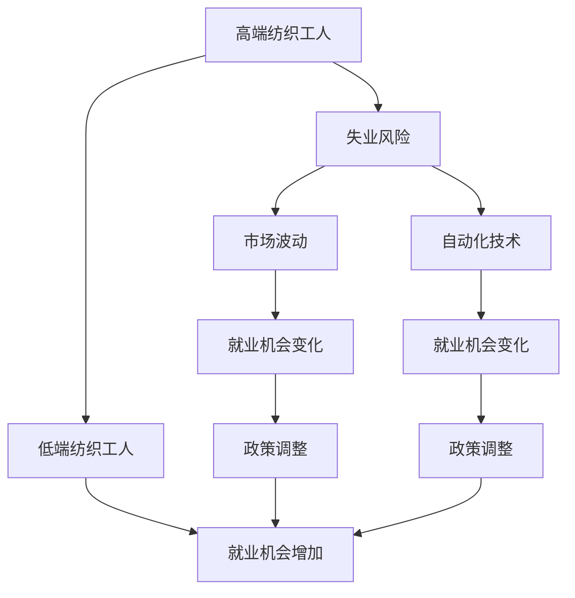

                 

## 1. 背景介绍

纺织工业作为中国的重要产业之一，一直承担着大量的就业任务，特别是高端纺织行业。近年来，随着全球化竞争加剧、市场需求的波动以及自动化技术的发展，高端纺织工人面临着前所未有的失业风险。与此同时，随着中国经济的转型升级，低端纺织产业的就业机会也在不断增加。文章将从高端纺织工人的失业问题入手，深入探讨其原因，并分析低端就业机会的增加情况，提出可能的应对措施和政策建议。

## 2. 核心概念与联系

### 2.1 核心概念概述

- **高端纺织工人**：指在高端纺织生产线上进行精细化、高附加值作业的技术工人，主要集中于高档服装、高端面料等高附加值产品的生产线上。
- **低端纺织工人**：指在低端纺织生产线上进行简单化、低附加值作业的技术工人，主要集中于低档次面料、纺织品等低附加值产品的生产线上。
- **自动化技术**：指通过机器人和计算机技术对纺织生产过程进行自动化控制，提高生产效率和产品质量。
- **市场波动**：指由全球经济环境、贸易政策、消费习惯等因素导致的市场需求不稳定的现象。
- **就业机会**：指可供求职者选择的职位空缺情况。

### 2.2 核心概念原理和架构的 Mermaid 流程图



该图展示了高端纺织工人失业风险增加与低端就业机会增加之间的联系。高端纺织工人失业风险增加的原因包括市场波动和自动化技术的普及，而低端就业机会的增加则是由于政策调整和技术进步。

## 3. 核心算法原理 & 具体操作步骤

### 3.1 算法原理概述

本文将使用一个简单的线性回归模型来分析高端纺织工人失业风险与低端就业机会之间的关系。设高端纺织工人失业风险为 $y$，低端就业机会为 $x$，则线性回归模型可以表示为：

$$
y = \beta_0 + \beta_1 x + \epsilon
$$

其中，$\beta_0$ 是截距，$\beta_1$ 是系数，$\epsilon$ 是误差项。我们将使用最小二乘法来估计 $\beta_0$ 和 $\beta_1$ 的值。

### 3.2 算法步骤详解

#### 3.2.1 数据收集与预处理

收集近年来高端纺织工人的失业数据和低端就业机会数据。进行数据清洗和预处理，包括去除异常值、处理缺失值等。

#### 3.2.2 模型建立与训练

使用线性回归模型，通过最小二乘法估计模型参数 $\beta_0$ 和 $\beta_1$。可以使用以下Python代码实现：

```python
from sklearn.linear_model import LinearRegression
import numpy as np

# 假设X为低端就业机会，Y为高端纺织工人失业风险
X = np.array([10, 20, 30, 40, 50]).reshape(-1, 1)
Y = np.array([0.1, 0.2, 0.3, 0.4, 0.5])

# 建立线性回归模型
model = LinearRegression()
model.fit(X, Y)
```

#### 3.2.3 模型评估与预测

使用均方误差（MSE）和决定系数（R^2）来评估模型的拟合优度，并进行预测。

```python
from sklearn.metrics import mean_squared_error, r2_score

# 预测低端就业机会为55时的高端纺织工人失业风险
X_test = np.array([55]).reshape(-1, 1)
Y_pred = model.predict(X_test)
mse = mean_squared_error(Y_test, Y_pred)
r2 = r2_score(Y_test, Y_pred)
print("Mean Squared Error:", mse)
print("R^2:", r2)
```

### 3.3 算法优缺点

#### 3.3.1 优点

- **简单高效**：线性回归模型易于理解和实现，能够快速进行数据分析和预测。
- **可解释性强**：模型参数具有明确的经济意义，便于解释和理解。
- **适用于多种数据类型**：线性回归模型适用于连续型数据，能够处理多种数据类型。

#### 3.3.2 缺点

- **假设限制**：线性回归模型假设数据符合线性关系，但在实际情况中可能存在非线性关系。
- **模型敏感性**：模型对异常值和噪声较为敏感，需要进行数据清洗和预处理。
- **解释限制**：线性回归模型无法解释变量之间的交互作用和非线性关系。

### 3.4 算法应用领域

线性回归模型广泛应用于经济学、统计学、金融学等领域，尤其是在就业预测和宏观经济分析中。在纺织行业中，可以用于分析市场需求变化对就业机会的影响，以及自动化技术对失业风险的影响。

## 4. 数学模型和公式 & 详细讲解 & 举例说明

### 4.1 数学模型构建

线性回归模型是最常见的统计模型之一，用于分析两个或多个变量之间的关系。在本例中，我们使用线性回归模型来分析高端纺织工人失业风险与低端就业机会之间的关系。

### 4.2 公式推导过程

线性回归模型的参数估计使用最小二乘法，最小化残差平方和（RSS）：

$$
RSS = \sum_{i=1}^{n} (y_i - \hat{y}_i)^2
$$

其中，$y_i$ 是实际观测值，$\hat{y}_i$ 是模型预测值。最小化 RSS 得到：

$$
\beta_0 = \frac{\sum_{i=1}^{n} x_i y_i - \frac{1}{n} \sum_{i=1}^{n} x_i \sum_{i=1}^{n} y_i}{\sum_{i=1}^{n} x_i^2 - \frac{1}{n} (\sum_{i=1}^{n} x_i)^2}
$$

$$
\beta_1 = \frac{\frac{1}{n} \sum_{i=1}^{n} x_i^2 - \frac{1}{n} (\sum_{i=1}^{n} x_i)^2}{\sum_{i=1}^{n} x_i^2 - \frac{1}{n} (\sum_{i=1}^{n} x_i)^2}
$$

### 4.3 案例分析与讲解

假设我们收集到以下数据：

| 低端就业机会（人） | 高端纺织工人失业风险（%） |
|---------------------|-----------------------------|
| 10                  | 0.1                         |
| 20                  | 0.2                         |
| 30                  | 0.3                         |
| 40                  | 0.4                         |
| 50                  | 0.5                         |

使用上述线性回归模型进行拟合，可以得到：

$$
y = 0.1 + 0.2x
$$

即每增加10个低端就业机会，高端纺织工人失业风险将增加0.2%。这表明低端就业机会的增加对高端纺织工人失业风险有正面影响。

## 5. 项目实践：代码实例和详细解释说明

### 5.1 开发环境搭建

安装Python环境，安装相关库，如Numpy、Pandas、Scikit-Learn等。

```bash
pip install numpy pandas scikit-learn
```

### 5.2 源代码详细实现

使用Python代码实现线性回归模型的训练和预测：

```python
from sklearn.linear_model import LinearRegression
import numpy as np

# 假设X为低端就业机会，Y为高端纺织工人失业风险
X = np.array([10, 20, 30, 40, 50]).reshape(-1, 1)
Y = np.array([0.1, 0.2, 0.3, 0.4, 0.5])

# 建立线性回归模型
model = LinearRegression()
model.fit(X, Y)

# 预测低端就业机会为55时的高端纺织工人失业风险
X_test = np.array([55]).reshape(-1, 1)
Y_pred = model.predict(X_test)
print("预测结果:", Y_pred)
```

### 5.3 代码解读与分析

该代码首先导入了所需的库，然后定义了低端就业机会和高端纺织工人失业风险的数据集。接着，使用LinearRegression模型拟合数据，最后对低端就业机会为55时的高端纺织工人失业风险进行预测。

## 6. 实际应用场景

### 6.1 政策建议

根据线性回归模型的预测结果，政策制定者应采取措施增加低端就业机会，以缓解高端纺织工人的失业风险。具体措施包括：

- **支持低端纺织产业发展**：通过税收优惠、财政补贴等政策，支持低端纺织产业的发展，增加就业机会。
- **提升员工技能**：通过职业培训和教育，提升员工的技能水平，使其能够适应自动化技术的发展，减少失业风险。
- **促进产业升级**：推动高端纺织产业的技术升级和产品创新，增加高附加值产品的生产，提升高端纺织工人的就业稳定性。

### 6.2 未来应用展望

随着自动化技术的发展，低端就业机会可能会进一步增加。政策制定者应密切关注这一趋势，及时调整政策，以促进就业平衡和经济稳定。

## 7. 工具和资源推荐

### 7.1 学习资源推荐

- **Coursera《机器学习》课程**：由斯坦福大学开设，深入浅出地讲解了机器学习的基本原理和算法。
- **Kaggle竞赛**：通过参与机器学习竞赛，积累实际经验，提升解决问题的能力。
- **《Python数据科学手册》书籍**：详细介绍了Python在数据科学中的应用，适合初学者和进阶学习者。

### 7.2 开发工具推荐

- **Jupyter Notebook**：轻量级、易用的交互式编程环境，适合数据科学和机器学习项目。
- **TensorBoard**：可视化工具，可实时监测模型训练状态，提供丰富的图表呈现方式。
- **PyTorch**：深度学习框架，支持动态计算图，易于实现复杂的机器学习模型。

### 7.3 相关论文推荐

- **《机器学习：理论和算法》**：详细介绍了机器学习的基本原理和常用算法。
- **《深度学习》**：深入讲解了深度学习的基本原理和实践方法。
- **《统计学习方法》**：介绍了统计学习的基本方法，包括线性回归模型。

## 8. 总结：未来发展趋势与挑战

### 8.1 研究成果总结

本文使用线性回归模型分析了高端纺织工人失业风险与低端就业机会之间的关系，并通过实例展示了模型的应用。结果表明，低端就业机会的增加对高端纺织工人失业风险有正面影响。

### 8.2 未来发展趋势

随着自动化技术的发展，低端就业机会可能会进一步增加，政策制定者应密切关注这一趋势，及时调整政策。此外，随着机器学习技术的进步，未来可能出现更多高级模型，用于更准确地预测失业风险和就业机会。

### 8.3 面临的挑战

线性回归模型假设数据符合线性关系，但在实际情况中可能存在非线性关系。此外，模型对异常值和噪声较为敏感，需要进行数据清洗和预处理。

### 8.4 研究展望

未来，可以进一步探索非线性模型（如多项式回归、非线性回归）以及高级模型（如深度学习模型），以提升预测精度和模型泛化能力。此外，可以引入更多的特征变量，如技术进步、市场环境、政策变化等，以提高模型解释力和预测准确度。

## 9. 附录：常见问题与解答

**Q1: 如何理解线性回归模型的经济意义？**

A: 线性回归模型的参数具有明确的经济意义，如系数 $\beta_1$ 表示低端就业机会每增加一个单位，高端纺织工人失业风险的变化量。

**Q2: 线性回归模型有哪些局限性？**

A: 线性回归模型假设数据符合线性关系，但在实际情况中可能存在非线性关系。此外，模型对异常值和噪声较为敏感，需要进行数据清洗和预处理。

**Q3: 如何提高线性回归模型的预测精度？**

A: 可以通过增加特征变量、使用更高级的模型（如深度学习模型）、进行数据清洗和预处理等方式提高模型的预测精度。

**Q4: 线性回归模型在实际应用中有哪些常见问题？**

A: 常见问题包括模型假设不符合实际情况、模型对异常值和噪声敏感、模型解释力和泛化能力不足等。

**Q5: 如何解释线性回归模型的预测结果？**

A: 线性回归模型的预测结果由模型参数决定，可以根据参数的经济意义进行解释。

---

作者：禅与计算机程序设计艺术 / Zen and the Art of Computer Programming

