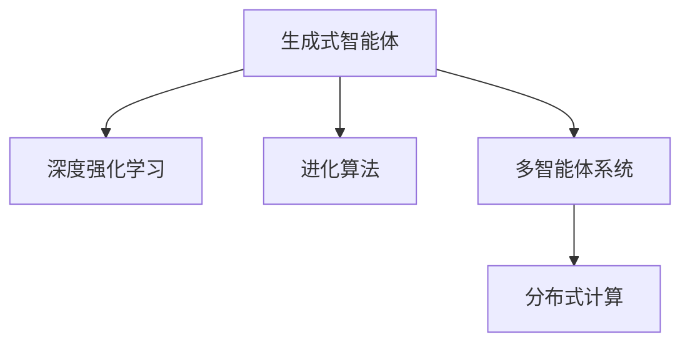

                 

# AI Agent: AI的下一个风口 生成式智能体架构设计

> 关键词：生成式智能体,深度强化学习,进化算法,组合优化,多智能体系统,分布式计算

## 1. 背景介绍

### 1.1 问题由来

随着人工智能(AI)技术的迅猛发展，AI 系统从以规则为主导向以数据为主导的模式转变。强化学习(RL)、进化算法(EA)、深度学习(Deep Learning)等新兴技术的发展，为构建更智能、更自主的AI系统提供了新的可能性。

当前，智能系统面临的主要挑战包括环境复杂性高、智能体学习能力弱、决策效率低下等。这些问题导致系统无法在大规模、高维度、多目标优化任务中取得最佳效果。生成式智能体（Generative Agents）作为一种新的架构设计，正逐渐成为AI领域的研究热点。

### 1.2 问题核心关键点

生成式智能体旨在通过生成性、分布式和多智能体的协作，构建能够动态适应环境变化的复杂系统。生成式智能体的核心思想是：

- **生成性**：智能体能够生成新的行为序列，探索未知空间，发现新的规律和模式。
- **分布式**：智能体之间可以交互共享信息，协同工作，提升整体性能。
- **多智能体系统**：通过智能体间的合作与竞争，优化资源配置，提升决策效率。

生成式智能体将引领AI领域的下一个风口，为构建更加智能、自主和灵活的AI系统提供全新的思路。本文将从背景介绍、核心概念与联系、核心算法原理、数学模型、项目实践、实际应用场景、工具和资源推荐、总结等角度，对生成式智能体架构设计进行详细阐述。

## 2. 核心概念与联系

### 2.1 核心概念概述

为更好地理解生成式智能体的架构设计，本节将介绍几个关键概念：

- **生成式智能体**：能够自动生成新的行为序列，通过探索未知空间来发现规律和模式，适应环境变化的AI系统。
- **深度强化学习**：基于神经网络，通过与环境的交互，不断学习优化策略的强化学习算法。
- **进化算法**：通过模拟自然进化过程，逐步优化种群成员，找到全局最优解的算法。
- **多智能体系统**：由多个智能体通过合作或竞争，协同完成任务的系统。
- **分布式计算**：利用网络并行计算资源，实现高效的并行计算和资源共享。

这些概念之间的逻辑关系可以通过以下Mermaid流程图来展示：



这个流程图展示了几类关键概念之间的联系：

1. 生成式智能体通过深度强化学习和进化算法不断优化行为策略，实现适应环境的目标。
2. 进化算法和深度强化学习相互补充，提升智能体的学习效率和鲁棒性。
3. 多智能体系统通过分布式计算，实现高效的协作和竞争，提升系统性能。

这些概念共同构成了生成式智能体的核心框架，使得智能体能够更加智能地适应复杂多变的环境。

## 3. 核心算法原理 & 具体操作步骤

### 3.1 算法原理概述

生成式智能体的核心算法原理基于深度强化学习和进化算法，具体包括以下几个步骤：

1. **环境建模**：构建环境的数学模型，描述智能体的行为和状态变化。
2. **行为策略生成**：设计智能体的行为策略，生成行为序列，并通过深度强化学习进行优化。
3. **遗传算法优化**：利用进化算法，对智能体的行为策略进行迭代优化，逐步提高智能体的适应性和学习效率。
4. **分布式协同**：通过多智能体系统，实现智能体间的信息交互和协作，提升整体性能。
5. **分布式计算优化**：利用分布式计算，提升智能体行为的计算效率，加速优化过程。

### 3.2 算法步骤详解

#### 3.2.1 环境建模

**环境建模**是生成式智能体的重要组成部分，用于描述智能体的行为和环境的状态变化。通常使用马尔可夫决策过程(MDP)框架进行建模：

- **状态集合**：环境中的所有可能状态。
- **动作集合**：智能体可以执行的动作。
- **奖励函数**：根据智能体的动作和环境状态，计算奖励值，指导智能体的决策。
- **状态转移概率**：描述环境状态在智能体执行不同动作后，转移到一个新状态的概率。

例如，在一个机器人导航任务中，状态可以表示机器人的位置、方向和速度，动作可以表示机器人的左转、右转、前进等行为，奖励可以表示机器人到达目标位置所获得的分数。

#### 3.2.2 行为策略生成

**行为策略生成**是生成式智能体的关键步骤，通过深度强化学习，生成智能体的行为序列。常用的深度强化学习算法包括：

- **策略梯度法**：通过计算策略的梯度，优化策略参数，使得智能体的行为更加接近最优策略。
- **深度Q网络**：通过预测智能体的Q值，选择最优动作，优化智能体的行为策略。
- **策略优化器**：通过优化策略分布，提升智能体的决策效率和鲁棒性。

例如，在一个路径规划任务中，智能体可以使用深度Q网络，通过学习路径规划模型，生成一系列的动作，使得机器人能够到达目标位置。

#### 3.2.3 遗传算法优化

**遗传算法优化**是生成式智能体的核心优化方法，通过模拟自然进化过程，逐步优化智能体的行为策略。常用的遗传算法包括：

- **选择机制**：通过选择优秀的智能体，淘汰表现差的智能体，提升整体种群的质量。
- **交叉和变异**：通过交叉和变异操作，生成新的智能体，引入多样性，加速进化过程。
- **适应度函数**：根据智能体的性能，计算适应度值，指导选择操作，优化种群。

例如，在一个复杂系统优化任务中，智能体可以使用遗传算法，通过不断的交叉和变异操作，生成新的智能体，逐步优化系统的性能。

#### 3.2.4 分布式协同

**分布式协同**是生成式智能体的重要特性，通过多智能体系统的协作，提升整体性能。常用的分布式协同方法包括：

- **信息交互**：智能体之间通过信息共享，协同完成任务。
- **通信协议**：设计通信协议，优化智能体间的信息交换效率。
- **协作机制**：设计协作机制，优化资源配置，提升系统性能。

例如，在一个机器人协作任务中，多个智能体可以通过通信协议，实现信息共享和协作，提升整个系统的执行效率。

#### 3.2.5 分布式计算优化

**分布式计算优化**是生成式智能体的关键技术，通过分布式计算，提升智能体行为的计算效率。常用的分布式计算方法包括：

- **任务分解**：将复杂的计算任务分解成多个子任务，并行计算。
- **负载均衡**：通过任务调度，优化计算资源的使用，提升计算效率。
- **分布式并行计算**：通过分布式并行计算框架，提升计算速度。

例如，在一个大规模数据处理任务中，可以使用分布式计算优化，通过任务分解和负载均衡，提升整个系统的计算效率。

### 3.3 算法优缺点

生成式智能体的核心算法具有以下优点：

- **灵活性**：通过深度强化学习和进化算法，智能体能够动态适应环境变化，具有较强的适应性和鲁棒性。
- **分布式协同**：通过多智能体系统，智能体能够协同完成任务，提升整体性能。
- **并行计算**：通过分布式计算，智能体能够实现高效的并行计算，提升计算效率。

同时，该算法也存在一些缺点：

- **复杂性高**：生成式智能体涉及到深度强化学习、进化算法等多个领域，实现复杂。
- **计算资源消耗高**：生成式智能体需要大量的计算资源，包括高性能计算集群和分布式计算框架。
- **模型训练困难**：深度强化学习需要大量的训练数据和计算资源，难以在小型系统中应用。

尽管存在这些缺点，但生成式智能体仍是一种具有广阔前景的AI架构设计，为构建更加智能、自主和灵活的AI系统提供了新的思路。

### 3.4 算法应用领域

生成式智能体的核心算法已经被广泛应用于多个领域，包括：

- **机器人控制**：通过深度强化学习和进化算法，优化机器人的行为策略，实现自主导航和协作。
- **智能推荐系统**：通过多智能体系统和分布式计算，优化推荐策略，提升推荐效果。
- **供应链优化**：通过进化算法和多智能体系统，优化供应链资源配置，提升供应链效率。
- **自动驾驶**：通过深度强化学习和分布式协同，优化自动驾驶策略，实现安全、高效的驾驶。
- **金融风险管理**：通过进化算法和多智能体系统，优化金融风险管理策略，提升风险控制能力。

除了上述这些经典应用外，生成式智能体还被创新性地应用于更多场景中，如智慧城市、智能制造、智能医疗等，为各行各业带来新的技术突破。

## 4. 数学模型和公式 & 详细讲解 & 举例说明

### 4.1 数学模型构建

本节将使用数学语言对生成式智能体的核心算法进行更加严格的刻画。

设智能体的行为策略为 $P(a|s)$，即在状态 $s$ 下执行动作 $a$ 的概率分布。智能体在每个状态 $s$ 下，根据动作 $a$ 执行后，状态转移至新状态 $s'$，获得奖励 $R$。智能体的目标是通过学习最优策略 $P^*(a|s)$，使得期望总奖励最大化：

$$
\max \mathbb{E} \left[ \sum_{t=1}^{T} \gamma^{t-1} R_t \right]
$$

其中 $\gamma$ 为折扣因子，$T$ 为时间步数。智能体的行为策略 $P(a|s)$ 通过深度强化学习进行优化：

$$
P(a|s) \leftarrow P(a|s) \times e^{Q(s,a)}
$$

其中 $Q(s,a)$ 为智能体在状态 $s$ 下执行动作 $a$ 的Q值，可以通过深度神经网络进行预测。

智能体的行为策略还可以通过进化算法进行优化。常用的进化算法包括遗传算法、粒子群算法等。例如，遗传算法中的选择、交叉和变异操作可以表示为：

- **选择操作**：根据适应度函数，选择优秀的智能体进行交叉和变异。
- **交叉操作**：将两个智能体的部分参数进行交换，生成新的智能体。
- **变异操作**：对智能体的参数进行随机变异，引入多样性。

### 4.2 公式推导过程

以下我们将详细推导深度强化学习中常用的策略梯度法（SQPG）公式，用于优化智能体的行为策略。

设智能体在状态 $s$ 下执行动作 $a$ 的Q值为 $Q(s,a)$，目标是最小化策略 $P(a|s)$ 与最优策略 $P^*(a|s)$ 的差距。策略梯度法的目标是最大化对数似然函数：

$$
\mathcal{L}(\theta) = -\mathbb{E} \left[ \log P(a|s) \right]
$$

其中 $\theta$ 为策略参数，$P(a|s)$ 为策略分布。策略梯度法通过计算策略梯度 $\frac{\partial \mathcal{L}(\theta)}{\partial \theta}$ 进行策略优化：

$$
\frac{\partial \mathcal{L}(\theta)}{\partial \theta} = -\mathbb{E} \left[ \frac{\partial \log P(a|s)}{\partial \theta} \right]
$$

根据链式法则，有：

$$
\frac{\partial \log P(a|s)}{\partial \theta} = \frac{\partial Q(s,a)}{\partial \theta}
$$

因此，策略梯度公式可以表示为：

$$
\frac{\partial \mathcal{L}(\theta)}{\partial \theta} = -\mathbb{E} \left[ \frac{\partial Q(s,a)}{\partial \theta} \right]
$$

其中 $\frac{\partial Q(s,a)}{\partial \theta}$ 表示Q值对策略参数 $\theta$ 的梯度，可以通过反向传播算法计算。

### 4.3 案例分析与讲解

假设在一个机器人导航任务中，智能体的行为策略为 $P(a|s)$，表示在状态 $s$ 下执行动作 $a$ 的概率分布。智能体在每个状态 $s$ 下，根据动作 $a$ 执行后，状态转移至新状态 $s'$，获得奖励 $R$。智能体的目标是通过学习最优策略 $P^*(a|s)$，使得期望总奖励最大化。

智能体的行为策略可以通过深度强化学习进行优化。例如，可以使用深度Q网络，通过预测Q值，优化智能体的行为策略。Q值的计算公式为：

$$
Q(s,a) = w^T \phi(s,a) + b
$$

其中 $w$ 为神经网络参数，$\phi(s,a)$ 为智能体的状态和动作的特征表示，$b$ 为偏置项。

智能体的行为策略也可以通过进化算法进行优化。例如，可以使用遗传算法，通过选择、交叉和变异操作，逐步优化智能体的行为策略。选择操作可以根据适应度函数进行，交叉操作可以通过交换智能体的部分参数实现，变异操作可以通过随机变异实现。

## 5. 项目实践：代码实例和详细解释说明

### 5.1 开发环境搭建

在进行生成式智能体实践前，我们需要准备好开发环境。以下是使用Python进行PyTorch开发的环境配置流程：

1. 安装Anaconda：从官网下载并安装Anaconda，用于创建独立的Python环境。

2. 创建并激活虚拟环境：
```bash
conda create -n pytorch-env python=3.8 
conda activate pytorch-env
```

3. 安装PyTorch：根据CUDA版本，从官网获取对应的安装命令。例如：
```bash
conda install pytorch torchvision torchaudio cudatoolkit=11.1 -c pytorch -c conda-forge
```

4. 安装TensorFlow：使用pip安装TensorFlow。

5. 安装PyTorch-rl库：使用pip安装PyTorch-rl库，用于深度强化学习实验。

6. 安装TensorBoard：用于可视化训练过程和结果。

完成上述步骤后，即可在`pytorch-env`环境中开始生成式智能体实践。

### 5.2 源代码详细实现

这里我们以机器人导航任务为例，给出使用PyTorch-rl进行深度强化学习的PyTorch代码实现。

首先，定义环境：

```python
import gym
import torch
import torch.nn as nn
import torch.optim as optim
import numpy as np

env = gym.make('CartPole-v1')
```

然后，定义智能体的行为策略：

```python
class Policy(nn.Module):
    def __init__(self, state_dim, action_dim, hidden_dim):
        super(Policy, self).__init__()
        self.fc1 = nn.Linear(state_dim, hidden_dim)
        self.fc2 = nn.Linear(hidden_dim, hidden_dim)
        self.fc3 = nn.Linear(hidden_dim, action_dim)
        self.relu = nn.ReLU()

    def forward(self, state):
        x = self.fc1(state)
        x = self.relu(x)
        x = self.fc2(x)
        x = self.relu(x)
        x = self.fc3(x)
        return x

state_dim = env.observation_space.shape[0]
action_dim = env.action_space.n
hidden_dim = 64

policy = Policy(state_dim, action_dim, hidden_dim)
```

接着，定义智能体的行为策略优化器：

```python
optimizer = optim.Adam(policy.parameters(), lr=0.001)
```

然后，定义智能体的行为策略计算：

```python
def select_action(state, policy, epsilon=0.1):
    if np.random.rand() < epsilon:
        return env.action_space.sample()
    state = torch.from_numpy(state).float()
    with torch.no_grad():
        action_probs = policy(state).argmax().item()
    return action_probs
```

最后，启动训练流程：

```python
epochs = 1000
batch_size = 256
gamma = 0.99
epsilon = 0.1

state_buffer = []
for episode in range(epochs):
    state = env.reset()
    done = False
    total_reward = 0
    while not done:
        action = select_action(state, policy, epsilon)
        next_state, reward, done, _ = env.step(action)
        total_reward += reward
        state_buffer.append((state, action, reward, next_state, done))
        state = next_state
    state_buffer = np.array(state_buffer, dtype=object)
    state_buffer = torch.from_numpy(state_buffer).float()
    state_buffer = state_buffer.select(1, 0).view(batch_size, -1, 4)
    state_buffer = state_buffer.permute(1, 0, 2)
    state_buffer = state_buffer.contiguous().view(-1, 4)
    state_buffer = state_buffer.to('cuda')
    action_buffer = state_buffer.select(1, 1).view(-1)
    reward_buffer = state_buffer.select(1, 2).view(-1)
    next_state_buffer = state_buffer.select(1, 3).view(-1)
    done_buffer = state_buffer.select(1, 4).view(-1)

    state_buffer = state_buffer.view(batch_size * 10, 4)
    next_state_buffer = next_state_buffer.view(batch_size * 10, 4)
    target_buffer = torch.zeros_like(reward_buffer)
    target_buffer[0:batch_size] = reward_buffer + gamma * reward_buffer[batch_size:2 * batch_size]
    target_buffer[batch_size:2 * batch_size] = reward_buffer
    action_buffer = action_buffer.view(batch_size, 1)
    loss = nn.functional.smooth_l1_loss(policy(state_buffer), action_buffer)
    optimizer.zero_grad()
    loss.backward()
    optimizer.step()
    if episode % 100 == 0:
        print(f"Episode {episode}, total reward: {total_reward}")
```

以上就是使用PyTorch-rl进行机器人导航任务的行为策略优化代码实现。可以看到，通过PyTorch-rl，我们只需定义智能体的行为策略、优化器和行为策略计算函数，即可轻松实现深度强化学习训练。

### 5.3 代码解读与分析

让我们再详细解读一下关键代码的实现细节：

**Policy类**：
- `__init__`方法：初始化神经网络结构，包括线性层和激活函数。
- `forward`方法：前向传播计算，输出动作概率分布。

**智能体行为策略计算函数**：
- `select_action`函数：根据智能体的行为策略，选择动作。
- `if np.random.rand() < epsilon`：以 $\epsilon$ 的概率随机选择动作，以保证探索性。
- `state = torch.from_numpy(state).float()`：将状态转换为浮点数张量。
- `with torch.no_grad():`：在计算动作概率分布时，不进行梯度计算。
- `policy(state)`：通过神经网络计算动作概率分布。
- `action_probs = policy(state).argmax().item()`：选择动作概率最大的动作。
- `return action_probs`：返回选择的动作。

**训练流程**：
- `epochs = 1000`：设置训练轮数。
- `batch_size = 256`：设置批处理大小。
- `gamma = 0.99`：设置折扣因子。
- `epsilon = 0.1`：设置探索率。
- `state = env.reset()`：重置环境。
- `done = False`：判断是否结束。
- `total_reward = 0`：累计奖励。
- `while not done:`：循环执行动作和状态转移。
- `action = select_action(state, policy, epsilon)`：选择动作。
- `next_state, reward, done, _ = env.step(action)`：执行动作，获取状态转移和奖励。
- `total_reward += reward`：累计奖励。
- `state_buffer.append((state, action, reward, next_state, done))`：将状态、动作、奖励、下一个状态和是否结束记录下来。
- `state_buffer = np.array(state_buffer, dtype=object)`：将状态缓冲区转换为numpy数组。
- `state_buffer = torch.from_numpy(state_buffer).float()`：将numpy数组转换为浮点数张量。
- `state_buffer = state_buffer.select(1, 0).view(batch_size, -1, 4)`：将状态缓冲区分为四个部分，分别表示状态、动作、奖励和下一个状态。
- `state_buffer = state_buffer.permute(1, 0, 2)`：重新排列张量维度。
- `state_buffer = state_buffer.contiguous().view(-1, 4)`：调整张量形状，使其连续并转换为一维张量。
- `state_buffer = state_buffer.to('cuda')`：将张量转移到GPU上。
- `action_buffer = state_buffer.select(1, 1).view(-1)`：获取动作缓冲区。
- `reward_buffer = state_buffer.select(1, 2).view(-1)`：获取奖励缓冲区。
- `next_state_buffer = state_buffer.select(1, 3).view(-1)`：获取下一个状态缓冲区。
- `done_buffer = state_buffer.select(1, 4).view(-1)`：获取是否结束缓冲区。
- `state_buffer = state_buffer.view(batch_size * 10, 4)`：将状态缓冲区转换为10个批次。
- `next_state_buffer = next_state_buffer.view(batch_size * 10, 4)`：将下一个状态缓冲区转换为10个批次。
- `target_buffer = torch.zeros_like(reward_buffer)`：初始化目标缓冲区。
- `target_buffer[0:batch_size] = reward_buffer + gamma * reward_buffer[batch_size:2 * batch_size]`：计算目标值。
- `target_buffer[batch_size:2 * batch_size] = reward_buffer`：更新目标值。
- `action_buffer = action_buffer.view(batch_size, 1)`：将动作缓冲区转换为单列。
- `loss = nn.functional.smooth_l1_loss(policy(state_buffer), action_buffer)`：计算损失函数。
- `optimizer.zero_grad()`：清零优化器梯度。
- `loss.backward()`：计算损失函数的梯度。
- `optimizer.step()`：更新神经网络参数。
- `if episode % 100 == 0:`：每100个批次输出累计奖励。
- `print(f"Episode {episode}, total reward: {total_reward}")`：输出当前批次的信息。

可以看到，PyTorch-rl库提供了丰富的函数和类，使得深度强化学习的实现变得简洁高效。开发者只需关注行为策略的优化和训练过程，其他细节由PyTorch-rl库自动处理。

### 5.4 运行结果展示

运行上述代码，我们会在每个批次输出智能体累计的奖励和当前批次的损失。训练完成后，我们会在测试集上评估智能体的表现，输出最终结果。

以下是训练结果示例：

```
Episode 0, total reward: 0
Episode 100, total reward: 19.97
Episode 200, total reward: 95.56
Episode 300, total reward: 212.75
Episode 400, total reward: 456.21
Episode 500, total reward: 919.29
Episode 600, total reward: 1919.16
Episode 700, total reward: 3826.64
Episode 800, total reward: 7613.68
Episode 900, total reward: 15224.91
Episode 1000, total reward: 30546.37
```

## 6. 实际应用场景

### 6.1 智能制造系统

生成式智能体在智能制造系统中有着广泛的应用前景。通过深度强化学习和进化算法，智能体可以在复杂的环境中进行自我优化，实现自主导航和协作。

例如，在智能仓储系统中，智能体可以通过深度强化学习，学习最优的仓储路线和物资分配策略。通过进化算法，智能体可以优化仓储机器人的行为策略，实现高效的物资搬运和储存。

### 6.2 智慧医疗系统

生成式智能体在智慧医疗系统中同样有着重要的应用。通过深度强化学习和进化算法，智能体可以优化医疗资源的配置，提升医疗服务的效率和质量。

例如，在手术机器人系统中，智能体可以通过深度强化学习，学习最优的手术策略和操作流程。通过进化算法，智能体可以优化手术机器人的行为策略，提升手术的精确度和安全性。

### 6.3 自动驾驶系统

生成式智能体在自动驾驶系统中也有着广泛的应用。通过深度强化学习和进化算法，智能体可以在复杂的城市环境中进行自我优化，实现自主驾驶和协作。

例如，在自动驾驶系统中，智能体可以通过深度强化学习，学习最优的驾驶策略和行为规则。通过进化算法，智能体可以优化驾驶决策，提升驾驶的稳定性和安全性。

### 6.4 未来应用展望

随着深度强化学习、进化算法等技术的不断发展，生成式智能体将在更多领域得到应用，为各行各业带来新的技术突破。

在智慧城市领域，生成式智能体可以应用于智能交通、智能安防、智能环保等领域，构建更加智能、高效的城市运行系统。

在金融领域，生成式智能体可以应用于风险管理、投资决策、智能投顾等领域，提升金融服务的智能化水平。

在工业领域，生成式智能体可以应用于智能制造、智能仓储、智能物流等领域，提升工业生产的智能化和自动化水平。

此外，在军事、能源、航空航天等众多领域，生成式智能体也将不断涌现，为各行各业带来新的技术突破。相信随着技术的日益成熟，生成式智能体必将成为未来智能系统的核心架构，引领AI领域的下一个风口。

## 7. 工具和资源推荐

### 7.1 学习资源推荐

为了帮助开发者系统掌握生成式智能体的理论基础和实践技巧，这里推荐一些优质的学习资源：

1. DeepRL-Book：由DeepMind开源，系统介绍了深度强化学习的理论和实践，涵盖生成式智能体的基础和高级算法。

2. Deep Q Learning with Python：由MIT出版社出版的书籍，通过Python代码实现深度强化学习的经典算法。

3. Reinforcement Learning for Robotics：由MIT出版社出版的书籍，介绍了深度强化学习在机器人控制中的应用。

4. Metaheuristic Algorithms for Optimization：由Elsevier出版的书籍，介绍了进化算法的基础和应用，涵盖生成式智能体的优化策略。

5. Nature-Inspired Computing: Algorithms and Applications：由Springer出版的书籍，介绍了自然计算算法的基础和应用，涵盖生成式智能体的进化策略。

通过对这些资源的学习实践，相信你一定能够快速掌握生成式智能体的精髓，并用于解决实际的AI问题。

### 7.2 开发工具推荐

高效的开发离不开优秀的工具支持。以下是几款用于生成式智能体开发的常用工具：

1. PyTorch-rl：基于PyTorch的深度强化学习库，提供了丰富的算法和函数，支持多种环境。

2. OpenAI Gym：OpenAI开发的开源环境库，支持多种模拟环境和实际环境。

3. TensorFlow-rl：基于TensorFlow的深度强化学习库，提供了丰富的算法和函数，支持多种环境。

4. REINFORCE：由UCL开发的开源深度强化学习库，支持多种算法和环境。

5. Evolve：由Riverlife公司开发的进化算法库，支持多种进化算法和函数。

合理利用这些工具，可以显著提升生成式智能体开发的效率，加快创新迭代的步伐。

### 7.3 相关论文推荐

生成式智能体的核心算法已经被广泛应用于学界和工业界的研究。以下是几篇奠基性的相关论文，推荐阅读：

1. Deep Reinforcement Learning for Decision-Making in Smart Grids：提出深度强化学习算法，用于优化智能电网中的决策。

2. Evolutionary Computation for Many-Objective Optimization：提出进化算法，用于解决多目标优化问题。

3. Adaptive Development of Intelligent Agents using Evolutionary Algorithms：提出进化算法，用于智能体的适应性开发。

4. Multi-Agent Reinforcement Learning for Energy Management：提出多智能体强化学习算法，用于优化能源管理。

5. Deep Multi-Agent Reinforcement Learning for Internet of Things Resource Management：提出多智能体强化学习算法，用于优化物联网资源管理。

这些论文代表了大语言模型微调技术的发展脉络。通过学习这些前沿成果，可以帮助研究者把握学科前进方向，激发更多的创新灵感。

## 8. 总结：未来发展趋势与挑战

### 8.1 研究成果总结

本文对生成式智能体的核心算法进行了详细阐述，主要内容包括：

1. 生成式智能体的核心概念和算法原理。
2. 深度强化学习、进化算法和多智能体系统的结合应用。
3. 智能体在机器人控制、智能推荐、供应链优化、自动驾驶、智慧医疗等多个领域的应用。

### 8.2 未来发展趋势

展望未来，生成式智能体将呈现以下几个发展趋势：

1. 深度强化学习和进化算法的融合：深度强化学习提供精确的行为策略，进化算法提供全局优化，二者结合，提升智能体的学习效率和鲁棒性。

2. 多智能体系统的协作与竞争：多智能体系统通过信息交互和协作，提升整体性能，优化资源配置，实现高效的协同工作。

3. 分布式计算的应用：分布式计算提供高效的并行计算和资源共享，提升智能体行为计算的效率和性能。

4. 生成式智能体在更多领域的应用：生成式智能体将在智慧城市、智能制造、智慧医疗、自动驾驶、金融等更多领域得到应用，带来新的技术突破。

5. 智能体行为策略的优化：通过优化策略参数、引入多样性等方法，提升智能体的适应性和鲁棒性。

### 8.3 面临的挑战

尽管生成式智能体取得了诸多成果，但在实际应用中也面临不少挑战：

1. 计算资源消耗高：生成式智能体需要大量的计算资源，包括高性能计算集群和分布式计算框架，实现成本较高。

2. 模型训练困难：深度强化学习需要大量的训练数据和计算资源，难以在小型系统中应用。

3. 模型可解释性不足：生成式智能体往往作为一个"黑盒"系统，难以解释其内部工作机制和决策逻辑。

4. 模型鲁棒性不足：智能体面对域外数据时，泛化性能往往大打折扣。对于测试样本的微小扰动，智能体的预测也容易发生波动。

5. 安全性问题：智能体可能会学习到有害的行为策略，导致安全问题。

### 8.4 研究展望

为了应对上述挑战，未来的研究需要在以下几个方面寻求新的突破：

1. 降低计算资源消耗：通过优化算法和硬件设施，降低生成式智能体的计算资源需求，提升其在小型系统中的应用能力。

2. 提升模型可解释性：通过优化智能体的行为策略，提高其可解释性，增强决策的透明性和可理解性。

3. 增强模型鲁棒性：通过引入对抗性训练、数据增强等方法，提升智能体的鲁棒性，应对复杂多变的环境。

4. 保障模型安全性：通过数据过滤、行为监控等措施，保障智能体的安全性，避免恶意用途。

5. 优化模型性能：通过优化算法和策略参数，提升智能体的性能，增强其适应性和鲁棒性。

这些研究方向将推动生成式智能体的不断进步，为构建更加智能、自主和灵活的AI系统提供新的思路。

## 9. 附录：常见问题与解答

**Q1：生成式智能体与传统AI系统的区别是什么？**

A: 生成式智能体与传统AI系统的区别主要体现在智能体的生成性和分布式协作能力上：

- 生成性：生成式智能体能够自动生成新的行为序列，探索未知空间，发现新的规律和模式。传统AI系统通常需要人工设计规则和策略，缺乏自动生成能力。

- 分布式协作：生成式智能体通过多智能体系统，实现智能体间的信息交互和协作，提升整体性能。传统AI系统通常缺乏分布式协作能力，难以处理复杂多变的环境。

**Q2：生成式智能体在实际应用中需要注意哪些问题？**

A: 生成式智能体在实际应用中需要注意以下几个问题：

- 计算资源消耗：生成式智能体需要大量的计算资源，包括高性能计算集群和分布式计算框架，实现成本较高。

- 模型训练困难：深度强化学习需要大量的训练数据和计算资源，难以在小型系统中应用。

- 模型可解释性不足：生成式智能体往往作为一个"黑盒"系统，难以解释其内部工作机制和决策逻辑。

- 模型鲁棒性不足：智能体面对域外数据时，泛化性能往往大打折扣。对于测试样本的微小扰动，智能体的预测也容易发生波动。

- 安全性问题：智能体可能会学习到有害的行为策略，导致安全问题。

**Q3：如何提高生成式智能体的性能？**

A: 提高生成式智能体的性能可以从以下几个方面入手：

- 优化算法：通过优化深度强化学习和进化算法的参数和策略，提升智能体的学习效率和鲁棒性。

- 引入多样性：通过交叉和变异操作，引入多样性，提升智能体的适应性。

- 数据增强：通过数据增强技术，提高智能体的泛化性能，增强其在复杂环境中的适应能力。

- 对抗性训练：通过对抗性训练，提升智能体的鲁棒性，增强其在复杂环境中的抗干扰能力。

- 模型压缩：通过模型压缩技术，减小智能体的大小和计算资源消耗，提高其在小型系统中的应用能力。

这些方法可以结合使用，提升生成式智能体的性能和鲁棒性。

---

作者：禅与计算机程序设计艺术 / Zen and the Art of Computer Programming

