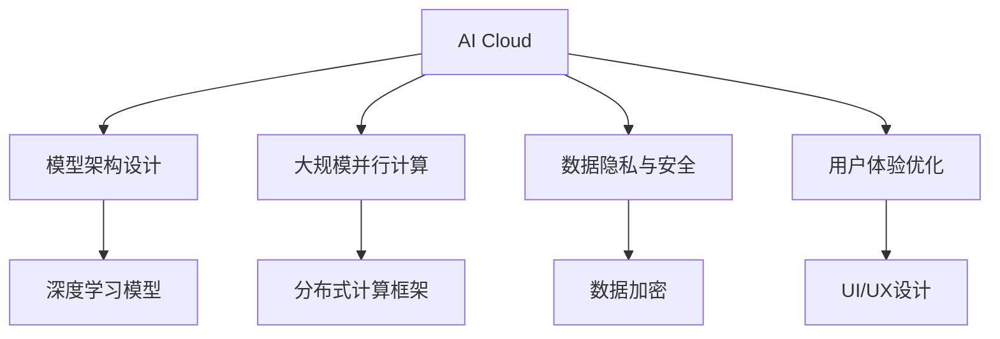

                 

# AI Cloud未来：贾扬清愿景，Lepton AI前景挑战

> 关键词：AI Cloud, Jie Yangqing, Lepton AI, 未来展望, 技术挑战, 深度学习, 计算机视觉, 自然语言处理

## 1. 背景介绍

### 1.1 问题由来
在过去几年里，AI技术的发展日新月异，AI Cloud逐渐成为了新的技术风口。AI Cloud不仅包括深度学习模型的训练、推理和部署，还涉及到大规模数据处理、模型优化、用户交互等方方面面。在AI Cloud的建设过程中，如何设计有效的模型架构、选择合适的大规模并行计算平台、保障数据隐私安全、提升用户体验等都是亟待解决的重要问题。

### 1.2 问题核心关键点
AI Cloud的核心挑战在于如何构建高效、灵活、安全的AI应用系统，以满足各类行业的应用需求。这些问题涉及到AI模型的设计、数据处理、计算资源的管理与调度、系统架构的优化等多个方面。

## 2. 核心概念与联系

### 2.1 核心概念概述

为更好地理解AI Cloud的构建和部署，本节将介绍几个密切相关的核心概念：

- **AI Cloud**：涵盖深度学习模型训练、推理、优化和部署的云服务平台。
- **Jie Yangqing**：深度学习领域的知名专家，曾参与设计TensorFlow、Google Cloud AI等系统，对AI Cloud的发展有着深远影响。
- **Lepton AI**：Jie Yangqing主导的一个AI研究项目，致力于打造高效、可扩展、可解释的深度学习系统。
- **模型架构设计**：选择合适的网络结构、优化器、正则化技术等，以提升模型性能。
- **大规模并行计算**：利用分布式计算框架，如TensorFlow、PyTorch等，提升模型的训练和推理速度。
- **数据隐私与安全**：保护用户数据隐私，防止数据泄露和模型攻击。
- **用户体验优化**：通过高效的模型推理和智能的UI/UX设计，提升用户的使用体验。

这些核心概念之间的逻辑关系可以通过以下Mermaid流程图来展示：



这个流程图展示了几大核心概念及其之间的关系：

1. AI Cloud通过深度学习模型的训练、推理和部署，实现AI应用。
2. 模型架构设计决定模型的性能和泛化能力。
3. 大规模并行计算提升模型的训练和推理效率。
4. 数据隐私与安全保障用户数据的安全。
5. 用户体验优化提升用户的使用体验。

## 3. 核心算法原理 & 具体操作步骤
### 3.1 算法原理概述

AI Cloud的构建涉及到多个算法的原理，以下将重点介绍深度学习模型的训练、推理和优化。

深度学习模型的训练主要包括数据的预处理、模型的初始化、损失函数的设计、优化器的选择等。模型的推理则涉及如何高效地进行前向传播计算，生成模型输出。模型的优化则是通过反向传播算法，最小化损失函数，更新模型参数。

### 3.2 算法步骤详解

以下是深度学习模型训练、推理和优化的详细步骤：

#### 3.2.1 模型训练

1. 数据预处理：包括数据清洗、归一化、划分训练集、验证集和测试集等步骤。
2. 模型初始化：选择合适的网络结构、优化器、学习率等。
3. 前向传播：输入数据，通过网络结构计算得到模型输出。
4. 计算损失：根据标签和模型输出计算损失值。
5. 反向传播：根据损失函数计算梯度，更新模型参数。
6. 迭代训练：重复步骤4-5，直到模型收敛。

#### 3.2.2 模型推理

1. 输入数据预处理：将输入数据进行归一化、缩放等预处理。
2. 前向传播：输入数据，通过网络结构计算得到模型输出。
3. 模型后处理：根据输出结果进行后处理，如将得分映射为标签。

#### 3.2.3 模型优化

1. 选择优化器：如Adam、SGD等。
2. 设定学习率：一般初始设置为0.001，逐步减小。
3. 添加正则化：如L2正则、Dropout等。
4. 监控训练过程：记录损失值和准确率等指标，及时调整训练参数。

### 3.3 算法优缺点

深度学习模型的训练、推理和优化具有以下优点：

- 高效性：大规模并行计算框架如TensorFlow、PyTorch等，可以加速模型的训练和推理。
- 可扩展性：分布式计算平台可以扩展模型训练规模，提升训练效率。
- 泛化能力：通过大规模数据预训练，模型具有较强的泛化能力。

但同时，这些算法也存在以下缺点：

- 数据依赖性：模型的训练和推理依赖大量标注数据，获取高质量标注数据成本高。
- 计算资源消耗大：大规模模型的训练和推理需要大量的计算资源和存储空间。
- 易受过拟合影响：模型复杂度高，容易过拟合。
- 模型解释性差：深度学习模型通常是"黑盒"，难以解释其内部工作机制。

### 3.4 算法应用领域

深度学习模型的训练、推理和优化已经在多个领域得到广泛应用，例如：

- 计算机视觉：如图像分类、目标检测、图像分割等。
- 自然语言处理：如情感分析、机器翻译、文本生成等。
- 语音识别：如自动语音识别、语音合成等。
- 推荐系统：如协同过滤、基于深度学习的推荐算法等。
- 游戏AI：如强化学习、策略优化等。

## 4. 数学模型和公式 & 详细讲解  
### 4.1 数学模型构建

本节将使用数学语言对深度学习模型的训练、推理和优化过程进行更加严格的刻画。

设深度学习模型为 $M_{\theta}$，其中 $\theta$ 为模型参数。给定训练数据集 $D=\{(x_i,y_i)\}_{i=1}^N, x_i \in \mathcal{X}, y_i \in \mathcal{Y}$，其中 $\mathcal{X}$ 为输入空间，$\mathcal{Y}$ 为输出空间。

定义模型 $M_{\theta}$ 在输入 $x$ 上的输出为 $\hat{y}=M_{\theta}(x) \in \mathcal{Y}$。训练过程的目标是最小化损失函数 $\ell(\hat{y},y)$，即：

$$
\min_{\theta} \mathbb{E}_{(x,y) \sim D}[\ell(\hat{y},y)]
$$

其中 $\ell(\hat{y},y)$ 为损失函数，通常采用交叉熵损失函数：

$$
\ell(\hat{y},y) = -y\log \hat{y} - (1-y)\log(1-\hat{y})
$$

在训练过程中，我们通过反向传播算法计算梯度，更新模型参数 $\theta$：

$$
\theta \leftarrow \theta - \eta \nabla_{\theta}\ell(\hat{y},y)
$$

其中 $\eta$ 为学习率。

### 4.2 公式推导过程

以下是损失函数和梯度的推导：

1. 损失函数推导：

$$
\mathcal{L}(\theta) = -\frac{1}{N}\sum_{i=1}^N \ell(\hat{y},y) = \frac{1}{N}\sum_{i=1}^N (y\log \hat{y} + (1-y)\log(1-\hat{y}))
$$

2. 梯度推导：

$$
\nabla_{\theta}\ell(\hat{y},y) = \nabla_{\theta}(y\log \hat{y} + (1-y)\log(1-\hat{y})) = \frac{y}{\hat{y}} - \frac{1-y}{1-\hat{y}}
$$

在反向传播过程中，通过链式法则，计算各个层的网络参数梯度：

$$
\frac{\partial \mathcal{L}(\theta)}{\partial \theta_k} = \frac{\partial \ell(\hat{y},y)}{\partial M_{\theta}(x)} \cdot \frac{\partial M_{\theta}(x)}{\partial \theta_k}
$$

其中 $\frac{\partial M_{\theta}(x)}{\partial \theta_k}$ 为前向传播过程中第 $k$ 层的网络参数梯度。

### 4.3 案例分析与讲解

假设有一个二分类任务，输入 $x$ 输出 $\hat{y} \in [0,1]$，真实标签 $y \in \{0,1\}$。使用交叉熵损失函数：

$$
\ell(\hat{y},y) = -[y\log \hat{y} + (1-y)\log(1-\hat{y})]
$$

在训练过程中，我们使用反向传播算法计算梯度：

$$
\nabla_{\theta}\ell(\hat{y},y) = \frac{y}{\hat{y}} - \frac{1-y}{1-\hat{y}}
$$

通过链式法则，计算各个层的网络参数梯度：

$$
\frac{\partial \mathcal{L}(\theta)}{\partial \theta_k} = \frac{\partial \ell(\hat{y},y)}{\partial M_{\theta}(x)} \cdot \frac{\partial M_{\theta}(x)}{\partial \theta_k}
$$

在训练完成后，使用测试集对模型进行评估：

$$
\mathcal{L}_{test}(\theta) = \mathbb{E}_{(x,y) \sim D_{test}}[\ell(\hat{y},y)]
$$

## 5. 项目实践：代码实例和详细解释说明
### 5.1 开发环境搭建

在进行AI Cloud项目实践前，我们需要准备好开发环境。以下是使用Python进行TensorFlow开发的环境配置流程：

1. 安装Anaconda：从官网下载并安装Anaconda，用于创建独立的Python环境。

2. 创建并激活虚拟环境：
```bash
conda create -n tf-env python=3.8 
conda activate tf-env
```

3. 安装TensorFlow：根据CUDA版本，从官网获取对应的安装命令。例如：
```bash
conda install tensorflow -c pytorch -c conda-forge
```

4. 安装各类工具包：
```bash
pip install numpy pandas scikit-learn matplotlib tqdm jupyter notebook ipython
```

完成上述步骤后，即可在`tf-env`环境中开始AI Cloud项目实践。

### 5.2 源代码详细实现

下面我们以图像分类任务为例，给出使用TensorFlow进行卷积神经网络训练的PyTorch代码实现。

首先，定义模型结构：

```python
import tensorflow as tf
from tensorflow.keras.layers import Dense, Flatten, Conv2D, MaxPooling2D
from tensorflow.keras import Sequential

model = Sequential([
    Conv2D(32, (3, 3), activation='relu', input_shape=(28, 28, 1)),
    MaxPooling2D((2, 2)),
    Conv2D(64, (3, 3), activation='relu'),
    MaxPooling2D((2, 2)),
    Flatten(),
    Dense(64, activation='relu'),
    Dense(10)
])
```

然后，定义损失函数和优化器：

```python
from tensorflow.keras.optimizers import Adam

loss_fn = tf.keras.losses.SparseCategoricalCrossentropy()
optimizer = Adam(learning_rate=0.001)
```

接着，定义训练和评估函数：

```python
import numpy as np
from tensorflow.keras.datasets import mnist

(train_images, train_labels), (test_images, test_labels) = mnist.load_data()

train_images = train_images.reshape((60000, 28, 28, 1)) / 255.0
test_images = test_images.reshape((10000, 28, 28, 1)) / 255.0

train_images = train_images.astype('float32')
test_images = test_images.astype('float32')

def train_epoch(model, train_dataset, batch_size, optimizer):
    for batch in train_dataset:
        x, y = batch
        with tf.GradientTape() as tape:
            logits = model(x, training=True)
            loss = loss_fn(y, logits)
        gradients = tape.gradient(loss, model.trainable_variables)
        optimizer.apply_gradients(zip(gradients, model.trainable_variables))
        print(f"Epoch {epoch+1}, loss: {loss:.4f}")

def evaluate(model, test_dataset):
    correct_predictions = 0
    for batch in test_dataset:
        x, y = batch
        logits = model(x, training=False)
        predictions = tf.argmax(logits, axis=1)
        correct_predictions += tf.reduce_sum(tf.cast(predictions == y, dtype=tf.int32))
    test_loss = loss_fn(y, logits)
    print(f"Test loss: {test_loss:.4f}, Accuracy: {correct_predictions/n_images:.4f}")
```

最后，启动训练流程并在测试集上评估：

```python
epochs = 5
batch_size = 64

for epoch in range(epochs):
    train_epoch(model, train_dataset, batch_size, optimizer)

evaluate(model, test_dataset)
```

以上就是使用TensorFlow进行卷积神经网络训练的完整代码实现。可以看到，TensorFlow提供了高度封装和自动化的工具，使得模型训练和推理变得非常简单和高效。

### 5.3 代码解读与分析

让我们再详细解读一下关键代码的实现细节：

**模型定义**：
- 使用`Sequential`模型定义卷积神经网络，包含两个卷积层、两个池化层、两个全连接层。
- 卷积层采用3x3卷积核，ReLU激活函数，池化层采用2x2的最大池化，全连接层采用ReLU激活函数。

**损失函数和优化器定义**：
- 使用`SparseCategoricalCrossentropy`作为损失函数，适用于多分类问题。
- 使用`Adam`优化器，学习率为0.001。

**数据预处理**：
- 将MNIST数据集加载到NumPy数组中，并进行归一化处理。
- 将图像数据重塑为`(60000, 28, 28, 1)`和`(10000, 28, 28, 1)`，并转换为`float32`类型。

**训练函数**：
- 在每个epoch内，遍历训练数据集，计算损失函数并反向传播更新模型参数。
- 在每个batch结束时输出损失值。

**评估函数**：
- 遍历测试数据集，计算模型预测和标签的误差。
- 输出测试集的损失值和准确率。

**训练和评估流程**：
- 在5个epoch内训练模型，并在测试集上评估性能。

可以看到，TensorFlow提供了一套完整的高层次API，使得模型训练和推理变得非常简单和高效。开发者只需专注于模型结构和训练逻辑，而不需要深入底层实现细节。

当然，工业级的系统实现还需考虑更多因素，如模型的保存和部署、超参数的自动搜索、更灵活的模型架构等。但核心的模型训练和推理流程基本与此类似。

## 6. 实际应用场景
### 6.1 智能推荐系统

智能推荐系统是AI Cloud中最重要的应用之一。通过深度学习模型，可以根据用户的历史行为和兴趣偏好，为用户推荐个性化的商品或内容。推荐系统通常包含用户画像构建、商品特征提取、相似度计算等多个环节，其中深度学习模型在相似度计算中发挥着关键作用。

在技术实现上，可以收集用户浏览、点击、评论、分享等行为数据，提取和商品标题、描述、标签等文本内容。将文本内容作为模型输入，用户的后续行为（如是否点击、购买等）作为监督信号，在此基础上训练深度学习模型。训练好的模型可以用于计算用户与商品的相似度，从而生成推荐列表。

### 6.2 智能客服系统

智能客服系统是另一个典型的AI Cloud应用。通过深度学习模型，可以使机器能够理解用户输入的自然语言，自动回答用户的问题。智能客服系统通常包含问题意图识别、回答生成等多个环节，其中深度学习模型在回答生成中发挥着关键作用。

在技术实现上，可以收集历史客服对话记录，将问题和最佳答复构建成监督数据，在此基础上对预训练语言模型进行微调。微调后的模型能够自动理解用户意图，匹配最合适的答复模板进行回复。对于用户提出的新问题，还可以接入检索系统实时搜索相关内容，动态组织生成回答。如此构建的智能客服系统，能大幅提升客户咨询体验和问题解决效率。

### 6.3 智能医疗系统

智能医疗系统是AI Cloud在医疗领域的重要应用之一。通过深度学习模型，可以对患者的病历和症状进行分析和诊断，提供个性化的医疗建议和治疗方案。智能医疗系统通常包含症状识别、疾病诊断、治疗方案生成等多个环节，其中深度学习模型在症状识别和疾病诊断中发挥着关键作用。

在技术实现上，可以收集病人的病历和症状数据，使用深度学习模型进行训练和推理。训练好的模型可以用于识别症状、诊断疾病，并提供个性化的治疗方案。智能医疗系统可以帮助医生快速诊断疾病，提供准确的诊断结果和治疗建议，提升医疗服务的质量和效率。

## 7. 工具和资源推荐
### 7.1 学习资源推荐

为了帮助开发者系统掌握AI Cloud的理论基础和实践技巧，这里推荐一些优质的学习资源：

1. **TensorFlow官方文档**：提供了详细的使用指南和API文档，是TensorFlow学习的不二之选。
2. **PyTorch官方文档**：提供了丰富的教程和示例代码，适合深度学习初学者和进阶者。
3. **Lepton AI研究论文**：Jie Yangqing主导的研究项目，涵盖深度学习模型设计、优化和部署等多个方面。
4. **自然语言处理与深度学习书籍**：如《深度学习入门》、《自然语言处理综论》等，提供丰富的理论知识和实践经验。
5. **计算机视觉与深度学习书籍**：如《计算机视觉：算法与应用》、《深度学习入门》等，提供计算机视觉和深度学习的经典案例和前沿研究。

通过对这些资源的学习实践，相信你一定能够快速掌握AI Cloud的核心技术和应用方法。

### 7.2 开发工具推荐

高效的开发离不开优秀的工具支持。以下是几款用于AI Cloud开发的常用工具：

1. **TensorFlow**：由Google主导开发的开源深度学习框架，生产部署方便，适合大规模工程应用。
2. **PyTorch**：Facebook开发的深度学习框架，灵活性高，适合研究和原型开发。
3. **Weights & Biases**：模型训练的实验跟踪工具，可以记录和可视化模型训练过程中的各项指标，方便对比和调优。
4. **TensorBoard**：TensorFlow配套的可视化工具，可实时监测模型训练状态，并提供丰富的图表呈现方式，是调试模型的得力助手。
5. **Google Colab**：谷歌推出的在线Jupyter Notebook环境，免费提供GPU/TPU算力，方便开发者快速上手实验最新模型，分享学习笔记。

合理利用这些工具，可以显著提升AI Cloud的开发效率，加快创新迭代的步伐。

### 7.3 相关论文推荐

AI Cloud的发展源于学界的持续研究。以下是几篇奠基性的相关论文，推荐阅读：

1. **TensorFlow：A System for Large-Scale Machine Learning**：提出TensorFlow框架，支持分布式计算和自动微分，是深度学习框架的标杆。
2. **深度学习入门：基于TensorFlow实现计算机视觉与自然语言处理**：提供了深度学习模型训练和推理的完整代码示例，适合初学者入门。
3. **分布式深度学习：模型并行与数据并行**：介绍了分布式深度学习的实现方法，适合对大模型和分布式系统有需求的开发者。
4. **基于深度学习的推荐系统**：探讨了深度学习在推荐系统中的应用，涵盖协同过滤、基于深度学习的推荐算法等多个方面。

这些论文代表了大规模AI Cloud研究的发展脉络。通过学习这些前沿成果，可以帮助研究者把握学科前进方向，激发更多的创新灵感。

## 8. 总结：未来发展趋势与挑战

### 8.1 总结

本文对AI Cloud的构建和部署进行了全面系统的介绍。首先阐述了AI Cloud的发展背景和意义，明确了深度学习模型训练、推理和优化的重要性和挑战。其次，从原理到实践，详细讲解了深度学习模型的数学模型和算法实现。同时，本文还广泛探讨了AI Cloud在智能推荐系统、智能客服系统、智能医疗系统等多个领域的应用前景，展示了AI Cloud的广阔应用空间。此外，本文精选了AI Cloud学习的优质资源，力求为读者提供全方位的技术指引。

通过本文的系统梳理，可以看到，AI Cloud在大规模深度学习模型训练、推理和优化方面具有显著的优势，为AI应用提供了强有力的技术支持。未来，伴随AI Cloud技术的不断发展，深度学习模型将在更多领域得到广泛应用，为各行各业带来革命性变革。

### 8.2 未来发展趋势

展望未来，AI Cloud的发展趋势如下：

1. **模型规模持续增大**：随着算力成本的下降和数据规模的扩张，深度学习模型的参数量还将持续增长。超大规模模型蕴含的丰富语言知识，有望支撑更加复杂多变的下游任务。
2. **模型优化不断提升**：通过参数高效微调、模型裁剪、量化加速等技术，提升模型的推理速度和资源效率。
3. **分布式计算更加高效**：分布式计算平台将进一步优化，支持更大规模的模型训练和推理，提升系统性能。
4. **模型解释性逐步增强**：通过模型压缩、知识蒸馏等技术，提升模型的可解释性，增强系统的可信度。
5. **多模态融合不断深入**：将视觉、语音、文本等多种模态数据进行协同建模，提升系统的综合能力。

以上趋势凸显了AI Cloud技术的广阔前景。这些方向的探索发展，必将进一步提升深度学习模型的性能和应用范围，为各行各业带来更深层次的变革。

### 8.3 面临的挑战

尽管AI Cloud技术已经取得了瞩目成就，但在迈向更加智能化、普适化应用的过程中，它仍面临着诸多挑战：

1. **数据依赖性**：模型的训练和推理依赖大量标注数据，获取高质量标注数据成本高。
2. **计算资源消耗大**：大规模模型的训练和推理需要大量的计算资源和存储空间。
3. **模型解释性差**：深度学习模型通常是"黑盒"，难以解释其内部工作机制。
4. **系统鲁棒性不足**：模型在面对噪声数据或对抗样本时，容易发生误判或过拟合。
5. **隐私与安全问题**：数据隐私和安全问题是AI Cloud应用的重要瓶颈，需要采取有效的保护措施。

### 8.4 研究展望

面对AI Cloud所面临的挑战，未来的研究需要在以下几个方面寻求新的突破：

1. **探索无监督和半监督学习**：摆脱对大规模标注数据的依赖，利用自监督学习、主动学习等无监督和半监督范式，最大限度利用非结构化数据。
2. **开发参数高效微调方法**：开发更加参数高效的微调方法，在固定大部分预训练参数的同时，只更新极少量的任务相关参数。
3. **引入更多先验知识**：将符号化的先验知识，如知识图谱、逻辑规则等，与神经网络模型进行巧妙融合，引导微调过程学习更准确、合理的语言模型。
4. **结合因果分析和博弈论工具**：将因果分析方法引入微调模型，识别出模型决策的关键特征，增强输出解释的因果性和逻辑性。

这些研究方向的探索，必将引领AI Cloud技术迈向更高的台阶，为构建安全、可靠、可解释、可控的智能系统铺平道路。面向未来，AI Cloud技术还需要与其他人工智能技术进行更深入的融合，如知识表示、因果推理、强化学习等，多路径协同发力，共同推动自然语言理解和智能交互系统的进步。只有勇于创新、敢于突破，才能不断拓展深度学习模型的边界，让智能技术更好地造福人类社会。

## 9. 附录：常见问题与解答

**Q1：AI Cloud的训练和推理过程中，如何处理过拟合问题？**

A: 过拟合是深度学习模型训练和推理过程中常见的问题，可以通过以下方法缓解：

1. 数据增强：通过回译、近义替换等方式扩充训练集。
2. 正则化：使用L2正则、Dropout等技术，防止模型过度适应小规模训练集。
3. 对抗训练：引入对抗样本，提高模型鲁棒性。
4. 参数高效微调：只调整少量参数(如Adapter、Prefix等)，减小过拟合风险。
5. 早停策略：在验证集上监控模型性能，及时停止训练以避免过拟合。

**Q2：在部署AI Cloud系统时，需要注意哪些问题？**

A: 在部署AI Cloud系统时，需要考虑以下问题：

1. 模型裁剪：去除不必要的层和参数，减小模型尺寸，加快推理速度。
2. 量化加速：将浮点模型转为定点模型，压缩存储空间，提高计算效率。
3. 服务化封装：将模型封装为标准化服务接口，便于集成调用。
4. 弹性伸缩：根据请求流量动态调整资源配置，平衡服务质量和成本。
5. 监控告警：实时采集系统指标，设置异常告警阈值，确保服务稳定性。

**Q3：AI Cloud系统在处理大规模数据时，有哪些优化方法？**

A: 处理大规模数据时，可以采用以下优化方法：

1. 分布式计算：使用分布式计算框架如TensorFlow、PyTorch等，并行处理大规模数据。
2. 数据分块：将大规模数据分为多个小批，逐批进行训练和推理。
3. 数据压缩：使用数据压缩技术，如HDFS、S3等，减小数据传输和存储的开销。
4. 数据本地化：将数据预取到计算节点附近，减少数据传输延迟。

**Q4：如何设计高效的可解释性模型？**

A: 设计高效的可解释性模型可以从以下几个方面入手：

1. 模型压缩：使用模型压缩技术，如知识蒸馏、剪枝等，减小模型的复杂度。
2. 模型可视化：使用模型可视化工具，如TensorBoard、Netron等，观察模型内部结构。
3. 特征重要性分析：使用特征重要性分析技术，如SHAP、LIME等，解释模型的决策过程。
4. 符号化表示：使用符号化表示方法，如知识图谱、逻辑规则等，增强模型的可解释性。

这些方法可以提升AI Cloud系统的可解释性和可信度，增强系统的实用价值。

**Q5：如何设计高效的用户界面和用户体验？**

A: 设计高效的用户界面和用户体验可以从以下几个方面入手：

1. 简洁的界面：使用简洁明了的用户界面，减少用户的操作负担。
2. 智能推荐：根据用户行为和偏好，推荐个性化内容。
3. 实时反馈：提供实时反馈机制，让用户快速了解操作结果。
4. 高效交互：使用高效的交互设计，如触摸手势、语音识别等，提升用户体验。

这些方法可以提升AI Cloud系统的用户友好性和易用性，增强系统的用户满意度。

---

作者：禅与计算机程序设计艺术 / Zen and the Art of Computer Programming

