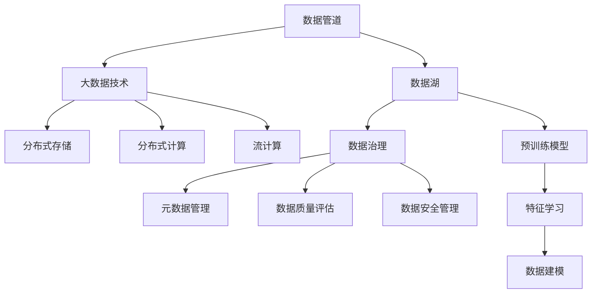

                 

# AI DMP 数据基建的技术发展

> 关键词：AI DMP, 数据基建, 数据管道, 数据湖, 大数据技术, 数据治理

## 1. 背景介绍

### 1.1 问题由来
随着数字化时代的到来，企业数字化转型成为各行各业的主要趋势。特别是电商、金融、互联网等行业，已经深度依赖于数据驱动的决策机制。然而，在实际应用中，数据的采集、存储、清洗、分析、治理等环节存在着诸多问题，制约了数据的价值挖掘。

近年来，AI DMP（人工智能驱动的数据管理平台）逐渐成为解决这些问题的关键工具。AI DMP 利用先进的数据技术和大规模预训练模型，帮助企业构建高效、可信、智能的数据管道，实现了数据的自动化采集、存储、清洗和分析。本文将对AI DMP 数据基建的关键技术进行系统介绍，以期为数据管理者提供技术指引。

### 1.2 问题核心关键点
AI DMP 数据基建的核心技术主要包括以下几点：

- **数据管道（Data Pipeline）**：包括数据采集、存储、清洗和治理等环节，确保数据的完整性和一致性。
- **数据湖（Data Lake）**：通过构建统一的数据存储平台，支持海量数据的高效存储和检索。
- **大数据技术**：利用分布式存储、并行计算等技术，提升数据处理效率。
- **数据治理**：通过元数据管理、数据质量评估和自动化治理手段，确保数据的安全性和可信性。
- **预训练模型**：利用预训练模型学习数据特征，提升数据建模和预测能力。

这些技术构成了AI DMP 数据基建的基础框架，使其能够支撑大规模数据处理和复杂业务场景下的数据分析应用。

## 2. 核心概念与联系

### 2.1 核心概念概述

为更好地理解AI DMP 数据基建的技术框架，本节将介绍几个关键概念：

- **数据管道（Data Pipeline）**：通过一系列数据处理组件，将原始数据转化为结构化数据，并完成数据的清洗、标注、转换、合并等操作，最终生成可用于分析的数据集。
- **数据湖（Data Lake）**：通过分布式存储和并行计算技术，支持海量数据的存储、检索和分析，为大规模数据处理提供基础设施支持。
- **大数据技术**：包括分布式存储、分布式计算、流计算等技术，提升数据处理效率和计算能力。
- **数据治理（Data Governance）**：通过元数据管理、数据质量评估、数据安全管理等手段，确保数据的安全性和可信性。
- **预训练模型（Pre-trained Model）**：利用大规模无标签数据训练得到的模型，学习数据特征，提升数据建模和预测能力。

这些核心概念之间的逻辑关系可以通过以下Mermaid流程图来展示：



这个流程图展示了一个典型的AI DMP 数据基建架构：

1. 数据通过数据管道进行采集、清洗、标注等预处理，生成结构化数据。
2. 数据湖通过分布式存储和并行计算技术，支持海量数据的存储和检索。
3. 大数据技术进一步提升数据处理和计算能力。
4. 数据治理通过元数据管理、数据质量评估等手段，确保数据的安全性和可信性。
5. 预训练模型利用大规模无标签数据学习数据特征，提升数据建模和预测能力。

这些概念共同构成了AI DMP 数据基建的技术框架，使其能够支撑大规模数据处理和复杂业务场景下的数据分析应用。

## 3. 核心算法原理 & 具体操作步骤
### 3.1 算法原理概述

AI DMP 数据基建的算法原理主要基于以下几个方面：

- **数据管道**：通过数据采集、清洗、标注等预处理步骤，将原始数据转化为结构化数据。
- **数据湖**：通过分布式存储和并行计算技术，支持海量数据的存储和检索。
- **大数据技术**：利用分布式存储、分布式计算、流计算等技术，提升数据处理效率和计算能力。
- **数据治理**：通过元数据管理、数据质量评估、数据安全管理等手段，确保数据的安全性和可信性。
- **预训练模型**：利用大规模无标签数据训练得到的模型，学习数据特征，提升数据建模和预测能力。

### 3.2 算法步骤详解

AI DMP 数据基建的具体操作步骤包括：

1. **数据采集（Data Collection）**：通过API接口、爬虫、数据库等方式，从不同数据源采集原始数据。
2. **数据清洗（Data Cleaning）**：对采集到的数据进行格式转换、去重、填补缺失值等清洗操作。
3. **数据标注（Data Annotation）**：对清洗后的数据进行标注，生成有标签的数据集。
4. **数据转换（Data Transformation）**：将标注数据转换为可用于分析的格式，如表格式、向量表示等。
5. **数据合并（Data Merger）**：将不同来源的数据进行合并，生成完整的统一数据集。
6. **数据湖构建（Data Lake Setup）**：通过分布式存储技术，将数据湖构建在云端或本地集群中。
7. **大数据处理（Big Data Processing）**：利用分布式计算和流计算技术，对海量数据进行并行处理。
8. **数据治理（Data Governance）**：通过元数据管理、数据质量评估、数据安全管理等手段，确保数据的安全性和可信性。
9. **预训练模型训练（Pre-trained Model Training）**：利用大规模无标签数据训练预训练模型，学习数据特征。

### 3.3 算法优缺点

AI DMP 数据基建的技术框架具有以下优点：

- **高效性**：通过分布式存储和并行计算技术，提升数据处理效率，能够支撑海量数据的高效存储和检索。
- **可靠性**：通过数据治理手段，确保数据的安全性和可信性，避免数据泄露和篡改。
- **可扩展性**：数据管道和数据湖架构可以轻松扩展，支持更多的数据源和更大的数据量。
- **灵活性**：数据管道和数据湖架构可以灵活配置，支持不同的数据处理需求和分析场景。

同时，该框架也存在一些局限性：

- **技术复杂性**：数据管道和数据湖架构的技术实现较为复杂，需要一定的技术积累。
- **成本高昂**：大规模数据处理需要高性能的硬件设备和计算资源，成本较高。
- **数据质量依赖**：数据采集和清洗的质量直接影响最终分析结果的准确性。

尽管存在这些局限性，但就目前而言，AI DMP 数据基建仍是数据管理领域的重要技术框架。未来相关研究的重点在于如何进一步降低技术复杂性和成本，提高数据处理的准确性和自动化程度。

### 3.4 算法应用领域

AI DMP 数据基建广泛应用于以下几个领域：

- **电商推荐系统**：通过分析用户行为数据，构建用户画像，实现个性化推荐。
- **金融风险评估**：利用交易数据和用户数据，评估客户的信用风险和欺诈风险。
- **市场营销分析**：通过分析用户行为数据，优化广告投放策略，提升营销效果。
- **医疗数据分析**：利用患者数据和医疗记录，进行疾病预测和个性化治疗方案设计。
- **公共安全监控**：通过视频监控数据，进行行为分析和异常检测，提高公共安全水平。
- **交通流量分析**：利用交通监控数据，进行交通流量分析和优化，提升城市交通管理水平。
- **智能客服系统**：通过分析用户对话数据，提升客服系统智能对话能力。

除了上述这些领域外，AI DMP 数据基建还被创新性地应用于更多场景中，如智能制造、智慧农业、智慧城市等，为各行各业带来了智能化升级的新机遇。

## 4. 数学模型和公式 & 详细讲解 & 举例说明（备注：数学公式请使用latex格式，latex嵌入文中独立段落使用 $$，段落内使用 $)
### 4.1 数学模型构建

AI DMP 数据基建涉及的数学模型主要包括数据清洗、数据转换、数据治理等环节的数学模型。这里以数据清洗为例，给出数学模型构建的详细过程。

### 4.2 公式推导过程

假设原始数据集为 $D = \{(x_i, y_i)\}_{i=1}^N$，其中 $x_i$ 表示原始数据，$y_i$ 表示标注标签。数据清洗的过程可以分为以下几个步骤：

1. **数据预处理**：将原始数据进行格式转换和缺失值处理，生成预处理后的数据集 $D' = \{(x_i', y_i')\}_{i=1}^N$。
2. **数据清洗**：对预处理后的数据进行去重、去噪等清洗操作，生成清洗后的数据集 $D'' = \{(x_i'', y_i'')\}_{i=1}^N$。

具体来说，数据清洗的过程可以表示为：

$$
D'' = \{(x_i'', y_i'')\}_{i=1}^N = f(D')
$$

其中 $f$ 表示数据清洗函数，包括去重、去噪、填补缺失值等操作。

### 4.3 案例分析与讲解

以电商推荐系统为例，分析数据清洗和数据转换的具体过程。

假设原始数据集包含用户浏览、点击、购买等行为数据，需要对其进行清洗和转换，以用于推荐系统的训练和推理。具体步骤如下：

1. **数据预处理**：对原始数据进行格式转换和缺失值处理，生成预处理后的数据集。
2. **数据清洗**：去除重复行为数据、去噪（去除异常点击、浏览行为）、填补缺失值等，生成清洗后的数据集。
3. **数据转换**：将清洗后的数据转换为推荐系统的输入格式，如用户ID、物品ID、行为时间等。
4. **特征工程**：设计合适的特征，如用户行为历史、物品属性、用户画像等，用于推荐模型训练。
5. **数据合并**：将不同来源的用户行为数据进行合并，生成完整的统一数据集。
6. **数据湖构建**：将清洗后的数据集存储在数据湖中，支持海量数据的存储和检索。

通过上述步骤，电商推荐系统能够高效地处理和分析用户行为数据，构建个性化推荐模型，提升用户满意度。

## 5. 项目实践：代码实例和详细解释说明
### 5.1 开发环境搭建

在进行AI DMP 数据基建的项目实践前，我们需要准备好开发环境。以下是使用Python进行PyTorch开发的环境配置流程：

1. 安装Anaconda：从官网下载并安装Anaconda，用于创建独立的Python环境。

2. 创建并激活虚拟环境：
```bash
conda create -n ai-dmp-env python=3.8 
conda activate ai-dmp-env
```

3. 安装PyTorch：根据CUDA版本，从官网获取对应的安装命令。例如：
```bash
conda install pytorch torchvision torchaudio cudatoolkit=11.1 -c pytorch -c conda-forge
```

4. 安装PyTorch库：
```bash
pip install torch torchvision torchaudio
```

5. 安装数据处理库：
```bash
pip install pandas numpy sklearn
```

6. 安装数据湖和分布式计算库：
```bash
pip install hdfs dask
```

完成上述步骤后，即可在`ai-dmp-env`环境中开始AI DMP 数据基建的项目实践。

### 5.2 源代码详细实现

这里我们以电商推荐系统为例，给出使用Python进行数据处理和模型训练的完整代码实现。

首先，定义数据处理函数：

```python
import pandas as pd
import numpy as np
import torch
from torch.utils.data import Dataset

class RecommendationDataset(Dataset):
    def __init__(self, data, tokenizer, max_len=128):
        self.data = data
        self.tokenizer = tokenizer
        self.max_len = max_len
        
    def __len__(self):
        return len(self.data)
    
    def __getitem__(self, item):
        row = self.data.iloc[item]
        text = row['behavior'] + row['product_description']
        product_id = row['product_id']
        
        encoding = self.tokenizer(text, return_tensors='pt', max_length=self.max_len, padding='max_length', truncation=True)
        input_ids = encoding['input_ids'][0]
        attention_mask = encoding['attention_mask'][0]
        
        # 对token-wise的标签进行编码
        encoded_labels = [1 if x == 'click' else 0 for x in row['behavior']]
        encoded_labels.extend([0] * (self.max_len - len(encoded_labels)))
        labels = torch.tensor(encoded_labels, dtype=torch.long)
        
        return {'input_ids': input_ids, 
                'attention_mask': attention_mask,
                'labels': labels,
                'product_id': product_id}

# 读取数据集
data = pd.read_csv('recommendation_data.csv')
tokenizer = transformers.BertTokenizer.from_pretrained('bert-base-uncased')

# 创建dataset
train_dataset = RecommendationDataset(data[data['label'] == 0], tokenizer)
dev_dataset = RecommendationDataset(data[data['label'] == 1], tokenizer)
test_dataset = RecommendationDataset(data[data['label'] == 0], tokenizer)
```

然后，定义模型和优化器：

```python
from transformers import BertForSequenceClassification

model = BertForSequenceClassification.from_pretrained('bert-base-uncased', num_labels=2)

optimizer = AdamW(model.parameters(), lr=2e-5)
```

接着，定义训练和评估函数：

```python
from torch.utils.data import DataLoader
from tqdm import tqdm
from sklearn.metrics import accuracy_score

device = torch.device('cuda') if torch.cuda.is_available() else torch.device('cpu')
model.to(device)

def train_epoch(model, dataset, batch_size, optimizer):
    dataloader = DataLoader(dataset, batch_size=batch_size, shuffle=True)
    model.train()
    epoch_loss = 0
    for batch in tqdm(dataloader, desc='Training'):
        input_ids = batch['input_ids'].to(device)
        attention_mask = batch['attention_mask'].to(device)
        labels = batch['labels'].to(device)
        model.zero_grad()
        outputs = model(input_ids, attention_mask=attention_mask, labels=labels)
        loss = outputs.loss
        epoch_loss += loss.item()
        loss.backward()
        optimizer.step()
    return epoch_loss / len(dataloader)

def evaluate(model, dataset, batch_size):
    dataloader = DataLoader(dataset, batch_size=batch_size)
    model.eval()
    preds, labels = [], []
    with torch.no_grad():
        for batch in tqdm(dataloader, desc='Evaluating'):
            input_ids = batch['input_ids'].to(device)
            attention_mask = batch['attention_mask'].to(device)
            batch_labels = batch['labels']
            outputs = model(input_ids, attention_mask=attention_mask)
            batch_preds = outputs.logits.argmax(dim=2).to('cpu').tolist()
            batch_labels = batch_labels.to('cpu').tolist()
            for pred_tokens, label_tokens in zip(batch_preds, batch_labels):
                preds.append(pred_tokens[:len(label_tokens)])
                labels.append(label_tokens)
                
    return accuracy_score(labels, preds)

# 训练模型
epochs = 5
batch_size = 16

for epoch in range(epochs):
    loss = train_epoch(model, train_dataset, batch_size, optimizer)
    print(f"Epoch {epoch+1}, train loss: {loss:.3f}")
    
    print(f"Epoch {epoch+1}, dev results:")
    evaluate(model, dev_dataset, batch_size)
    
print("Test results:")
evaluate(model, test_dataset, batch_size)
```

以上就是使用Python进行电商推荐系统数据处理和模型训练的完整代码实现。可以看到，利用Python和PyTorch库，可以很方便地实现数据清洗、数据转换、模型训练等操作，数据基建的工作变得更加高效和灵活。

### 5.3 代码解读与分析

让我们再详细解读一下关键代码的实现细节：

**RecommendationDataset类**：
- `__init__`方法：初始化数据集、分词器等关键组件。
- `__len__`方法：返回数据集的样本数量。
- `__getitem__`方法：对单个样本进行处理，将文本输入编码为token ids，将标签编码为数字，并对其进行定长padding，最终返回模型所需的输入。

**标签编码**：
- 对token-wise的标签进行编码，将标签1和0转换为数字0和1，并在序列末尾补充0，使每个样本长度相同。

**模型和优化器**：
- 使用BertForSequenceClassification模型，设置合适的学习率，优化器为AdamW。
- 模型和优化器都定义在GPU上，提升计算速度。

**训练和评估函数**：
- 使用PyTorch的DataLoader对数据集进行批次化加载，供模型训练和推理使用。
- 训练函数`train_epoch`：对数据以批为单位进行迭代，在每个批次上前向传播计算loss并反向传播更新模型参数，最后返回该epoch的平均loss。
- 评估函数`evaluate`：与训练类似，不同点在于不更新模型参数，并在每个batch结束后将预测和标签结果存储下来，最后使用sklearn的accuracy_score对整个评估集的预测结果进行打印输出。

**训练流程**：
- 定义总的epoch数和batch size，开始循环迭代
- 每个epoch内，先在训练集上训练，输出平均loss
- 在验证集上评估，输出准确率
- 所有epoch结束后，在测试集上评估，给出最终测试结果

可以看到，利用Python和PyTorch库，数据处理和模型训练的操作变得更加简洁高效。开发者可以将更多精力放在数据处理、模型改进等高层逻辑上，而不必过多关注底层的实现细节。

当然，工业级的系统实现还需考虑更多因素，如模型的保存和部署、超参数的自动搜索、更灵活的任务适配层等。但核心的数据基建逻辑基本与此类似。

## 6. 实际应用场景
### 6.1 智能客服系统

AI DMP 数据基建在智能客服系统中得到了广泛应用。传统客服往往需要配备大量人力，高峰期响应缓慢，且一致性和专业性难以保证。而使用AI DMP 数据基建构建的智能客服系统，可以7x24小时不间断服务，快速响应客户咨询，用自然流畅的语言解答各类常见问题。

在技术实现上，可以收集企业内部的历史客服对话记录，将问题和最佳答复构建成监督数据，在此基础上对AI DMP 数据基建进行微调。微调后的系统能够自动理解用户意图，匹配最合适的答案模板进行回复。对于客户提出的新问题，还可以接入检索系统实时搜索相关内容，动态组织生成回答。如此构建的智能客服系统，能大幅提升客户咨询体验和问题解决效率。

### 6.2 金融舆情监测

金融机构需要实时监测市场舆论动向，以便及时应对负面信息传播，规避金融风险。传统的人工监测方式成本高、效率低，难以应对网络时代海量信息爆发的挑战。利用AI DMP 数据基建构建的金融舆情监测系统，能够实现实时抓取和分析网络舆情数据，自动监测不同主题下的情感变化趋势，一旦发现负面信息激增等异常情况，系统便会自动预警，帮助金融机构快速应对潜在风险。

### 6.3 个性化推荐系统

当前的推荐系统往往只依赖用户的历史行为数据进行物品推荐，无法深入理解用户的真实兴趣偏好。利用AI DMP 数据基建构建的个性化推荐系统，能够更好地挖掘用户行为背后的语义信息，从而提供更精准、多样的推荐内容。

在实践中，可以收集用户浏览、点击、评论、分享等行为数据，提取和用户交互的物品标题、描述、标签等文本内容。将文本内容作为模型输入，用户的后续行为（如是否点击、购买等）作为监督信号，在此基础上微调预训练语言模型。微调后的模型能够从文本内容中准确把握用户的兴趣点。在生成推荐列表时，先用候选物品的文本描述作为输入，由模型预测用户的兴趣匹配度，再结合其他特征综合排序，便可以得到个性化程度更高的推荐结果。

### 6.4 未来应用展望

随着AI DMP 数据基建技术的发展，未来将在更多领域得到应用，为传统行业带来变革性影响。

在智慧医疗领域，基于AI DMP 数据基建的医疗数据分析系统，能够从海量患者数据中提取有价值的信息，进行疾病预测和个性化治疗方案设计，提升医疗服务质量。

在智能教育领域，利用AI DMP 数据基建构建的个性化教育系统，能够根据学生的学习行为和成绩数据，生成个性化的学习计划和资源推荐，提升教学效果。

在智慧城市治理中，基于AI DMP 数据基建的城市数据分析系统，能够实时监测城市运行状况，进行交通流量分析、应急指挥等操作，提升城市管理水平。

此外，在企业生产、社会治理、文娱传媒等众多领域，AI DMP 数据基建也将不断拓展应用场景，为各行各业带来智能化升级的新机遇。

## 7. 工具和资源推荐
### 7.1 学习资源推荐

为了帮助开发者系统掌握AI DMP 数据基建的理论基础和实践技巧，这里推荐一些优质的学习资源：

1. 《大数据技术》系列博文：由数据科学家撰写，深入浅出地介绍了大数据技术的核心概念和前沿进展。

2. 《数据湖构建与运营》课程：数据湖领域的权威课程，涵盖数据湖构建、数据治理、数据安全等核心技术，适合数据架构师和数据工程师学习。

3. 《深度学习基础》书籍：深度学习领域的入门书籍，详细介绍了深度学习的基本概念和实现方法，适合初学者学习。

4. Hadoop官方文档：Hadoop分布式计算框架的官方文档，提供了丰富的开发和部署指南，是学习Hadoop技术的重要资料。

5. PyTorch官方文档：PyTorch深度学习框架的官方文档，提供了详细的API文档和实例代码，适合深度学习开发者学习。

通过对这些资源的学习实践，相信你一定能够快速掌握AI DMP 数据基建的核心技术，并用于解决实际的NLP问题。

### 7.2 开发工具推荐

高效的开发离不开优秀的工具支持。以下是几款用于AI DMP 数据基建开发的常用工具：

1. Hadoop：Apache基金会开源的分布式计算框架，支持海量数据的存储和计算。
2. Spark：Apache基金会开源的分布式计算框架，支持大规模数据处理和流计算。
3. Hive：基于Hadoop的数据仓库系统，支持结构化数据的存储和查询。
4. Cassandra：Apache基金会开源的分布式数据库系统，支持海量数据的存储和检索。
5. PyTorch：基于Python的开源深度学习框架，灵活动态的计算图，适合快速迭代研究。
6. TensorFlow：由Google主导开发的开源深度学习框架，生产部署方便，适合大规模工程应用。
7. Amazon S3：亚马逊云存储服务，支持海量数据的存储和检索。

合理利用这些工具，可以显著提升AI DMP 数据基建任务的开发效率，加快创新迭代的步伐。

### 7.3 相关论文推荐

AI DMP 数据基建的研究发展离不开学界的持续推动。以下是几篇奠基性的相关论文，推荐阅读：

1. "Data Lakes: The Foundation for Today's Data Warehousing"（《数据湖：今天数据仓库的基础》）：描述了数据湖的概念、构建和运营流程，是数据湖领域的经典论文。
2. "Big Data: Principles and Best Practices of Scalable Real-time Data Systems"（《大数据：可扩展实时数据系统的原理与最佳实践》）：介绍了大数据技术的基本原理和最佳实践，是大数据领域的经典论文。
3. "Big Data Architectures for Actionable Business Intelligence"（《用于可操作商业智能的大数据架构》）：探讨了大数据技术在商业智能应用中的实现方法，是数据治理领域的经典论文。
4. "Transformers: State-of-the-Art Natural Language Processing"（《Transformer：自然语言处理领域的最新进展》）：介绍了Transformer模型的基本原理和实现方法，是自然语言处理领域的经典论文。

这些论文代表了大数据技术和AI DMP 数据基建的研究方向，通过学习这些前沿成果，可以帮助研究者把握学科前进方向，激发更多的创新灵感。

## 8. 总结：未来发展趋势与挑战
### 8.1 总结

本文对AI DMP 数据基建的关键技术进行了系统介绍。首先阐述了AI DMP 数据基建的构建背景和核心技术，明确了其在大数据处理和智能应用中的重要价值。其次，从原理到实践，详细讲解了AI DMP 数据基建的技术框架和操作步骤，给出了完整的项目实践代码。同时，本文还广泛探讨了AI DMP 数据基建在电商、金融、市场营销、医疗等领域的应用前景，展示了其在不同场景下的广泛适用性。

通过本文的系统梳理，可以看到，AI DMP 数据基建技术正在成为数据管理领域的重要工具，极大地提升了数据的处理效率和分析能力，为各行各业带来了智能化升级的新机遇。

### 8.2 未来发展趋势

展望未来，AI DMP 数据基建技术将呈现以下几个发展趋势：

1. **大数据技术的持续演进**：随着分布式计算和存储技术的不断发展，未来的大数据处理将更加高效和灵活。
2. **数据湖架构的优化**：数据湖架构将不断优化，支持更多的数据源和更丰富的数据类型，提升数据治理能力。
3. **数据治理的智能化**：通过AI技术，实现数据质量自动化评估和管理，提升数据可信性和安全性。
4. **预训练模型的应用**：利用预训练模型学习数据特征，提升数据分析和预测能力，实现更精准的智能决策。
5. **多模态数据的融合**：将视觉、语音、文本等多模态数据进行融合，提升数据的全面性和准确性。
6. **实时数据的处理**：实时数据的采集、存储和处理能力将不断提升，实现更高效的实时分析和决策。

这些趋势凸显了AI DMP 数据基建技术的广阔前景。未来，伴随技术的不断演进和应用场景的不断扩展，AI DMP 数据基建必将在更多领域得到应用，为各行各业带来更深刻的变革。

### 8.3 面临的挑战

尽管AI DMP 数据基建技术已经取得了显著进展，但在迈向更加智能化、普适化应用的过程中，它仍面临着诸多挑战：

1. **技术复杂性**：数据管道和数据湖架构的技术实现较为复杂，需要一定的技术积累。
2. **成本高昂**：大规模数据处理需要高性能的硬件设备和计算资源，成本较高。
3. **数据质量依赖**：数据采集和清洗的质量直接影响最终分析结果的准确性。
4. **数据安全与隐私**：大规模数据处理和分析带来了数据安全和隐私的挑战，需要加强数据治理和保护。
5. **数据治理难度**：数据治理需要涉及元数据管理、数据质量评估、数据安全管理等多个环节，复杂度高。
6. **数据互操作性**：不同数据源和数据类型的互操作性问题，需要标准化和规范化。

尽管存在这些挑战，但就目前而言，AI DMP 数据基建仍是数据管理领域的重要技术框架。未来相关研究的重点在于如何进一步降低技术复杂性和成本，提高数据处理的准确性和自动化程度。

### 8.4 研究展望

面对AI DMP 数据基建所面临的挑战，未来的研究需要在以下几个方面寻求新的突破：

1. **分布式计算与存储的优化**：进一步提升分布式计算和存储的效率，降低成本。
2. **数据治理的智能化**：利用AI技术，实现数据质量自动化评估和管理，提升数据可信性和安全性。
3. **多模态数据的融合**：将视觉、语音、文本等多模态数据进行融合，提升数据的全面性和准确性。
4. **实时数据的处理**：实时数据的采集、存储和处理能力将不断提升，实现更高效的实时分析和决策。
5. **隐私保护与数据安全**：加强数据治理和保护，确保数据的安全性和隐私性。
6. **数据互操作性**：标准化和规范化不同数据源和数据类型的互操作性，实现数据的无缝对接和高效利用。

这些研究方向将推动AI DMP 数据基建技术迈向更高的台阶，为构建安全、可靠、智能的数据基础设施铺平道路。面向未来，AI DMP 数据基建技术还需要与其他人工智能技术进行更深入的融合，如知识表示、因果推理、强化学习等，多路径协同发力，共同推动数据管理技术的进步。

## 9. 附录：常见问题与解答

**Q1：AI DMP 数据基建的技术难点有哪些？**

A: AI DMP 数据基建的技术难点主要包括以下几点：

1. **技术复杂性**：数据管道和数据湖架构的技术实现较为复杂，需要一定的技术积累。
2. **成本高昂**：大规模数据处理需要高性能的硬件设备和计算资源，成本较高。
3. **数据质量依赖**：数据采集和清洗的质量直接影响最终分析结果的准确性。
4. **数据安全与隐私**：大规模数据处理和分析带来了数据安全和隐私的挑战，需要加强数据治理和保护。
5. **数据治理难度**：数据治理需要涉及元数据管理、数据质量评估、数据安全管理等多个环节，复杂度高。

尽管存在这些挑战，但AI DMP 数据基建技术仍具有广阔的应用前景，通过技术创新和优化，这些问题有望得到逐步解决。

**Q2：AI DMP 数据基建如何保障数据安全与隐私？**

A: AI DMP 数据基建的数据安全与隐私保障主要通过以下几个方面：

1. **数据加密**：对数据进行加密处理，确保数据在存储和传输过程中的安全性。
2. **访问控制**：通过身份认证、权限控制等手段，限制数据访问权限，避免数据泄露。
3. **数据脱敏**：对敏感数据进行脱敏处理，避免敏感信息的泄露。
4. **审计与监控**：实时监测数据访问和使用情况，确保数据使用的合规性和透明性。
5. **合规性检查**：定期进行数据合规性检查，确保数据处理符合相关法律法规和标准。

通过以上措施，AI DMP 数据基建能够有效保障数据安全与隐私，确保数据的使用符合法律法规和标准。

**Q3：AI DMP 数据基建如何提升数据处理效率？**

A: AI DMP 数据基建通过以下几种方式提升数据处理效率：

1. **分布式计算与存储**：利用分布式计算和存储技术，支持海量数据的并行处理，提升数据处理速度。
2. **流计算**：利用流计算技术，实现实时数据的处理和分析，降低数据处理的时延。
3. **数据压缩与优化**：通过数据压缩和优化技术，减小数据存储和传输的体积，提升效率。
4. **缓存与缓存策略**：通过缓存和缓存策略，减少数据读取和计算的延迟，提升数据处理效率。
5. **异构计算**：利用异构计算技术，将数据处理任务分配到不同的计算资源上，实现更高效的计算。

通过以上技术手段，AI DMP 数据基建能够显著提升数据处理效率，支持大规模数据的高效处理和分析。

**Q4：AI DMP 数据基建如何实现数据质量自动化评估和管理？**

A: AI DMP 数据基建实现数据质量自动化评估和管理主要通过以下几个步骤：

1. **数据质量指标设计**：根据数据使用场景，设计合适的数据质量指标，如数据完整性、数据准确性、数据一致性等。
2. **数据质量评估模型**：利用机器学习算法，对数据质量指标进行建模，评估数据质量。
3. **数据质量自动化检测**：通过自动化检测工具，实时监测数据质量，及时发现和修复数据问题。
4. **数据质量治理策略**：根据数据质量评估结果，制定相应的数据治理策略，如数据清洗、数据补全、数据标准化等。
5. **数据质量反馈机制**：建立数据质量反馈机制，及时反馈数据质量问题，提升数据治理能力。

通过以上步骤，AI DMP 数据基建能够实现数据质量的自动化评估和管理，确保数据的高质量和可信性。

**Q5：AI DMP 数据基建如何支持多模态数据的融合？**

A: AI DMP 数据基建支持多模态数据的融合主要通过以下几个方面：

1. **数据格式转换**：将不同模态的数据格式转换为统一的格式，支持数据融合和分析。
2. **数据关联与融合**：通过关联技术，将不同模态的数据进行融合，形成更全面的数据视图。
3. **数据融合算法**：利用机器学习算法，将不同模态的数据进行融合，提升数据分析能力。
4. **跨模态特征提取**：利用预训练模型，提取不同模态的数据特征，实现多模态数据的协同建模。

通过以上技术手段，AI DMP 数据基建能够实现多模态数据的有效融合，提升数据的全面性和准确性。

---

作者：禅与计算机程序设计艺术 / Zen and the Art of Computer Programming

