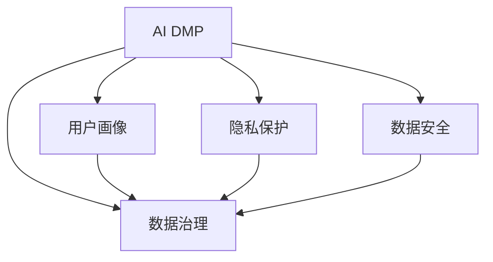

                 

# AI DMP 数据基建的技术评估

> 关键词：AI DMP, 数据基建, 技术评估, 数据治理, 用户画像, 隐私保护, 数据质量, 数据安全

## 1. 背景介绍

### 1.1 问题由来
随着数字营销的发展，客户数据管理平台（Customer Data Platform, DMP）已经成为了营销和广告投放的重要工具。DMP通过整合和分析用户的多渠道数据，帮助企业制定个性化的营销策略，提升广告投放的精准度和ROI。然而，DMP建设过程中面临的数据治理、用户隐私保护、数据安全等问题，却常常被忽略，给企业带来严重的法律和商业风险。

AI DMP（Artificial Intelligence Customer Data Platform）作为一种新兴的数据管理方式，通过引入AI技术，提升数据基建能力，为DMP建设带来全新的可能性。AI DMP不仅能够自动化处理海量数据，还能通过算法优化，提高数据质量和用户画像的准确性。本文将从技术角度对AI DMP进行全面的评估，探讨其在数据基建中的潜在价值和面临的挑战。

### 1.2 问题核心关键点
AI DMP建设的核心关键点在于：
- 如何实现高效的数据治理，保障数据的质量和一致性。
- 如何保障用户隐私，合法合规地使用用户数据。
- 如何提高数据处理的效率和精准度，提升用户画像的准确性。
- 如何增强数据安全，防止数据泄露和滥用。

本文将从数据治理、隐私保护、数据质量和数据安全四个方面，对AI DMP进行详细的技术评估。

## 2. 核心概念与联系

### 2.1 核心概念概述

为更好地理解AI DMP的技术评估，本节将介绍几个密切相关的核心概念：

- AI DMP: 通过引入AI技术，自动化数据采集、处理和分析，提升DMP的数据治理和用户画像能力的平台。
- 数据治理(Data Governance): 对企业数据资源的规划、监控、控制和优化，确保数据质量、一致性和可用性。
- 用户画像(User Profile): 通过分析和整合用户数据，构建用户的行为、兴趣和属性标签，以便于个性化营销。
- 隐私保护(Privacy Protection): 保障用户数据隐私，合法合规地使用用户数据，避免法律和道德风险。
- 数据安全(Data Security): 保护数据免受未授权访问和攻击，确保数据完整性和可用性。

这些核心概念之间的逻辑关系可以通过以下Mermaid流程图来展示：



这个流程图展示了几者之间的逻辑关系：

1. AI DMP通过数据治理获取高质数据。
2. 利用用户画像为用户定制个性化策略。
3. 遵守隐私保护原则，确保数据合法合规使用。
4. 强化数据安全，防止数据泄露和攻击。

这些概念共同构成了AI DMP的基础框架，为其建设提供了明确的技术导向。

## 3. 核心算法原理 & 具体操作步骤
### 3.1 算法原理概述

AI DMP的核心算法原理主要包括数据治理、用户画像构建、隐私保护和数据安全四个方面。以下分别介绍各部分的算法原理：

#### 3.1.1 数据治理

数据治理算法主要通过数据清洗、数据集成、数据质量评估等步骤，确保数据的一致性、完整性和可用性。

- **数据清洗**：去除重复、缺失、错误的数据，提升数据质量。
- **数据集成**：将来自不同来源的数据合并，消除冗余，生成统一的数据视图。
- **数据质量评估**：通过定义数据质量指标（如准确性、完整性、一致性等），定期评估数据质量，及时修复数据问题。

#### 3.1.2 用户画像

用户画像构建算法主要通过机器学习和数据挖掘技术，分析用户行为数据，生成用户画像。

- **聚类分析**：对用户行为数据进行聚类分析，将相似的用户分到同一类别。
- **关联规则挖掘**：发现用户行为之间的关联性，挖掘用户行为模式。
- **标签生成**：根据用户行为数据和属性信息，生成行为标签、兴趣标签、属性标签等。

#### 3.1.3 隐私保护

隐私保护算法主要通过差分隐私、联邦学习等技术，保障用户数据隐私。

- **差分隐私**：在数据分析过程中，添加噪声，保护用户隐私，避免数据泄露。
- **联邦学习**：多个设备或服务器共同训练模型，避免数据集中存储，保护用户隐私。

#### 3.1.4 数据安全

数据安全算法主要通过加密、访问控制等技术，保障数据安全。

- **数据加密**：对数据进行加密存储和传输，防止数据泄露。
- **访问控制**：通过身份验证和权限控制，限制对数据的访问权限，防止数据滥用。

### 3.2 算法步骤详解

AI DMP的建设一般包括以下几个关键步骤：

**Step 1: 数据收集与整合**

1. 收集来自不同来源的数据，如社交媒体、电商平台、广告平台等。
2. 对数据进行清洗和整合，消除冗余和错误，生成统一的数据视图。

**Step 2: 数据治理**

1. 定义数据治理规范和流程，确保数据质量。
2. 实施数据质量评估，定期检查数据一致性和完整性。
3. 根据评估结果，进行数据修复和优化。

**Step 3: 用户画像构建**

1. 利用聚类分析和关联规则挖掘技术，分析用户行为数据。
2. 根据分析结果，生成行为标签、兴趣标签、属性标签等用户画像。
3. 通过定期更新和验证，确保用户画像的准确性。

**Step 4: 隐私保护**

1. 在数据分析过程中，引入差分隐私机制，保护用户隐私。
2. 采用联邦学习技术，避免数据集中存储，保护用户隐私。

**Step 5: 数据安全**

1. 对数据进行加密存储和传输，防止数据泄露。
2. 通过身份验证和权限控制，限制数据访问权限。

**Step 6: 模型部署与监控**

1. 将训练好的模型部署到生产环境，实时处理用户数据。
2. 监控模型性能和数据安全，及时调整和优化。

### 3.3 算法优缺点

AI DMP的数据治理算法具有以下优点：
1. 自动化处理海量数据，提升数据治理效率。
2. 机器学习算法能够发现数据中的复杂关联，提高数据质量。
3. 算法框架灵活，可以适应不同的数据治理需求。

然而，其也存在以下缺点：
1. 算法模型复杂，需要大量计算资源。
2. 模型训练和优化过程可能引入新的误差，影响数据质量。
3. 算法框架通用性较强，难以针对特定数据类型进行深度优化。

用户画像构建算法具有以下优点：
1. 能够自动分析用户行为，生成高精度用户画像。
2. 利用机器学习技术，发现用户行为模式，提升个性化营销效果。
3. 算法可扩展性高，能够适应不同类型的用户画像需求。

但其缺点如下：
1. 算法模型需要大量的用户行为数据，数据收集成本较高。
2. 算法模型复杂，可能存在过度拟合或欠拟合问题。
3. 模型生成过程中可能引入偏见，影响用户画像的公正性。

隐私保护算法具有以下优点：
1. 差分隐私和联邦学习技术能够保护用户隐私，避免数据泄露。
2. 技术成熟，已有大量研究和应用实践。
3. 技术框架灵活，适用于不同的隐私保护需求。

其缺点包括：
1. 技术实现复杂，需要高水平的算法和工程支持。
2. 可能影响数据分析结果的准确性，需要权衡隐私保护和数据分析之间的矛盾。
3. 技术框架通用性较强，难以针对特定隐私保护需求进行深度优化。

数据安全算法具有以下优点：
1. 数据加密和访问控制技术能够有效保护数据安全，防止数据泄露和攻击。
2. 技术成熟，已有大量研究和应用实践。
3. 技术框架灵活，适用于不同的数据安全需求。

其缺点如下：
1. 算法实现复杂，需要高水平的算法和工程支持。
2. 加密和解密过程可能影响数据处理效率。
3. 访问控制需要灵活配置，可能存在配置复杂、易出错的问题。

### 3.4 算法应用领域

AI DMP在多个领域都有广泛的应用，如：

- **数字营销**：利用用户画像，实现个性化广告投放，提升广告效果。
- **零售行业**：分析用户购买行为，实现精准营销和库存管理。
- **金融行业**：通过用户画像，进行客户分类和风险评估。
- **医疗行业**：利用用户行为数据，实现个性化健康管理。
- **政府机构**：利用用户画像，进行公共服务优化和政策制定。

这些领域中的数据基建需求复杂多样，AI DMP通过引入AI技术，能够提供更加高效、精准的数据处理能力，提升企业的数据治理和用户画像能力，帮助企业实现数字化转型。

## 4. 数学模型和公式 & 详细讲解 & 举例说明
### 4.1 数学模型构建

为更好地理解AI DMP的数据治理算法，本节将使用数学语言对数据清洗、数据集成、数据质量评估等过程进行严格刻画。

假设原始数据集为 $D=\{x_1, x_2, \ldots, x_n\}$，其中 $x_i = (x_{i1}, x_{i2}, \ldots, x_{im})$ 表示数据的一个样本，$m$ 为数据维度。

**数据清洗模型**：
- 定义数据清洗规则 $\mathcal{R}$，去除重复、缺失和错误的数据。
- 清洗后的数据集记为 $D'$，满足 $D' \subset D$。

**数据集成模型**：
- 定义数据集成规则 $\mathcal{I}$，将来自不同来源的数据合并，消除冗余。
- 集成后的数据集记为 $D''$，满足 $D'' \subset D'$。

**数据质量评估模型**：
- 定义数据质量指标 $K=\{A, C, D\}$，其中 $A$ 表示数据准确性，$C$ 表示数据完整性，$D$ 表示数据一致性。
- 定义数据质量评估函数 $\mathcal{E}(D'', K)$，计算数据质量得分。

### 4.2 公式推导过程

以下我们以数据清洗为例，推导清洗规则 $\mathcal{R}$ 的构建过程。

假设原始数据集中存在重复的样本 $x_i = x_j$，则数据清洗规则 $\mathcal{R}$ 定义为：
- 去除重复样本，保留其中任意一个样本。

数据清洗的数学表达为：
$$
D' = D \backslash \{ x_i | x_i = x_j \text{ for some } x_j \in D' \}
$$

对于数据集成，假设存在两个数据集 $D_1$ 和 $D_2$，且满足 $D_1 \cap D_2 = \emptyset$，则数据集成规则 $\mathcal{I}$ 定义为：
- 合并两个数据集，消除冗余。

数据集合并的数学表达为：
$$
D'' = D_1 \cup D_2
$$

对于数据质量评估，假设数据集 $D''$ 的准确性、完整性和一致性分别为 $A_1, C_1, D_1$ 和 $A_2, C_2, D_2$，则数据质量评估函数 $\mathcal{E}(D'', K)$ 定义为：
$$
\mathcal{E}(D'', K) = \frac{A_1 + A_2}{2} + \frac{C_1 + C_2}{2} + \frac{D_1 + D_2}{2}
$$

### 4.3 案例分析与讲解

**案例1: 数据清洗**

假设原始数据集中存在重复的样本 $x_i = x_j$，则数据清洗规则 $\mathcal{R}$ 定义为：
- 去除重复样本，保留其中任意一个样本。

数据清洗的数学表达为：
$$
D' = D \backslash \{ x_i | x_i = x_j \text{ for some } x_j \in D' \}
$$

例如，原始数据集中存在重复的订单信息，清洗后只保留一条订单信息，其余重复的订单信息被删除。

**案例2: 数据集成**

假设存在两个数据集 $D_1$ 和 $D_2$，且满足 $D_1 \cap D_2 = \emptyset$，则数据集成规则 $\mathcal{I}$ 定义为：
- 合并两个数据集，消除冗余。

数据集合并的数学表达为：
$$
D'' = D_1 \cup D_2
$$

例如，原始数据集中存在来自不同来源的销售记录，集成后合并为一个数据集，去除重复的销售记录。

**案例3: 数据质量评估**

假设数据集 $D''$ 的准确性、完整性和一致性分别为 $A_1, C_1, D_1$ 和 $A_2, C_2, D_2$，则数据质量评估函数 $\mathcal{E}(D'', K)$ 定义为：
$$
\mathcal{E}(D'', K) = \frac{A_1 + A_2}{2} + \frac{C_1 + C_2}{2} + \frac{D_1 + D_2}{2}
$$

例如，评估数据集 $D''$ 的数据质量得分，计算公式为：
$$
\mathcal{E}(D'', K) = \frac{A_1 + A_2}{2} + \frac{C_1 + C_2}{2} + \frac{D_1 + D_2}{2}
$$

## 5. 项目实践：代码实例和详细解释说明
### 5.1 开发环境搭建

在进行数据基建项目实践前，我们需要准备好开发环境。以下是使用Python进行PyTorch开发的环境配置流程：

1. 安装Anaconda：从官网下载并安装Anaconda，用于创建独立的Python环境。

2. 创建并激活虚拟环境：
```bash
conda create -n pytorch-env python=3.8 
conda activate pytorch-env
```

3. 安装PyTorch：根据CUDA版本，从官网获取对应的安装命令。例如：
```bash
conda install pytorch torchvision torchaudio cudatoolkit=11.1 -c pytorch -c conda-forge
```

4. 安装其他必要的库：
```bash
pip install pandas numpy scikit-learn tqdm matplotlib jupyter notebook ipython
```

完成上述步骤后，即可在`pytorch-env`环境中开始数据基建项目的开发。

### 5.2 源代码详细实现

下面我们以数据清洗为例，给出使用PyTorch实现数据清洗的代码实现。

首先，定义数据清洗函数：

```python
import pandas as pd

def clean_data(df):
    # 去除重复记录
    df = df.drop_duplicates()

    # 处理缺失值
    df = df.fillna(method='ffill')

    # 处理异常值
    df = df.dropna(subset=['value'])

    return df
```

接着，定义数据集加载函数：

```python
def load_data(path):
    # 读取CSV文件
    df = pd.read_csv(path)

    # 清洗数据
    df = clean_data(df)

    return df
```

最后，启动数据清洗流程并输出结果：

```python
# 加载数据集
df = load_data('data.csv')

# 输出数据集信息
print(df.info())
print(df.describe())
```

以上就是使用PyTorch对数据清洗的代码实现。可以看到，利用Python和Pandas库，我们可以高效地完成数据清洗和处理的各项工作。

### 5.3 代码解读与分析

让我们再详细解读一下关键代码的实现细节：

**clean_data函数**：
- 通过调用Pandas库的函数，对数据集进行重复记录去除、缺失值填充和异常值处理。

**load_data函数**：
- 读取CSV文件，调用clean_data函数进行数据清洗，并返回清洗后的数据集。

**数据清洗流程**：
- 读取原始数据集。
- 进行数据清洗，去除重复记录、处理缺失值和异常值。
- 输出数据集的基本信息，包括列名、数据类型和缺失值情况。
- 输出数据集的统计信息，包括均值、标准差、最小值和最大值等。

通过以上代码实现，可以高效地完成数据清洗工作，为后续的数据治理和用户画像构建提供基础。

当然，在实际应用中，还需要根据具体数据类型和治理需求，灵活调整数据清洗算法，保证数据质量。

## 6. 实际应用场景
### 6.1 智能推荐系统

AI DMP在智能推荐系统中得到了广泛的应用。通过构建用户画像，分析用户行为数据，智能推荐系统能够实现个性化推荐，提升用户满意度和平台粘性。

在技术实现上，智能推荐系统主要利用用户画像中的行为标签和兴趣标签，结合物品属性和用户历史行为数据，使用协同过滤和基于内容的推荐算法，生成个性化推荐结果。微调后的推荐模型能够更好地理解用户需求，生成更加精准和多样化的推荐内容。

### 6.2 金融风险控制

AI DMP在金融风险控制中也具有重要的应用价值。通过构建用户画像，金融机构能够实现精准的用户分类和风险评估，避免欺诈行为，保障金融安全。

在技术实现上，金融机构主要利用用户画像中的行为标签和属性标签，结合金融行为数据，使用机器学习算法进行用户分类和风险评估。微调后的分类和评估模型能够更好地识别欺诈行为，提升金融风险控制能力。

### 6.3 智能客服系统

AI DMP在智能客服系统中也有广泛的应用。通过构建用户画像，智能客服系统能够实现自动化客服，提升客户服务体验和满意度。

在技术实现上，智能客服系统主要利用用户画像中的行为标签和兴趣标签，结合用户问题意图和历史互动数据，使用自然语言处理和机器学习算法，生成自动化客服响应。微调后的客服模型能够更好地理解用户意图，生成更加自然和个性化的客服回复，提升客户体验。

### 6.4 未来应用展望

随着AI DMP技术的不断成熟，未来其在数据基建中的应用前景将更加广阔。

在智慧城市治理中，AI DMP能够实现城市事件监测、舆情分析、应急指挥等应用，提高城市管理的自动化和智能化水平。在医疗健康领域，AI DMP能够实现个性化健康管理、疾病预测和精准治疗等应用，提升医疗服务质量和效率。

此外，在教育、交通、物流等多个领域，AI DMP也将发挥重要作用，推动各行业的数字化转型升级。未来，随着AI DMP技术的不断创新和优化，其在数据基建中的应用范围和效果将不断扩大，为各行各业带来新的发展机遇。

## 7. 工具和资源推荐
### 7.1 学习资源推荐

为了帮助开发者系统掌握AI DMP的技术框架和应用实践，这里推荐一些优质的学习资源：

1. 《Data Governance in Practice》系列博文：详细介绍了数据治理的基本概念、流程和技术，是数据治理领域的入门必备。

2. 《User Profiling and Personalization》课程：由Kaggle开设的机器学习课程，涵盖用户画像构建和个性化推荐的基础知识和算法。

3. 《Differential Privacy and Data Protection》书籍：深入讲解差分隐私和数据保护技术，是隐私保护领域的经典著作。

4. 《AI Data Governance》报告：行业权威机构发布的AI DMP技术白皮书，提供全面的技术和管理方案。

5. 《AI Customer Data Platforms》文章：分析AI DMP在不同行业中的应用案例和技术挑战，提供丰富的实践经验。

通过对这些资源的学习实践，相信你一定能够全面掌握AI DMP的技术框架，并应用于实际的数据基建项目中。

### 7.2 开发工具推荐

高效的开发离不开优秀的工具支持。以下是几款用于AI DMP开发和部署的工具：

1. PyTorch：基于Python的开源深度学习框架，灵活的动态计算图，适合快速迭代研究。

2. TensorFlow：由Google主导开发的开源深度学习框架，生产部署方便，适合大规模工程应用。

3. Apache Airflow：企业级数据处理和编排工具，支持数据清洗、数据集成、数据质量评估等功能。

4. Hadoop：开源分布式计算框架，支持大规模数据处理和存储。

5. Apache Kafka：实时数据流处理框架，支持高吞吐量、低延迟的数据处理。

6. Apache Spark：大数据处理框架，支持数据清洗、数据集成、数据质量评估等功能。

合理利用这些工具，可以显著提升AI DMP的数据基建能力，加快创新迭代的步伐。

### 7.3 相关论文推荐

AI DMP的研究源于学界的持续研究。以下是几篇奠基性的相关论文，推荐阅读：

1. 《Data Governance and Quality Management》：详细介绍了数据治理的基本概念、流程和技术。

2. 《User Profiling in Recommendation Systems》：介绍了用户画像在推荐系统中的作用和构建方法。

3. 《Differential Privacy》：阐述了差分隐私的基本概念和应用场景。

4. 《AI in Customer Data Platforms》：分析了AI DMP在不同行业中的应用案例和技术挑战。

5. 《Data Security and Privacy》：探讨了数据安全和隐私保护的基本概念和保护技术。

这些论文代表了大数据治理和用户画像技术的发展脉络。通过学习这些前沿成果，可以帮助研究者把握学科前进方向，激发更多的创新灵感。

## 8. 总结：未来发展趋势与挑战

### 8.1 总结

本文对AI DMP数据基建的技术评估进行了全面系统的介绍。首先阐述了AI DMP建设的核心关键点，明确了数据治理、用户画像、隐私保护和数据安全等各个环节的技术需求。其次，从数据治理、用户画像构建、隐私保护和数据安全四个方面，详细讲解了AI DMP的数据基建算法原理和具体操作步骤。最后，本文探讨了AI DMP在多个领域的应用前景，并提出了未来的研究趋势和面临的挑战。

通过本文的系统梳理，可以看到，AI DMP数据基建技术在现代数字化转型中具有重要价值。AI DMP通过引入AI技术，能够实现数据的高效治理和用户画像的精准构建，保障数据安全和用户隐私，提升企业的数据治理能力。未来，随着AI DMP技术的不断成熟和创新，其应用范围和效果将不断扩大，为各行各业带来新的发展机遇。

### 8.2 未来发展趋势

展望未来，AI DMP数据基建技术将呈现以下几个发展趋势：

1. **数据治理自动化**：随着机器学习和人工智能技术的不断发展，数据治理将更加自动化和智能化，提升数据处理效率和数据质量。

2. **用户画像动态化**：基于实时数据流和用户交互行为，动态构建和更新用户画像，提升个性化推荐和营销效果。

3. **隐私保护技术成熟化**：差分隐私和联邦学习等隐私保护技术将更加成熟和普及，保障用户数据隐私和安全。

4. **数据安全技术多样化**：加密技术、访问控制等数据安全技术将更加多样化和灵活，保障数据完整性和可用性。

5. **跨领域应用拓展化**：AI DMP将在更多领域得到应用，如智慧城市、智慧医疗、智慧教育等，推动各行业的数字化转型。

6. **数据质量评估智能化**：基于AI技术，实现数据质量的智能化评估，提升数据治理效率和效果。

以上趋势凸显了AI DMP数据基建技术的广阔前景。这些方向的探索发展，必将进一步提升企业的数据治理和用户画像能力，推动数字化转型升级。

### 8.3 面临的挑战

尽管AI DMP数据基建技术已经取得了不少进展，但在迈向更加智能化、普适化应用的过程中，仍面临诸多挑战：

1. **数据治理复杂性**：数据治理需要考虑数据来源、数据类型、数据质量等多个因素，复杂度较高。

2. **隐私保护技术难度**：差分隐私和联邦学习等隐私保护技术，实现难度较大，需要高水平的算法和工程支持。

3. **数据安全风险高**：数据加密和访问控制等数据安全技术，实施难度大，风险高。

4. **数据质量保障难度**：数据质量评估需要定义多维度的质量指标，复杂度较高。

5. **技术集成复杂性**：AI DMP需要整合多种AI技术和数据治理技术，技术集成复杂性较高。

6. **数据隐私合规难度**：不同国家和地区对数据隐私的法规要求不同，合规难度大。

这些挑战需要进一步探索和解决，才能确保AI DMP数据基建技术的健康发展。

### 8.4 研究展望

面对AI DMP数据基建技术面临的挑战，未来的研究需要在以下几个方面寻求新的突破：

1. **数据治理自动化和智能化**：探索更加自动化和智能化的数据治理算法，提升数据处理效率和数据质量。

2. **隐私保护技术的创新**：研究更加高效和可行的隐私保护技术，保障用户数据隐私和安全。

3. **数据安全技术的创新**：开发更加安全、高效的数据安全技术，保障数据完整性和可用性。

4. **数据质量评估的智能化**：引入AI技术，实现数据质量评估的智能化和自动化。

5. **跨领域数据治理的泛化**：研究适用于多种领域的数据治理框架和算法，实现跨领域的数据治理和优化。

6. **数据隐私合规的自动化**：探索自动化合规技术和工具，确保数据隐私合规性。

这些研究方向的探索，必将引领AI DMP数据基建技术的不断创新和优化，为各行业的数字化转型提供强有力的技术保障。

## 9. 附录：常见问题与解答

**Q1：AI DMP建设过程中如何保证数据质量？**

A: AI DMP建设过程中，保证数据质量主要通过以下步骤：

1. 定义数据质量指标，如准确性、完整性、一致性等。
2. 引入机器学习算法，自动检测和修复数据问题。
3. 定期进行数据质量评估，及时发现和修复数据问题。
4. 采用数据清洗、数据集成等技术，提升数据质量。

**Q2：AI DMP在隐私保护方面面临哪些挑战？**

A: AI DMP在隐私保护方面面临以下挑战：

1. 差分隐私和联邦学习技术实现难度较大，需要高水平的算法和工程支持。
2. 隐私保护可能影响数据分析结果的准确性，需要权衡隐私保护和数据分析之间的矛盾。
3. 隐私保护技术需要灵活配置，可能存在配置复杂、易出错的问题。

**Q3：AI DMP在数据治理方面如何提升效率？**

A: AI DMP在数据治理方面可以通过以下方式提升效率：

1. 引入自动化数据治理工具，如Apache Airflow、Hadoop等，提升数据处理效率。
2. 使用数据清洗、数据集成等技术，消除冗余和错误，提升数据质量。
3. 定期进行数据质量评估，及时发现和修复数据问题。
4. 采用分布式计算框架，如Apache Spark、Hadoop等，提升数据处理能力。

**Q4：AI DMP在用户画像构建方面面临哪些挑战？**

A: AI DMP在用户画像构建方面面临以下挑战：

1. 用户画像需要大量的用户行为数据，数据收集成本较高。
2. 算法模型复杂，可能存在过度拟合或欠拟合问题。
3. 模型生成过程中可能引入偏见，影响用户画像的公正性。

**Q5：AI DMP在数据安全方面如何保障数据完整性和可用性？**

A: AI DMP在数据安全方面可以通过以下方式保障数据完整性和可用性：

1. 对数据进行加密存储和传输，防止数据泄露。
2. 通过身份验证和权限控制，限制数据访问权限。
3. 定期进行安全评估，及时发现和修复安全漏洞。
4. 采用分布式计算框架，如Apache Spark、Hadoop等，提升数据处理能力。

通过本文的系统梳理，可以看到，AI DMP数据基建技术在现代数字化转型中具有重要价值。AI DMP通过引入AI技术，能够实现数据的高效治理和用户画像的精准构建，保障数据安全和用户隐私，提升企业的数据治理能力。未来，随着AI DMP技术的不断成熟和创新，其应用范围和效果将不断扩大，为各行各业带来新的发展机遇。

作者：禅与计算机程序设计艺术 / Zen and the Art of Computer Programming

