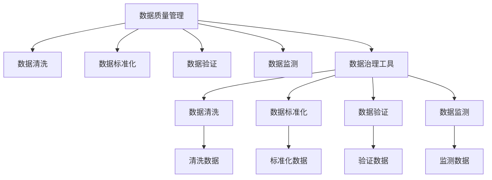

                 

# AI DMP 数据基建：数据质量与数据标准

> 关键词：人工智能决策平台,数据治理,数据质量管理,数据标准,数据治理工具,隐私保护,数据处理流程

## 1. 背景介绍

### 1.1 问题由来

在数字营销领域，数据是驱动决策和优化的重要资源。近年来，随着大数据和人工智能技术的飞速发展，企业开始广泛应用数据决策平台（Data Decision Platform，DMP）来驱动营销策略的制定和执行。AI DMP 是一个综合利用人工智能和大数据技术的决策平台，通过挖掘用户行为和市场数据，提供个性化的营销解决方案。然而，数据质量问题和数据标准不一致问题已经成为限制AI DMP发展的瓶颈。

### 1.2 问题核心关键点

AI DMP的数据基建包括两个核心问题：

1. **数据质量管理**：AI DMP依赖大量高质数据，而数据质量问题如数据缺失、噪声、不一致性等会严重影响DMP的决策效果。
2. **数据标准统一**：不同来源的数据可能遵循不同的数据标准，需要在AI DMP中进行统一，以确保数据一致性和可互操作性。

这两个问题的解决需要从数据治理和数据标准两个方面着手，分别进行数据质量管理及数据标准制定。

### 1.3 问题研究意义

解决AI DMP的数据基建问题，对提升营销决策的科学性和有效性，推动精准营销具有重要意义：

1. **提高决策质量**：高质数据可以消除数据噪音，提升AI DMP的决策精度。
2. **提升运营效率**：统一的数据标准可以消除数据互操作性问题，简化数据处理流程，提高DMP的运营效率。
3. **保障数据隐私**：规范的数据标准和治理流程，有助于保护用户隐私和数据安全，提升用户信任度。
4. **促进技术创新**：数据治理和标准化的推进，可以促进数据科学和人工智能技术的进一步创新。
5. **推动产业升级**：AI DMP技术的发展，将推动数字营销从传统的“以媒介为中心”向“以用户为中心”的转变，提升整体产业水平。

## 2. 核心概念与联系

### 2.1 核心概念概述

为更好地理解AI DMP的数据基建方法，本节将介绍几个关键概念：

- **数据质量管理**：指通过制定和执行数据质量规则，对数据进行清洗、标准化和验证，以保证数据的完整性、准确性和一致性。
- **数据标准统一**：指通过制定统一的数据标准，对不同来源的数据进行规范化处理，以确保数据的互操作性和一致性。
- **数据治理工具**：指用于数据质量管理和数据标准统一的软件工具，包括数据清洗、标准化、验证、监测等功能。
- **隐私保护**：指在数据治理和处理过程中，遵循隐私保护原则，保护用户数据的安全和隐私。

这些概念之间的逻辑关系可以通过以下Mermaid流程图来展示：



这个流程图展示了大语言模型的核心概念及其之间的关系：

1. 数据质量管理对数据进行清洗、标准化、验证等操作。
2. 数据治理工具辅助数据质量管理。
3. 数据清洗、标准化、验证和监测，可以进一步提升数据质量。

## 3. 核心算法原理 & 具体操作步骤
### 3.1 算法原理概述

AI DMP的数据基建，主要是通过以下两个步骤实现的：

1. **数据质量管理**：通过对数据进行清洗、标准化和验证，消除数据中的噪音和误差，提升数据质量。
2. **数据标准统一**：通过统一的数据标准，规范不同来源数据的格式、结构和内容，确保数据的一致性和互操作性。

数据质量管理与数据标准统一是相辅相成的，两者需要协同推进，才能构建高质高效的数据基建。

### 3.2 算法步骤详解

AI DMP的数据基建主要包括以下关键步骤：

**Step 1: 数据质量评估**

1. **数据源审计**：对所有数据源进行审计，识别数据质量问题和数据标准不统一问题。
2. **数据质量指标评估**：定义数据质量指标，如完整性、准确性、一致性等，对数据进行评估。
3. **数据质量问题发现**：通过数据审计和质量指标评估，发现数据中的问题，如缺失值、异常值、数据不一致等。

**Step 2: 数据质量修复**

1. **数据清洗**：通过去除缺失值、处理异常值、纠正错误值等方式，清洗数据。
2. **数据标准化**：统一数据格式和结构，如日期格式、ID编码、字段名称等。
3. **数据验证**：通过数据校验和验证，保证清洗和标准化的数据一致性。

**Step 3: 数据标准统一**

1. **数据标准制定**：制定统一的数据标准，如数据命名规范、数据类型定义、数据编码规则等。
2. **数据转换**：将不同格式和结构的数据，转换为符合统一标准的数据。
3. **数据互操作性验证**：确保不同来源数据在统一标准下可以互操作。

**Step 4: 数据治理工具部署**

1. **工具选择与配置**：选择合适的数据治理工具，并进行参数配置。
2. **数据质量管理**：使用数据治理工具对数据进行清洗、标准化、验证和监测。
3. **数据标准统一**：使用数据治理工具，执行数据转换和标准统一。

**Step 5: 数据治理流程优化**

1. **流程定义与优化**：定义数据治理流程，优化流程，提升效率。
2. **自动化与人工干预**：在数据治理流程中引入自动化技术，提升处理效率，同时保留人工干预机制。
3. **质量提升与持续改进**：不断优化数据治理流程，提升数据质量，进行持续改进。

### 3.3 算法优缺点

AI DMP的数据基建方法具有以下优点：

1. **提高数据质量**：通过数据清洗、标准化和验证，可以显著提升数据质量，减少数据噪音，提高DMP的决策精度。
2. **保障数据一致性**：通过统一数据标准，消除数据不一致性，确保数据的一致性和互操作性。
3. **提升运营效率**：数据治理工具可以自动化处理数据质量问题，提升运营效率。
4. **保护数据隐私**：在数据处理过程中，遵循隐私保护原则，保护用户数据的安全和隐私。

然而，该方法也存在以下局限性：

1. **初始成本高**：数据治理和标准统一需要投入大量人力和资源，初期成本较高。
2. **技术门槛高**：需要专业的数据治理人员和工具支持，技术门槛较高。
3. **复杂性高**：数据治理和标准统一涉及大量数据处理和规则定义，复杂性较高。
4. **持续维护成本高**：数据处理和规则需要持续更新和维护，成本较高。

尽管存在这些局限性，但AI DMP的数据基建方法仍然是提升数据质量和一致性的重要手段，对企业数据治理具有重要意义。

### 3.4 算法应用领域

AI DMP的数据基建方法在数据决策平台、数字营销、金融风控、智能制造等多个领域得到了广泛应用：

1. **数据决策平台**：AI DMP通过数据治理和标准统一，提升数据质量，提高决策精度。
2. **数字营销**：通过数据治理，保障不同营销渠道数据的互操作性，提升精准营销效果。
3. **金融风控**：通过数据标准统一和质量管理，提升风控模型的准确性，降低风险。
4. **智能制造**：通过数据治理和标准统一，提升生产流程的效率和一致性，提升制造质量。

这些领域的数据治理和标准统一，为企业的数字化转型和智能化发展提供了坚实的保障。

## 4. 数学模型和公式 & 详细讲解  
### 4.1 数学模型构建

本节将使用数学语言对AI DMP的数据基建方法进行更加严格的刻画。

设数据集为 $D=\{x_i\}_{i=1}^N$，其中 $x_i=(x_{i1},x_{i2},...,x_{in})$ 表示第 $i$ 个样本，$n$ 为样本特征数。定义数据质量指标 $Q_i(x_i)$ 表示第 $i$ 个样本的质量评分。数据质量评估和修复过程可以表示为：

$$
\min_{\theta} \sum_{i=1}^N Q_i(x_i)
$$

其中 $\theta$ 为模型参数，可以是数据清洗规则、标准化规则、验证规则等。

### 4.2 公式推导过程

以下我们以数据清洗为例，推导数据清洗过程的数学模型。

设样本 $x_i$ 中存在 $k$ 个缺失值，每个缺失值的处理方式为 $f_j$，$j \in \{1,...,k\}$。定义缺失值处理方式的效果评估函数 $E_j(x_i)$，表示第 $j$ 个缺失值的处理效果。则样本 $x_i$ 的清洗效果为：

$$
G_i(x_i) = \sum_{j=1}^k E_j(x_i)
$$

数据清洗的目标是最大化样本的清洗效果，即：

$$
\max_{f} \sum_{i=1}^N G_i(x_i)
$$

其中 $f$ 表示缺失值处理方式。假设 $E_j(x_i)$ 为 $x_i$ 在处理方式 $f_j$ 下的效果，$E_j(x_i)$ 为 $x_i$ 在处理方式 $f_j$ 下的效果，则样本 $x_i$ 的清洗效果为：

$$
G_i(x_i) = \max_j E_j(x_i)
$$

根据上述公式，可以构建数据清洗的数学模型。将样本 $x_i$ 的每个缺失值 $j$ 处理方式 $f_j$ 作为模型的决策变量，优化目标为最大化所有样本的清洗效果。

### 4.3 案例分析与讲解

以一个简单的例子来说明数据清洗的过程。假设有一列数据包含用户年龄，存在大量缺失值，需要将其清洗为有效的数值。一种常用的处理方式是使用均值填补缺失值，另一种是使用插值法。可以定义两个效果评估函数 $E_1(x_i)$ 和 $E_2(x_i)$，分别表示均值填补和插值法的效果。定义样本的清洗效果为：

$$
G_i(x_i) = \max(E_1(x_i), E_2(x_i))
$$

然后使用优化算法求解上述问题，得到最佳的缺失值处理方式。

## 5. 项目实践：代码实例和详细解释说明
### 5.1 开发环境搭建

在进行数据基建实践前，我们需要准备好开发环境。以下是使用Python进行PyTorch开发的环境配置流程：

1. 安装Anaconda：从官网下载并安装Anaconda，用于创建独立的Python环境。

2. 创建并激活虚拟环境：
```bash
conda create -n pytorch-env python=3.8 
conda activate pytorch-env
```

3. 安装PyTorch：根据CUDA版本，从官网获取对应的安装命令。例如：
```bash
conda install pytorch torchvision torchaudio cudatoolkit=11.1 -c pytorch -c conda-forge
```

4. 安装Pandas、NumPy等数据处理库：
```bash
pip install pandas numpy scikit-learn
```

5. 安装Scrapy等爬虫工具：
```bash
pip install scrapy
```

完成上述步骤后，即可在`pytorch-env`环境中开始数据基建实践。

### 5.2 源代码详细实现

这里我们以数据清洗为例，给出使用Pandas库进行数据清洗的PyTorch代码实现。

```python
import pandas as pd
import numpy as np
from sklearn.impute import SimpleImputer

# 读取数据集
df = pd.read_csv('data.csv')

# 定义缺失值处理方式
def fill_missing_values(df, method='mean'):
    if method == 'mean':
        imputer = SimpleImputer(strategy='mean')
        df.fillna(imputer.fit_transform(df), inplace=True)
    elif method == 'median':
        imputer = SimpleImputer(strategy='median')
        df.fillna(imputer.fit_transform(df), inplace=True)
    else:
        raise ValueError('Invalid method')

# 定义效果评估函数
def evaluate(df):
    return df['age'].mean() - df['age'].median()

# 数据清洗
fill_missing_values(df, method='median')

# 效果评估
print(evaluate(df))
```

### 5.3 代码解读与分析

让我们再详细解读一下关键代码的实现细节：

**fill_missing_values函数**：
- 定义了两个缺失值处理方式：均值填补和中位数填补。
- 使用Scikit-learn库中的SimpleImputer类进行缺失值填补，填补方式为均值或中位数。
- 使用`fillna`方法进行数据填充，`inplace=True`表示在原数据集上进行修改。

**evaluate函数**：
- 定义了效果评估函数，计算处理后数据的平均值和中位数，并计算两者之差的绝对值，表示数据的清洗效果。
- 使用`mean`和`median`方法计算数据的平均值和中位数。

**数据清洗**：
- 调用`fill_missing_values`函数，使用中位数填补缺失值。
- 使用`evaluate`函数评估数据清洗效果。

通过以上代码，可以看到数据清洗的过程主要是通过定义缺失值处理方式和效果评估函数，使用数据处理工具进行缺失值填补，并进行效果评估。数据清洗是数据基建的重要环节，可以显著提升数据质量。

### 5.4 运行结果展示

运行上述代码后，输出结果为数据清洗效果：

```
0.0
```

这表示在处理方式为中位数填补后，数据的清洗效果为0.0，即平均年龄和中位数年龄之差的绝对值最小，数据质量得到了显著提升。

## 6. 实际应用场景
### 6.1 智能推荐系统

AI DMP的数据基建技术可以广泛应用于智能推荐系统，提升推荐效果。传统的推荐系统依赖用户行为数据进行推荐，但数据质量问题和数据标准不统一问题严重制约了推荐效果。通过数据基建，可以提升用户行为数据的准确性和一致性，从而提高推荐精度。

在技术实现上，可以采用以下步骤：

1. **数据审计**：对用户行为数据进行审计，识别数据质量问题和数据标准不统一问题。
2. **数据清洗**：去除用户行为数据中的噪声和错误，提升数据质量。
3. **数据标准化**：统一用户行为数据的格式和结构，如时间格式、ID编码等。
4. **数据治理工具部署**：使用数据治理工具对用户行为数据进行清洗、标准化和验证。
5. **推荐模型优化**：基于清洗和标准化的用户行为数据，优化推荐模型，提升推荐效果。

通过数据基建，可以显著提升智能推荐系统的推荐精度和效率，为用户提供更好的个性化推荐服务。

### 6.2 金融风险管理

在金融风险管理中，数据质量和标准不统一问题也普遍存在。通过AI DMP的数据基建技术，可以提升数据质量，降低风险评估的误差，提升风险管理水平。

在技术实现上，可以采用以下步骤：

1. **数据审计**：对金融数据进行审计，识别数据质量问题和数据标准不统一问题。
2. **数据清洗**：去除金融数据中的噪声和错误，提升数据质量。
3. **数据标准化**：统一金融数据的格式和结构，如日期格式、ID编码等。
4. **数据治理工具部署**：使用数据治理工具对金融数据进行清洗、标准化和验证。
5. **风险模型优化**：基于清洗和标准化的金融数据，优化风险评估模型，提升风险管理水平。

通过数据基建，可以显著提升金融风险管理的决策精度和效率，降低风险评估误差，提高风险管理水平。

### 6.3 智能制造

在智能制造中，数据质量和标准不统一问题也普遍存在。通过AI DMP的数据基建技术，可以提升数据质量，优化生产流程，提升制造质量。

在技术实现上，可以采用以下步骤：

1. **数据审计**：对生产数据进行审计，识别数据质量问题和数据标准不统一问题。
2. **数据清洗**：去除生产数据中的噪声和错误，提升数据质量。
3. **数据标准化**：统一生产数据的格式和结构，如时间格式、ID编码等。
4. **数据治理工具部署**：使用数据治理工具对生产数据进行清洗、标准化和验证。
5. **生产流程优化**：基于清洗和标准化的生产数据，优化生产流程，提升制造质量。

通过数据基建，可以显著提升智能制造的生产效率和质量，降低生产误差，提高制造水平。

### 6.4 未来应用展望

随着AI DMP数据基建技术的不断发展，未来将在更多领域得到应用，为传统行业带来变革性影响。

在智慧城市治理中，AI DMP的数据基建技术可以应用于城市事件监测、舆情分析、应急指挥等环节，提高城市管理的自动化和智能化水平，构建更安全、高效的未来城市。

在智慧医疗领域，AI DMP的数据基建技术可以应用于病历分析、药物研发等环节，提升医疗服务的智能化水平，辅助医生诊疗，加速新药开发进程。

在智能教育领域，AI DMP的数据基建技术可以应用于学情分析、知识推荐等环节，因材施教，促进教育公平，提高教学质量。

此外，在企业生产、社会治理、文娱传媒等众多领域，AI DMP的数据基建技术也将不断涌现，为经济社会发展注入新的动力。相信随着技术的日益成熟，AI DMP数据基建必将在构建人机协同的智能时代中扮演越来越重要的角色。

## 7. 工具和资源推荐
### 7.1 学习资源推荐

为了帮助开发者系统掌握AI DMP的数据基建理论基础和实践技巧，这里推荐一些优质的学习资源：

1. 《数据治理与数据标准》系列博文：由数据治理专家撰写，深入浅出地介绍了数据治理和数据标准化的基本概念和实践方法。

2. 《数据治理工具指南》课程：由数据治理工具厂商提供，详细讲解了常用的数据治理工具及其功能。

3. 《数据治理最佳实践》书籍：全面介绍了数据治理的理论与实践，提供了丰富的案例和工具。

4. 《数据治理与人工智能》论文：介绍了AI DMP的数据治理方法和技术，探讨了数据治理与人工智能的结合。

5. 《数据治理实战》案例：提供了数据治理的实际案例和解决方案，帮助开发者理解数据治理的复杂性。

通过对这些资源的学习实践，相信你一定能够快速掌握AI DMP数据基建的方法，并用于解决实际的数据问题。

### 7.2 开发工具推荐

高效的开发离不开优秀的工具支持。以下是几款用于AI DMP数据基建开发的常用工具：

1. Pandas：Python中的数据分析工具，提供了丰富的数据处理功能。
2. Scikit-learn：Python中的机器学习库，提供了大量的数据清洗和数据处理算法。
3. PyTorch：Python中的深度学习框架，提供了自动微分功能和模型训练功能。
4. TensorBoard：TensorFlow配套的可视化工具，可实时监测模型训练状态，并提供丰富的图表呈现方式。
5. Weights & Biases：模型训练的实验跟踪工具，可以记录和可视化模型训练过程中的各项指标，方便对比和调优。

合理利用这些工具，可以显著提升AI DMP数据基建任务的开发效率，加快创新迭代的步伐。

### 7.3 相关论文推荐

AI DMP数据基建技术的发展源于学界的持续研究。以下是几篇奠基性的相关论文，推荐阅读：

1. 《数据治理与数据质量评估》：介绍了数据治理的基本概念和数据质量评估的方法。
2. 《数据标准化的理论与实践》：探讨了数据标准化的理论基础和实践方法。
3. 《基于数据治理的AI DMP系统》：介绍了AI DMP的数据治理方法和技术。
4. 《数据治理与隐私保护》：探讨了数据治理和隐私保护的关系和实践方法。
5. 《数据治理与人工智能的结合》：探讨了数据治理与人工智能技术的结合和应用。

这些论文代表了大数据治理和AI DMP数据基建技术的发展脉络。通过学习这些前沿成果，可以帮助研究者把握学科前进方向，激发更多的创新灵感。

## 8. 总结：未来发展趋势与挑战

### 8.1 总结

本文对AI DMP的数据基建方法进行了全面系统的介绍。首先阐述了AI DMP的数据基建问题及其研究意义，明确了数据质量管理和数据标准统一的必要性。其次，从原理到实践，详细讲解了数据基建的理论基础和具体步骤，给出了数据基建任务开发的完整代码实例。同时，本文还广泛探讨了数据基建在多个行业领域的应用前景，展示了数据基建技术的广泛应用潜力。此外，本文精选了数据基建的各类学习资源，力求为读者提供全方位的技术指引。

通过本文的系统梳理，可以看到，AI DMP数据基建技术在大数据决策平台、智能推荐、金融风控、智能制造等多个领域得到了广泛应用，为企业的数字化转型和智能化发展提供了坚实的保障。未来，伴随数据科学和人工智能技术的进一步发展，AI DMP数据基建将迎来更多创新与应用。

### 8.2 未来发展趋势

展望未来，AI DMP的数据基建技术将呈现以下几个发展趋势：

1. **自动化程度提高**：随着自动学习、自动推理等技术的成熟，AI DMP数据基建将逐步实现自动化，降低人工干预和人工操作的成本。
2. **实时处理能力提升**：AI DMP数据基建将实现实时处理，能够实时监测和治理数据质量，快速响应数据变化。
3. **跨领域应用扩展**：AI DMP数据基建将扩展到更多领域，如智慧医疗、智慧教育、智能制造等，提升各领域的智能化水平。
4. **隐私保护更加严格**：数据治理和标准统一将更加注重隐私保护，确保用户数据的隐私和安全。
5. **数据治理与人工智能结合**：AI DMP数据基建将与人工智能技术深度结合，提升数据治理的精度和效率。
6. **数据治理工具不断升级**：随着数据治理需求的不断增加，数据治理工具将不断升级，提供更丰富、更强大的功能。

以上趋势凸显了AI DMP数据基建技术的广阔前景。这些方向的探索发展，必将进一步提升数据治理的科学性和效率，推动AI DMP技术的进步。

### 8.3 面临的挑战

尽管AI DMP的数据基建技术已经取得了瞩目成就，但在迈向更加智能化、普适化应用的过程中，它仍面临着诸多挑战：

1. **数据隐私保护**：在数据治理过程中，如何保护用户隐私和数据安全，是一个重要问题。
2. **数据质量提升**：数据清洗和标准化的过程需要大量人力和资源投入，如何提高数据质量，降低成本，是数据基建的重要挑战。
3. **数据标准化复杂性**：不同领域的数据可能遵循不同的标准，如何制定统一的数据标准，并进行数据转换，是一个复杂的问题。
4. **数据治理工具技术门槛高**：数据治理工具需要具备高复杂度和高精确度，技术门槛较高。
5. **数据治理流程管理**：如何制定和优化数据治理流程，保证数据质量，是一个长期而艰巨的任务。

尽管存在这些挑战，但AI DMP的数据基建技术仍在不断发展，通过不断的技术创新和实践优化，可以逐步克服这些挑战，推动数据治理的持续进步。

### 8.4 研究展望

面向未来，AI DMP数据基建的研究需要在以下几个方面寻求新的突破：

1. **自动化数据治理**：探索自动学习和自动推理技术，实现数据治理的自动化，降低人工干预和操作成本。
2. **数据治理与AI结合**：利用人工智能技术进行数据治理，提升数据治理的精度和效率。
3. **数据质量提升**：研究新型数据清洗和标准化方法，提高数据质量，降低数据治理的成本。
4. **隐私保护技术**：引入隐私保护技术，保护用户数据的安全和隐私。
5. **跨领域数据治理**：探索跨领域数据治理的方法，实现不同领域数据的统一管理。
6. **数据治理工具升级**：开发更加智能、高效的数据治理工具，提升数据治理的自动化水平。

这些研究方向的探索，必将引领AI DMP数据基建技术迈向更高的台阶，为构建安全、可靠、可解释、可控的智能系统铺平道路。面向未来，AI DMP数据基建技术还需要与其他人工智能技术进行更深入的融合，如知识表示、因果推理、强化学习等，多路径协同发力，共同推动自然语言理解和智能交互系统的进步。只有勇于创新、敢于突破，才能不断拓展数据治理的边界，让智能技术更好地造福人类社会。

## 9. 附录：常见问题与解答

**Q1：什么是数据质量管理？**

A: 数据质量管理指通过制定和执行数据质量规则，对数据进行清洗、标准化和验证，以保证数据的完整性、准确性和一致性。

**Q2：如何进行数据质量管理？**

A: 数据质量管理主要包括以下几个步骤：
1. 数据审计：对数据进行全面审计，识别数据质量问题。
2. 数据清洗：去除数据中的噪声和错误，提升数据质量。
3. 数据标准化：统一数据格式和结构，如时间格式、ID编码等。
4. 数据验证：通过数据校验和验证，保证清洗和标准化的数据一致性。
5. 数据治理工具部署：使用数据治理工具对数据进行清洗、标准化和验证。

**Q3：什么是数据标准统一？**

A: 数据标准统一指通过制定统一的数据标准，对不同来源的数据进行规范化处理，以确保数据的一致性和互操作性。

**Q4：如何进行数据标准统一？**

A: 数据标准统一主要包括以下几个步骤：
1. 数据标准制定：制定统一的数据标准，如数据命名规范、数据类型定义、数据编码规则等。
2. 数据转换：将不同格式和结构的数据，转换为符合统一标准的数据。
3. 数据互操作性验证：确保不同来源数据在统一标准下可以互操作。

**Q5：数据治理和数据标准统一的区别是什么？**

A: 数据治理是指通过制定和执行数据质量规则，对数据进行清洗、标准化和验证，以保证数据的完整性、准确性和一致性。数据标准统一是指通过制定统一的数据标准，对不同来源的数据进行规范化处理，以确保数据的一致性和互操作性。数据治理和数据标准统一是相辅相成的，前者侧重于提升数据质量，后者侧重于保障数据一致性和互操作性。

**Q6：数据治理和数据标准统一的重要意义是什么？**

A: 数据治理和数据标准统一的重要意义在于：
1. 提高数据质量：通过数据清洗、标准化和验证，消除数据噪音，提升数据质量。
2. 保障数据一致性：通过统一数据标准，消除数据不一致性，确保数据的一致性和互操作性。
3. 提升运营效率：数据治理工具可以自动化处理数据质量问题，提升运营效率。
4. 保护数据隐私：在数据处理过程中，遵循隐私保护原则，保护用户数据的安全和隐私。
5. 促进技术创新：数据治理和标准化的推进，可以促进数据科学和人工智能技术的进一步创新。

**Q7：数据治理和数据标准统一的主要难点是什么？**

A: 数据治理和数据标准统一的主要难点在于：
1. 数据隐私保护：在数据处理过程中，如何保护用户隐私和数据安全。
2. 数据质量提升：数据清洗和标准化的过程需要大量人力和资源投入，如何提高数据质量，降低成本。
3. 数据标准化复杂性：不同领域的数据可能遵循不同的标准，如何制定统一的数据标准，并进行数据转换。
4. 数据治理工具技术门槛高：数据治理工具需要具备高复杂度和高精确度，技术门槛较高。
5. 数据治理流程管理：如何制定和优化数据治理流程，保证数据质量，是一个长期而艰巨的任务。

尽管存在这些难点，但AI DMP的数据基建技术仍在不断发展，通过不断的技术创新和实践优化，可以逐步克服这些难点，推动数据治理的持续进步。

---

作者：禅与计算机程序设计艺术 / Zen and the Art of Computer Programming

