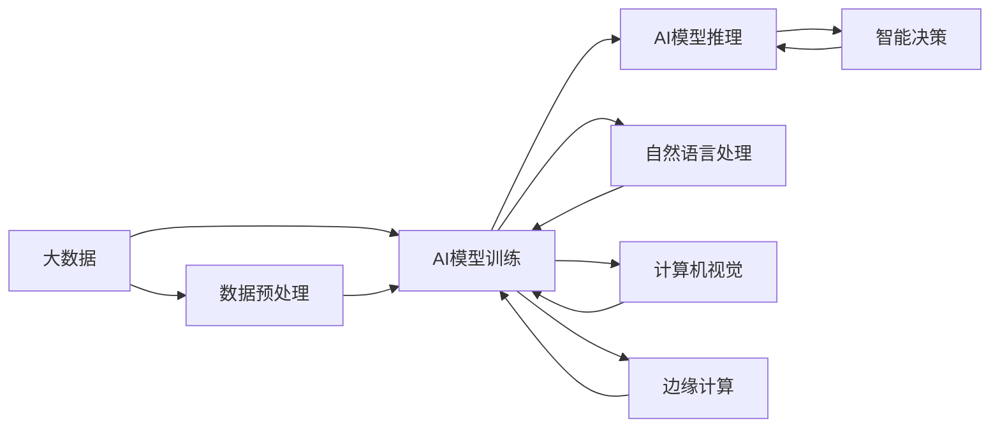

                 

## 1. 背景介绍

### 1.1 问题由来

随着人工智能技术的飞速发展，AI已不再是独立存在的技术领域，而是与众多其他技术紧密融合，形成了跨学科的强大应用力。从数据科学、机器学习到自然语言处理、计算机视觉，再到物联网、云计算，AI正与这些技术相互依存，相互促进，创造出前所未有的应用场景。

当前，AI与其他技术的融合趋势尤为明显。例如，AI在金融领域与大数据、区块链技术结合，实现了智能投顾、反欺诈检测等应用；在医疗领域与物联网、生物信息学技术结合，提升了疾病诊断和治疗的精度；在交通领域与无人驾驶技术结合，提高了道路交通安全性和效率。这些跨领域的应用实例，不仅展示了AI的强大潜力，也凸显了技术与技术之间融合的重要性。

### 1.2 问题核心关键点

AI与其他技术的融合核心关键点主要包括以下几个方面：

- **数据融合**：AI依赖于大量数据进行训练，而数据的获取往往需要依赖其他技术（如传感器技术、数据采集系统等）。数据融合技术使得不同来源的数据能够被整合利用，为AI模型提供更丰富的训练样本。
- **模型优化**：AI模型本身需要通过各种技术手段进行优化，包括架构设计、特征工程、超参数调优等。这需要结合数学模型、统计学、计算机科学等多学科知识。
- **应用部署**：将AI模型集成到实际应用系统中，需要与云计算、大数据处理、边缘计算等技术结合，以实现模型的部署、调度和监控。
- **人机交互**：AI技术的最终目标在于改善人机交互，而用户界面设计、自然语言处理、语音识别等技术是实现这一目标的重要工具。
- **伦理与安全**：AI技术在应用过程中需要考虑隐私保护、数据安全、算法公平性等问题，这需要结合法律、伦理、安全等多方面的知识。

### 1.3 问题研究意义

AI与其他技术的融合，对于推动技术进步、提升社会效率、改善人们生活质量具有重要意义：

- **效率提升**：通过技术融合，AI能够更高效地处理海量数据、自动化复杂任务，大幅提升工作效率。
- **创新驱动**：不同技术的跨界融合催生了许多新的应用场景，推动了科技创新的步伐。
- **人机协作**：AI技术的融入，使得人类与机器的协作更加紧密，能够共同应对复杂问题。
- **社会变革**：AI技术与其他技术的融合，将深刻影响各行各业，带来深刻的行业变革。

本文将重点讨论AI与大数据、计算机视觉、自然语言处理、区块链等技术的融合，探讨其核心原理、操作步骤、具体应用以及未来发展趋势与挑战。

## 2. 核心概念与联系

### 2.1 核心概念概述

- **AI**：人工智能，指的是能够通过算法和模型，实现模拟人类智能的机器系统。
- **大数据**：指数量巨大、多样化的数据集，是AI训练模型的基础。
- **计算机视觉**：使用计算机和算法来模拟人类视觉系统的功能，处理图像和视频数据。
- **自然语言处理**：使用计算机处理、理解、生成自然语言，以实现人机交互。
- **区块链**：一种分布式数据库技术，用于确保数据的安全性和透明度。

### 2.2 核心概念原理和架构的 Mermaid 流程图



该图展示了大数据与AI模型训练、推理、自然语言处理、计算机视觉、边缘计算等技术的融合关系。

- **数据预处理**：大数据通过数据清洗、特征提取等处理方式，为AI模型提供高质量输入。
- **模型训练**：AI模型在大数据上进行训练，学习特定任务的知识。
- **自然语言处理**：自然语言处理技术，使得AI模型能够理解和生成自然语言。
- **计算机视觉**：计算机视觉技术，使得AI模型能够处理和理解图像和视频数据。
- **智能决策**：基于AI模型的推理结果，做出智能决策。
- **边缘计算**：在智能决策的基础上，将计算任务部署到边缘设备，实现实时处理。

### 2.3 核心概念的联系

这些核心概念之间存在紧密的联系：

- **数据与模型**：AI模型的训练离不开大数据，大数据的质量决定了模型的性能。
- **模型与自然语言处理**：自然语言处理技术使得AI模型能够处理文本数据，提升模型理解人类语言的能力。
- **模型与计算机视觉**：计算机视觉技术使得AI模型能够处理图像和视频数据，扩展了模型的应用范围。
- **模型与边缘计算**：边缘计算技术使得AI模型能够实时处理数据，提高了系统的响应速度和效率。
- **模型与区块链**：区块链技术确保了数据的安全性和透明性，提升了AI模型的可信度。

这些技术的融合，使得AI系统具备更强大的数据处理能力和决策支持能力，能够应用于更广泛的领域。

## 3. 核心算法原理 & 具体操作步骤

### 3.1 算法原理概述

AI与其他技术的融合，本质上是一个多学科知识和技术手段的综合应用过程。其核心算法原理包括：

- **数据融合**：通过数据清洗、数据增强、数据集成等手段，将不同来源的数据进行融合，提升模型的训练效果。
- **模型优化**：使用交叉验证、梯度下降、正则化等技术手段，对模型进行优化，提升模型的泛化能力。
- **应用部署**：将训练好的模型部署到实际应用系统中，结合云计算、边缘计算等技术，实现实时处理和监控。
- **人机交互**：使用自然语言处理、语音识别等技术，提升人机交互的效率和效果。
- **伦理与安全**：通过数据匿名化、隐私保护、算法公平性等措施，确保AI应用的安全性和公平性。

### 3.2 算法步骤详解

AI与其他技术的融合主要包括以下几个步骤：

**Step 1: 数据采集与预处理**

1. **数据采集**：从不同来源收集数据，包括传感器数据、社交媒体数据、日志数据等。
2. **数据清洗**：对数据进行清洗，去除噪声和异常值。
3. **数据增强**：对数据进行增强，提升数据多样性和丰富性。
4. **数据集成**：将不同来源的数据进行集成，构建统一的数据集。

**Step 2: 模型训练与优化**

1. **模型选择**：选择适合的AI模型，如决策树、神经网络、深度学习模型等。
2. **模型训练**：使用大数据集进行模型训练，调整模型参数。
3. **模型评估**：使用交叉验证等技术手段，评估模型性能。
4. **模型优化**：通过超参数调优、正则化等技术手段，提升模型性能。

**Step 3: 模型部署与应用**

1. **模型部署**：将训练好的模型部署到实际应用系统中，如云计算平台、边缘计算设备等。
2. **模型监控**：对模型进行实时监控，及时发现和修复问题。
3. **应用集成**：将模型与业务系统集成，实现业务流程自动化。

**Step 4: 人机交互与用户体验**

1. **自然语言处理**：使用自然语言处理技术，实现人机交互。
2. **语音识别**：使用语音识别技术，提升语音交互的效果。
3. **用户界面设计**：设计用户友好的界面，提升用户体验。

**Step 5: 伦理与安全**

1. **数据保护**：确保数据隐私和安全性，防止数据泄露和滥用。
2. **算法公平**：确保算法在处理数据时公平无偏，防止算法歧视。
3. **合规性**：遵守相关法律法规，确保应用合法合规。

### 3.3 算法优缺点

AI与其他技术的融合具有以下优点：

- **数据丰富性**：大数据的引入，使得AI模型能够处理更多样化的数据，提升模型性能。
- **应用多样化**：不同技术的融合，使得AI应用范围更广，能够应用于更多领域。
- **决策支持**：结合多种技术手段，提升决策的准确性和可靠性。
- **实时性**：边缘计算等技术使得AI应用能够实现实时处理，提升效率。

同时，也存在以下缺点：

- **技术复杂性**：不同技术的融合，需要综合考虑多种技术手段，增加技术复杂性。
- **数据安全**：数据融合和共享过程中，数据安全和隐私保护成为重要问题。
- **模型解释性**：复杂的AI模型往往缺乏解释性，难以理解其决策过程。
- **计算资源消耗**：大模型和复杂算法的引入，增加了计算资源的消耗。

### 3.4 算法应用领域

AI与其他技术的融合，已经应用于多个领域，包括但不限于：

- **金融领域**：与大数据、区块链技术结合，实现智能投顾、反欺诈检测等应用。
- **医疗领域**：与物联网、生物信息学技术结合，提升疾病诊断和治疗的精度。
- **交通领域**：与无人驾驶技术结合，提高道路交通安全性和效率。
- **制造领域**：与物联网、机器人技术结合，实现智能制造。
- **农业领域**：与物联网、传感器技术结合，实现智能农业。
- **零售领域**：与物联网、自然语言处理技术结合，实现智能推荐和客户服务。
- **能源领域**：与传感器、边缘计算技术结合，实现智能能源管理。

## 4. 数学模型和公式 & 详细讲解 & 举例说明

### 4.1 数学模型构建

AI与其他技术的融合，涉及多种数学模型和技术手段。以下是几个常用的数学模型：

- **大数据模型**：
  $$
  P(x|D) = \frac{P(x) \prod_{i=1}^n P(D_i|x)}{P(D)}
  $$
  其中，$P(x|D)$表示在数据集$D$下，观察到数据$x$的概率，$P(x)$表示数据$x$的先验概率，$P(D_i|x)$表示数据$i$在数据$x$下的条件概率，$P(D)$表示数据集$D$的先验概率。

- **深度学习模型**：
  $$
  P(y|x) = \sigma(W^Tx + b)
  $$
  其中，$P(y|x)$表示在输入$x$下，输出$y$的概率，$W$表示权重矩阵，$b$表示偏置项，$\sigma$表示激活函数。

- **自然语言处理模型**：
  $$
  P(w|x) = \frac{e^{\mathbf{U} \cdot \mathbf{V}}}{\sum_{\mathbf{V}}e^{\mathbf{U} \cdot \mathbf{V}}}
  $$
  其中，$P(w|x)$表示在输入$x$下，词汇$w$的概率，$\mathbf{U}$表示词汇矩阵，$\mathbf{V}$表示上下文向量。

### 4.2 公式推导过程

**大数据模型推导**：
- 数据融合：通过对数据进行清洗、增强和集成，构建高质量的数据集。
- 模型训练：使用大数据集进行模型训练，调整模型参数。
- 模型评估：使用交叉验证等技术手段，评估模型性能。
- 模型优化：通过超参数调优、正则化等技术手段，提升模型性能。

**深度学习模型推导**：
- 数据预处理：对输入数据进行标准化和归一化，提升数据质量。
- 模型训练：使用随机梯度下降等优化算法，更新模型参数。
- 模型评估：使用准确率、召回率、F1-score等指标，评估模型性能。
- 模型优化：通过超参数调优、正则化等技术手段，提升模型性能。

**自然语言处理模型推导**：
- 数据预处理：对文本数据进行分词、去停用词等处理，提升数据质量。
- 模型训练：使用神经网络模型，学习文本表示。
- 模型评估：使用BLEU、ROUGE等指标，评估模型性能。
- 模型优化：通过调整模型结构、增加训练数据等手段，提升模型性能。

### 4.3 案例分析与讲解

**大数据融合案例**：
- **数据采集**：某电商平台收集用户购买行为数据、评价数据、物流数据等。
- **数据清洗**：清洗缺失值、异常值，提升数据质量。
- **数据增强**：使用数据增强技术，提升数据多样性。
- **数据集成**：将不同来源的数据进行集成，构建统一的数据集。
- **模型训练**：使用集成好的数据集，训练深度学习模型。
- **模型评估**：使用准确率、召回率等指标，评估模型性能。
- **模型优化**：通过超参数调优、正则化等手段，提升模型性能。
- **应用部署**：将训练好的模型部署到实际应用系统中，实现智能推荐、反欺诈检测等功能。

**深度学习应用案例**：
- **数据预处理**：对图像数据进行预处理，如裁剪、缩放、归一化等。
- **模型训练**：使用卷积神经网络（CNN）模型，训练图像分类器。
- **模型评估**：使用准确率、混淆矩阵等指标，评估模型性能。
- **模型优化**：通过调整模型结构、增加训练数据等手段，提升模型性能。
- **应用部署**：将训练好的模型部署到实际应用系统中，实现图像识别、医学影像分析等功能。

**自然语言处理应用案例**：
- **数据预处理**：对文本数据进行分词、去停用词等处理。
- **模型训练**：使用循环神经网络（RNN）模型，训练语言模型。
- **模型评估**：使用BLEU、ROUGE等指标，评估模型性能。
- **模型优化**：通过调整模型结构、增加训练数据等手段，提升模型性能。
- **应用部署**：将训练好的模型部署到实际应用系统中，实现机器翻译、情感分析等功能。

## 5. 项目实践：代码实例和详细解释说明

### 5.1 开发环境搭建

在进行AI与其他技术融合的开发实践前，需要准备好开发环境。以下是使用Python进行PyTorch开发的配置流程：

1. 安装Anaconda：从官网下载并安装Anaconda，用于创建独立的Python环境。
2. 创建并激活虚拟环境：
```bash
conda create -n pytorch-env python=3.8 
conda activate pytorch-env
```
3. 安装PyTorch：根据CUDA版本，从官网获取对应的安装命令。例如：
```bash
conda install pytorch torchvision torchaudio cudatoolkit=11.1 -c pytorch -c conda-forge
```
4. 安装Transformers库：
```bash
pip install transformers
```
5. 安装各类工具包：
```bash
pip install numpy pandas scikit-learn matplotlib tqdm jupyter notebook ipython
```
完成上述步骤后，即可在`pytorch-env`环境中开始开发实践。

### 5.2 源代码详细实现

以下是使用PyTorch进行自然语言处理和深度学习模型的代码实现：

**自然语言处理模型代码**：

```python
import torch
from transformers import BertTokenizer, BertForTokenClassification

# 初始化BERT模型和分词器
tokenizer = BertTokenizer.from_pretrained('bert-base-cased')
model = BertForTokenClassification.from_pretrained('bert-base-cased', num_labels=2)

# 定义训练函数
def train_model(model, train_dataset, validation_dataset, batch_size, num_epochs, optimizer):
    device = torch.device('cuda' if torch.cuda.is_available() else 'cpu')
    model.to(device)

    for epoch in range(num_epochs):
        model.train()
        for batch in train_dataset:
            input_ids = batch['input_ids'].to(device)
            attention_mask = batch['attention_mask'].to(device)
            labels = batch['labels'].to(device)

            outputs = model(input_ids, attention_mask=attention_mask, labels=labels)
            loss = outputs.loss
            optimizer.zero_grad()
            loss.backward()
            optimizer.step()

        model.eval()
        eval_loss = 0
        for batch in validation_dataset:
            with torch.no_grad():
                input_ids = batch['input_ids'].to(device)
                attention_mask = batch['attention_mask'].to(device)
                labels = batch['labels'].to(device)
                outputs = model(input_ids, attention_mask=attention_mask)
                eval_loss += outputs.loss

        eval_loss /= len(validation_dataset)
        print(f'Epoch {epoch+1}/{num_epochs}, Loss: {eval_loss:.3f}')

# 加载数据集
train_dataset = ...
validation_dataset = ...

# 定义优化器
optimizer = torch.optim.AdamW(model.parameters(), lr=2e-5)

# 训练模型
train_model(model, train_dataset, validation_dataset, batch_size=32, num_epochs=10, optimizer=optimizer)
```

**深度学习模型代码**：

```python
import torch
import torch.nn as nn
import torchvision.transforms as transforms
import torchvision.datasets as datasets

# 定义卷积神经网络模型
class Net(nn.Module):
    def __init__(self):
        super(Net, self).__init__()
        self.conv1 = nn.Conv2d(3, 6, 5)
        self.pool = nn.MaxPool2d(2, 2)
        self.conv2 = nn.Conv2d(6, 16, 5)
        self.fc1 = nn.Linear(16 * 5 * 5, 120)
        self.fc2 = nn.Linear(120, 84)
        self.fc3 = nn.Linear(84, 10)

    def forward(self, x):
        x = self.pool(F.relu(self.conv1(x)))
        x = self.pool(F.relu(self.conv2(x)))
        x = x.view(-1, 16 * 5 * 5)
        x = F.relu(self.fc1(x))
        x = F.relu(self.fc2(x))
        x = self.fc3(x)
        return x

# 加载数据集
train_dataset = datasets.CIFAR10(root='./data', train=True, download=True, transform=transforms.ToTensor())
test_dataset = datasets.CIFAR10(root='./data', train=False, download=True, transform=transforms.ToTensor())

# 定义优化器
optimizer = torch.optim.Adam(model.parameters(), lr=0.001)

# 训练模型
for epoch in range(10):
    running_loss = 0.0
    for i, data in enumerate(train_loader, 0):
        inputs, labels = data
        optimizer.zero_grad()
        outputs = model(inputs)
        loss = nn.functional.cross_entropy(outputs, labels)
        loss.backward()
        optimizer.step()

        running_loss += loss.item()
        if i % 100 == 99:
            print(f'Epoch {epoch+1}, Loss: {running_loss/100:.3f}')
            running_loss = 0.0

# 评估模型
correct = 0
total = 0
with torch.no_grad():
    for data in test_loader:
        inputs, labels = data
        outputs = model(inputs)
        _, predicted = torch.max(outputs.data, 1)
        total += labels.size(0)
        correct += (predicted == labels).sum().item()

print(f'Accuracy: {(100 * correct / total):.2f}%')
```

### 5.3 代码解读与分析

**自然语言处理模型代码解读**：
- **模型初始化**：使用Bert模型和分词器，定义模型和分词器。
- **训练函数**：对模型进行训练，计算损失并更新模型参数。
- **数据加载**：加载训练集和验证集，并进行预处理。
- **优化器定义**：定义AdamW优化器，设置学习率。
- **模型训练**：在训练集中进行模型训练，输出训练损失。
- **模型评估**：在验证集中进行模型评估，输出验证损失。

**深度学习模型代码解读**：
- **模型定义**：定义卷积神经网络模型。
- **数据加载**：加载CIFAR-10数据集，并进行预处理。
- **优化器定义**：定义Adam优化器，设置学习率。
- **模型训练**：在训练集中进行模型训练，输出训练损失。
- **模型评估**：在测试集中进行模型评估，输出测试准确率。

## 6. 实际应用场景

### 6.1 智能投顾

在金融领域，AI与大数据、区块链技术结合，实现了智能投顾功能。智能投顾通过分析用户的历史投资行为和市场数据，结合区块链技术确保数据透明和安全，使用深度学习模型进行预测和决策，为用户提供个性化的投资建议。

**技术实现**：
- **数据采集**：收集用户的投资行为数据、市场数据等。
- **数据预处理**：清洗和增强数据，提升数据质量。
- **模型训练**：使用深度学习模型，训练预测模型。
- **模型部署**：将模型部署到区块链系统中，实现实时预测和决策。

**效果**：
- **个性化推荐**：智能投顾能够根据用户的历史投资行为和偏好，提供个性化的投资建议。
- **风险控制**：智能投顾能够实时监测市场变化，及时调整投资策略，降低风险。
- **数据透明**：智能投顾使用区块链技术，确保数据的透明和安全，提升用户信任度。

### 6.2 医疗影像分析

在医疗领域，AI与物联网、生物信息学技术结合，提升疾病诊断和治疗的精度。AI模型使用计算机视觉技术，对医学影像进行分析，识别病变区域，结合生物信息学技术，进行基因分析，提供精准的诊断和治疗方案。

**技术实现**：
- **数据采集**：收集医学影像、基因数据等。
- **数据预处理**：对影像和基因数据进行预处理，提升数据质量。
- **模型训练**：使用深度学习模型，训练影像分析模型。
- **模型部署**：将模型部署到医疗系统中，实现实时分析和诊断。

**效果**：
- **精准诊断**：AI模型能够准确识别病变区域，提供精准的诊断结果。
- **个性化治疗**：结合基因分析，提供个性化的治疗方案，提升治疗效果。
- **实时监测**：AI模型能够实时监测病情变化，及时调整治疗方案，提升治疗效果。

### 6.3 智能制造

在制造领域，AI与物联网、机器人技术结合，实现智能制造。AI模型使用计算机视觉技术，对生产过程中的视觉数据进行分析，识别缺陷和异常，结合机器人技术，自动进行修复和调整，提升生产效率和质量。

**技术实现**：
- **数据采集**：收集生产过程中的视觉数据、机器人状态数据等。
- **数据预处理**：对视觉和机器人状态数据进行预处理，提升数据质量。
- **模型训练**：使用深度学习模型，训练视觉识别模型。
- **模型部署**：将模型部署到机器人系统中，实现实时分析和控制。

**效果**：
- **缺陷检测**：AI模型能够实时监测生产过程中的缺陷和异常，提高产品质量。
- **自动化修复**：机器人能够自动进行修复和调整，提升生产效率。
- **生产优化**：AI模型能够提供生产优化建议，提升生产效率和质量。

### 6.4 未来应用展望

未来，AI与其他技术的融合将迎来更广阔的应用前景，涵盖更多领域和场景：

- **自动驾驶**：AI与计算机视觉、传感器技术结合，实现自动驾驶技术。
- **智能家居**：AI与物联网、传感器技术结合，实现智能家居系统。
- **智能农业**：AI与物联网、传感器技术结合，实现智能农业。
- **智能客服**：AI与自然语言处理、语音识别技术结合，实现智能客服系统。
- **智能医疗**：AI与物联网、生物信息学技术结合，提升疾病诊断和治疗精度。
- **智能物流**：AI与物联网、传感器技术结合，实现智能物流系统。
- **智能制造**：AI与物联网、机器人技术结合，实现智能制造。

## 7. 工具和资源推荐

### 7.1 学习资源推荐

为了帮助开发者系统掌握AI与其他技术的融合的理论基础和实践技巧，这里推荐一些优质的学习资源：

1. **《深度学习》系列课程**：斯坦福大学开设的深度学习课程，涵盖了深度学习的基础理论和实践技巧，适合初学者和进阶者学习。
2. **《TensorFlow》官方文档**：TensorFlow的官方文档，提供了详尽的使用指南和示例代码，适合开发者学习和应用。
3. **《计算机视觉：算法与应用》**：一本经典的计算机视觉教材，涵盖了计算机视觉的基础理论和应用案例，适合深度学习开发者学习。
4. **《自然语言处理综论》**：一本系统介绍自然语言处理的书籍，涵盖了NLP的基础理论和实践技巧，适合NLP开发者学习。
5. **《大数据与机器学习实战》**：一本实用的机器学习书籍，介绍了大数据和机器学习的结合应用，适合数据科学家和机器学习工程师学习。

### 7.2 开发工具推荐

高效的开发离不开优秀的工具支持。以下是几款用于AI与其他技术融合开发的常用工具：

1. **PyTorch**：基于Python的开源深度学习框架，灵活动态的计算图，适合快速迭代研究。
2. **TensorFlow**：由Google主导开发的开源深度学习框架，生产部署方便，适合大规模工程应用。
3. **Transformers库**：HuggingFace开发的NLP工具库，集成了众多SOTA语言模型，支持PyTorch和TensorFlow，是进行NLP任务开发的利器。
4. **Weights & Biases**：模型训练的实验跟踪工具，可以记录和可视化模型训练过程中的各项指标，方便对比和调优。
5. **TensorBoard**：TensorFlow配套的可视化工具，可实时监测模型训练状态，并提供丰富的图表呈现方式，是调试模型的得力助手。
6. **Jupyter Notebook**：轻量级的交互式编程环境，适合数据科学家和机器学习工程师进行实验和协作。

### 7.3 相关论文推荐

AI与其他技术的融合源于学界的持续研究。以下是几篇奠基性的相关论文，推荐阅读：

1. **《TensorFlow：一种用于分布式深度学习的系统》**：介绍TensorFlow的架构和特性，适合深度学习开发者学习。
2. **《深度学习在医疗影像分析中的应用》**：介绍了深度学习在医疗影像分析中的应用，适合医疗领域开发者学习。
3. **《计算机视觉：从图像处理到深度学习》**：介绍了计算机视觉的基础理论和应用案例，适合计算机视觉开发者学习。
4. **《自然语言处理综论》**：一本系统介绍自然语言处理的书籍，适合NLP开发者学习。
5. **《大数据与机器学习实战》**：一本实用的机器学习书籍，介绍了大数据和机器学习的结合应用，适合数据科学家和机器学习工程师学习。

## 8. 总结：未来发展趋势与挑战

### 8.1 总结

本文对AI与其他技术的融合进行了全面系统的介绍。通过探讨数据融合、模型优化、应用部署、人机交互和伦理与安全等核心问题，揭示了AI与其他技术融合的原理和操作步骤。通过具体案例分析，展示了AI与其他技术融合在智能投顾、医疗影像分析、智能制造等多个领域的应用前景。通过精选的学习资源、开发工具和相关论文，为开发者提供了全面的技术指引。

通过本文的系统梳理，可以看到，AI与其他技术的融合，不仅提升了技术的性能和应用范围，也带来了更广阔的应用场景和更高的社会价值。随着技术的不断发展，AI与其他技术的融合将不断深入，推动更多行业实现数字化、智能化转型升级。

### 8.2 未来发展趋势

未来，AI与其他技术的融合将呈现以下几个发展趋势：

- **跨领域应用**：AI与其他技术的融合将不断深入，推动更多领域实现数字化、智能化转型升级。
- **模型优化**：AI模型将不断优化，提升模型性能和应用效果。
- **实时处理**：AI系统将实现实时处理和决策，提升系统响应速度和效率。
- **数据透明**：AI系统将实现数据透明和可解释，提升系统可信度和用户信任度。
- **伦理与安全**：AI系统将注重伦理和安全性，确保技术应用符合社会价值观和法律法规。

### 8.3 面临的挑战

尽管AI与其他技术的融合前景广阔，但也面临着诸多挑战：

- **技术复杂性**：跨领域技术的融合增加了技术复杂性，需要更多时间和资源进行技术整合。
- **数据安全**：数据融合和共享过程中，数据安全和隐私保护成为重要问题。
- **模型解释性**：复杂的AI模型往往缺乏解释性，难以理解其决策过程。
- **计算资源消耗**：大模型和复杂算法的引入，增加了计算资源的消耗。
- **伦理与安全**：AI系统需要注重伦理和安全性，确保技术应用符合社会价值观和法律法规。

### 8.4 研究展望

未来，需要在以下几个方面进行深入研究：

- **跨领域数据融合**：研究跨领域数据的融合方法，提升数据质量和模型性能。
- **模型优化与优化算法**：研究模型优化算法，提升模型性能和泛化能力。
- **实时处理与边缘计算**：研究实时处理和边缘计算技术，提升系统响应速度和效率。
- **数据透明与可解释性**：研究数据透明和可解释性技术，提升系统可信度和用户信任度。
- **伦理与安全**：研究伦理和安全性技术，确保技术应用符合社会价值观和法律法规。

这些研究方向将推动AI与其他技术的融合向更深层次发展，带来更广泛的应用场景和更高的社会价值。

## 9. 附录：常见问题与解答

**Q1：AI与其他技术的融合是否只限于深度学习模型？**

A: 不是，AI与其他技术的融合可以包括多种技术手段，如机器学习、自然语言处理、计算机视觉等，不同技术可以相互结合，实现更全面的应用效果。

**Q2：数据预处理对AI模型的影响有多大？**

A: 数据预处理对AI模型的影响非常大，数据清洗、增强、集成等技术手段，能够显著提升模型性能和应用效果。

**Q3：模型优化有哪些常见方法？**

A: 模型优化方法包括超参数调优、正则化、梯度下降等，这些技术手段能够显著提升模型性能和泛化能力。

**Q4：数据安全和隐私保护有哪些措施？**

A: 数据安全和隐私保护措施包括数据匿名化、加密、访问控制等，确保数据的安全性和隐私保护。

**Q5：如何实现数据透明和可解释性？**

A: 数据透明和可解释性技术包括特征可视化、解释性模型等，这些技术手段能够提升系统的可信度和用户信任度。

---

作者：禅与计算机程序设计艺术 / Zen and the Art of Computer Programming

