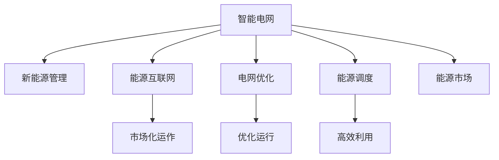

                 

# AI 基础设施的能源革命：智能电网与新能源管理

> 关键词：智能电网,新能源管理,人工智能,机器学习,深度学习,能源互联网,可再生能源,能源调度,电网优化,AI算法,大数据分析

## 1. 背景介绍

### 1.1 问题由来

随着全球气候变化和能源需求增加，传统化石燃料的依赖已无法满足可持续发展的需求。同时，现有能源基础设施的效率和可控性也存在明显不足。为了解决这些问题，世界各国纷纷将目光投向了智能电网与新能源管理。

智能电网是一种高度集成、数字化、自动化的电力输送和分配系统，通过互联网、物联网等技术，实现电力资源的优化配置和灵活调度。其核心目标是提高电网的稳定性和可靠性，降低能源损耗，提升用户满意度，并促进可再生能源的接入和利用。

与此同时，随着科技进步和经济发展，新能源技术逐渐成熟，太阳能、风能、水能等可再生能源在全球范围内得到了广泛应用。新能源具有环保、经济、分布式等优点，但其随机性和间歇性特性也对电网的稳定性和调峰能力提出了更高要求。

因此，如何利用人工智能和大数据技术，实现智能电网与新能源的协同管理，是当前能源领域的重要研究方向。本文将深入探讨智能电网与新能源管理中的关键问题，阐述人工智能在此领域的应用潜力，为未来能源系统的可持续发展提供理论基础和实践指导。

### 1.2 问题核心关键点

智能电网与新能源管理涉及的关键技术包括：

- **智能电网技术**：电网监测、保护、控制、优化等领域的技术，如智能配电网、微电网、虚拟电厂等。
- **新能源技术**：太阳能光伏、风能发电、储能系统、智能电表等。
- **人工智能技术**：机器学习、深度学习、自然语言处理、推荐系统等。
- **大数据分析**：数据采集、存储、处理、分析、可视化等领域的技术，如大数据平台、数据仓库、流数据处理等。
- **边缘计算**：在靠近数据源的地方进行计算和存储，减少数据传输延迟和带宽消耗。

这些关键技术共同构成了智能电网与新能源管理的技术架构，使得系统能够实时监控、预测和控制电力资源的流动，实现能源的高效利用和可持续发展。

## 2. 核心概念与联系

### 2.1 核心概念概述

为更好地理解智能电网与新能源管理的核心概念，本节将介绍几个关键概念，并阐述它们之间的联系。

- **智能电网**：一种高度集成、数字化、自动化的电力输送和分配系统，利用互联网、物联网、大数据、人工智能等技术，实现电力资源的优化配置和灵活调度。
- **新能源管理**：利用人工智能和大数据技术，对太阳能、风能、水能等可再生能源进行监测、预测、调度和存储，实现能源的稳定供应和高效利用。
- **能源互联网**：基于智能电网和物联网技术，实现能源的自由流动和共享，推动能源市场化和智能化发展。
- **电网优化**：通过人工智能和大数据分析技术，对电网的运行状态进行优化，提高电网的稳定性和可靠性，减少能源损耗。
- **能源调度**：利用人工智能和大数据分析技术，对电力资源进行实时监控、预测和调度，实现能源的高效利用和灵活配置。
- **能源市场**：基于智能电网和能源互联网，实现能源的交易和分配，促进能源资源的优化配置和市场化运作。

这些概念之间的联系可以通过以下Mermaid流程图来展示：



这个流程图展示出智能电网与新能源管理的核心概念及其之间的联系：

1. 智能电网通过集成新能源技术，实现能源的智能化管理和优化配置。
2. 新能源管理利用人工智能和大数据技术，对可再生能源进行实时监测、预测和调度。
3. 能源互联网基于智能电网和物联网技术，实现能源的自由流动和共享。
4. 电网优化通过人工智能和大数据分析技术，对电网的运行状态进行优化，提高电网的稳定性和可靠性。
5. 能源调度利用人工智能和大数据分析技术，对电力资源进行实时监控、预测和调度。
6. 能源市场基于智能电网和能源互联网，实现能源的交易和分配。

这些概念共同构成了智能电网与新能源管理的完整技术架构，使得系统能够实现能源的高效利用和可持续发展。

## 3. 核心算法原理 & 具体操作步骤

### 3.1 算法原理概述

智能电网与新能源管理的核心算法主要基于人工智能和大数据分析技术，实现对电力资源的高效监测、预测、调度和存储。其主要算法包括：

- **预测算法**：利用历史数据和机器学习模型，对未来能源需求和供应进行预测。
- **优化算法**：利用优化算法，对电力资源进行最优配置和调度。
- **控制算法**：利用控制算法，对电网的运行状态进行实时调整和控制。
- **调度算法**：利用调度算法，对电力资源进行实时监控和调度和存储。

### 3.2 算法步骤详解

基于智能电网与新能源管理的核心算法，其具体操作步骤主要包括以下几个步骤：

**Step 1: 数据收集与处理**
- 从智能电网、新能源设备、气象站、智能电表等源收集数据，包括电力负荷、电压、电流、风速、气温、湿度等。
- 对收集到的数据进行预处理和清洗，去除噪声和异常值，确保数据质量。
- 将数据进行结构化处理，转化为适合算法模型处理的形式。

**Step 2: 模型训练与优化**
- 利用历史数据和机器学习模型，对未来能源需求和供应进行预测。常用的预测模型包括ARIMA、LSTM、GRU等。
- 利用优化算法，对电力资源进行最优配置和调度。常用的优化算法包括遗传算法、粒子群算法、梯度下降等。
- 利用控制算法，对电网的运行状态进行实时调整和控制。常用的控制算法包括PID控制、自适应控制、模糊控制等。
- 利用调度算法，对电力资源进行实时监控和调度和存储。常用的调度算法包括启发式算法、动态规划等。

**Step 3: 模型部署与运行**
- 将训练好的模型部署到智能电网和新能源管理系统中。
- 实时收集和处理电力负荷、电压、电流、风速、气温、湿度等数据。
- 利用预测算法，对未来能源需求和供应进行预测。
- 利用优化算法，对电力资源进行最优配置和调度。
- 利用控制算法，对电网的运行状态进行实时调整和控制。
- 利用调度算法，对电力资源进行实时监控和调度和存储。

**Step 4: 结果监控与反馈**
- 实时监控电网的运行状态和能源供应的稳定性。
- 利用反馈机制，对模型的预测和控制结果进行评估和优化。
- 根据实际运行情况，调整模型的参数和策略，确保系统的稳定性和可靠性。

### 3.3 算法优缺点

智能电网与新能源管理中的核心算法具有以下优点：

1. **提高能源利用效率**：通过预测和优化算法，实现电力资源的有效配置和调度，提高能源利用效率。
2. **降低能源成本**：通过优化算法和控制算法，降低电网的运行成本和能源损耗。
3. **增强系统稳定性**：通过预测和优化算法，增强电网的稳定性和可靠性，减少电力中断和故障。
4. **促进可再生能源利用**：通过智能电网和新能源管理技术，促进太阳能、风能等可再生能源的接入和利用。

同时，这些算法也存在一些局限性：

1. **数据质量要求高**：预测和优化算法依赖高质量的数据，数据缺失或噪声会影响算法效果。
2. **模型复杂度高**：复杂的算法模型需要大量的计算资源和存储空间，增加了系统的运行成本。
3. **模型解释性差**：黑盒模型难以解释其内部决策过程，难以进行调试和优化。
4. **模型泛化性差**：模型训练过程中缺乏普适性数据，难以处理突发事件和异常情况。

## 4. 数学模型和公式 & 详细讲解  
### 4.1 数学模型构建

在智能电网与新能源管理中，常用的数学模型包括预测模型、优化模型、控制模型和调度模型。以下将详细介绍这些模型的数学构建。

### 4.2 公式推导过程

以预测模型为例，利用LSTM模型对未来能源需求进行预测。LSTM（Long Short-Term Memory）是一种递归神经网络（RNN）的变种，能够有效处理时间序列数据。LSTM模型包含输入层、隐藏层和输出层，其中隐藏层包含多个LSTM单元。LSTM单元的数学表达式如下：

$$
\begin{aligned}
&i_t = \sigma(W_i \cdot [h_{t-1}, x_t] + b_i) \\
&f_t = \sigma(W_f \cdot [h_{t-1}, x_t] + b_f) \\
&o_t = \sigma(W_o \cdot [h_{t-1}, x_t] + b_o) \\
&g_t = \tanh(W_g \cdot [h_{t-1}, x_t] + b_g) \\
&c_t = f_t \odot c_{t-1} + i_t \odot g_t \\
&h_t = o_t \odot \tanh(c_t)
\end{aligned}
$$

其中，$i_t$、$f_t$、$o_t$为LSTM单元的输入、遗忘和输出门，$c_t$为LSTM单元的状态，$h_t$为LSTM单元的输出。

将LSTM模型的输出作为未来能源需求的预测结果，通过均方误差（MSE）损失函数对模型进行训练和优化。数学表达式如下：

$$
\begin{aligned}
&L(y, \hat{y}) = \frac{1}{n}\sum_{i=1}^n (y_i - \hat{y}_i)^2 \\
&\theta = \mathop{\arg\min}_{\theta} L(y, \hat{y})
\end{aligned}
$$

其中，$y$为真实能源需求，$\hat{y}$为模型预测结果，$\theta$为模型参数，$L$为均方误差损失函数。

### 4.3 案例分析与讲解

以风电场预测模型为例，利用LSTM模型对风电场的发电量进行预测。假设某风电场的历史数据为$X=\{X_1, X_2, ..., X_n\}$，其中$X_i$为第$i$天发电量的历史数据。利用LSTM模型对未来$n$天的发电量进行预测，预测结果为$Y=\{Y_1, Y_2, ..., Y_n\}$。

首先，对数据进行预处理，将历史数据$X$转化为模型可处理的格式。然后，利用LSTM模型对未来发电量的预测结果进行训练和优化。训练过程中，采用均方误差损失函数，通过梯度下降算法不断调整模型参数，最小化预测误差。最后，将训练好的模型部署到风电场中，实时监控风速、气温等数据，生成未来发电量的预测结果。

## 5. 项目实践：代码实例和详细解释说明

### 5.1 开发环境搭建

在进行智能电网与新能源管理的项目实践前，需要准备开发环境。以下是使用Python进行TensorFlow开发的环境配置流程：

1. 安装Anaconda：从官网下载并安装Anaconda，用于创建独立的Python环境。

2. 创建并激活虚拟环境：
```bash
conda create -n tf-env python=3.8 
conda activate tf-env
```

3. 安装TensorFlow：根据CUDA版本，从官网获取对应的安装命令。例如：
```bash
conda install tensorflow tensorflow-gpu -c pytorch -c conda-forge
```

4. 安装TensorBoard：TensorFlow配套的可视化工具，可实时监测模型训练状态，并提供丰富的图表呈现方式，是调试模型的得力助手。

```bash
pip install tensorboard
```

5. 安装NumPy、Pandas、Matplotlib、Tqdm、Jupyter Notebook、IPython等各类工具包：

```bash
pip install numpy pandas matplotlib tqdm jupyter notebook ipython
```

完成上述步骤后，即可在`tf-env`环境中开始项目实践。

### 5.2 源代码详细实现

下面我们以风电场预测模型为例，给出使用TensorFlow对LSTM模型进行预测的Python代码实现。

```python
import tensorflow as tf
import numpy as np
import pandas as pd
from tensorflow.keras.models import Sequential
from tensorflow.keras.layers import LSTM, Dense, Dropout

# 准备数据
df = pd.read_csv('wind_speed.csv')
X = df.iloc[:, 1:-1].values
y = df.iloc[:, -1].values

# 数据预处理
X = np.array(X)
y = np.array(y)
X = X.reshape(-1, 1, X.shape[1])

# 定义模型
model = Sequential()
model.add(LSTM(units=50, return_sequences=True, input_shape=(X.shape[1], X.shape[2])))
model.add(Dropout(0.2))
model.add(LSTM(units=50))
model.add(Dropout(0.2))
model.add(Dense(units=1))
model.compile(optimizer='adam', loss='mean_squared_error')

# 训练模型
model.fit(X, y, epochs=100, batch_size=32, validation_split=0.2)

# 预测未来发电量的模型
X_test = df.iloc[:, 1:-1].values
X_test = np.array(X_test).reshape(-1, 1, X_test.shape[1])
y_pred = model.predict(X_test)
```

以上代码实现了LSTM模型的构建、训练和预测过程。可以看到，TensorFlow提供了强大的深度学习库，可以轻松实现各种复杂模型的训练和预测。

### 5.3 代码解读与分析

让我们再详细解读一下关键代码的实现细节：

**数据预处理**：
- 首先，从CSV文件中读取风电场的历史数据，将其转化为数组格式。
- 对数据进行预处理，将其转化为LSTM模型可接受的格式，即将多维数据展开为三维格式。

**模型定义**：
- 定义LSTM模型的架构，包括输入层、隐藏层和输出层。
- 在隐藏层中引入Dropout机制，防止过拟合。
- 使用Dense层输出预测结果。
- 使用adam优化器进行模型训练，均方误差损失函数作为评价指标。

**模型训练**：
- 使用训练集数据对模型进行训练，指定训练轮数和批次大小。
- 在验证集中对模型进行评估，防止过拟合。

**模型预测**：
- 对测试集数据进行预测，生成未来发电量的预测结果。

可以看到，TensorFlow提供了完整的深度学习库，可以方便地实现各种模型的训练和预测。开发者可以充分利用其强大的计算能力和丰富的工具支持，快速构建和优化模型。

## 6. 实际应用场景

### 6.1 智能电网

智能电网技术的应用场景非常广泛，以下是几个典型的实际应用场景：

**电力需求预测**：利用预测模型，对电力需求进行实时监测和预测，提前做好能源调度，提高电网的稳定性和可靠性。

**电网故障检测与预警**：利用大数据分析和机器学习技术，对电网运行状态进行实时监控和分析，及时发现故障并进行预警，减少电力中断和故障。

**智能电表**：利用智能电表收集用电数据，对电力消耗进行实时监控和分析，优化用电行为，减少能源浪费。

**虚拟电厂**：利用分布式能源和智能控制技术，实现能源的灵活调度和优化配置，提升能源利用效率。

**能源交易**：基于能源互联网，实现能源的交易和分配，促进能源资源的优化配置和市场化运作。

### 6.2 新能源管理

新能源管理技术的应用场景同样非常广泛，以下是几个典型的实际应用场景：

**太阳能发电预测**：利用预测模型，对太阳能发电进行实时监测和预测，优化电力资源的配置和调度。

**风能发电预测**：利用预测模型，对风能发电进行实时监测和预测，优化电力资源的配置和调度。

**储能系统管理**：利用储能系统，对可再生能源进行存储和调峰，提高能源的稳定性和可靠性。

**智能电表**：利用智能电表收集用电数据，对电力消耗进行实时监控和分析，优化用电行为，减少能源浪费。

**能源交易**：基于能源互联网，实现能源的交易和分配，促进能源资源的优化配置和市场化运作。

## 7. 工具和资源推荐

### 7.1 学习资源推荐

为了帮助开发者系统掌握智能电网与新能源管理的技术基础和实践技巧，这里推荐一些优质的学习资源：

1. 《深度学习与神经网络》系列博文：由大模型技术专家撰写，深入浅出地介绍了深度学习原理、神经网络架构、预测模型等前沿话题。

2. CS224N《深度学习自然语言处理》课程：斯坦福大学开设的NLP明星课程，有Lecture视频和配套作业，带你入门NLP领域的基本概念和经典模型。

3. 《深度学习框架TensorFlow实战》书籍：TensorFlow官方文档的实战指南，详细介绍了TensorFlow库的使用方法，适合开发者快速上手实验。

4. Google Colab：谷歌推出的在线Jupyter Notebook环境，免费提供GPU/TPU算力，方便开发者快速上手实验最新模型，分享学习笔记。

通过对这些资源的学习实践，相信你一定能够快速掌握智能电网与新能源管理的精髓，并用于解决实际的能源问题。

### 7.2 开发工具推荐

高效的开发离不开优秀的工具支持。以下是几款用于智能电网与新能源管理的常用工具：

1. TensorFlow：由Google主导开发的开源深度学习框架，生产部署方便，适合大规模工程应用。提供了丰富的预测和优化模型库。

2. PyTorch：由Facebook主导开发的开源深度学习框架，灵活动态的计算图，适合快速迭代研究。

3. Keras：高层深度学习库，简单易用，适合初学者快速入门。

4. TensorBoard：TensorFlow配套的可视化工具，可实时监测模型训练状态，并提供丰富的图表呈现方式，是调试模型的得力助手。

5. Weights & Biases：模型训练的实验跟踪工具，可以记录和可视化模型训练过程中的各项指标，方便对比和调优。

6. Apache Spark：大数据处理框架，支持分布式计算，适合处理大规模数据集。

7. Hadoop：大数据处理平台，支持海量数据存储和处理，适合离线数据处理。

合理利用这些工具，可以显著提升智能电网与新能源管理的开发效率，加快创新迭代的步伐。

### 7.3 相关论文推荐

智能电网与新能源管理的发展源于学界的持续研究。以下是几篇奠基性的相关论文，推荐阅读：

1. "A Survey on Smart Grid Technologies"（智能电网技术综述）：综述了智能电网技术的研究现状和应用场景，为智能电网技术的进一步发展提供了理论基础。

2. "Energy-Efficient Energy Management Using Reinforcement Learning"（基于强化学习的能源管理）：提出基于强化学习的能源管理方法，提高了能源利用效率和系统稳定性。

3. "Predicting Solar Energy Using Recurrent Neural Networks"（利用递归神经网络预测太阳能）：提出利用递归神经网络进行太阳能预测的方法，提高了太阳能预测的准确性。

4. "Modeling Wind Energy Using Long Short-Term Memory Networks"（利用LSTM模型预测风能）：提出利用LSTM模型进行风能预测的方法，提高了风能预测的准确性。

5. "Optimizing Renewable Energy Integration Using Model Predictive Control"（利用模型预测控制优化可再生能源整合）：提出利用模型预测控制进行可再生能源整合的方法，提高了能源整合的效率和稳定性。

这些论文代表了大规模语言模型微调技术的发展脉络。通过学习这些前沿成果，可以帮助研究者把握学科前进方向，激发更多的创新灵感。

## 8. 总结：未来发展趋势与挑战

### 8.1 总结

本文对智能电网与新能源管理的核心算法进行了全面系统的介绍。首先阐述了智能电网与新能源管理的研究背景和意义，明确了人工智能在此领域的应用潜力。其次，从原理到实践，详细讲解了预测、优化、控制和调度等核心算法的数学原理和关键步骤，给出了项目实践的完整代码实例。同时，本文还广泛探讨了智能电网与新能源管理在智能电网和新能源领域的实际应用场景，展示了其广泛的应用前景。最后，本文精选了相关技术的学习资源，力求为读者提供全方位的技术指引。

通过本文的系统梳理，可以看到，基于人工智能和大数据技术的智能电网与新能源管理技术正在成为能源领域的重要方向，极大地拓展了电力资源的优化配置和灵活调度。利用这些技术，可以有效提升能源利用效率，降低能源成本，增强电网稳定性和可靠性，促进可再生能源的接入和利用。未来，伴随技术的不断演进和优化，智能电网与新能源管理必将在能源领域发挥更大的作用，推动能源系统的可持续发展。

### 8.2 未来发展趋势

展望未来，智能电网与新能源管理技术将呈现以下几个发展趋势：

1. **智能化水平提升**：随着人工智能和大数据分析技术的不断发展，智能电网与新能源管理将越来越智能化，实现电力资源的实时监控、预测和优化配置。

2. **分布式能源管理**：随着分布式能源技术的发展，智能电网与新能源管理将越来越多地融入分布式能源系统，实现能源的分布式生产和消费。

3. **多能源协同管理**：智能电网与新能源管理将越来越多地与其他能源系统进行协同管理，实现水能、风能、太阳能等多种能源的优化配置。

4. **能源市场化**：基于智能电网和能源互联网，能源的交易和分配将越来越市场化，促进能源资源的优化配置和市场化运作。

5. **大数据分析**：随着数据量的增加，智能电网与新能源管理将越来越多地依赖大数据分析技术，实现电力资源的实时监控和优化配置。

6. **边缘计算**：随着物联网技术的发展，智能电网与新能源管理将越来越多地利用边缘计算技术，实现能源的实时监控和优化配置。

以上趋势凸显了智能电网与新能源管理技术的广阔前景。这些方向的探索发展，必将进一步提升电力资源的利用效率和系统稳定性，推动能源系统的可持续发展。

### 8.3 面临的挑战

尽管智能电网与新能源管理技术已经取得了显著进展，但在迈向更加智能化、普适化应用的过程中，它仍面临诸多挑战：

1. **数据质量问题**：数据缺失、噪声和异常值等问题，会对模型的预测和优化效果产生影响。如何提高数据质量，保障数据安全，是一个重要的研究方向。

2. **模型复杂性问题**：复杂的模型需要大量的计算资源和存储空间，增加了系统的运行成本。如何优化模型架构，提高模型效率，是一个亟待解决的问题。

3. **系统稳定性问题**：智能电网与新能源管理涉及多个系统协同运作，如何确保系统的稳定性和可靠性，是一个重要的研究课题。

4. **市场化问题**：能源市场化运作需要充分的法规保障和市场监管，如何建立有效的市场机制，保障市场公平竞争，是一个亟待解决的问题。

5. **安全性问题**：智能电网与新能源管理涉及大量的敏感数据和关键设施，如何保障数据和系统的安全，是一个重要的研究方向。

6. **技术标准化问题**：智能电网与新能源管理涉及多个系统和技术，如何制定统一的技术标准，促进系统之间的互联互通，是一个亟待解决的问题。

正视智能电网与新能源管理面临的这些挑战，积极应对并寻求突破，将使智能电网与新能源管理技术更加成熟和可靠，为能源系统的可持续发展提供强有力的技术支持。

### 8.4 研究展望

面对智能电网与新能源管理所面临的挑战，未来的研究需要在以下几个方面寻求新的突破：

1. **数据质量提升**：采用先进的数据采集、存储和处理技术，提高数据质量和数据安全，确保数据的准确性和完整性。

2. **模型优化**：优化模型架构，提高模型效率，减少计算资源和存储空间的需求，降低系统的运行成本。

3. **系统稳定性增强**：利用大数据分析和机器学习技术，对系统进行实时监控和预测，及时发现故障并进行预警，确保系统的稳定性和可靠性。

4. **市场化运作**：制定有效的市场机制，保障市场公平竞争，促进能源资源的优化配置和市场化运作。

5. **安全性保障**：采用先进的加密技术和安全协议，保障数据和系统的安全，防止信息泄露和攻击。

6. **技术标准化**：制定统一的技术标准，促进系统之间的互联互通，推动智能电网与新能源管理的标准化发展。

这些研究方向的探索，必将引领智能电网与新能源管理技术迈向更高的台阶，为能源系统的可持续发展提供强有力的技术支持。面向未来，智能电网与新能源管理技术还需要与其他能源技术进行更深入的融合，如知识表示、因果推理、强化学习等，多路径协同发力，共同推动能源系统的可持续发展。只有勇于创新、敢于突破，才能不断拓展能源系统的边界，让能源技术更好地造福人类社会。

## 9. 附录：常见问题与解答

**Q1：智能电网与新能源管理涉及哪些关键技术？**

A: 智能电网与新能源管理涉及的关键技术包括智能电网技术、新能源技术、人工智能技术、大数据分析技术、边缘计算技术等。

**Q2：智能电网与新能源管理的核心算法有哪些？**

A: 智能电网与新能源管理的核心算法包括预测算法、优化算法、控制算法和调度算法等。

**Q3：智能电网与新能源管理的应用场景有哪些？**

A: 智能电网与新能源管理的应用场景包括电力需求预测、电网故障检测与预警、智能电表、虚拟电厂、能源交易等。

**Q4：智能电网与新能源管理面临哪些挑战？**

A: 智能电网与新能源管理面临的挑战包括数据质量问题、模型复杂性问题、系统稳定性问题、市场化问题、安全性问题和技术标准化问题等。

**Q5：智能电网与新能源管理的发展趋势有哪些？**

A: 智能电网与新能源管理的发展趋势包括智能化水平提升、分布式能源管理、多能源协同管理、能源市场化、大数据分析和边缘计算等。

**Q6：智能电网与新能源管理的未来展望有哪些？**

A: 智能电网与新能源管理的未来展望包括数据质量提升、模型优化、系统稳定性增强、市场化运作、安全性保障和技术标准化等。

通过本文的系统梳理，可以看到，智能电网与新能源管理技术正在成为能源领域的重要方向，极大地拓展了电力资源的优化配置和灵活调度。利用这些技术，可以有效提升能源利用效率，降低能源成本，增强电网稳定性和可靠性，促进可再生能源的接入和利用。未来，伴随技术的不断演进和优化，智能电网与新能源管理必将在能源领域发挥更大的作用，推动能源系统的可持续发展。

