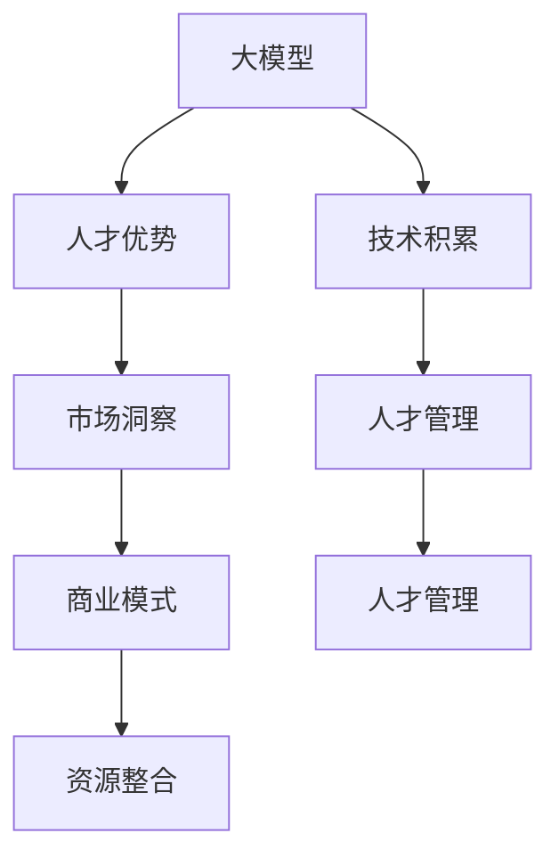

                 

## 1. 背景介绍

在当今这个快速发展的科技时代，人工智能(AI)大模型技术已经成为了各行各业热议的话题。无论是金融、医疗、教育，还是制造业和农业，AI大模型正逐渐渗透到各个领域，为社会带来了前所未有的变革。然而，如何利用这一前沿技术，实现商业价值的最大化，成为了许多AI创业公司的核心课题。

### 1.1 问题由来

AI大模型技术本身所具备的强大计算能力和广泛适用性，使得其在许多场景中能够发挥出巨大的潜力。例如，自然语言处理(NLP)中的BERT、GPT等大模型已经在机器翻译、情感分析、问答系统等任务中取得了优异的表现。这些大模型不仅在学术界引起了广泛关注，也吸引了大量创业公司的关注。

然而，AI大模型技术的发展并非一帆风顺。尽管其技术实力强大，但实际应用过程中仍面临诸多挑战，包括计算资源的高需求、算法模型的复杂性、以及数据隐私和安全等问题。此外，如何将AI大模型的优势转化为商业价值，如何管理好核心技术人才，如何制定合理的商业模式，都是创业公司需要深思熟虑的问题。

### 1.2 问题核心关键点

在AI大模型创业的过程中，人才优势的利用至关重要。核心关键点包括：

- **技术积累**：拥有深厚的AI技术储备和经验，能够快速迭代优化模型，提高产品竞争力。
- **人才管理**：构建强大的团队，通过合理的管理机制和激励措施，吸引和留住优秀人才。
- **市场洞察**：深入了解市场需求，准确把握商业机会，制定符合市场趋势的产品战略。
- **商业模式**：创新商业模式，降低成本，提升盈利能力，实现可持续发展。
- **资源整合**：合理利用内外部资源，提高效率，降低风险。

这些关键点不仅能够帮助创业公司在激烈的市场竞争中脱颖而出，还能够推动AI技术的广泛应用，加速产业的数字化转型。

## 2. 核心概念与联系

### 2.1 核心概念概述

在AI大模型创业的过程中，涉及多个核心概念：

- **大模型**：指基于大规模数据训练而成的深度学习模型，如BERT、GPT等，具备强大的通用语言能力和推理能力。
- **创业公司**：指专注于AI大模型技术，将其应用于特定行业或领域的创新型企业。
- **人才优势**：指创业公司拥有的优秀技术人才和创新能力，是实现商业成功的关键。
- **商业模式**：指公司实现收入和利润的策略，包括产品定价、市场推广、销售渠道等。
- **技术积累**：指公司在技术研发、算法优化、数据处理等方面的积累。

这些概念之间的联系可以通过以下Mermaid流程图来展示：



这个流程图展示了大模型创业的各个环节和关键要素之间的联系：

1. 大模型的优势和潜力是大模型创业的基础。
2. 技术积累和人才优势是实现技术突破和商业成功的核心。
3. 市场洞察帮助公司准确把握商业机会，制定合理的产品战略。
4. 人才管理确保团队的稳定性和高效性。
5. 商业模式决定了公司的盈利方式和可持续发展。
6. 资源整合提升效率，降低风险。

这些要素相互支撑，共同构成大模型创业的全局框架。

## 3. 核心算法原理 & 具体操作步骤

### 3.1 算法原理概述

AI大模型创业的核心算法原理主要基于深度学习和大数据技术，通过大量标注数据对模型进行预训练，然后利用微调技术针对特定任务进行优化。

形式化地，假设大模型为 $M$，预训练数据为 $D$，下游任务为 $T$，微调过程的目标是找到新的模型参数 $\hat{\theta}$，使得模型在任务 $T$ 上表现最佳：

$$
\hat{\theta} = \mathop{\arg\min}_{\theta} \mathcal{L}(M_{\theta}, T)
$$

其中 $\mathcal{L}$ 为任务 $T$ 的损失函数，用于衡量模型预测与真实标签之间的差异。常见的损失函数包括交叉熵、均方误差等。

### 3.2 算法步骤详解

AI大模型创业的算法步骤主要包括以下几个关键环节：

**Step 1: 数据准备**
- 收集和标注任务 $T$ 的数据集 $D_T$。
- 选择合适的预训练大模型 $M_{\theta}$，如BERT、GPT等。
- 对数据集进行清洗、划分、预处理，确保数据质量。

**Step 2: 模型微调**
- 在预训练模型 $M_{\theta}$ 的基础上，添加任务适配层，如分类器或解码器。
- 选择合适的损失函数，如交叉熵、均方误差等，定义任务 $T$ 的损失函数 $\mathcal{L}_T$。
- 设置微调超参数，如学习率、批大小、迭代轮数等。
- 执行微调算法，不断更新模型参数，直至收敛。

**Step 3: 模型评估**
- 在验证集上评估微调后的模型性能。
- 调整超参数，继续迭代微调。
- 最终在测试集上评估模型性能，确定最终模型。

**Step 4: 商业化部署**
- 将模型封装为API或SDK，便于集成和部署。
- 实现产品化和市场推广，吸引用户。
- 定期更新模型，保持性能和竞争力。

### 3.3 算法优缺点

AI大模型创业的算法具有以下优点：

- **精度高**：利用深度学习和大数据技术，能够实现高精度的模型预测。
- **泛化能力强**：通过大量数据预训练，模型具备较强的泛化能力，能够在多种场景下表现出色。
- **可扩展性好**：大模型结构灵活，易于扩展和优化。

同时，该算法也存在以下缺点：

- **计算资源需求高**：预训练和微调需要大量的计算资源，对硬件要求较高。
- **数据隐私问题**：大量数据的使用可能涉及数据隐私和安全问题，需要严格的监管措施。
- **模型复杂性**：大模型结构复杂，理解和调试难度较大。

尽管如此，通过合理管理和优化，这些缺点可以逐步克服，为大模型创业带来更多成功可能性。

### 3.4 算法应用领域

AI大模型创业的算法在多个领域都有广泛的应用：

- **金融科技**：利用大模型进行风险评估、欺诈检测、信用评分等。
- **医疗健康**：用于疾病诊断、个性化治疗、药物研发等。
- **智能制造**：在工业控制、质量检测、设备维护等方面发挥作用。
- **教育培训**：用于个性化学习、智能评测、知识图谱构建等。
- **智慧城市**：在交通管理、环境监测、公共安全等方面提供支持。

这些应用领域充分展示了AI大模型技术的强大潜力和广泛应用前景。

## 4. 数学模型和公式 & 详细讲解 & 举例说明

### 4.1 数学模型构建

AI大模型创业的数学模型构建主要基于深度学习，以神经网络为核心。以下是一个典型的NLP任务（文本分类）的数学模型构建过程：

假设模型为 $M_{\theta}$，输入为 $x$，输出为 $y$。使用交叉熵损失函数，数学模型构建如下：

$$
\mathcal{L}(\theta) = -\frac{1}{N}\sum_{i=1}^N y_i \log M_{\theta}(x_i) + (1-y_i) \log (1-M_{\theta}(x_i))
$$

其中 $N$ 为样本数量，$y_i$ 为第 $i$ 个样本的标签，$M_{\theta}(x_i)$ 为模型对样本 $x_i$ 的预测输出。

### 4.2 公式推导过程

下面以BERT模型为例，介绍其微调过程的公式推导。

BERT模型的输入为 $x = (x_1, x_2, ..., x_n)$，其中 $x_i$ 为输入序列的每个词。输出为 $y = (y_1, y_2, ..., y_n)$，其中 $y_i$ 为第 $i$ 个词的标签。

假设输出层有 $C$ 个分类器，则输出层的矩阵表示为 $W^0 \in \mathbb{R}^{C \times D}$，其中 $D$ 为隐藏层维度。

BERT模型的微调过程如下：

1. 输入序列 $x$ 经过BERT编码器，输出中间隐藏表示 $H$。
2. 隐藏表示 $H$ 与输出层矩阵 $W^0$ 相乘，得到预测输出 $y = W^0H$。
3. 定义损失函数 $\mathcal{L}$：
   $$
   \mathcal{L} = -\frac{1}{N}\sum_{i=1}^N y_i \log y_i
   $$
4. 使用梯度下降算法，更新参数 $\theta$：
   $$
   \theta \leftarrow \theta - \eta \nabla_{\theta}\mathcal{L}
   $$
   其中 $\eta$ 为学习率，$\nabla_{\theta}\mathcal{L}$ 为损失函数对模型参数的梯度。

### 4.3 案例分析与讲解

以下是一个BERT模型进行文本分类任务的微调案例：

1. **数据准备**：
   - 收集和标注数据集 $D_T$，包括样本 $(x_i, y_i)$，其中 $x_i$ 为文本，$y_i$ 为分类标签。
   - 选择合适的预训练模型，如BERT-base。
   - 对数据集进行预处理，如分词、截断、填充等。

2. **模型微调**：
   - 添加分类器，如softmax层，定义输出层矩阵 $W^0$。
   - 设置交叉熵损失函数，定义损失函数 $\mathcal{L}$。
   - 设置学习率为 $2e-5$，批大小为 $32$，迭代轮数为 $10$。
   - 执行微调算法，更新模型参数。

3. **模型评估**：
   - 在验证集上评估模型性能，使用准确率、F1-score等指标。
   - 调整学习率、批大小等超参数，继续迭代微调。
   - 最终在测试集上评估模型性能，确定最终模型。

## 5. 项目实践：代码实例和详细解释说明

### 5.1 开发环境搭建

在进行AI大模型创业项目实践前，我们需要准备好开发环境。以下是使用Python进行PyTorch开发的环境配置流程：

1. 安装Anaconda：从官网下载并安装Anaconda，用于创建独立的Python环境。

2. 创建并激活虚拟环境：
```bash
conda create -n pytorch-env python=3.8 
conda activate pytorch-env
```

3. 安装PyTorch：根据CUDA版本，从官网获取对应的安装命令。例如：
```bash
conda install pytorch torchvision torchaudio cudatoolkit=11.1 -c pytorch -c conda-forge
```

4. 安装Transformers库：
```bash
pip install transformers
```

5. 安装各类工具包：
```bash
pip install numpy pandas scikit-learn matplotlib tqdm jupyter notebook ipython
```

完成上述步骤后，即可在`pytorch-env`环境中开始项目实践。

### 5.2 源代码详细实现

这里以一个简单的NLP任务（情感分析）为例，给出使用Transformers库对BERT模型进行微调的PyTorch代码实现。

```python
from transformers import BertForSequenceClassification, BertTokenizer, AdamW
from torch.utils.data import DataLoader
from torch.nn import CrossEntropyLoss
import torch

# 1. 数据准备
tokenizer = BertTokenizer.from_pretrained('bert-base-cased')
train_data = ['This product is amazing.', 'This product is terrible.']
train_labels = [1, 0]  # 1: positive, 0: negative

# 2. 模型微调
model = BertForSequenceClassification.from_pretrained('bert-base-cased', num_labels=2)
optimizer = AdamW(model.parameters(), lr=2e-5)

# 将文本转换为token ids和注意力掩码
def tokenize(text):
    return tokenizer.encode_plus(text, return_tensors='pt', max_length=128, padding='max_length', truncation=True)

def collate_fn(batch):
    input_ids, attention_masks, labels = batch
    return {'input_ids': input_ids, 'attention_mask': attention_masks, 'labels': labels}

# 3. 模型训练
train_dataset = torch.utils.data.TensorDataset(
    *map(tokenize, train_data),
    *map(lambda x: torch.tensor(x, dtype=torch.long), train_labels)
)
train_loader = DataLoader(train_dataset, batch_size=16, collate_fn=collate_fn)

model.to('cuda')
for epoch in range(10):
    model.train()
    total_loss = 0
    for batch in train_loader:
        input_ids = batch['input_ids'].to('cuda')
        attention_masks = batch['attention_mask'].to('cuda')
        labels = batch['labels'].to('cuda')
        optimizer.zero_grad()
        outputs = model(input_ids, attention_mask=attention_masks, labels=labels)
        loss = outputs.loss
        total_loss += loss.item()
        loss.backward()
        optimizer.step()
    print(f'Epoch {epoch+1}, loss: {total_loss/len(train_loader)}')

# 4. 模型评估
model.eval()
with torch.no_grad():
    total_correct = 0
    total_samples = 0
    for batch in test_loader:
        input_ids = batch['input_ids'].to('cuda')
        attention_masks = batch['attention_mask'].to('cuda')
        labels = batch['labels'].to('cuda')
        outputs = model(input_ids, attention_mask=attention_masks)
        predictions = torch.argmax(outputs.logits, dim=1)
        total_correct += (predictions == labels).sum().item()
        total_samples += labels.shape[0]
    print(f'Accuracy: {total_correct/total_samples}')
```

### 5.3 代码解读与分析

让我们再详细解读一下关键代码的实现细节：

**数据准备**：
- `tokenizer`：使用预训练的BERT tokenizer。
- `train_data` 和 `train_labels`：准备训练集文本和标签。

**模型微调**：
- `model`：从预训练的BERT-base模型加载分类器。
- `optimizer`：使用AdamW优化器，设置学习率为 $2e-5$。

**模型训练**：
- `train_loader`：使用`DataLoader`将数据集批处理，并使用`collate_fn`处理批量数据。
- `model.train()`：设置模型为训练模式。
- `total_loss`：记录每个epoch的平均损失。
- `optimizer.zero_grad()`：在每个batch开始前清空梯度。
- `model(input_ids, attention_mask=attention_masks, labels=labels)`：前向传播计算损失。
- `loss.backward()`：反向传播计算梯度。
- `optimizer.step()`：更新模型参数。

**模型评估**：
- `model.eval()`：设置模型为评估模式。
- `total_correct` 和 `total_samples`：记录评估结果的正确率和总样本数。
- `torch.argmax(outputs.logits, dim=1)`：输出概率最大化的预测结果。

可以看到，PyTorch和Transformers库使得BERT模型微调的代码实现变得简洁高效。开发者可以将更多精力放在数据处理、模型改进等高层逻辑上，而不必过多关注底层的实现细节。

当然，工业级的系统实现还需考虑更多因素，如模型的保存和部署、超参数的自动搜索、更灵活的任务适配层等。但核心的微调范式基本与此类似。

## 6. 实际应用场景

### 6.1 智能客服系统

基于AI大模型的智能客服系统可以广泛应用于智能客服系统的构建。传统客服往往需要配备大量人力，高峰期响应缓慢，且一致性和专业性难以保证。而使用AI大模型的智能客服系统，可以7x24小时不间断服务，快速响应客户咨询，用自然流畅的语言解答各类常见问题。

在技术实现上，可以收集企业内部的历史客服对话记录，将问题和最佳答复构建成监督数据，在此基础上对预训练大模型进行微调。微调后的智能客服系统能够自动理解用户意图，匹配最合适的答案模板进行回复。对于客户提出的新问题，还可以接入检索系统实时搜索相关内容，动态组织生成回答。如此构建的智能客服系统，能大幅提升客户咨询体验和问题解决效率。

### 6.2 金融舆情监测

金融机构需要实时监测市场舆论动向，以便及时应对负面信息传播，规避金融风险。传统的人工监测方式成本高、效率低，难以应对网络时代海量信息爆发的挑战。基于AI大模型的文本分类和情感分析技术，为金融舆情监测提供了新的解决方案。

具体而言，可以收集金融领域相关的新闻、报道、评论等文本数据，并对其进行主题标注和情感标注。在此基础上对预训练大模型进行微调，使其能够自动判断文本属于何种主题，情感倾向是正面、中性还是负面。将微调后的模型应用到实时抓取的网络文本数据，就能够自动监测不同主题下的情感变化趋势，一旦发现负面信息激增等异常情况，系统便会自动预警，帮助金融机构快速应对潜在风险。

### 6.3 个性化推荐系统

当前的推荐系统往往只依赖用户的历史行为数据进行物品推荐，无法深入理解用户的真实兴趣偏好。基于AI大模型的个性化推荐系统可以更好地挖掘用户行为背后的语义信息，从而提供更精准、多样的推荐内容。

在实践中，可以收集用户浏览、点击、评论、分享等行为数据，提取和用户交互的物品标题、描述、标签等文本内容。将文本内容作为模型输入，用户的后续行为（如是否点击、购买等）作为监督信号，在此基础上微调预训练大模型。微调后的模型能够从文本内容中准确把握用户的兴趣点。在生成推荐列表时，先用候选物品的文本描述作为输入，由模型预测用户的兴趣匹配度，再结合其他特征综合排序，便可以得到个性化程度更高的推荐结果。

### 6.4 未来应用展望

随着AI大模型和微调方法的不断发展，基于微调范式将在更多领域得到应用，为传统行业带来变革性影响。

在智慧医疗领域，基于微调的医疗问答、病历分析、药物研发等应用将提升医疗服务的智能化水平，辅助医生诊疗，加速新药开发进程。

在智能教育领域，微调技术可应用于作业批改、学情分析、知识推荐等方面，因材施教，促进教育公平，提高教学质量。

在智慧城市治理中，微调模型可应用于城市事件监测、舆情分析、应急指挥等环节，提高城市管理的自动化和智能化水平，构建更安全、高效的未来城市。

此外，在企业生产、社会治理、文娱传媒等众多领域，基于大模型微调的人工智能应用也将不断涌现，为NLP技术带来了全新的突破。随着预训练模型和微调方法的不断进步，相信NLP技术将在更广阔的应用领域大放异彩。

## 7. 工具和资源推荐

### 7.1 学习资源推荐

为了帮助开发者系统掌握AI大模型微调的理论基础和实践技巧，这里推荐一些优质的学习资源：

1. 《Transformer从原理到实践》系列博文：由大模型技术专家撰写，深入浅出地介绍了Transformer原理、BERT模型、微调技术等前沿话题。

2. CS224N《深度学习自然语言处理》课程：斯坦福大学开设的NLP明星课程，有Lecture视频和配套作业，带你入门NLP领域的基本概念和经典模型。

3. 《Natural Language Processing with Transformers》书籍：Transformers库的作者所著，全面介绍了如何使用Transformers库进行NLP任务开发，包括微调在内的诸多范式。

4. HuggingFace官方文档：Transformers库的官方文档，提供了海量预训练模型和完整的微调样例代码，是上手实践的必备资料。

5. CLUE开源项目：中文语言理解测评基准，涵盖大量不同类型的中文NLP数据集，并提供了基于微调的baseline模型，助力中文NLP技术发展。

通过对这些资源的学习实践，相信你一定能够快速掌握AI大模型微调的精髓，并用于解决实际的NLP问题。

### 7.2 开发工具推荐

高效的开发离不开优秀的工具支持。以下是几款用于AI大模型微调开发的常用工具：

1. PyTorch：基于Python的开源深度学习框架，灵活动态的计算图，适合快速迭代研究。大部分预训练语言模型都有PyTorch版本的实现。

2. TensorFlow：由Google主导开发的开源深度学习框架，生产部署方便，适合大规模工程应用。同样有丰富的预训练语言模型资源。

3. Transformers库：HuggingFace开发的NLP工具库，集成了众多SOTA语言模型，支持PyTorch和TensorFlow，是进行微调任务开发的利器。

4. Weights & Biases：模型训练的实验跟踪工具，可以记录和可视化模型训练过程中的各项指标，方便对比和调优。与主流深度学习框架无缝集成。

5. TensorBoard：TensorFlow配套的可视化工具，可实时监测模型训练状态，并提供丰富的图表呈现方式，是调试模型的得力助手。

6. Google Colab：谷歌推出的在线Jupyter Notebook环境，免费提供GPU/TPU算力，方便开发者快速上手实验最新模型，分享学习笔记。

合理利用这些工具，可以显著提升AI大模型微调任务的开发效率，加快创新迭代的步伐。

### 7.3 相关论文推荐

AI大模型和微调技术的发展源于学界的持续研究。以下是几篇奠基性的相关论文，推荐阅读：

1. Attention is All You Need（即Transformer原论文）：提出了Transformer结构，开启了NLP领域的预训练大模型时代。

2. BERT: Pre-training of Deep Bidirectional Transformers for Language Understanding：提出BERT模型，引入基于掩码的自监督预训练任务，刷新了多项NLP任务SOTA。

3. Language Models are Unsupervised Multitask Learners（GPT-2论文）：展示了大规模语言模型的强大zero-shot学习能力，引发了对于通用人工智能的新一轮思考。

4. Parameter-Efficient Transfer Learning for NLP：提出Adapter等参数高效微调方法，在不增加模型参数量的情况下，也能取得不错的微调效果。

5. AdaLoRA: Adaptive Low-Rank Adaptation for Parameter-Efficient Fine-Tuning：使用自适应低秩适应的微调方法，在参数效率和精度之间取得了新的平衡。

这些论文代表了大模型微调技术的发展脉络。通过学习这些前沿成果，可以帮助研究者把握学科前进方向，激发更多的创新灵感。

## 8. 总结：未来发展趋势与挑战

### 8.1 总结

本文对AI大模型创业中的核心算法原理和具体操作步骤进行了全面系统的介绍。首先阐述了AI大模型创业的背景和意义，明确了微调在拓展预训练模型应用、提升下游任务性能方面的独特价值。其次，从原理到实践，详细讲解了AI大模型的微调方法，给出了完整的代码实例，并应用于实际应用场景。

通过本文的系统梳理，可以看到，AI大模型微调技术正在成为NLP领域的重要范式，极大地拓展了预训练语言模型的应用边界，催生了更多的落地场景。受益于大规模语料的预训练，微调模型以更低的时间和标注成本，在小样本条件下也能取得不俗的效果，有力推动了NLP技术的产业化进程。未来，伴随预训练语言模型和微调方法的不断进步，相信NLP技术将在更广阔的应用领域大放异彩，深刻影响人类的生产生活方式。

### 8.2 未来发展趋势

展望未来，AI大模型微调技术将呈现以下几个发展趋势：

1. **模型规模持续增大**：随着算力成本的下降和数据规模的扩张，预训练大模型的参数量还将持续增长。超大规模语言模型蕴含的丰富语言知识，有望支撑更加复杂多变的下游任务微调。

2. **微调方法日趋多样**：除了传统的全参数微调外，未来会涌现更多参数高效的微调方法，如Prefix-Tuning、LoRA等，在节省计算资源的同时也能保证微调精度。

3. **持续学习成为常态**：随着数据分布的不断变化，微调模型也需要持续学习新知识以保持性能。如何在不遗忘原有知识的同时，高效吸收新样本信息，将成为重要的研究课题。

4. **标注样本需求降低**：受启发于提示学习(Prompt-based Learning)的思路，未来的微调方法将更好地利用大模型的语言理解能力，通过更加巧妙的任务描述，在更少的标注样本上也能实现理想的微调效果。

5. **多模态微调崛起**：当前的微调主要聚焦于纯文本数据，未来会进一步拓展到图像、视频、语音等多模态数据微调。多模态信息的融合，将显著提升语言模型对现实世界的理解和建模能力。

6. **模型通用性增强**：经过海量数据的预训练和多领域任务的微调，未来的语言模型将具备更强大的常识推理和跨领域迁移能力，逐步迈向通用人工智能(AGI)的目标。

以上趋势凸显了AI大模型微调技术的广阔前景。这些方向的探索发展，必将进一步提升AI模型的性能和应用范围，为构建人机协同的智能系统铺平道路。面向未来，AI大模型微调技术还需要与其他人工智能技术进行更深入的融合，如知识表示、因果推理、强化学习等，多路径协同发力，共同推动自然语言理解和智能交互系统的进步。只有勇于创新、敢于突破，才能不断拓展语言模型的边界，让智能技术更好地造福人类社会。

### 8.3 面临的挑战

尽管AI大模型微调技术已经取得了瞩目成就，但在迈向更加智能化、普适化应用的过程中，它仍面临着诸多挑战：

1. **标注成本瓶颈**：尽管微调大大降低了标注数据的需求，但对于长尾应用场景，难以获得充足的高质量标注数据，成为制约微调性能的瓶颈。如何进一步降低微调对标注样本的依赖，将是一大难题。

2. **模型鲁棒性不足**：当前微调模型面对域外数据时，泛化性能往往大打折扣。对于测试样本的微小扰动，微调模型的预测也容易发生波动。如何提高微调模型的鲁棒性，避免灾难性遗忘，还需要更多理论和实践的积累。

3. **推理效率有待提高**：大规模语言模型虽然精度高，但在实际部署时往往面临推理速度慢、内存占用大等效率问题。如何在保证性能的同时，简化模型结构，提升推理速度，优化资源占用，将是重要的优化方向。

4. **可解释性亟需加强**：当前微调模型更像是"黑盒"系统，难以解释其内部工作机制和决策逻辑。对于医疗、金融等高风险应用，算法的可解释性和可审计性尤为重要。如何赋予微调模型更强的可解释性，将是亟待攻克的难题。

5. **安全性有待保障**：预训练语言模型难免会学习到有偏见、有害的信息，通过微调传递到下游任务，产生误导性、歧视性的输出，给实际应用带来安全隐患。如何从数据和算法层面消除模型偏见，避免恶意用途，确保输出的安全性，也将是重要的研究课题。

6. **知识整合能力不足**：现有的微调模型往往局限于任务内数据，难以灵活吸收和运用更广泛的先验知识。如何让微调过程更好地与外部知识库、规则库等专家知识结合，形成更加全面、准确的信息整合能力，还有很大的想象空间。

正视AI大模型微调面临的这些挑战，积极应对并寻求突破，将是大模型微调走向成熟的必由之路。相信随着学界和产业界的共同努力，这些挑战终将一一被克服，AI大模型微调必将在构建安全、可靠、可解释、可控的智能系统铺平道路。

### 8.4 研究展望

面对AI大模型微调所面临的种种挑战，未来的研究需要在以下几个方面寻求新的突破：

1. **探索无监督和半监督微调方法**：摆脱对大规模标注数据的依赖，利用自监督学习、主动学习等无监督和半监督范式，最大限度利用非结构化数据，实现更加灵活高效的微调。

2. **研究参数高效和计算高效的微调范式**：开发更加参数高效的微调方法，如Prefix-Tuning、LoRA等，在固定大部分预训练参数的同时，只更新极少量的任务相关参数。同时优化微调模型的计算图，减少前向传播和反向传播的资源消耗，实现更加轻量级、实时性的部署。

3. **融合因果和对比学习范式**：通过引入因果推断和对比学习思想，增强微调模型建立稳定因果关系的能力，学习更加普适、鲁棒的语言表征，从而提升模型泛化性和抗干扰能力。

4. **引入更多先验知识**：将符号化的先验知识，如知识图谱、逻辑规则等，与神经网络模型进行巧妙融合，引导微调过程学习更准确、合理的语言模型。同时加强不同模态数据的整合，实现视觉、语音等多模态信息与文本信息的协同建模。

5. **结合因果分析和博弈论工具**：将因果分析方法引入微调模型，识别出模型决策的关键特征，增强输出解释的因果性和逻辑性。借助博弈论工具刻画人机交互过程，主动探索并规避模型的脆弱点，提高系统稳定性。

6. **纳入伦理道德约束**：在模型训练目标中引入伦理导向的评估指标，过滤和惩罚有偏见、有害的输出倾向。同时加强人工干预和审核，建立模型行为的监管机制，确保输出符合人类价值观和伦理道德。

这些研究方向的探索，必将引领AI大模型微调技术迈向更高的台阶，为构建安全、可靠、可解释、可控的智能系统铺平道路。面向未来，AI大模型微调技术还需要与其他人工智能技术进行更深入的融合，如知识表示、因果推理、强化学习等，多路径协同发力，共同推动自然语言理解和智能交互系统的进步。只有勇于创新、敢于突破，才能不断拓展语言模型的边界，让智能技术更好地造福人类社会。

## 9. 附录：常见问题与解答

**Q1：AI大模型创业是否需要投入大量的资金？**

A: AI大模型创业确实需要投入大量的资金，特别是在模型训练、数据标注和市场推广方面。然而，通过合理利用开源社区资源和云计算平台，可以有效降低成本。例如，使用谷歌云、阿里云等云计算平台，可以按需付费，显著降低硬件成本。同时，开源社区提供了大量的预训练模型和工具，可以帮助创业者快速构建和迭代模型。

**Q2：AI大模型创业是否需要高水平的人才？**

A: 是的，AI大模型创业需要高水平的人才团队。尤其是在模型开发、数据处理、算法优化等方面，拥有深厚技术背景和丰富实践经验的人才至关重要。此外，创业者还需要具备市场洞察能力和商业管理能力，能够将技术优势转化为商业价值。建议通过招聘、合作伙伴、技术顾问等多种渠道，构建强大的技术团队。

**Q3：AI大模型创业如何获得投资？**

A: 获得投资是AI大模型创业的重要环节。建议从以下几个方面着手：
- 制定清晰的项目计划和商业模型，明确产品定位和市场前景。
- 准备详尽的技术文档和产品原型，展示模型的核心优势和应用场景。
- 参加创业比赛、技术交流会、行业展会等活动，扩大曝光度，吸引投资方关注。
- 利用社交网络、天使投资人等渠道，主动寻求投资合作。
- 咨询专业的投融资顾问，获取投资建议和机会。

**Q4：AI大模型创业如何管理人才？**

A: 管理人才是AI大模型创业中的重要环节。建议从以下几个方面入手：
- 构建灵活的组织结构，明确各部门的职责和协作方式。
- 制定合理的激励机制，如股权激励、期权奖励、绩效考核等，激发人才的积极性和创造力。
- 提供良好的工作环境和职业发展机会，帮助员工实现个人成长和职业规划。
- 建立开放的沟通渠道，倾听员工的意见和建议，及时解决问题。
- 培养团队文化，建立共同的价值观和目标，增强团队的凝聚力和向心力。

**Q5：AI大模型创业如何应对市场竞争？**

A: 面对激烈的市场竞争，AI大模型创业公司需要具备以下能力：
- 快速迭代和创新，保持技术领先优势。
- 细分市场和定位，找到独特的商业模式和应用场景。
- 建立强大的品牌和市场推广策略，提高品牌知名度和用户黏性。
- 建立广泛的合作伙伴和生态系统，扩大市场影响力。
- 持续优化产品和服务，提高用户体验和满意度。

总之，AI大模型创业需要全面的管理和创新能力，能够将技术优势转化为商业成功。只有在技术、市场和人才管理等多方面协同发力，才能实现可持续发展，引领行业的创新和变革。

---

作者：禅与计算机程序设计艺术 / Zen and the Art of Computer Programming

