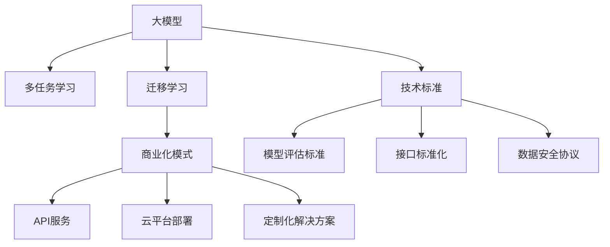
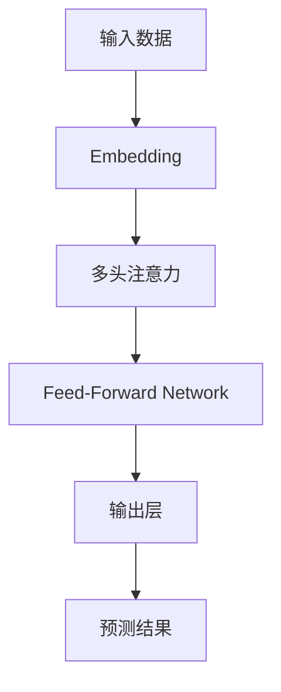

                 

# AI 大模型原理与应用：大模型是一个好的商业模式吗

> 关键词：大模型,商业化,商业模式,AI技术,深度学习,自然语言处理(NLP),应用场景,工业部署,用户定制,数据安全,技术标准

## 1. 背景介绍

### 1.1 问题由来

在AI领域，尤其是深度学习领域，"大模型"（Large Model）的概念近年来逐渐成为热词。大模型指的是那些具有数十亿甚至百亿级别参数的深度神经网络模型，这些模型在诸如自然语言处理（Natural Language Processing, NLP）、计算机视觉（Computer Vision, CV）等领域的各种任务中展现了前所未有的高性能。

对于大模型，其定义并无统一标准，但通常包括参数规模在10亿及以上的模型。这些大模型由大量的标注数据和强大的计算资源训练而来，具备了复杂的非线性映射能力，能够在多任务学习和迁移学习中表现出强大的泛化能力。但随着大模型的快速发展，其商业化的价值和模式也成为人们热议的焦点。本文将对大模型在商业化过程中的优势、挑战与未来发展趋势进行深入探讨。

### 1.2 问题核心关键点

1. **大模型的性能优势**：大模型在大规模数据上的泛化能力强，能够在不同任务间迁移，具有高效的多任务学习能力。
2. **商业化挑战**：大模型需要大量的数据和计算资源，高昂的维护成本，且在部署时面临数据隐私和安全问题。
3. **商业模式探索**：如何通过商业模式将大模型商业化，同时兼顾技术领先和用户定制化需求。
4. **未来发展趋势**：在数据、算法和架构上的持续创新，推动大模型向更多应用领域渗透。

## 2. 核心概念与联系

### 2.1 核心概念概述

为了更好地理解大模型及其商业化模式，本节将介绍几个关键概念：

- **大模型**：指具有数十亿参数的深度神经网络模型，通常用于处理复杂的语言和视觉任务。
- **多任务学习**：大模型在多个相关任务上进行联合训练，以提升泛化能力和迁移学习效率。
- **迁移学习**：在大规模数据上预训练的大模型，能够在特定任务上进行微调，以适应新的数据集。
- **商业化模式**：包括API服务、云平台部署、定制化解决方案等，将大模型技术转化为实际商业价值。
- **技术标准**：如模型评估标准、接口标准化、数据安全协议等，确保大模型技术可复用性和安全性。

这些概念之间的逻辑关系可以通过以下Mermaid流程图来展示：



这个流程图展示了从大模型技术到商业化模式的流程和关键环节。

### 2.2 核心概念原理和架构

大模型的核心原理在于利用深度神经网络对海量数据进行映射，通过复杂的非线性映射能力，捕捉数据间的隐含关系。架构上，大模型通常采用自回归或自编码的方式，如Transformer架构，能够高效处理长序列输入，具有自适应性的特征提取能力。

Transformer模型是一种基于注意力机制的神经网络架构，它通过并行处理数据，极大地提高了训练和推理的效率。Transformer模型中的多头注意力机制允许模型对输入序列中每个位置进行多次关注，捕捉不同位置之间的语义关系。

下图展示了Transformer模型的基本架构：



图中，`B`代表嵌入层，将输入数据映射到固定大小的向量空间中；`C`为多头注意力层，通过注意力机制捕捉序列中不同位置的相关性；`D`为前馈网络，引入非线性变换；`E`为输出层，通常包括线性变换和softmax层，用于生成最终输出结果。

## 3. 核心算法原理 & 具体操作步骤

### 3.1 算法原理概述

大模型的训练和应用通常基于以下两个核心算法原理：

1. **自监督学习（Self-supervised Learning）**：通过在大规模无标签数据上预训练模型，学习到语言的通用表示和语义关系，从而提升模型在特定任务上的性能。
2. **迁移学习（Transfer Learning）**：在大规模数据上预训练的模型，能够在特定任务上进行微调，以适应新的数据集和任务要求。

### 3.2 算法步骤详解

#### 3.2.1 预训练阶段

大模型的预训练通常包括以下步骤：

1. **数据准备**：收集大规模的标注数据，进行数据清洗和预处理，确保数据质量。
2. **模型选择**：选择适合的模型架构，如Transformer模型，确定参数规模和层数。
3. **训练流程**：在GPU/TPU等高性能设备上训练模型，一般使用自监督学习任务，如语言建模、掩码语言建模等。

#### 3.2.2 微调阶段

在特定任务上微调大模型的步骤如下：

1. **任务适配**：根据任务类型，设计合适的任务适配层，如分类头、解码器等。
2. **数据准备**：收集目标任务的标注数据，进行数据增强和预处理。
3. **模型微调**：在训练集上进行有监督的微调，优化模型在特定任务上的性能。
4. **评估与部署**：在验证集和测试集上评估模型性能，部署模型到实际应用系统中。

### 3.3 算法优缺点

#### 3.3.1 优点

1. **泛化能力强**：大模型在多种任务上的泛化能力强，能够适应不同的数据分布。
2. **参数高效**：可以通过迁移学习和参数高效微调技术，减少微调过程中需要优化的参数量。
3. **通用性强**：大模型可以作为通用基础，支持多种任务和应用场景。
4. **技术成熟**：经过多年研究和应用验证，大模型的技术和算法已经相对成熟和稳定。

#### 3.3.2 缺点

1. **数据依赖高**：大模型的训练和微调需要大量高质量标注数据，数据获取成本较高。
2. **计算资源需求大**：训练和推理大模型需要高性能设备和高计算资源，维护成本较高。
3. **易过拟合**：大模型在特定数据集上容易发生过拟合，泛化能力受数据分布影响。
4. **复杂度高**：大模型的结构复杂，调试和优化困难。
5. **部署成本高**：将大模型部署到实际应用环境中，需要考虑数据传输、模型压缩等成本。

### 3.4 算法应用领域

大模型的应用领域非常广泛，主要涵盖以下几个方面：

- **自然语言处理（NLP）**：包括机器翻译、文本分类、情感分析、问答系统等任务。
- **计算机视觉（CV）**：如图像识别、目标检测、图像生成等任务。
- **语音识别**：如语音转文本、语音合成等任务。
- **推荐系统**：根据用户行为和物品属性进行个性化推荐。
- **智能控制**：应用于智能家居、自动驾驶等领域。

## 4. 数学模型和公式 & 详细讲解 & 举例说明

### 4.1 数学模型构建

大模型的训练通常基于深度学习框架，如TensorFlow、PyTorch等。以下以BERT模型为例，介绍其数学模型构建过程。

BERT模型的目标函数为最大化预测概率与真实标签之间的交叉熵损失，具体如下：

$$
\mathcal{L}(\theta) = -\frac{1}{N} \sum_{i=1}^N \sum_{j=1}^J (y_{ij} \log P(w_i|x_j;\theta)) + (1-y_{ij}) \log (1-P(w_i|x_j;\theta))
$$

其中，$N$ 为样本数，$J$ 为类别数，$x_j$ 为样本，$y_{ij}$ 为样本$j$在类别$i$上的标签，$P(w_i|x_j;\theta)$ 为模型在样本$x_j$上预测类别$i$的概率。

### 4.2 公式推导过程

BERT模型的训练过程包括两个阶段：预训练和微调。

在预训练阶段，BERT模型通常采用掩码语言建模（Masked Language Modeling, MLM）和下一句预测（Next Sentence Prediction, NSP）两种自监督任务。以下以掩码语言建模为例，推导其计算公式。

假设输入序列长度为$L$，模型输入的词向量为$x$，掩码掩码向量为$m$，掩码位置为$i$。掩码语言建模的目标函数为：

$$
\mathcal{L}_{MLM}(\theta) = -\frac{1}{N} \sum_{i=1}^N \sum_{j=1}^L \sum_{k=1}^J (y_{ijk} \log P(x_k|x_i,\theta) + (1-y_{ijk}) \log (1-P(x_k|x_i,\theta)))
$$

其中，$y_{ijk}$ 为掩码位置$i$的掩码向量中$k$位置的标签，$P(x_k|x_i,\theta)$ 为模型在掩码位置$i$预测单词$k$的概率。

### 4.3 案例分析与讲解

以BERT模型在情感分析任务上的微调为例，分析其在实际应用中的表现。

假设训练集为正面和负面情感标注的数据集，模型输入为文本序列，输出为二分类标签。在微调过程中，模型通过学习文本中的情感倾向，预测新的情感分类。

以下是使用PyTorch实现BERT模型在情感分析任务上的微调示例代码：

```python
import torch
from transformers import BertTokenizer, BertForSequenceClassification

# 加载预训练的BERT模型和分词器
model = BertForSequenceClassification.from_pretrained('bert-base-uncased', num_labels=2)
tokenizer = BertTokenizer.from_pretrained('bert-base-uncased')

# 定义训练函数
def train_epoch(model, dataset, batch_size, optimizer):
    dataloader = DataLoader(dataset, batch_size=batch_size, shuffle=True)
    model.train()
    epoch_loss = 0
    for batch in dataloader:
        input_ids = batch['input_ids'].to(device)
        attention_mask = batch['attention_mask'].to(device)
        labels = batch['labels'].to(device)
        model.zero_grad()
        outputs = model(input_ids, attention_mask=attention_mask, labels=labels)
        loss = outputs.loss
        epoch_loss += loss.item()
        loss.backward()
        optimizer.step()
    return epoch_loss / len(dataloader)

# 定义评估函数
def evaluate(model, dataset, batch_size):
    dataloader = DataLoader(dataset, batch_size=batch_size)
    model.eval()
    preds, labels = [], []
    with torch.no_grad():
        for batch in dataloader:
            input_ids = batch['input_ids'].to(device)
            attention_mask = batch['attention_mask'].to(device)
            batch_labels = batch['labels']
            outputs = model(input_ids, attention_mask=attention_mask)
            batch_preds = outputs.logits.argmax(dim=2).to('cpu').tolist()
            batch_labels = batch_labels.to('cpu').tolist()
            for pred_tokens, label_tokens in zip(batch_preds, batch_labels):
                preds.append(pred_tokens[:len(label_tokens)])
                labels.append(label_tokens)
    return classification_report(labels, preds)

# 训练模型
device = torch.device('cuda') if torch.cuda.is_available() else torch.device('cpu')
model.to(device)

epochs = 3
batch_size = 32

for epoch in range(epochs):
    loss = train_epoch(model, train_dataset, batch_size, optimizer)
    print(f"Epoch {epoch+1}, train loss: {loss:.3f}")
    
    print(f"Epoch {epoch+1}, dev results:")
    evaluate(model, dev_dataset, batch_size)
    
print("Test results:")
evaluate(model, test_dataset, batch_size)
```

上述代码展示了使用BERT模型在情感分析任务上的微调过程。在微调过程中，模型通过学习标注数据中的情感倾向，生成新的情感分类，并在测试集上进行评估。

## 5. 项目实践：代码实例和详细解释说明

### 5.1 开发环境搭建

在进行大模型微调实践前，我们需要准备好开发环境。以下是使用Python进行PyTorch开发的环境配置流程：

1. 安装Anaconda：从官网下载并安装Anaconda，用于创建独立的Python环境。

2. 创建并激活虚拟环境：
```bash
conda create -n pytorch-env python=3.8 
conda activate pytorch-env
```

3. 安装PyTorch：根据CUDA版本，从官网获取对应的安装命令。例如：
```bash
conda install pytorch torchvision torchaudio cudatoolkit=11.1 -c pytorch -c conda-forge
```

4. 安装Transformers库：
```bash
pip install transformers
```

5. 安装各类工具包：
```bash
pip install numpy pandas scikit-learn matplotlib tqdm jupyter notebook ipython
```

完成上述步骤后，即可在`pytorch-env`环境中开始微调实践。

### 5.2 源代码详细实现

这里我们以BERT模型在情感分析任务上的微调为例，给出完整的PyTorch代码实现。

```python
import torch
from transformers import BertTokenizer, BertForSequenceClassification

# 加载预训练的BERT模型和分词器
model = BertForSequenceClassification.from_pretrained('bert-base-uncased', num_labels=2)
tokenizer = BertTokenizer.from_pretrained('bert-base-uncased')

# 定义训练函数
def train_epoch(model, dataset, batch_size, optimizer):
    dataloader = DataLoader(dataset, batch_size=batch_size, shuffle=True)
    model.train()
    epoch_loss = 0
    for batch in dataloader:
        input_ids = batch['input_ids'].to(device)
        attention_mask = batch['attention_mask'].to(device)
        labels = batch['labels'].to(device)
        model.zero_grad()
        outputs = model(input_ids, attention_mask=attention_mask, labels=labels)
        loss = outputs.loss
        epoch_loss += loss.item()
        loss.backward()
        optimizer.step()
    return epoch_loss / len(dataloader)

# 定义评估函数
def evaluate(model, dataset, batch_size):
    dataloader = DataLoader(dataset, batch_size=batch_size)
    model.eval()
    preds, labels = [], []
    with torch.no_grad():
        for batch in dataloader:
            input_ids = batch['input_ids'].to(device)
            attention_mask = batch['attention_mask'].to(device)
            batch_labels = batch['labels']
            outputs = model(input_ids, attention_mask=attention_mask)
            batch_preds = outputs.logits.argmax(dim=2).to('cpu').tolist()
            batch_labels = batch_labels.to('cpu').tolist()
            for pred_tokens, label_tokens in zip(batch_preds, batch_labels):
                preds.append(pred_tokens[:len(label_tokens)])
                labels.append(label_tokens)
    return classification_report(labels, preds)

# 训练模型
device = torch.device('cuda') if torch.cuda.is_available() else torch.device('cpu')
model.to(device)

epochs = 3
batch_size = 32

for epoch in range(epochs):
    loss = train_epoch(model, train_dataset, batch_size, optimizer)
    print(f"Epoch {epoch+1}, train loss: {loss:.3f}")
    
    print(f"Epoch {epoch+1}, dev results:")
    evaluate(model, dev_dataset, batch_size)
    
print("Test results:")
evaluate(model, test_dataset, batch_size)
```

以上代码展示了使用BERT模型在情感分析任务上的微调过程。在微调过程中，模型通过学习标注数据中的情感倾向，生成新的情感分类，并在测试集上进行评估。

### 5.3 代码解读与分析

让我们再详细解读一下关键代码的实现细节：

**BertTokenizer类**：
- `__init__`方法：初始化分词器，加载预训练模型。
- `__len__`方法：返回数据集的样本数量。
- `__getitem__`方法：对单个样本进行处理，将文本输入编码为token ids，返回模型所需的输入。

**训练函数**：
- 使用PyTorch的DataLoader对数据集进行批次化加载，供模型训练和推理使用。
- 在训练集上迭代，计算loss并进行梯度下降更新模型参数。

**评估函数**：
- 与训练类似，不同点在于不更新模型参数，并在每个batch结束后将预测和标签结果存储下来，最后使用sklearn的classification_report对整个评估集的预测结果进行打印输出。

**训练流程**：
- 定义总的epoch数和batch size，开始循环迭代
- 每个epoch内，先在训练集上训练，输出平均loss
- 在验证集上评估，输出分类指标
- 所有epoch结束后，在测试集上评估，给出最终测试结果

可以看到，PyTorch配合Transformers库使得BERT微调的代码实现变得简洁高效。开发者可以将更多精力放在数据处理、模型改进等高层逻辑上，而不必过多关注底层的实现细节。

## 6. 实际应用场景

### 6.1 智能客服系统

基于大语言模型微调的对话技术，可以广泛应用于智能客服系统的构建。传统客服往往需要配备大量人力，高峰期响应缓慢，且一致性和专业性难以保证。而使用微调后的对话模型，可以7x24小时不间断服务，快速响应客户咨询，用自然流畅的语言解答各类常见问题。

在技术实现上，可以收集企业内部的历史客服对话记录，将问题和最佳答复构建成监督数据，在此基础上对预训练对话模型进行微调。微调后的对话模型能够自动理解用户意图，匹配最合适的答案模板进行回复。对于客户提出的新问题，还可以接入检索系统实时搜索相关内容，动态组织生成回答。如此构建的智能客服系统，能大幅提升客户咨询体验和问题解决效率。

### 6.2 金融舆情监测

金融机构需要实时监测市场舆论动向，以便及时应对负面信息传播，规避金融风险。传统的人工监测方式成本高、效率低，难以应对网络时代海量信息爆发的挑战。基于大语言模型微调的文本分类和情感分析技术，为金融舆情监测提供了新的解决方案。

具体而言，可以收集金融领域相关的新闻、报道、评论等文本数据，并对其进行主题标注和情感标注。在此基础上对预训练语言模型进行微调，使其能够自动判断文本属于何种主题，情感倾向是正面、中性还是负面。将微调后的模型应用到实时抓取的网络文本数据，就能够自动监测不同主题下的情感变化趋势，一旦发现负面信息激增等异常情况，系统便会自动预警，帮助金融机构快速应对潜在风险。

### 6.3 个性化推荐系统

当前的推荐系统往往只依赖用户的历史行为数据进行物品推荐，无法深入理解用户的真实兴趣偏好。基于大语言模型微调技术，个性化推荐系统可以更好地挖掘用户行为背后的语义信息，从而提供更精准、多样的推荐内容。

在实践中，可以收集用户浏览、点击、评论、分享等行为数据，提取和用户交互的物品标题、描述、标签等文本内容。将文本内容作为模型输入，用户的后续行为（如是否点击、购买等）作为监督信号，在此基础上微调预训练语言模型。微调后的模型能够从文本内容中准确把握用户的兴趣点。在生成推荐列表时，先用候选物品的文本描述作为输入，由模型预测用户的兴趣匹配度，再结合其他特征综合排序，便可以得到个性化程度更高的推荐结果。

### 6.4 未来应用展望

随着大语言模型微调技术的发展，未来其应用场景将更加广阔。除了当前广泛应用的智能客服、金融舆情监测、个性化推荐等领域外，大模型还将在更多领域发挥作用：

- **医疗健康**：辅助医生诊断、病历分析、药物研发等，提升医疗服务智能化水平。
- **教育培训**：个性化学情分析、知识推荐，提供定制化学习方案，促进教育公平。
- **智慧城市**：智能交通、环境监测、公共安全等，构建高效、安全的未来城市。
- **工业制造**：智能质检、供应链管理、设备运维等，提升制造业智能化水平。
- **农业农村**：智能农业决策、精准农业、农村电商等，推动农业现代化。

## 7. 工具和资源推荐

### 7.1 学习资源推荐

为了帮助开发者系统掌握大语言模型微调的理论基础和实践技巧，这里推荐一些优质的学习资源：

1. **《Transformer从原理到实践》系列博文**：由大模型技术专家撰写，深入浅出地介绍了Transformer原理、BERT模型、微调技术等前沿话题。
2. **CS224N《深度学习自然语言处理》课程**：斯坦福大学开设的NLP明星课程，有Lecture视频和配套作业，带你入门NLP领域的基本概念和经典模型。
3. **《Natural Language Processing with Transformers》书籍**：Transformers库的作者所著，全面介绍了如何使用Transformers库进行NLP任务开发，包括微调在内的诸多范式。
4. **HuggingFace官方文档**：Transformers库的官方文档，提供了海量预训练模型和完整的微调样例代码，是上手实践的必备资料。
5. **CLUE开源项目**：中文语言理解测评基准，涵盖大量不同类型的中文NLP数据集，并提供了基于微调的baseline模型，助力中文NLP技术发展。

通过对这些资源的学习实践，相信你一定能够快速掌握大语言模型微调的精髓，并用于解决实际的NLP问题。

### 7.2 开发工具推荐

高效的开发离不开优秀的工具支持。以下是几款用于大语言模型微调开发的常用工具：

1. **PyTorch**：基于Python的开源深度学习框架，灵活动态的计算图，适合快速迭代研究。大部分预训练语言模型都有PyTorch版本的实现。
2. **TensorFlow**：由Google主导开发的开源深度学习框架，生产部署方便，适合大规模工程应用。同样有丰富的预训练语言模型资源。
3. **Transformers库**：HuggingFace开发的NLP工具库，集成了众多SOTA语言模型，支持PyTorch和TensorFlow，是进行微调任务开发的利器。
4. **Weights & Biases**：模型训练的实验跟踪工具，可以记录和可视化模型训练过程中的各项指标，方便对比和调优。与主流深度学习框架无缝集成。
5. **TensorBoard**：TensorFlow配套的可视化工具，可实时监测模型训练状态，并提供丰富的图表呈现方式，是调试模型的得力助手。
6. **Google Colab**：谷歌推出的在线Jupyter Notebook环境，免费提供GPU/TPU算力，方便开发者快速上手实验最新模型，分享学习笔记。

合理利用这些工具，可以显著提升大语言模型微调任务的开发效率，加快创新迭代的步伐。

### 7.3 相关论文推荐

大语言模型和微调技术的发展源于学界的持续研究。以下是几篇奠基性的相关论文，推荐阅读：

1. **Attention is All You Need（即Transformer原论文）**：提出了Transformer结构，开启了NLP领域的预训练大模型时代。
2. **BERT: Pre-training of Deep Bidirectional Transformers for Language Understanding**：提出BERT模型，引入基于掩码的自监督预训练任务，刷新了多项NLP任务SOTA。
3. **Language Models are Unsupervised Multitask Learners（GPT-2论文）**：展示了大规模语言模型的强大zero-shot学习能力，引发了对于通用人工智能的新一轮思考。
4. **Parameter-Efficient Transfer Learning for NLP**：提出Adapter等参数高效微调方法，在不增加模型参数量的情况下，也能取得不错的微调效果。
5. **Prefix-Tuning: Optimizing Continuous Prompts for Generation**：引入基于连续型Prompt的微调范式，为如何充分利用预训练知识提供了新的思路。
6. **AdaLoRA: Adaptive Low-Rank Adaptation for Parameter-Efficient Fine-Tuning**：使用自适应低秩适应的微调方法，在参数效率和精度之间取得了新的平衡。
7. **GPT-3: Language Models are Few-Shot Learners**：展示了GPT-3模型在多种任务上的强大零样本学习能力和多任务学习性能。

这些论文代表了大语言模型微调技术的发展脉络。通过学习这些前沿成果，可以帮助研究者把握学科前进方向，激发更多的创新灵感。

## 8. 总结：未来发展趋势与挑战

### 8.1 总结

本文对大语言模型及其在商业化过程中的应用和挑战进行了深入探讨。首先介绍了大模型的性能优势，以及其在多个任务上的泛化能力。其次，探讨了大模型在商业化过程中面临的数据依赖、计算资源消耗、过拟合等问题，并提出了一些解决方案。最后，展望了大模型的未来发展趋势，包括多任务学习、持续学习、参数高效微调等前沿方向。

通过本文的系统梳理，可以看到，大模型在NLP领域展现了强大的应用潜力，但其商业化过程仍需面对诸多挑战。未来的发展方向将是大模型技术更加高效、灵活、普适，能够更好地服务于实际应用场景。

### 8.2 未来发展趋势

展望未来，大语言模型微调技术将呈现以下几个发展趋势：

1. **多任务学习能力的提升**：未来的大模型将具备更强的多任务学习能力，能够同时处理多种任务，减少任务切换和模型部署的复杂度。
2. **持续学习能力的增强**：大模型将不断学习新数据，保持性能提升，逐步向终身学习模型迈进。
3. **参数高效微调技术的发展**：通过更高效、更灵活的微调方法，减少模型训练和微调过程中的资源消耗，提升模型部署效率。
4. **多模态融合的探索**：大模型将更加关注多模态数据的整合，提升在图像、语音、文本等不同模态上的通用性。
5. **隐私保护和数据安全的提升**：随着数据隐私保护要求的提高，大模型将更加注重数据安全和隐私保护，确保模型训练和使用的合法性。

### 8.3 面临的挑战

尽管大语言模型微调技术取得了显著进展，但仍面临以下挑战：

1. **数据获取成本高**：高质量标注数据的获取成本较高，特别是在长尾领域。
2. **计算资源消耗大**：大模型的训练和推理需要高性能设备，维护成本高。
3. **过拟合问题**：大模型在特定数据集上容易发生过拟合，泛化能力受数据分布影响。
4. **模型复杂度高**：大模型的结构复杂，调试和优化困难。
5. **部署成本高**：模型部署到实际应用环境中，需要考虑数据传输、模型压缩等成本。
6. **伦理和安全问题**：大模型可能学习到有害信息，需要严格的伦理审查和安全防护。

### 8.4 研究展望

面对大模型微调所面临的挑战，未来的研究需要在以下几个方面寻求新的突破：

1. **无监督和半监督学习**：摆脱对大规模标注数据的依赖，利用自监督学习、主动学习等无监督和半监督范式，最大限度利用非结构化数据。
2. **持续学习与增量学习**：使模型能够持续学习新数据，同时保持已有知识的稳定性，解决灾难性遗忘问题。
3. **模型压缩与剪枝**：通过模型压缩、剪枝等技术，减小模型大小，提升计算效率和推理速度。
4. **多模态融合技术**：探索如何将视觉、语音、文本等多种模态数据融合，提升模型的通用性和适应性。
5. **隐私保护与数据安全**：引入隐私保护技术，确保模型训练和使用过程中的数据安全。
6. **伦理审查与责任归属**：在模型开发和应用过程中，引入伦理审查机制，确保模型输出符合社会价值观和法律法规。

## 9. 附录：常见问题与解答

**Q1: 大模型在商业化过程中面临哪些挑战？**

A: 大模型在商业化过程中面临的主要挑战包括数据获取成本高、计算资源消耗大、模型过拟合、复杂度高、部署成本高以及伦理和安全问题。解决这些问题需要技术创新和合理的商业模式设计。

**Q2: 如何评估大模型的性能？**

A: 大模型的性能评估通常包括以下指标：精度、召回率、F1分数、ROC-AUC等。在实际应用中，还需要关注模型的响应速度、资源占用、模型大小等。

**Q3: 大模型的计算资源需求有哪些？**

A: 大模型的计算资源需求包括高性能GPU/TPU设备、大规模内存、存储设备以及网络带宽等。在实际部署中，还需要考虑模型压缩、剪枝等技术，以优化资源使用。

**Q4: 大模型在商业化过程中如何确保数据隐私和安全？**

A: 大模型在商业化过程中需要采取以下措施确保数据隐私和安全：
1. 数据匿名化处理，防止个人信息泄露。
2. 模型训练和推理过程中采用差分隐私、联邦学习等技术，保护数据隐私。
3. 定期对模型进行安全审计，发现并修复潜在漏洞。
4. 遵循相关法律法规，如GDPR、CCPA等，确保数据使用的合法性。

**Q5: 大模型在商业化过程中如何平衡性能和成本？**

A: 大模型在商业化过程中需要平衡性能和成本：
1. 通过参数高效微调等技术，减少微调过程中的计算资源消耗。
2. 采用模型压缩、剪枝等技术，减小模型大小，降低存储和传输成本。
3. 选择合适的计算设备，如GPU、TPU等，优化计算效率。
4. 优化模型部署方式，如采用边际计算、云服务等，降低部署成本。

通过上述措施，可以在确保模型性能的同时，控制成本，提高商业化的可行性。

---

作者：禅与计算机程序设计艺术 / Zen and the Art of Computer Programming

