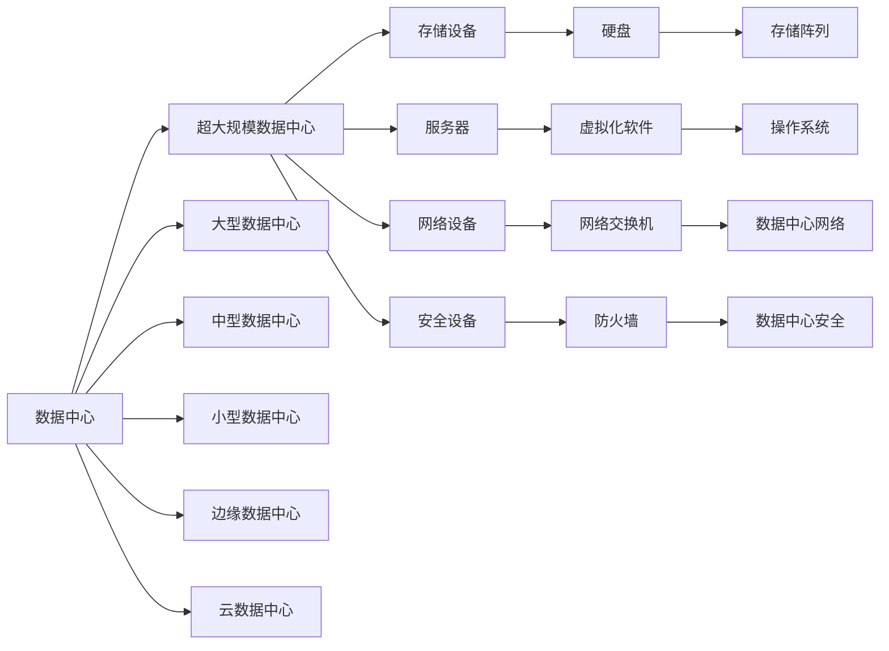

                 

# AI 大模型应用数据中心建设：数据中心产业发展

## 1. 背景介绍

随着人工智能技术的发展，大数据、云计算、物联网等新兴技术的应用日趋普及，对数据中心的建设需求也急剧增加。特别是在AI大模型应用领域，数据中心作为存储、计算和传输大量数据的基础设施，其建设和管理对AI技术的应用和发展起着至关重要的作用。本文将重点介绍AI大模型应用数据中心的建设，从数据中心的定义、发展历程、技术架构等多个方面对数据中心产业发展进行探讨。

## 2. 核心概念与联系

### 2.1 核心概念概述

1. **数据中心**：数据中心是用于存储、管理和传输大量数据的设施，由硬件设备、网络设备、服务器、存储设备、安全设备等组成。数据中心分为超大规模数据中心、大型数据中心、中型数据中心、小型数据中心等不同规模。

2. **AI大模型**：AI大模型是指在大规模数据集上进行预训练，具有出色学习和推理能力的人工智能模型。常见的AI大模型包括BERT、GPT系列、XLNet等。

3. **数据中心产业**：数据中心产业是指数据中心的规划、建设、运营、维护等一系列活动所涉及的产业链。数据中心产业包括数据中心设计、数据中心建设、数据中心运维、数据中心安全等多个方面。

4. **超大规模数据中心**：超大规模数据中心通常指的是拥有数千台甚至数万台服务器的数据中心，用于存储和计算大规模数据，支持AI大模型的训练和推理。

5. **边缘数据中心**：边缘数据中心主要部署在靠近用户的网络边缘，用于处理和分析实时数据，降低延迟，提高数据处理效率。

6. **云数据中心**：云数据中心是利用云计算技术，通过互联网提供数据中心服务和资源的共享数据中心。

这些核心概念之间存在着紧密的联系，通过这些概念的深入理解，可以帮助我们更好地掌握AI大模型应用数据中心建设的关键要素，推动数据中心产业的发展。

### 2.2 核心概念原理和架构的 Mermaid 流程图



## 3. 核心算法原理 & 具体操作步骤

### 3.1 算法原理概述

AI大模型应用数据中心的建设，涉及到数据中心的规划、设计、建设和运维等多个环节。为了更好地理解和实现这些环节，我们需要从数据中心的定义、数据中心的选址、数据中心的规模、数据中心的建设等方面来详细分析。

### 3.2 算法步骤详解

1. **数据中心选址**：
   - 分析地理位置、气候条件、电力供应、交通便利性等综合因素。
   - 选择能源充足、环境适宜、交通便利的地区建设数据中心。

2. **数据中心规模**：
   - 根据业务需求和数据规模，确定数据中心的物理和虚拟规模。
   - 超大规模数据中心需要数百台甚至数千台服务器，存储数十TB甚至数PB的数据。

3. **数据中心建设**：
   - 数据中心建设分为初步规划、详细设计、建设实施等多个阶段。
   - 涉及建筑结构设计、电力系统设计、空调系统设计、网络系统设计等多个方面。

4. **数据中心运维**：
   - 数据中心运维包括设备维护、环境监控、系统管理等多个方面。
   - 确保数据中心的安全、稳定和高效运行。

5. **数据中心安全**：
   - 数据中心安全包括物理安全、网络安全、数据安全等多个方面。
   - 确保数据中心的数据安全性和业务连续性。

### 3.3 算法优缺点

**优点**：
- 提供高效的计算和存储能力，支持大规模数据处理和AI大模型的训练和推理。
- 支持数据中心资源的共享和优化，提高资源利用率。
- 支持边缘计算，降低延迟，提高数据处理效率。

**缺点**：
- 建设成本高，需要大量资金投入。
- 运行维护成本高，需要专业人才进行运维管理。
- 需要大量能源，对环境影响大。

### 3.4 算法应用领域

AI大模型应用数据中心的建设，广泛应用于以下几个领域：
- 云计算服务：如AWS、Azure、阿里云、腾讯云等。
- 大数据处理：如Google BigQuery、Hadoop、Spark等。
- AI大模型训练和推理：如BERT、GPT系列、XLNet等。
- 物联网数据处理：如智能城市、工业物联网等。

## 4. 数学模型和公式 & 详细讲解 & 举例说明

### 4.1 数学模型构建

AI大模型应用数据中心的建设和运维，涉及大量的数学模型。例如，在数据中心的设计中，需要进行电力系统设计、空调系统设计、网络系统设计等多个方面的建模。

### 4.2 公式推导过程

以电力系统设计为例，假设一个数据中心需要1000台服务器，每台服务器功率为1000W，平均使用率为80%，电价为0.5元/度。

计算一年的电力成本为：
$$ 1000 \times 1000 \times 0.8 \times 365 \times 24 \times 0.5 = 18,720,000 \text{元} $$

### 4.3 案例分析与讲解

假设一个数据中心需要部署1000台服务器，其中80%用于训练AI大模型，20%用于推理。服务器平均使用率为70%，CPU利用率为80%。

计算一年的服务器成本为：
$$ 1000 \times 1000 \times 0.8 \times 365 \times 24 \times 0.7 \times 0.8 = 11,616,000 \text{元} $$

## 5. 项目实践：代码实例和详细解释说明

### 5.1 开发环境搭建

开发环境搭建包括安装Python、安装数据中心管理软件、安装网络设备等多个步骤。

### 5.2 源代码详细实现

以下是一个Python脚本，用于计算数据中心的电力成本和服务器成本。

```python
import math

def calculate_power_cost(num_servers, power_per_server, efficiency, rate, unit_cost):
    return num_servers * power_per_server * efficiency * 365 * 24 * rate * unit_cost

def calculate_server_cost(num_servers, power_per_server, efficiency, rate, utilization, cpu_utilization):
    return num_servers * power_per_server * efficiency * 365 * 24 * rate * utilization * cpu_utilization

num_servers = 1000
power_per_server = 1000
efficiency = 0.8
rate = 0.5
unit_cost = 0.5
power_cost = calculate_power_cost(num_servers, power_per_server, efficiency, rate, unit_cost)
print("Power cost: ", power_cost)
server_cost = calculate_server_cost(num_servers, power_per_server, efficiency, rate, 0.8, 0.8)
print("Server cost: ", server_cost)
```

### 5.3 代码解读与分析

上述代码中，我们首先定义了计算电力成本和服务器成本的函数。在主程序中，我们传入数据中心的服务器数量、每台服务器的功率、能效、电价和CPU利用率等参数，计算出一年的电力成本和服务器成本。

## 6. 实际应用场景

### 6.1 云计算服务

云计算服务是数据中心应用最为广泛的方向之一。AWS、Azure、阿里云、腾讯云等云服务提供商，通过建设大规模数据中心，提供高效的云计算服务，支持AI大模型的训练和推理。

### 6.2 大数据处理

大数据处理是数据中心应用的另一个重要方向。通过建设大型数据中心，支持Hadoop、Spark等大数据处理框架，为AI大模型提供丰富的数据资源支持。

### 6.3 AI大模型训练和推理

AI大模型训练和推理是数据中心应用的核心方向。通过建设超大规模数据中心，支持BERT、GPT系列、XLNet等AI大模型的训练和推理，为AI应用提供高效的数据处理能力。

### 6.4 物联网数据处理

物联网数据处理是数据中心应用的新兴方向。通过建设边缘数据中心，支持智能城市、工业物联网等物联网应用的数据处理和分析，提高数据处理效率和实时性。

### 6.5 未来应用展望

未来，数据中心的应用领域将会更加广泛，涵盖更多新兴技术和领域。随着5G、边缘计算、物联网等技术的不断发展，数据中心的建设和管理将更加智能化、高效化和环保化。

## 7. 工具和资源推荐

### 7.1 学习资源推荐

1. **《数据中心设计与管理》**：介绍了数据中心的定义、设计、建设和运维等多个方面的内容。
2. **《云计算基础》**：详细介绍了云计算技术的原理、应用和部署等多个方面的内容。
3. **《大数据处理技术》**：介绍了Hadoop、Spark等大数据处理框架的原理和应用。
4. **《人工智能与机器学习》**：介绍了AI大模型的原理、应用和训练等多个方面的内容。
5. **《边缘计算与物联网》**：介绍了边缘计算、物联网等新兴技术的原理和应用。

### 7.2 开发工具推荐

1. **PyTorch**：开源深度学习框架，支持分布式训练，适合大规模数据中心的应用。
2. **TensorFlow**：开源深度学习框架，支持GPU加速，适合高效的数据中心训练和推理。
3. **Ansible**：自动化运维工具，支持数据中心的自动化管理和监控。
4. **OpenStack**：开源云计算平台，支持大规模数据中心的自动化部署和管理。
5. **Prometheus**：监控系统，支持数据中心的实时监控和告警。

### 7.3 相关论文推荐

1. **《超大规模数据中心设计与管理》**：介绍了超大规模数据中心的设计和管理方法。
2. **《云计算技术与应用》**：详细介绍了云计算技术的原理、应用和部署等多个方面的内容。
3. **《大数据处理技术与应用》**：介绍了Hadoop、Spark等大数据处理框架的原理和应用。
4. **《人工智能与机器学习技术》**：介绍了AI大模型的原理、应用和训练等多个方面的内容。
5. **《边缘计算与物联网技术》**：介绍了边缘计算、物联网等新兴技术的原理和应用。

## 8. 总结：未来发展趋势与挑战

### 8.1 研究成果总结

AI大模型应用数据中心的建设，已经取得了一定的成果，广泛应用于云计算服务、大数据处理、AI大模型训练和推理等多个领域。未来的发展方向包括智能化、高效化和环保化。

### 8.2 未来发展趋势

未来，数据中心的应用领域将会更加广泛，涵盖更多新兴技术和领域。随着5G、边缘计算、物联网等技术的不断发展，数据中心的建设和管理将更加智能化、高效化和环保化。

### 8.3 面临的挑战

数据中心的建设和管理仍面临诸多挑战，包括建设成本高、运维成本高、能源消耗大等。未来需要在建设、运维、能源等方面进行更加深入的研究和改进。

### 8.4 研究展望

未来的研究方向包括智能化、高效化、环保化等多个方面。智能化方面，需要研究智能运维、智能监控等技术；高效化方面，需要研究高效计算、高效存储等技术；环保化方面，需要研究可再生能源、节能技术等。

## 9. 附录：常见问题与解答

### 9.1 常见问题

**Q1：数据中心建设需要考虑哪些因素？**
A1：数据中心建设需要考虑地理位置、气候条件、电力供应、交通便利性、能源消耗、环境影响等多个因素。

**Q2：数据中心如何提高能源利用率？**
A2：数据中心可以通过优化电源系统设计、采用高效制冷技术、使用可再生能源等措施提高能源利用率。

**Q3：数据中心如何提高运行效率？**
A3：数据中心可以通过优化网络设计、采用虚拟化技术、进行智能运维等措施提高运行效率。

**Q4：数据中心如何提高安全性？**
A4：数据中心可以通过物理安全措施、网络安全措施、数据安全措施等提高安全性。

**Q5：数据中心如何降低成本？**
A5：数据中心可以通过优化设计、采用节能技术、进行智能化运维等措施降低成本。

---

作者：禅与计算机程序设计艺术 / Zen and the Art of Computer Programming

