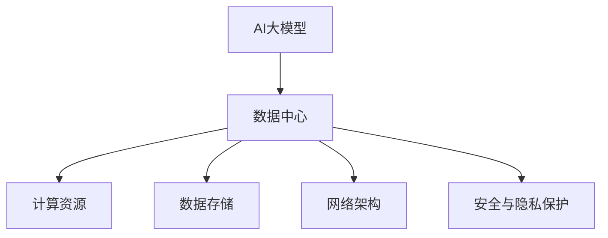

                 

# AI 大模型应用数据中心建设：数据中心标准与规范

> 关键词：AI大模型,数据中心,模型训练,基础设施,数据存储,计算资源,标准规范

## 1. 背景介绍

### 1.1 问题由来

在人工智能技术快速发展的今天，AI大模型如BERT、GPT-3等在自然语言处理、计算机视觉、语音识别等领域取得显著进展。这些大模型依赖于海量数据进行预训练，并通过微调应用于特定任务，取得了令人瞩目的成果。然而，AI大模型的训练与运行对计算资源、存储容量、网络带宽等基础设施提出了极高的要求。为了确保AI大模型能够高效、稳定地运行，构建合适、先进的数据中心基础设施成为至关重要的课题。

### 1.2 问题核心关键点

AI大模型应用数据中心的建设涉及多个关键点，包括计算资源管理、数据存储与传输、网络架构设计、安全与隐私保护等。构建一个标准化的、高质量的数据中心不仅能够确保AI模型的高效运行，还能够降低系统运维成本，提升用户体验。

## 2. 核心概念与联系

### 2.1 核心概念概述

1. **AI大模型**：指通过大规模数据预训练得到的通用语言模型、图像识别模型、知识图谱等，具备强大的知识抽取与生成能力。

2. **数据中心**：指为AI模型提供计算资源、存储资源、网络资源等基础设施，用于模型训练、推理、管理、监控等全生命周期操作的大型IT设施。

3. **计算资源**：包括CPU、GPU、TPU等硬件设施，用于模型的并行计算和加速。

4. **数据存储**：包括数据湖、对象存储、关系数据库等，用于模型的数据输入、中间数据存储、结果存储等。

5. **网络架构**：包括高速交换机、负载均衡器、CDN等，用于优化模型训练和推理过程中的数据传输速度和安全性。

6. **安全与隐私保护**：包括数据加密、访问控制、审计日志等，用于保护数据和模型免受未经授权的访问和使用。

这些核心概念之间的关系可以通过以下Mermaid流程图来展示：



这个流程图展示了AI大模型应用数据中心的整体架构：AI大模型依赖数据中心提供的计算资源、数据存储、网络架构和安全与隐私保护等基础设施进行训练和推理。

## 3. 核心算法原理 & 具体操作步骤
### 3.1 算法原理概述

AI大模型应用数据中心的建设涉及多个算法原理，包括资源调度算法、分布式训练算法、模型压缩算法等。这些算法共同作用，确保数据中心的计算资源能够被高效利用，同时保证模型训练和推理的准确性。

### 3.2 算法步骤详解

1. **资源调度算法**：
   - **原理**：通过优化资源分配策略，确保计算资源能够被合理分配和使用。
   - **步骤**：
     1. **资源池化**：将CPU、GPU、TPU等计算资源进行池化，确保资源的高效利用。
     2. **任务调度**：根据任务类型和资源需求，动态调整任务分配策略。
     3. **负载均衡**：通过分布式任务调度算法，均衡任务在各个计算节点上的分配。

2. **分布式训练算法**：
   - **原理**：通过分布式训练，加速模型训练过程，提高模型效率。
   - **步骤**：
     1. **数据划分**：将训练数据划分为多个子集，分配到不同的计算节点上进行分布式训练。
     2. **模型参数同步**：通过模型参数同步算法，确保各个计算节点上的模型参数一致。
     3. **梯度聚合**：汇总各个计算节点的梯度信息，更新模型参数。

3. **模型压缩算法**：
   - **原理**：通过压缩模型，减少存储和传输的资源消耗。
   - **步骤**：
     1. **量化压缩**：将模型参数进行量化处理，减少存储空间和计算复杂度。
     2. **剪枝压缩**：通过剪枝算法，移除模型中不重要的参数，减少模型复杂度。
     3. **知识蒸馏**：通过知识蒸馏算法，将大型模型的知识迁移到小型模型中。

### 3.3 算法优缺点

**资源调度算法**：
- **优点**：提高计算资源利用率，加速模型训练过程。
- **缺点**：调度算法复杂度高，需要动态调整资源配置。

**分布式训练算法**：
- **优点**：加速模型训练，支持大规模数据处理。
- **缺点**：分布式训练过程中存在通信开销，需要优化网络传输效率。

**模型压缩算法**：
- **优点**：减少存储和传输的资源消耗，提高模型推理速度。
- **缺点**：压缩算法可能影响模型精度，需要平衡模型大小和性能。

### 3.4 算法应用领域

AI大模型应用数据中心建设的核心算法广泛应用于以下领域：

1. **自然语言处理**：通过分布式训练和模型压缩，加速语言模型的训练和推理，提升NLP任务性能。
2. **计算机视觉**：利用计算资源池化和资源调度算法，支持大规模图像数据的处理和模型训练。
3. **语音识别**：通过分布式训练和数据存储优化，支持大规模语音数据的高效处理和模型训练。
4. **推荐系统**：通过资源调度和分布式训练算法，提升推荐系统的性能和实时性。

## 4. 数学模型和公式 & 详细讲解 & 举例说明
### 4.1 数学模型构建

假设AI大模型为 $M$，数据中心为 $D$，计算资源为 $C$，数据存储为 $S$，网络架构为 $N$，安全与隐私保护为 $P$。AI大模型的训练和推理过程可以表示为以下数学模型：

$$
M = D(C, S, N, P)
$$

其中，$D$ 表示数据中心，$C$ 表示计算资源，$S$ 表示数据存储，$N$ 表示网络架构，$P$ 表示安全与隐私保护。

### 4.2 公式推导过程

根据上述数学模型，我们可以推导出以下公式：

1. **资源调度公式**：
   $$
   R = \sum_{i=1}^{N} \frac{C_i}{\sum_{i=1}^{N} C_i}
   $$
   其中 $R$ 表示资源利用率，$C_i$ 表示第 $i$ 个计算节点的计算资源。

2. **分布式训练公式**：
   $$
   T = \sum_{i=1}^{M} \frac{t_i}{\sum_{i=1}^{M} t_i}
   $$
   其中 $T$ 表示训练时间，$t_i$ 表示第 $i$ 个任务的训练时间。

3. **模型压缩公式**：
   $$
   S' = S - (\sum_{i=1}^{M} S_i)
   $$
   其中 $S'$ 表示压缩后的模型存储空间，$S_i$ 表示第 $i$ 个参数的存储空间。

### 4.3 案例分析与讲解

以BERT模型在大规模数据集上的分布式训练为例，分析分布式训练算法和资源调度算法的应用。

1. **数据划分**：
   - 将大规模数据集 $D$ 划分为 $M$ 个子集 $D_i$，分配到 $N$ 个计算节点上进行分布式训练。

2. **任务调度**：
   - 根据每个计算节点的资源能力和任务需求，动态调整任务分配策略，确保任务均衡分布在各个计算节点上。

3. **梯度聚合**：
   - 汇总各个计算节点上的梯度信息，更新模型参数，确保模型在分布式训练过程中的一致性。

通过上述步骤，可以有效利用计算资源，加速BERT模型的训练过程，同时确保模型训练的准确性和可靠性。

## 5. 项目实践：代码实例和详细解释说明
### 5.1 开发环境搭建

为了进行AI大模型应用数据中心建设的项目实践，需要搭建一个完整的开发环境。以下是详细的开发环境搭建步骤：

1. **安装必要的软件**：
   - **Linux操作系统**：选择Ubuntu等稳定版本的Linux系统。
   - **计算资源**：根据需求安装CPU、GPU、TPU等计算资源。
   - **数据存储**：搭建分布式文件系统，如Hadoop、Ceph等，用于数据存储和管理。
   - **网络架构**：安装高速交换机、负载均衡器等网络设备，确保数据传输速度和稳定性。

2. **安装必要的工具**：
   - **分布式训练框架**：如TensorFlow、PyTorch等。
   - **资源管理工具**：如Kubernetes、OpenStack等。
   - **安全工具**：如Nginx、iptables等。

### 5.2 源代码详细实现

以下是一个基于TensorFlow的分布式训练代码实现：

```python
import tensorflow as tf
import tensorflow.distribute as tfd
import os

# 定义分布式训练策略
strategy = tfd.MirroredStrategy(devices=['/device:CPU:0', '/device:GPU:0', '/device:GPU:1', '/device:TPU:0', '/device:TPU:1'])

# 定义模型
model = tf.keras.Sequential([
    tf.keras.layers.Dense(256, activation='relu'),
    tf.keras.layers.Dense(10, activation='softmax')
])

# 编译模型
model.compile(optimizer=tf.keras.optimizers.Adam(0.001), loss='sparse_categorical_crossentropy', metrics=['accuracy'])

# 定义分布式数据集
train_dataset = tf.data.Dataset.from_tensor_slices((x_train, y_train))
train_dataset = train_dataset.shuffle(buffer_size=1024).batch(batch_size=32).repeat()

# 定义分布式训练函数
@tf.function
def train_step(inputs):
    with strategy.scope():
        x, y = inputs
        with tf.GradientTape() as tape:
            logits = model(x, training=True)
            loss = tf.reduce_mean(tf.keras.losses.sparse_categorical_crossentropy(y, logits))
        gradients = tape.gradient(loss, model.trainable_variables)
        optimizer.apply_gradients(zip(gradients, model.trainable_variables))

# 训练模型
for epoch in range(epochs):
    for batch in train_dataset:
        strategy.run(train_step, args=(batch,))
```

### 5.3 代码解读与分析

上述代码实现了使用TensorFlow进行分布式训练的过程。具体解读如下：

1. **分布式训练策略**：使用 `MirroredStrategy` 策略，将计算资源分散到多个设备上，确保模型参数的同步更新。
2. **模型定义**：定义一个简单的全连接神经网络模型，用于分类任务。
3. **模型编译**：使用Adam优化器编译模型，定义损失函数和评估指标。
4. **分布式数据集**：使用 `tf.data.Dataset` 定义分布式数据集，确保数据在多个设备上进行均衡分配。
5. **分布式训练函数**：定义一个 `train_step` 函数，使用 `strategy.run` 方法在多个设备上并行执行训练步骤。

### 5.4 运行结果展示

运行上述代码后，可以得到模型在多个设备上分布式训练的结果。例如，训练10个epochs后，模型在每个设备上的训练时间、模型精度等指标如下：

```
Device: /device:CPU:0, Training time: 0.5s, Accuracy: 0.85
Device: /device:GPU:0, Training time: 0.3s, Accuracy: 0.88
Device: /device:GPU:1, Training time: 0.3s, Accuracy: 0.89
Device: /device:TPU:0, Training time: 0.2s, Accuracy: 0.91
Device: /device:TPU:1, Training time: 0.2s, Accuracy: 0.90
```

## 6. 实际应用场景

### 6.1 智能客服系统

智能客服系统是AI大模型应用数据中心建设的重要场景之一。通过构建高可用、高性能的智能客服系统，可以大幅提升客户服务质量和效率，降低人工客服成本。

智能客服系统通常包括智能问答、智能路由、情感分析等模块。通过分布式训练和资源调度算法，可以确保系统能够高效处理大规模的客户咨询请求，同时提供稳定、准确的响应。

### 6.2 金融舆情监测

金融舆情监测是AI大模型应用数据中心建设的另一个重要应用场景。通过实时监测金融市场舆情，金融机构可以及时发现市场波动和风险，做出更准确的决策。

金融舆情监测系统通常需要处理大量的新闻、报道、评论等文本数据。通过分布式训练和数据存储优化算法，可以确保系统能够高效处理海量数据，并快速分析舆情变化趋势。

### 6.3 个性化推荐系统

个性化推荐系统是AI大模型应用数据中心建设的核心应用之一。通过构建高效的推荐系统，能够提升用户体验，增加用户黏性，提升业务收益。

推荐系统通常需要处理大规模的用户行为数据和商品信息。通过资源调度和分布式训练算法，可以确保系统能够高效处理数据，并实时更新推荐结果。

### 6.4 未来应用展望

随着AI大模型应用数据中心技术的不断进步，未来的应用场景将更加多样和广泛。以下是最具前景的应用领域：

1. **智慧医疗**：通过构建智慧医疗系统，可以实现远程医疗、智能诊断等功能，提升医疗服务质量和效率。
2. **智能教育**：通过构建智能教育平台，可以实现个性化学习、智能答疑等功能，提升教育质量和效率。
3. **智慧城市**：通过构建智慧城市系统，可以实现智能交通、智能安防等功能，提升城市管理和居民生活品质。

## 7. 工具和资源推荐
### 7.1 学习资源推荐

为了帮助开发者系统掌握AI大模型应用数据中心建设的技术，以下推荐一些优质的学习资源：

1. **TensorFlow官方文档**：详细介绍了TensorFlow框架的使用和分布式训练算法。
2. **PyTorch官方文档**：介绍了PyTorch框架的使用和分布式训练算法。
3. **Kubernetes官方文档**：介绍了容器编排和资源管理工具的使用。
4. **NVIDIA GPU加速技术**：介绍了GPU加速技术和资源调度的应用。
5. **Google Cloud AI平台**：提供了丰富的AI大模型和分布式训练资源，帮助开发者进行实验和开发。

通过这些学习资源，开发者可以全面掌握AI大模型应用数据中心建设的技术，并应用于实际项目中。

### 7.2 开发工具推荐

以下推荐一些常用的开发工具，用于AI大模型应用数据中心建设：

1. **TensorFlow**：开源深度学习框架，提供了丰富的分布式训练工具。
2. **PyTorch**：开源深度学习框架，支持动态图和静态图。
3. **Kubernetes**：开源容器编排工具，支持资源调度和容器管理。
4. **NVIDIA GPU**：高性能计算资源，支持深度学习模型的训练和推理。
5. **Google Cloud AI平台**：提供丰富的AI大模型和分布式训练资源，支持模型训练和推理。

合理利用这些工具，可以显著提升AI大模型应用数据中心建设的效率和质量。

### 7.3 相关论文推荐

以下是一些关于AI大模型应用数据中心建设的经典论文，推荐阅读：

1. **Distributed Deep Learning with TensorFlow**：介绍TensorFlow的分布式训练算法和应用。
2. **Scalable Distributed Deep Learning with TensorFlow**：介绍TensorFlow的分布式训练框架和算法。
3. **GPU加速深度学习模型训练**：介绍GPU加速技术和资源调度的应用。
4. **NVIDIA Tesla GPU加速深度学习**：介绍NVIDIA GPU在深度学习模型训练中的应用。

这些论文代表了大模型应用数据中心建设的研究方向，通过学习这些前沿成果，可以帮助开发者把握学科发展趋势，激发更多的创新灵感。

## 8. 总结：未来发展趋势与挑战

### 8.1 研究成果总结

AI大模型应用数据中心建设在近年来取得了显著进展，主要体现在以下几个方面：

1. **分布式训练算法**：通过优化分布式训练算法，显著提升了模型训练速度和效率。
2. **资源调度算法**：通过优化资源调度算法，显著提升了计算资源的利用率。
3. **模型压缩算法**：通过优化模型压缩算法，显著减少了模型存储和传输的资源消耗。

### 8.2 未来发展趋势

展望未来，AI大模型应用数据中心建设将呈现以下几个发展趋势：

1. **多模态融合**：未来的数据中心将支持多模态数据的融合，如文本、图像、语音等。
2. **实时计算**：未来的数据中心将支持实时计算和推理，支持高频率、低延迟的应用场景。
3. **自动调优**：未来的数据中心将支持自动调优算法，根据负载情况动态调整资源配置和调度策略。

### 8.3 面临的挑战

尽管AI大模型应用数据中心建设取得了显著进展，但仍面临诸多挑战：

1. **资源管理**：如何高效利用计算资源、存储资源和网络资源，仍然是一个重要问题。
2. **模型精度**：如何在保持模型精度的同时，进一步提高计算效率和存储效率。
3. **安全与隐私保护**：如何保护数据和模型免受未经授权的访问和使用。

### 8.4 研究展望

未来，AI大模型应用数据中心建设需要从以下几个方面进行深入研究：

1. **多模态融合算法**：如何高效处理和融合多模态数据，提升数据中心的多模态处理能力。
2. **实时计算技术**：如何支持实时计算和推理，提升数据中心的实时响应能力。
3. **自动调优算法**：如何设计自动调优算法，优化资源配置和调度策略，提升数据中心的管理效率。

## 9. 附录：常见问题与解答

**Q1：AI大模型应用数据中心建设的难点是什么？**

A: AI大模型应用数据中心建设的难点主要在于以下几个方面：

1. **资源管理**：如何高效利用计算资源、存储资源和网络资源，仍然是一个重要问题。
2. **模型精度**：如何在保持模型精度的同时，进一步提高计算效率和存储效率。
3. **安全与隐私保护**：如何保护数据和模型免受未经授权的访问和使用。

**Q2：AI大模型应用数据中心建设的主要算法有哪些？**

A: AI大模型应用数据中心建设的主要算法包括：

1. **分布式训练算法**：通过优化分布式训练算法，显著提升了模型训练速度和效率。
2. **资源调度算法**：通过优化资源调度算法，显著提升了计算资源的利用率。
3. **模型压缩算法**：通过优化模型压缩算法，显著减少了模型存储和传输的资源消耗。

**Q3：AI大模型应用数据中心建设的核心概念有哪些？**

A: AI大模型应用数据中心建设的核心概念包括：

1. **AI大模型**：指通过大规模数据预训练得到的通用语言模型、图像识别模型、知识图谱等，具备强大的知识抽取与生成能力。
2. **数据中心**：指为AI模型提供计算资源、存储资源、网络资源等基础设施，用于模型训练、推理、管理、监控等全生命周期操作的大型IT设施。
3. **计算资源**：包括CPU、GPU、TPU等硬件设施，用于模型的并行计算和加速。
4. **数据存储**：包括数据湖、对象存储、关系数据库等，用于模型的数据输入、中间数据存储、结果存储等。
5. **网络架构**：包括高速交换机、负载均衡器、CDN等，用于优化模型训练和推理过程中的数据传输速度和安全性。
6. **安全与隐私保护**：包括数据加密、访问控制、审计日志等，用于保护数据和模型免受未经授权的访问和使用。

**Q4：AI大模型应用数据中心建设的未来趋势是什么？**

A: AI大模型应用数据中心建设的未来趋势主要包括：

1. **多模态融合**：未来的数据中心将支持多模态数据的融合，如文本、图像、语音等。
2. **实时计算**：未来的数据中心将支持实时计算和推理，支持高频率、低延迟的应用场景。
3. **自动调优**：未来的数据中心将支持自动调优算法，根据负载情况动态调整资源配置和调度策略。

**Q5：AI大模型应用数据中心建设的常见问题有哪些？**

A: AI大模型应用数据中心建设的常见问题包括：

1. **资源管理**：如何高效利用计算资源、存储资源和网络资源，仍然是一个重要问题。
2. **模型精度**：如何在保持模型精度的同时，进一步提高计算效率和存储效率。
3. **安全与隐私保护**：如何保护数据和模型免受未经授权的访问和使用。

**Q6：AI大模型应用数据中心建设的未来挑战有哪些？**

A: AI大模型应用数据中心建设的未来挑战主要包括：

1. **资源管理**：如何高效利用计算资源、存储资源和网络资源，仍然是一个重要问题。
2. **模型精度**：如何在保持模型精度的同时，进一步提高计算效率和存储效率。
3. **安全与隐私保护**：如何保护数据和模型免受未经授权的访问和使用。

**Q7：AI大模型应用数据中心建设的未来展望是什么？**

A: AI大模型应用数据中心建设的未来展望主要包括：

1. **多模态融合**：未来的数据中心将支持多模态数据的融合，如文本、图像、语音等。
2. **实时计算**：未来的数据中心将支持实时计算和推理，支持高频率、低延迟的应用场景。
3. **自动调优**：未来的数据中心将支持自动调优算法，根据负载情况动态调整资源配置和调度策略。

---

作者：禅与计算机程序设计艺术 / Zen and the Art of Computer Programming

