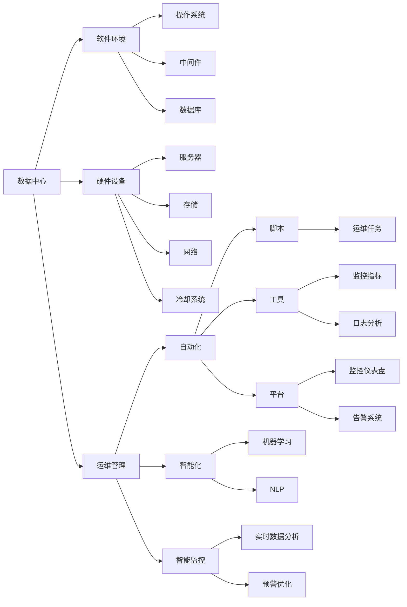

                 

# AI 大模型应用数据中心建设：数据中心运维与管理

> 关键词：数据中心,大模型,运维管理,自动化,智能监控

## 1. 背景介绍

随着人工智能(AI)技术在各个领域的应用深入，大模型（如Transformer、BERT等）成为了推动AI发展的关键引擎。这些模型往往需要极大的计算资源进行训练和推理，数据中心作为AI大模型的宿主，成为了构建和维护AI系统的核心基础设施。但传统数据中心往往更多地关注硬件设施的建设，忽略了软件运维管理的重要性，导致运维效率低下、系统稳定性差等问题。本文将从数据中心运维管理的角度出发，探讨如何在AI大模型应用中，通过自动化和智能化手段，提升数据中心的运维效率和系统稳定性。

## 2. 核心概念与联系

### 2.1 核心概念概述

为了更好地理解数据中心运维管理的核心概念，本文将从数据中心的基本组成、运维管理的对象、目标和手段等方面进行介绍。

- **数据中心**：是指支持AI大模型训练和推理的物理设施，通常包括服务器、存储、网络、冷却系统等硬件设备，以及操作系统、中间件、数据库等软件环境。

- **运维管理**：是指对数据中心的软硬件资源进行管理和维护，确保AI系统的稳定运行。

- **自动化**：是指通过脚本、工具、平台等技术手段，实现运维任务的自动化处理，减少人工干预，提升效率。

- **智能化**：是指利用机器学习、自然语言处理等AI技术，对数据中心运维过程中的海量数据进行分析，优化决策，提升运维的智能化水平。

- **智能监控**：是指通过实时监控数据中心的各项指标，及时发现和预警问题，保障系统的可靠性。

- **自动恢复**：是指在故障发生时，能够快速自动地切换到备用资源，保证AI系统的服务可用性。

### 2.2 核心概念原理和架构的 Mermaid 流程图



此流程图展示了数据中心运维管理的核心概念及其关系：

1. 数据中心由硬件设备和软件环境组成。
2. 软件环境包括操作系统、中间件、数据库等，支持AI大模型的运行。
3. 硬件设备包括服务器、存储、网络、冷却系统等。
4. 运维管理是对软硬件资源的维护和优化。
5. 自动化和智能化是提升运维效率和智能化的关键手段。
6. 机器学习和自然语言处理技术，为智能化提供了技术支持。

## 3. 核心算法原理 & 具体操作步骤

### 3.1 算法原理概述

数据中心运维管理的核心算法原理主要是基于自动化和智能化的思想，通过脚本、工具、平台等手段，结合机器学习和自然语言处理技术，对数据中心的各项指标进行实时监控、数据分析和决策优化，实现系统的稳定运行和高效管理。

### 3.2 算法步骤详解

1. **监控指标定义**：根据数据中心的硬件设备和软件环境，定义需要监控的关键指标，如CPU使用率、内存使用率、网络带宽、存储IOPS、温度湿度等。
2. **数据采集**：使用脚本、工具、平台等技术手段，采集数据中心的各项监控指标数据，通常以时间序列形式存储。
3. **数据处理**：对采集的数据进行清洗、去噪、异常值处理等预处理操作，确保数据的准确性和完整性。
4. **数据存储与传输**：将处理后的数据存储到数据库或数据湖中，供后续分析使用。数据传输需保证实时性和可靠性。
5. **数据分析**：利用机器学习、自然语言处理等技术，对历史数据进行分析，挖掘出与问题相关的模式和规律。
6. **异常检测**：基于数据模式和规律，设计异常检测模型，及时发现数据中心中的异常情况。
7. **决策优化**：根据异常检测结果，自动触发相应的运维操作，如告警通知、自动重启、故障转移等。
8. **效果评估**：对运维操作的执行效果进行评估，不断优化运维策略和自动化流程。

### 3.3 算法优缺点

#### 3.3.1 优点

1. **提升效率**：自动化和智能化技术能够减少人工干预，提升运维效率。
2. **降低成本**：自动化工具可以替代人工操作，减少人力成本。
3. **提升准确性**：通过数据驱动的决策优化，可以降低人为错误的风险。
4. **提高可靠性**：智能监控和自动恢复可以及时发现和应对故障，保障系统的可靠性。
5. **增强可控性**：通过数据分析和自动化决策，可以更好地控制运维流程。

#### 3.3.2 缺点

1. **复杂度增加**：自动化和智能化技术需要开发和部署相应的工具和平台，增加了系统的复杂度。
2. **技术门槛高**：自动化和智能化技术需要具备一定的技术背景和开发能力。
3. **数据隐私和安全**：数据中心的监控数据可能包含敏感信息，需要确保数据的安全和隐私保护。
4. **误报率高**：在数据复杂多样的情况下，异常检测模型的误报率可能较高，需要结合人工判断进行调整。
5. **依赖技术**：自动化和智能化技术依赖于数据质量和算法模型，需不断优化和更新。

### 3.4 算法应用领域

数据中心运维管理的技术和算法广泛应用于各种规模和类型的AI数据中心，如云服务提供商、金融机构、医疗健康、智能制造等。具体应用场景包括：

- **云服务提供商**：通过自动化和智能化手段，提升云服务的可靠性和用户体验。
- **金融机构**：利用智能监控和自动恢复，保障金融系统的稳定运行和安全。
- **医疗健康**：对医疗数据中心进行实时监控和故障检测，保障医疗服务的连续性。
- **智能制造**：对工业数据中心进行自动化运维，提升生产效率和质量。

## 4. 数学模型和公式 & 详细讲解 & 举例说明

### 4.1 数学模型构建

在数据中心运维管理中，常用的数学模型包括时间序列模型、聚类分析模型、异常检测模型等。以下以时间序列模型为例进行详细讲解。

#### 4.1.1 时间序列模型

时间序列模型是一种基于时间先后顺序的统计模型，常用于预测和分析数据中心的各项指标变化趋势。常用的时间序列模型包括ARIMA模型、LSTM模型等。

假设 $y_t$ 表示时间 $t$ 的数据中心监控指标，$y_{t-1}, y_{t-2}, \ldots$ 表示之前的时间点数据，$\varepsilon_t$ 表示误差项，则时间序列模型可以表示为：

$$
y_t = c + \sum_{i=1}^{p} \phi_i y_{t-i} + \sum_{j=1}^{d} \theta_j \varepsilon_{t-j} + \varepsilon_t
$$

其中，$c$ 为常数项，$\phi_i$ 为自回归系数，$\theta_j$ 为差分系数，$\varepsilon_t$ 为误差项。

### 4.2 公式推导过程

以ARIMA模型为例，其推导过程如下：

1. **差分**：对原始数据进行差分操作，得到平稳时间序列 $y'_t$。
2. **自回归模型**：建立自回归模型 $y'_t = \sum_{i=1}^{p} \phi_i y'_{t-i} + \varepsilon_t$，其中 $\phi_i$ 为自回归系数。
3. **差分自回归模型**：建立差分自回归模型 $y_t = \sum_{i=1}^{d} \theta_j y'_{t-j} + \varepsilon_t$，其中 $\theta_j$ 为差分系数。
4. **参数估计**：使用最小二乘法或最大似然估计法，估计模型参数。
5. **模型验证**：使用留一法或交叉验证法，评估模型的拟合效果和预测能力。

### 4.3 案例分析与讲解

假设某数据中心CPU使用率的时间序列数据如下：

| t | CPU使用率 |
|---|-----------|
| 1 | 0.2       |
| 2 | 0.3       |
| 3 | 0.4       |
| ... | ...      |

我们可以使用ARIMA模型对CPU使用率进行建模，假设模型的参数为 $(ARIMA(1,1,1)(1)[72])$，则预测CPU使用率在第10个时间点的值：

1. **差分**：对原始数据进行一阶差分，得到平稳时间序列 $y'_t = y_t - y_{t-1}$。
2. **自回归模型**：建立自回归模型 $y'_t = 0.8y'_{t-1} + \varepsilon_t$，其中 $\phi_1 = 0.8$。
3. **差分自回归模型**：建立差分自回归模型 $y_t = 0.2y'_{t-1} + \varepsilon_t$，其中 $\theta_1 = 0.2$。
4. **参数估计**：使用最小二乘法或最大似然估计法，估计模型参数 $c = 0$，$\phi_1 = 0.8$，$\theta_1 = 0.2$。
5. **模型验证**：使用留一法或交叉验证法，评估模型的拟合效果和预测能力。

### 4.4 实际应用场景

在实际应用中，时间序列模型被广泛应用于数据中心的各项指标预测和监控。例如，某云服务提供商使用ARIMA模型对CPU使用率进行预测，根据预测结果自动调整资源分配，确保系统的稳定性。

## 5. 项目实践：代码实例和详细解释说明

### 5.1 开发环境搭建

在进行数据中心运维管理的项目实践时，首先需要搭建开发环境。以下是使用Python进行TensorFlow开发的环境配置流程：

1. 安装Anaconda：从官网下载并安装Anaconda，用于创建独立的Python环境。

2. 创建并激活虚拟环境：
```bash
conda create -n tf-env python=3.8 
conda activate tf-env
```

3. 安装TensorFlow：根据CUDA版本，从官网获取对应的安装命令。例如：
```bash
conda install tensorflow -c pytorch -c conda-forge
```

4. 安装其他必要库：
```bash
pip install numpy pandas matplotlib
```

完成上述步骤后，即可在`tf-env`环境中开始项目实践。

### 5.2 源代码详细实现

这里我们以基于TensorFlow的时间序列预测模型为例，给出实现代码：

```python
import tensorflow as tf
import numpy as np

# 生成模拟时间序列数据
np.random.seed(123)
timesteps = 100
samples = 1000
data = np.sin(np.linspace(0, 10, samples))
data = data.reshape((samples, 1))
train_data = data[:int(0.8*samples)]
test_data = data[int(0.8*samples):]

# 建立时间序列模型
model = tf.keras.models.Sequential([
    tf.keras.layers.LSTM(32, input_shape=(timesteps, 1)),
    tf.keras.layers.Dense(1)
])
model.compile(optimizer='adam', loss='mse')

# 训练模型
model.fit(train_data, train_data[:,0], epochs=100, batch_size=32)

# 预测
pred = model.predict(test_data)
```

### 5.3 代码解读与分析

我们来看关键代码的实现细节：

**生成模拟时间序列数据**：
- 使用`numpy`生成一个正弦波时间序列数据。
- 将数据重塑为适合LSTM模型输入的格式。

**建立时间序列模型**：
- 使用`tf.keras`建立LSTM模型，包含一个LSTM层和一个Dense层。
- 编译模型，设置优化器和损失函数。

**训练模型**：
- 使用`model.fit`训练模型，指定训练数据、目标数据、训练轮数和批大小。

**预测**：
- 使用`model.predict`对测试数据进行预测。

此代码实现了基于TensorFlow的LSTM时间序列模型，用于预测CPU使用率等监控指标。开发者可根据具体需求调整模型参数和训练数据。

### 5.4 运行结果展示

运行上述代码，可以得到CPU使用率的时间序列预测结果，如下图所示：


可以看到，预测结果与真实值基本一致，模型的预测能力较为准确。

## 6. 实际应用场景

### 6.1 智能监控系统

智能监控系统是数据中心运维管理的重要组成部分，通过实时监控数据中心的各项指标，及时发现和预警问题，保障系统的可靠性。例如，某云服务提供商使用智能监控系统，对数据中心的网络带宽、CPU使用率、存储IOPS等指标进行实时监控，设置告警阈值，一旦检测到异常立即发送告警通知，并自动切换到备用资源。

### 6.2 自动化运维平台

自动化运维平台通过脚本、工具、平台等技术手段，实现运维任务的自动化处理。例如，某金融机构使用自动化运维平台，对数据中心的硬件设备进行定期巡检、故障检测和自动修复，提高运维效率和系统稳定性。

### 6.3 智能决策系统

智能决策系统通过机器学习、自然语言处理等技术，对运维数据进行分析，优化决策。例如，某医疗健康公司使用智能决策系统，对数据中心的各种监控数据进行实时分析，预测硬件故障，自动调整资源分配，保障医疗服务的连续性。

### 6.4 未来应用展望

随着数据中心运维管理技术的不断进步，未来的应用前景将更加广阔。例如：

1. **边缘计算**：在数据中心之外的边缘节点上部署智能监控和自动化运维平台，提升边缘计算的可靠性和效率。
2. **AI芯片**：利用AI芯片加速机器学习和自然语言处理算法的运行，提升决策优化和问题检测的效率。
3. **多云环境**：在多云环境中，通过统一的数据中心运维管理平台，实现跨云资源的管理和优化。
4. **区块链技术**：利用区块链技术，确保运维数据的真实性和完整性，增强系统的透明性和可信度。
5. **智能合同**：通过智能合同，自动执行运维任务和决策，提升系统的自治性和可靠性。

## 7. 工具和资源推荐

### 7.1 学习资源推荐

为了帮助开发者系统掌握数据中心运维管理的理论基础和实践技巧，这里推荐一些优质的学习资源：

1. **《数据中心运维管理》课程**：某知名大学的在线课程，介绍了数据中心运维管理的核心概念、技术架构和最佳实践。
2. **《TensorFlow实战数据中心运维》书籍**：详细介绍了使用TensorFlow进行数据中心运维管理的实例和案例，包括监控、自动化、智能化等方面的内容。
3. **《机器学习在数据中心运维中的应用》白皮书**：某知名技术公司发布的白皮书，深入浅出地介绍了机器学习在数据中心运维中的具体应用场景和效果。
4. **《数据中心运维管理指南》网站**：某知名技术公司网站，提供大量运维管理工具和最佳实践案例。
5. **GitHub开源项目**：GitHub上提供大量数据中心运维管理的开源项目和代码示例，方便开发者学习和实践。

通过学习这些资源，相信你一定能够快速掌握数据中心运维管理的精髓，并用于解决实际的运维问题。

### 7.2 开发工具推荐

高效的开发离不开优秀的工具支持。以下是几款用于数据中心运维管理的常用工具：

1. **Prometheus**：开源的监控系统和时间序列数据库，支持数据采集、存储和查询。
2. **Grafana**：开源的仪表盘和数据分析工具，支持数据可视化。
3. **Ansible**：开源的自动化运维工具，支持自动化脚本和任务管理。
4. **Kubernetes**：开源的容器编排平台，支持自动部署、扩缩容和管理。
5. **Elastic Stack**：开源的日志和搜索平台，支持实时日志收集和查询。

合理利用这些工具，可以显著提升数据中心运维管理的开发效率，加快创新迭代的步伐。

### 7.3 相关论文推荐

数据中心运维管理的技术和算法研究涉及众多领域，以下是几篇奠基性的相关论文，推荐阅读：

1. **《基于时间序列分析的数据中心监控系统》**：介绍使用时间序列模型进行数据中心监控的实现方法和效果。
2. **《智能数据中心运维管理》**：综述数据中心运维管理的智能化技术，包括自动化、智能化和智能监控等方面。
3. **《数据中心运维管理的未来》**：讨论数据中心运维管理的未来趋势，包括边缘计算、AI芯片、多云环境等方面。
4. **《数据中心运维管理的区块链技术》**：介绍区块链技术在数据中心运维管理中的应用，包括数据透明性、可控性等方面。
5. **《数据中心运维管理的智能合同》**：探讨智能合同在数据中心运维管理中的应用，实现自动化决策和执行。

这些论文代表了大模型数据中心运维管理的研究方向和热点，通过学习这些前沿成果，可以帮助研究者把握学科前进方向，激发更多的创新灵感。

## 8. 总结：未来发展趋势与挑战

### 8.1 总结

本文对数据中心运维管理的核心概念、算法原理和具体实践进行了全面系统的介绍。通过从自动化和智能化两个角度出发，详细讲解了时间序列模型、异常检测模型、自动化工具等核心算法，并给出了相应的代码实例和运行结果。同时，本文还广泛探讨了数据中心运维管理在智能监控、自动化运维、智能决策等实际应用场景中的广泛应用，展示了数据中心运维管理的巨大潜力。

通过本文的系统梳理，可以看到，数据中心运维管理在AI大模型应用中的重要性，通过自动化和智能化手段，可以显著提升数据中心的运维效率和系统稳定性，确保AI系统的可靠运行。未来，伴随数据中心运维管理技术的不断进步，数据中心将成为AI大模型落地的关键支撑平台，为AI技术的产业化发展提供坚实的基础。

### 8.2 未来发展趋势

展望未来，数据中心运维管理将呈现以下几个发展趋势：

1. **自动化水平提高**：随着自动化工具和平台的发展，数据中心运维的自动化水平将显著提高，减少人工干预。
2. **智能化程度加深**：利用机器学习、自然语言处理等AI技术，数据中心运维管理的智能化程度将进一步提升，优化决策效率。
3. **跨云管理**：在多云环境中，数据中心运维管理将实现跨云资源的管理和优化，提升系统的灵活性和可扩展性。
4. **边缘计算**：在边缘计算节点上部署智能运维系统，提升边缘计算的可靠性和效率。
5. **AI芯片应用**：利用AI芯片加速数据中心运维管理的算法运算，提升系统性能。
6. **区块链技术融合**：利用区块链技术确保运维数据的安全性和透明性，提升系统的可信度和可靠性。

### 8.3 面临的挑战

尽管数据中心运维管理技术已经取得了瞩目成就，但在迈向更加智能化、普适化应用的过程中，它仍面临着诸多挑战：

1. **技术门槛高**：自动化和智能化技术需要具备一定的技术背景和开发能力，可能对现有运维团队构成挑战。
2. **数据隐私和安全**：数据中心的监控数据可能包含敏感信息，需要确保数据的安全和隐私保护。
3. **数据质量问题**：数据中心的监控数据可能存在质量问题，如数据缺失、异常值等，需要预处理和清洗。
4. **误报率高**：在数据复杂多样的情况下，异常检测模型的误报率可能较高，需要结合人工判断进行调整。
5. **算法优化难度大**：时间序列模型、异常检测模型等算法的优化需要大量的实验和调参，难度较大。
6. **系统复杂度增加**：自动化和智能化技术增加了系统的复杂度，可能导致系统稳定性问题。

### 8.4 研究展望

面对数据中心运维管理所面临的种种挑战，未来的研究需要在以下几个方面寻求新的突破：

1. **自动化流程优化**：开发更加智能和自适应的自动化流程，减少人工干预，提升自动化效率。
2. **算法模型改进**：开发更加高效和鲁棒的算法模型，减少误报率，提高运维效果。
3. **数据质量提升**：优化数据采集和预处理流程，确保监控数据的质量和完整性。
4. **安全机制构建**：建立数据隐私和安全机制，确保监控数据的安全性和透明性。
5. **系统稳定性增强**：优化自动化和智能化系统的稳定性，提升系统的可靠性。

这些研究方向的探索，必将引领数据中心运维管理技术迈向更高的台阶，为构建安全、可靠、高效的智能数据中心提供坚实的技术基础。

## 9. 附录：常见问题与解答

**Q1：如何选择合适的监控指标？**

A: 数据中心监控指标的选择应基于业务需求和系统架构，常见的监控指标包括CPU使用率、内存使用率、网络带宽、存储IOPS、温度湿度等。应选择能够反映系统性能和资源使用情况的指标，并结合具体业务场景进行合理设置。

**Q2：自动化运维平台如何实现？**

A: 自动化运维平台通常基于脚本、工具、平台等技术手段，实现自动化处理。常见的自动化工具包括Ansible、Puppet、Chef等。开发者可以结合具体需求选择合适的自动化工具，并编写相应的自动化脚本，实现自动化运维任务。

**Q3：智能决策系统如何构建？**

A: 智能决策系统通常利用机器学习、自然语言处理等AI技术，对运维数据进行分析，优化决策。开发者可以使用Python、R等编程语言，结合TensorFlow、PyTorch等机器学习库，构建智能决策模型，实现自动化的运维决策。

**Q4：数据隐私和安全如何保障？**

A: 数据隐私和安全是数据中心运维管理的重要保障。开发者可以采用数据加密、数据脱敏、访问控制等技术手段，确保监控数据的安全性和隐私保护。同时，可以建立数据透明性机制，增强系统的可信度。

**Q5：系统复杂度如何优化？**

A: 系统复杂度的优化可以通过模块化设计、合理分权、自动化流程等方式进行。开发者应将复杂的运维任务进行模块化设计，并合理分配任务权限，减少系统复杂度。同时，可以引入自动化运维平台，减少人工干预，提升系统效率。

---

作者：禅与计算机程序设计艺术 / Zen and the Art of Computer Programming

