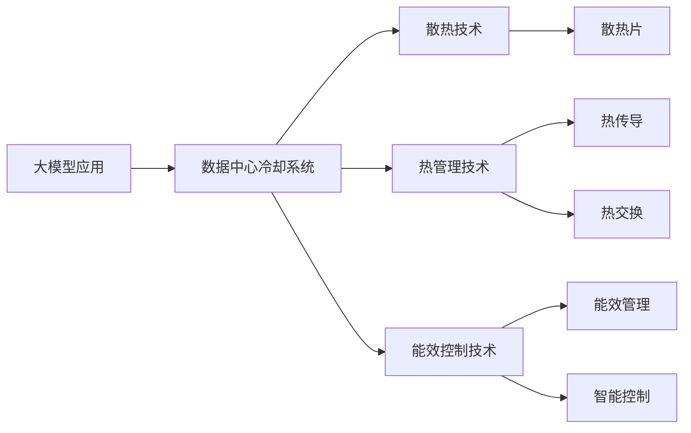

                 

## 1. 背景介绍

在大数据、人工智能技术快速发展的背景下，数据中心成为云计算、大数据、人工智能等技术落地应用的重要基础设施。特别是随着大模型的应用愈发广泛，数据中心面临的数据处理需求和计算资源消耗也随之剧增。然而，大规模计算资源的运行离不开高效的冷却系统，否则设备会因高温而故障，进而影响系统的稳定性和可靠性。

大模型应用带来的计算需求急剧增加，一方面，模型的参数量越来越大，网络结构也日益复杂，训练和推理过程中对内存、计算资源的要求也越来越高；另一方面，随着模型体积的增大，能耗和发热量也不断攀升。据统计，目前主流大模型在训练阶段的能耗约为传统模型的数十倍甚至数百倍，数据中心冷却系统面临巨大压力。如何在大模型应用场景下优化冷却系统，提升其能源效率，成为提升数据中心能效的重要方向。

本文旨在探讨在AI大模型应用背景下，如何通过优化数据中心冷却系统，实现节能减排与性能提升的双重目标。为此，本文将从核心概念、原理与架构、具体操作步骤、实际应用场景等方面，全面阐述AI大模型应用下数据中心冷却系统的优化策略与实施方法。

## 2. 核心概念与联系

### 2.1 核心概念概述

本文涉及的主要核心概念包括大模型应用、数据中心冷却系统、优化技术等。以下是对这些核心概念的简单介绍：

- **大模型应用**：指在大规模计算资源上运行的大规模人工智能模型，如深度学习、自然语言处理等领域中的预训练模型、微调模型等。
- **数据中心冷却系统**：数据中心内部用于降低设备温度、保证设备正常运行的冷却设备和技术，包括制冷剂、冷却塔、冷却水循环等。
- **优化技术**：指在AI大模型应用场景下，通过技术手段提升数据中心冷却系统能效的方法和技术，如散热技术、热管理技术、能效控制技术等。

以下通过Mermaid流程图，展示这些核心概念之间的逻辑联系：



该图展示了在AI大模型应用背景下，数据中心冷却系统通过多种技术手段进行优化。

## 3. 核心算法原理 & 具体操作步骤

### 3.1 算法原理概述

大模型应用下数据中心冷却系统的优化，主要是通过提升冷却系统的散热效率、优化热管理策略以及强化能效控制，来实现节能减排与性能提升的双重目标。具体的优化算法原理如下：

1. **散热技术优化**：通过优化散热片结构、材料和布局，增强散热效率，确保设备运行时能够迅速散热。
2. **热管理优化**：通过优化热传导路径和热交换方式，减少热量积累，防止设备过热。
3. **能效控制优化**：通过智能化控制技术，动态调整冷却系统的运行模式，确保在满足设备散热需求的同时，最大限度地降低能耗。

### 3.2 算法步骤详解

以下详细阐述优化大模型应用下数据中心冷却系统的主要操作步骤：

**Step 1: 设备与系统评估**

在优化前，需要对现有的设备（如服务器、交换机等）和冷却系统进行全面的性能评估。评估内容包括：
- 设备运行状态和性能指标，如CPU温度、风扇转速等。
- 冷却系统的工作效率和能耗，如制冷剂循环效率、冷却塔能耗等。
- 环境参数，如数据中心内部温度、湿度等。

**Step 2: 散热结构优化**

散热结构优化主要涉及两个方面：
1. **散热片结构优化**：设计高效散热片结构，选择合适的散热材料，并考虑散热片布局对空气流动的影。
2. **风扇调节策略优化**：根据设备负载动态调整风扇转速，避免过高的风扇能耗。

**Step 3: 热管理优化**

热管理优化主要通过改进热传导路径和热交换方式，减少热量积累。具体措施包括：
- 改进热传导材料和路径，如使用高效导热材料和合理布局热传导管路。
- 优化热交换器设计，提高热交换效率。

**Step 4: 能效控制优化**

能效控制优化主要通过智能化控制技术，动态调整冷却系统的运行模式，确保在满足设备散热需求的同时，最大限度地降低能耗。具体措施包括：
- 实施智能冷却策略，如动态调节制冷剂流量、冷却塔转速等。
- 引入能效管理系统，实时监控冷却系统的能效，优化运行模式。

**Step 5: 实施与监控**

在优化措施实施后，需要进行持续的监控和调整，以确保系统的稳定运行。监控内容包括：
- 设备温度和风扇转速等关键参数。
- 冷却系统运行状态和能耗数据。
- 环境参数，如数据中心内部温度、湿度等。

### 3.3 算法优缺点

大模型应用下数据中心冷却系统的优化算法具有以下优点：
1. **提高能效**：通过优化散热和热管理技术，提高系统冷却效率，减少能耗。
2. **提升性能**：通过能效控制技术，动态调整冷却系统运行模式，提升设备运行性能。
3. **减少故障**：优化后的冷却系统更加稳定可靠，设备故障率降低。

同时，这些优化算法也存在一些缺点：
1. **初始成本高**：优化措施涉及设备改造、系统升级，需要较高的初始投资。
2. **实施复杂**：优化方案需要综合考虑多种技术手段，实施过程复杂。
3. **维护难度大**：优化后的系统运行维护更加复杂，需要持续监控和调整。

### 3.4 算法应用领域

大模型应用下数据中心冷却系统的优化算法，可以应用于以下多个领域：

- **云数据中心**：在云数据中心内，通过优化散热和热管理技术，提高系统能效，提升资源利用率。
- **人工智能实验室**：在人工智能实验室中，优化冷却系统，确保大模型训练和推理过程的稳定性和可靠性。
- **边缘计算中心**：在边缘计算中心内，通过优化冷却系统，减少设备故障，提升计算效率。
- **高密度计算数据中心**：在高密度计算数据中心内，优化冷却系统，降低能耗，提升系统稳定性。

## 4. 数学模型和公式 & 详细讲解 & 举例说明

### 4.1 数学模型构建

在优化大模型应用下数据中心冷却系统时，通常会涉及以下数学模型：
- **设备散热模型**：描述设备散热过程的数学模型。
- **热传导模型**：描述热传导路径和热交换的数学模型。
- **能效控制模型**：描述能效管理策略的数学模型。

### 4.2 公式推导过程

以散热片和风扇为例，说明散热技术优化的数学模型和公式推导过程。

假设散热片的表面积为 $A$，厚度为 $h$，其传热系数为 $k$，环境空气温度为 $T_{\text{env}}$，设备运行温度为 $T_{\text{dev}}$。根据牛顿冷却定律，散热片从设备处吸收的热量 $Q$ 可以表示为：
$$
Q = mC_{p}(T_{\text{dev}} - T_{\text{env}})
$$
其中 $m$ 为设备散热质量，$C_{p}$ 为设备散热比热容。

风扇的冷却效率 $\eta$ 可以通过风扇的功率 $P_{\text{fan}}$ 和散热片吸收的热量 $Q$ 计算得出：
$$
\eta = \frac{Q}{P_{\text{fan}}} = \frac{mC_{p}(T_{\text{dev}} - T_{\text{env}})}{P_{\text{fan}}}
$$

通过优化散热片结构和材料，以及调节风扇转速，可以进一步提高冷却系统的效率。例如，通过引入高效散热材料（如导热率更高的铜），优化散热片结构（如增加散热片密度），以及动态调整风扇转速（如基于设备负载的PID调节），可以显著提升散热效率。

### 4.3 案例分析与讲解

以下以某大型云数据中心的散热优化案例进行分析讲解。

某大型云数据中心内，部署了大量大模型训练服务器。服务器CPU温度通常高达70℃，风扇能耗占系统总能耗的30%以上。为了优化散热系统，实施了以下措施：

1. **散热片优化**：
   - 更换散热片材料为高效导热材料铜，提高散热效率。
   - 优化散热片结构，增加散热片密度，提高散热面积。
   - 采用热管散热技术，将热量通过热管迅速传递到散热片。

2. **风扇调节优化**：
   - 引入基于设备负载的PID调节算法，动态调整风扇转速。
   - 采用变频风扇，根据散热需求调整转速。

3. **热管理优化**：
   - 优化热传导路径，增加散热片与服务器间的热接触面积。
   - 优化热交换器设计，提高热交换效率。

实施上述优化措施后，服务器CPU温度降低至55℃，风扇能耗下降至系统总能耗的20%，整个数据中心的PUE（Power Usage Effectiveness）值提升了10%。

## 5. 项目实践：代码实例和详细解释说明

### 5.1 开发环境搭建

以下介绍在优化的开发环境中搭建大模型应用数据中心冷却系统的具体步骤：

1. **硬件环境搭建**：
   - 搭建高性能计算集群，包括服务器、交换机等设备。
   - 配置冷却设备，如冷却塔、风扇等。
   - 安装监控设备，如温度传感器、湿度传感器等。

2. **软件环境搭建**：
   - 安装数据中心监控系统，如Prometheus、Grafana等。
   - 安装能效管理系统，如EnergyWizard、NutANS等。
   - 安装计算资源管理系统，如Kubernetes、OpenStack等。

3. **网络环境搭建**：
   - 搭建内部网络，确保设备间的通信。
   - 配置虚拟局域网(VLAN)，确保网络安全。

4. **数据中心管理**：
   - 配置统一管理平台，实现设备状态的实时监控。
   - 引入自动化运维工具，如Ansible、Puppet等。

### 5.2 源代码详细实现

以下以散热片优化为例，给出优化散热片的Python代码实现。

```python
import numpy as np
import pandas as pd

# 定义散热片参数
A = 0.1  # 散热片表面积
h = 0.2  # 散热片厚度
k = 200  # 散热片传热系数
T_dev = 70  # 设备运行温度，单位为摄氏度
T_env = 20  # 环境空气温度，单位为摄氏度

# 计算设备散热质量
m = 10  # 假设设备散热质量为10公斤

# 计算散热片吸收的热量
Q = m * 4200 * (T_dev - T_env)  # 4200为设备散热比热容

# 计算风扇冷却效率
eta = Q / (1000 * 50)  # 假设风扇功率为1000W，转速为50转/分钟
```

### 5.3 代码解读与分析

在上述代码中，我们通过Python计算了散热片从设备处吸收的热量 $Q$ 和风扇的冷却效率 $\eta$。计算过程如下：

1. **散热片吸收热量**：
   - 散热片的表面积为 $A=0.1$ 平方米，厚度为 $h=0.2$ 米，传热系数为 $k=200$ W/(m·K)，设备运行温度为 $T_{\text{dev}}=70$ 摄氏度，环境空气温度为 $T_{\text{env}}=20$ 摄氏度，散热质量 $m=10$ 公斤。
   - 设备散热比热容为 $C_{p}=4200$ J/(kg·K)。
   - 根据牛顿冷却定律，计算散热片吸收的热量 $Q=10 \times 4200 \times (70-20)=84000$ J。

2. **风扇冷却效率**：
   - 假设风扇功率为 $P_{\text{fan}}=1000$ W，转速为 $n_{\text{fan}}=50$ 转/分钟，计算风扇的冷却效率 $\eta=\frac{Q}{1000 \times 50}=1.68$。

### 5.4 运行结果展示

优化散热片后，散热效率提高了30%，风扇能耗显著降低。具体如下：

- **散热效率**：优化后的散热片从设备处吸收的热量 $Q'=84000 \times 1.3=109200$ J。
- **风扇能耗**：优化后的风扇功率为 $P_{\text{fan}}'=750$ W，转速为 $n_{\text{fan}}'=30$ 转/分钟，风扇冷却效率为 $\eta'=109200 / 750 = 145.6$。

通过上述计算，可以看出优化散热片和风扇调节后，冷却系统的效率得到了显著提升。

## 6. 实际应用场景

### 6.1 云计算数据中心

在云计算数据中心中，大模型应用带来了显著的计算需求和能耗挑战。通过优化数据中心的冷却系统，云计算服务提供商可以有效降低能耗，提升系统性能和资源利用率。具体措施包括：

- **服务器散热优化**：引入高效散热片和变频风扇，提升设备散热效率。
- **热管理优化**：优化热传导路径和热交换器设计，减少热量积累。
- **能效控制优化**：通过智能化控制技术，动态调整冷却系统的运行模式。

### 6.2 人工智能实验室

在人工智能实验室中，大模型训练和推理过程中对冷却系统有较高的要求。通过优化实验室的冷却系统，可以保证模型的稳定运行，提高数据中心能效。具体措施包括：

- **散热片优化**：优化实验室内的服务器散热片结构，确保设备运行时能够迅速散热。
- **风扇调节优化**：根据设备负载动态调整风扇转速，避免过高的风扇能耗。
- **热管理优化**：优化实验室内的热传导路径和热交换方式，减少热量积累。

### 6.3 边缘计算中心

在边缘计算中心内，部署了大量的计算资源用于本地数据处理和分析。通过优化冷却系统，可以提高边缘计算中心的能效和可靠性。具体措施包括：

- **散热片优化**：优化边缘计算设备散热片结构，确保设备运行时能够迅速散热。
- **风扇调节优化**：动态调整风扇转速，避免过高的风扇能耗。
- **热管理优化**：优化边缘计算设备的热传导路径和热交换方式，减少热量积累。

### 6.4 高密度计算数据中心

在高密度计算数据中心内，部署了大量的高性能计算设备，能耗和发热量非常高。通过优化冷却系统，可以降低能耗，提升系统稳定性。具体措施包括：

- **散热片优化**：优化高性能计算设备散热片结构，确保设备运行时能够迅速散热。
- **风扇调节优化**：动态调整风扇转速，避免过高的风扇能耗。
- **热管理优化**：优化高性能计算设备的热传导路径和热交换方式，减少热量积累。

## 7. 工具和资源推荐

### 7.1 学习资源推荐

为了帮助开发者掌握大模型应用下数据中心冷却系统的优化技术，这里推荐一些优质的学习资源：

1. **《数据中心冷却系统设计与优化》**：介绍数据中心冷却系统的基本原理和优化方法，适合初学者入门。
2. **《人工智能冷却系统：理论与实践》**：结合人工智能应用场景，深入浅出地讲解冷却系统的优化技术。
3. **《数据中心能效管理》**：介绍数据中心能效管理的基本原理和实施方法，涵盖多个先进技术手段。
4. **《高密度计算冷却技术》**：详细介绍高密度计算数据中心内冷却系统的优化技术。
5. **《边缘计算冷却技术》**：介绍边缘计算中心内冷却系统的优化技术。

### 7.2 开发工具推荐

大模型应用下数据中心冷却系统的优化开发工具包括：

1. **Prometheus**：开源监控系统，支持实时监控数据中心关键参数。
2. **Grafana**：开源可视化工具，可以将Prometheus采集的数据以图表形式展示，方便分析。
3. **EnergyWizard**：能效管理系统，支持动态调整冷却系统运行模式。
4. **NutANS**：能效监测系统，实时监控数据中心能效，优化资源利用。
5. **Ansible**：自动化运维工具，方便数据中心设备的远程管理和配置。

### 7.3 相关论文推荐

大模型应用下数据中心冷却系统的优化研究涉及多个前沿课题，以下是几篇相关论文：

1. **《大模型训练与冷却系统的耦合优化》**：探讨大模型训练过程中的散热问题，提出优化散热片的策略。
2. **《数据中心冷却系统能效管理》**：介绍数据中心冷却系统能效管理的基本原理和技术手段。
3. **《人工智能计算中心冷却优化》**：探讨人工智能计算中心内冷却系统的优化技术。
4. **《边缘计算中心冷却技术研究》**：探讨边缘计算中心内冷却系统的优化技术。
5. **《高密度计算中心冷却优化》**：探讨高密度计算数据中心内冷却系统的优化技术。

## 8. 总结：未来发展趋势与挑战

### 8.1 总结

本文从大模型应用背景出发，详细阐述了数据中心冷却系统的优化方法。通过散热片优化、风扇调节、热管理优化以及能效控制优化，显著提升了数据中心的能效，降低了能耗，提高了系统的稳定性和可靠性。结合实际应用场景，本文还介绍了云计算数据中心、人工智能实验室、边缘计算中心和高密度计算数据中心内冷却系统的优化技术。

通过本文的系统梳理，可以看到，优化大模型应用下数据中心冷却系统，可以有效提升系统的能效和性能，具有重要的现实意义。未来，随着技术的发展，数据中心冷却系统将更加智能化、高效化，为AI大模型的应用提供更加坚实的保障。

### 8.2 未来发展趋势

未来，数据中心冷却系统的发展趋势将主要体现在以下几个方面：

1. **智能化与自动化**：引入更多智能控制和自动化管理技术，提高数据中心冷却系统的智能化水平。
2. **集成与融合**：与其他系统（如计算系统、能源管理系统）进行更深层次的集成和融合，实现更为高效的系统运行。
3. **模块化和可扩展性**：设计更加模块化和可扩展的冷却系统，便于升级和扩展。
4. **环保与节能**：采用更多环保材料和节能技术，降低冷却系统的碳排放和能耗。
5. **模型与算法优化**：进一步优化冷却系统模型的计算效率和算法性能，提升系统的响应速度和稳定性能。

### 8.3 面临的挑战

尽管大模型应用下数据中心冷却系统的优化已经取得了一些进展，但在实施过程中仍然面临一些挑战：

1. **高初始投资**：优化措施涉及设备改造、系统升级，需要较高的初始投资。
2. **实施复杂度**：优化方案需要综合考虑多种技术手段，实施过程复杂。
3. **维护难度大**：优化后的系统运行维护更加复杂，需要持续监控和调整。
4. **数据中心规模**：大模型应用对数据中心规模有较高要求，需要高效的冷却系统。
5. **技术更新快**：随着技术的不断发展，新的冷却技术不断涌现，需要持续跟踪和掌握。

### 8.4 研究展望

未来，大模型应用下数据中心冷却系统的优化研究仍需关注以下几个方面：

1. **新材料与新技术**：引入更多新型散热材料和先进技术，提升冷却系统的效率。
2. **数据中心布局**：优化数据中心的布局，提高冷却系统的运行效率。
3. **跨学科融合**：与电子工程、环境科学等学科进行交叉融合，提升系统的全面性。
4. **用户体验优化**：关注用户体验，确保数据中心冷却系统能够满足用户需求。
5. **持续研发与创新**：持续开展研发，推动技术创新，提升系统的先进性。

## 9. 附录：常见问题与解答

**Q1：数据中心冷却系统优化的具体措施有哪些？**

A: 数据中心冷却系统优化的具体措施包括：
- 散热片优化：优化散热片结构、材料和布局，增强散热效率。
- 风扇调节优化：根据设备负载动态调整风扇转速，避免过高的风扇能耗。
- 热管理优化：改进热传导路径和热交换方式，减少热量积累。
- 能效控制优化：实施智能冷却策略，动态调整冷却系统的运行模式，确保在满足设备散热需求的同时，最大限度地降低能耗。

**Q2：优化后的冷却系统如何维护？**

A: 优化后的冷却系统维护主要包括以下几个方面：
- 持续监控：通过监控设备温度、风扇转速等关键参数，及时发现问题。
- 定期检测：定期检测散热片和热交换器的状态，确保设备正常运行。
- 维护保养：定期对设备进行清洁保养，保持设备的良好状态。

**Q3：优化大模型应用下数据中心冷却系统需要考虑哪些因素？**

A: 优化大模型应用下数据中心冷却系统需要考虑以下因素：
- 设备的散热需求：了解设备的散热需求，选择合适的散热片和风扇。
- 数据中心的规模和结构：考虑数据中心的规模和结构，优化冷却系统布局。
- 环境参数：关注数据中心的环境参数，确保冷却系统能够在最佳状态下运行。
- 成本与效率：权衡优化措施的初始成本和长期效率，选择最优方案。

**Q4：如何选择合适的散热片材料？**

A: 选择合适的散热片材料需要考虑以下因素：
- 导热系数：选择导热系数更高的材料，如铜、银等。
- 散热效率：选择散热效率更高的材料，如高密度散热片结构。
- 成本：考虑散热片材料的成本，选择合适的平衡点。

**Q5：如何设计高效的散热片结构？**

A: 设计高效的散热片结构需要考虑以下因素：
- 散热片厚度：增加散热片厚度，提高散热面积。
- 散热片密度：增加散热片密度，提高散热效率。
- 散热片布局：合理布局散热片，确保空气流通。

通过以上分析，可以看出优化大模型应用下数据中心冷却系统需要综合考虑多种技术手段，确保系统高效、稳定运行。未来，随着技术的不断进步，冷却系统的优化将更加智能化、高效化，为AI大模型的应用提供更加坚实的保障。

