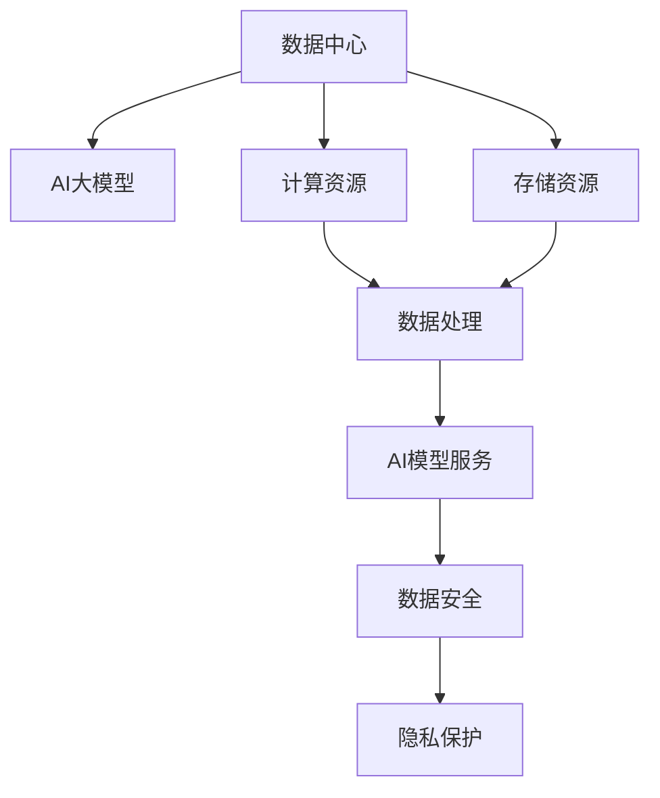

                 

# AI 大模型应用数据中心的商业模式

> 关键词：AI 大模型，商业模型，数据中心，应用场景，技术栈，商业化，利润模式，云服务，数据安全，隐私保护

## 1. 背景介绍

### 1.1 问题由来

随着人工智能（AI）技术的快速发展，特别是大模型的出现，企业对AI技术的依赖日益增强。AI大模型在自然语言处理（NLP）、计算机视觉（CV）、语音识别（ASR）等领域展现了强大的能力。然而，大模型的训练和部署需要大量的计算资源和存储资源，这对传统的数据中心构成了巨大的挑战。

数据中心需要面对的问题包括：

- 如何高效管理大量的数据和模型。
- 如何提供高性能的计算和存储资源。
- 如何降低成本和提升用户体验。
- 如何保护用户隐私和数据安全。

### 1.2 问题核心关键点

数据中心在AI大模型应用中的核心关键点包括：

- 数据管理：高效存储、处理、检索和更新数据。
- 模型管理：高效训练、部署、监控和管理模型。
- 计算资源管理：高效分配、调度和优化计算资源。
- 安全性：保护数据和模型的安全，防止未授权访问。
- 隐私保护：保护用户隐私，避免数据泄露。
- 性能优化：提升数据中心整体性能，降低延迟和成本。

这些关键点涉及到数据中心技术栈的各个方面，需要综合运用云计算、大数据、AI和网络技术，才能构建高效、安全、可靠的AI数据中心。

## 2. 核心概念与联系

### 2.1 核心概念概述

为了更好地理解AI大模型应用数据中心的商业模式，我们需要介绍一些核心概念：

- **数据中心**：是数据存储、管理和处理的物理或虚拟平台。数据中心通过提供高性能的计算和存储资源，支持企业运行各种应用。
- **AI大模型**：指在大规模数据上预训练的大型神经网络模型，如GPT-3、BERT等。这些模型可以应用于自然语言处理、计算机视觉等多个领域。
- **商业模型**：指企业通过数据中心提供AI大模型的应用服务，实现盈利的方式。
- **计算资源**：指数据中心提供的高性能计算资源，如GPU、CPU、内存等。
- **存储资源**：指数据中心提供的存储资源，如硬盘、SSD等。
- **安全性**：指数据中心保护数据和模型的安全，防止未授权访问。
- **隐私保护**：指数据中心保护用户隐私，避免数据泄露。

这些核心概念之间的逻辑关系可以通过以下Mermaid流程图来展示：



这个流程图展示了数据中心与AI大模型的关系，以及它们与计算资源、存储资源、安全性、隐私保护等概念之间的联系。

## 3. 核心算法原理 & 具体操作步骤

### 3.1 算法原理概述

AI大模型应用数据中心的商业模式主要基于云计算和大数据技术，提供高效的计算和存储资源，支持企业使用AI大模型进行应用开发和部署。

AI大模型应用数据中心的商业模式核心算法原理如下：

- **云计算**：利用分布式计算和存储资源，提供弹性、按需的计算和存储服务。
- **大数据**：利用分布式存储和计算技术，支持大规模数据的存储、处理和分析。
- **AI模型服务**：提供高效的AI模型训练、部署、推理服务，支持企业使用AI大模型进行应用开发和部署。
- **安全性**：提供数据和模型的安全保护，防止未授权访问和数据泄露。
- **隐私保护**：采用隐私保护技术，如数据匿名化、差分隐私等，保护用户隐私。

### 3.2 算法步骤详解

AI大模型应用数据中心的商业模式通常包括以下几个关键步骤：

**Step 1: 数据中心建设**

- 建设高性能的计算和存储资源。
- 采用分布式存储和计算技术，支持大规模数据存储和处理。
- 部署安全性和隐私保护措施，确保数据和模型的安全。

**Step 2: 数据管理**

- 设计高效的数据存储和检索机制。
- 采用数据压缩、数据分片等技术，提高数据存储和处理的效率。
- 采用分布式计算技术，支持大规模数据的并行处理。

**Step 3: 模型管理**

- 部署高效的AI模型训练和推理服务。
- 采用自动化模型管理技术，如模型版本控制、模型监控等，支持模型的快速部署和更新。
- 提供灵活的模型调度策略，支持不同业务场景的模型应用。

**Step 4: 服务部署**

- 提供高效的AI模型服务接口，支持企业使用AI大模型进行应用开发和部署。
- 支持多种编程语言和框架，提供灵活的应用开发环境。
- 提供高效的应用部署和扩展机制，支持大规模应用的部署和扩展。

**Step 5: 性能优化**

- 采用高效的计算和存储优化技术，提升数据中心的整体性能。
- 采用弹性计算资源管理技术，支持不同业务场景的资源需求。
- 采用网络优化技术，降低网络延迟和带宽消耗。

### 3.3 算法优缺点

AI大模型应用数据中心的商业模式具有以下优点：

- 高效利用计算和存储资源。采用分布式计算和存储技术，支持大规模数据的存储和处理，提高计算效率。
- 支持高效的AI模型训练和推理。采用自动化模型管理技术，支持模型的快速部署和更新，提高模型应用的灵活性和可靠性。
- 支持多样化的应用开发和部署。提供灵活的应用开发环境，支持多种编程语言和框架，方便企业进行应用开发和部署。
- 提供完善的安全和隐私保护措施。采用安全性和隐私保护技术，保护数据和模型的安全，确保用户隐私。

同时，这种商业模式也存在一些缺点：

- 建设成本较高。建设高性能的计算和存储资源，需要投入大量的硬件和软件资源。
- 运维复杂度较高。需要建立完善的数据中心运维机制，确保数据中心的高可用性和稳定性。
- 技术门槛较高。需要具备先进的大数据、云计算和AI技术，才能有效管理和应用AI大模型。

### 3.4 算法应用领域

AI大模型应用数据中心的商业模式在多个领域都有广泛的应用，如：

- **金融**：支持金融企业使用AI大模型进行风险评估、信用评分、欺诈检测等应用。
- **医疗**：支持医疗机构使用AI大模型进行疾病诊断、患者管理、医疗影像分析等应用。
- **零售**：支持零售企业使用AI大模型进行客户推荐、库存管理、销售预测等应用。
- **制造**：支持制造业企业使用AI大模型进行质量检测、设备维护、供应链优化等应用。
- **交通**：支持交通企业使用AI大模型进行交通流量分析、智能导航、事故预测等应用。

这些领域的应用场景展示了AI大模型在实际业务中的广泛应用和巨大价值。

## 4. 数学模型和公式 & 详细讲解  
### 4.1 数学模型构建

在AI大模型应用数据中心的商业模式中，涉及到多个数学模型，如云计算模型、大数据模型、AI模型服务等。以下我们以云计算模型和大数据模型为例，进行详细讲解。

### 4.2 公式推导过程

#### 云计算模型

云计算模型主要涉及资源分配和调度。资源分配的数学模型可以表示为：

$$
\min_{x} \text{cost}(x) = \sum_{i} c_i x_i
$$

其中，$x_i$ 表示第 $i$ 个计算资源（如CPU、GPU）的数量，$c_i$ 表示第 $i$ 个资源的单位成本。

资源调度的数学模型可以表示为：

$$
\max_{x} \text{performance}(x) = \sum_{i} p_i x_i
$$

其中，$p_i$ 表示第 $i$ 个计算资源的处理能力。

#### 大数据模型

大数据模型主要涉及数据存储和处理。数据存储的数学模型可以表示为：

$$
\min_{x} \text{cost}(x) = \sum_{i} c_i x_i
$$

其中，$x_i$ 表示第 $i$ 个存储设备（如硬盘、SSD）的数量，$c_i$ 表示第 $i$ 个设备的单位成本。

数据处理的数学模型可以表示为：

$$
\max_{x} \text{performance}(x) = \sum_{i} p_i x_i
$$

其中，$p_i$ 表示第 $i$ 个计算设备的处理能力。

### 4.3 案例分析与讲解

以一个典型的电商零售企业为例，使用AI大模型应用数据中心进行客户推荐应用。假设该企业每天需要处理1T数据，并使用10个GPU进行模型训练。

**数据中心建设**

- 采用分布式存储技术，如Hadoop、Spark等，支持大规模数据的存储和处理。
- 采用高性能的计算资源，如AWS EC2、阿里云ECS等，提供高效的计算和存储服务。
- 部署安全性和隐私保护措施，确保数据和模型的安全。

**数据管理**

- 设计高效的数据存储和检索机制，如Hadoop的HDFS分布式文件系统。
- 采用数据压缩和数据分片技术，提高数据存储和处理的效率。
- 采用分布式计算技术，如Spark的MapReduce分布式计算框架，支持大规模数据的并行处理。

**模型管理**

- 部署高效的AI模型训练和推理服务，如TensorFlow、PyTorch等。
- 采用自动化模型管理技术，如TensorFlow Model Garden的模型版本控制、Kubeflow的模型监控等，支持模型的快速部署和更新。
- 提供灵活的模型调度策略，支持不同业务场景的模型应用。

**服务部署**

- 提供高效的AI模型服务接口，支持客户使用AI大模型进行应用开发和部署。
- 支持多种编程语言和框架，如Python、Java、C++等，提供灵活的应用开发环境。
- 提供高效的应用部署和扩展机制，如Docker容器、Kubernetes容器编排等，支持大规模应用的部署和扩展。

**性能优化**

- 采用高效的计算和存储优化技术，如数据压缩、数据分片等，提升数据中心的整体性能。
- 采用弹性计算资源管理技术，如Amazon EC2的按需计算资源管理，支持不同业务场景的资源需求。
- 采用网络优化技术，如CDN、负载均衡等，降低网络延迟和带宽消耗。

## 5. 项目实践：代码实例和详细解释说明
### 5.1 开发环境搭建

在进行AI大模型应用数据中心的商业模式实践前，我们需要准备好开发环境。以下是使用Python进行PyTorch开发的环境配置流程：

1. 安装Anaconda：从官网下载并安装Anaconda，用于创建独立的Python环境。

2. 创建并激活虚拟环境：
```bash
conda create -n pytorch-env python=3.8 
conda activate pytorch-env
```

3. 安装PyTorch：根据CUDA版本，从官网获取对应的安装命令。例如：
```bash
conda install pytorch torchvision torchaudio cudatoolkit=11.1 -c pytorch -c conda-forge
```

4. 安装Transformers库：
```bash
pip install transformers
```

5. 安装各类工具包：
```bash
pip install numpy pandas scikit-learn matplotlib tqdm jupyter notebook ipython
```

完成上述步骤后，即可在`pytorch-env`环境中开始商业模式实践。

### 5.2 源代码详细实现

这里我们以一个简单的电商推荐系统为例，给出使用PyTorch进行AI大模型应用数据中心开发的PyTorch代码实现。

首先，定义推荐系统的训练数据和模型：

```python
import torch
import torch.nn as nn
import torch.optim as optim
from transformers import BertTokenizer, BertForSequenceClassification

# 定义模型结构
class BertRecommender(nn.Module):
    def __init__(self, num_classes):
        super(BertRecommender, self).__init__()
        self.bert = BertForSequenceClassification.from_pretrained('bert-base-cased', num_labels=num_classes)
        self.fc = nn.Linear(768, num_classes)

    def forward(self, input_ids, attention_mask, labels):
        outputs = self.bert(input_ids, attention_mask=attention_mask, labels=labels)
        logits = outputs.logits
        logits = self.fc(logits)
        return logits

# 定义损失函数
criterion = nn.CrossEntropyLoss()

# 定义优化器
optimizer = optim.AdamW(model.parameters(), lr=2e-5)
```

然后，定义训练和评估函数：

```python
from torch.utils.data import DataLoader
from tqdm import tqdm

# 定义训练函数
def train_epoch(model, train_dataset, batch_size, optimizer):
    dataloader = DataLoader(train_dataset, batch_size=batch_size, shuffle=True)
    model.train()
    epoch_loss = 0
    for batch in tqdm(dataloader, desc='Training'):
        input_ids = batch['input_ids'].to(device)
        attention_mask = batch['attention_mask'].to(device)
        labels = batch['labels'].to(device)
        model.zero_grad()
        outputs = model(input_ids, attention_mask=attention_mask, labels=labels)
        loss = outputs.loss
        epoch_loss += loss.item()
        loss.backward()
        optimizer.step()
    return epoch_loss / len(dataloader)

# 定义评估函数
def evaluate(model, dev_dataset, batch_size):
    dataloader = DataLoader(dev_dataset, batch_size=batch_size)
    model.eval()
    preds, labels = [], []
    with torch.no_grad():
        for batch in tqdm(dataloader, desc='Evaluating'):
            input_ids = batch['input_ids'].to(device)
            attention_mask = batch['attention_mask'].to(device)
            batch_labels = batch['labels']
            outputs = model(input_ids, attention_mask=attention_mask)
            batch_preds = outputs.logits.argmax(dim=2).to('cpu').tolist()
            batch_labels = batch_labels.to('cpu').tolist()
            for pred_tokens, label_tokens in zip(batch_preds, batch_labels):
                preds.append(pred_tokens[:len(label_tokens)])
                labels.append(label_tokens)
    print(classification_report(labels, preds))
```

最后，启动训练流程并在测试集上评估：

```python
epochs = 5
batch_size = 16

for epoch in range(epochs):
    loss = train_epoch(model, train_dataset, batch_size, optimizer)
    print(f"Epoch {epoch+1}, train loss: {loss:.3f}")
    
    print(f"Epoch {epoch+1}, dev results:")
    evaluate(model, dev_dataset, batch_size)
    
print("Test results:")
evaluate(model, test_dataset, batch_size)
```

以上就是使用PyTorch对AI大模型应用数据中心进行电商推荐系统开发的完整代码实现。可以看到，利用Python和PyTorch，我们可以快速搭建和训练基于AI大模型的推荐系统，实现电商企业的大规模应用。

### 5.3 代码解读与分析

让我们再详细解读一下关键代码的实现细节：

**BertRecommender类**：
- `__init__`方法：初始化BERT模型和全连接层。
- `forward`方法：前向传播计算模型的预测输出。

**训练函数train_epoch**：
- 对训练集数据进行批处理，将数据输入模型进行前向传播。
- 计算损失函数，反向传播更新模型参数。
- 返回该epoch的平均loss。

**评估函数evaluate**：
- 对验证集数据进行批处理，将数据输入模型进行前向传播。
- 计算模型预测结果，并打印分类指标。

**训练流程**：
- 循环迭代多个epoch。
- 每个epoch内，先在训练集上训练，输出平均loss。
- 在验证集上评估，输出分类指标。
- 所有epoch结束后，在测试集上评估，给出最终测试结果。

可以看到，PyTorch配合Transformers库使得AI大模型的应用开发变得简洁高效。开发者可以将更多精力放在数据处理、模型改进等高层逻辑上，而不必过多关注底层的实现细节。

当然，工业级的系统实现还需考虑更多因素，如模型的保存和部署、超参数的自动搜索、更灵活的任务适配层等。但核心的商业模式基本与此类似。

## 6. 实际应用场景
### 6.1 智能客服系统

基于AI大模型应用数据中心的商业模式，智能客服系统可以广泛应用于企业客服的智能服务中。智能客服系统能够7x24小时不间断服务，快速响应客户咨询，用自然流畅的语言解答各类常见问题。

在技术实现上，可以收集企业内部的历史客服对话记录，将问题和最佳答复构建成监督数据，在此基础上对预训练模型进行微调。微调后的模型能够自动理解用户意图，匹配最合适的答案模板进行回复。对于客户提出的新问题，还可以接入检索系统实时搜索相关内容，动态组织生成回答。

### 6.2 金融舆情监测

金融机构需要实时监测市场舆论动向，以便及时应对负面信息传播，规避金融风险。传统的人工监测方式成本高、效率低，难以应对网络时代海量信息爆发的挑战。基于AI大模型应用数据中心的商业模式，金融舆情监测可以通过微调模型学习金融领域相关的新闻、报道、评论等文本数据，自动判断文本属于何种主题，情感倾向是正面、中性还是负面。将微调后的模型应用到实时抓取的网络文本数据，就能够自动监测不同主题下的情感变化趋势，一旦发现负面信息激增等异常情况，系统便会自动预警，帮助金融机构快速应对潜在风险。

### 6.3 个性化推荐系统

当前的推荐系统往往只依赖用户的历史行为数据进行物品推荐，无法深入理解用户的真实兴趣偏好。基于AI大模型应用数据中心的商业模式，个性化推荐系统可以更好地挖掘用户行为背后的语义信息，从而提供更精准、多样的推荐内容。

在实践中，可以收集用户浏览、点击、评论、分享等行为数据，提取和用户交互的物品标题、描述、标签等文本内容。将文本内容作为模型输入，用户的后续行为（如是否点击、购买等）作为监督信号，在此基础上微调预训练语言模型。微调后的模型能够从文本内容中准确把握用户的兴趣点。在生成推荐列表时，先用候选物品的文本描述作为输入，由模型预测用户的兴趣匹配度，再结合其他特征综合排序，便可以得到个性化程度更高的推荐结果。

### 6.4 未来应用展望

随着AI大模型和应用数据中心的不断发展，基于AI大模型的商业模式将在更多领域得到应用，为传统行业带来变革性影响。

在智慧医疗领域，基于AI大模型的应用数据中心可以为医疗行业提供智能诊断、患者管理、医疗影像分析等应用，提升医疗服务的智能化水平，辅助医生诊疗，加速新药开发进程。

在智能教育领域，AI大模型的应用数据中心可以应用于作业批改、学情分析、知识推荐等方面，因材施教，促进教育公平，提高教学质量。

在智慧城市治理中，AI大模型的应用数据中心可以应用于城市事件监测、舆情分析、应急指挥等环节，提高城市管理的自动化和智能化水平，构建更安全、高效的未来城市。

此外，在企业生产、社会治理、文娱传媒等众多领域，基于AI大模型的应用数据中心也将不断涌现，为经济社会发展注入新的动力。相信随着技术的日益成熟，AI大模型应用数据中心必将在构建人机协同的智能时代中扮演越来越重要的角色。

## 7. 工具和资源推荐
### 7.1 学习资源推荐

为了帮助开发者系统掌握AI大模型应用数据中心的商业模式，这里推荐一些优质的学习资源：

1. 《Transformer from Pre-Training to Practical Use》系列博文：由大模型技术专家撰写，深入浅出地介绍了Transformer原理、BERT模型、微调技术等前沿话题。

2. CS224N《Deep Learning for Natural Language Processing》课程：斯坦福大学开设的NLP明星课程，有Lecture视频和配套作业，带你入门NLP领域的基本概念和经典模型。

3. 《Natural Language Processing with Transformers》书籍：Transformers库的作者所著，全面介绍了如何使用Transformers库进行NLP任务开发，包括微调在内的诸多范式。

4. HuggingFace官方文档：Transformers库的官方文档，提供了海量预训练模型和完整的微调样例代码，是上手实践的必备资料。

5. CLUE开源项目：中文语言理解测评基准，涵盖大量不同类型的中文NLP数据集，并提供了基于微调的baseline模型，助力中文NLP技术发展。

通过对这些资源的学习实践，相信你一定能够快速掌握AI大模型应用数据中心的商业模式，并用于解决实际的NLP问题。

### 7.2 开发工具推荐

高效的开发离不开优秀的工具支持。以下是几款用于AI大模型应用数据中心开发的常用工具：

1. PyTorch：基于Python的开源深度学习框架，灵活动态的计算图，适合快速迭代研究。大部分预训练语言模型都有PyTorch版本的实现。

2. TensorFlow：由Google主导开发的开源深度学习框架，生产部署方便，适合大规模工程应用。同样有丰富的预训练语言模型资源。

3. Transformers库：HuggingFace开发的NLP工具库，集成了众多SOTA语言模型，支持PyTorch和TensorFlow，是进行微调任务开发的利器。

4. Weights & Biases：模型训练的实验跟踪工具，可以记录和可视化模型训练过程中的各项指标，方便对比和调优。与主流深度学习框架无缝集成。

5. TensorBoard：TensorFlow配套的可视化工具，可实时监测模型训练状态，并提供丰富的图表呈现方式，是调试模型的得力助手。

6. Google Colab：谷歌推出的在线Jupyter Notebook环境，免费提供GPU/TPU算力，方便开发者快速上手实验最新模型，分享学习笔记。

合理利用这些工具，可以显著提升AI大模型应用数据中心的开发效率，加快创新迭代的步伐。

### 7.3 相关论文推荐

AI大模型应用数据中心的商业模式源于学界的持续研究。以下是几篇奠基性的相关论文，推荐阅读：

1. Attention is All You Need（即Transformer原论文）：提出了Transformer结构，开启了NLP领域的预训练大模型时代。

2. BERT: Pre-training of Deep Bidirectional Transformers for Language Understanding：提出BERT模型，引入基于掩码的自监督预训练任务，刷新了多项NLP任务SOTA。

3. Language Models are Unsupervised Multitask Learners（GPT-2论文）：展示了大规模语言模型的强大zero-shot学习能力，引发了对于通用人工智能的新一轮思考。

4. Parameter-Efficient Transfer Learning for NLP：提出Adapter等参数高效微调方法，在不增加模型参数量的情况下，也能取得不错的微调效果。

5. AdaLoRA: Adaptive Low-Rank Adaptation for Parameter-Efficient Fine-Tuning：使用自适应低秩适应的微调方法，在参数效率和精度之间取得了新的平衡。

6. Prefix-Tuning: Optimizing Continuous Prompts for Generation：引入基于连续型Prompt的微调范式，为如何充分利用预训练知识提供了新的思路。

这些论文代表了大模型应用数据中心的商业模式的发展脉络。通过学习这些前沿成果，可以帮助研究者把握学科前进方向，激发更多的创新灵感。

## 8. 总结：未来发展趋势与挑战
### 8.1 总结

本文对基于AI大模型的应用数据中心商业模式进行了全面系统的介绍。首先阐述了AI大模型和应用数据中心的研究背景和意义，明确了它们在支持企业应用开发和部署中的重要价值。其次，从原理到实践，详细讲解了AI大模型在数据中心中的应用，给出了商业模式的完整代码实例。同时，本文还广泛探讨了AI大模型应用数据中心在多个行业领域的应用前景，展示了其巨大的应用潜力和价值。此外，本文精选了相关的学习资源、开发工具和论文，力求为读者提供全方位的技术指引。

通过本文的系统梳理，可以看到，基于AI大模型的应用数据中心商业模式正在成为AI大模型应用的重要范式，极大地拓展了预训练语言模型的应用边界，催生了更多的落地场景。得益于大数据、云计算和AI技术的发展，AI大模型应用数据中心在效率、性能和灵活性方面得到了显著提升，成为支持企业AI应用的强大基础设施。

### 8.2 未来发展趋势

展望未来，AI大模型应用数据中心将呈现以下几个发展趋势：

1. 计算资源智能化。采用先进的计算硬件和算法，如GPU、TPU、混合精度计算等，提升数据中心的计算性能。
2. 存储资源分布式。采用分布式存储技术，如Hadoop、Spark等，支持大规模数据的存储和处理。
3. 模型训练自动化。采用自动化训练工具，如TensorFlow Model Garden、PyTorch Lightning等，提升模型训练效率。
4. 应用开发可视化。采用可视化开发工具，如Jupyter Notebook、Google Colab等，提升开发者开发体验。
5. 应用部署微服务化。采用微服务架构，提升应用的扩展性和可用性。
6. 安全性增强。采用多种安全技术，如数据加密、访问控制等，保障数据和模型的安全。

以上趋势展示了AI大模型应用数据中心的广阔前景。这些方向的探索发展，必将进一步提升数据中心的计算能力和安全性，推动AI大模型在更多行业的应用。

### 8.3 面临的挑战

尽管AI大模型应用数据中心已经取得了不少进展，但在迈向更加智能化、普适化应用的过程中，它仍面临着诸多挑战：

1. 建设成本高。建设高性能的计算和存储资源，需要投入大量的硬件和软件资源。
2. 运维复杂。需要建立完善的数据中心运维机制，确保数据中心的高可用性和稳定性。
3. 技术门槛高。需要具备先进的大数据、云计算和AI技术，才能有效管理和应用AI大模型。
4. 数据安全和隐私保护。需要采用多种技术手段，保障数据和模型的安全，保护用户隐私。

这些挑战需要研究者和开发者共同努力，不断探索和优化，才能克服。

### 8.4 研究展望

未来，AI大模型应用数据中心的研究方向将包括：

1. 探索新的计算硬件和算法。研究先进的计算硬件和算法，如GPU、TPU、混合精度计算等，提升数据中心的计算性能。
2. 研究新的数据存储和处理技术。研究分布式存储和处理技术，如Hadoop、Spark等，支持大规模数据的存储和处理。
3. 研究新的自动化训练技术。研究自动化训练工具，如TensorFlow Model Garden、PyTorch Lightning等，提升模型训练效率。
4. 研究新的可视化开发技术。研究可视化开发工具，如Jupyter Notebook、Google Colab等，提升开发者开发体验。
5. 研究新的微服务化部署技术。研究微服务架构，提升应用的扩展性和可用性。
6. 研究新的安全技术。研究数据加密、访问控制等技术，保障数据和模型的安全。

这些研究方向将推动AI大模型应用数据中心的技术进步，进一步提升其应用价值和安全性。

## 9. 附录：常见问题与解答
**Q1：AI大模型应用数据中心是否适用于所有NLP任务？**

A: AI大模型应用数据中心在大多数NLP任务上都能取得不错的效果，特别是对于数据量较小的任务。但对于一些特定领域的任务，如医学、法律等，仅仅依靠通用语料预训练的模型可能难以很好地适应。此时需要在特定领域语料上进一步预训练，再进行微调，才能获得理想效果。此外，对于一些需要时效性、个性化很强的任务，如对话、推荐等，微调方法也需要针对性的改进优化。

**Q2：如何选择合适的学习率？**

A: 学习率的选择一般需要根据具体任务进行调整，一般建议从1e-5开始调参，逐步减小学习率，直至收敛。对于不同的优化器(如AdamW、Adafactor等)以及不同的学习率调度策略，可能需要设置不同的学习率阈值。

**Q3：采用AI大模型应用数据中心时会面临哪些资源瓶颈？**

A: 建设高性能的计算和存储资源是必要的，但在大规模数据处理和模型训练时，硬件资源的需求较大，容易面临存储和计算瓶颈。因此，需要采用数据压缩、数据分片等技术，提高数据存储和处理的效率。同时，采用混合精度计算和模型并行等技术，提升计算效率，降低存储需求。

**Q4：如何缓解AI大模型应用数据中心中的过拟合问题？**

A: 过拟合是AI大模型应用数据中心面临的主要挑战之一。常见的缓解策略包括：
1. 数据增强：通过回译、近义替换等方式扩充训练集。
2. 正则化：使用L2正则、Dropout、Early Stopping等避免过拟合。
3. 对抗训练：引入对抗样本，提高模型鲁棒性。
4. 参数高效微调：只调整少量参数(如Adapter、Prefix等)，减小过拟合风险。

这些策略往往需要根据具体任务和数据特点进行灵活组合。只有在数据、模型、训练、推理等各环节进行全面优化，才能最大限度地发挥AI大模型应用数据中心的威力。

**Q5：AI大模型应用数据中心在落地部署时需要注意哪些问题？**

A: 将AI大模型应用数据中心转化为实际应用，还需要考虑以下因素：
1. 模型裁剪：去除不必要的层和参数，减小模型尺寸，加快推理速度。
2. 量化加速：将浮点模型转为定点模型，压缩存储空间，提高计算效率。
3. 服务化封装：将模型封装为标准化服务接口，便于集成调用。
4. 弹性伸缩：根据请求流量动态调整资源配置，平衡服务质量和成本。
5. 监控告警：实时采集系统指标，设置异常告警阈值，确保服务稳定性。
6. 安全防护：采用访问鉴权、数据脱敏等措施，保障数据和模型安全。

AI大模型应用数据中心在实现技术创新的同时，需要考虑应用的稳定性和安全性，确保其在实际应用中的可靠性。

---

作者：禅与计算机程序设计艺术 / Zen and the Art of Computer Programming

