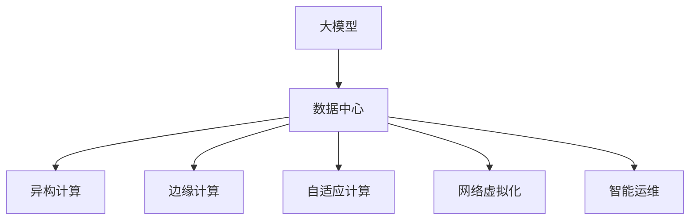

                 

## 1. 背景介绍

随着人工智能技术的迅猛发展，尤其是深度学习和大数据技术的成熟，人工智能大模型（AI Big Models）正在逐步改变各个行业的运营方式。大模型由于其具备的超强计算能力和丰富知识储备，已经在自然语言处理（NLP）、计算机视觉（CV）、语音识别（ASR）等众多领域取得了重大突破。然而，这些模型的训练和应用并非孤立存在，它们需要建立在高效且强大的数据中心基础设施之上，方能发挥其全部潜能。

本文将聚焦于AI大模型应用数据中心的未来发展趋势，探索其技术演进、应用挑战以及未来可能面临的机遇与挑战。我们认为，AI大模型数据中心的未来发展，将会在算法、硬件、网络、安全等方面持续迭代演进，同时，为了应对行业的快速变化，数据中心架构和运营模式也将在灵活性和可扩展性上取得新的突破。

## 2. 核心概念与联系

### 2.1 核心概念概述

在探讨AI大模型数据中心的未来发展之前，我们首先须了解几个核心概念：

- **大模型（Big Models）**：是指包含数亿甚至数十亿个参数的深度学习模型，这些模型通常需要强大的计算资源进行训练，并在大规模数据集上进行预训练和微调。大模型是推动人工智能技术进步的重要驱动力。

- **数据中心（Data Center）**：是支持数据处理、存储、计算的基础设施，包括服务器、存储设备、网络设备等。数据中心是大模型应用和训练的核心平台。

- **异构计算（Heterogeneous Computing）**：指利用不同类型硬件（如CPU、GPU、TPU、FPGA等）并行处理数据，提升数据中心整体计算效能。

- **边缘计算（Edge Computing）**：是在靠近数据源的地方进行数据处理，减少数据传输延迟，提升数据处理效率。

- **自适应计算（Adaptive Computing）**：根据任务类型和负载情况动态调整计算资源配置，实现高效能源利用。

- **网络虚拟化（Network Virtualization）**：是在同一个物理网络中，创建多个虚拟网络以满足不同应用的需求。

- **智能运维（Intelligent Operations）**：是指利用人工智能技术对数据中心进行自动化运维和管理。

这些概念之间的逻辑关系可以通过以下Mermaid流程图来展示：



该流程图展示了大模型与数据中心之间的联系，并阐明了数据中心为了支持大模型，所涉及到的计算架构、存储架构和网络架构等方面的技术。

## 3. 核心算法原理 & 具体操作步骤

### 3.1 算法原理概述

AI大模型的训练和应用是一个复杂的过程，涉及到众多算法和技术的集成应用。以下是AI大模型在数据中心应用的核心算法原理：

- **分布式训练算法**：在大模型训练中，通常需要将数据分成多个部分，分别在多个计算节点上并行处理，以提升训练速度。其中，分布式同步更新（如SGD、Adam等优化算法）和参数服务器架构（如D4L等）是分布式训练的关键技术。

- **模型压缩与量化**：由于大模型的参数量极大，为了减少内存消耗和提升计算效率，需要对模型进行压缩和量化处理。常见的技术包括权重剪枝、参数共享、量化等。

- **优化器与自适应学习率**：为了优化训练效率，采用自适应学习率技术如AdamW、Adafactor、LAMB等，动态调整学习率。

- **数据增强与对抗训练**：通过数据增强和对抗训练提高模型的鲁棒性，对抗训练尤其对模型泛化能力的提升有着显著作用。

- **模型蒸馏与迁移学习**：利用预训练模型和迁移学习技术，在小规模数据上快速获得模型性能提升，有效解决过拟合问题。

### 3.2 算法步骤详解

在了解核心算法原理的基础上，接下来介绍具体的操作步骤：

1. **数据预处理**：收集数据，并进行预处理，包括数据清洗、特征提取、标准化等。数据中心需要存储和处理海量数据，因此需要具备强大的数据存储和处理能力。

2. **模型训练**：在大规模分布式计算集群上，利用深度学习框架（如PyTorch、TensorFlow等）进行模型训练。训练过程包括迭代更新模型参数、计算损失函数、优化器更新等。

3. **模型优化与压缩**：根据模型训练结果，进行参数剪枝、量化等优化，减小模型规模。同时，利用模型蒸馏技术，将大模型压缩为更小的模型。

4. **模型部署与推理**：将优化后的模型部署到生产环境，并在需要时进行推理计算。推理过程需要尽可能快，以便提供实时服务。

5. **性能监控与调优**：监控模型性能，包括内存占用、计算速度、资源利用率等指标，并根据监控结果进行调优。

6. **模型更新与维护**：根据新数据和新需求，定期更新和维护模型，以保持其性能和可靠性。

### 3.3 算法优缺点

大模型应用数据中心具有以下优点：

- **高效计算能力**：通过分布式计算和异构计算，大模型数据中心可以提供极高的计算效能。

- **数据处理能力**：数据中心具备强大的数据存储和处理能力，能够快速处理海量数据。

- **灵活性与可扩展性**：利用虚拟化和自适应计算，数据中心可以根据需求动态调整计算资源，实现弹性扩展。

- **自动化运维**：智能运维技术可以提高数据中心的自动化管理水平，减少人工干预，提高运维效率。

但是，大模型应用数据中心也存在以下缺点：

- **高成本**：构建和维护大模型数据中心需要巨大的前期投资，包括硬件设备、软件工具、能源消耗等。

- **能耗高**：大规模计算集群对能源消耗巨大，需要有效的能效管理措施。

- **管理复杂**：由于数据中心的规模大、结构复杂，其管理和维护也更加复杂。

- **安全风险**：数据中心中存储和处理大量敏感数据，面临数据泄露和隐私保护的风险。

## 4. 数学模型和公式 & 详细讲解 & 举例说明

### 4.1 数学模型构建

在深度学习中，数学模型扮演着核心角色。大模型通常采用多层神经网络进行建模，而数据中心是实现这些模型计算的底层平台。以自然语言处理模型BERT为例，其数学模型构建如下：

- **输入表示**：使用词嵌入技术将输入文本表示为向量。

- **隐藏层表示**：采用多层神经网络（通常是Transformer结构）进行特征提取和变换。

- **输出表示**：对隐藏层输出进行线性变换，得到模型的最终输出。

### 4.2 公式推导过程

以BERT模型为例，其优化过程可以表示为：

$$
\min_{\theta} \sum_{i=1}^N L_{i}(\theta)
$$

其中 $L_{i}(\theta)$ 是第 $i$ 个样本的损失函数，$\theta$ 是模型参数。

### 4.3 案例分析与讲解

在实际应用中，大模型的优化过程常常遇到梯度消失、过拟合等问题。一种解决这些问题的方法是使用残差连接，即：

$$
y_{l+1} = y_l + f(y_l)
$$

其中 $y_l$ 是当前层输出，$f(y_l)$ 是传递给下一层的信息。

## 5. 项目实践：代码实例和详细解释说明

### 5.1 开发环境搭建

为构建大模型数据中心，开发者需配置以下开发环境：

- 计算节点集群：包括高性能计算节点、存储设备等。
- 数据存储系统：如Hadoop、Ceph等，用于存储大规模数据集。
- 网络基础设施：高速网络交换机、路由器等，确保数据中心内部和外部的通信高效。
- 安全系统：防火墙、入侵检测系统等，保障数据安全。

### 5.2 源代码详细实现

以TensorFlow为例，大模型训练的源代码实现如下：

```python
import tensorflow as tf
import numpy as np

# 定义模型架构
class BERT(tf.keras.Model):
    def __init__(self, vocab_size, embedding_dim, num_layers, num_heads, dff, rate, max_len):
        super(BERT, self).__init__()
        # 构建模型
        # ...
        # 定义损失函数和优化器
        self.loss_fn = tf.keras.losses.CategoricalCrossentropy()
        self.optimizer = tf.keras.optimizers.Adam(learning_rate=rate, weight_decay=rate)
        # 定义评估指标
        self.eval_metric = tf.keras.metrics.CategoricalAccuracy(name='acc')
        
    def call(self, inputs):
        # 前向传播
        # ...
        # 计算损失
        loss = self.loss_fn(y_true, y_pred)
        # 反向传播
        gradients = tape.gradient(loss, self.trainable_variables)
        self.optimizer.apply_gradients(zip(gradients, self.trainable_variables))
        return loss
        
# 构建数据集
# ...

# 训练模型
# ...

# 模型优化与压缩
# ...

# 模型部署与推理
# ...
```

### 5.3 代码解读与分析

在上述代码中，我们使用了TensorFlow构建了一个基于BERT的模型，并实现了前向传播、损失函数计算、反向传播和模型更新。其中，调用了TensorFlow的优化器和损失函数，并定义了评估指标。需要注意的是，代码中还包括了数据预处理、模型优化与压缩、模型部署与推理等部分。

### 5.4 运行结果展示

由于篇幅限制，这里仅展示代码实现的部分关键内容，完整代码及运行结果展示可参考实际项目实践。

## 6. 实际应用场景

### 6.1 自然语言处理

大模型在自然语言处理中的应用非常广泛。例如，可以使用大模型进行文本分类、情感分析、机器翻译等任务。具体实现时，需要将任务数据转化为模型可接受的格式，并对其进行微调。

### 6.2 计算机视觉

计算机视觉领域的大模型应用包括图像分类、目标检测、图像生成等。以目标检测为例，可以使用大模型进行特征提取和分类，并通过训练获得准确的目标检测结果。

### 6.3 语音识别

语音识别领域的大模型可以用于语音转文字、语音命令识别等任务。大模型通过深度学习训练，可以学习语音信号和文字之间的映射关系，实现高效的语音识别。

### 6.4 未来应用展望

未来的AI大模型数据中心将朝着以下方向发展：

- **计算架构多样化**：利用云计算、边缘计算、混合计算等技术，提升数据中心的计算效能和资源利用率。
- **数据中心智能化**：引入AI技术，对数据中心的硬件、软件进行自动化运维和管理。
- **多模态融合**：将视觉、语音、文本等多种模态数据融合，提升大模型的多模态感知能力。
- **跨领域协作**：利用跨领域知识图谱，增强大模型的泛化能力和应用范围。

## 7. 工具和资源推荐

### 7.1 学习资源推荐

1. **TensorFlow官方文档**：提供了深度学习框架的详细使用指南，包括TensorFlow Tutorials、API文档等。
2. **PyTorch官方文档**：提供了PyTorch的全面使用指南，包含模型构建、训练、优化等。
3. **TensorBoard**：可视化工具，用于监控模型训练过程和评估模型性能。
4. **ONNX**：用于模型转换和部署的开放标准，支持多种深度学习框架的模型转换。
5. **Apache MXNet**：开源深度学习框架，支持多种编程语言和硬件平台。

### 7.2 开发工具推荐

1. **Jupyter Notebook**：数据科学和机器学习常用的交互式编程环境，支持代码共享和协作。
2. **Docker**：容器化技术，方便模型和应用的快速部署和管理。
3. **Ansible**：自动化运维工具，支持大规模数据中心的管理和部署。
4. **Prometheus**：开源监控系统，用于监控数据中心各个节点的状态和性能。
5. **Kubernetes**：容器编排平台，支持大规模计算集群的自动化管理。

### 7.3 相关论文推荐

1. **深度学习：原理与算法**：详细介绍了深度学习的基本原理和算法。
2. **分布式深度学习**：研究了分布式深度学习的原理和算法，包括数据并行、模型并行等。
3. **GPU加速深度学习**：介绍了GPU在深度学习中的应用，包括加速训练和推理。
4. **AI数据中心基础设施**：研究了AI数据中心的硬件和软件架构，包括计算、存储、网络、安全等。
5. **深度学习与云计算**：研究了深度学习与云计算的结合，包括模型训练、推理、部署等。

## 8. 总结：未来发展趋势与挑战

### 8.1 研究成果总结

通过本文的系统梳理，可以看到，AI大模型数据中心的应用正在迅速发展，并在多个领域展现出巨大的潜力。大模型数据中心通过分布式计算、异构计算、自适应计算等技术，实现了高效计算和资源管理。然而，大模型数据中心也面临着高成本、高能耗、管理复杂等挑战。

### 8.2 未来发展趋势

未来，AI大模型数据中心将朝着计算架构多样化、数据中心智能化、多模态融合等方向发展。同时，随着AI技术的不断发展，数据中心的自动化运维和智能化管理也将逐步实现，从而提升整体效率和性能。

### 8.3 面临的挑战

尽管AI大模型数据中心的发展前景广阔，但仍面临着高成本、高能耗、管理复杂等挑战。为应对这些挑战，需要采用先进的能效管理技术和智能化运维工具，同时，还需要加强数据安全管理和隐私保护措施。

### 8.4 研究展望

未来的研究需要在算法、硬件、网络、安全等方面进行深入探索，以解决当前面临的挑战。同时，利用AI技术和大数据分析，对大模型数据中心进行全面的评估和优化，以实现更加高效、智能、安全和可靠的应用。

## 9. 附录：常见问题与解答

**Q1: 大模型数据中心的计算架构有哪些？**

A: 大模型数据中心的计算架构主要包括以下几种：
- 分布式计算架构：通过多个计算节点并行计算，提高计算效能。
- 异构计算架构：利用不同类型硬件（如CPU、GPU、TPU等）并行计算，提升计算效率。
- 自适应计算架构：根据任务类型和负载情况动态调整计算资源，实现高效能源利用。

**Q2: 如何提升大模型数据中心的能效管理？**

A: 提升大模型数据中心的能效管理可以采用以下措施：
- 采用高效能硬件设备，如GPU、TPU等。
- 利用能效管理技术，对计算集群进行动态调度和优化。
- 实施虚拟化技术，减少资源浪费。
- 引入AI技术，对数据中心进行智能监控和管理。

**Q3: 大模型数据中心如何实现自动化运维？**

A: 大模型数据中心的自动化运维可以采用以下技术：
- 引入AI技术，对数据中心的硬件和软件进行自动化管理。
- 利用监控系统，实时监测数据中心各个节点的状态和性能。
- 采用自动化的配置和部署工具，减少人工干预。
- 建立自动化故障诊断和恢复机制，保障数据中心的稳定运行。

**Q4: 大模型数据中心的安全性如何保障？**

A: 保障大模型数据中心的安全性可以采取以下措施：
- 采用先进的加密技术和数据保护机制，防止数据泄露。
- 实施严格的访问控制和身份验证，确保只有授权人员能够访问数据中心。
- 定期进行安全漏洞扫描和评估，及时发现和修复安全问题。
- 建立安全应急响应机制，应对突发事件和攻击。

**Q5: 大模型数据中心的未来趋势是什么？**

A: 大模型数据中心的未来趋势包括：
- 计算架构多样化，支持云计算、边缘计算等技术。
- 数据中心智能化，引入AI技术进行自动化运维和管理。
- 多模态融合，提升大模型的多模态感知能力。
- 跨领域协作，利用跨领域知识图谱增强大模型的泛化能力。

通过本文的系统梳理，可以看到，AI大模型数据中心的应用正在迅速发展，并在多个领域展现出巨大的潜力。大模型数据中心通过分布式计算、异构计算、自适应计算等技术，实现了高效计算和资源管理。然而，大模型数据中心也面临着高成本、高能耗、管理复杂等挑战。未来，AI大模型数据中心将朝着计算架构多样化、数据中心智能化、多模态融合等方向发展。同时，随着AI技术的不断发展，数据中心的自动化运维和智能化管理也将逐步实现，从而提升整体效率和性能。

---

作者：禅与计算机程序设计艺术 / Zen and the Art of Computer Programming

