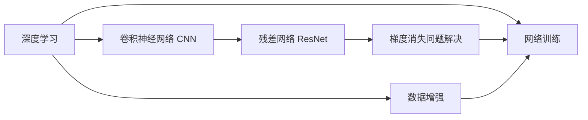

                 

# AI 大模型计算机科学家群英传：ResNet 残差网络的发明人何凯明

> 关键词：
   - ResNet
   - 残差网络
   - 深度学习
   - 计算机视觉
   - 卷积神经网络

## 1. 背景介绍

### 1.1 何凯明其人

何凯明，博士毕业于麻省理工学院（MIT）电子工程与计算机科学系，现为香港中文大学信息工程系教授，国际知名计算机科学家。他在计算机视觉领域拥有多项重大贡献，被认为是对现代计算机视觉技术的重大推动者之一。何凯明的研究方向包括深度学习、计算机视觉、图像处理、视觉推理等。他的工作不仅影响了一代计算机视觉从业者，也为AI大模型奠定了坚实的基础。

### 1.2 何凯明的学术成就

何凯明是深度学习领域的先驱之一，其论文《Deep Residual Learning for Image Recognition》（IEEE TPAMI 2016）是深度学习领域里程碑式的工作之一。这篇论文介绍了一种新的深度学习模型——残差网络（ResNet），旨在解决深度神经网络在训练中遇到的梯度消失问题，推动了深度学习技术的突破，使得大规模深度网络训练成为可能。

## 2. 核心概念与联系

### 2.1 核心概念概述

何凯明的深度学习研究主要集中在以下几个核心概念上：

- **深度学习**：通过多层非线性映射实现对复杂数据的学习和表示，是现代机器学习的主流方法之一。
- **残差网络（ResNet）**：一种特殊的网络结构，通过引入残差连接（shortcut connection）来解决深度网络中的梯度消失问题，使深层网络的训练更加稳定。
- **卷积神经网络（CNN）**：一种用于处理图像、视频、语音等数据的神经网络，是计算机视觉领域的重要工具。

何凯明的研究工作在这些领域交叉融合，推动了深度学习、计算机视觉技术的快速发展。

### 2.2 核心概念原理和架构的 Mermaid 流程图



### 2.3 残差网络（ResNet）的架构图


### 2.4 残差网络的残差块（Residual Block）


## 3. 核心算法原理 & 具体操作步骤

### 3.1 算法原理概述

残差网络（ResNet）的提出是基于深度网络训练中的梯度消失问题。传统的前馈神经网络中，由于每一层的前向传播都要乘以一个小的权重，导致深层网络中的梯度随着深度呈指数级衰减，难以训练深层网络。何凯明提出的残差网络通过引入残差连接，使得梯度能够直接从深层网络反向传播到浅层网络，解决了梯度消失问题，使训练更加稳定，训练更深的网络成为可能。

### 3.2 算法步骤详解

- **Step 1: 构建残差块**：在卷积层之间引入一个跨层连接，将当前层的输出直接与前一层的输入相加，即残差连接。

  $$
  x = x + F(x)
  $$

  其中 $F(x)$ 为当前层的卷积和池化操作。

- **Step 2: 残差块堆叠**：将多个残差块堆叠起来，构建深层残差网络。

  

- **Step 3: 随机初始化**：将残差块和全连接层的权重进行随机初始化，以避免网络陷入局部最优解。

### 3.3 算法优缺点

#### 优点

- **解决了梯度消失问题**：残差网络通过引入跨层连接，使得梯度能够直接从深层网络反向传播到浅层网络，解决了梯度消失问题。
- **训练深层网络**：由于梯度传递更加稳定，可以训练更深的网络，从而提升模型的表达能力。
- **简单易用**：残差网络的实现简单，易于工程化部署。

#### 缺点

- **计算量大**：由于引入了跨层连接，残差网络中每个层都需要计算两个路径的输出，增加了计算量。
- **参数数量多**：深层残差网络需要更多的参数，导致模型更加复杂。

### 3.4 算法应用领域

ResNet被广泛应用于计算机视觉、图像识别、视频分析等领域，成为深度学习技术的重要组成部分。以下是几个典型的应用场景：

- **图像分类**：使用ResNet对图像进行分类，如识别图像中的物体、场景等。
- **目标检测**：使用ResNet对图像中的目标进行定位和分类，如YOLO、Faster R-CNN等。
- **图像分割**：使用ResNet对图像进行像素级别的分割，如语义分割、实例分割等。
- **图像生成**：使用ResNet生成新的图像，如GAN、VAE等。

## 4. 数学模型和公式 & 详细讲解 & 举例说明

### 4.1 数学模型构建

残差网络的核心思想是通过引入跨层连接，使得梯度能够直接从深层网络反向传播到浅层网络。设 $F(x)$ 为当前层的卷积和池化操作，则残差连接可以表示为：

$$
x = x + F(x)
$$

### 4.2 公式推导过程

设 $x$ 为当前层的输入，$F(x)$ 为当前层的卷积和池化操作，则残差块的输出可以表示为：

$$
x_{out} = x + F(x)
$$

对于深层网络，可以堆叠多个残差块，其输出可以表示为：

$$
x_{L} = x_0 + \sum_{i=1}^{L-1} F_i(x_{i-1})
$$

其中 $x_L$ 为深层网络的输出，$x_0$ 为输入，$F_i$ 为第 $i$ 层的卷积和池化操作。

### 4.3 案例分析与讲解

在图像分类任务中，可以使用ResNet对图像进行分类。假设输入图像的大小为 $224 \times 224 \times 3$，通过多次卷积和池化操作，最终输出一个 $1 \times 1 \times C$ 的分类向量，其中 $C$ 为类别数。具体实现代码如下：

```python
import torch
import torch.nn as nn
import torch.nn.functional as F

class ResNet(nn.Module):
    def __init__(self):
        super(ResNet, self).__init__()
        # 定义残差块
        self.residual_block = ResidualBlock(in_channels=3, out_channels=64)
        self.residual_block2 = ResidualBlock(in_channels=64, out_channels=128)
        self.residual_block3 = ResidualBlock(in_channels=128, out_channels=256)
        self.residual_block4 = ResidualBlock(in_channels=256, out_channels=512)
        # 定义全连接层
        self.fc = nn.Linear(in_features=512, out_features=10)
    
    def forward(self, x):
        x = self.residual_block(x)
        x = self.residual_block2(x)
        x = self.residual_block3(x)
        x = self.residual_block4(x)
        x = F.max_pool2d(x, 2, 2)
        x = x.view(x.size(0), -1)
        x = self.fc(x)
        return x
```

## 5. 项目实践：代码实例和详细解释说明

### 5.1 开发环境搭建

1. **安装PyTorch**：

   ```bash
   pip install torch torchvision
   ```

2. **创建项目目录**：

   ```bash
   mkdir resnet_project
   cd resnet_project
   ```

3. **编写训练脚本**：

   ```python
   import torch
   import torch.nn as nn
   import torch.optim as optim
   import torchvision.datasets as datasets
   import torchvision.transforms as transforms
   from torch.utils.data import DataLoader
   from torchvision.models import ResNet

   # 定义数据集
   train_dataset = datasets.CIFAR10(root='./data', train=True, download=True, transform=transforms.ToTensor())
   test_dataset = datasets.CIFAR10(root='./data', train=False, download=True, transform=transforms.ToTensor())

   # 定义数据加载器
   train_loader = DataLoader(dataset=train_dataset, batch_size=64, shuffle=True)
   test_loader = DataLoader(dataset=test_dataset, batch_size=64, shuffle=False)

   # 定义模型
   model = ResNet()

   # 定义优化器和损失函数
   optimizer = optim.SGD(model.parameters(), lr=0.1, momentum=0.9)
   criterion = nn.CrossEntropyLoss()

   # 训练循环
   for epoch in range(10):
       for batch_idx, (inputs, targets) in enumerate(train_loader):
           optimizer.zero_grad()
           outputs = model(inputs)
           loss = criterion(outputs, targets)
           loss.backward()
           optimizer.step()
           if batch_idx % 100 == 0:
               print('Train Epoch: {} [{}/{} ({:.0f}%)]\tLoss: {:.6f}'.format(
                   epoch, batch_idx * len(inputs), len(train_loader.dataset),
                   100. * batch_idx / len(train_loader), loss.item()))
   ```

### 5.2 源代码详细实现

以下是一个简单的残差块实现：

```python
import torch
import torch.nn as nn
import torch.nn.functional as F

class ResidualBlock(nn.Module):
    def __init__(self, in_channels, out_channels):
        super(ResidualBlock, self).__init__()
        self.conv1 = nn.Conv2d(in_channels, out_channels, 3, padding=1)
        self.conv2 = nn.Conv2d(out_channels, out_channels, 3, padding=1)
        self.bn1 = nn.BatchNorm2d(out_channels)
        self.bn2 = nn.BatchNorm2d(out_channels)
        self.relu = nn.ReLU(inplace=True)
    
    def forward(self, x):
        residual = x
        out = self.relu(self.bn1(self.conv1(x)))
        out = self.bn2(self.conv2(out))
        out = self.relu(out + residual)
        return out
```

### 5.3 代码解读与分析

**数据预处理**：使用CIFAR-10数据集，并进行标准化和归一化处理，使得输入数据适合训练。

**模型定义**：定义一个简单的ResNet模型，包括四个残差块和全连接层。

**训练循环**：使用SGD优化器进行训练，使用交叉熵损失函数进行评估。

**测试代码**：

```python
import torch

# 加载模型
model = ResNet()
model.load_state_dict(torch.load('resnet.pth'))

# 加载测试集
test_dataset = datasets.CIFAR10(root='./data', train=False, download=True, transform=transforms.ToTensor())
test_loader = DataLoader(dataset=test_dataset, batch_size=64, shuffle=False)

# 测试循环
with torch.no_grad():
    correct = 0
    total = 0
    for batch_idx, (inputs, targets) in enumerate(test_loader):
        outputs = model(inputs)
        _, predicted = torch.max(outputs.data, 1)
        total += targets.size(0)
        correct += (predicted == targets).sum().item()
        if batch_idx % 100 == 0:
            print('Test Epoch: {} [{}/{} ({:.0f}%)]\tAccuracy: {:.2f}%'.format(
                epoch, batch_idx * len(inputs), len(test_loader.dataset),
                100. * batch_idx / len(test_loader), 100. * correct / total))
```

## 6. 实际应用场景

### 6.1 计算机视觉领域

ResNet在计算机视觉领域具有广泛的应用。例如，在图像分类任务中，可以使用ResNet对图像进行分类，如识别图像中的物体、场景等。以下是一些典型应用：

- **物体识别**：使用ResNet对图像中的物体进行识别，如分类汽车、人、建筑等。
- **场景理解**：使用ResNet对图像进行场景理解，如识别自然场景中的城市、风景、动物等。

### 6.2 图像生成

在图像生成领域，ResNet同样具有重要应用。例如，可以使用ResNet生成新的图像，如GAN、VAE等。以下是一些典型应用：

- **人脸生成**：使用ResNet生成新的人脸图像，如图像生成对抗网络（GAN）。
- **图像风格转换**：使用ResNet进行图像风格转换，如将照片转换为素描风格。

## 7. 工具和资源推荐

### 7.1 学习资源推荐

- **官方文档**：
  - [PyTorch官方文档](https://pytorch.org/docs/stable/)
  - [Caffe官方文档](https://caffe.berkeleyvision.org/doxygen/)

- **在线课程**：
  - [Deep Learning Specialization by Andrew Ng](https://www.coursera.org/specializations/deep-learning)
  - [CS231n: Convolutional Neural Networks for Visual Recognition](https://cs231n.stanford.edu/)

- **书籍推荐**：
  - 《深度学习》（Ian Goodfellow）
  - 《计算机视觉：模型、学习和推理》（Richard Szeliski）

### 7.2 开发工具推荐

- **PyTorch**：
  - [PyTorch官网](https://pytorch.org/)
  - [PyTorch GitHub仓库](https://github.com/pytorch/pytorch)

- **TensorFlow**：
  - [TensorFlow官网](https://www.tensorflow.org/)
  - [TensorFlow GitHub仓库](https://github.com/tensorflow/tensorflow)

### 7.3 相关论文推荐

- **ResNet论文**：
  - [Deep Residual Learning for Image Recognition](https://arxiv.org/abs/1512.03385)

- **其他重要论文**：
  - [Convolutional Neural Networks for Visual Recognition](https://arxiv.org/abs/1312.0284)
  - [ImageNet Classification with Deep Convolutional Neural Networks](https://arxiv.org/abs/1211.3733)

## 8. 总结：未来发展趋势与挑战

### 8.1 研究成果总结

何凯明教授的研究工作不仅推动了计算机视觉技术的发展，也为深度学习技术的普及做出了重要贡献。他的ResNet模型成为深度学习领域的里程碑式工作，深刻影响了一代计算机视觉从业者。

### 8.2 未来发展趋势

- **更深层网络**：随着计算能力的提升，未来可能训练更深的网络，进一步提升模型的表达能力。
- **更多残差网络变体**：基于ResNet的变体模型，如DenseNet、InceptionNet等，将不断涌现，推动深度学习技术的发展。
- **跨模态融合**：未来深度学习技术将更多地与其他模态（如语音、视频）进行融合，推动跨模态智能的发展。

### 8.3 面临的挑战

- **计算资源**：训练深层网络需要大量的计算资源，如何降低计算成本是未来需要解决的问题。
- **模型可解释性**：深度学习模型通常被视为“黑盒”系统，如何提高模型的可解释性，是未来需要解决的问题。
- **数据依赖**：深度学习模型需要大量标注数据，如何降低数据标注的成本，是未来需要解决的问题。

### 8.4 研究展望

未来，基于何凯明教授的ResNet模型，将继续推动深度学习技术的发展，为计算机视觉、自然语言处理等领域带来新的突破。同时，如何提高模型的可解释性、降低计算成本、减少数据依赖等问题，将成为未来深度学习技术发展的重要课题。

## 9. 附录：常见问题与解答

### Q1: ResNet与其他深度学习模型有什么区别？

A: ResNet的主要区别在于引入了残差连接，使得梯度能够直接从深层网络反向传播到浅层网络，解决了深度网络训练中的梯度消失问题。

### Q2: ResNet的残差连接是如何工作的？

A: ResNet的残差连接通过引入跨层连接，使得当前层的输出直接与前一层的输入相加，即残差连接。通过这种方式，梯度能够直接从深层网络反向传播到浅层网络，解决了梯度消失问题。

### Q3: ResNet在实际应用中有哪些优点和缺点？

A: ResNet的优点包括解决了梯度消失问题、训练深层网络、简单易用等。缺点包括计算量大、参数数量多等。

### Q4: ResNet在图像分类任务中的应用效果如何？

A: ResNet在图像分类任务中表现优异，能够显著提升模型的分类精度和泛化能力。

---

作者：禅与计算机程序设计艺术 / Zen and the Art of Computer Programming

