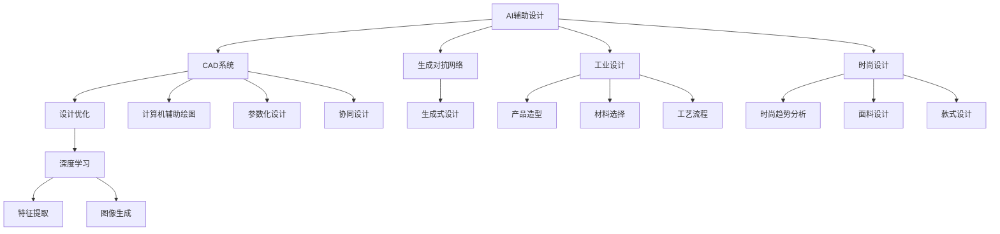

                 

# AI 辅助设计：提升设计效率

> 关键词：人工智能(AI), 计算机辅助设计(CAD), 自动化设计(AutoCAD), 设计效率提升, 深度学习(Deep Learning), 生成对抗网络(GANs), 设计优化, 工业设计, 时尚设计

## 1. 背景介绍

### 1.1 问题由来
在现代工业设计和时尚设计领域，设计师们常常面临诸多挑战：
- 时间紧迫：项目周期短，设计师需要快速出图和修改设计方案。
- 复杂度高：设计任务涉及几何形状、材料选择、工艺流程等多个维度的考量。
- 创意无限：创新设计需求不断涌现，传统手工设计难以满足。
- 协同困难：跨团队协作复杂，沟通协调成本高。

传统的设计流程通常需要耗费大量时间和精力，且容易受限于设计人员的经验和技能。借助AI辅助设计(AI-aided Design)技术，可以显著提升设计效率，缩短设计周期，降低设计成本，提升设计质量。AI设计技术融合了计算机图形学、人工智能和计算机视觉等多种前沿技术，已在制造、建筑、时尚、航空等多个行业广泛应用，成为设计师的好帮手。

## 2. 核心概念与联系

### 2.1 核心概念概述

为更好地理解AI辅助设计(AI-aided Design)的原理和应用，本节将介绍几个关键概念：

- **AI辅助设计(AI-aided Design)**：指在人工智能技术的支持下，自动化和智能化的辅助设计方法。通过AI技术，设计师可以快速生成设计方案、优化设计效果、协同设计任务等，提升设计效率和质量。

- **计算机辅助设计(CAD)**：指在计算机软硬件辅助下进行的设计工作，广泛应用于机械、电子、建筑设计等众多领域。CAD系统提供了丰富的设计工具和编辑功能，使设计过程更加高效和精确。

- **深度学习(Deep Learning)**：指一种基于神经网络的机器学习方法，具有强大的特征学习和模式识别能力。深度学习模型可以自动从大量数据中提取抽象特征，用于图像识别、语音识别、自然语言处理等多种任务。

- **生成对抗网络(GANs)**：指一种包含生成器和判别器的神经网络结构，用于生成高质量的图像、视频、音频等内容。GANs能够学习到复杂的分布，生成具有高度真实感的合成数据，广泛应用于生成模型和创意设计领域。

- **设计优化(Design Optimization)**：指通过各种算法对设计方案进行分析和优化，以实现性能最佳、成本最低、时间最短等目标。设计优化可以应用于产品设计、工艺流程、物流规划等众多领域。

- **工业设计(Industrial Design)**：指面向生产制造的产品设计，涉及造型、材料、结构、工艺等多方面考量。工业设计需要满足功能性、美观性、经济性和可生产性等多重要求。

- **时尚设计(Fashion Design)**：指面向时尚产业的服装、配饰等设计工作，涉及面料选择、色彩搭配、款式设计等多个环节。时尚设计强调个性、潮流和文化元素的应用。

这些核心概念之间通过技术融合和应用实践紧密联系，构成了AI辅助设计的理论框架和实践路径。

### 2.2 核心概念原理和架构的 Mermaid 流程图



## 3. 核心算法原理 & 具体操作步骤

### 3.1 算法原理概述

AI辅助设计的核心算法原理包括以下几个方面：

- **特征提取**：通过深度学习模型从原始设计数据中提取抽象特征，为后续设计优化和生成任务提供输入。

- **设计优化**：使用各种优化算法(如遗传算法、粒子群优化等)对设计方案进行模拟和优化，以寻找最优解。

- **生成对抗网络**：通过训练生成器和判别器，生成与真实设计相似或更好的新设计方案，用于创意设计、设计迭代等任务。

- **协同设计**：利用云计算和网络协同技术，支持多团队、多设计师之间的实时协作和设计交流。

### 3.2 算法步骤详解

#### 3.2.1 特征提取步骤

- **数据收集**：从CAD系统或图像库中收集设计数据，如几何形状、材料信息、工艺流程等。
- **数据预处理**：对收集的数据进行清洗和预处理，去除噪声和异常值，标准化数据格式。
- **模型选择**：选择合适的深度学习模型(如卷积神经网络CNN、循环神经网络RNN等)进行特征提取。
- **特征训练**：使用训练集对深度学习模型进行训练，提取设计数据的抽象特征表示。

#### 3.2.2 设计优化步骤

- **模型选择**：选择合适的优化算法(如遗传算法、粒子群优化等)进行设计优化。
- **参数设定**：设置优化算法的参数，如种群大小、迭代次数、交叉率等。
- **模型训练**：使用训练集对优化模型进行训练，优化设计方案。
- **模型评估**：在测试集上评估优化模型的效果，调整模型参数。

#### 3.2.3 生成对抗网络步骤

- **生成器训练**：初始化生成器网络，使用训练集进行迭代训练，生成新的设计方案。
- **判别器训练**：初始化判别器网络，使用生成器和真实设计数据进行迭代训练，提高判别器的识别能力。
- **对抗训练**：在生成器和判别器之间交替进行训练，通过对抗训练提升生成器的生成能力和判别器的识别能力。
- **输出评估**：在测试集上评估生成器的生成效果，调整网络参数。

### 3.3 算法优缺点

AI辅助设计的算法具有以下优点：

- **效率提升**：通过自动化和智能化辅助，大幅缩短设计周期，提高设计效率。
- **质量优化**：使用优化算法和生成对抗网络等技术，优化设计方案，提升设计质量。
- **创新能力**：生成对抗网络等技术能够生成新颖的设计方案，激发设计师的创造力。

同时，该算法也存在一定的局限性：

- **数据依赖**：算法效果很大程度上取决于数据的质量和多样性，需要大量高质量的设计数据。
- **模型复杂**：深度学习模型和优化算法的复杂度高，对计算资源和硬件设备要求较高。
- **可解释性不足**：深度学习模型的决策过程缺乏可解释性，难以调试和优化。
- **知识限制**：算法主要依赖于已有数据和模型，缺乏对领域知识的全面理解和整合。

### 3.4 算法应用领域

AI辅助设计技术在工业设计和时尚设计等多个领域都有广泛应用：

- **工业设计**：在机械、电子、建筑设计等领域，AI辅助设计可以自动生成设计方案，优化工艺流程，提升设计质量。

- **时尚设计**：在服装、配饰等时尚设计领域，AI辅助设计可以自动生成时尚趋势、面料设计和款式设计，提供创意灵感。

- **产品设计**：在汽车、家电、家具等产品设计领域，AI辅助设计可以自动生成产品造型、材料选择、装配优化等设计方案，提高设计效率。

- **制造优化**：在制造行业，AI辅助设计可以优化零件布局、工艺流程，提升生产效率和质量。

## 4. 数学模型和公式 & 详细讲解

### 4.1 数学模型构建

AI辅助设计的数学模型主要包括以下几个部分：

- **特征提取模型**：基于卷积神经网络CNN等模型，从原始设计数据中提取抽象特征表示。

- **设计优化模型**：使用遗传算法、粒子群优化等优化算法，对设计方案进行模拟和优化。

- **生成对抗网络模型**：包含生成器和判别器两个部分，通过对抗训练生成新的设计方案。

### 4.2 公式推导过程

#### 4.2.1 特征提取模型的公式推导

假设设计数据为向量 $x \in \mathbb{R}^n$，特征提取模型为卷积神经网络CNN，其中 $F$ 表示卷积层，$G$ 表示池化层，$H$ 表示全连接层，$W$ 表示权重矩阵，$b$ 表示偏置向量，则特征提取过程的数学模型为：

$$
z = F(x;W_1) + b_1
$$
$$
z' = G(z;W_2) + b_2
$$
$$
h = H(z';W_3) + b_3
$$

其中，$z$ 表示卷积层的输出，$z'$ 表示池化层的输出，$h$ 表示全连接层的输出。

#### 4.2.2 设计优化模型的公式推导

假设设计优化模型为遗传算法，其中种群大小为 $N$，迭代次数为 $T$，染色体长度为 $L$，交叉率为 $p$，则优化过程的数学模型为：

$$
\mathcal{L} = \frac{1}{N} \sum_{i=1}^N \|f(x_i) - y_i\|^2
$$

其中，$x_i$ 表示第 $i$ 个染色体的设计方案，$y_i$ 表示目标值，$f$ 表示优化函数。

### 4.3 案例分析与讲解

以生成对抗网络生成式设计为例，假设生成器为多层感知器MLP，判别器为多层感知器MLP，训练集为 $D=\{(x_i,y_i)\}_{i=1}^M$，生成器参数为 $\theta_G$，判别器参数为 $\theta_D$，则生成对抗网络训练过程的数学模型为：

$$
z = g_{\theta_G}(x)
$$
$$
\hat{y} = d_{\theta_D}(z)
$$
$$
\mathcal{L}_G = -\mathbb{E}_{x}[\log D(z)] - \mathbb{E}_{z|\hat{y}=1}[\log(1-D(z))]
$$
$$
\mathcal{L}_D = -\mathbb{E}_{x}[\log D(x)] - \mathbb{E}_{z|\hat{y}=0}[\log D(z)]
$$

其中，$z$ 表示生成器的输出，$\hat{y}$ 表示判别器的输出，$\mathcal{L}_G$ 表示生成器的损失函数，$\mathcal{L}_D$ 表示判别器的损失函数。

## 5. 项目实践：代码实例和详细解释说明

### 5.1 开发环境搭建

在进行AI辅助设计实践前，我们需要准备好开发环境。以下是使用Python进行PyTorch开发的环境配置流程：

1. 安装Anaconda：从官网下载并安装Anaconda，用于创建独立的Python环境。

2. 创建并激活虚拟环境：
```bash
conda create -n pytorch-env python=3.8 
conda activate pytorch-env
```

3. 安装PyTorch：根据CUDA版本，从官网获取对应的安装命令。例如：
```bash
conda install pytorch torchvision torchaudio cudatoolkit=11.1 -c pytorch -c conda-forge
```

4. 安装TensorFlow：
```bash
pip install tensorflow
```

5. 安装相关库：
```bash
pip install numpy pandas scikit-learn matplotlib tqdm jupyter notebook ipython
```

完成上述步骤后，即可在`pytorch-env`环境中开始AI辅助设计实践。

### 5.2 源代码详细实现

下面我们以生成对抗网络(GANs)生成式设计为例，给出使用PyTorch进行生成对抗网络训练的代码实现。

首先，定义生成器和判别器的基本结构：

```python
import torch
import torch.nn as nn
import torch.optim as optim
import torchvision.transforms as transforms
from torch.utils.data import DataLoader
from torchvision.datasets import MNIST
from torchvision.utils import save_image

class Generator(nn.Module):
    def __init__(self, z_dim, out_channels):
        super(Generator, self).__init__()
        self.fc = nn.Linear(z_dim, 128 * 7 * 7)
        self.deconv1 = nn.ConvTranspose2d(128, 64, 4, stride=2, padding=1)
        self.deconv2 = nn.ConvTranspose2d(64, 3, 4, stride=2, padding=1, output_padding=1)
        
    def forward(self, x):
        x = self.fc(x)
        x = x.view(x.size(0), 128, 7, 7)
        x = self.deconv1(x)
        x = nn.functional.leaky_relu(x, 0.2)
        x = self.deconv2(x)
        x = torch.tanh(x)
        return x

class Discriminator(nn.Module):
    def __init__(self, in_channels):
        super(Discriminator, self).__init__()
        self.conv1 = nn.Conv2d(in_channels, 64, 4, stride=2, padding=1)
        self.conv2 = nn.Conv2d(64, 128, 4, stride=2, padding=1)
        self.fc = nn.Linear(128 * 7 * 7, 1)
        
    def forward(self, x):
        x = self.conv1(x)
        x = nn.functional.leaky_relu(x, 0.2)
        x = self.conv2(x)
        x = nn.functional.leaky_relu(x, 0.2)
        x = x.view(x.size(0), -1)
        x = self.fc(x)
        return x
```

然后，定义训练函数：

```python
def train_dcgan(netG, netD, dataloader, learning_rate=0.0002, num_epochs=200):
    device = torch.device('cuda' if torch.cuda.is_available() else 'cpu')
    netG.to(device)
    netD.to(device)
    
    criterion_G = nn.BCELoss()
    criterion_D = nn.BCELoss()
    optimizer_G = optim.Adam(netG.parameters(), lr=learning_rate)
    optimizer_D = optim.Adam(netD.parameters(), lr=learning_rate)
    
    for epoch in range(num_epochs):
        for i, (real_images, _) in enumerate(dataloader):
            real_images = real_images.to(device)
            
            # 训练判别器
            optimizerD.zero_grad()
            real_output = netD(real_images)
            fake_output = netD(netG(torch.randn(64, netG.z_dim, 1, 1)).detach())
            real_loss = criterionD(real_output, torch.ones_like(real_output))
            fake_loss = criterionD(fake_output, torch.zeros_like(fake_output))
            d_loss = real_loss + fake_loss
            d_loss.backward()
            optimizerD.step()
            
            # 训练生成器
            optimizerG.zero_grad()
            fake_images = netG(torch.randn(64, netG.z_dim, 1, 1))
            fake_loss = criterionG(netD(fake_images), torch.ones_like(fake_loss))
            g_loss = fake_loss
            g_loss.backward()
            optimizerG.step()
            
            # 打印和保存结果
            if i % 50 == 0:
                print(f"Epoch {epoch+1}, Batch {i+1}, D loss: {d_loss.item():.4f}, G loss: {g_loss.item():.4f}")
                save_image(fake_images[:8], f"fake_images_{epoch}.png")
```

最后，启动生成对抗网络训练过程：

```python
netG = Generator(z_dim=100, out_channels=3)
netD = Discriminator(in_channels=3)
dataloader = DataLoader(MNIST('../data', train=True, download=True, transform=transforms.ToTensor()), batch_size=64, shuffle=True)
train_dcgan(netG, netD, dataloader)
```

### 5.3 代码解读与分析

让我们再详细解读一下关键代码的实现细节：

**Generator类**：
- `__init__`方法：初始化生成器的神经网络结构，包含一个全连接层和两个卷积层。
- `forward`方法：实现生成器的前向传播过程，通过全连接层和卷积层生成输出图像。

**Discriminator类**：
- `__init__`方法：初始化判别器的神经网络结构，包含两个卷积层和一个全连接层。
- `forward`方法：实现判别器的前向传播过程，通过卷积层和全连接层生成输出。

**train_dcgan函数**：
- 设置训练设备、损失函数、优化器等关键组件。
- 通过循环迭代训练生成器和判别器，交替进行前向传播和反向传播。
- 打印和保存训练过程中的生成图像，方便可视化。

**训练过程**：
- 在训练过程中，生成器和判别器交替进行训练，生成器试图欺骗判别器，判别器试图正确识别真实和假样本。
- 通过计算真实样本和生成样本的损失，更新生成器和判别器的参数。
- 周期性输出训练日志和保存训练结果，方便追踪训练进度。

## 6. 实际应用场景

### 6.1 智能制造

在智能制造领域，AI辅助设计可以显著提升设计和生产效率。通过CAD系统辅助设计，生成优化的产品设计方案，自动生成制造流程，实现从设计到生产的无缝对接。AI辅助设计还可以自动生成供应链规划和物流调度方案，提升制造效率和成本控制能力。

### 6.2 时尚设计

在时尚设计领域，AI辅助设计可以提供最新的时尚趋势分析和面料设计建议，快速生成服装和配饰设计方案。通过自动生成设计草图和设计说明，时尚设计师可以更快地进行创意设计和验证，提升设计质量和创新能力。

### 6.3 汽车设计

在汽车设计领域，AI辅助设计可以自动生成车身造型、内饰设计、材料选择等设计方案，并优化设计参数，提升设计效率和设计质量。AI辅助设计还可以自动生成模拟和测试结果，帮助设计师验证设计方案的可行性。

## 7. 工具和资源推荐

### 7.1 学习资源推荐

为了帮助开发者系统掌握AI辅助设计的理论基础和实践技巧，这里推荐一些优质的学习资源：

1. 《深度学习在计算机视觉和自然语言处理中的应用》系列博文：由大模型技术专家撰写，深入浅出地介绍了深度学习在计算机视觉和自然语言处理中的应用，包括特征提取、生成对抗网络等前沿话题。

2. 《计算机视觉: 算法与应用》书籍：清华大学出版社出版的计算机视觉经典教材，涵盖了计算机视觉的基本概念、算法和应用，适合初学者和专业人士阅读。

3. 《生成对抗网络: 理论与实现》书籍：Google Research科学家编写，全面介绍了生成对抗网络的基本原理和实现方法，适合技术爱好者和研究人员阅读。

4. CS231n《卷积神经网络》课程：斯坦福大学开设的计算机视觉经典课程，有Lecture视频和配套作业，带你入门计算机视觉的基本概念和经典模型。

5. Kaggle数据竞赛：Kaggle平台提供了大量的数据竞赛和项目实践机会，可以锻炼和提升你的数据处理、特征工程、模型训练等技能。

通过对这些资源的学习实践，相信你一定能够快速掌握AI辅助设计的精髓，并用于解决实际的工程问题。

### 7.2 开发工具推荐

高效的开发离不开优秀的工具支持。以下是几款用于AI辅助设计开发的常用工具：

1. PyTorch：基于Python的开源深度学习框架，灵活动态的计算图，适合快速迭代研究。大部分预训练语言模型都有PyTorch版本的实现。

2. TensorFlow：由Google主导开发的开源深度学习框架，生产部署方便，适合大规模工程应用。同样有丰富的预训练语言模型资源。

3. OpenVINO：英特尔推出的深度学习推理加速工具，支持多种深度学习模型，提供了高效的推理加速服务。

4. AutoCAD：AutoDesk公司开发的工业设计软件，支持多种设计任务，如绘图、建模、渲染等。

5. SolidWorks：达索公司开发的3D设计软件，支持多种制造业设计任务，如零件设计、装配设计、加工工艺等。

6. Fusion 360：Autodesk公司开发的综合设计软件，支持从概念设计到制造的全过程设计任务。

合理利用这些工具，可以显著提升AI辅助设计的开发效率，加快创新迭代的步伐。

### 7.3 相关论文推荐

AI辅助设计技术的发展源于学界的持续研究。以下是几篇奠基性的相关论文，推荐阅读：

1. Deep Generative Adversarial Networks (Deep GANs) for Designing Design Images：提出使用GANs进行生成式设计，通过生成高质量的设计图像，提升设计效果。

2. Design Optimization Using Generative Adversarial Networks (GANs)：提出使用GANs进行设计优化，通过生成对设计方案的评估图像，优化设计方案。

3. Design Synthesis using Convolutional Neural Networks (CNNs) and Genetic Algorithms (GAs)：提出使用CNNs和GA进行设计合成，通过CNN提取设计特征，GA优化设计方案。

4. An Experimental Study of Advanced Autodesk Modelling Technologies for Aerospace Design Optimization：探讨使用CAD系统和优化算法进行航空设计优化，通过多种技术提升设计效率和质量。

这些论文代表了大语言模型微调技术的发展脉络。通过学习这些前沿成果，可以帮助研究者把握学科前进方向，激发更多的创新灵感。

## 8. 总结：未来发展趋势与挑战

### 8.1 研究成果总结

本文对AI辅助设计技术进行了全面系统的介绍。首先阐述了AI辅助设计的背景和意义，明确了AI辅助设计在提升设计效率、优化设计方案等方面的独特价值。其次，从原理到实践，详细讲解了AI辅助设计的数学模型和算法流程，给出了生成对抗网络生成式设计的代码实现。同时，本文还广泛探讨了AI辅助设计在智能制造、时尚设计、汽车设计等多个行业领域的应用前景，展示了AI辅助设计的巨大潜力。此外，本文精选了AI辅助设计的各类学习资源，力求为读者提供全方位的技术指引。

通过本文的系统梳理，可以看到，AI辅助设计技术正在成为工业设计和时尚设计的重要辅助工具，显著提升设计效率和设计质量。AI辅助设计不仅适用于生产制造，还适用于创意设计、时尚设计等多个领域，成为设计师的好帮手。

### 8.2 未来发展趋势

展望未来，AI辅助设计技术将呈现以下几个发展趋势：

1. 模型规模持续增大。随着算力成本的下降和数据规模的扩张，深度学习模型的参数量还将持续增长。超大模型能够学习到更复杂的特征表示，提供更加多样化的设计方案。

2. 优化算法日趋多样化。除了遗传算法和粒子群优化等经典算法外，未来还将涌现更多高效的优化方法，如基于强化学习、基于进化计算等优化算法。

3. 协同设计成为常态。通过云计算和网络技术，支持多团队、多设计师之间的实时协作和设计交流，提升设计效率和设计质量。

4. 设计生成的自动化。通过生成对抗网络和变分自编码器等生成模型，自动化生成设计方案，提升创意设计的速度和质量。

5. 跨领域知识的融合。将符号化的先验知识，如知识图谱、逻辑规则等，与神经网络模型进行巧妙融合，引导设计过程学习更全面、准确的信息整合能力。

以上趋势凸显了AI辅助设计技术的广阔前景。这些方向的探索发展，必将进一步提升设计效率和设计质量，为工业设计和时尚设计注入新的活力。

### 8.3 面临的挑战

尽管AI辅助设计技术已经取得了瞩目成就，但在迈向更加智能化、普适化应用的过程中，它仍面临着诸多挑战：

1. 数据依赖。算法效果很大程度上取决于数据的质量和多样性，需要大量高质量的设计数据。如何构建高效的数据获取和预处理机制，成为关键问题。

2. 模型复杂。深度学习模型的复杂度高，对计算资源和硬件设备要求较高。如何在保证模型效果的同时，降低计算资源消耗，成为重要研究方向。

3. 可解释性不足。深度学习模型的决策过程缺乏可解释性，难以调试和优化。如何增强模型的可解释性，提高用户对设计方案的理解和接受度，成为重要研究方向。

4. 知识限制。算法主要依赖于已有数据和模型，缺乏对领域知识的全面理解和整合。如何结合领域专家知识，增强模型的创新能力和设计质量，成为重要研究方向。

5. 协同设计挑战。多团队协作复杂，沟通协调成本高。如何构建高效协同设计的平台和工具，提升多团队协作效率，成为重要研究方向。

这些挑战需要通过多学科交叉、技术创新和实践探索，逐步解决。相信随着技术不断进步，AI辅助设计技术将进一步发展，为设计领域带来新的突破。

### 8.4 研究展望

面对AI辅助设计技术面临的诸多挑战，未来的研究需要在以下几个方面寻求新的突破：

1. 探索无监督和半监督设计方法。摆脱对大量标注数据的依赖，利用自监督学习、主动学习等无监督和半监督范式，最大限度利用非结构化数据，实现更加灵活高效的设计。

2. 研究跨模态设计融合。将符号化的先验知识，如知识图谱、逻辑规则等，与神经网络模型进行巧妙融合，增强设计模型的全面性、准确性和创新能力。

3. 引入因果分析和博弈论工具。将因果分析方法引入设计模型，识别出设计决策的关键特征，增强输出解释的因果性和逻辑性。借助博弈论工具刻画设计过程，探索更优的设计方案。

4. 纳入伦理道德约束。在模型训练目标中引入伦理导向的评估指标，过滤和惩罚有害的输出倾向，确保设计方案符合人类价值观和伦理道德。

这些研究方向将推动AI辅助设计技术迈向更高的台阶，为构建安全、可靠、可解释、可控的设计系统铺平道路。面向未来，AI辅助设计技术还需要与其他人工智能技术进行更深入的融合，如知识表示、因果推理、强化学习等，多路径协同发力，共同推动设计技术的进步。只有勇于创新、敢于突破，才能不断拓展设计技术的边界，让智能技术更好地造福人类社会。

## 9. 附录：常见问题与解答

**Q1：AI辅助设计是否适用于所有设计任务？**

A: AI辅助设计在大多数设计任务上都能取得不错的效果，特别是对于数据量较小的任务。但对于一些特定领域的任务，如医药、法律等，仅仅依靠通用设计数据可能难以很好地适应。此时需要在特定领域设计数据上进一步预训练，再进行微调，才能获得理想效果。此外，对于一些需要时效性、个性化很强的任务，如家具设计、室内设计等，AI辅助设计也需要针对性的改进优化。

**Q2：如何选择合适的设计优化算法？**

A: 设计优化算法的选择应根据具体任务和数据特点进行。对于复杂度高的设计问题，通常需要使用更高级的优化算法，如遗传算法、粒子群优化、神经网络优化等。对于大规模数据集，可以使用分布式优化算法，提高计算效率。同时，优化算法的参数设置也需根据具体任务进行调整。

**Q3：AI辅助设计中数据的重要性如何体现？**

A: 数据的质量和多样性对AI辅助设计的性能有重要影响。高质量的设计数据可以提供更丰富的特征信息，帮助模型学习到更具泛化性的设计规律。多样化的设计数据可以提高模型的鲁棒性和泛化能力，避免模型在特定数据集上过拟合。因此，构建高效的数据获取和预处理机制，获取和利用更多的设计数据，是提升AI辅助设计性能的关键。

**Q4：AI辅助设计对硬件资源有哪些要求？**

A: AI辅助设计对硬件资源的要求较高，主要体现在以下几个方面：

1. 计算资源：深度学习模型的训练和推理需要大量的计算资源，特别是大模型和高精度训练。GPU/TPU等高性能设备是必不可少的。

2. 内存资源：大模型和复杂网络结构需要较大的内存资源。分布式训练和推理技术可以有效降低内存消耗。

3. 存储资源：模型训练和推理需要大量的存储空间。采用模型压缩、稀疏化存储等技术，可以有效降低存储空间需求。

4. 网络带宽：分布式训练和实时协作需要较高的网络带宽。高速网络环境可以有效提升协同设计的效率。

合理配置和利用硬件资源，可以有效提升AI辅助设计的性能和效率。

**Q5：AI辅助设计如何应对设计领域的多样性？**

A: 设计领域的多样性可以通过以下方式应对：

1. 领域特定模型：针对不同领域的设计任务，设计专门的模型和算法，提升模型的针对性和适用性。

2. 知识图谱融合：将符号化的先验知识，如知识图谱、逻辑规则等，与神经网络模型进行融合，增强模型的全面性和创新能力。

3. 跨领域数据融合：将不同领域的设计数据进行融合，构建跨领域的设计模型，提升模型的泛化能力和设计效果。

4. 个性化设计：根据用户需求和偏好，设计个性化算法，提升设计方案的针对性和用户满意度。

这些方法可以有效应对设计领域的多样性，提升AI辅助设计的性能和效果。

---

作者：禅与计算机程序设计艺术 / Zen and the Art of Computer Programming

