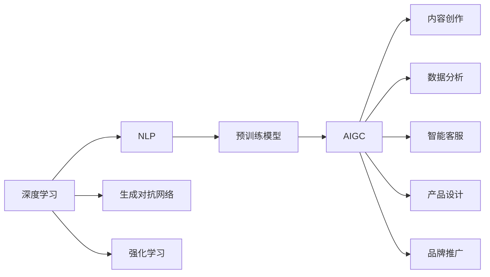

                 

# AIGC与企业任务的演变

## 1. 背景介绍

### 1.1 问题由来
近年来，人工智能生成内容（AIGC）技术在文本、图像、视频等多个领域取得了显著突破，正逐步成为引领信息产业的重要力量。企业在数字化转型中，越来越依赖于基于AIGC技术的智能应用，推动业务流程优化、提升运营效率、增强用户体验。AIGC技术，以其实力派地位，正在深刻改变着企业的运作模式和运营任务。

AIGC（Artificial Intelligence Generated Content），即人工智能生成内容，是指利用AI技术自动生成文本、图像、视频等各类信息内容。AIGC的发展离不开深度学习、自然语言处理、计算机视觉等技术的进步，得益于预训练模型（如GPT、BERT等）的普及和应用，AIGC技术已经广泛用于内容创作、数据分析、智能交互等多个领域。

从企业角度看，AIGC技术的引入，改变了传统的运营模式，优化了工作流程，提高了运营效率，增强了用户体验，带来了深刻的变化。因此，企业必须深刻理解和掌握AIGC技术的原理与应用，以便更好地应用到实际业务中。

### 1.2 问题核心关键点
AIGC技术的企业应用，涉及多个关键环节，包括但不限于以下几个方面：

- **自动化内容生成**：基于AIGC技术，企业可以快速生成各类内容，如新闻报道、产品介绍、市场分析报告等，极大地提升了内容创作的效率和质量。
- **智能数据分析**：通过AIGC技术，企业可以自动解析海量数据，进行数据摘要、信息抽取、情感分析等，为决策提供支撑。
- **客户服务优化**：AIGC技术可用于客户服务中的智能问答、自动化客服等，改善客户体验，提高服务响应速度。
- **产品设计优化**：通过AIGC技术生成产品概念、原型、设计图等，帮助企业快速迭代产品设计，缩短开发周期。
- **品牌传播推广**：利用AIGC技术自动生成创意内容，提高广告投放精准度，提升品牌传播效果。

这些关键点涉及到了AIGC技术在企业中的全面应用，覆盖了从内容创作、数据分析、客户服务、产品设计到品牌推广等多个方面，展示了AIGC技术的重要价值。

### 1.3 问题研究意义
AIGC技术在企业中的应用，对于提升企业运营效率、优化客户体验、推动业务创新具有重要意义：

- **提升效率**：AIGC技术可以大幅提升内容创作、数据分析等环节的自动化程度，减少人力投入，提升工作效率。
- **优化体验**：通过智能交互和自动化客服，提升客户服务质量，增强用户粘性。
- **促进创新**：基于AIGC技术生成新设计、新创意，助力企业快速迭代产品，推动业务创新。
- **优化决策**：通过数据分析和内容生成，为决策提供有力支持，提升决策科学性。

总之，AIGC技术为企业数字化转型提供了有力工具，推动了企业在自动化、智能化、个性化等方向的发展。企业必须深刻理解AIGC技术，才能更好地应用其带来的机会。

## 2. 核心概念与联系

### 2.1 核心概念概述

为了更好地理解AIGC技术在企业中的应用，我们首先介绍几个关键核心概念：

- **深度学习（Deep Learning）**：一种机器学习技术，通过构建多层神经网络，利用大量标注数据进行训练，自动提取数据特征。深度学习已经在图像识别、语音识别、自然语言处理等领域取得了突破性进展。

- **自然语言处理（NLP）**：一种人工智能技术，旨在让机器能够理解、处理和生成自然语言。NLP技术广泛应用于机器翻译、情感分析、文本摘要等场景。

- **预训练模型（Pre-trained Models）**：指在大规模无标签文本数据上预训练的通用语言模型，如BERT、GPT等。这些模型在特定领域的数据集上进行微调，可以提升模型的性能。

- **生成对抗网络（GAN）**：一种深度学习模型，通过两个神经网络的对抗过程，生成逼真的图像、视频等内容。GAN技术在图像生成、风格转换等方面表现优异。

- **强化学习（Reinforcement Learning）**：一种机器学习方法，通过智能体与环境的交互，最大化特定指标，如奖励、评分等。强化学习广泛应用于游戏、机器人控制等领域。

这些概念构成了AIGC技术的核心，每个概念都有其独特的原理和应用场景。这些核心概念通过深度学习、自然语言处理、预训练模型等技术，共同支撑AIGC技术在企业中的广泛应用。

### 2.2 核心概念联系与架构

为了更好地理解AIGC技术的应用场景和架构，我们通过以下Mermaid流程图展示各个核心概念之间的关系：



这个流程图展示了AIGC技术在企业中的不同应用场景，以及各个核心概念之间的联系。深度学习、自然语言处理、预训练模型等技术，通过AIGC技术，广泛应用于内容创作、数据分析、智能客服、产品设计、品牌推广等多个领域。

## 3. 核心算法原理 & 具体操作步骤

### 3.1 算法原理概述

AIGC技术在企业中的应用，涉及多个算法原理，其中核心算法包括深度学习、自然语言处理和预训练模型等。下面我们将详细介绍这些核心算法的基本原理：

#### 3.1.1 深度学习
深度学习是一种基于神经网络的机器学习方法，通过多层神经网络对数据进行特征提取和模式识别。深度学习在图像识别、语音识别、自然语言处理等领域取得了显著的成果。

深度学习的核心原理是多层神经网络的非线性变换。通过多层神经网络，深度学习模型可以自动提取数据中的高层次特征，实现对数据的有效处理。深度学习模型通常包括输入层、隐藏层和输出层，其中隐藏层通过非线性激活函数进行特征变换。

#### 3.1.2 自然语言处理
自然语言处理（NLP）是让机器理解、处理和生成自然语言的技术。NLP技术广泛应用于机器翻译、情感分析、文本摘要等场景。

NLP的核心原理是语言模型的训练和应用。语言模型通过训练大规模语料库，学习语言中的规律和模式，并用于生成文本、进行文本分类、命名实体识别等任务。NLP技术在企业中的应用，可以通过自动化的方式生成报告、总结、问答等，提升企业的运营效率。

#### 3.1.3 预训练模型
预训练模型是通过在大规模无标签数据上预训练的通用语言模型，如BERT、GPT等。这些模型在特定领域的数据集上进行微调，可以提升模型的性能。

预训练模型的核心原理是自监督学习。通过在大规模语料库上进行自监督学习，预训练模型学习到了语言中的通用表示，并用于处理特定任务。预训练模型通常包括语言建模、掩码语言模型、下一句预测等任务，可以有效地提升模型在特定任务上的表现。

### 3.2 算法步骤详解

AIGC技术在企业中的应用，涉及多个关键步骤，包括但不限于以下几个方面：

#### 3.2.1 数据收集与预处理
数据收集与预处理是AIGC技术应用的基础。企业需要收集相关的数据，如客户反馈、市场数据、产品信息等，并对数据进行清洗、标注等预处理操作。

#### 3.2.2 模型训练
模型训练是AIGC技术应用的的核心步骤。企业需要选择合适的预训练模型，如BERT、GPT等，在特定的数据集上进行微调，以适应企业的业务需求。

#### 3.2.3 模型评估与优化
模型评估与优化是AIGC技术应用的保障。企业需要评估模型的性能，如精度、召回率、F1值等，并对模型进行优化，以提升模型的效果。

#### 3.2.4 模型部署与集成
模型部署与集成是AIGC技术应用的最后一步。企业需要将训练好的模型部署到实际业务系统中，并与系统进行集成，以实现自动化的业务流程。

### 3.3 算法优缺点

AIGC技术在企业中的应用，具有以下优点：

1. **自动化程度高**：AIGC技术可以实现高度自动化的内容生成和数据分析，减少人力投入，提升工作效率。
2. **定制化能力强**：AIGC技术可以根据企业的需求，进行定制化的微调，满足不同的业务需求。
3. **效果显著**：AIGC技术在内容创作、数据分析、智能客服等场景中，具有显著的效果，能够提升企业的运营效率和用户体验。

同时，AIGC技术在企业中的应用也存在一些缺点：

1. **数据依赖性强**：AIGC技术需要大量的标注数据进行训练，如果数据质量不高，会影响模型的效果。
2. **模型复杂度高**：AIGC技术涉及复杂的深度学习模型和自然语言处理算法，模型复杂度高，难以理解和调试。
3. **技术门槛高**：AIGC技术的应用需要具备一定的技术背景，对于一般企业而言，技术门槛较高。

### 3.4 算法应用领域

AIGC技术在企业中的应用，涉及多个领域，包括但不限于以下几个方面：

1. **内容创作**：通过AIGC技术，企业可以快速生成各类内容，如新闻报道、产品介绍、市场分析报告等，极大地提升了内容创作的效率和质量。
2. **数据分析**：通过AIGC技术，企业可以自动解析海量数据，进行数据摘要、信息抽取、情感分析等，为决策提供支撑。
3. **智能客服**：AIGC技术可用于客户服务中的智能问答、自动化客服等，改善客户体验，提高服务响应速度。
4. **产品设计**：通过AIGC技术生成产品概念、原型、设计图等，帮助企业快速迭代产品设计，缩短开发周期。
5. **品牌传播**：利用AIGC技术自动生成创意内容，提高广告投放精准度，提升品牌传播效果。

这些关键点涉及到了AIGC技术在企业中的全面应用，展示了AIGC技术的重要价值。

## 4. 数学模型和公式 & 详细讲解 & 举例说明

### 4.1 数学模型构建

为了更好地理解AIGC技术在企业中的应用，我们通过数学模型来描述其基本原理。

假设企业需要生成一段文本内容，文本长度为L，文本的每个词的概率分布为P(w|w1,...,wL-1)，其中w为文本中的词，w1,...,wL-1为文本中的其他词。通过AIGC技术，企业可以生成文本内容，其概率为P(W|w1,...,wL-1)，其中W为生成的文本内容。

### 4.2 公式推导过程

文本生成的核心公式为：

$$
P(W|w1,...,wL-1) = \prod_{i=1}^{L} P(w_i|w1,...,w_{i-1})
$$

其中P(w_i|w1,...,w_{i-1})为条件概率，表示在已知前i-1个词的情况下，生成第i个词的概率。

在实际应用中，通过深度学习模型（如LSTM、Transformer等）对文本进行建模，利用模型参数θ表示文本的概率分布。通过训练数据集，优化模型参数θ，使得生成的文本内容与实际文本内容尽可能接近。

### 4.3 案例分析与讲解

假设企业需要生成一份新闻报道。首先，收集相关的新闻数据，对数据进行清洗和预处理，得到一个训练集。然后，选择适合的深度学习模型（如LSTM、Transformer等），在训练集上进行训练，得到一个新闻生成模型。最后，将用户输入的关键词作为输入，通过新闻生成模型生成一篇新闻报道。

## 5. 项目实践：代码实例和详细解释说明

### 5.1 开发环境搭建

在进行AIGC项目实践前，我们需要准备好开发环境。以下是使用Python进行PyTorch开发的环境配置流程：

1. 安装Anaconda：从官网下载并安装Anaconda，用于创建独立的Python环境。

2. 创建并激活虚拟环境：
```bash
conda create -n pytorch-env python=3.8 
conda activate pytorch-env
```

3. 安装PyTorch：根据CUDA版本，从官网获取对应的安装命令。例如：
```bash
conda install pytorch torchvision torchaudio cudatoolkit=11.1 -c pytorch -c conda-forge
```

4. 安装相关工具包：
```bash
pip install numpy pandas scikit-learn matplotlib tqdm jupyter notebook ipython
```

完成上述步骤后，即可在`pytorch-env`环境中开始AIGC实践。

### 5.2 源代码详细实现

下面以生成新闻报道为例，给出使用PyTorch进行AIGC的PyTorch代码实现。

首先，定义数据处理函数：

```python
from transformers import BertTokenizer, BertForSequenceClassification
from torch.utils.data import Dataset
import torch

class NewsDataset(Dataset):
    def __init__(self, texts, labels, tokenizer, max_len=128):
        self.texts = texts
        self.labels = labels
        self.tokenizer = tokenizer
        self.max_len = max_len
        
    def __len__(self):
        return len(self.texts)
    
    def __getitem__(self, item):
        text = self.texts[item]
        label = self.labels[item]
        
        encoding = self.tokenizer(text, return_tensors='pt', max_length=self.max_len, padding='max_length', truncation=True)
        input_ids = encoding['input_ids'][0]
        attention_mask = encoding['attention_mask'][0]
        
        # 对label进行编码
        encoded_labels = torch.tensor(label, dtype=torch.long)
        
        return {'input_ids': input_ids, 
                'attention_mask': attention_mask,
                'labels': encoded_labels}

# 创建dataset
tokenizer = BertTokenizer.from_pretrained('bert-base-cased')

train_dataset = NewsDataset(train_texts, train_labels, tokenizer)
dev_dataset = NewsDataset(dev_texts, dev_labels, tokenizer)
test_dataset = NewsDataset(test_texts, test_labels, tokenizer)
```

然后，定义模型和优化器：

```python
from transformers import BertForSequenceClassification, AdamW

model = BertForSequenceClassification.from_pretrained('bert-base-cased', num_labels=2)

optimizer = AdamW(model.parameters(), lr=2e-5)
```

接着，定义训练和评估函数：

```python
from torch.utils.data import DataLoader
from tqdm import tqdm
from sklearn.metrics import classification_report

device = torch.device('cuda') if torch.cuda.is_available() else torch.device('cpu')
model.to(device)

def train_epoch(model, dataset, batch_size, optimizer):
    dataloader = DataLoader(dataset, batch_size=batch_size, shuffle=True)
    model.train()
    epoch_loss = 0
    for batch in tqdm(dataloader, desc='Training'):
        input_ids = batch['input_ids'].to(device)
        attention_mask = batch['attention_mask'].to(device)
        labels = batch['labels'].to(device)
        model.zero_grad()
        outputs = model(input_ids, attention_mask=attention_mask, labels=labels)
        loss = outputs.loss
        epoch_loss += loss.item()
        loss.backward()
        optimizer.step()
    return epoch_loss / len(dataloader)

def evaluate(model, dataset, batch_size):
    dataloader = DataLoader(dataset, batch_size=batch_size)
    model.eval()
    preds, labels = [], []
    with torch.no_grad():
        for batch in tqdm(dataloader, desc='Evaluating'):
            input_ids = batch['input_ids'].to(device)
            attention_mask = batch['attention_mask'].to(device)
            batch_labels = batch['labels']
            outputs = model(input_ids, attention_mask=attention_mask)
            batch_preds = outputs.logits.argmax(dim=2).to('cpu').tolist()
            batch_labels = batch_labels.to('cpu').tolist()
            for pred, label in zip(batch_preds, batch_labels):
                preds.append(pred)
                labels.append(label)
                
    print(classification_report(labels, preds))
```

最后，启动训练流程并在测试集上评估：

```python
epochs = 5
batch_size = 16

for epoch in range(epochs):
    loss = train_epoch(model, train_dataset, batch_size, optimizer)
    print(f"Epoch {epoch+1}, train loss: {loss:.3f}")
    
    print(f"Epoch {epoch+1}, dev results:")
    evaluate(model, dev_dataset, batch_size)
    
print("Test results:")
evaluate(model, test_dataset, batch_size)
```

以上就是使用PyTorch进行新闻生成任务的AIGC实践的完整代码实现。可以看到，得益于Transformers库的强大封装，我们可以用相对简洁的代码完成新闻生成任务的AIGC。

### 5.3 代码解读与分析

让我们再详细解读一下关键代码的实现细节：

**NewsDataset类**：
- `__init__`方法：初始化新闻数据集，包括新闻内容、标签、分词器等。
- `__len__`方法：返回数据集的样本数量。
- `__getitem__`方法：对单个样本进行处理，将新闻内容输入编码为token ids，将标签编码为数字，并对其进行定长padding，最终返回模型所需的输入。

**模型训练和评估函数**：
- 使用PyTorch的DataLoader对数据集进行批次化加载，供模型训练和推理使用。
- 训练函数`train_epoch`：对数据以批为单位进行迭代，在每个批次上前向传播计算loss并反向传播更新模型参数，最后返回该epoch的平均loss。
- 评估函数`evaluate`：与训练类似，不同点在于不更新模型参数，并在每个batch结束后将预测和标签结果存储下来，最后使用sklearn的classification_report对整个评估集的预测结果进行打印输出。

**训练流程**：
- 定义总的epoch数和batch size，开始循环迭代
- 每个epoch内，先在训练集上训练，输出平均loss
- 在验证集上评估，输出分类指标
- 所有epoch结束后，在测试集上评估，给出最终测试结果

可以看到，PyTorch配合Transformers库使得新闻生成任务的AIGC代码实现变得简洁高效。开发者可以将更多精力放在数据处理、模型改进等高层逻辑上，而不必过多关注底层的实现细节。

当然，工业级的系统实现还需考虑更多因素，如模型的保存和部署、超参数的自动搜索、更灵活的任务适配层等。但核心的AIGC范式基本与此类似。

## 6. 实际应用场景

### 6.1 智能客服系统

基于AIGC技术的智能客服系统，已经在众多企业中得到广泛应用。传统的客服系统需要配备大量人力，高峰期响应缓慢，且一致性和专业性难以保证。而基于AIGC技术的智能客服系统，可以24小时不间断服务，快速响应客户咨询，用自然流畅的语言解答各类常见问题。

在技术实现上，可以收集企业内部的历史客服对话记录，将问题和最佳答复构建成监督数据，在此基础上对预训练模型进行微调。微调后的模型能够自动理解用户意图，匹配最合适的答案模板进行回复。对于客户提出的新问题，还可以接入检索系统实时搜索相关内容，动态组织生成回答。如此构建的智能客服系统，能大幅提升客户咨询体验和问题解决效率。

### 6.2 金融舆情监测

金融机构需要实时监测市场舆论动向，以便及时应对负面信息传播，规避金融风险。传统的人工监测方式成本高、效率低，难以应对网络时代海量信息爆发的挑战。基于AIGC技术的文本分类和情感分析技术，为金融舆情监测提供了新的解决方案。

具体而言，可以收集金融领域相关的新闻、报道、评论等文本数据，并对其进行主题标注和情感标注。在此基础上对预训练语言模型进行微调，使其能够自动判断文本属于何种主题，情感倾向是正面、中性还是负面。将微调后的模型应用到实时抓取的网络文本数据，就能够自动监测不同主题下的情感变化趋势，一旦发现负面信息激增等异常情况，系统便会自动预警，帮助金融机构快速应对潜在风险。

### 6.3 个性化推荐系统

当前的推荐系统往往只依赖用户的历史行为数据进行物品推荐，无法深入理解用户的真实兴趣偏好。基于AIGC技术的个性化推荐系统，可以更好地挖掘用户行为背后的语义信息，从而提供更精准、多样的推荐内容。

在实践中，可以收集用户浏览、点击、评论、分享等行为数据，提取和用户交互的物品标题、描述、标签等文本内容。将文本内容作为模型输入，用户的后续行为（如是否点击、购买等）作为监督信号，在此基础上微调预训练语言模型。微调后的模型能够从文本内容中准确把握用户的兴趣点。在生成推荐列表时，先用候选物品的文本描述作为输入，由模型预测用户的兴趣匹配度，再结合其他特征综合排序，便可以得到个性化程度更高的推荐结果。

### 6.4 未来应用展望

随着AIGC技术的不断发展，其在企业中的应用前景将更加广阔，为企业带来更多变革性的机遇。

在智慧医疗领域，基于AIGC技术的医疗问答、病历分析、药物研发等应用将提升医疗服务的智能化水平，辅助医生诊疗，加速新药开发进程。

在智能教育领域，AIGC技术可用于作业批改、学情分析、知识推荐等方面，因材施教，促进教育公平，提高教学质量。

在智慧城市治理中，AIGC技术可用于城市事件监测、舆情分析、应急指挥等环节，提高城市管理的自动化和智能化水平，构建更安全、高效的未来城市。

此外，在企业生产、社会治理、文娱传媒等众多领域，基于AIGC技术的智能应用也将不断涌现，为经济社会发展注入新的动力。相信随着技术的日益成熟，AIGC技术必将在更多领域大放异彩，深刻影响人类的生产生活方式。

## 7. 工具和资源推荐

### 7.1 学习资源推荐

为了帮助开发者系统掌握AIGC技术的理论基础和实践技巧，这里推荐一些优质的学习资源：

1. 《深度学习》系列书籍：如《深度学习入门》、《动手学深度学习》等，深入浅出地介绍了深度学习的原理和应用。

2. 《自然语言处理综述》系列论文：如《Attention is All You Need》、《BERT: Pre-training of Deep Bidirectional Transformers for Language Understanding》等，全面介绍了自然语言处理技术的最新进展。

3. 《Transformers库官方文档》：提供了完整的模型介绍和代码示例，是学习AIGC技术的重要资料。

4. 《自然语言处理与深度学习》课程：斯坦福大学开设的NLP明星课程，涵盖深度学习、自然语言处理等核心内容。

5. 《生成式对抗网络》书籍：如《Generative Adversarial Nets》等，介绍了生成对抗网络的原理和应用。

通过对这些资源的学习实践，相信你一定能够快速掌握AIGC技术的精髓，并用于解决实际的业务问题。

### 7.2 开发工具推荐

高效的开发离不开优秀的工具支持。以下是几款用于AIGC开发的常用工具：

1. PyTorch：基于Python的开源深度学习框架，灵活动态的计算图，适合快速迭代研究。

2. TensorFlow：由Google主导开发的开源深度学习框架，生产部署方便，适合大规模工程应用。

3. Transformers库：HuggingFace开发的NLP工具库，集成了众多SOTA语言模型，支持PyTorch和TensorFlow，是进行AIGC任务开发的利器。

4. Weights & Biases：模型训练的实验跟踪工具，可以记录和可视化模型训练过程中的各项指标，方便对比和调优。

5. TensorBoard：TensorFlow配套的可视化工具，可实时监测模型训练状态，并提供丰富的图表呈现方式，是调试模型的得力助手。

6. Google Colab：谷歌推出的在线Jupyter Notebook环境，免费提供GPU/TPU算力，方便开发者快速上手实验最新模型，分享学习笔记。

合理利用这些工具，可以显著提升AIGC任务的开发效率，加快创新迭代的步伐。

### 7.3 相关论文推荐

AIGC技术的发展源于学界的持续研究。以下是几篇奠基性的相关论文，推荐阅读：

1. Attention is All You Need：提出了Transformer结构，开启了NLP领域的预训练大模型时代。

2. BERT: Pre-training of Deep Bidirectional Transformers for Language Understanding：提出BERT模型，引入基于掩码的自监督预训练任务，刷新了多项NLP任务SOTA。

3. GANs Trained by a Two Time-Scale Update Rule Converge to a Local Nash Equilibrium：提出了生成对抗网络（GAN）的基本框架，为图像生成等任务提供了新的方法。

4. Adversarial Training Methods for Semi-Supervised Text Classification：提出对抗训练方法，增强模型泛化性能，提升分类效果。

5. Revisiting Pre-training for Natural Language Understanding：综述了预训练模型的最新进展，提供了从数据集选择到模型微调等全面指导。

这些论文代表了大模型技术的发展脉络。通过学习这些前沿成果，可以帮助研究者把握学科前进方向，激发更多的创新灵感。

## 8. 总结：未来发展趋势与挑战

### 8.1 总结

本文对AIGC技术在企业中的应用进行了全面系统的介绍。首先阐述了AIGC技术的发展背景和重要意义，明确了AIGC技术在企业中的广泛应用和巨大潜力。其次，从原理到实践，详细讲解了AIGC技术的核心算法和操作步骤，给出了AIGC任务开发的完整代码实例。同时，本文还广泛探讨了AIGC技术在多个行业领域的应用场景，展示了AIGC技术的实际价值。

通过本文的系统梳理，可以看到，AIGC技术在企业中的应用，已经在内容创作、数据分析、智能客服、产品设计、品牌推广等多个领域取得了显著成果。AIGC技术以其实力派地位，正深刻改变着企业的运作模式和运营任务，带来了深刻的变革。

### 8.2 未来发展趋势

展望未来，AIGC技术在企业中的应用将呈现以下几个发展趋势：

1. **自动化程度提高**：AIGC技术将进一步提升自动化程度，通过深度学习、自然语言处理等技术，实现更加智能化、自动化的业务流程。

2. **定制化能力增强**：AIGC技术将更加灵活，可以根据不同企业的需求，进行定制化的模型微调，满足特定业务需求。

3. **效果提升**：随着模型的不断优化，AIGC技术在内容创作、数据分析等场景中的效果将进一步提升，带来更高的运营效率和用户体验。

4. **多模态融合**：AIGC技术将更多地与其他模态数据融合，如图像、视频等，实现多模态内容的自动生成和处理，提升系统的全面性。

5. **实时性增强**：通过优化模型结构和计算图，AIGC技术将实现更快速、更高效的推理，提升系统的实时性。

6. **应用范围扩大**：AIGC技术将进一步拓展应用范围，应用于更多垂直领域，如医疗、教育、金融等，带来新的应用场景。

以上趋势凸显了AIGC技术在企业中的广阔前景，未来必将在更多行业领域得到广泛应用，带来深远影响。

### 8.3 面临的挑战

尽管AIGC技术在企业中的应用已经取得了显著成果，但在迈向更加智能化、普适化应用的过程中，仍面临诸多挑战：

1. **数据质量问题**：AIGC技术依赖大量高质量标注数据，如果数据质量不高，会影响模型的效果。

2. **模型复杂度高**：AIGC技术涉及复杂的深度学习模型和自然语言处理算法，模型复杂度高，难以理解和调试。

3. **技术门槛高**：AIGC技术的应用需要具备一定的技术背景，对于一般企业而言，技术门槛较高。

4. **可解释性不足**：AIGC技术生成的内容难以解释，缺乏透明性和可信度。

5. **安全性问题**：AIGC技术生成的内容可能包含误导性、有害的信息，带来安全隐患。

6. **资源消耗大**：AIGC技术在生成复杂内容时，消耗大量计算资源，难以实时处理大规模数据。

正视AIGC技术在应用过程中面临的挑战，积极应对并寻求突破，将是大模型技术向更加智能化、普适化应用迈进的关键。相信随着技术不断进步，AIGC技术必将在企业中发挥更大的作用。

### 8.4 研究展望

为了应对AIGC技术在应用过程中面临的挑战，未来的研究需要在以下几个方面寻求新的突破：

1. **数据增强技术**：通过数据增强技术，提升数据质量，优化模型训练过程。

2. **模型压缩与加速**：开发更高效、更轻量级的模型，提升模型推理效率，减少资源消耗。

3. **可解释性研究**：研究如何提高AIGC技术的可解释性，增强模型的透明性和可信度。

4. **安全性保障**：开发安全性保障技术，过滤有害信息，增强系统的安全性。

5. **多模态融合技术**：研究如何更好地将文本、图像、视频等多模态数据融合，提升系统的全面性。

6. **个性化推荐技术**：研究如何通过个性化推荐技术，提升用户体验，提高系统精准度。

这些研究方向的探索，必将引领AIGC技术向更高台阶发展，为构建安全、可靠、智能的智能系统铺平道路。面向未来，AIGC技术需要与其他人工智能技术进行更深入的融合，共同推动自然语言理解和智能交互系统的进步。只有勇于创新、敢于突破，才能不断拓展AIGC技术的边界，让智能技术更好地造福人类社会。

## 9. 附录：常见问题与解答

**Q1：什么是AIGC技术？**

A: AIGC（Artificial Intelligence Generated Content），即人工智能生成内容，是指利用AI技术自动生成文本、图像、视频等各类信息内容。AIGC技术广泛应用于内容创作、数据分析、智能客服等场景。

**Q2：AIGC技术在企业中的应用有哪些？**

A: AIGC技术在企业中的应用包括但不限于以下几个方面：
1. 内容创作：通过AIGC技术，企业可以快速生成各类内容，如新闻报道、产品介绍、市场分析报告等。
2. 数据分析：通过AIGC技术，企业可以自动解析海量数据，进行数据摘要、信息抽取、情感分析等，为决策提供支撑。
3. 智能客服：AIGC技术可用于客户服务中的智能问答、自动化客服等，改善客户体验，提高服务响应速度。
4. 产品设计：通过AIGC技术生成产品概念、原型、设计图等，帮助企业快速迭代产品设计，缩短开发周期。
5. 品牌传播：利用AIGC技术自动生成创意内容，提高广告投放精准度，提升品牌传播效果。

**Q3：AIGC技术在企业中面临哪些挑战？**

A: AIGC技术在企业中的应用面临以下几个挑战：
1. 数据质量问题：AIGC技术依赖大量高质量标注数据，如果数据质量不高，会影响模型的效果。
2. 模型复杂度高：AIGC技术涉及复杂的深度学习模型和自然语言处理算法，模型复杂度高，难以理解和调试。
3. 技术门槛高：AIGC技术的应用需要具备一定的技术背景，对于一般企业而言，技术门槛较高。
4. 可解释性不足：AIGC技术生成的内容难以解释，缺乏透明性和可信度。
5. 安全性问题：AIGC技术生成的内容可能包含误导性、有害的信息，带来安全隐患。
6. 资源消耗大：AIGC技术在生成复杂内容时，消耗大量计算资源，难以实时处理大规模数据。

**Q4：如何提高AIGC技术的可解释性？**

A: 提高AIGC技术的可解释性，可以从以下几个方面入手：
1. 使用可解释的模型：选择可解释性高的模型，如规则模型、决策树等，提高模型的透明性和可信度。
2. 增加解释性组件：在模型中加入解释性组件，如注意力机制、可解释的特征提取等，帮助解释模型的决策过程。
3. 可视化工具：利用可视化工具，如t-SNE、LIME等，对模型进行可视化，帮助理解模型的内部机制。

**Q5：如何优化AIGC技术的模型推理效率？**

A: 优化AIGC技术的模型推理效率，可以从以下几个方面入手：
1. 模型压缩：通过模型压缩技术，如剪枝、量化等，减小模型尺寸，提升推理速度。
2. 加速计算：使用高效的计算硬件，如GPU、TPU等，提高计算速度。
3. 分布式训练：通过分布式训练，将模型分布在多台计算节点上进行推理，提高并行处理能力。

通过这些优化手段，可以显著提升AIGC技术的模型推理效率，满足实际应用的需求。

---

作者：禅与计算机程序设计艺术 / Zen and the Art of Computer Programming

