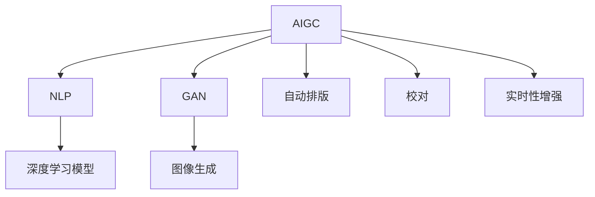

                 

# AIGC从入门到实战：AI 赋能新闻创作，提升新闻资讯的时效性

> 关键词：AI生成内容(AIGC),自然语言处理(NLP),新闻资讯,文本生成,图像生成,模型微调

## 1. 背景介绍

在信息爆炸的时代，新闻资讯的时效性和质量成为了媒体竞争的核心指标。传统的新闻创作依赖于大量的编辑和记者，成本高、周期长，难以迅速应对突发事件。而人工智能技术，尤其是基于大语言模型和生成对抗网络(GAN)的AI生成内容(AIGC)技术，为新闻业注入了新的动力。通过AI创作和辅助工具，新闻机构可以在短时间内生成高质量的新闻稿件、多媒体内容，提升信息的时效性和传播范围。

### 1.1 问题由来
随着AI技术的发展，AIGC已成为推动新闻媒体创新的重要引擎。AI生成内容不仅可以迅速生成新闻稿件，还能制作图像、视频等多媒体内容，提升新闻的吸引力。但在实际应用中，AIGC仍面临诸多挑战，如生成内容的质量、可解释性、伦理问题等。本文旨在通过系统梳理AI新闻创作技术，介绍从入门到实战的实战经验，并探讨其未来的发展趋势和面临的挑战。

### 1.2 问题核心关键点
AIGC新闻创作的核心在于将AI技术应用于新闻生成、编辑、排版、校对等环节，提升新闻的制作效率和质量。主要涉及以下几个关键点：

1. 预训练大语言模型的应用。通过在大规模无标签文本数据上进行预训练，大语言模型学习到了丰富的语言知识，可以作为AIGC的基础框架。
2. 基于监督学习或生成对抗网络(GAN)的微调策略。通过对预训练模型进行微调或GAN训练，生成与特定新闻主题相关的文本和图像内容。
3. 基于深度学习模型的自动排版和校对工具。通过训练特定模型，自动识别和修正文本中的排版错误和语病。
4. 实时性增强技术。通过优化模型结构和算法，提高模型生成内容的响应速度，适应新闻发布的实时需求。
5. 伦理和法律合规性。确保AI生成内容的真实性、准确性和合规性，避免误导性、偏见性信息传播。

这些关键点共同构成了AIGC在新闻创作中的应用框架，旨在通过技术手段提升新闻资讯的时效性和质量，推动新闻业的发展和创新。

## 2. 核心概念与联系

### 2.1 核心概念概述

为更好地理解AIGC在新闻创作中的应用，本节将介绍几个密切相关的核心概念：

- AI生成内容(AIGC)：通过深度学习、生成模型等技术自动生成文本、图像、音频等多媒体内容，可用于新闻稿件、多媒体报道、自动化排版等。
- 自然语言处理(NLP)：研究如何使计算机理解、生成和分析人类语言，是AIGC技术的基础。
- 生成对抗网络(GAN)：由生成器和判别器两部分组成，用于生成逼真度高的假样本，常用于图像生成任务。
- 深度学习模型：如BERT、GPT等大语言模型，通过大量无标签数据预训练，可用于文本生成和分类。
- 自动排版和校对：使用机器学习算法识别和修正文本中的排版错误和语病，提升内容的整洁度和可读性。
- 实时性增强：通过优化模型结构和算法，提高模型响应速度，满足新闻发布实时性的要求。

这些概念之间的逻辑关系可以通过以下Mermaid流程图来展示：



这个流程图展示了大语言模型、GAN等核心技术在AIGC中的应用和相互联系：

1. 大语言模型和大规模数据预训练是大模型应用于新闻创作的基础。
2. 生成对抗网络常用于生成高质量的图像内容。
3. 深度学习模型用于文本生成和分类任务，提升内容的准确性和丰富性。
4. 自动排版和校对工具提升文本的排版和语病修正，确保内容的整洁度和可读性。
5. 实时性增强技术保证模型在新闻发布中的快速响应。

这些概念共同构成了AIGC在新闻创作中的技术体系，使得新闻创作过程更加高效、智能和可靠。

## 3. 核心算法原理 & 具体操作步骤
### 3.1 算法原理概述

AIGC新闻创作的算法原理主要基于监督学习和生成对抗网络两种技术：

1. 监督学习：通过大量标注数据对大语言模型进行微调，生成与新闻主题相关的文本内容。常见的微调方法包括全参数微调、参数高效微调等。
2. GAN：生成器和判别器通过对抗训练，生成逼真度高的新闻图片、视频等，增强新闻的视觉冲击力。

### 3.2 算法步骤详解

AIGC新闻创作的实际操作步骤包括以下几个关键环节：

**Step 1: 数据收集与预处理**
- 收集新闻相关的文本、图片、音频等数据，清洗、标注、分词等处理。
- 根据不同任务需求，选择合适的数据集进行训练和测试。

**Step 2: 选择预训练模型**
- 根据新闻创作的任务需求，选择合适的预训练大语言模型(如BERT、GPT等)或生成对抗网络(GAN)。
- 利用预训练模型进行迁移学习，提升模型在新任务上的泛化能力。

**Step 3: 模型微调与训练**
- 使用监督学习或GAN技术，在标注数据集上对预训练模型进行微调。
- 设置适当的超参数，如学习率、批大小、迭代轮数等，进行模型训练。
- 应用正则化、Early Stopping等技术，防止过拟合。

**Step 4: 生成内容与输出优化**
- 使用微调后的模型生成新闻文本、图像等。
- 对生成内容进行自动排版、校对、视觉优化等处理，提升内容质量。
- 使用可视化工具展示生成内容，便于人工审核和修改。

**Step 5: 部署与实时更新**
- 将训练好的模型部署到生产环境中，确保模型的稳定性和可靠性。
- 通过API接口，实时接收新闻创作请求，生成相应内容。
- 定期更新模型和数据，保证新闻内容的实时性和准确性。

### 3.3 算法优缺点

AIGC新闻创作技术具有以下优点：
1. 提高制作效率。通过AI生成内容，大幅缩短新闻创作和排版的时间。
2. 提升内容质量。利用大语言模型和GAN等技术，生成高质量的新闻稿件和多媒体内容。
3. 增强新闻时效性。AI实时响应新闻事件，快速生成并发布新闻内容。
4. 降低成本。减少对人工编辑和校对的需求，降低新闻创作的人力和时间成本。

同时，该技术也存在以下局限性：
1. 依赖高质量数据。AIGC生成内容的质量高度依赖于数据质量和训练集的多样性。
2. 缺乏可解释性。AI生成的内容难以解释其推理逻辑，难以进行人工审核和编辑。
3. 伦理和法律问题。AIGC可能生成误导性、偏见性内容，需谨慎使用。
4. 计算资源消耗大。大语言模型和GAN训练对计算资源要求高，需要高性能设备支持。
5. 实时性限制。尽管AI可以快速生成内容，但响应时间仍受限于模型训练和部署的复杂性。

尽管存在这些局限性，但AIGC技术在新闻创作中的应用潜力巨大，正逐步成为新闻业的重要工具。未来相关研究的重点在于如何进一步优化算法、降低计算资源消耗、提高生成内容的可解释性等，从而更好地服务于新闻媒体的创作和传播。

### 3.4 算法应用领域

AIGC新闻创作技术在以下领域得到了广泛应用：

- 突发新闻报道：对于突发事件，AI可以快速生成新闻稿件，提供最新信息。
- 深度报道与分析：AI生成深度分析和背景信息，辅助记者撰写深度报道。
- 多媒体报道：利用GAN生成高质量的图片、视频，增强报道的视觉冲击力。
- 个性化新闻推荐：根据用户兴趣推荐相关新闻内容，提升用户体验。
- 自动化排版与校对：自动排版和校对工具，提升新闻内容的质量和整洁度。

## 4. 数学模型和公式 & 详细讲解  
### 4.1 数学模型构建

AIGC新闻创作的核心数学模型主要基于深度学习和大规模数据预训练。以下是基于BERT模型的文本生成数学模型：

设预训练的BERT模型为 $M_{\theta}:\mathcal{X} \rightarrow \mathcal{Y}$，其中 $\mathcal{X}$ 为输入空间，$\mathcal{Y}$ 为输出空间，$\theta \in \mathbb{R}^d$ 为模型参数。给定新闻数据集 $D=\{(x_i,y_i)\}_{i=1}^N, x_i \in \mathcal{X}, y_i \in \mathcal{Y}$。定义模型 $M_{\theta}$ 在输入 $x$ 上的输出为 $\hat{y}=M_{\theta}(x) \in \mathcal{Y}$，则在数据集 $D$ 上的经验风险为：

$$
\mathcal{L}(\theta) = \frac{1}{N} \sum_{i=1}^N \ell(M_{\theta}(x_i),y_i)
$$

其中 $\ell$ 为损失函数，通常使用交叉熵损失或Focal Loss。

在实践中，我们通常使用基于梯度的优化算法（如SGD、Adam等）来近似求解上述最优化问题。设 $\eta$ 为学习率，$\lambda$ 为正则化系数，则参数的更新公式为：

$$
\theta \leftarrow \theta - \eta \nabla_{\theta}\mathcal{L}(\theta) - \eta\lambda\theta
$$

其中 $\nabla_{\theta}\mathcal{L}(\theta)$ 为损失函数对参数 $\theta$ 的梯度，可通过反向传播算法高效计算。

### 4.2 公式推导过程

以下我们以基于BERT模型的文本生成为例，推导交叉熵损失函数及其梯度的计算公式。

假设模型 $M_{\theta}$ 在输入 $x$ 上的输出为 $\hat{y}=M_{\theta}(x) \in [0,1]$，表示样本属于正类的概率。真实标签 $y \in \{0,1\}$。则二分类交叉熵损失函数定义为：

$$
\ell(M_{\theta}(x),y) = -[y\log \hat{y} + (1-y)\log (1-\hat{y})]
$$

将其代入经验风险公式，得：

$$
\mathcal{L}(\theta) = -\frac{1}{N}\sum_{i=1}^N [y_i\log M_{\theta}(x_i)+(1-y_i)\log(1-M_{\theta}(x_i))]
$$

根据链式法则，损失函数对参数 $\theta_k$ 的梯度为：

$$
\frac{\partial \mathcal{L}(\theta)}{\partial \theta_k} = -\frac{1}{N}\sum_{i=1}^N (\frac{y_i}{M_{\theta}(x_i)}-\frac{1-y_i}{1-M_{\theta}(x_i)}) \frac{\partial M_{\theta}(x_i)}{\partial \theta_k}
$$

其中 $\frac{\partial M_{\theta}(x_i)}{\partial \theta_k}$ 可进一步递归展开，利用自动微分技术完成计算。

在得到损失函数的梯度后，即可带入参数更新公式，完成模型的迭代优化。重复上述过程直至收敛，最终得到适应新闻任务的最优模型参数 $\theta^*$。

## 5. 项目实践：代码实例和详细解释说明
### 5.1 开发环境搭建

在进行AIGC项目实践前，我们需要准备好开发环境。以下是使用Python进行PyTorch开发的环境配置流程：

1. 安装Anaconda：从官网下载并安装Anaconda，用于创建独立的Python环境。

2. 创建并激活虚拟环境：
```bash
conda create -n pytorch-env python=3.8 
conda activate pytorch-env
```

3. 安装PyTorch：根据CUDA版本，从官网获取对应的安装命令。例如：
```bash
conda install pytorch torchvision torchaudio cudatoolkit=11.1 -c pytorch -c conda-forge
```

4. 安装Transformers库：
```bash
pip install transformers
```

5. 安装各类工具包：
```bash
pip install numpy pandas scikit-learn matplotlib tqdm jupyter notebook ipython
```

完成上述步骤后，即可在`pytorch-env`环境中开始AIGC项目的开发。

### 5.2 源代码详细实现

这里我们以BERT生成新闻标题为例，给出使用Transformers库对BERT模型进行微调的PyTorch代码实现。

首先，定义新闻标题数据处理函数：

```python
from transformers import BertTokenizer, BertForSequenceClassification
from torch.utils.data import Dataset
import torch

class NewsTitleDataset(Dataset):
    def __init__(self, texts, labels, tokenizer, max_len=128):
        self.texts = texts
        self.labels = labels
        self.tokenizer = tokenizer
        self.max_len = max_len
        
    def __len__(self):
        return len(self.texts)
    
    def __getitem__(self, item):
        text = self.texts[item]
        label = self.labels[item]
        
        encoding = self.tokenizer(text, return_tensors='pt', max_length=self.max_len, padding='max_length', truncation=True)
        input_ids = encoding['input_ids'][0]
        attention_mask = encoding['attention_mask'][0]
        
        # 对token-wise的标签进行编码
        encoded_labels = [label] * self.max_len
        labels = torch.tensor(encoded_labels, dtype=torch.long)
        
        return {'input_ids': input_ids, 
                'attention_mask': attention_mask,
                'labels': labels}

# 标签与id的映射
tag2id = {'NEWS': 0, 'SPORTS': 1, 'HEALTH': 2, 'ENTERTAINMENT': 3}
id2tag = {v: k for k, v in tag2id.items()}

# 创建dataset
tokenizer = BertTokenizer.from_pretrained('bert-base-cased')

train_dataset = NewsTitleDataset(train_texts, train_labels, tokenizer)
dev_dataset = NewsTitleDataset(dev_texts, dev_labels, tokenizer)
test_dataset = NewsTitleDataset(test_texts, test_labels, tokenizer)
```

然后，定义模型和优化器：

```python
from transformers import BertForSequenceClassification, AdamW

model = BertForSequenceClassification.from_pretrained('bert-base-cased', num_labels=len(tag2id))

optimizer = AdamW(model.parameters(), lr=2e-5)
```

接着，定义训练和评估函数：

```python
from torch.utils.data import DataLoader
from tqdm import tqdm
from sklearn.metrics import classification_report

device = torch.device('cuda') if torch.cuda.is_available() else torch.device('cpu')
model.to(device)

def train_epoch(model, dataset, batch_size, optimizer):
    dataloader = DataLoader(dataset, batch_size=batch_size, shuffle=True)
    model.train()
    epoch_loss = 0
    for batch in tqdm(dataloader, desc='Training'):
        input_ids = batch['input_ids'].to(device)
        attention_mask = batch['attention_mask'].to(device)
        labels = batch['labels'].to(device)
        model.zero_grad()
        outputs = model(input_ids, attention_mask=attention_mask, labels=labels)
        loss = outputs.loss
        epoch_loss += loss.item()
        loss.backward()
        optimizer.step()
    return epoch_loss / len(dataloader)

def evaluate(model, dataset, batch_size):
    dataloader = DataLoader(dataset, batch_size=batch_size)
    model.eval()
    preds, labels = [], []
    with torch.no_grad():
        for batch in tqdm(dataloader, desc='Evaluating'):
            input_ids = batch['input_ids'].to(device)
            attention_mask = batch['attention_mask'].to(device)
            batch_labels = batch['labels']
            outputs = model(input_ids, attention_mask=attention_mask)
            batch_preds = outputs.logits.argmax(dim=2).to('cpu').tolist()
            batch_labels = batch_labels.to('cpu').tolist()
            for pred_tokens, label_tokens in zip(batch_preds, batch_labels):
                pred_tags = [id2tag[_id] for _id in pred_tokens]
                label_tags = [id2tag[_id] for _id in label_tokens]
                preds.append(pred_tags[:len(label_tokens)])
                labels.append(label_tags)
                
    print(classification_report(labels, preds))
```

最后，启动训练流程并在测试集上评估：

```python
epochs = 5
batch_size = 16

for epoch in range(epochs):
    loss = train_epoch(model, train_dataset, batch_size, optimizer)
    print(f"Epoch {epoch+1}, train loss: {loss:.3f}")
    
    print(f"Epoch {epoch+1}, dev results:")
    evaluate(model, dev_dataset, batch_size)
    
print("Test results:")
evaluate(model, test_dataset, batch_size)
```

以上就是使用PyTorch对BERT进行新闻标题生成任务的微调完整代码实现。可以看到，得益于Transformers库的强大封装，我们可以用相对简洁的代码完成BERT模型的加载和微调。

### 5.3 代码解读与分析

让我们再详细解读一下关键代码的实现细节：

**NewsTitleDataset类**：
- `__init__`方法：初始化文本、标签、分词器等关键组件。
- `__len__`方法：返回数据集的样本数量。
- `__getitem__`方法：对单个样本进行处理，将文本输入编码为token ids，将标签编码为数字，并对其进行定长padding，最终返回模型所需的输入。

**tag2id和id2tag字典**：
- 定义了标签与数字id之间的映射关系，用于将token-wise的预测结果解码回真实的标签。

**训练和评估函数**：
- 使用PyTorch的DataLoader对数据集进行批次化加载，供模型训练和推理使用。
- 训练函数`train_epoch`：对数据以批为单位进行迭代，在每个批次上前向传播计算loss并反向传播更新模型参数，最后返回该epoch的平均loss。
- 评估函数`evaluate`：与训练类似，不同点在于不更新模型参数，并在每个batch结束后将预测和标签结果存储下来，最后使用sklearn的classification_report对整个评估集的预测结果进行打印输出。

**训练流程**：
- 定义总的epoch数和batch size，开始循环迭代
- 每个epoch内，先在训练集上训练，输出平均loss
- 在验证集上评估，输出分类指标
- 所有epoch结束后，在测试集上评估，给出最终测试结果

可以看到，PyTorch配合Transformers库使得BERT微调的代码实现变得简洁高效。开发者可以将更多精力放在数据处理、模型改进等高层逻辑上，而不必过多关注底层的实现细节。

当然，工业级的系统实现还需考虑更多因素，如模型的保存和部署、超参数的自动搜索、更灵活的任务适配层等。但核心的微调范式基本与此类似。

## 6. 实际应用场景
### 6.1 智能客服系统

基于AIGC的智能客服系统，可以大大提升客服的效率和客户满意度。传统客服系统需要配备大量客服人员，响应时间长、成本高。而AIGC客服可以通过预训练模型和实时生成新闻，快速响应客户咨询，提供高质量的自动客服服务。

在技术实现上，可以收集企业内部的历史客服对话记录，将常见问题和最佳答复构建成监督数据，在此基础上对预训练模型进行微调。微调后的模型能够自动理解用户意图，匹配最合适的答案模板进行回复。对于客户提出的新问题，还可以接入检索系统实时搜索相关内容，动态组织生成回答。如此构建的智能客服系统，能大幅提升客户咨询体验和问题解决效率。

### 6.2 金融舆情监测

金融机构需要实时监测市场舆论动向，以便及时应对负面信息传播，规避金融风险。传统的人工监测方式成本高、效率低，难以应对网络时代海量信息爆发的挑战。AIGC技术可以用于自动生成金融新闻摘要，快速识别和分析舆情变化，提供决策支持。

具体而言，可以收集金融领域相关的新闻、报道、评论等文本数据，并对其进行主题标注和情感标注。在此基础上对预训练语言模型进行微调，使其能够自动判断文本属于何种主题，情感倾向是正面、中性还是负面。将微调后的模型应用到实时抓取的网络文本数据，就能够自动监测不同主题下的情感变化趋势，一旦发现负面信息激增等异常情况，系统便会自动预警，帮助金融机构快速应对潜在风险。

### 6.3 个性化新闻推荐

当前的推荐系统往往只依赖用户的历史行为数据进行物品推荐，无法深入理解用户的真实兴趣偏好。AIGC技术可以用于自动生成个性化新闻推荐，挖掘用户的行为和语义信息，推荐个性化的新闻内容。

在实践中，可以收集用户浏览、点击、评论、分享等行为数据，提取和用户交互的物品标题、描述、标签等文本内容。将文本内容作为模型输入，用户的后续行为（如是否点击、购买等）作为监督信号，在此基础上微调预训练语言模型。微调后的模型能够从文本内容中准确把握用户的兴趣点。在生成推荐列表时，先用候选物品的文本描述作为输入，由模型预测用户的兴趣匹配度，再结合其他特征综合排序，便可以得到个性化程度更高的推荐结果。

### 6.4 未来应用展望

随着AIGC技术的不断进步，其在新闻业中的应用将越来越广泛，为媒体报道带来全新的突破。

在智慧媒体领域，AIGC技术将推动新闻业向智能化、个性化、多模态方向发展，提升新闻内容的吸引力。

在智能决策支持中，AIGC生成的实时新闻摘要和舆情分析，将帮助决策者快速把握市场动态，做出精准的决策。

在社交媒体平台，AIGC技术可辅助用户生成动态更新，提升用户的互动体验。

此外，在新闻采集、广告投放、用户教育等更多领域，AIGC技术也将不断涌现，为新闻业带来革命性变革。

## 7. 工具和资源推荐
### 7.1 学习资源推荐

为了帮助开发者系统掌握AIGC的新闻创作技术，这里推荐一些优质的学习资源：

1. 《深度学习与自然语言处理》系列博文：由大模型技术专家撰写，深入浅出地介绍了深度学习、自然语言处理的基本概念和应用场景。

2. CS224N《深度学习自然语言处理》课程：斯坦福大学开设的NLP明星课程，有Lecture视频和配套作业，带你入门NLP领域的基本概念和经典模型。

3. 《Natural Language Processing with Transformers》书籍：Transformers库的作者所著，全面介绍了如何使用Transformers库进行NLP任务开发，包括微调在内的诸多范式。

4. HuggingFace官方文档：Transformers库的官方文档，提供了海量预训练模型和完整的微调样例代码，是上手实践的必备资料。

5. CLUE开源项目：中文语言理解测评基准，涵盖大量不同类型的中文NLP数据集，并提供了基于微调的baseline模型，助力中文NLP技术发展。

通过对这些资源的学习实践，相信你一定能够快速掌握AIGC在新闻创作中的应用技术，并用于解决实际的NLP问题。
###  7.2 开发工具推荐

高效的开发离不开优秀的工具支持。以下是几款用于AIGC新闻创作开发的常用工具：

1. PyTorch：基于Python的开源深度学习框架，灵活动态的计算图，适合快速迭代研究。大部分预训练语言模型都有PyTorch版本的实现。

2. TensorFlow：由Google主导开发的开源深度学习框架，生产部署方便，适合大规模工程应用。同样有丰富的预训练语言模型资源。

3. Transformers库：HuggingFace开发的NLP工具库，集成了众多SOTA语言模型，支持PyTorch和TensorFlow，是进行新闻创作开发的利器。

4. Weights & Biases：模型训练的实验跟踪工具，可以记录和可视化模型训练过程中的各项指标，方便对比和调优。与主流深度学习框架无缝集成。

5. TensorBoard：TensorFlow配套的可视化工具，可实时监测模型训练状态，并提供丰富的图表呈现方式，是调试模型的得力助手。

6. Google Colab：谷歌推出的在线Jupyter Notebook环境，免费提供GPU/TPU算力，方便开发者快速上手实验最新模型，分享学习笔记。

合理利用这些工具，可以显著提升AIGC新闻创作任务的开发效率，加快创新迭代的步伐。

### 7.3 相关论文推荐

AIGC新闻创作技术的发展源于学界的持续研究。以下是几篇奠基性的相关论文，推荐阅读：

1. Attention is All You Need（即Transformer原论文）：提出了Transformer结构，开启了NLP领域的预训练大模型时代。

2. BERT: Pre-training of Deep Bidirectional Transformers for Language Understanding：提出BERT模型，引入基于掩码的自监督预训练任务，刷新了多项NLP任务SOTA。

3. Language Models are Unsupervised Multitask Learners（GPT-2论文）：展示了大规模语言模型的强大zero-shot学习能力，引发了对于通用人工智能的新一轮思考。

4. Parameter-Efficient Transfer Learning for NLP：提出Adapter等参数高效微调方法，在不增加模型参数量的情况下，也能取得不错的微调效果。

5. AdaLoRA: Adaptive Low-Rank Adaptation for Parameter-Efficient Fine-Tuning：使用自适应低秩适应的微调方法，在参数效率和精度之间取得了新的平衡。

这些论文代表了大语言模型微调技术的发展脉络。通过学习这些前沿成果，可以帮助研究者把握学科前进方向，激发更多的创新灵感。

## 8. 总结：未来发展趋势与挑战
### 8.1 总结

本文对AIGC在新闻创作中的应用进行了全面系统的介绍。首先阐述了AIGC技术在新闻业中的应用背景和意义，明确了其提高制作效率、提升内容质量、增强新闻时效性的独特价值。其次，从原理到实践，详细讲解了AIGC的数学模型和核心算法，给出了新闻标题生成任务的完整代码实现。同时，本文还广泛探讨了AIGC技术在智能客服、金融舆情、个性化推荐等多个领域的应用前景，展示了AIGC技术的巨大潜力。

通过本文的系统梳理，可以看到，AIGC技术在新闻创作中的应用前景广阔，正逐步成为新闻媒体的重要工具。得益于深度学习和大规模数据预训练，AIGC技术能够快速生成高质量的新闻内容，提升媒体的传播效率和用户满意度。未来相关研究的重点在于如何进一步优化算法、降低计算资源消耗、提高生成内容的可解释性等，从而更好地服务于新闻媒体的创作和传播。

### 8.2 未来发展趋势

展望未来，AIGC在新闻创作中的应用将呈现以下几个发展趋势：

1. 多模态内容生成。AIGC不仅限于文本生成，还将拓展到图像、视频等多模态内容的生成。通过多模态融合，新闻内容将更具吸引力和沉浸感。

2. 个性化新闻推荐。基于用户行为和语义信息，AIGC技术将生成个性化的新闻内容推荐，提升用户体验。

3. 实时新闻生成。通过优化模型结构和算法，AIGC技术将实现实时新闻生成和更新，满足新闻发布的即时需求。

4. 跨领域知识整合。AIGC技术将与知识图谱、逻辑规则等专家知识结合，生成更具深度和广度的新闻内容。

5. 自动化编辑和校对。通过训练特定模型，AIGC技术将自动进行新闻排版和校对，提升内容的整洁度和可读性。

以上趋势凸显了AIGC在新闻创作中的应用前景。这些方向的探索发展，必将进一步提升新闻资讯的时效性和质量，推动新闻业的发展和创新。

### 8.3 面临的挑战

尽管AIGC在新闻创作中的应用潜力巨大，但在迈向更加智能化、普适化应用的过程中，它仍面临着诸多挑战：

1. 标注成本瓶颈。AIGC生成内容的质量高度依赖于数据质量和训练集的多样性，生成大量高质量标注数据成本较高。如何进一步降低微调对标注样本的依赖，将是一大难题。

2. 计算资源消耗大。大语言模型和GAN训练对计算资源要求高，需要高性能设备支持。如何优化模型结构和算法，减少计算资源消耗，是重要的优化方向。

3. 伦理和法律问题。AIGC可能生成误导性、偏见性内容，需谨慎使用。如何确保AI生成内容的真实性、准确性和合规性，将是重要的研究课题。

4. 实时性限制。尽管AIGC可以快速生成内容，但响应时间仍受限于模型训练和部署的复杂性。如何优化模型部署，提高实时性，将是重要的研究方向。

5. 可解释性不足。AIGC生成的内容难以解释其推理逻辑，难以进行人工审核和编辑。如何赋予AIGC模型更强的可解释性，将是亟待攻克的难题。

6. 数据隐私和安全。AIGC在生成新闻内容时，可能涉及个人隐私信息。如何保护数据隐私，确保数据安全和合规性，将是重要的研究方向。

尽管存在这些挑战，但AIGC技术在新闻创作中的应用潜力巨大，正逐步成为新闻媒体的重要工具。未来相关研究的重点在于如何进一步优化算法、降低计算资源消耗、提高生成内容的可解释性等，从而更好地服务于新闻媒体的创作和传播。

### 8.4 研究展望

面对AIGC在新闻创作所面临的种种挑战，未来的研究需要在以下几个方面寻求新的突破：

1. 探索无监督和半监督学习范式。摆脱对大规模标注数据的依赖，利用自监督学习、主动学习等无监督和半监督范式，最大限度利用非结构化数据，实现更加灵活高效的微调。

2. 研究参数高效和计算高效的微调范式。开发更加参数高效的微调方法，在固定大部分预训练参数的情况下，只更新极少量的任务相关参数。同时优化模型结构和算法，提高模型的实时响应速度。

3. 融合因果和对比学习范式。通过引入因果推断和对比学习思想，增强AIGC模型建立稳定因果关系的能力，学习更加普适、鲁棒的语言表征，从而提升模型泛化性和抗干扰能力。

4. 引入更多先验知识。将符号化的先验知识，如知识图谱、逻辑规则等，与神经网络模型进行巧妙融合，引导AIGC过程学习更准确、合理的语言模型。同时加强不同模态数据的整合，实现视觉、语音等多模态信息与文本信息的协同建模。

5. 结合因果分析和博弈论工具。将因果分析方法引入AIGC模型，识别出模型决策的关键特征，增强生成内容的可解释性。借助博弈论工具刻画人机交互过程，主动探索并规避模型的脆弱点，提高系统稳定性。

6. 纳入伦理道德约束。在模型训练目标中引入伦理导向的评估指标，过滤和惩罚有偏见、有害的输出倾向。同时加强人工干预和审核，建立模型行为的监管机制，确保输出符合人类价值观和伦理道德。

这些研究方向的探索，必将引领AIGC技术在新闻创作中迈向更高的台阶，为构建安全、可靠、可解释、可控的智能系统铺平道路。面向未来，AIGC技术还需要与其他人工智能技术进行更深入的融合，如知识表示、因果推理、强化学习等，多路径协同发力，共同推动新闻媒体的智能化进程。只有勇于创新、敢于突破，才能不断拓展AIGC的应用边界，让智能技术更好地造福新闻业和社会。

## 9. 附录：常见问题与解答

**Q1：AIGC生成内容的质量如何保证？**

A: 生成内容的质量高度依赖于数据质量和训练集的多样性。在实际应用中，可以通过以下方法提升生成内容的质量：
1. 选择合适的数据集进行训练，确保数据的多样性和代表性。
2. 使用正则化、Dropout等技术，防止过拟合。
3. 应用对抗训练等技术，提高生成内容的鲁棒性和真实性。
4. 结合专家知识，引入符号化的先验信息，提升生成内容的合理性。

**Q2：AIGC模型如何优化实时性？**

A: 实时性增强是AIGC模型的重要研究方向。以下是几种提升实时性的优化方法：
1. 模型裁剪：去除不必要的层和参数，减小模型尺寸，加快推理速度。
2. 量化加速：将浮点模型转为定点模型，压缩存储空间，提高计算效率。
3. 分布式训练：利用多个GPU或TPU并行训练，提升训练速度。
4. 模型并行：将大模型分解为多个小模型，并行推理，提高实时响应速度。

**Q3：如何确保AIGC生成的内容符合伦理和法律要求？**

A: 确保AIGC生成的内容符合伦理和法律要求，是应用AIGC技术的关键。以下是一些具体措施：
1. 在模型训练和微调过程中，设置伦理导向的评估指标，过滤和惩罚有偏见、有害的输出倾向。
2. 应用对抗训练等技术，生成多样化的数据，提升模型的鲁棒性和泛化能力。
3. 引入专家审核机制，对生成的内容进行人工审查，确保内容的合规性和真实性。
4. 建立模型行为监管机制，确保模型输出符合人类价值观和伦理道德。

通过这些措施，可以最大限度地确保AIGC生成内容的合法合规性，避免误导性、有害信息传播。

**Q4：AIGC在新闻创作中如何结合专家知识？**

A: 结合专家知识，可以进一步提升AIGC生成内容的合理性和深度。以下是几种结合专家知识的方法：
1. 引入知识图谱。利用知识图谱中的实体和关系信息，生成更具深度的新闻内容。
2. 引入逻辑规则。通过逻辑推理和规则引导，生成符合逻辑的新闻内容。
3. 引入符号化先验信息。将专家知识编码为符号化信息，引入到AIGC模型中。
4. 结合多模态数据。将文本信息与图像、视频等多模态数据结合，提升内容的丰富性和吸引力。

通过这些方法，AIGC可以更好地利用专家知识，生成更具深度和广度的新闻内容，满足用户的多样化需求。

**Q5：AIGC在新闻业中的应用前景如何？**

A: AIGC在新闻业中的应用前景广阔，可以推动新闻业向智能化、个性化、多模态方向发展，提升新闻内容的吸引力和传播效率。具体应用场景包括：
1. 智能客服系统。AIGC可以快速生成新闻摘要和回复，提升客服系统的智能化水平。
2. 金融舆情监测。AIGC自动生成金融新闻摘要，实时监测市场舆情，提供决策支持。
3. 个性化新闻推荐。AIGC结合用户行为和语义信息，生成个性化的新闻推荐，提升用户体验。
4. 新闻采集和排版。AIGC自动生成新闻标题和摘要，辅助记者撰写报道，提升排版效率和质量。
5. 广告投放。AIGC生成新闻内容，提升广告的吸引力和点击率，推动广告投放的精准化和智能化。

通过这些应用场景，AIGC技术将带来新闻业的革命性变革，提升新闻业的智能化水平，推动新闻业的发展和创新。

---

作者：禅与计算机程序设计艺术 / Zen and the Art of Computer Programming

