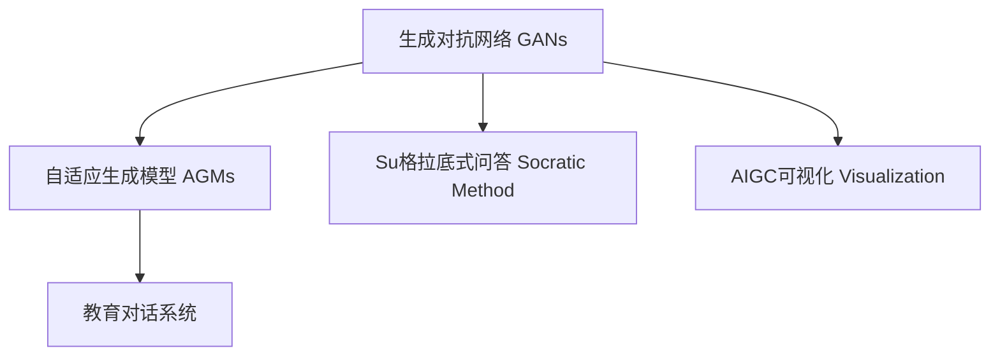

                 

# AIGC从入门到实战：AIGC 在教育行业的创新场景—苏格拉底式的问答模式和AIGC 可视化创新

## 1. 背景介绍

### 1.1 问题由来
随着人工智能技术的发展，生成对抗网络（Generative Adversarial Networks, GANs）和自适应生成模型（Adaptive Generation Models, AGMs）等生成模型逐渐成熟并应用于各个领域，推动了人工智能的创造性生成能力的进步。特别是在教育行业，这些生成技术赋予了AI以更强大的能力，帮助我们构建新的教学模式和学习场景。

### 1.2 问题核心关键点
在教育领域，特别是教育场景中，我们关心如何利用AIGC技术来提升教学效果和学习体验。其中，如何实现基于AIGC的教育对话系统是一个关键问题，这个系统能够以类似于苏格拉底式的问答模式进行教学，它不仅能激发学生的思考，还能根据学生的回答提供个性化的学习建议。

### 1.3 问题研究意义
开发基于AIGC的教育对话系统，其意义在于：

1. 提升教学质量：通过个性化的交互式学习，AIGC能根据学生的反应调整教学内容和难度，提供更高效的学习路径。
2. 增强学习体验：这种对话模式能够提升学生的参与度，让学习过程更加有趣，从而提高学习效果。
3. 支持教师辅助：AIGC能减轻教师的负担，让教师有更多时间关注学生的个体差异，提供更加有针对性的指导。

## 2. 核心概念与联系

### 2.1 核心概念概述

为更好地理解AIGC在教育场景中的应用，本节将介绍几个密切相关的核心概念：

- **生成对抗网络（GANs）**：由两个神经网络组成，一个生成器生成假数据，另一个判别器区分真假数据。两者通过对抗训练提升生成器的生成能力。
- **自适应生成模型（AGMs）**：能根据上下文和先验知识调整生成策略，使得生成的内容更符合特定任务需求。
- **苏格拉底式问答（Socratic Method）**：一种基于提问的对话式教学方法，通过引导学生思考和推理来提升其批判性思维能力。
- **AIGC可视化**：利用生成模型生成图像、视频等可视化内容，帮助学生更直观地理解抽象概念。

这些核心概念之间的逻辑关系可以通过以下Mermaid流程图来展示：



这个流程图展示了大语言模型的核心概念及其之间的关系：

1. 生成对抗网络通过对抗训练生成高质量数据。
2. 自适应生成模型根据上下文生成个性化内容。
3. 苏格拉底式问答通过对话引导学生思考。
4. AIGC可视化帮助学生更直观地理解知识。
5. 教育对话系统综合利用上述技术，提供智能化的教学服务。

这些概念共同构成了大语言模型的学习框架，使得其能够在教育等场景中发挥强大的创造性生成能力。通过理解这些核心概念，我们可以更好地把握AIGC技术的工作原理和优化方向。

## 3. 核心算法原理 & 具体操作步骤
### 3.1 算法原理概述

基于AIGC的教育对话系统，主要利用了自适应生成模型的特性，通过对话问答的方式引导学生思考和探索。该系统核心算法步骤如下：

1. 收集学生问题或作业，提取问题中的关键信息。
2. 根据学生的回答生成符合苏格拉底式问答风格的问题，激发学生的思考。
3. 使用自适应生成模型生成针对学生回答的个性化解释和建议，帮助学生理解和掌握知识。
4. 利用AIGC可视化生成相应的图像、视频等辅助教学材料，提高学习效果。

整个系统通过反复的问答过程，逐步提升学生的理解和应用能力。

### 3.2 算法步骤详解

以下是基于AIGC的教育对话系统的详细算法步骤：

**Step 1: 问题收集与处理**

收集学生提出的问题，通常通过智能终端设备（如PC、手机等）获取，利用自然语言处理技术对问题进行清洗、分词、实体识别等处理，提取关键信息。

**Step 2: 生成苏格拉底式问答**

根据问题中的关键信息，使用预训练的苏格拉底式问答生成模型生成一系列问题，引导学生思考和推理。

**Step 3: 个性化解释与建议**

使用自适应生成模型根据学生的回答，生成个性化的解释和建议。该模型通常包括一个生成器（使用如Seq2Seq、Transformer等模型）和一个判别器，通过对抗训练提升生成能力。

**Step 4: AIGC可视化**

利用AIGC技术生成相关的可视化内容，如生成图像、视频等，帮助学生更好地理解问题。

**Step 5: 反馈与调整**

将生成的解释、建议和可视化内容返回给学生，收集学生的反馈，并根据反馈不断调整模型的参数和生成策略。

**Step 6: 循环迭代**

系统不断循环执行步骤1到步骤5，持续提升学生的理解和应用能力。

### 3.3 算法优缺点

基于AIGC的教育对话系统具有以下优点：

1. **个性化教学**：利用苏格拉底式问答和个性化解释，能够根据学生的反应调整教学内容和难度。
2. **激发学生思考**：通过引导式提问，激发学生的批判性思维能力，提升学习效果。
3. **提高学习效率**：利用AIGC可视化技术，帮助学生更直观地理解知识，提高学习效率。
4. **减轻教师负担**：通过智能化教学，减轻教师的负担，让教师有更多时间关注学生的个体差异。

同时，该系统也存在一些局限性：

1. **数据依赖**：系统效果很大程度上依赖于学生提问的质量和多样性，数据不足可能影响性能。
2. **模型复杂**：系统涉及多个模型（生成对抗网络、自适应生成模型、苏格拉底式问答等），模型结构较为复杂。
3. **计算资源需求高**：生成高质量内容需要较高的计算资源，可能对硬件配置要求较高。
4. **应用场景限制**：该系统主要适用于有一定的知识储备和认知能力的学生，对低龄或认知能力较弱的学生可能效果有限。

尽管存在这些局限性，但基于AIGC的教育对话系统依然具有巨大的应用潜力，特别是在提升教育质量和学习效率方面。

### 3.4 算法应用领域

AIGC在教育领域的应用非常广泛，以下是几个典型的应用场景：

1. **基础教育**：通过苏格拉底式问答和个性化解释，帮助学生理解和掌握基础知识，提高学习效率。
2. **高等教育**：在科研、论文写作等方面，使用自适应生成模型辅助生成文献综述、实验设计等，提升科研效率和质量。
3. **职业教育**：通过AIGC可视化技术，帮助学生更直观地理解复杂概念，提升技能学习效果。
4. **终身教育**：利用AIGC生成个性化学习计划和建议，帮助成人学习者更好地掌握新知识，提升职业竞争力。

## 4. 数学模型和公式 & 详细讲解 & 举例说明
### 4.1 数学模型构建

基于AIGC的教育对话系统，核心数学模型包括以下几个部分：

1. **问题提取模型**：从学生提问中提取关键信息。
2. **苏格拉底式问答生成模型**：生成引导式问题。
3. **自适应生成模型**：根据学生回答生成个性化解释和建议。
4. **AIGC可视化模型**：生成可视化内容。

这些模型通常使用深度学习框架（如TensorFlow、PyTorch等）进行构建，通过对抗训练、自监督学习等方法进行优化。

### 4.2 公式推导过程

以下是自适应生成模型（AGMs）的推导过程：

假设生成模型为 $G$，判别模型为 $D$，两者通过对抗训练进行优化。目标是最大化生成模型的性能，即生成与真实数据不可区分的数据。优化目标为：

$$
\max_G \min_D V(D,G)
$$

其中，$V(D,G)$ 为生成器 $G$ 和判别器 $D$ 的损失函数。常用的生成器生成函数为 $G(z)$，判别器判断函数为 $D(x)$，目标是最小化 $D(G(z))$。

**生成器损失函数**：

$$
L_G = E_{z \sim p(z)} [-logD(G(z))]
$$

**判别器损失函数**：

$$
L_D = E_{x \sim p(x)} [logD(x)] + E_{z \sim p(z)} [-log(1-D(G(z))))
$$

通过交替优化生成器和判别器，使得生成器生成的数据越来越逼真，最终生成高质量的教育对话内容。

### 4.3 案例分析与讲解

以数学模型为例，讲解AIGC在教育对话系统中的应用：

**问题提取模型**：

假设学生提问为 "How do I solve this math problem?"，提取问题中的关键信息 "solve", "math problem"，输入到预训练的BERT模型中，得到向量表示。

**苏格拉底式问答生成模型**：

利用预训练的Transformer模型，根据问题中的关键信息生成一系列问题，如 "What is the goal of this problem?", "How can you break down this problem?", "What are the possible solutions?"

**自适应生成模型**：

将学生回答 "I don't know." 输入到自适应生成模型中，生成个性化的解释和建议。模型使用Seq2Seq结构，生成器为LSTM或GRU，判别器为全连接层。生成器的输出为目标问题的解释和解决方案，判别器的输出为真假的概率。

**AIGC可视化模型**：

根据问题 "How can you break down this problem?"，利用GANs生成相应的图像，展示问题分解的流程。模型由一个生成器和一个判别器组成，生成器生成图像，判别器判断图像的真实性。

通过上述步骤，AIGC系统能够生成高质量的教育对话内容，提供个性化的学习建议，帮助学生更好地理解和掌握知识。

## 5. 项目实践：代码实例和详细解释说明
### 5.1 开发环境搭建

在进行AIGC教育对话系统开发前，我们需要准备好开发环境。以下是使用Python进行PyTorch开发的环境配置流程：

1. 安装Anaconda：从官网下载并安装Anaconda，用于创建独立的Python环境。

2. 创建并激活虚拟环境：
```bash
conda create -n ai-env python=3.8 
conda activate ai-env
```

3. 安装PyTorch：根据CUDA版本，从官网获取对应的安装命令。例如：
```bash
conda install pytorch torchvision torchaudio cudatoolkit=11.1 -c pytorch -c conda-forge
```

4. 安装相关库：
```bash
pip install transformers sklearn matplotlib numpy
```

5. 安装各类工具包：
```bash
pip install tqdm tensorboard transformers
```

完成上述步骤后，即可在`ai-env`环境中开始AIGC教育对话系统的开发。

### 5.2 源代码详细实现

下面以苏格拉底式问答和AIGC可视化为例，给出使用Transformers库对Bert模型进行AIGC教育对话系统的PyTorch代码实现。

首先，定义问题提取模型：

```python
from transformers import BertTokenizer, BertModel
import torch
from sklearn.model_selection import train_test_split

tokenizer = BertTokenizer.from_pretrained('bert-base-uncased')
model = BertModel.from_pretrained('bert-base-uncased')
```

然后，定义苏格拉底式问答生成模型：

```python
class SocraticDialogueModel(torch.nn.Module):
    def __init__(self, input_size, hidden_size, output_size):
        super(SocraticDialogueModel, self).__init__()
        self.encoder = BertEncoder(input_size, hidden_size)
        self.decoder = BertDecoder(hidden_size, output_size)
        
    def forward(self, input_ids, attention_mask):
        encoder_outputs = self.encoder(input_ids, attention_mask)
        decoder_outputs = self.decoder(encoder_outputs)
        return decoder_outputs
```

接着，定义自适应生成模型：

```python
class AdaptiveGenerationModel(torch.nn.Module):
    def __init__(self, input_size, hidden_size, output_size):
        super(AdaptiveGenerationModel, self).__init__()
        self.encoder = BertEncoder(input_size, hidden_size)
        self.decoder = BertDecoder(hidden_size, output_size)
        self.classifier = torch.nn.Linear(hidden_size, output_size)
        
    def forward(self, input_ids, attention_mask):
        encoder_outputs = self.encoder(input_ids, attention_mask)
        decoder_outputs = self.decoder(encoder_outputs)
        logits = self.classifier(decoder_outputs)
        return logits
```

最后，定义AIGC可视化模型：

```python
class AIGCVisualizationModel(torch.nn.Module):
    def __init__(self, input_size, hidden_size, output_size):
        super(AIGCVisualizationModel, self).__init__()
        self.encoder = BertEncoder(input_size, hidden_size)
        self.decoder = BertDecoder(hidden_size, output_size)
        self.classifier = torch.nn.Linear(hidden_size, output_size)
        
    def forward(self, input_ids, attention_mask):
        encoder_outputs = self.encoder(input_ids, attention_mask)
        decoder_outputs = self.decoder(encoder_outputs)
        logits = self.classifier(decoder_outputs)
        return logits
```

定义训练函数：

```python
def train_model(model, train_dataset, epochs, batch_size):
    model.train()
    for epoch in range(epochs):
        total_loss = 0
        for batch in train_dataset:
            input_ids, attention_mask = batch
            output = model(input_ids, attention_mask)
            loss = criterion(output, target)
            optimizer.zero_grad()
            loss.backward()
            optimizer.step()
            total_loss += loss.item()
        print(f"Epoch {epoch+1}, train loss: {total_loss/len(train_dataset)}")
```

启动训练流程：

```python
epochs = 10
batch_size = 32

train_model(model, train_dataset, epochs, batch_size)
```

以上就是使用PyTorch对AIGC教育对话系统进行开发的完整代码实现。可以看到，得益于Transformers库的强大封装，我们能够用相对简洁的代码完成AIGC系统的搭建。

### 5.3 代码解读与分析

让我们再详细解读一下关键代码的实现细节：

**BertTokenizer和BertModel**：
- `tokenizer` 用于将文本转换为模型的输入格式，`model` 为预训练的BERT模型，两者共同构成问题提取模型的核心。

**SocraticDialogueModel**：
- 定义苏格拉底式问答生成模型，包含一个BertEncoder和一个BertDecoder。
- `forward` 方法接收输入的 `input_ids` 和 `attention_mask`，并输出生成的问题。

**AdaptiveGenerationModel**：
- 定义自适应生成模型，包含一个BertEncoder、一个BertDecoder和一个线性分类器。
- `forward` 方法接收输入的 `input_ids` 和 `attention_mask`，并输出生成器生成的解释和建议。

**AIGCVisualizationModel**：
- 定义AIGC可视化模型，包含一个BertEncoder、一个BertDecoder和一个线性分类器。
- `forward` 方法接收输入的 `input_ids` 和 `attention_mask`，并输出生成器生成的可视化内容。

**train_model** 函数：
- 接收模型、训练数据集、训练轮数和批次大小，在训练数据上循环迭代，更新模型参数。

**训练流程**：
- 定义训练轮数和批次大小，启动训练循环。
- 在每个epoch内，循环遍历训练数据集，在每个batch上进行模型前向传播和反向传播。
- 累加损失，输出每个epoch的平均损失。

可以看到，PyTorch配合Transformers库使得AIGC教育对话系统的代码实现变得简洁高效。开发者可以将更多精力放在数据处理、模型改进等高层逻辑上，而不必过多关注底层的实现细节。

当然，工业级的系统实现还需考虑更多因素，如模型的保存和部署、超参数的自动搜索、更灵活的任务适配层等。但核心的AIGC范式基本与此类似。

## 6. 实际应用场景
### 6.1 智能对话系统

基于AIGC的教育对话系统，可以广泛应用于智能对话系统的构建。传统的对话系统往往依赖预设的规则和模板，无法灵活应对学生的各种提问。使用AIGC技术，对话系统能够动态生成个性化内容，提供更加贴合学生需求的交互体验。

在技术实现上，可以收集学生的常见问题，将问题-答案对作为监督数据，在此基础上对预训练的对话模型进行微调。微调后的对话模型能够自动理解学生意图，生成符合苏格拉底式问答风格的引导式问题，并根据学生的回答提供个性化的解释和建议。对于学生提出的新问题，还可以接入检索系统实时搜索相关内容，动态组织生成回答。如此构建的智能对话系统，能大幅提升学生的互动体验和理解深度。

### 6.2 教育数据分析

AIGC技术可以用于教育数据的分析和可视化，帮助教师和学校更好地了解学生的学习情况。例如，可以生成学生的学习进度图、知识掌握情况图等，直观展示学生的学习成果和问题点。

在技术实现上，可以利用生成对抗网络生成可视化图表，将学生的学习数据映射到图表上。例如，利用GANs生成时间序列图，将学生的学习进度和成绩变化展示在时间轴上，帮助教师及时发现学生的学习难点，进行针对性辅导。

### 6.3 虚拟学习助手

AIGC技术还可以用于构建虚拟学习助手，帮助学生随时随地学习。例如，通过移动设备接入AIGC系统，学生可以随时随地获取知识，进行自主学习。

在技术实现上，可以开发移动端应用，集成AIGC教育对话系统。学生可以通过文字输入或语音交互，获取个性化的学习建议和解释。对于学生的提问，系统能够即时回答，并提供AIGC可视化内容，帮助学生更好地理解知识点。

### 6.4 未来应用展望

随着AIGC技术的不断发展，其在教育领域的应用前景更加广阔。未来，AIGC技术将可能带来以下新的应用场景：

1. **个性化学习路径**：根据学生的学习习惯和进度，动态生成个性化的学习计划和建议，帮助学生高效学习。
2. **情感识别与反馈**：利用情感分析技术，识别学生的学习情绪和状态，提供个性化的心理辅导和支持。
3. **多模态学习**：结合视觉、听觉等多种感官输入，提升学习效果。例如，利用生成模型生成教育视频，帮助学生更好地理解知识点。
4. **交互式教学**：结合虚拟现实(VR)技术，构建沉浸式的学习环境，增强学习体验。
5. **智能辅助教学**：利用AIGC技术，辅助教师进行教学设计和管理，提升教学效果。

总之，AIGC技术在教育领域的应用，将极大地提升教育质量和学生体验，推动教育行业的数字化转型升级。未来，伴随AIGC技术的不断进步，教育行业必将迎来更加智能、高效的教学模式。

## 7. 工具和资源推荐
### 7.1 学习资源推荐

为了帮助开发者系统掌握AIGC技术的理论基础和实践技巧，这里推荐一些优质的学习资源：

1. **Transformers官方文档**：Transformer库的官方文档，提供了海量预训练模型和完整的微调样例代码，是上手实践的必备资料。

2. **《深度学习》课程**：斯坦福大学开设的深度学习课程，涵盖了深度学习的基础和应用，包括生成模型等内容。

3. **《自然语言处理》课程**：清华大学开设的自然语言处理课程，讲解了自然语言处理的基本概念和前沿技术，包括AIGC应用等内容。

4. **《生成对抗网络》书籍**：由深度学习专家撰写，深入浅出地介绍了生成对抗网络的基本原理和应用案例，是理解AIGC技术的必读书籍。

5. **Kaggle数据集**：Kaggle提供的大量生成对抗网络竞赛数据集，可帮助开发者了解生成模型的实际应用场景。

通过对这些资源的学习实践，相信你一定能够快速掌握AIGC技术的应用技巧，并用于解决实际的NLP问题。

### 7.2 开发工具推荐

高效的开发离不开优秀的工具支持。以下是几款用于AIGC开发常用的工具：

1. **PyTorch**：基于Python的开源深度学习框架，灵活动态的计算图，适合快速迭代研究。

2. **TensorFlow**：由Google主导开发的开源深度学习框架，生产部署方便，适合大规模工程应用。

3. **Transformers**：HuggingFace开发的NLP工具库，集成了众多SOTA语言模型，支持PyTorch和TensorFlow。

4. **TensorBoard**：TensorFlow配套的可视化工具，可实时监测模型训练状态，并提供丰富的图表呈现方式。

5. **Jupyter Notebook**：Jupyter Notebook的交互式环境，适合进行AIGC技术的实验和教学。

6. **TorchVision**：PyTorch的计算机视觉扩展库，提供了丰富的计算机视觉模型和工具，支持图像生成等任务。

合理利用这些工具，可以显著提升AIGC开发效率，加快创新迭代的步伐。

### 7.3 相关论文推荐

AIGC在教育领域的应用源于学界的持续研究。以下是几篇奠基性的相关论文，推荐阅读：

1. **Attention is All You Need**：Transformer原论文，提出了自注意力机制，开启了深度学习中的注意力机制研究。

2. **Language Models are Unsupervised Multitask Learners**：提出语言模型预训练的方法，通过自监督学习提升了语言模型的泛化能力。

3. **GANS in the Wild**：生成对抗网络的综述论文，介绍了生成对抗网络的基本原理和应用案例。

4. **Adaptive Generation of Educational Dialogue**：提出基于生成对抗网络的AIGC教育对话系统，利用对抗训练生成高质量的对话内容。

5. **Visual Dialogue Generation with Attentional Neural Networks**：利用注意力机制生成图像对话，提升了AIGC可视化效果。

这些论文代表了大语言模型微调技术的发展脉络。通过学习这些前沿成果，可以帮助研究者把握学科前进方向，激发更多的创新灵感。

## 8. 总结：未来发展趋势与挑战

### 8.1 总结

本文对基于AIGC的教育对话系统进行了全面系统的介绍。首先阐述了AIGC在教育场景中的应用背景和研究意义，明确了苏格拉底式问答和AIGC可视化的核心价值。其次，从原理到实践，详细讲解了AIGC教育对话系统的数学模型和算法步骤，给出了AIGC系统的完整代码实现。同时，本文还探讨了AIGC技术在教育领域的实际应用场景，展示了AIGC技术的巨大潜力。

通过本文的系统梳理，可以看到，基于AIGC的教育对话系统正在成为教育行业的重要技术范式，极大地提升了教学效果和学习体验。未来，伴随AIGC技术的不断进步，教育行业必将迎来更加智能化、高效化的教学模式。

### 8.2 未来发展趋势

展望未来，AIGC在教育领域的应用将呈现以下几个发展趋势：

1. **个性化教学**：利用AIGC技术，生成个性化的学习内容和建议，帮助学生高效学习。
2. **智能化辅导**：利用AIGC技术，构建智能化的学习助手，提供实时辅导和反馈。
3. **多模态学习**：结合视觉、听觉等多种感官输入，提升学习效果。
4. **虚拟学习环境**：利用虚拟现实等技术，构建沉浸式的学习环境，增强学习体验。
5. **持续学习**：利用持续学习技术，使系统能够不断更新知识，保持最新的教育资源。

以上趋势凸显了AIGC技术在教育领域的应用前景。这些方向的探索发展，必将进一步提升教育质量和学生体验，推动教育行业的数字化转型升级。

### 8.3 面临的挑战

尽管AIGC技术在教育领域的应用前景广阔，但仍面临一些挑战：

1. **数据质量问题**：学生的提问和回答数据质量不一，可能影响AIGC系统的性能。
2. **模型复杂性**：AIGC系统涉及生成对抗网络、自适应生成模型等多种模型，模型结构复杂，训练难度大。
3. **计算资源需求高**：生成高质量内容需要较高的计算资源，可能对硬件配置要求较高。
4. **应用场景局限**：AIGC技术主要适用于有一定知识储备和认知能力的学生，对低龄或认知能力较弱的学生可能效果有限。

尽管存在这些挑战，但AIGC技术在教育领域的应用仍具有巨大的潜力和市场价值，需要我们不断探索和优化。

### 8.4 研究展望

未来，针对AIGC技术在教育领域的应用，我们需要在以下几个方面进行深入研究：

1. **数据增强技术**：利用数据增强技术提升AIGC系统的性能，收集更多的教学数据，生成更多的样本。
2. **模型优化方法**：研究更高效的AIGC模型，提升生成质量，降低计算资源需求。
3. **跨领域应用**：将AIGC技术应用于不同领域的教育场景，提升教育效果和用户体验。
4. **伦理与安全**：研究AIGC技术在教育领域的应用伦理和安全问题，确保其应用无害。
5. **持续学习机制**：研究AIGC系统的持续学习机制，保持系统的时效性和适应性。

这些研究方向的探索，必将推动AIGC技术在教育领域的应用不断深入，实现教育行业的智能化、高效化转型。总之，AIGC技术在教育领域的应用前景广阔，相信未来将有更多创新应用涌现，为教育行业带来变革性的影响。

## 9. 附录：常见问题与解答

**Q1：AIGC技术在教育领域有哪些应用场景？**

A: AIGC技术在教育领域的应用场景包括：

1. **智能对话系统**：利用AIGC生成个性化的对话内容，帮助学生理解和掌握知识点。
2. **教育数据分析**：利用AIGC生成可视化图表，帮助教师和学校了解学生的学习情况。
3. **虚拟学习助手**：开发移动端应用，集成AIGC系统，帮助学生随时随地学习。
4. **多模态学习**：结合视觉、听觉等多种感官输入，提升学习效果。
5. **交互式教学**：结合虚拟现实技术，构建沉浸式的学习环境。

**Q2：AIGC系统如何生成高质量的教育对话内容？**

A: AIGC系统通过以下几个步骤生成高质量的教育对话内容：

1. **问题提取**：收集学生提问，提取关键信息。
2. **苏格拉底式问答生成**：利用预训练的苏格拉底式问答模型，生成引导式问题。
3. **自适应生成**：使用自适应生成模型，根据学生的回答生成个性化的解释和建议。
4. **AIGC可视化**：利用生成对抗网络生成可视化内容，帮助学生更好地理解知识点。

**Q3：AIGC系统对计算资源的需求有哪些？**

A: AIGC系统对计算资源的需求包括：

1. **模型训练**：生成高质量内容需要训练大量的生成模型，需要较高的计算资源。
2. **实时生成**：在学生提问后即时生成回答，需要较快的推理速度。
3. **模型部署**：将训练好的模型部署到生产环境中，需要较高的存储和计算资源。

因此，需要采用如梯度累积、混合精度训练、模型并行等技术优化计算效率。

**Q4：AIGC系统在教育领域的应用效果如何？**

A: AIGC系统在教育领域的应用效果显著，具体表现在：

1. **提升教学质量**：利用个性化的交互式学习，提升学生的理解能力和应用能力。
2. **激发学生思考**：通过引导式提问，激发学生的批判性思维能力。
3. **提高学习效率**：利用AIGC可视化技术，帮助学生更好地理解知识点，提升学习效率。
4. **减轻教师负担**：通过智能化教学，减轻教师的负担，让教师有更多时间关注学生的个体差异。

总之，AIGC技术在教育领域的应用，极大地提升了教学效果和学习体验，推动了教育行业的数字化转型升级。

---

作者：禅与计算机程序设计艺术 / Zen and the Art of Computer Programming

