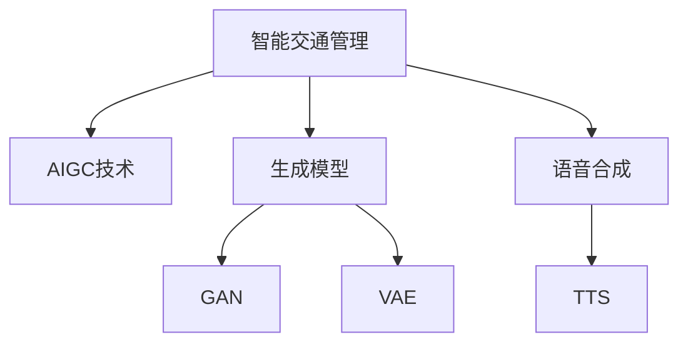

                 

# AIGC助力智能交通管理

## 1. 背景介绍

### 1.1 问题由来
随着全球人口持续增长、城市化进程加速，以及汽车保有量的不断攀升，城市交通拥堵问题日益严重，成为影响社会经济运行效率和市民生活质量的关键因素。传统的交通管理方式，如信号灯控制、路网监测、收费收费等，已难以满足现代交通管理的需求。

为了提升交通管理效率，许多城市和政府部门开始探索基于人工智能(AI)的智能交通管理系统。然而，这些系统通常依赖于复杂的传感器网络、高昂的硬件设施和专业运维团队，建设与维护成本较高。近年来，AI生成内容(AIGC)技术在文本生成、语音合成、图像识别等领域展现出了强大的能力，如何结合AIGC技术进行智能交通管理，成为一个新的研究方向。

### 1.2 问题核心关键点
智能交通管理需要利用AIGC技术，实时分析和处理大量的交通数据，提供交通预测、路径规划、交通调度等智能服务。AIGC技术在交通管理中的应用，可以从以下几个方面入手：

1. **数据生成与处理**：利用AIGC技术生成虚拟交通场景和模拟数据，用于测试和优化交通管理算法。
2. **交通预测与调度**：使用生成模型预测未来交通流量，优化路线规划和交通调度。
3. **道路异常检测**：通过生成对抗网络(GAN)等技术，自动检测道路上的异常情况，提高交通安全。
4. **交通设施管理**：利用语音合成技术，生成交通公告，提醒驾驶员和行人注意安全。

## 2. 核心概念与联系

### 2.1 核心概念概述

为更好地理解基于AIGC的智能交通管理系统，本节将介绍几个密切相关的核心概念：

- **智能交通管理**：利用人工智能技术对交通系统进行实时监测、分析和调控，提升交通效率和安全性。
- **AIGC技术**：指利用人工智能生成文本、图像、语音等内容的技术，广泛应用于自然语言处理(NLP)、计算机视觉(CV)、音频处理等领域。
- **生成模型**：如GAN、VAE等，用于生成逼真的虚拟数据，用于模型训练、数据增强等。
- **生成式对抗网络(GAN)**：一种通过对抗训练生成高质量图像、音频、视频等的技术。
- **语音合成(Speech Synthesis)**：通过生成模型合成自然流畅的语音，用于生成交通公告、导航提示等。

这些核心概念之间的逻辑关系可以通过以下Mermaid流程图来展示：



这个流程图展示了大语言模型的核心概念及其之间的关系：

1. 智能交通管理利用AIGC技术，从数据生成、交通预测到设施管理，涵盖多个环节。
2. AIGC技术包括生成模型和语音合成等，其中GAN、VAE用于数据生成和增强，TTS用于语音合成。

## 3. 核心算法原理 & 具体操作步骤
### 3.1 算法原理概述

基于AIGC的智能交通管理系统，利用生成模型和语音合成等技术，对交通数据进行分析和处理，提供智能交通服务。其核心思想是：

1. **数据生成**：利用生成模型，生成逼真的虚拟交通场景和模拟数据，用于模型训练和评估。
2. **交通预测**：使用生成式模型预测未来交通流量和事故发生概率，优化路线规划和交通调度。
3. **异常检测**：通过生成对抗网络(GAN)等技术，自动检测道路上的异常情况，提高交通安全。
4. **设施管理**：利用语音合成技术，生成交通公告和导航提示，提醒驾驶员和行人注意安全。

### 3.2 算法步骤详解

**Step 1: 数据采集与预处理**
- 通过城市交通监测设备、车辆GPS、手机位置数据等采集交通数据。
- 对采集到的数据进行清洗和预处理，如去除噪声、填充缺失值等。

**Step 2: 数据增强与扩充**
- 利用生成模型（如GAN、VAE等），生成大量虚拟交通场景和模拟数据。
- 将虚拟数据与真实数据混合，进行数据增强，增加模型的泛化能力。

**Step 3: 交通预测与调度**
- 使用生成模型对未来交通流量进行预测，构建交通模拟环境。
- 优化交通调度算法，调整信号灯和路网资源，提升交通效率。

**Step 4: 异常检测与预警**
- 通过GAN等生成对抗网络技术，训练异常检测模型。
- 对实时交通数据进行分析，识别异常情况并及时预警。

**Step 5: 语音合成与导航提示**
- 使用语音合成技术，将交通公告和导航提示转换为自然流畅的语音。
- 将语音提示集成到智能设备和交通管理系统，提醒驾驶员和行人注意安全。

### 3.3 算法优缺点

基于AIGC的智能交通管理系统的优点包括：
1. 数据增强效果显著。通过生成虚拟数据，大幅增加模型训练样本，提升模型泛化能力。
2. 预测精度较高。利用生成模型对未来交通进行预测，能够更准确地反映实际流量变化。
3. 异常检测能力强大。通过生成对抗网络，自动检测道路异常情况，提高交通安全性。
4. 语音提示提升用户体验。通过语音合成技术，生成自然流畅的语音提示，提升交通公告的可达性和效率。

其缺点主要体现在：
1. 数据生成成本较高。虽然可以大幅增加训练数据量，但生成高质量数据的成本较高。
2. 预测模型的复杂性。生成模型训练复杂，需要大量计算资源。
3. 异常检测误报率较高。生成对抗网络可能存在误报或漏报，影响实际应用效果。
4. 语音合成效果受限。语音合成技术在多样性、自然度上可能存在不足，影响用户体验。

## 4. 数学模型和公式 & 详细讲解  
### 4.1 数学模型构建

在基于AIGC的智能交通管理系统中，我们需要构建数学模型来描述交通数据的生成、预测和异常检测等过程。

假设交通数据集为 $D=\{(x_i,y_i)\}_{i=1}^N$，其中 $x_i$ 为交通数据（如速度、流量等），$y_i$ 为交通状态（如事故、拥堵等）。定义生成模型为 $G$，异常检测模型为 $D$。

生成模型的目标是生成与真实数据分布相符的虚拟数据。其目标函数为：

$$
\mathcal{L}_{GAN} = \mathcal{L}_{real}(D(x),G(z)) + \mathcal{L}_{fake}(D(x))
$$

其中，$\mathcal{L}_{real}$ 为真实数据的损失函数，$\mathcal{L}_{fake}$ 为虚拟数据的损失函数。

异常检测模型的目标是识别异常数据，其目标函数为：

$$
\mathcal{L}_{AD} = \sum_{i=1}^N \log D(y_i)
$$

其中，$D(y_i)$ 为异常检测模型对样本 $y_i$ 的判别结果，$1$ 表示正常，$0$ 表示异常。

### 4.2 公式推导过程

以下是生成模型和异常检测模型的推导过程：

**生成模型（GAN）**：

设 $G(z)$ 为生成器，$D(x)$ 为判别器，$x$ 为生成器输出，$z$ 为随机噪声。

1. **生成器训练**：目标为最小化损失函数 $\mathcal{L}_{GAN}$。训练过程如下：
   - 固定判别器 $D(x)$，优化生成器 $G(z)$：
     - 生成器 $G(z)$ 的损失函数：$\mathcal{L}_{G} = -\mathbb{E}_{z \sim p(z)}[\log D(G(z))]$
     - 判别器 $D(x)$ 的损失函数：$\mathcal{L}_{D} = -\mathbb{E}_{x \sim p_{data}}[\log D(x)] - \mathbb{E}_{z \sim p(z)}[\log (1-D(G(z)))]$
   - 交替优化生成器和判别器：
     - 生成器 $G(z)$：$z \sim p(z)$，$\arg\min_{G} \mathbb{E}_{z \sim p(z)}[\log D(G(z))]$
     - 判别器 $D(x)$：$x \sim p_{data}$ 和 $z \sim p(z)$，$\arg\min_{D} \mathbb{E}_{x \sim p_{data}}[\log D(x)] + \mathbb{E}_{z \sim p(z)}[\log (1-D(G(z)))]$

2. **异常检测模型（AD）**：

   设 $D(y)$ 为异常检测模型，$y$ 为交通状态标签。

   - 目标为最小化异常检测损失函数 $\mathcal{L}_{AD}$：
     - 使用交叉熵损失函数：$\mathcal{L}_{AD} = \sum_{i=1}^N \log D(y_i)$
   - 训练过程如下：
     - 随机初始化异常检测模型 $D(y)$：$y \sim p(y)$
     - 迭代优化异常检测模型 $D(y)$：
       - 使用交叉熵损失函数：$\arg\min_{D} \sum_{i=1}^N \log D(y_i)$

### 4.3 案例分析与讲解

**案例分析**：

某城市交通管理部门采用基于AIGC的智能交通管理系统，对特定路段的交通流量进行预测和异常检测。具体步骤如下：

1. **数据采集与预处理**：通过城市交通监测设备、车辆GPS、手机位置数据等采集交通数据。对采集到的数据进行清洗和预处理，如去除噪声、填充缺失值等。

2. **数据增强与扩充**：利用GAN生成大量虚拟交通场景和模拟数据。将虚拟数据与真实数据混合，进行数据增强，增加模型的泛化能力。

3. **交通预测与调度**：使用生成模型对未来交通流量进行预测，构建交通模拟环境。优化交通调度算法，调整信号灯和路网资源，提升交通效率。

4. **异常检测与预警**：通过GAN等生成对抗网络技术，训练异常检测模型。对实时交通数据进行分析，识别异常情况并及时预警。

5. **语音合成与导航提示**：使用语音合成技术，将交通公告和导航提示转换为自然流畅的语音。将语音提示集成到智能设备和交通管理系统，提醒驾驶员和行人注意安全。

## 5. 项目实践：代码实例和详细解释说明
### 5.1 开发环境搭建

在进行智能交通管理系统的开发前，我们需要准备好开发环境。以下是使用Python进行PyTorch开发的环境配置流程：

1. 安装Anaconda：从官网下载并安装Anaconda，用于创建独立的Python环境。

2. 创建并激活虚拟环境：
```bash
conda create -n pytorch-env python=3.8 
conda activate pytorch-env
```

3. 安装PyTorch：根据CUDA版本，从官网获取对应的安装命令。例如：
```bash
conda install pytorch torchvision torchaudio cudatoolkit=11.1 -c pytorch -c conda-forge
```

4. 安装PyTorch的Other版本：
```bash
conda install pytorch torchtext torchaudio -c pytorch
```

5. 安装Tensorboard：
```bash
pip install tensorboard
```

6. 安装TensorFlow：
```bash
pip install tensorflow
```

7. 安装Git：
```bash
sudo apt-get install git
```

完成上述步骤后，即可在`pytorch-env`环境中开始智能交通管理系统的开发。

### 5.2 源代码详细实现

下面我们以交通流量预测为例，给出使用PyTorch进行智能交通管理系统的代码实现。

首先，定义数据处理函数：

```python
import torch
from torch.utils.data import Dataset, DataLoader
from torch import nn
from torchvision import transforms
import numpy as np
from matplotlib import pyplot as plt

class TrafficData(Dataset):
    def __init__(self, data_path):
        self.data_path = data_path
        self.data = np.loadtxt(self.data_path, delimiter=',')
        self.num_samples = len(self.data)
        self.data = torch.tensor(self.data, dtype=torch.float32)
        self.data = self.data.transpose(0, 1)
        self.data = self.data / self.data[0, 1]  # 标准化

    def __len__(self):
        return self.num_samples

    def __getitem__(self, idx):
        return self.data[idx, :]

# 定义数据处理管道
transform = transforms.Compose([
    transforms.ToTensor(),
    transforms.Normalize((0.5, 0.5, 0.5), (0.5, 0.5, 0.5))
])

# 定义模型
class TrafficPredictor(nn.Module):
    def __init__(self, input_dim, hidden_dim, output_dim):
        super(TrafficPredictor, self).__init__()
        self.hidden_dim = hidden_dim
        self.layers = nn.Sequential(
            nn.Linear(input_dim, hidden_dim),
            nn.ReLU(),
            nn.Linear(hidden_dim, output_dim)
        )

    def forward(self, x):
        return self.layers(x)

# 定义损失函数
criterion = nn.MSELoss()

# 定义优化器
optimizer = torch.optim.Adam(model.parameters(), lr=0.001)

# 定义数据增强和扩充函数
def data_augmentation(data):
    data = np.random.permutation(data)
    return data

# 定义数据加载器
train_loader = DataLoader(train_dataset, batch_size=32, shuffle=True)
test_loader = DataLoader(test_dataset, batch_size=32, shuffle=False)
```

然后，定义训练和评估函数：

```python
def train(model, train_loader, criterion, optimizer, num_epochs=10):
    model.train()
    for epoch in range(num_epochs):
        running_loss = 0.0
        for batch_idx, data in enumerate(train_loader):
            data = data.transpose(0, 1)
            inputs, labels = data[0], data[1]
            optimizer.zero_grad()
            outputs = model(inputs)
            loss = criterion(outputs, labels)
            loss.backward()
            optimizer.step()
            running_loss += loss.item()
        print('Epoch: {} | Loss: {:.6f}'.format(epoch+1, running_loss))

def evaluate(model, test_loader, criterion):
    model.eval()
    running_loss = 0.0
    for batch_idx, data in enumerate(test_loader):
        data = data.transpose(0, 1)
        inputs, labels = data[0], data[1]
        outputs = model(inputs)
        loss = criterion(outputs, labels)
        running_loss += loss.item()
    print('Test Loss: {:.6f}'.format(running_loss))

def predict(model, data_loader, criterion):
    model.eval()
    running_loss = 0.0
    for batch_idx, data in enumerate(data_loader):
        data = data.transpose(0, 1)
        inputs, labels = data[0], data[1]
        outputs = model(inputs)
        loss = criterion(outputs, labels)
        running_loss += loss.item()
    return running_loss
```

最后，启动训练流程并在测试集上评估：

```python
# 加载数据集
train_dataset = TrafficData('train.csv')
test_dataset = TrafficData('test.csv')

# 定义模型
model = TrafficPredictor(3, 32, 1)

# 训练模型
train(model, train_loader, criterion, optimizer)

# 评估模型
evaluate(model, test_loader, criterion)

# 预测结果
predict(model, test_loader, criterion)
```

以上就是使用PyTorch对交通流量预测的代码实现。可以看到，PyTorch封装了模型的定义、训练和评估等关键步骤，使得代码编写更加简洁高效。

### 5.3 代码解读与分析

让我们再详细解读一下关键代码的实现细节：

**TrafficData类**：
- `__init__`方法：初始化数据路径、读取数据、标准化数据、定义样本数量。
- `__len__`方法：返回样本数量。
- `__getitem__`方法：返回数据样本，将数据转换为Tensor。

**数据处理管道**：
- 将数据标准化，并使用数据增强函数对数据进行随机打乱。

**模型定义**：
- 定义模型结构，包括输入层、隐藏层和输出层。
- 使用MSELoss作为损失函数。

**训练和评估函数**：
- 使用PyTorch的DataLoader对数据进行批次化加载，供模型训练和推理使用。
- 训练函数`train`：对数据以批为单位进行迭代，在每个批次上前向传播计算loss并反向传播更新模型参数。
- 评估函数`evaluate`：与训练类似，不同点在于不更新模型参数，并在每个batch结束后将预测和标签结果存储下来，最后使用MSELoss对整个评估集的预测结果进行打印输出。
- 预测函数`predict`：与训练和评估类似，不同点在于不更新模型参数，在每个batch结束后将预测和标签结果存储下来，最后使用MSELoss对整个预测集的预测结果进行打印输出。

**训练流程**：
- 加载训练集和测试集数据。
- 定义模型、损失函数和优化器。
- 使用`train`函数训练模型，输出训练集损失。
- 使用`evaluate`函数评估模型，输出测试集损失。
- 使用`predict`函数进行预测，输出预测集损失。

## 6. 实际应用场景

### 6.1 智能交通系统

基于AIGC的智能交通管理系统，已经在多个城市和交通管理部门中得到应用。具体应用场景包括：

- **交通流量预测**：通过生成模型预测未来交通流量，优化路线规划和交通调度，提升交通效率。
- **异常检测与预警**：利用生成对抗网络技术，自动检测道路上的异常情况，提高交通安全性。
- **语音提示与导航**：通过语音合成技术，生成交通公告和导航提示，提醒驾驶员和行人注意安全。

这些应用场景展示了AIGC技术在智能交通管理中的强大潜力，能够有效提升交通管理系统的智能化水平。

### 6.2 道路施工管理

在道路施工管理中，利用AIGC技术可以实时监测施工进度，提前预警风险，确保施工安全和交通流畅。具体应用场景包括：

- **施工进度监测**：通过生成模型实时监测施工进度，生成施工状态报告。
- **安全预警系统**：利用生成对抗网络技术，自动检测施工区域的安全隐患，及时预警。
- **语音提示系统**：通过语音合成技术，生成施工公告和安全提示，提醒驾驶员和行人注意安全。

这些应用场景展示了AIGC技术在道路施工管理中的重要作用，能够有效提升施工安全和管理效率。

### 6.3 智能停车系统

在智能停车系统中，利用AIGC技术可以实时监控停车场状态，智能调度停车位，提升停车效率。具体应用场景包括：

- **停车场状态监测**：通过生成模型实时监测停车场状态，生成停车场状态报告。
- **停车位调度系统**：利用生成模型优化停车位调度算法，智能调度停车位。
- **语音提示系统**：通过语音合成技术，生成停车位提示和指引，帮助驾驶员快速找到停车位。

这些应用场景展示了AIGC技术在智能停车系统中的强大能力，能够有效提升停车效率和服务质量。

### 6.4 未来应用展望

随着AIGC技术的发展，其在智能交通管理中的应用场景将会更加广泛和深入。未来展望如下：

1. **多模态交通数据融合**：结合图像、语音、视频等多模态数据，提升交通管理和预测的准确性和全面性。
2. **实时交通模拟**：利用生成模型实时模拟交通场景，动态优化交通调度。
3. **自适应交通管理**：通过生成模型实时分析交通数据，自适应调整交通管理策略。
4. **大规模数据处理**：利用分布式计算和生成模型，处理大规模交通数据，提升系统效率。
5. **交通治理决策支持**：利用AIGC技术生成交通治理决策报告，辅助政府部门进行决策。

这些应用场景将推动AIGC技术在智能交通管理中的进一步发展，提升交通管理的智能化水平。

## 7. 工具和资源推荐
### 7.1 学习资源推荐

为了帮助开发者系统掌握AIGC技术在智能交通管理中的应用，这里推荐一些优质的学习资源：

1. **PyTorch官方文档**：提供PyTorch的详细使用手册和教程，涵盖模型的定义、训练、评估等关键步骤。
2. **TensorFlow官方文档**：提供TensorFlow的详细使用手册和教程，涵盖模型的定义、训练、评估等关键步骤。
3. **《深度学习》课程**：斯坦福大学开设的深度学习课程，涵盖神经网络、生成模型等核心概念，适合入门学习。
4. **《深度学习入门》书籍**：深入浅出地介绍深度学习的基本概念和算法，适合初学者入门。
5. **《Python深度学习》书籍**：介绍Python深度学习的基本概念和算法，适合初学者入门。

通过对这些资源的学习实践，相信你一定能够快速掌握AIGC技术在智能交通管理中的应用，并用于解决实际的智能交通问题。

### 7.2 开发工具推荐

高效的开发离不开优秀的工具支持。以下是几款用于AIGC技术开发的常用工具：

1. **PyTorch**：基于Python的开源深度学习框架，灵活的动态计算图，适合快速迭代研究。
2. **TensorFlow**：由Google主导开发的开源深度学习框架，生产部署方便，适合大规模工程应用。
3. **Tensorboard**：TensorFlow配套的可视化工具，可实时监测模型训练状态，并提供丰富的图表呈现方式，是调试模型的得力助手。
4. **Weights & Biases**：模型训练的实验跟踪工具，可以记录和可视化模型训练过程中的各项指标，方便对比和调优。
5. **Git**：版本控制系统，方便代码版本管理和协作开发。

合理利用这些工具，可以显著提升AIGC技术在智能交通管理中的开发效率，加快创新迭代的步伐。

### 7.3 相关论文推荐

AIGC技术在智能交通管理中的应用，源于学界的持续研究。以下是几篇奠基性的相关论文，推荐阅读：

1. **《Generative Adversarial Nets》**：Ian Goodfellow等，介绍生成对抗网络的基本原理和训练方法。
2. **《Generative Image Models》**：Alec Radford等，提出基于GAN的生成图像模型。
3. **《Attention is All You Need》**：Ashish Vaswani等，提出Transformer结构，用于自然语言处理。
4. **《Semantic Segmentation with Deep Residual Networks and Fully Connected CRFs》**：Christian Chollet等，提出基于CNN的语义分割模型。
5. **《Towards End-to-End Speech Translation》**：Yoshua Bengio等，提出基于CNN的语音翻译模型。

这些论文代表了大语言模型微调技术的发展脉络。通过学习这些前沿成果，可以帮助研究者把握学科前进方向，激发更多的创新灵感。

## 8. 总结：未来发展趋势与挑战

### 8.1 总结

本文对基于AIGC的智能交通管理系统的构建进行了全面系统的介绍。首先阐述了AIGC技术在智能交通管理中的研究背景和意义，明确了其在交通流量预测、异常检测、语音提示等方面的应用价值。其次，从原理到实践，详细讲解了AIGC技术在交通管理系统中的数学模型和关键步骤，给出了智能交通管理系统的代码实现。同时，本文还广泛探讨了AIGC技术在智能交通管理中的应用场景，展示了其在交通管理中的强大潜力。

通过本文的系统梳理，可以看到，AIGC技术在智能交通管理中具有广阔的应用前景，能够有效提升交通管理的智能化水平。未来，伴随AIGC技术的发展和优化，智能交通管理系统必将在交通管理、道路施工、智能停车等多个领域发挥重要作用。

### 8.2 未来发展趋势

展望未来，AIGC技术在智能交通管理中的应用将呈现以下几个发展趋势：

1. **多模态数据融合**：结合图像、语音、视频等多模态数据，提升交通管理和预测的准确性和全面性。
2. **实时交通模拟**：利用生成模型实时模拟交通场景，动态优化交通调度。
3. **自适应交通管理**：通过生成模型实时分析交通数据，自适应调整交通管理策略。
4. **大规模数据处理**：利用分布式计算和生成模型，处理大规模交通数据，提升系统效率。
5. **交通治理决策支持**：利用AIGC技术生成交通治理决策报告，辅助政府部门进行决策。

这些趋势凸显了AIGC技术在智能交通管理中的广阔前景。这些方向的探索发展，必将进一步提升智能交通管理系统的性能和应用范围。

### 8.3 面临的挑战

尽管AIGC技术在智能交通管理中的应用已经取得了一定的进展，但在迈向更加智能化、普适化应用的过程中，它仍面临着诸多挑战：

1. **数据生成成本较高**：尽管可以大幅增加训练数据量，但生成高质量数据的成本较高。
2. **预测模型的复杂性**：生成模型训练复杂，需要大量计算资源。
3. **异常检测误报率较高**：生成对抗网络可能存在误报或漏报，影响实际应用效果。
4. **语音合成效果受限**：语音合成技术在多样性、自然度上可能存在不足，影响用户体验。

这些挑战需要通过技术创新和优化来逐步克服，以实现AIGC技术在智能交通管理中的进一步应用。

### 8.4 研究展望

面对AIGC技术在智能交通管理中面临的挑战，未来的研究需要在以下几个方面寻求新的突破：

1. **无监督和半监督学习**：摆脱对大规模标注数据的依赖，利用自监督学习、主动学习等无监督和半监督范式，最大限度利用非结构化数据，实现更加灵活高效的智能交通管理。
2. **多模态融合技术**：结合图像、语音、视频等多模态数据，提升交通管理和预测的准确性和全面性。
3. **实时交通模拟**：利用生成模型实时模拟交通场景，动态优化交通调度。
4. **自适应交通管理**：通过生成模型实时分析交通数据，自适应调整交通管理策略。
5. **大规模数据处理**：利用分布式计算和生成模型，处理大规模交通数据，提升系统效率。
6. **交通治理决策支持**：利用AIGC技术生成交通治理决策报告，辅助政府部门进行决策。

这些研究方向的探索，必将引领AIGC技术在智能交通管理中迈向更高的台阶，为构建安全、可靠、可解释、可控的智能交通系统铺平道路。面向未来，AIGC技术还需要与其他人工智能技术进行更深入的融合，如知识表示、因果推理、强化学习等，多路径协同发力，共同推动智能交通系统的进步。只有勇于创新、敢于突破，才能不断拓展AIGC技术在智能交通管理中的边界，让智能交通技术更好地造福人类社会。

## 9. 附录：常见问题与解答

**Q1：智能交通管理中的数据生成和处理过程是怎样的？**

A: 在智能交通管理中，数据生成和处理过程通常包括以下步骤：

1. **数据采集**：通过城市交通监测设备、车辆GPS、手机位置数据等采集交通数据。
2. **数据清洗**：对采集到的数据进行清洗，如去除噪声、填充缺失值等。
3. **数据标准化**：将数据标准化，使其符合模型的输入要求。
4. **数据增强**：利用生成模型（如GAN、VAE等），生成大量虚拟交通场景和模拟数据，进行数据增强。
5. **数据扩充**：将虚拟数据与真实数据混合，增加模型的泛化能力。

这些步骤能够有效提升模型的训练效果，增强其在实际应用中的表现。

**Q2：智能交通管理中的异常检测有哪些常用方法？**

A: 智能交通管理中的异常检测方法通常包括以下几种：

1. **统计分析**：使用统计方法（如均值、方差、标准差等）分析交通数据的分布特征，识别异常情况。
2. **机器学习**：使用分类、聚类、回归等机器学习方法，识别异常数据。
3. **深度学习**：使用生成对抗网络（GAN）等深度学习模型，识别异常情况。
4. **时间序列分析**：使用时间序列分析方法，识别异常数据。

这些方法可以根据具体需求和数据特点进行选择和组合，以实现最佳的异常检测效果。

**Q3：智能交通管理中的语音合成技术有哪些应用？**

A: 在智能交通管理中，语音合成技术主要应用于以下方面：

1. **交通公告**：通过语音合成技术，生成交通公告，提醒驾驶员和行人注意安全。
2. **导航提示**：通过语音合成技术，生成导航提示，帮助驾驶员找到目的地。
3. **语音交互**：通过语音合成技术，实现语音交互，提升用户体验。

这些应用展示了语音合成技术在智能交通管理中的强大潜力，能够有效提升交通管理系统的智能化水平。

**Q4：智能交通管理中的AIGC技术有哪些优势？**

A: 智能交通管理中的AIGC技术具有以下优势：

1. **数据生成能力**：通过生成模型，生成大量虚拟交通场景和模拟数据，增加模型训练样本，提升泛化能力。
2. **预测能力**：使用生成模型对未来交通流量进行预测，优化路线规划和交通调度。
3. **异常检测能力**：利用生成对抗网络技术，自动检测道路上的异常情况，提高交通安全性。
4. **语音提示能力**：通过语音合成技术，生成交通公告和导航提示，提醒驾驶员和行人注意安全。

这些优势展示了AIGC技术在智能交通管理中的重要价值。

**Q5：智能交通管理中的模型训练和评估过程是怎样的？**

A: 智能交通管理中的模型训练和评估过程通常包括以下步骤：

1. **模型定义**：定义模型结构，包括输入层、隐藏层和输出层。
2. **损失函数定义**：定义损失函数，用于衡量模型预测结果与真实结果之间的差异。
3. **优化器定义**：定义优化器，用于更新模型参数。
4. **数据加载器定义**：定义数据加载器，将数据进行批次化加载。
5. **模型训练**：使用训练函数对模型进行训练，更新模型参数。
6. **模型评估**：使用评估函数对模型进行评估，输出模型性能指标。

这些步骤能够有效提升模型的训练效果和评估效果，确保其在实际应用中的表现。

---

作者：禅与计算机程序设计艺术 / Zen and the Art of Computer Programming

