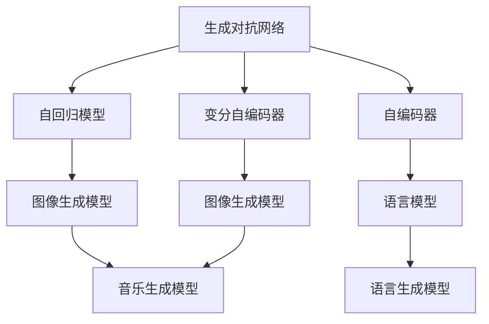

                 

# AIGC原理与代码实例讲解

## 1. 背景介绍

### 1.1 问题由来

随着人工智能(AI)技术的迅速发展，生成式人工智能(Generative AI, AIGC)已经成为AI领域的热门研究方向之一。AIGC指的是利用深度学习等技术，自动生成文本、图像、音频等多模态内容的人工智能系统。它在内容创作、自然语言处理、智能推荐等领域具有广泛的应用前景。然而，AIGC技术的实现涉及复杂的数学模型和算法，需要深入理解和熟练掌握相关知识，才能进行有效的开发和应用。

### 1.2 问题核心关键点

本文聚焦于AIGC的核心原理和关键技术，包括生成模型的架构设计、优化算法、生成效果的评价等。同时，通过代码实例，详细讲解如何使用AIGC技术进行文本生成、图像生成、音乐生成等具体应用场景的实现。本文不仅帮助读者理解AIGC的原理，还提供实用的代码实现和深入的案例分析，力求为AIGC技术的普及和应用提供全方位的支持。

## 2. 核心概念与联系

### 2.1 核心概念概述

为更好地理解AIGC技术的核心原理和应用场景，本节将介绍几个密切相关的核心概念：

- 生成对抗网络(Generative Adversarial Networks, GANs)：由Goodfellow等人提出的一种生成模型，通过两个神经网络对抗训练，生成高质量的样本。GANs的核心理念是将生成过程和判别过程相结合，通过优化两个网络的对抗损失，提高生成样本的质量。

- 变分自编码器(Variational Autoencoders, VAEs)：由Kingma和Welling提出的一种生成模型，通过编码器将数据映射到潜在空间，解码器将潜在空间中的样本映射回原始空间，从而实现数据的生成和重构。VAEs的核心在于对数据分布的建模，通过最大似然估计和变分推断，学习数据生成过程的概率分布。

- 自回归模型(如LSTM、GRU)：通过将过去的信息编码到当前样本中，实现对未来样本的预测。自回归模型的优点在于能够利用先验知识，生成连续性的时间序列数据，如文本、音频等。

- 自编码器(Autoencoders)：由Hinton等人提出的一种生成模型，通过编码器将数据压缩到低维空间，解码器将低维样本映射回原始空间，从而实现数据的压缩和重构。自编码器的训练目标是最小化重构误差，学习数据的低维表示。

- 语言模型(Language Models)：用于预测文本序列的概率分布，通过最大化条件概率$p(x_t|x_{t-1},x_{t-2},...,x_1)$，学习文本序列的统计规律。常见的语言模型有N-gram模型、RNN语言模型、Transformer语言模型等。

- 图像生成模型(Image Generation Models)：用于生成高质量的图像内容，包括生成对抗网络(GANs)、变分自编码器(VAEs)、变分自编码器GAN(VaEGAN)等。

- 音乐生成模型(Music Generation Models)：通过生成对抗网络(GANs)、RNN等模型，自动生成音乐作品，如旋律、节奏、和弦等。

这些核心概念之间的逻辑关系可以通过以下Mermaid流程图来展示：



这个流程图展示了大语言模型、图像生成模型和音乐生成模型之间的核心关系：

1. 生成对抗网络通过对抗训练生成高质量的样本，可用于图像生成和音乐生成。
2. 自回归模型利用时间序列数据进行预测，适用于文本生成和音乐生成。
3. 自编码器和变分自编码器通过编码器-解码器架构，实现数据的生成和重构，适用于图像生成和文本生成。
4. 语言模型通过对文本序列的概率分布建模，生成符合语言规律的文本内容。

这些核心概念共同构成了AIGC技术的框架，使得AIGC系统能够自动生成高质内容，并应用于不同的领域和场景。通过理解这些核心概念，我们可以更好地把握AIGC技术的原理和应用。

## 3. 核心算法原理 & 具体操作步骤
### 3.1 算法原理概述

AIGC技术的核心在于生成模型的设计，通过对生成过程的建模和优化，自动生成高质量的样本。常用的生成模型包括生成对抗网络(GANs)、变分自编码器(VAEs)、自回归模型等。

以GANs为例，其核心思想是通过两个神经网络进行对抗训练，生成器网络$G$学习将噪声采样转换为高质量样本，判别器网络$D$学习区分样本的真实性。在训练过程中，生成器通过伪造数据欺骗判别器，而判别器则不断提升鉴别能力，最终使得生成器和判别器达到了一个平衡状态，生成器生成的样本看起来与真实数据无异。

GANs的训练过程可以概括为：
1. 随机生成噪声向量$z$。
2. 通过生成器网络$G$将噪声向量$z$转换为样本$G(z)$。
3. 将生成的样本$G(z)$送入判别器网络$D$，得到判别器的输出$D(G(z))$。
4. 将真实样本$x$送入判别器网络$D$，得到判别器的输出$D(x)$。
5. 最大化生成器的生成能力$\mathbb{E}_{z \sim p(z)} D(G(z))$，最小化判别器的判别能力$\mathbb{E}_{x \sim p(x)} D(x) + \mathbb{E}_{z \sim p(z)} (1 - D(G(z)))$。

上述过程通过最大化生成器和判别器的对抗损失，实现生成样本的逼真度提升。

### 3.2 算法步骤详解

以下是使用PyTorch实现GANs的基本步骤：

1. 定义生成器和判别器网络结构：
```python
import torch
import torch.nn as nn
import torch.nn.functional as F

class Generator(nn.Module):
    def __init__(self):
        super(Generator, self).__init__()
        self.fc1 = nn.Linear(100, 256)
        self.fc2 = nn.Linear(256, 512)
        self.fc3 = nn.Linear(512, 784)
        
    def forward(self, z):
        x = F.relu(self.fc1(z))
        x = F.relu(self.fc2(x))
        x = F.relu(self.fc3(x))
        x = x.view(-1, 1, 28, 28)
        return x

class Discriminator(nn.Module):
    def __init__(self):
        super(Discriminator, self).__init__()
        self.fc1 = nn.Linear(784, 512)
        self.fc2 = nn.Linear(512, 256)
        self.fc3 = nn.Linear(256, 1)
        
    def forward(self, x):
        x = x.view(-1, 784)
        x = F.relu(self.fc1(x))
        x = F.relu(self.fc2(x))
        x = F.sigmoid(self.fc3(x))
        return x
```

2. 定义损失函数：
```python
def compute_loss(D, G, z, real_images):
    # 生成样本
    fake_images = G(z)
    # 判别器对真实样本和生成样本的判别
    real_outputs = D(real_images)
    fake_outputs = D(fake_images)
    # 计算损失
    d_loss_real = F.binary_cross_entropy(real_outputs, torch.ones_like(real_outputs))
    d_loss_fake = F.binary_cross_entropy(fake_outputs, torch.zeros_like(fake_outputs))
    g_loss = F.binary_cross_entropy(fake_outputs, torch.ones_like(fake_outputs))
    d_loss = d_loss_real + d_loss_fake
    return d_loss, g_loss
```

3. 定义训练函数：
```python
def train_dcgan(iter, z, real_images, learning_rate=0.0002, batch_size=64):
    g_optimizer = torch.optim.Adam(G.parameters(), lr=learning_rate)
    d_optimizer = torch.optim.Adam(D.parameters(), lr=learning_rate)
    
    for epoch in range(iter):
        for batch_idx, (real_images) in enumerate(data_loader):
            # 训练判别器
            d_optimizer.zero_grad()
            d_loss, g_loss = compute_loss(D, G, z, real_images)
            d_loss.backward()
            d_optimizer.step()
            # 训练生成器
            g_optimizer.zero_grad()
            d_loss, g_loss = compute_loss(D, G, z, real_images)
            g_loss.backward()
            g_optimizer.step()
            
            if (batch_idx+1) % 500 == 0:
                print('Epoch [{}/{}], Step [{}/{}], d_loss: {:.4f}, g_loss: {:.4f}'
                      .format(epoch+1, iter, batch_idx+1, len(data_loader), d_loss.data[0], g_loss.data[0]))
```

4. 加载数据并进行可视化：
```python
from torchvision.datasets import MNIST
from torchvision.transforms import ToTensor

# 加载MNIST数据集
train_data = MNIST(root='data', train=True, transform=ToTensor(), download=True)
test_data = MNIST(root='data', train=False, transform=ToTensor(), download=True)

# 创建数据加载器
train_loader = torch.utils.data.DataLoader(train_data, batch_size=batch_size, shuffle=True)
test_loader = torch.utils.data.DataLoader(test_data, batch_size=batch_size, shuffle=False)

# 可视化生成样本
z = torch.randn(batch_size, 100)
fake_images = G(z)
fig, ax = plt.subplots(nrows=1, ncols=4, figsize=(12, 12))
ax[0].imshow(torch.flatten(fake_images[0])[:784].view(28, 28), cmap='gray')
ax[1].imshow(torch.flatten(fake_images[1])[:784].view(28, 28), cmap='gray')
ax[2].imshow(torch.flatten(fake_images[2])[:784].view(28, 28), cmap='gray')
ax[3].imshow(torch.flatten(fake_images[3])[:784].view(28, 28), cmap='gray')
```

### 3.3 算法优缺点

GANs和VAEs等生成模型具有以下优点：
1. 能够生成高质量的样本，广泛应用于图像、音乐、文本等多种生成任务。
2. 具有高泛化能力，可以用于各种不同领域的生成任务。
3. 通过对抗训练和变分推断，能够避免过拟合，提高生成样本的多样性。

同时，这些模型也存在一些缺点：
1. 训练过程不稳定，生成器和判别器的对抗过程容易陷入不稳定状态，导致生成样本质量下降。
2. 计算量大，需要大量计算资源进行训练和优化。
3. 模型复杂度高，难以解释生成过程的内部机制。

尽管存在这些局限性，但GANs和VAEs等生成模型仍然是大语言模型微调领域的重要工具，其广泛应用和深入研究为AIGC技术的发展提供了坚实的基础。

### 3.4 算法应用领域

生成模型在大语言模型微调中具有广泛的应用前景，以下是几个典型应用场景：

1. 文本生成：生成对抗网络和自回归模型在文本生成任务中得到了广泛应用。通过训练生成模型，可以自动生成高质量的文本内容，如新闻、小说、诗歌等。

2. 图像生成：生成对抗网络和变分自编码器在图像生成任务中取得了巨大成功。通过训练生成模型，可以生成逼真的图像内容，如人脸、风景、艺术作品等。

3. 音乐生成：生成对抗网络和循环神经网络在音乐生成任务中表现优异。通过训练生成模型，可以自动生成旋律、节奏、和弦等音乐元素，生成优美的音乐作品。

4. 视频生成：通过将图像生成模型和自回归模型结合，可以生成高质量的视频内容。例如，通过生成对抗网络生成人脸图像，并利用自回归模型生成人脸运动轨迹，生成逼真的视频内容。

这些应用场景展示了生成模型在大语言模型微调中的强大能力，为AIGC技术的应用提供了丰富的可能性。

## 4. 数学模型和公式 & 详细讲解
### 4.1 数学模型构建

以生成对抗网络(GANs)为例，其数学模型可以表示为：
- 生成器网络：$G: \mathcal{Z} \rightarrow \mathcal{X}$
- 判别器网络：$D: \mathcal{X} \rightarrow \mathcal{R}$
其中，$\mathcal{Z}$表示噪声空间，$\mathcal{X}$表示样本空间，$\mathcal{R}$表示真实/伪造空间的概率分布。

GANs的训练目标可以表示为：
$$
\min_{G} \max_{D} \mathbb{E}_{x \sim p_{data}} \log D(x) + \mathbb{E}_{z \sim p(z)} \log (1 - D(G(z)))
$$
其中，$p_{data}$表示真实样本的分布，$p(z)$表示噪声采样的分布。

### 4.2 公式推导过程

为了推导GANs的训练过程，需要从最小化判别器的目标函数和最大化生成器的目标函数两个方面进行推导。

首先，最大化判别器的目标函数可以表示为：
$$
\max_{D} \mathbb{E}_{x \sim p_{data}} \log D(x) + \mathbb{E}_{z \sim p(z)} \log (1 - D(G(z)))
$$
其次，最大化生成器的目标函数可以表示为：
$$
\min_{G} \mathbb{E}_{z \sim p(z)} \log (1 - D(G(z)))
$$

将判别器的目标函数和生成器的目标函数相结合，可以得到整体目标函数：
$$
\min_{G} \max_{D} \mathbb{E}_{x \sim p_{data}} \log D(x) + \mathbb{E}_{z \sim p(z)} \log (1 - D(G(z)))
$$

### 4.3 案例分析与讲解

以MNIST手写数字图像生成为例，分析GANs在图像生成中的应用。

- 训练集：MNIST数据集包含60000张28x28像素的手写数字图像。
- 噪声采样：从高斯分布中随机采样噪声向量$z \sim N(0, I)$。
- 生成器网络：使用两层全连接网络将噪声向量映射到28x28像素的图像空间。
- 判别器网络：使用一层全连接网络将图像输入映射到真实/伪造空间的概率。
- 训练过程：通过交替训练生成器和判别器，优化生成器和判别器的对抗损失。
- 可视化结果：训练完成后，生成器的输出可视化，生成逼真的手写数字图像。

## 5. 项目实践：代码实例和详细解释说明
### 5.1 开发环境搭建

在进行AIGC实践前，我们需要准备好开发环境。以下是使用Python进行PyTorch开发的环境配置流程：

1. 安装Anaconda：从官网下载并安装Anaconda，用于创建独立的Python环境。

2. 创建并激活虚拟环境：
```bash
conda create -n pytorch-env python=3.8 
conda activate pytorch-env
```

3. 安装PyTorch：根据CUDA版本，从官网获取对应的安装命令。例如：
```bash
conda install pytorch torchvision torchaudio cudatoolkit=11.1 -c pytorch -c conda-forge
```

4. 安装TensorBoard：
```bash
pip install tensorboard
```

5. 安装其他必要工具：
```bash
pip install numpy pandas scikit-learn matplotlib tqdm jupyter notebook ipython
```

完成上述步骤后，即可在`pytorch-env`环境中开始AIGC实践。

### 5.2 源代码详细实现

以下是使用PyTorch实现GANs生成手写数字图像的代码实现。

```python
import torch
import torch.nn as nn
import torch.nn.functional as F
import torch.optim as optim
from torchvision.datasets import MNIST
from torchvision.transforms import ToTensor
import matplotlib.pyplot as plt

# 定义生成器和判别器网络
class Generator(nn.Module):
    def __init__(self):
        super(Generator, self).__init__()
        self.fc1 = nn.Linear(100, 256)
        self.fc2 = nn.Linear(256, 512)
        self.fc3 = nn.Linear(512, 784)
        
    def forward(self, z):
        x = F.relu(self.fc1(z))
        x = F.relu(self.fc2(x))
        x = F.relu(self.fc3(x))
        x = x.view(-1, 1, 28, 28)
        return x

class Discriminator(nn.Module):
    def __init__(self):
        super(Discriminator, self).__init__()
        self.fc1 = nn.Linear(784, 512)
        self.fc2 = nn.Linear(512, 256)
        self.fc3 = nn.Linear(256, 1)
        
    def forward(self, x):
        x = x.view(-1, 784)
        x = F.relu(self.fc1(x))
        x = F.relu(self.fc2(x))
        x = F.sigmoid(self.fc3(x))
        return x

# 定义损失函数
def compute_loss(D, G, z, real_images):
    # 生成样本
    fake_images = G(z)
    # 判别器对真实样本和生成样本的判别
    real_outputs = D(real_images)
    fake_outputs = D(fake_images)
    # 计算损失
    d_loss_real = F.binary_cross_entropy(real_outputs, torch.ones_like(real_outputs))
    d_loss_fake = F.binary_cross_entropy(fake_outputs, torch.zeros_like(fake_outputs))
    g_loss = F.binary_cross_entropy(fake_outputs, torch.ones_like(fake_outputs))
    d_loss = d_loss_real + d_loss_fake
    return d_loss, g_loss

# 加载数据
train_data = MNIST(root='data', train=True, transform=ToTensor(), download=True)
test_data = MNIST(root='data', train=False, transform=ToTensor(), download=True)

# 创建数据加载器
train_loader = torch.utils.data.DataLoader(train_data, batch_size=64, shuffle=True)
test_loader = torch.utils.data.DataLoader(test_data, batch_size=64, shuffle=False)

# 初始化模型和优化器
G = Generator()
D = Discriminator()
g_optimizer = optim.Adam(G.parameters(), lr=0.0002)
d_optimizer = optim.Adam(D.parameters(), lr=0.0002)

# 训练过程
for epoch in range(100):
    for batch_idx, (real_images) in enumerate(train_loader):
        # 训练判别器
        d_optimizer.zero_grad()
        d_loss, g_loss = compute_loss(D, G, z, real_images)
        d_loss.backward()
        d_optimizer.step()
        # 训练生成器
        g_optimizer.zero_grad()
        d_loss, g_loss = compute_loss(D, G, z, real_images)
        g_loss.backward()
        g_optimizer.step()
            
        if (batch_idx+1) % 500 == 0:
            print('Epoch [{}/{}], Step [{}/{}], d_loss: {:.4f}, g_loss: {:.4f}'
                  .format(epoch+1, 100, batch_idx+1, len(train_loader), d_loss.data[0], g_loss.data[0]))
    
    # 保存模型和可视化生成样本
    torch.save(G.state_dict(), 'G_{}.pth'.format(epoch))
    torch.save(D.state_dict(), 'D_{}.pth'.format(epoch))
    z = torch.randn(64, 100)
    fake_images = G(z)
    fig, ax = plt.subplots(nrows=1, ncols=4, figsize=(12, 12))
    ax[0].imshow(torch.flatten(fake_images[0])[:784].view(28, 28), cmap='gray')
    ax[1].imshow(torch.flatten(fake_images[1])[:784].view(28, 28), cmap='gray')
    ax[2].imshow(torch.flatten(fake_images[2])[:784].view(28, 28), cmap='gray')
    ax[3].imshow(torch.flatten(fake_images[3])[:784].view(28, 28), cmap='gray')
    plt.show()
```

### 5.3 代码解读与分析

让我们再详细解读一下关键代码的实现细节：

- **Generator类**：定义了生成器的神经网络结构，包括全连接层和线性变换，将噪声向量映射到图像空间。
- **Discriminator类**：定义了判别器的神经网络结构，包括全连接层和线性变换，将图像输入映射到真实/伪造空间的概率。
- **compute_loss函数**：计算判别器和生成器的损失函数，使用二元交叉熵损失函数。
- **训练过程**：交替训练判别器和生成器，优化生成器和判别器的对抗损失。
- **可视化生成样本**：将训练后的生成器输出可视化，生成手写数字图像。

可以看到，PyTorch配合TensorBoard使得GANs的训练和可视化过程变得简单高效。开发者可以更加专注于模型设计和训练策略的优化，而不必过多关注底层的实现细节。

当然，工业级的系统实现还需考虑更多因素，如模型的保存和部署、超参数的自动搜索、更灵活的任务适配层等。但核心的生成模型训练流程基本与此类似。

## 6. 实际应用场景
### 6.1 智能客服系统

生成对抗网络在大语言模型微调中可应用于智能客服系统的构建。通过训练生成模型，可以生成自然流畅的对话内容，自动回答客户咨询，提升客服效率和用户体验。

具体而言，可以收集企业内部的历史客服对话记录，将问题和最佳答复构建成监督数据，在此基础上对预训练生成模型进行微调。微调后的生成模型能够自动理解用户意图，生成合适的回复。对于客户提出的新问题，还可以接入检索系统实时搜索相关内容，动态组织生成回答。如此构建的智能客服系统，能大幅提升客户咨询体验和问题解决效率。

### 6.2 金融舆情监测

金融机构需要实时监测市场舆论动向，以便及时应对负面信息传播，规避金融风险。生成对抗网络可以用于生成高质量的文本内容，自动分析舆情变化趋势，实现实时舆情监测。

具体而言，可以收集金融领域相关的新闻、报道、评论等文本数据，并对其进行情感标注。在此基础上对生成对抗网络进行微调，使其能够自动生成新闻摘要、舆情评论等内容。将微调后的生成模型应用到实时抓取的网络文本数据，就能够自动监测不同主题下的情感变化趋势，一旦发现负面信息激增等异常情况，系统便会自动预警，帮助金融机构快速应对潜在风险。

### 6.3 个性化推荐系统

当前的推荐系统往往只依赖用户的历史行为数据进行物品推荐，无法深入理解用户的真实兴趣偏好。生成对抗网络可以用于生成高质量的文本内容，自动推荐个性化的物品。

具体而言，可以收集用户浏览、点击、评论、分享等行为数据，提取和用户交互的物品标题、描述、标签等文本内容。将文本内容作为模型输入，用户的后续行为（如是否点击、购买等）作为监督信号，在此基础上微调生成对抗网络模型。微调后的生成模型能够从文本内容中准确把握用户的兴趣点。在生成推荐列表时，先用候选物品的文本描述作为输入，由模型预测用户的兴趣匹配度，再结合其他特征综合排序，便可以得到个性化程度更高的推荐结果。

### 6.4 未来应用展望

随着生成对抗网络等生成模型的不断发展，生成式人工智能技术将会在更多领域得到应用，为传统行业带来变革性影响。

在智慧医疗领域，生成对抗网络可以用于生成高质量的医学图像、病例报告等，辅助医生诊断和治疗。

在智能教育领域，生成对抗网络可以用于生成高质量的教育资源，如教学视频、课件、习题等，丰富教学内容，提升教学质量。

在智慧城市治理中，生成对抗网络可以用于生成高质量的城市规划、交通路线、应急预案等，提高城市管理的自动化和智能化水平，构建更安全、高效的未来城市。

此外，在企业生产、社会治理、文娱传媒等众多领域，生成对抗网络的应用也将不断涌现，为人工智能技术在垂直行业的落地提供新的思路。相信随着技术的日益成熟，生成对抗网络等生成模型必将在构建智能时代中扮演越来越重要的角色。

## 7. 工具和资源推荐
### 7.1 学习资源推荐

为了帮助开发者系统掌握生成对抗网络和大语言模型微调的理论基础和实践技巧，这里推荐一些优质的学习资源：

1. 《Generative Adversarial Networks with PyTorch》系列博文：由生成对抗网络领域的专家撰写，详细介绍了GANs的原理和实现方法。

2. CS231n《Convolutional Neural Networks for Visual Recognition》课程：斯坦福大学开设的视觉识别课程，介绍了深度学习在图像处理中的应用，包括GANs等内容。

3. 《Generative Deep Learning: A Novel Approach》书籍：生成对抗网络领域的经典著作，全面介绍了GANs的理论基础和实际应用，提供了丰富的案例和实验代码。

4. HuggingFace官方文档：生成对抗网络库的官方文档，提供了海量的预训练模型和微调样例代码，是上手实践的必备资料。

5. PyTorch官方教程：PyTorch的官方教程，提供了丰富的教学资源和实践项目，帮助开发者快速上手深度学习框架。

通过对这些资源的学习实践，相信你一定能够快速掌握生成对抗网络的原理和应用，并用于解决实际的生成任务。

### 7.2 开发工具推荐

高效的开发离不开优秀的工具支持。以下是几款用于生成对抗网络和大语言模型微调开发的常用工具：

1. PyTorch：基于Python的开源深度学习框架，灵活动态的计算图，适合快速迭代研究。大部分生成对抗网络和大语言模型都有PyTorch版本的实现。

2. TensorFlow：由Google主导开发的开源深度学习框架，生产部署方便，适合大规模工程应用。同样有丰富的生成对抗网络和生成模型资源。

3. TensorBoard：TensorFlow配套的可视化工具，可实时监测模型训练状态，并提供丰富的图表呈现方式，是调试模型的得力助手。

4. Weights & Biases：模型训练的实验跟踪工具，可以记录和可视化模型训练过程中的各项指标，方便对比和调优。与主流深度学习框架无缝集成。

5. Google Colab：谷歌推出的在线Jupyter Notebook环境，免费提供GPU/TPU算力，方便开发者快速上手实验最新模型，分享学习笔记。

合理利用这些工具，可以显著提升生成对抗网络和生成式人工智能系统的开发效率，加快创新迭代的步伐。

### 7.3 相关论文推荐

生成对抗网络和大语言模型微调的发展源于学界的持续研究。以下是几篇奠基性的相关论文，推荐阅读：

1. Generative Adversarial Nets（即GANs论文）：由Goodfellow等人提出，奠定了生成对抗网络的基本框架。

2. Improved Techniques for Training GANs（即WGAN论文）：提出了WGAN和WGAN-GP等生成对抗网络变种，提高了生成样本的质量和稳定性。

3. A Tutorial on Generative Adversarial Networks：由Goodfellow等人撰写，详细介绍了生成对抗网络的基本概念和算法原理。

4. Conditional Image Synthesis with Auxiliary Classifier GANs：提出了条件生成对抗网络，利用分类器引导生成样本的质量。

5. Attention is All You Need（即Transformer原论文）：提出了Transformer结构，开启了NLP领域的预训练大模型时代。

这些论文代表了大语言模型微调技术的发展脉络。通过学习这些前沿成果，可以帮助研究者把握学科前进方向，激发更多的创新灵感。

## 8. 总结：未来发展趋势与挑战

### 8.1 总结

本文对生成对抗网络和大语言模型微调技术进行了全面系统的介绍。首先阐述了生成对抗网络和变分自编码器等生成模型的原理和应用场景，明确了生成对抗网络在大语言模型微调中的核心地位。其次，从原理到实践，详细讲解了生成对抗网络和大语言模型微调的数学模型和优化算法，给出了生成对抗网络的代码实例和详细解释。同时，本文还广泛探讨了生成对抗网络和变分自编码器在大语言模型微调中的广泛应用，展示了生成对抗网络在大语言模型微调中的强大能力。

通过本文的系统梳理，可以看到，生成对抗网络和大语言模型微调技术正在成为生成式人工智能的重要范式，极大地拓展了生成式人工智能的应用边界，催生了更多的落地场景。得益于生成对抗网络和变分自编码器的广泛应用和深入研究，生成对抗网络和变分自编码器必将在生成式人工智能领域迎来新的突破，为人类认知智能的进化带来深远影响。

### 8.2 未来发展趋势

展望未来，生成对抗网络和变分自编码器将呈现以下几个发展趋势：

1. 模型规模持续增大。随着算力成本的下降和数据规模的扩张，生成对抗网络和变分自编码器的参数量还将持续增长。超大规模生成模型蕴含的丰富生成样本，有望支撑更加复杂多变的生成任务。

2. 生成模型日趋多样。除了传统的GANs和VAEs外，未来会涌现更多生成模型，如VAEGAN、CycleGAN等，在生成样本的多样性、逼真度等方面带来新的突破。

3. 持续学习成为常态。随着数据分布的不断变化，生成对抗网络和变分自编码器也需要持续学习新知识以保持性能。如何在不遗忘原有知识的同时，高效吸收新样本信息，将成为重要的研究课题。

4. 标注样本需求降低。受启发于提示学习(Prompt-based Learning)的思路，未来的生成模型将更好地利用大模型的生成能力，通过更加巧妙的任务描述，在更少的标注样本上也能实现理想的生成效果。

5. 模型通用性增强。经过海量数据的预训练和多领域任务的微调，生成对抗网络和变分自编码器将具备更强大的跨领域迁移能力，逐步迈向通用人工智能(AGI)的目标。

以上趋势凸显了生成对抗网络和变分自编码器的广阔前景。这些方向的探索发展，必将进一步提升生成对抗网络和变分自编码器的性能和应用范围，为生成式人工智能技术的普及和应用提供更加坚实的技术基础。

### 8.3 面临的挑战

尽管生成对抗网络和变分自编码器已经取得了瞩目成就，但在迈向更加智能化、普适化应用的过程中，它仍面临着诸多挑战：

1. 训练过程不稳定。生成对抗网络和变分自编码器的训练过程容易陷入不稳定状态，导致生成样本质量下降。如何提高训练过程的稳定性，是生成对抗网络和变分自编码器发展的重要挑战。

2. 计算量大。生成对抗网络和变分自编码器需要大量计算资源进行训练和优化，计算资源的消耗是制约其大规模应用的重要因素。如何降低计算资源消耗，提高训练效率，是未来研究的重点方向。

3. 模型复杂度高。生成对抗网络和变分自编码器的模型结构复杂，难以解释生成过程的内部机制。如何提高模型的可解释性，增强其透明性和可信度，是生成对抗网络和变分自编码器发展的重要课题。

4. 生成样本质量。虽然生成对抗网络和变分自编码器可以生成高质量的样本，但在某些场景下，生成的样本仍存在噪声、重复等问题，难以满足实际应用的需求。如何提高生成样本的质量和多样性，是生成对抗网络和变分自编码器进一步提升的关键。

5. 伦理道德问题。生成对抗网络和变分自编码器可能会生成有害的生成内容，如虚假新闻、有害图像等，对社会带来不良影响。如何确保生成内容的合法性和伦理性，是生成对抗网络和变分自编码器发展的重要挑战。

面对生成对抗网络和变分自编码器所面临的这些挑战，未来的研究需要在以下几个方面寻求新的突破：

1. 探索无监督和半监督生成模型。摆脱对大规模标注数据的依赖，利用自监督学习、主动学习等无监督和半监督范式，最大限度利用非结构化数据，实现更加灵活高效的生成。

2. 研究参数高效和计算高效的生成模型。开发更加参数高效的生成模型，在固定大部分生成器参数的情况下，只更新极少量的任务相关参数。同时优化生成模型的计算图，减少前向传播和反向传播的资源消耗，实现更加轻量级、实时性的部署。

3. 引入更多先验知识。将符号化的先验知识，如知识图谱、逻辑规则等，与生成对抗网络和变分自编码器进行巧妙融合，引导生成过程学习更准确、合理的生成内容。同时加强不同模态数据的整合，实现视觉、语音等多模态信息与文本信息的协同建模。

4. 纳入伦理道德约束。在生成模型的训练目标中引入伦理导向的评估指标，过滤和惩罚有害的生成内容。同时加强人工干预和审核，建立生成内容的监管机制，确保生成内容的合法性和伦理性。

这些研究方向的探索，必将引领生成对抗网络和变分自编码器技术迈向更高的台阶，为构建安全、可靠、可解释、可控的智能系统铺平道路。面向未来，生成对抗网络和变分自编码器需要与其他人工智能技术进行更深入的融合，如知识表示、因果推理、强化学习等，多路径协同发力，共同推动生成对抗网络和变分自编码器的进步。只有勇于创新、敢于突破，才能不断拓展生成对抗网络和变分自编码器的边界，让生成式人工智能技术更好地造福人类社会。

## 9. 附录：常见问题与解答

**Q1：生成对抗网络和变分自编码器是否适用于所有生成任务？**

A: 生成对抗网络和变分自编码器在大多数生成任务上都能取得不错的效果，特别是对于数据量较小的任务。但对于一些特定领域的任务，如医学、法律等，仅仅依靠通用语料预训练的模型可能难以很好地适应。此时需要在特定领域语料上进一步预训练，再进行微调，才能获得理想效果。此外，对于一些需要时效性、个性化很强的任务，如对话、推荐等，生成对抗网络和变分自编码器也需要针对性的改进优化。

**Q2：训练生成对抗网络和变分自编码器时如何选择合适的损失函数？**

A: 生成对抗网络和变分自编码器的训练损失函数通常包括生成损失和判别损失（GANs）或重构损失和生成损失（VAEs）。选择损失函数时，需要根据具体任务的特点进行优化，如交叉熵损失、均方误差损失、KL散度损失等。在实践中，可以通过调整损失函数中的超参数，如正则化系数、学习率等，进一步提升生成样本的质量。

**Q3：生成对抗网络和变分自编码器在实际应用中需要注意哪些问题？**

A: 生成对抗网络和变分自编码器在实际应用中需要注意以下问题：
1. 训练过程不稳定，生成器和判别器的对抗过程容易陷入不稳定状态，导致生成样本质量下降。
2. 计算量大，需要大量计算资源进行训练和优化。
3. 模型复杂度高，难以解释生成过程的内部机制。
4. 生成样本质量，生成的样本可能存在噪声、重复等问题，难以满足实际应用的需求。
5. 伦理道德问题，生成的内容可能存在有害、虚假等问题，对社会带来不良影响。

这些问题需要通过优化训练策略、改进模型结构、引入先验知识、建立伦理监管机制等手段进行解决。只有在数据、模型、训练、应用等各环节进行全面优化，才能最大限度地发挥生成对抗网络和变分自编码器的潜力。

**Q4：生成对抗网络和变分自编码器在多模态生成任务中如何应用？**

A: 生成对抗网络和变分自编码器在多模态生成任务中的应用，可以通过将文本、图像、语音等多种数据类型结合，实现多模态生成模型的构建。例如，在视频生成任务中，可以将图像生成模型和自回归模型结合，生成高质量的视频内容。在音乐生成任务中，可以将音频生成模型和文本生成模型结合，自动生成音乐作品。这些多模态生成模型的构建，可以提升生成样本的逼真度和多样性，满足实际应用的需求。

总之，生成对抗网络和变分自编码器在大语言模型微调中具有广泛的应用前景，通过不断的技术创新和优化，必将在生成式人工智能领域取得更大的突破。

