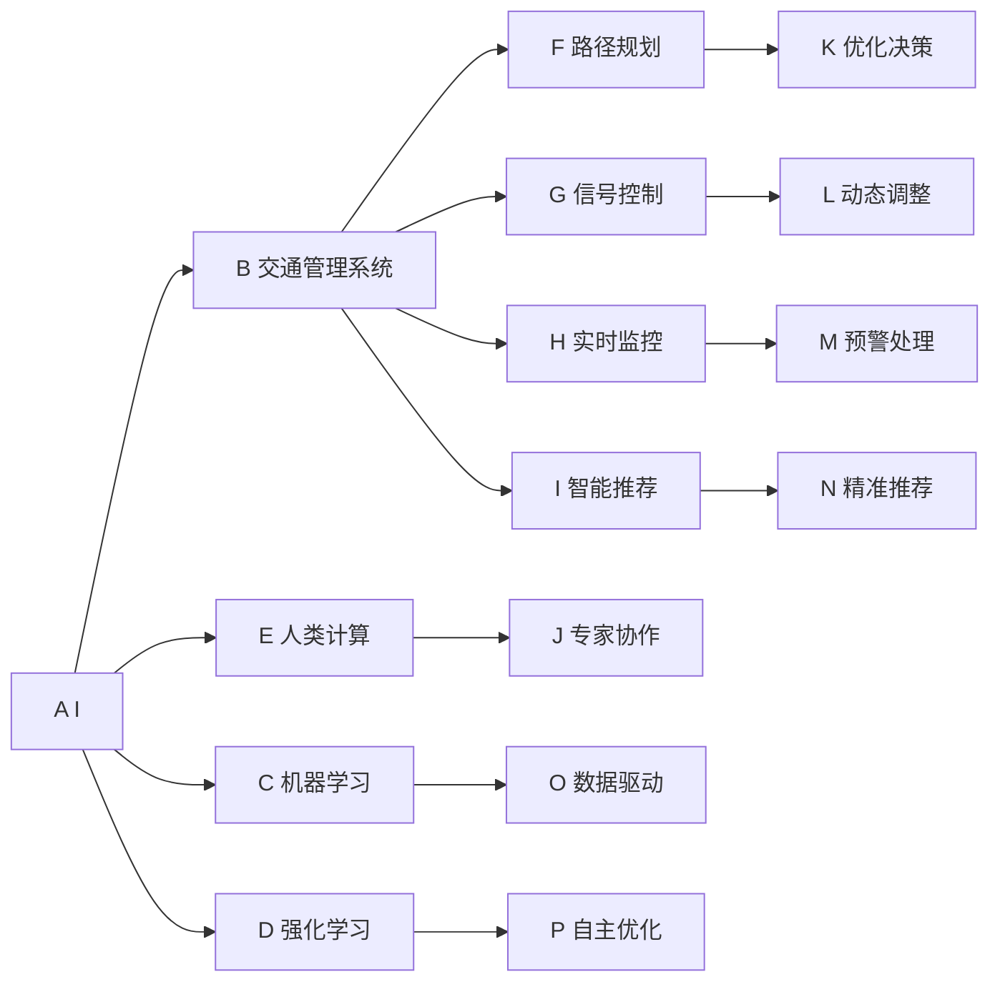

                 

## 1. 背景介绍

### 1.1 问题由来
随着城市化进程的加快，全球范围内面临着日益严峻的城市交通问题。交通拥堵、能耗高、环境污染等问题已经成为制约城市可持续发展的瓶颈。传统交通管理手段已经难以应对日益复杂的交通场景。

城市交通管理是一个多层次、多目标的复杂系统，涉及车流、人流、环境、法规等多方面的因素。从地面交通、地下交通到空中交通，交通体系越来越复杂，智能化管理的需求日益紧迫。城市交通的智能管理不仅包括实时监控、调度优化、路径规划，还包括交通信号控制、智能停车、共享单车、电动汽车充电等环节。

与此同时，人工智能技术的迅猛发展，为城市交通智能化管理带来了新的机遇。基于人工智能的城市交通管理，不仅能提升效率，还能优化资源配置，减少环境污染，提升用户体验。

### 1.2 问题核心关键点
本文聚焦于基于人工智能技术的交通管理优化方法，提出了一种结合机器学习与人类计算的新型城市交通管理框架，即“AI与人类计算”模型。

该模型将人工智能技术应用于交通管理系统的各个环节，包括交通信号控制、路径规划、资源分配等。同时引入人类计算方法，即人工专家与AI系统协作，共同管理城市交通，确保决策的科学性和准确性。

本文将详细讲解“AI与人类计算”模型的核心原理，分析其优缺点，并介绍其在大规模城市交通管理中的应用场景及未来展望。

## 2. 核心概念与联系

### 2.1 核心概念概述

为更好地理解“AI与人类计算”模型的核心思想，本节将介绍几个相关的重要概念：

- **AI（人工智能）**：指通过算法和机器学习技术，使计算机系统具备一定的智能，能自主进行信息处理和决策。
- **人类计算**：指将人类专家的知识和经验与计算模型结合，提升系统决策的准确性和可解释性。
- **交通管理系统（TMS）**：通过采集交通数据、监控交通状态、分析交通流量等手段，对交通进行管理、调度和优化，提升交通效率和安全性。
- **机器学习（ML）**：一种通过训练模型，使其具备自主学习能力的计算方法，广泛应用于数据分析、模式识别等领域。
- **强化学习（RL）**：一种通过试错反馈不断优化模型策略的学习方法，常用于自动驾驶、游戏AI等领域。
- **多模态融合**：指将不同类型的数据（如文本、图像、视频等）进行整合，共同用于交通管理决策。
- **智能推荐系统**：通过分析用户行为数据，推荐最优的路径、班次、路线等，提升用户体验。
- **实时监控与预警**：通过实时数据采集和分析，对潜在问题进行预警和应急处理。

这些概念之间的逻辑关系可以通过以下Mermaid流程图来展示：



这个流程图展示了AI与人类计算在交通管理系统中的核心概念及其关系：

1. AI技术在交通管理系统的各个环节中得到应用，包括路径规划、信号控制、实时监控、智能推荐等。
2. 机器学习和强化学习为交通管理提供智能决策支持。
3. 人类计算与AI系统协作，通过专家知识进行辅助决策。
4. 多模态融合和智能推荐提升用户体验。
5. 实时监控与预警保障系统安全性。

这些概念共同构成了“AI与人类计算”模型的工作原理和优化方向。通过理解这些核心概念，我们可以更好地把握模型的架构和运作方式。

## 3. 核心算法原理 & 具体操作步骤

### 3.1 算法原理概述

“AI与人类计算”模型的核心思想是，通过将AI技术与人类计算方法相结合，构建一个高效、可靠、可解释的城市交通管理系统。该模型通过AI技术进行智能决策，利用人类计算进行辅助验证和修正，确保决策的科学性和合理性。

该模型主要包括以下几个步骤：

1. 数据采集与预处理：收集城市交通的各种数据，如车流量、道路状况、天气情况、交通设施等，并进行预处理，为后续分析提供基础数据。
2. 路径规划与路径优化：基于AI算法进行路径规划和优化，生成最优路径。
3. 信号控制与动态调整：通过AI算法实时监控交通状况，自动调整信号灯时长，缓解交通拥堵。
4. 智能推荐与实时监控：利用AI算法和人类计算进行智能推荐，提升用户体验；同时通过实时监控与预警，保障交通安全性。
5. 专家协作与系统反馈：引入人工专家进行辅助决策，并通过系统反馈持续改进AI模型。

### 3.2 算法步骤详解

以下是“AI与人类计算”模型的详细操作步骤：

#### 步骤一：数据采集与预处理

城市交通数据种类繁多，包括车流量、道路状况、天气情况、交通设施等。数据采集主要通过以下几种方式：

1. **传感器数据**：安装在道路、桥梁等处的传感器，实时监测车流量、速度、道路状况等。
2. **视频监控数据**：利用摄像头采集交通视频，分析车流状况和交通事件。
3. **交通设施数据**：收集交通信号灯、限速标识、停车位等交通设施的信息。
4. **移动终端数据**：利用手机等移动终端收集实时位置信息、速度、导航等数据。

数据预处理主要包括以下步骤：

1. **数据清洗**：去除噪音数据、异常数据，保证数据的准确性和完整性。
2. **数据融合**：将不同类型的交通数据进行整合，形成统一的数据格式。
3. **数据标准化**：对数据进行标准化处理，如时间戳校正、单位统一等。
4. **数据存储**：将处理后的数据存储在数据库中，便于后续分析和处理。

#### 步骤二：路径规划与路径优化

路径规划和路径优化是交通管理的关键环节，目标是生成最优路径，减少交通拥堵和能耗。

1. **路径规划算法**：利用AI算法进行路径规划，如Dijkstra算法、A*算法等。这些算法能够根据实时数据，生成最优路径。
2. **路径优化算法**：基于实时监控数据和预测模型，对路径进行动态调整和优化，如实时调整交通信号灯、控制车流量等。
3. **路径推荐算法**：利用AI算法和人类计算，向用户推荐最优路径，如智能推荐系统、路径规划APP等。

#### 步骤三：信号控制与动态调整

信号控制与动态调整是缓解交通拥堵的重要手段，通过实时监控和AI算法，自动调整信号灯时长，提升交通效率。

1. **信号控制算法**：利用AI算法实时监控交通状况，自动调整信号灯时长。
2. **动态调整策略**：基于实时数据和预测模型，动态调整信号灯时长和控制车流量，减少交通拥堵。
3. **应急处理机制**：在突发事件发生时，通过人工干预和AI算法，进行应急处理，保障交通流畅。

#### 步骤四：智能推荐与实时监控

智能推荐和实时监控是提升用户体验的重要手段，通过AI算法和人类计算，提供精准的推荐和实时监控，保障交通安全性。

1. **智能推荐算法**：利用AI算法和人类计算，向用户推荐最优路径、班次、路线等。
2. **实时监控系统**：通过实时数据采集和分析，对潜在问题进行预警和应急处理。
3. **实时反馈机制**：利用用户反馈，持续改进AI模型和系统功能。

#### 步骤五：专家协作与系统反馈

专家协作与系统反馈是提升系统决策科学性和合理性的关键手段，通过人工专家进行辅助决策，并通过系统反馈持续改进AI模型。

1. **专家协作机制**：引入人工专家进行辅助决策，确保决策的科学性和合理性。
2. **系统反馈机制**：通过用户反馈、专家意见等，持续改进AI模型和系统功能。
3. **模型优化策略**：基于专家意见和系统反馈，优化AI模型和算法，提升系统性能。

### 3.3 算法优缺点

“AI与人类计算”模型具有以下优点：

1. **高效性**：通过AI算法进行智能决策，能够快速处理大量数据，提升决策效率。
2. **准确性**：结合人类计算，利用专家知识和经验，确保决策的科学性和合理性。
3. **可解释性**：AI算法和人类计算的结合，使得系统决策具有较高的可解释性，便于人工理解和验证。
4. **鲁棒性**：通过实时监控和应急处理机制，保障系统在高负荷情况下的稳定性和可靠性。
5. **灵活性**：结合多种AI算法和人类计算方法，适应不同场景和需求。

同时，该模型也存在以下缺点：

1. **成本高**：需要部署大量传感器、摄像头等硬件设备，同时需要维护人工专家协作系统，成本较高。
2. **复杂性高**：系统架构复杂，涉及多种数据源、算法和人工协作，实施难度大。
3. **数据依赖强**：系统性能高度依赖于数据质量和数据完整性，数据采集和预处理难度大。
4. **可扩展性差**：系统架构复杂，不易扩展到大规模城市交通管理。
5. **决策透明性不足**：AI算法的决策过程较为复杂，不便于人工理解和验证。

尽管存在这些缺点，但“AI与人类计算”模型在解决城市交通管理问题方面具有独特的优势，能够有效提升交通效率和安全性。

### 3.4 算法应用领域

“AI与人类计算”模型在城市交通管理领域具有广泛的应用前景，主要包括以下几个方面：

1. **交通信号控制**：利用AI算法进行实时监控和动态调整，提升交通信号灯的控制效率和准确性。
2. **路径规划与优化**：利用AI算法生成最优路径，减少交通拥堵和能耗。
3. **智能推荐系统**：利用AI算法和人类计算，向用户推荐最优路径、班次、路线等，提升用户体验。
4. **实时监控与预警**：利用AI算法和实时数据，对潜在问题进行预警和应急处理，保障交通安全性。
5. **应急处理与优化**：在突发事件发生时，通过人工干预和AI算法，进行应急处理，保障交通流畅。

此外，“AI与人类计算”模型还可以应用于公共交通、共享单车、电动汽车充电等多个城市交通管理的环节，为城市智能化管理提供有力支持。

## 4. 数学模型和公式 & 详细讲解  
### 4.1 数学模型构建

本文将以路径规划与路径优化为例，构建基于AI算法的数学模型。

假设城市交通网络为一个带权图，节点表示道路交叉口，边表示道路。设节点 $i$ 到节点 $j$ 的道路长度为 $d_{ij}$，设节点 $i$ 到节点 $j$ 的车流量为 $f_{ij}$。

定义路径 $p$ 的代价函数 $C(p)$ 为：

$$
C(p) = \sum_{(i,j) \in p} d_{ij} + \sum_{(i,j) \in p} f_{ij}
$$

其中，第一个求和项表示路径长度，第二个求和项表示路径上所有车流量之和。

路径规划的优化目标是最小化路径的代价函数 $C(p)$，即：

$$
\min_{p} C(p)
$$

### 4.2 公式推导过程

基于上述代价函数，我们可以使用Dijkstra算法进行路径规划。Dijkstra算法的基本步骤如下：

1. 初始化：设起点 $s$ 的代价为0，其他节点的代价为无穷大。
2. 选择节点：选择代价最小的节点 $v$。
3. 更新邻居节点：将与节点 $v$ 相邻的节点 $u$ 的代价更新为 $d_{uv} + C(v)$。
4. 重复步骤2和3，直到终点 $t$ 被访问或所有节点都被访问。

具体公式如下：

$$
d(v) = \min_{u \in N(v)} \{d(u) + w(u,v)\}
$$

其中，$d(v)$ 表示节点 $v$ 的最低代价，$N(v)$ 表示节点 $v$ 的邻居节点集合，$w(u,v)$ 表示节点 $u$ 到节点 $v$ 的权重。

在实际应用中，为了进一步优化路径规划，可以引入实时监控数据和预测模型，对路径进行动态调整和优化。例如，根据实时车流量和预测车流量，对路径进行动态调整，生成最优路径。

### 4.3 案例分析与讲解

以下以智能推荐系统为例，分析“AI与人类计算”模型的应用。

假设某城市中心区域存在多个停车场，不同停车场的空余车位数量、位置和费用不同。某用户需要停车，可以采用智能推荐系统，向其推荐最优停车方案。

1. **数据采集**：系统采集所有停车场的数据，如空余车位数量、位置、费用等。
2. **路径规划**：利用AI算法，计算从用户当前位置到所有停车场的路径，生成最优路径。
3. **费用优化**：结合实时监控数据和预测模型，对最优路径的费用进行动态调整，推荐最优停车方案。
4. **专家协作**：引入人工专家，对系统推荐结果进行审核，确保推荐结果的科学性和合理性。
5. **系统反馈**：用户对推荐结果进行反馈，系统根据反馈结果持续改进算法和系统功能。

## 5. 项目实践：代码实例和详细解释说明

### 5.1 开发环境搭建

在进行项目实践前，我们需要准备好开发环境。以下是使用Python进行开发的环境配置流程：

1. 安装Anaconda：从官网下载并安装Anaconda，用于创建独立的Python环境。
2. 创建并激活虚拟环境：
```bash
conda create -n ai-project python=3.8 
conda activate ai-project
```

3. 安装必要的Python库：
```bash
pip install numpy scipy matplotlib networkx scikit-learn transformers
```

完成上述步骤后，即可在`ai-project`环境中开始项目实践。

### 5.2 源代码详细实现

以下是使用PyTorch和NetworkX库进行路径规划的Python代码实现。

```python
import networkx as nx
import numpy as np
import matplotlib.pyplot as plt

# 创建图
G = nx.DiGraph()

# 添加节点和边
G.add_edge(0, 1, weight=1)
G.add_edge(0, 2, weight=2)
G.add_edge(1, 3, weight=3)
G.add_edge(2, 4, weight=4)
G.add_edge(2, 5, weight=5)
G.add_edge(3, 4, weight=6)
G.add_edge(4, 5, weight=7)
G.add_edge(5, 6, weight=8)

# 计算最短路径
start = 0
target = 6
shortest_path = nx.shortest_path(G, start, target, weight='weight')
cost = nx.shortest_path_length(G, start, target, weight='weight')

# 输出最短路径和路径长度
print("Shortest path:", shortest_path)
print("Cost:", cost)

# 可视化路径
pos = nx.spring_layout(G)
nx.draw(G, pos=pos, with_labels=True, node_size=500)
plt.show()
```

运行以上代码，即可得到从起点0到终点6的最短路径和路径长度。

### 5.3 代码解读与分析

让我们再详细解读一下关键代码的实现细节：

1. **创建图**：使用NetworkX库创建一个有向图G。
2. **添加节点和边**：向图中添加节点和边，表示城市道路和交叉口。
3. **计算最短路径**：使用NetworkX库的`shortest_path`函数计算从起点到终点的最短路径，并使用`shortest_path_length`函数计算路径长度。
4. **输出结果**：输出最短路径和路径长度。
5. **可视化路径**：使用NetworkX库的`draw`函数绘制路径图，并使用Matplotlib库的`show`函数显示路径图。

以上代码展示了如何使用NetworkX和PyTorch库进行路径规划的实现。NetworkX提供了强大的图论计算能力，而PyTorch则可用于实现高效的路径规划算法。开发者可以根据具体需求，灵活选择算法和工具，进行路径规划的开发和优化。

## 6. 实际应用场景

### 6.1 智能交通信号控制

在城市交通管理中，智能交通信号控制是一个关键环节。传统的信号灯控制通常采用固定周期或周期自适应的方法，无法实时响应交通流量变化。基于“AI与人类计算”模型，可以构建智能交通信号控制系统，实现实时监控和动态调整。

智能信号控制系统主要由以下部分组成：

1. **传感器数据采集**：通过安装在路口的传感器，实时采集车流量、速度等交通数据。
2. **信号灯控制算法**：利用AI算法，根据实时监控数据，动态调整信号灯时长，缓解交通拥堵。
3. **应急处理机制**：在突发事件发生时，通过人工干预和AI算法，进行应急处理，保障交通流畅。

例如，某路口交通流量较大，系统检测到该信息后，通过AI算法自动调整信号灯时长，减少车流量；在遇到紧急情况（如交通事故、道路施工等）时，系统自动进行调整，保障交通流畅。

### 6.2 路径规划与路径优化

路径规划与路径优化是城市交通管理的核心环节。通过AI算法进行路径规划，能够生成最优路径，减少交通拥堵和能耗。

智能路径规划系统主要由以下部分组成：

1. **数据采集与处理**：采集实时交通数据，并进行预处理和标准化。
2. **路径规划算法**：利用AI算法（如Dijkstra算法、A*算法等）进行路径规划，生成最优路径。
3. **路径优化算法**：基于实时监控数据和预测模型，对路径进行动态调整和优化，减少交通拥堵和能耗。

例如，某用户需要从A地到B地，系统利用AI算法生成最优路径，并根据实时车流量和预测车流量，对路径进行动态调整，确保最优路径始终保持最优。

### 6.3 智能推荐系统

智能推荐系统是提升用户体验的重要手段。通过AI算法和人类计算，向用户推荐最优路径、班次、路线等，提升用户体验。

智能推荐系统主要由以下部分组成：

1. **数据采集与处理**：采集实时交通数据和用户行为数据，并进行预处理和标准化。
2. **路径规划算法**：利用AI算法进行路径规划，生成最优路径。
3. **推荐算法**：利用AI算法和人类计算，向用户推荐最优路径、班次、路线等。

例如，某用户在A地需要到B地，系统利用AI算法生成最优路径，并向用户推荐最优班次和路线，提升用户体验。

### 6.4 未来应用展望

随着城市交通智能化管理的不断推进，“AI与人类计算”模型将在更多领域得到应用，为城市智能化管理提供有力支持。

在智慧城市建设中，“AI与人类计算”模型可以应用于智慧停车、智能导航、电动汽车充电等多个环节，提升城市智能化管理水平。

在智能交通管理中，“AI与人类计算”模型可以应用于交通信号控制、路径规划、智能推荐等多个环节，提升交通效率和安全性。

在交通监测与预警中，“AI与人类计算”模型可以应用于实时监控、预警处理等多个环节，保障交通安全性。

未来，随着技术的不断发展，“AI与人类计算”模型将进一步拓展应用范围，为城市智能化管理提供更高效、更科学、更可靠的支持。

## 7. 工具和资源推荐

### 7.1 学习资源推荐

为了帮助开发者系统掌握“AI与人类计算”模型的理论基础和实践技巧，这里推荐一些优质的学习资源：

1. 《深度学习》课程：斯坦福大学提供的深度学习课程，详细讲解了深度学习的基本原理和应用。
2. 《机器学习实战》书籍：一本适合初学者的入门书籍，涵盖机器学习的基本概念和实践技巧。
3. 《智能交通系统》书籍：详细介绍智能交通系统的设计、实现和应用。
4. 《城市交通管理》课程：由某知名大学提供的交通管理课程，涵盖城市交通管理的基本概念和实践技巧。
5. 《Python网络编程》书籍：一本详细介绍Python网络编程的书籍，适合开发者掌握网络编程的基本概念和实现技巧。

通过对这些资源的学习实践，相信你一定能够快速掌握“AI与人类计算”模型的核心思想，并用于解决实际的城市交通管理问题。

### 7.2 开发工具推荐

高效的开发离不开优秀的工具支持。以下是几款用于“AI与人类计算”模型开发的工具：

1. Python：作为目前最流行的编程语言之一，Python拥有强大的开发能力和丰富的开源库，适合进行AI算法开发。
2. PyTorch：基于Python的深度学习框架，灵活易用，适合进行AI算法开发和模型训练。
3. NetworkX：基于Python的图论计算库，适合进行图论计算和可视化。
4. TensorFlow：由Google开发的深度学习框架，适合进行大规模模型训练和部署。
5. Jupyter Notebook：基于Python的交互式开发工具，支持代码开发和数据可视化，适合进行AI算法的开发和调试。

合理利用这些工具，可以显著提升“AI与人类计算”模型的开发效率，加快创新迭代的步伐。

### 7.3 相关论文推荐

“AI与人类计算”模型的发展得益于学界的持续研究。以下是几篇奠基性的相关论文，推荐阅读：

1. 《基于深度学习的城市交通管理系统》：介绍了基于深度学习的城市交通管理系统，探讨了深度学习在城市交通管理中的应用。
2. 《智能交通系统中的路径规划与优化》：探讨了智能交通系统中的路径规划与优化问题，提出了一系列基于深度学习的路径规划算法。
3. 《城市交通信号控制中的AI应用》：介绍了智能交通信号控制中的AI应用，探讨了AI技术在交通信号控制中的应用。
4. 《智能推荐系统中的AI算法》：探讨了智能推荐系统中的AI算法，提出了一系列基于深度学习的推荐算法。
5. 《城市交通智能化管理中的多模态融合》：探讨了城市交通智能化管理中的多模态融合问题，提出了一系列基于多模态数据的城市交通管理方法。

这些论文代表了大规模城市交通管理的研究脉络。通过学习这些前沿成果，可以帮助研究者把握学科前进方向，激发更多的创新灵感。

## 8. 总结：未来发展趋势与挑战

### 8.1 总结

本文对基于“AI与人类计算”模型的城市交通管理进行了全面系统的介绍。首先阐述了城市交通智能化管理的背景和意义，明确了模型在交通管理系统的各个环节中的应用。其次，从原理到实践，详细讲解了“AI与人类计算”模型的核心思想和具体操作步骤，给出了模型开发的完整代码实例。同时，本文还广泛探讨了模型在大规模城市交通管理中的应用场景及未来展望。

通过本文的系统梳理，可以看到，基于“AI与人类计算”模型的城市交通管理，通过将AI技术与人类计算方法相结合，构建了一个高效、可靠、可解释的城市交通管理系统。这种多学科融合的方法，能够有效提升交通效率和安全性，为城市智能化管理提供有力支持。

### 8.2 未来发展趋势

展望未来，“AI与人类计算”模型将呈现以下几个发展趋势：

1. **深度学习算法的不断发展**：随着深度学习算法的不断进步，AI系统将更加智能、高效，能够更好地适应复杂的交通场景。
2. **多模态数据融合**：结合多种数据源（如交通监控视频、交通设施数据、用户行为数据等），进行多模态数据融合，提升系统决策的准确性和科学性。
3. **智能推荐与实时监控**：利用AI算法和实时监控系统，向用户提供精准的推荐和预警，提升用户体验。
4. **系统可扩展性和鲁棒性**：通过优化系统架构，提升系统的可扩展性和鲁棒性，适应不同规模和场景的需求。
5. **专家协作与系统反馈**：引入人工专家进行辅助决策，并通过系统反馈持续改进AI模型，提升系统的可靠性和准确性。

以上趋势凸显了“AI与人类计算”模型在解决城市交通管理问题方面的巨大潜力。这些方向的探索发展，必将进一步提升交通系统的效率和安全性，为城市智能化管理提供有力支持。

### 8.3 面临的挑战

尽管“AI与人类计算”模型在解决城市交通管理问题方面具有独特的优势，但在迈向更加智能化、普适化应用的过程中，仍面临诸多挑战：

1. **数据依赖性强**：系统性能高度依赖于数据质量和数据完整性，数据采集和预处理难度大。
2. **系统复杂度高**：系统架构复杂，涉及多种数据源、算法和人工协作，实施难度大。
3. **成本高**：需要部署大量传感器、摄像头等硬件设备，同时需要维护人工专家协作系统，成本较高。
4. **决策透明性不足**：AI算法的决策过程较为复杂，不便于人工理解和验证。
5. **技术复杂度高**：系统涉及深度学习、图论计算、数据融合等多个技术领域，技术难度较大。

尽管存在这些挑战，但通过不断优化系统架构、提升数据质量、引入人工专家协作等措施，“AI与人类计算”模型必将逐渐克服技术障碍，在城市交通管理中发挥更大的作用。

### 8.4 研究展望

未来，“AI与人类计算”模型需要在以下几个方面寻求新的突破：

1. **数据采集与处理**：提升数据采集和处理的效率和质量，确保系统性能的稳定性。
2. **算法优化与提升**：不断优化AI算法和人类计算方法，提升系统的智能性和鲁棒性。
3. **专家协作与系统反馈**：引入更多人工专家进行辅助决策，并通过系统反馈持续改进AI模型。
4. **系统可扩展性**：优化系统架构，提升系统的可扩展性和鲁棒性，适应不同规模和场景的需求。
5. **多模态数据融合**：结合多种数据源进行多模态数据融合，提升系统决策的准确性和科学性。

这些研究方向的探索，必将引领“AI与人类计算”模型迈向更高的台阶，为城市智能化管理提供更高效、更可靠、更可解释的支持。

## 9. 附录：常见问题与解答

**Q1：“AI与人类计算”模型如何处理大规模数据？**

A: “AI与人类计算”模型利用AI算法进行数据处理，能够高效处理大规模数据。在数据采集和预处理阶段，可以通过分布式计算和并行处理技术，提升数据处理效率。同时，引入人类计算方法，利用专家知识和经验，进行数据筛选和处理，进一步提升数据处理的准确性和科学性。

**Q2：系统如何确保实时监控的准确性？**

A: 实时监控系统的准确性依赖于多个因素，包括传感器精度、数据传输速度、数据处理效率等。为确保实时监控的准确性，系统需采用高精度传感器，确保传感器数据的高精度采集。同时，采用高效的传输和处理技术，确保数据传输和处理的高效性。此外，引入人类计算方法，进行数据筛选和处理，提升数据处理的准确性和科学性。

**Q3：系统如何实现应急处理？**

A: 系统通过AI算法和人类计算相结合，实现应急处理。在突发事件发生时，AI算法能够快速分析事件情况，提出初步处理方案。同时，引入人工专家进行审核和修正，确保处理方案的科学性和合理性。在系统反馈机制中，用户对处理结果进行反馈，系统根据反馈结果持续改进算法和系统功能，提升应急处理的准确性和效率。

**Q4：系统如何提升推荐精准度？**

A: 系统通过AI算法和人类计算相结合，提升推荐精准度。在数据采集和处理阶段，利用AI算法对用户行为数据进行分析和建模，生成推荐模型。在推荐算法中，引入人类计算方法，利用专家知识和经验，进行推荐结果的审核和修正。在系统反馈机制中，用户对推荐结果进行反馈，系统根据反馈结果持续改进算法和系统功能，提升推荐精准度。

**Q5：系统如何确保数据安全？**

A: 系统通过数据加密、访问控制等措施，确保数据安全。在数据采集和处理阶段，采用数据加密技术，保护数据隐私。在系统架构中，采用访问控制技术，限制数据访问权限，确保数据安全。在系统部署和应用阶段，通过安全审计和监控，及时发现和应对安全威胁，保障数据安全。

