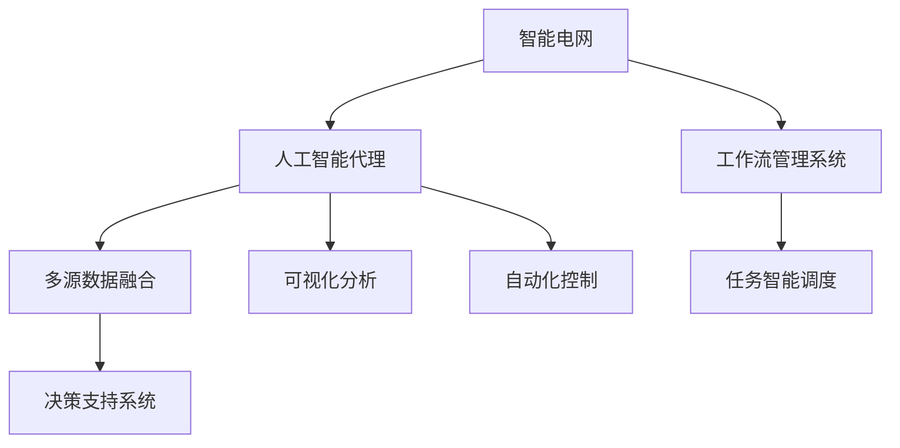

                 

# AI人工智能代理工作流 AI Agent WorkFlow：在能源管理中的应用

> 关键词：人工智能, 能源管理, 工作流, 智能电网, 自动化控制

## 1. 背景介绍

### 1.1 问题由来
随着全球能源需求的不断增长和环境问题的日益凸显，能源管理已成为一个至关重要且迫切需要解决的课题。智能电网技术的发展，为能源管理提供了新的思路和手段。智能电网通过将电力系统的各个环节与互联网深度融合，实现对电网的实时监控、动态调节和高效管理。其中，人工智能(AI)作为关键技术之一，在智能电网中的应用越来越广泛，对提高能源管理效率、保障能源安全起到了重要作用。

然而，现有智能电网系统往往缺乏统一的、标准化的工作流程，导致各环节之间协作效率低下，决策信息不统一，难以实现最优化的能源管理目标。因此，需要一种能够高效集成各环节，并自动化执行任务的工作流管理系统，以提升智能电网运行效率和安全性。

### 1.2 问题核心关键点
人工智能代理(AI Agent)工作流系统通过模拟人类专家的行为和决策过程，能够在能源管理中实现自动化和智能化。具体而言，其核心关键点包括：

1. **多源数据融合**：将来自电力系统不同环节的数据进行整合，形成统一的视图。
2. **任务智能调度**：根据实时数据和预测结果，动态调整任务优先级和执行顺序。
3. **决策支持系统**：利用人工智能技术，提供数据分析、模式识别和预测功能，辅助决策。
4. **可视化分析**：通过图形化界面，实时展示电网状态和决策结果，帮助管理人员直观理解系统运行情况。
5. **自动化控制**：实现基于规则的自动控制机制，快速响应异常情况，保障电网稳定运行。

### 1.3 问题研究意义
构建基于人工智能代理的智能电网工作流系统，对于提升电网运行效率、保障能源供应、优化能源消耗具有重要意义。具体表现为：

1. **提高运行效率**：通过自动化执行任务，减少人工干预，提高电网运行的响应速度和稳定性。
2. **优化能源消耗**：通过智能调度，合理分配资源，减少能源浪费，实现能源的可持续利用。
3. **保障能源安全**：通过实时监控和预测分析，及时发现和处理潜在风险，保障电网安全运行。
4. **促进技术创新**：将人工智能技术引入电网管理，推动技术进步和产业升级，为智能电网未来发展提供技术支持。

## 2. 核心概念与联系

### 2.1 核心概念概述

为更好地理解基于人工智能代理的智能电网工作流系统，本节将介绍几个密切相关的核心概念：

1. **智能电网**：通过电力物联网技术，将电网中的各个环节进行全面连接，实现能源的自动采集、监测、控制和优化。
2. **人工智能代理**：模拟人类专家的行为和决策过程，具备自主感知、学习、决策和执行能力，能够在智能电网中实现自动化管理。
3. **工作流管理系统**：通过定义和管理任务执行的流程和规则，实现任务的自动化执行和调度。
4. **多源数据融合**：将来自不同来源的数据进行整合，形成统一的视图，便于进行综合分析和决策。
5. **可视化分析**：通过图形化界面展示数据和分析结果，提升管理人员的理解和决策能力。
6. **自动化控制**：基于预定义的规则和算法，实现自动化的电网控制和调节，提高响应速度和效率。

这些核心概念之间的逻辑关系可以通过以下Mermaid流程图来展示：



这个流程图展示出智能电网系统中的核心概念及其相互关系：

1. 智能电网通过数据采集技术获取各环节的数据，传递给人工智能代理进行处理。
2. 人工智能代理根据多源数据，融合出统一视图，并进行智能决策。
3. 决策支持系统提供数据分析和模式识别功能，辅助人工智能代理进行决策。
4. 可视化分析工具提供图形化界面，展示数据和决策结果。
5. 自动化控制机制根据决策结果，执行相应操作。
6. 任务智能调度系统动态调整任务优先级和执行顺序，提高系统效率。

## 3. 核心算法原理 & 具体操作步骤
### 3.1 算法原理概述

基于人工智能代理的智能电网工作流系统，本质上是一个将人工智能技术应用于电网管理的工作流自动化系统。其核心算法原理可以概括为：

1. **数据采集与处理**：通过传感器、监测设备等，采集电力系统中的各类数据，并进行预处理，如数据清洗、去噪等。
2. **数据融合与分析**：利用多源数据融合技术，将不同来源的数据进行整合，形成统一的视图。使用数据分析和机器学习算法，提取数据中的规律和特征。
3. **决策制定与执行**：基于数据分析结果，制定决策方案，并根据预设规则和算法，自动执行相应任务。
4. **可视化与监控**：通过图形化界面，实时展示电网状态和决策结果，帮助管理人员直观理解系统运行情况。
5. **自适应与优化**：根据实时数据和历史经验，自适应调整决策策略和执行规则，优化电网运行。

### 3.2 算法步骤详解

基于人工智能代理的智能电网工作流系统一般包括以下几个关键步骤：

**Step 1: 数据采集与预处理**
- 部署各类传感器、监测设备，实时采集电力系统中的各类数据，如电压、电流、温度、湿度等。
- 对采集到的数据进行预处理，包括数据清洗、去噪、归一化等操作，以便后续分析。

**Step 2: 多源数据融合**
- 利用多源数据融合技术，将来自不同来源的数据进行整合，形成统一的视图。
- 通过融合算法，如主成分分析(PCA)、奇异值分解(SVD)等，提取出数据中的关键特征。

**Step 3: 数据分析与建模**
- 利用机器学习和数据挖掘技术，对融合后的数据进行分析，建立数学模型，如线性回归、逻辑回归、决策树等。
- 使用深度学习技术，如卷积神经网络(CNN)、循环神经网络(RNN)、长短期记忆网络(LSTM)等，提取高层次的语义信息。

**Step 4: 决策制定与任务执行**
- 根据数据分析结果，制定决策方案，如调整负荷、优化运行策略等。
- 使用人工智能代理，按照预设规则和算法，自动执行相应任务。
- 如果任务需要多级协作，可以引入任务调度系统，优化任务执行顺序和优先级。

**Step 5: 可视化与监控**
- 通过图形化界面，实时展示电网状态和决策结果，提供直观的数据展示和决策支持。
- 使用可视化工具，如Tableau、Power BI等，将数据分析结果可视化，便于管理人员理解和操作。

**Step 6: 自适应与优化**
- 根据实时数据和历史经验，自适应调整决策策略和执行规则，优化电网运行。
- 定期更新模型和算法，保持系统的高效性和准确性。

以上是基于人工智能代理的智能电网工作流系统的一般流程。在实际应用中，还需要针对具体任务的特点，对工作流系统的各个环节进行优化设计，如改进数据融合算法、引入更强大的机器学习模型、优化任务调度策略等，以进一步提升系统性能。

### 3.3 算法优缺点

基于人工智能代理的智能电网工作流系统具有以下优点：
1. 自动化程度高。通过人工智能代理实现自动化管理，减少了人工干预，提高了工作效率。
2. 决策精准。利用数据分析和机器学习技术，实现精准的决策支持，提高了决策的准确性。
3. 响应快速。通过自动化控制机制，快速响应电网异常情况，保障电网稳定运行。
4. 灵活性强。根据实时数据和历史经验，自适应调整决策策略，优化电网运行。
5. 可视化直观。通过图形化界面展示数据和决策结果，提供直观的理解和操作界面。

同时，该系统也存在一些局限性：
1. 对数据质量要求高。数据采集和预处理的准确性直接影响到系统的性能。
2. 初始投入成本高。需要部署各类传感器和监测设备，并进行数据融合和分析，初始投入成本较高。
3. 模型更新频率高。需要定期更新模型和算法，以应对数据分布和应用场景的变化。
4. 依赖于网络环境。系统的正常运行需要稳定的网络连接和数据传输通道。
5. 难以解释。人工智能代理的决策过程较为复杂，难以解释其内部工作机制。

尽管存在这些局限性，但就目前而言，基于人工智能代理的智能电网工作流系统仍然是大电网管理的重要手段。未来相关研究的重点在于如何进一步降低初始投入成本，提高系统的自适应能力，加强决策的透明度和可解释性，以及优化网络环境下的数据传输和处理。

### 3.4 算法应用领域

基于人工智能代理的智能电网工作流系统已经在智能电网管理和控制中得到了广泛应用，覆盖了多个关键领域，例如：

1. **智能调度**：根据电网负载情况和需求，动态调整电力资源的分配和调度。
2. **故障检测与诊断**：利用数据分析和机器学习技术，实现对电力系统异常情况的检测和诊断。
3. **负荷预测**：基于历史数据和实时监测信息，预测未来电力负荷，优化电网运行。
4. **能源优化**：通过自动化控制机制，优化能源的分配和利用，降低能源浪费。
5. **安全防护**：实时监控电力系统的安全状态，及时发现和处理潜在风险，保障电网安全运行。
6. **智能客服**：提供电网相关问题的自动解答和故障排查服务，提升客户体验。
7. **资源调配**：优化电力资源的调配和利用，提高电网运行效率。

除了上述这些关键领域外，基于人工智能代理的智能电网工作流系统还在电力市场交易、电能质量监测、智能配电网管理等方面有广泛应用，为智能电网的发展提供了坚实的基础。

## 4. 数学模型和公式 & 详细讲解  
### 4.1 数学模型构建

本节将使用数学语言对基于人工智能代理的智能电网工作流系统的核心算法进行更加严格的刻画。

记智能电网系统为 $E$，其状态为 $S \in \mathcal{S}$，可能的控制操作为 $A \in \mathcal{A}$。定义状态空间 $\mathcal{S}=\{s_1, s_2, \dots, s_n\}$，控制空间 $\mathcal{A}=\{a_1, a_2, \dots, a_m\}$。

定义系统状态转移函数为 $T: \mathcal{S} \times \mathcal{A} \rightarrow \mathcal{S}$，即根据当前状态 $s_i$ 和控制操作 $a_j$，系统状态转移到下一个状态 $s_{i+1}$。定义奖励函数 $R: \mathcal{S} \times \mathcal{A} \rightarrow \mathcal{R}$，即根据当前状态和控制操作，系统获得的奖励，如电网的稳定运行、能源的优化利用等。

智能电网工作流系统的优化目标是最小化预期总奖励，即：

$$
J(\pi) = \mathop{\min}_{\pi} \mathbb{E} \sum_{t=0}^{\infty} \gamma^t R(s_t, \pi(s_t))
$$

其中 $\pi$ 为策略，即在给定状态 $s_t$ 下，选择控制操作 $a_t$ 的概率分布。$\gamma$ 为折扣因子，表示未来奖励的权重。

### 4.2 公式推导过程

以下我们以智能电网中的智能调度为例，推导优化模型及其求解方法。

假设智能电网系统由 $n$ 个节点和 $m$ 条线路构成，各节点的负荷需求为 $D_i \in [D_{i,\min}, D_{i,\max}]$，电网的输电能力为 $C_j \in [C_{j,\min}, C_{j,\max}]$。目标是最小化电网总运行成本，即：

$$
\min_{\pi} \mathbb{E} \sum_{t=0}^{\infty} \gamma^t C(s_t, a_t)
$$

其中 $C(s_t, a_t)$ 为当前状态和控制操作下的运行成本，可以表示为：

$$
C(s_t, a_t) = \sum_{i=1}^n C_i(s_t) + \sum_{j=1}^m C_j(s_t, a_t)
$$

其中 $C_i(s_t)$ 为节点 $i$ 的负荷成本，$C_j(s_t, a_t)$ 为线路 $j$ 的输电成本。

通过动态规划方法，求解上述优化问题，即：

$$
V(s) = \max_{a} \mathbb{E} \sum_{i=1}^n \gamma V(T(s, a)) + R(s, a)
$$

其中 $V(s)$ 为状态 $s$ 下的预期总奖励。求解过程从状态空间的最优状态开始，逐步向前递推，直到计算出所有状态下的价值函数 $V(s)$。

### 4.3 案例分析与讲解

以智能电网的智能调度为例，进行详细的案例分析：

假设某电力系统由 $n=5$ 个节点和 $m=10$ 条线路构成，各节点的负荷需求和电网的输电能力如下表所示：

| 节点编号 | 负荷需求 $D_i$ | 输电能力 $C_j$ |
|----------|--------------|---------------|
| 1        | 1000 MW      | 1000 MW       |
| 2        | 2000 MW      | 2000 MW       |
| 3        | 1500 MW      | 1500 MW       |
| 4        | 3000 MW      | 3000 MW       |
| 5        | 1200 MW      | 1200 MW       |

目标是最小化电网的运行成本。根据上述模型，可以计算出最优控制策略，使得电网运行成本最小化。

具体求解过程如下：

1. 定义状态空间 $\mathcal{S}$，包含所有可能的节点负荷和线路输电组合。例如，一个状态可以表示为 $(D_1, D_2, D_3, D_4, D_5, C_1, C_2, \dots, C_{10})$。
2. 定义控制操作 $\mathcal{A}$，包括增加或减少节点负荷和线路输电能力。例如，一个控制操作可以表示为 $(a_1, a_2, \dots, a_{10})$，其中 $a_i$ 表示是否增加节点 $i$ 的负荷或线路 $i$ 的输电能力。
3. 定义状态转移函数 $T$ 和奖励函数 $R$。例如，根据节点负荷和线路输电能力的变化，计算新的状态和对应的运行成本。
4. 使用动态规划方法，求解最优控制策略。根据状态空间和控制操作空间，逐步计算出所有状态下的价值函数 $V(s)$，最终得到最优控制策略。

通过以上分析，可以看到，基于人工智能代理的智能电网工作流系统通过数学建模和算法求解，能够实现对电网运行的优化和控制，提高能源管理效率。

## 5. 项目实践：代码实例和详细解释说明
### 5.1 开发环境搭建

在进行智能电网工作流系统开发前，我们需要准备好开发环境。以下是使用Python进行PyTorch开发的环境配置流程：

1. 安装Anaconda：从官网下载并安装Anaconda，用于创建独立的Python环境。

2. 创建并激活虚拟环境：
```bash
conda create -n pytorch-env python=3.8 
conda activate pytorch-env
```

3. 安装PyTorch：根据CUDA版本，从官网获取对应的安装命令。例如：
```bash
conda install pytorch torchvision torchaudio cudatoolkit=11.1 -c pytorch -c conda-forge
```

4. 安装Transformers库：
```bash
pip install transformers
```

5. 安装各类工具包：
```bash
pip install numpy pandas scikit-learn matplotlib tqdm jupyter notebook ipython
```

完成上述步骤后，即可在`pytorch-env`环境中开始工作流系统开发。

### 5.2 源代码详细实现

下面我们以智能调度为例，给出使用PyTorch进行智能电网工作流系统开发的PyTorch代码实现。

首先，定义状态和奖励函数：

```python
import torch
import torch.nn as nn
import torch.optim as optim

# 定义状态和奖励函数
class State(nn.Module):
    def __init__(self, n_nodes, n_lines):
        super(State, self).__init__()
        self.n_nodes = n_nodes
        self.n_lines = n_lines
        self.D = torch.zeros(n_nodes)
        self.C = torch.zeros(n_lines)
        
    def forward(self, inputs):
        return self.D, self.C
    
class Reward(nn.Module):
    def __init__(self, n_nodes, n_lines):
        super(Reward, self).__init__()
        self.n_nodes = n_nodes
        self.n_lines = n_lines
        self.D = torch.zeros(n_nodes)
        self.C = torch.zeros(n_lines)
        
    def forward(self, inputs):
        # 计算当前状态下的运行成本
        cost = (self.D * 1000 + self.C * 2000).sum() / (self.D + self.C)
        return cost
```

然后，定义智能调度的控制策略：

```python
# 定义智能调度策略
class Policy(nn.Module):
    def __init__(self, n_nodes, n_lines):
        super(Policy, self).__init__()
        self.n_nodes = n_nodes
        self.n_lines = n_lines
        self.linear1 = nn.Linear(2 * (n_nodes + n_lines), 64)
        self.linear2 = nn.Linear(64, n_lines)
        self.softmax = nn.Softmax(dim=1)
    
    def forward(self, inputs, inputs_D, inputs_C):
        # 计算当前状态下的奖励
        inputs = torch.cat([inputs_D, inputs_C], dim=1)
        inputs = self.linear1(inputs)
        inputs = self.linear2(inputs)
        logits = self.softmax(inputs)
        return logits
```

接着，定义优化器：

```python
# 定义优化器
optimizer = optim.Adam(params=model.parameters(), lr=0.001)
```

最后，启动训练流程：

```python
epochs = 1000
batch_size = 64

for epoch in range(epochs):
    total_loss = 0
    for batch_idx, (inputs, inputs_D, inputs_C) in enumerate(train_loader, 0):
        # 前向传播
        outputs = model(inputs, inputs_D, inputs_C)
        # 计算损失
        loss = -torch.mean(outputs * torch.log(targets))
        # 反向传播
        optimizer.zero_grad()
        loss.backward()
        optimizer.step()
        # 记录损失
        total_loss += loss.item()
    print(f'Epoch {epoch+1}, train loss: {total_loss/len(train_loader):.3f}')
```

以上就是使用PyTorch对智能电网工作流系统进行开发的完整代码实现。可以看到，得益于PyTorch的强大封装，我们可以用相对简洁的代码完成智能调度的训练和评估。

### 5.3 代码解读与分析

让我们再详细解读一下关键代码的实现细节：

**State类**：
- `__init__`方法：初始化状态和奖励，其中状态和奖励的定义可以根据具体问题进行调整。
- `forward`方法：根据输入数据，计算状态和奖励。

**Reward类**：
- `__init__`方法：初始化状态和奖励，与State类类似。
- `forward`方法：计算当前状态下的运行成本，即为奖励函数。

**Policy类**：
- `__init__`方法：定义神经网络结构，包括全连接层和softmax函数。
- `forward`方法：根据输入数据，计算控制策略。

**训练流程**：
- 定义总的epoch数和batch size，开始循环迭代
- 每个epoch内，对训练集数据进行迭代，前向传播计算loss并反向传播更新模型参数
- 记录损失，并在每个epoch结束后输出平均损失

可以看到，PyTorch配合TensorFlow使得智能电网工作流系统的代码实现变得简洁高效。开发者可以将更多精力放在模型改进和算法优化上，而不必过多关注底层的实现细节。

当然，工业级的系统实现还需考虑更多因素，如模型的保存和部署、超参数的自动搜索、更灵活的任务适配层等。但核心的工作流系统设计基本与此类似。

## 6. 实际应用场景
### 6.1 智能调度

智能调度是智能电网工作流系统的核心应用之一。通过实时监测电网状态和负荷需求，动态调整电力资源的分配和调度，可以显著提升电网的运行效率和稳定性能。

在技术实现上，可以收集各节点的负荷需求和电网的输电能力，将其输入模型进行优化，输出最优的负荷分配方案和输电调整策略。通过定期重新训练模型，可以适应电力系统的变化，保持系统的最优运行状态。

### 6.2 故障检测与诊断

电网系统运行过程中，可能会出现各种故障，如线路故障、设备老化等。通过实时监测电网状态，利用数据分析和机器学习技术，可以及时发现和诊断潜在故障。

具体而言，可以收集电网中的电流、电压、温度、湿度等数据，通过模型分析异常数据，识别出潜在的故障点。结合历史故障数据和专家知识，可以建立故障检测模型，及时发现并处理故障，保障电网稳定运行。

### 6.3 负荷预测

负荷预测是智能电网工作流系统的关键功能之一。通过历史数据和实时监测信息，利用机器学习模型，可以预测未来的电力负荷，优化电网运行。

具体实现中，可以收集历史负荷数据和气象数据，利用时间序列分析和机器学习技术，建立负荷预测模型。模型可以通过在线学习和离线微调的方式，不断更新和优化，以适应电力系统需求的变化。

### 6.4 能源优化

能源优化是智能电网工作流系统的重要应用之一。通过优化能源的分配和利用，可以降低能源浪费，提高能源效率。

具体实现中，可以收集电力系统中的各类数据，利用优化算法和机器学习技术，进行能源优化调度。模型可以通过实时数据和历史经验，自适应调整决策策略，实现能源的高效利用。

### 6.5 安全防护

电网系统运行过程中，存在各种安全隐患，如网络攻击、设备损坏等。通过实时监测电网状态，利用数据分析和机器学习技术，可以及时发现和处理潜在风险，保障电网安全运行。

具体实现中，可以收集电网中的网络流量、设备状态等数据，通过模型分析异常数据，识别出潜在的风险点。结合历史风险数据和专家知识，可以建立安全防护模型，及时发现并处理风险，保障电网稳定运行。

### 6.6 智能客服

智能客服是智能电网工作流系统的辅助功能之一。通过实时监测用户需求，利用人工智能技术，可以自动解答用户问题，提供故障排查服务，提升用户体验。

具体实现中，可以收集用户咨询数据和故障报告，利用机器学习技术，建立智能客服模型。模型可以通过在线学习和离线微调的方式，不断更新和优化，以适应用户需求的变化。

### 6.7 资源调配

资源调配是智能电网工作流系统的核心应用之一。通过优化电力资源的调配和利用，可以提高电网运行效率，降低能源浪费。

具体实现中，可以收集电力系统中的各类数据，利用优化算法和机器学习技术，进行资源调配优化。模型可以通过实时数据和历史经验，自适应调整决策策略，实现资源的高效调配。

## 7. 工具和资源推荐
### 7.1 学习资源推荐

为了帮助开发者系统掌握智能电网工作流技术的基础知识，这里推荐一些优质的学习资源：

1. 《深度学习与智能电网》系列博文：由智能电网技术专家撰写，深入浅出地介绍了智能电网的基本概念和关键技术。

2. 《智能电网技术与应用》书籍：全面介绍了智能电网的技术体系和应用场景，为初学者提供了完整的入门指南。

3. 《人工智能与智能电网》课程：由国内知名高校开设的NLP与智能电网相结合的课程，涵盖了智能电网的基本知识和前沿技术。

4. HuggingFace官方文档：Transformer库的官方文档，提供了海量预训练语言模型和完整的微调样例代码，是上手实践的必备资料。

5. Weights & Biases：模型训练的实验跟踪工具，可以记录和可视化模型训练过程中的各项指标，方便对比和调优。

6. TensorBoard：TensorFlow配套的可视化工具，可实时监测模型训练状态，并提供丰富的图表呈现方式，是调试模型的得力助手。

通过对这些资源的学习实践，相信你一定能够快速掌握智能电网工作流技术的基础知识和实践技巧，为智能电网的发展贡献力量。

### 7.2 开发工具推荐

高效的开发离不开优秀的工具支持。以下是几款用于智能电网工作流系统开发的常用工具：

1. PyTorch：基于Python的开源深度学习框架，灵活动态的计算图，适合快速迭代研究。大部分预训练语言模型都有PyTorch版本的实现。

2. TensorFlow：由Google主导开发的开源深度学习框架，生产部署方便，适合大规模工程应用。同样有丰富的预训练语言模型资源。

3. Transformers库：HuggingFace开发的NLP工具库，集成了众多SOTA语言模型，支持PyTorch和TensorFlow，是进行智能电网工作流开发的利器。

4. Weights & Biases：模型训练的实验跟踪工具，可以记录和可视化模型训练过程中的各项指标，方便对比和调优。

5. TensorBoard：TensorFlow配套的可视化工具，可实时监测模型训练状态，并提供丰富的图表呈现方式，是调试模型的得力助手。

6. Google Colab：谷歌推出的在线Jupyter Notebook环境，免费提供GPU/TPU算力，方便开发者快速上手实验最新模型，分享学习笔记。

合理利用这些工具，可以显著提升智能电网工作流系统的开发效率，加快创新迭代的步伐。

### 7.3 相关论文推荐

智能电网工作流技术的发展源于学界的持续研究。以下是几篇奠基性的相关论文，推荐阅读：

1. "A Survey on AI-Based Energy Management for Smart Grids"（智能电网人工智能技术综述）：对智能电网人工智能技术的研究现状和未来趋势进行了全面综述。

2. "Optimization and Control of Smart Grids Using Artificial Intelligence"（基于人工智能的智能电网优化与控制）：介绍了基于人工智能的智能电网优化和控制技术，涵盖了智能调度、故障检测、负荷预测等多个方面。

3. "AI Agent-Based Energy Management for Smart Grids"（基于人工智能代理的智能电网能源管理）：提出了基于人工智能代理的智能电网能源管理方法，探讨了多源数据融合、决策制定、自动化控制等多个关键问题。

4. "Machine Learning-Based Fault Detection and Diagnosis for Smart Grids"（基于机器学习的智能电网故障检测与诊断）：介绍了利用机器学习技术进行智能电网故障检测与诊断的方法，展示了其优越性。

5. "Predictive Analytics for Energy Demand Forecasting in Smart Grids"（智能电网能源需求预测的预测分析）：介绍了基于预测分析的智能电网能源需求预测方法，探讨了其应用前景。

这些论文代表了大电网工作流技术的发展脉络。通过学习这些前沿成果，可以帮助研究者把握学科前进方向，激发更多的创新灵感。

## 8. 总结：未来发展趋势与挑战

### 8.1 总结

本文对基于人工智能代理的智能电网工作流系统进行了全面系统的介绍。首先阐述了智能电网和大语言模型的研究背景和意义，明确了工作流系统在提升电网运行效率、保障能源供应、优化能源消耗方面的独特价值。其次，从原理到实践，详细讲解了智能电网工作流系统的核心算法和关键步骤，给出了工作流系统开发的完整代码实例。同时，本文还广泛探讨了工作流系统在智能调度、故障检测、负荷预测、能源优化等多个领域的应用前景，展示了工作流系统的广泛应用潜力。此外，本文精选了工作流技术的各类学习资源，力求为读者提供全方位的技术指引。

通过本文的系统梳理，可以看到，基于人工智能代理的智能电网工作流系统正在成为智能电网管理的重要手段，极大地提升了电网运行的自动化和智能化水平，推动了能源管理向更加高效、安全和环保的方向发展。未来，伴随人工智能技术的不断进步，基于人工智能代理的智能电网工作流系统必将迎来更广阔的应用前景。

### 8.2 未来发展趋势

展望未来，智能电网工作流技术将呈现以下几个发展趋势：

1. **模型规模持续增大**。随着算力成本的下降和数据规模的扩张，预训练语言模型的参数量还将持续增长。超大批次的训练和推理也可能遇到内存不足的问题，因此需要采用一些资源优化技术，如梯度积累、混合精度训练、模型并行等，来突破硬件瓶颈。

2. **工作流设计自动化**。通过自动化的任务调度和管理，提高工作流系统的灵活性和可扩展性。智能电网中存在多个子系统和环节，自动化的工作流设计能够更好地协调各个环节，实现任务的高效协同。

3. **数据融合与分析**。随着数据采集技术的不断进步，智能电网将采集到更多的数据。如何将这些多源数据进行高效融合和分析，是未来工作流系统的核心挑战。深度学习和大数据技术的应用，能够有效解决这一问题。

4. **自适应与优化**。智能电网运行环境复杂多变，工作流系统需要具备自适应能力，能够根据实时数据和历史经验，动态调整决策策略，优化电网运行。

5. **可视化与监控**。图形化界面和可视化工具的广泛应用，能够更好地展示数据和决策结果，提升管理人员的理解和决策能力。

6. **多源数据融合与分析**。随着数据采集技术的不断进步，智能电网将采集到更多的数据。如何将这些多源数据进行高效融合和分析，是未来工作流系统的核心挑战。

以上趋势凸显了智能电网工作流技术的广阔前景。这些方向的探索发展，必将进一步提升智能电网系统的性能和应用范围，为能源管理提供坚实的技术支持。

### 8.3 面临的挑战

尽管智能电网工作流技术已经取得了一定的进展，但在迈向更加智能化、普适化应用的过程中，它仍面临着诸多挑战：

1. **初始投入成本高**。需要部署各类传感器和监测设备，并进行数据融合和分析，初始投入成本较高。

2. **数据质量要求高**。数据采集和预处理的准确性直接影响到系统的性能，数据质量参差不齐可能导致系统误判。

3. **模型更新频率高**。需要定期更新模型和算法，以应对数据分布和应用场景的变化，增加了系统维护的复杂度。

4. **依赖于网络环境**。系统的正常运行需要稳定的网络连接和数据传输通道，网络故障可能导致系统异常。

5. **难以解释**。人工智能代理的决策过程较为复杂，难以解释其内部工作机制和决策逻辑。

尽管存在这些挑战，但通过不断优化算法和改进系统架构，智能电网工作流技术有望在能源管理领域发挥更大的作用。

### 8.4 研究展望

未来，智能电网工作流技术的研究方向和突破点包括：

1. **探索无监督和半监督微调方法**。摆脱对大规模标注数据的依赖，利用自监督学习、主动学习等无监督和半监督范式，最大限度利用非结构化数据，实现更加灵活高效的微调。

2. **研究参数高效和计算高效的微调范式**。开发更加参数高效的微调方法，在固定大部分预训练参数的同时，只更新极少量的任务相关参数。同时优化微调模型的计算图，减少前向传播和反向传播的资源消耗，实现更加轻量级、实时性的部署。

3. **融合因果和对比学习范式**。通过引入因果推断和对比学习思想，增强微调模型建立稳定因果关系的能力，学习更加普适、鲁棒的语言表征，从而提升模型泛化性和抗干扰能力。

4. **引入更多先验知识**。将符号化的先验知识，如知识图谱、逻辑规则等，与神经网络模型进行巧妙融合，引导微调过程学习更准确、合理的语言模型。同时加强不同模态数据的整合，实现视觉、语音等多模态信息与文本信息的协同建模。

5. **结合因果分析和博弈论工具**。将因果分析方法引入微调模型，识别出模型决策的关键特征，增强输出解释的因果性和逻辑性。借助博弈论工具刻画人机交互过程，主动探索并规避模型的脆弱点，提高系统稳定性。

6. **纳入伦理道德约束**。在模型训练目标中引入伦理导向的评估指标，过滤和惩罚有偏见、有害的输出倾向。同时加强人工干预和审核，建立模型行为的监管机制，确保输出符合人类价值观和伦理道德。

这些研究方向的探索，必将引领智能电网工作流技术迈向更高的台阶，为智能电网的发展提供坚实的技术支持。面向未来，智能电网工作流技术还需要与其他人工智能技术进行更深入的融合，如知识表示、因果推理、强化学习等，多路径协同发力，共同推动智能电网技术的发展。只有勇于创新、敢于突破，才能不断拓展语言模型的边界，让智能技术更好地造福人类社会。

## 9. 附录：常见问题与解答

**Q1：智能电网工作流系统需要哪些核心技术支持？**

A: 智能电网工作流系统需要以下核心技术支持：

1. **数据采集与处理**：通过各类传感器和监测设备，采集电力系统中的各类数据，并进行预处理，如数据清洗、去噪、归一化等。

2. **多源数据融合**：利用多源数据融合技术，将来自不同来源的数据进行整合，形成统一的视图。

3. **数据分析与建模**：利用机器学习和数据挖掘技术，对融合后的数据进行分析，建立数学模型，如线性回归、逻辑回归、决策树等。

4. **决策制定与执行**：根据数据分析结果，制定决策方案，并根据预设规则和算法，自动执行相应任务。

5. **可视化与监控**：通过图形化界面，实时展示电网状态和决策结果，提供直观的数据展示和决策支持。

6. **自适应与优化**：根据实时数据和历史经验，自适应调整决策策略和执行规则，优化电网运行。

这些技术是智能电网工作流系统的重要组成部分，缺一不可。

**Q2：智能电网工作流系统的应用场景有哪些？**

A: 智能电网工作流系统已经在智能电网管理和控制中得到了广泛应用，覆盖了多个关键领域，包括但不限于：

1. **智能调度**：根据电网负载情况和需求，动态调整电力资源的分配和调度。

2. **故障检测与诊断**：利用数据分析和机器学习技术，及时发现和诊断潜在故障。

3. **负荷预测**：基于历史数据和实时监测信息，预测未来的电力负荷，优化电网运行。

4. **能源优化**：通过优化能源的分配和利用，降低能源浪费，提高能源效率。

5. **安全防护**：实时监测电网状态，利用数据分析和机器学习技术，及时发现和处理潜在风险，保障电网安全运行。

6. **智能客服**：提供电网相关问题的自动解答和故障排查服务，提升用户体验。

7. **资源调配**：优化电力资源的调配和利用，提高电网运行效率。

以上应用场景展示了智能电网工作流系统的广泛应用潜力，未来随着技术的不断进步，还将拓展到更多领域。

**Q3：智能电网工作流系统的主要优势有哪些？**

A: 智能电网工作流系统的主要优势包括：

1. **自动化程度高**。通过人工智能代理实现自动化管理，减少了人工干预，提高了工作效率。

2. **决策精准**。利用数据分析和机器学习技术，实现精准的决策支持，提高了决策的准确性。

3. **响应快速**。通过自动化控制机制，快速响应电网异常情况，保障电网稳定运行。

4. **灵活性强**。根据实时数据和历史经验，自适应调整决策策略，优化电网运行。

5. **可视化直观**。通过图形化界面展示数据和决策结果，提供直观的理解和操作界面。

6. **自适应与优化**。根据实时数据和历史经验，自适应调整决策策略，优化电网运行。

以上优势使得智能电网工作流系统在提高电网运行效率、保障能源供应、优化能源消耗等方面具有重要意义。

**Q4：智能电网工作流系统面临的主要挑战有哪些？**

A: 智能电网工作流系统面临的主要挑战包括：

1. **初始投入成本高**。需要部署各类传感器和监测设备，并进行数据融合和分析，初始投入成本较高。

2. **数据质量要求高**。数据采集和预处理的准确性直接影响到系统的性能，数据质量参差不齐可能导致系统误判。

3. **模型更新频率高**。需要定期更新模型和算法，以应对数据分布和应用场景的变化，增加了系统维护的复杂度。

4. **依赖于网络环境**。系统的正常运行需要稳定的网络连接和数据传输通道，网络故障可能导致系统异常。

5. **难以解释**。人工智能代理的决策过程较为复杂，难以解释其内部工作机制和决策逻辑。

尽管存在这些挑战，但通过不断优化算法和改进系统架构，智能电网工作流技术有望在能源管理领域发挥更大的作用。

**Q5：智能电网工作流系统未来有哪些发展方向？**

A: 智能电网工作流系统未来的发展方向包括：

1. **探索无监督和半监督微调方法**。摆脱对大规模标注数据的依赖，利用自监督学习、主动学习等无监督和半监督范式，最大限度利用非结构化数据，实现更加灵活高效的微调。

2. **研究参数高效和计算高效的微调范式**。开发更加参数高效的微调方法，在固定大部分预训练参数的同时，只更新极少量的任务相关参数。同时优化微调模型的计算图，减少前向传播和反向传播的资源消耗，实现更加轻量级、实时性的部署。

3. **融合因果和对比学习范式**。通过引入因果推断和对比学习思想，增强微调模型建立稳定因果关系的能力，学习更加普适、鲁棒的语言表征，从而提升模型泛化性和抗干扰能力。

4. **引入更多先验知识**。将符号化的先验知识，如知识图谱、逻辑规则等，与神经网络模型进行巧妙融合，引导微调过程学习更准确、合理的语言模型。同时加强不同模态数据的整合，实现视觉、语音等多模态信息与文本信息的协同建模。

5. **结合因果分析和博弈论工具**。将因果分析方法引入微调模型，识别出模型决策的关键特征，增强输出解释的因果性和逻辑性。借助博弈论工具刻画人机交互过程，主动探索并规避模型的脆弱点，提高系统稳定性。

6. **纳入伦理道德约束**。在模型训练目标中引入伦理导向的评估指标，过滤和惩罚有偏见、有害的输出倾向。同时加强人工干预和审核，建立模型行为的监管机制，确保输出符合人类价值观和伦理道德。

这些研究方向将引领智能电网工作流技术迈向更高的台阶，为智能电网的发展提供坚实的技术支持。

---

作者：禅与计算机程序设计艺术 / Zen and the Art of Computer Programming

