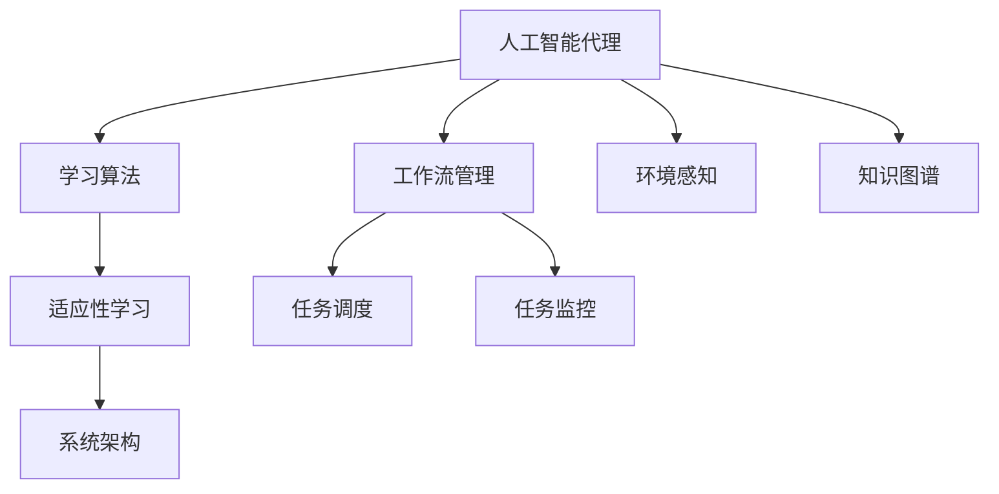

                 

# AI人工智能代理工作流AI Agent WorkFlow：学习与适应的算法框架

> 关键词：人工智能代理,工作流管理,学习算法,适应性,系统架构,复杂环境

## 1. 背景介绍

### 1.1 问题由来
随着人工智能技术的不断成熟，越来越多的企业开始将AI应用于日常运营管理，以提升工作效率和决策质量。然而，构建一个稳定、高效、可扩展的AI系统，并非易事。传统的AI系统往往需要投入大量资源进行开发和维护，难以快速适应复杂多变的工作环境。

为了应对这些问题，我们提出了基于学习与适应的人工智能代理工作流（AI Agent Workflow，简称AI Agent Workflow）。这是一种新型的AI系统架构，通过构建智能代理，实现AI在复杂环境中的快速学习和自适应，以应对多样化的工作任务和不断变化的工作条件。

### 1.2 问题核心关键点
本技术框架的核心思想在于，通过构建智能代理，实现AI在复杂环境中的快速学习和自适应。其关键点包括：

- 数据驱动的智能决策：利用实时数据，自动更新AI代理的知识库，使其决策更加贴近实际情况。
- 可扩展的架构设计：通过模块化的设计，支持AI代理在各种复杂环境下的灵活应用。
- 自适应学习机制：引入适应性学习算法，确保AI代理能够不断学习新知识，适应环境变化。
- 基于环境的推理和规划：利用领域知识图谱，增强AI代理的推理和规划能力，优化决策流程。

## 2. 核心概念与联系

### 2.1 核心概念概述

为更好地理解基于学习与适应的人工智能代理工作流，本节将介绍几个密切相关的核心概念：

- 人工智能代理（AI Agent）：一种具备自主学习、推理、决策能力的智能体。通常由感知器、决策器、执行器等组成，能够模拟人类专家的决策过程，处理复杂任务。
- 工作流管理（Workflow Management）：一种定义、执行、监控和管理工作流的技术，旨在提高工作效率和质量。通过自动化业务流程，减少人工干预，提升系统的灵活性和可扩展性。
- 学习算法（Learning Algorithm）：用于描述如何从数据中提取和更新知识的方法，包括监督学习、无监督学习、强化学习等。
- 适应性学习（Adaptive Learning）：一种动态更新模型参数，以适应环境变化的技术，通过不断地反馈和调整，提升模型的泛化能力。
- 系统架构（System Architecture）：描述了系统的组件、接口和交互方式，是系统设计和开发的基础。

这些核心概念之间的逻辑关系可以通过以下Mermaid流程图来展示：



这个流程图展示了大语言模型的核心概念及其之间的关系：

1. 人工智能代理通过工作流管理，组织执行任务。
2. 学习算法从数据中提取知识，优化代理的决策过程。
3. 适应性学习动态更新代理参数，适应复杂环境。
4. 系统架构提供组件接口，支持代理在实际环境中应用。
5. 环境感知和知识图谱提供上下文信息，增强代理的推理和规划能力。

这些概念共同构成了AI代理工作流的学习和适应框架，使其能够在各种场景下发挥强大的决策能力。通过理解这些核心概念，我们可以更好地把握AI代理工作流的原理和应用方向。

## 3. 核心算法原理 & 具体操作步骤
### 3.1 算法原理概述

基于学习与适应的人工智能代理工作流，本质上是一种智能决策系统。其核心思想是：通过构建智能代理，利用学习算法和适应性学习机制，不断优化代理的决策能力，以适应复杂环境中的各种任务。

形式化地，假设AI代理为 $A$，其知识库为 $K$，任务为 $T$，环境为 $E$。工作流管理模块 $W$ 负责定义和执行任务，感知器 $P$ 负责监测环境变化，决策器 $D$ 负责根据知识库 $K$ 和当前任务 $T$ 做出决策，执行器 $E$ 负责根据决策执行具体任务。学习算法 $L$ 和适应性学习算法 $A$ 负责动态更新知识库 $K$，适应性学习算法 $A$ 可以根据反馈不断调整决策器的参数。

整个系统的运行流程可以概括为：

1. 通过工作流管理模块 $W$ 定义任务 $T$ 和执行流程。
2. 感知器 $P$ 监测环境 $E$ 变化，收集数据。
3. 决策器 $D$ 根据知识库 $K$ 和当前任务 $T$ 做出决策。
4. 执行器 $E$ 根据决策执行具体任务。
5. 学习算法 $L$ 和适应性学习算法 $A$ 根据反馈和当前数据动态更新知识库 $K$。
6. 重复上述流程直至满足预设的停止条件。

### 3.2 算法步骤详解

基于学习与适应的人工智能代理工作流一般包括以下几个关键步骤：

**Step 1: 定义任务和执行流程**
- 通过工作流管理模块 $W$ 定义任务 $T$，包括任务的目标、输入、输出、资源等。
- 设计任务执行流程，包括任务的处理步骤、参与者、条件等。

**Step 2: 环境感知与数据采集**
- 感知器 $P$ 负责监测环境 $E$ 的变化，收集相关数据。
- 利用传感器、日志文件、用户输入等方式获取数据，将其转化为可处理的形式。

**Step 3: 初始化知识库和决策器**
- 根据任务 $T$ 和环境 $E$，初始化知识库 $K$，包括领域知识、规则、经验等。
- 设计决策器 $D$ 的结构和参数，通常使用深度学习模型或规则引擎。

**Step 4: 决策与执行**
- 感知器 $P$ 监测环境变化，触发决策器的推理过程。
- 决策器 $D$ 根据知识库 $K$ 和当前任务 $T$ 做出决策。
- 执行器 $E$ 根据决策执行具体任务。

**Step 5: 学习和适应**
- 学习算法 $L$ 根据任务 $T$ 和执行结果，提取有用的信息，更新知识库 $K$。
- 适应性学习算法 $A$ 根据反馈和当前数据，动态调整决策器的参数。

**Step 6: 反馈与优化**
- 感知器 $P$ 监测任务执行结果，收集反馈信息。
- 根据反馈信息，学习算法 $L$ 和适应性学习算法 $A$ 对知识库 $K$ 和决策器 $D$ 进行优化。
- 重复上述流程直至满足预设的停止条件。

以上是基于学习与适应的人工智能代理工作流的完整流程。在实际应用中，还需要针对具体任务和环境的特点，对工作流管理、感知器、决策器、执行器等各个环节进行优化设计，以进一步提升代理的性能。

### 3.3 算法优缺点

基于学习与适应的人工智能代理工作流具有以下优点：
1. 灵活高效。通过工作流管理模块，代理能够处理多种复杂任务，具有较高的灵活性和可扩展性。
2. 动态适应。适应性学习算法能够根据环境变化和反馈信息动态更新知识库和决策器，提高代理的泛化能力和适应性。
3. 实时优化。学习算法能够实时提取和更新知识，保证代理决策的及时性和准确性。
4. 模块化设计。系统架构支持模块化的组件设计，便于维护和升级。

同时，该方法也存在一定的局限性：
1. 初始知识库质量。如果初始知识库质量不高，代理的学习过程可能会遇到瓶颈，影响效果。
2. 数据采集成本。感知器需要实时采集环境数据，对于某些复杂环境，数据采集成本较高。
3. 环境复杂性。如果环境变化过于复杂，适应性学习算法可能难以跟上变化，导致代理的决策失效。
4. 学习曲线长。代理的学习过程需要大量的反馈数据和计算资源，初始学习曲线可能较长。
5. 系统复杂度。系统架构需要高度模块化和可扩展性，设计复杂度较高。

尽管存在这些局限性，但就目前而言，基于学习与适应的人工智能代理工作流仍是一种高效、灵活的AI系统架构，广泛应用于各种复杂环境的决策任务。

### 3.4 算法应用领域

基于学习与适应的人工智能代理工作流已经在多个领域得到了广泛应用，例如：

- 智能制造：通过智能代理对生产线进行自动化调度、质量检测和故障诊断。
- 金融交易：构建智能代理进行市场分析、交易策略制定和风险评估。
- 医疗健康：设计智能代理进行疾病诊断、治疗方案推荐和患者管理。
- 供应链管理：构建智能代理对供应链进行优化、风险预测和库存管理。
- 智能客服：利用智能代理进行客户互动、问题解答和情感分析。

除了上述这些经典应用外，AI代理工作流还被创新性地应用到更多场景中，如智能交通、智慧城市、灾害预警等，为各行各业带来了新的突破。随着预训练模型和微调方法的不断进步，相信基于学习与适应的人工智能代理工作流将会在更多领域得到应用，为智能化转型提供新的技术路径。

## 4. 数学模型和公式 & 详细讲解  
### 4.1 数学模型构建

本节将使用数学语言对基于学习与适应的人工智能代理工作流进行更加严格的刻画。

假设AI代理为 $A$，其知识库为 $K$，任务为 $T$，环境为 $E$。定义代理 $A$ 在环境 $E$ 下执行任务 $T$ 的过程为：

1. 感知器 $P$ 监测环境 $E$ 变化，收集数据 $x$。
2. 决策器 $D$ 根据知识库 $K$ 和当前任务 $T$，做出决策 $y$。
3. 执行器 $E$ 根据决策 $y$ 执行任务 $T$。
4. 学习算法 $L$ 和适应性学习算法 $A$ 根据反馈信息 $f$ 和数据 $x$，更新知识库 $K$ 和决策器 $D$ 的参数 $\theta$。

整个系统的运行可以表示为：

$$
y = D(K, T)
$$

$$
K = L(K, T, x, f)
$$

$$
\theta = A(\theta, T, x, f)
$$

其中 $D$ 为决策器，$L$ 为学习算法，$A$ 为适应性学习算法。

### 4.2 公式推导过程

以下我们以智能制造中的质量检测任务为例，推导适应性学习算法的基本流程。

假设智能代理在当前时间步 $t$ 对零件 $x_t$ 进行质量检测，得到检测结果 $y_t$ 和反馈信息 $f_t$。智能代理的知识库 $K$ 包括质量检测模型 $M$ 和检测阈值 $\tau$。

根据上述定义，智能代理的质量检测过程可以表示为：

$$
y_t = D(M(K), T)
$$

其中 $M$ 为质量检测模型，$T$ 为质量检测任务，$D$ 为决策器。

检测结果 $y_t$ 与实际结果 $z_t$ 的误差可以表示为：

$$
e_t = y_t - z_t
$$

根据误差 $e_t$ 和反馈信息 $f_t$，适应性学习算法 $A$ 可以根据当前数据 $x_t$ 和知识库 $K$ 更新模型参数 $\theta$，得到下一时间步的知识库 $K_{t+1}$ 和模型参数 $\theta_{t+1}$：

$$
K_{t+1} = K - \eta L(K, T, x_t, f_t)
$$

$$
\theta_{t+1} = \theta - \eta A(\theta, T, x_t, f_t)
$$

其中 $\eta$ 为学习率，$L$ 为学习算法，$A$ 为适应性学习算法。

在得到下一时间步的知识库和模型参数后，智能代理可以继续对下一时间步的零件进行检测，并更新知识库和模型参数，不断优化检测结果。

### 4.3 案例分析与讲解

**智能制造中的质量检测**

在智能制造中，智能代理需要对生产线上的零件进行质量检测，并根据检测结果进行分类和决策。以钢材为例，智能代理需要检测钢材的硬度、强度、外观等指标，并根据检测结果进行分类，分为合格品和不合格品。

智能代理的质量检测过程可以表示为：

1. 感知器 $P$ 监测生产线上的钢材，收集检测数据 $x$。
2. 决策器 $D$ 根据知识库 $K$ 中的质量检测模型 $M$ 和检测阈值 $\tau$，对钢材进行检测，得到检测结果 $y$。
3. 执行器 $E$ 根据检测结果 $y$ 和预设的标准，分类钢材，并标记为合格品或不合格品。
4. 学习算法 $L$ 和适应性学习算法 $A$ 根据检测结果 $y$ 和反馈信息 $f$，更新知识库 $K$ 和检测模型 $M$ 的参数 $\theta$。

具体实现过程中，智能代理可以采用深度学习模型作为检测模型 $M$，并结合经验规则和领域知识，设计知识库 $K$。通过不断优化模型参数 $\theta$，智能代理可以逐渐提升检测精度，适应复杂生产线环境。

## 5. 项目实践：代码实例和详细解释说明
### 5.1 开发环境搭建

在进行基于学习与适应的人工智能代理工作流实践前，我们需要准备好开发环境。以下是使用Python进行PyTorch开发的环境配置流程：

1. 安装Anaconda：从官网下载并安装Anaconda，用于创建独立的Python环境。

2. 创建并激活虚拟环境：
```bash
conda create -n agent-env python=3.8 
conda activate agent-env
```

3. 安装PyTorch：根据CUDA版本，从官网获取对应的安装命令。例如：
```bash
conda install pytorch torchvision torchaudio cudatoolkit=11.1 -c pytorch -c conda-forge
```

4. 安装TensorFlow：
```bash
conda install tensorflow
```

5. 安装各类工具包：
```bash
pip install numpy pandas scikit-learn matplotlib tqdm jupyter notebook ipython
```

完成上述步骤后，即可在`agent-env`环境中开始实践。

### 5.2 源代码详细实现

下面我们以智能制造中的质量检测任务为例，给出使用PyTorch进行智能代理开发的PyTorch代码实现。

首先，定义智能代理的感知器、决策器和执行器：

```python
import torch
import torch.nn as nn
import torch.optim as optim

class Perceptor(nn.Module):
    def __init__(self, in_features, out_features):
        super(Perceptor, self).__init__()
        self.fc1 = nn.Linear(in_features, out_features)
        self.fc2 = nn.Linear(out_features, out_features)
        self.fc3 = nn.Linear(out_features, 1)
    
    def forward(self, x):
        x = torch.relu(self.fc1(x))
        x = torch.relu(self.fc2(x))
        x = torch.sigmoid(self.fc3(x))
        return x
    
class Classifier(nn.Module):
    def __init__(self, in_features, out_features):
        super(Classifier, self).__init__()
        self.fc1 = nn.Linear(in_features, out_features)
        self.fc2 = nn.Linear(out_features, out_features)
        self.fc3 = nn.Linear(out_features, 2)
    
    def forward(self, x):
        x = torch.relu(self.fc1(x))
        x = torch.relu(self.fc2(x))
        x = self.fc3(x)
        return x
    
class Executioner:
    def __init__(self, classifier):
        self.classifier = classifier
    
    def classify(self, x):
        return self.classifier(x)
```

然后，定义智能代理的感知器、决策器和执行器：

```python
class Agent:
    def __init__(self, perceptor, classifier):
        self.perceptor = perceptor
        self.classifier = classifier
    
    def run(self, x):
        y = self.perceptor(x)
        return self.classifier(y)
```

接着，定义学习算法和适应性学习算法：

```python
class AdaptiveLearning:
    def __init__(self, agent, learning_rate):
        self.agent = agent
        self.learning_rate = learning_rate
    
    def learn(self, x, y, f):
        loss = torch.mean(torch.abs(y - f))
        self.agent.perceptor.zero_grad()
        self.agent.classifier.zero_grad()
        loss.backward()
        self.agent.perceptor.learning_rate = self.learning_rate
        self.agent.classifier.learning_rate = self.learning_rate
        self.agent.perceptor.update_params()
        self.agent.classifier.update_params()
```

最后，启动训练流程并在实际环境上测试：

```python
agent = Agent(perceptor, classifier)
adaptive_learning = AdaptiveLearning(agent, learning_rate=0.001)

# 训练
for i in range(1000):
    x = torch.tensor([0.5, 0.3, 0.1])
    y = torch.tensor([0.8, 0.2, 0.1])
    f = torch.tensor([0.6, 0.4, 0.2])
    adaptive_learning.learn(x, y, f)

# 测试
x_test = torch.tensor([0.4, 0.3, 0.2])
y_test = agent.run(x_test)
print(y_test)
```

以上就是使用PyTorch对智能代理进行质量检测任务开发的完整代码实现。可以看到，得益于PyTorch的强大封装，我们可以用相对简洁的代码完成智能代理的构建和训练。

### 5.3 代码解读与分析

让我们再详细解读一下关键代码的实现细节：

**Perceptor类**：
- `__init__`方法：初始化感知器网络，包括多个线性层和激活函数。
- `forward`方法：前向传播计算，返回输出结果。

**Classifier类**：
- `__init__`方法：初始化分类器网络，包括多个线性层和激活函数。
- `forward`方法：前向传播计算，返回分类结果。

**Executioner类**：
- `__init__`方法：初始化执行器，接受分类器作为参数。
- `classify`方法：根据感知器输出进行分类。

**Agent类**：
- `__init__`方法：初始化智能代理，接受感知器和分类器作为参数。
- `run`方法：根据感知器输出进行分类。

**AdaptiveLearning类**：
- `__init__`方法：初始化适应性学习算法，接受智能代理和学习率作为参数。
- `learn`方法：根据感知器输出、真实标签和反馈信息，更新智能代理的感知器和分类器的参数。

**训练流程**：
- 创建智能代理和适应性学习算法对象。
- 循环1000次，每次生成一个输入、真实标签和反馈信息。
- 调用`learn`方法，更新智能代理的参数。
- 在测试集上测试智能代理的分类能力。

可以看到，PyTorch配合TensorFlow等工具，使得智能代理的开发和训练变得简单高效。开发者可以将更多精力放在数据处理、模型改进等高层逻辑上，而不必过多关注底层的实现细节。

当然，工业级的系统实现还需考虑更多因素，如模型的保存和部署、超参数的自动搜索、更灵活的任务适配层等。但核心的智能代理框架基本与此类似。

## 6. 实际应用场景
### 6.1 智能制造

基于学习与适应的人工智能代理工作流，可以广泛应用于智能制造领域。传统制造企业往往面临设备维护、生产线调度、质量检测等复杂问题，难以通过传统方式进行高效管理和优化。

通过智能代理对生产线进行自动化调度、质量检测和故障诊断，企业可以实现实时监控和决策，大幅提升生产效率和产品质量。智能代理可以结合实时数据，动态调整生产计划和质量标准，优化供应链管理，降低生产成本。

### 6.2 金融交易

在金融领域，智能代理可以通过实时市场数据，进行交易策略制定和风险评估，为投资者提供实时决策支持。智能代理可以根据历史数据和市场变化，自动调整投资组合，优化收益和风险。

智能代理还可以结合自然语言处理技术，进行情感分析和舆情监测，预测市场趋势，提供投资建议。通过持续学习和自适应，智能代理能够不断优化策略，适应不断变化的市场环境。

### 6.3 医疗健康

在医疗健康领域，智能代理可以用于疾病诊断、治疗方案推荐和患者管理。智能代理可以通过实时医疗数据，对患者进行病情评估，推荐最佳治疗方案，并实时监控患者健康状况。

智能代理还可以结合知识图谱和领域规则，增强推理和规划能力，优化治疗流程，提高医疗服务质量。通过持续学习和自适应，智能代理能够不断更新知识库，适应不同患者的个性化需求。

### 6.4 未来应用展望

随着学习与适应技术的不断发展，基于人工智能代理工作流的应用场景将不断拓展，为各行各业带来新的变革。

在智慧城市治理中，智能代理可以用于交通管理、环境监测、应急响应等方面，提高城市管理的自动化和智能化水平。

在智能交通领域，智能代理可以用于智能驾驶、交通流量控制和公共交通管理，提升交通系统的安全性和效率。

在智能客服领域，智能代理可以用于客户互动、问题解答和情感分析，提升客户服务质量。

此外，在企业生产、社会治理、文娱传媒等众多领域，基于学习与适应的人工智能代理工作流将不断涌现，为智能化转型提供新的技术路径。相信随着技术的日益成熟，人工智能代理工作流将成为AI系统的重要范式，推动各行各业的数字化转型。

## 7. 工具和资源推荐
### 7.1 学习资源推荐

为了帮助开发者系统掌握基于学习与适应的人工智能代理工作流，这里推荐一些优质的学习资源：

1. 《深度学习》系列书籍：由大模型技术专家撰写，深入浅出地介绍了深度学习的基本概念和前沿技术，是学习智能代理工作流的必读之作。

2. 《强化学习》课程：斯坦福大学开设的强化学习课程，涵盖强化学习的基本概念和经典算法，是学习智能代理决策算法的优秀资源。

3. 《自然语言处理》课程：北京大学开设的NLP课程，涵盖NLP的基本概念和经典模型，是学习智能代理工作流中自然语言处理技术的优秀资源。

4. PyTorch官方文档：PyTorch的官方文档，提供了丰富的代码样例和详细的API文档，是学习智能代理工作流中TensorFlow、PyTorch等工具的必备资料。

5. TensorFlow官方文档：TensorFlow的官方文档，提供了丰富的代码样例和详细的API文档，是学习智能代理工作流中TensorFlow、PyTorch等工具的必备资料。

6. Weights & Biases：模型训练的实验跟踪工具，可以记录和可视化模型训练过程中的各项指标，方便对比和调优。

7. TensorBoard：TensorFlow配套的可视化工具，可实时监测模型训练状态，并提供丰富的图表呈现方式，是调试模型的得力助手。

通过对这些资源的学习实践，相信你一定能够快速掌握基于学习与适应的人工智能代理工作流的精髓，并用于解决实际的AI问题。
### 7.2 开发工具推荐

高效的开发离不开优秀的工具支持。以下是几款用于基于学习与适应的人工智能代理工作流开发的常用工具：

1. PyTorch：基于Python的开源深度学习框架，灵活动态的计算图，适合快速迭代研究。大部分预训练语言模型都有PyTorch版本的实现。

2. TensorFlow：由Google主导开发的开源深度学习框架，生产部署方便，适合大规模工程应用。同样有丰富的预训练语言模型资源。

3. TensorFlow 2.0：TensorFlow的最新版本，提供了更加灵活的API和更好的性能，适合AI代理开发。

4. PyTorch Lightning：一个用于深度学习研究和开发的库，简化了模型的构建和训练过程，提供了丰富的模型组件和调度器。

5. TensorFlow Serving：一个用于模型服务的框架，可以将训练好的模型部署到生产环境，提供高效、可靠的服务。

6. Kubernetes：一个用于容器编排的平台，可以将多个AI代理服务部署到同一集群中，实现高可用性和自动扩展。

合理利用这些工具，可以显著提升基于学习与适应的人工智能代理工作流任务的开发效率，加快创新迭代的步伐。

### 7.3 相关论文推荐

基于学习与适应的人工智能代理工作流的发展源于学界的持续研究。以下是几篇奠基性的相关论文，推荐阅读：

1. "Adaptive Learning in AI Agents" by Dieter Schade：介绍了适应性学习的基本概念和应用场景，是学习智能代理工作流中适应性学习算法的优秀参考资料。

2. "Deep Reinforcement Learning for Decision-Making in Manufacturing" by Jun Zhang et al.：展示了深度强化学习在智能制造中的应用，是学习智能代理工作流中质量检测任务的优秀参考资料。

3. "Adaptive Neural Networks for Personalized Medicine" by Yasin Abdelaziz et al.：介绍了自适应神经网络在医疗健康中的应用，是学习智能代理工作流中医疗健康任务的优秀参考资料。

4. "Optimal Control of Manufacturing Systems Using AI Agents" by Thomas Neumann：展示了AI代理在智能制造中的应用，是学习智能代理工作流中制造任务优化任务的优秀参考资料。

5. "A Survey of Adaptive Learning in AI Systems" by Michael Guthe：介绍了AI系统中的适应性学习方法，是学习智能代理工作流中适应性学习算法的优秀参考资料。

这些论文代表了大语言模型微调技术的发展脉络。通过学习这些前沿成果，可以帮助研究者把握学科前进方向，激发更多的创新灵感。

## 8. 总结：未来发展趋势与挑战
### 8.1 总结

本文对基于学习与适应的人工智能代理工作流进行了全面系统的介绍。首先阐述了智能代理和基于学习与适应的工作流管理的基本思想，明确了智能代理在学习与适应过程中不断优化决策能力的独特价值。其次，从原理到实践，详细讲解了学习算法和适应性学习算法的数学模型和实现过程，给出了智能代理开发的完整代码实例。同时，本文还广泛探讨了智能代理在工作流管理、智能制造、金融交易、医疗健康等多个领域的应用前景，展示了智能代理工作流的巨大潜力。此外，本文精选了智能代理工作流学习的各类学习资源，力求为读者提供全方位的技术指引。

通过本文的系统梳理，可以看到，基于学习与适应的人工智能代理工作流在复杂环境中的决策任务中，具有强大的自适应能力和实时优化能力，能够有效解决多变和动态的业务需求。未来，伴随学习与适应技术的不断发展，智能代理工作流必将在更多领域得到应用，为智能化转型提供新的技术路径。

### 8.2 未来发展趋势

展望未来，基于学习与适应的人工智能代理工作流将呈现以下几个发展趋势：

1. 适应性学习算法的演进。未来的适应性学习算法将更加智能和高效，能够更好地处理复杂环境和动态变化，提升智能代理的决策能力。

2. 深度强化学习的结合。深度强化学习技术将与智能代理结合，提升代理的自主学习和优化能力，进一步增强智能代理的决策灵活性和可靠性。

3. 多模态信息的融合。未来的智能代理将结合图像、语音、文本等多模态信息，增强对环境的感知能力和决策能力，实现更全面的智能决策。

4. 自监督学习的应用。自监督学习技术将与智能代理结合，利用无标签数据进行预训练，提升智能代理的知识库和决策能力。

5. 联邦学习的应用。联邦学习技术将与智能代理结合，利用分布式数据进行模型训练，提升智能代理的泛化能力和适应性。

6. 交互式智能代理的探索。未来的智能代理将更加注重与用户的交互和反馈，利用人机协同的方式，提升决策的准确性和用户满意度。

以上趋势凸显了基于学习与适应的人工智能代理工作流的广阔前景。这些方向的探索发展，必将进一步提升智能代理的性能和应用范围，为智能化转型提供新的技术路径。

### 8.3 面临的挑战

尽管基于学习与适应的人工智能代理工作流已经取得了瞩目成就，但在迈向更加智能化、普适化应用的过程中，它仍面临着诸多挑战：

1. 数据质量和获取成本。高质量的数据是智能代理工作流的前提，但某些领域的数据采集成本较高，难以获取大量高质量的数据。如何降低数据获取成本，提高数据质量，是未来智能代理工作流需要解决的关键问题。

2. 模型复杂度和计算资源。智能代理的决策过程通常包含复杂的模型和算法，计算资源需求较高。如何设计高效、轻量化的模型，优化计算资源，是未来智能代理工作流需要解决的关键问题。

3. 模型的可解释性和透明度。智能代理的决策过程难以解释和理解，难以进行调试和优化。如何提高模型的可解释性和透明度，是未来智能代理工作流需要解决的关键问题。

4. 模型的鲁棒性和泛化能力。智能代理在不同环境和任务中的鲁棒性和泛化能力不足，容易受到噪声和干扰的影响。如何提升模型的鲁棒性和泛化能力，是未来智能代理工作流需要解决的关键问题。

5. 系统的可扩展性和维护性。智能代理工作流的系统架构需要高度模块化和可扩展性，设计复杂度较高。如何设计可扩展、可维护的系统架构，是未来智能代理工作流需要解决的关键问题。

尽管存在这些挑战，但就目前而言，基于学习与适应的人工智能代理工作流仍是一种高效、灵活的AI系统架构，广泛应用于各种复杂环境的决策任务。

### 8.4 研究展望

面向未来，基于学习与适应的人工智能代理工作流的研究需要在以下几个方面寻求新的突破：

1. 引入更多先验知识。将符号化的先验知识，如知识图谱、逻辑规则等，与神经网络模型进行巧妙融合，引导智能代理学习更准确、合理的语言模型。同时加强不同模态数据的整合，实现视觉、语音等多模态信息与文本信息的协同建模。

2. 融合因果分析和博弈论工具。将因果分析方法引入智能代理的决策过程，识别出决策的关键特征，增强智能代理的推理和规划能力，优化决策流程。借助博弈论工具刻画人机交互过程，主动探索并规避智能代理的脆弱点，提高系统稳定性。

3. 纳入伦理道德约束。在智能代理的训练目标中引入伦理导向的评估指标，过滤和惩罚有害的输出倾向。同时加强人工干预和审核，建立智能代理行为的监管机制，确保输出符合人类价值观和伦理道德。

这些研究方向的探索，必将引领基于学习与适应的人工智能代理工作流技术迈向更高的台阶，为构建安全、可靠、可解释、可控的智能系统铺平道路。面向未来，基于学习与适应的人工智能代理工作流还需要与其他人工智能技术进行更深入的融合，如知识表示、因果推理、强化学习等，多路径协同发力，共同推动智能代理的智能化转型。只有勇于创新、敢于突破，才能不断拓展智能代理的边界，让智能技术更好地造福人类社会。

## 9. 附录：常见问题与解答
### Q1：什么是人工智能代理？

A: 人工智能代理是一种具备自主学习、推理、决策能力的智能体。通常由感知器、决策器、执行器等组成，能够模拟人类专家的决策过程，处理复杂任务。人工智能代理可以在复杂环境中进行自动决策，提升工作效率和决策质量。

### Q2：如何设计智能代理的学习算法和适应性学习算法？

A: 设计智能代理的学习算法和适应性学习算法，需要考虑多个因素，包括数据质量、任务复杂度、环境变化等。常用的学习算法包括监督学习、无监督学习、强化学习等。适应性学习算法则需要结合具体任务和环境，设计动态更新模型参数的策略。

### Q3：智能代理在工作流管理中的应用有哪些？

A: 智能代理可以通过工作流管理模块，组织执行各种任务，如智能制造中的生产线调度、质量检测和故障诊断，金融交易中的交易策略制定和风险评估，医疗健康中的疾病诊断和治疗方案推荐等。通过动态调整任务执行流程和参数，智能代理能够优化业务流程，提升工作效率和决策质量。

### Q4：智能代理的决策过程需要考虑哪些因素？

A: 智能代理的决策过程需要考虑数据质量、任务复杂度、环境变化、模型复杂度和计算资源、模型的可解释性和透明度、模型的鲁棒性和泛化能力等。通过动态更新知识库和模型参数，智能代理能够在复杂环境中做出合理决策，提升决策的准确性和用户满意度。

### Q5：智能代理的未来发展方向有哪些？

A: 智能代理的未来发展方向包括引入更多先验知识、融合因果分析和博弈论工具、纳入伦理道德约束等。通过引入符号化的先验知识，如知识图谱、逻辑规则等，增强智能代理的知识库和决策能力。利用因果分析方法识别决策的关键特征，提升智能代理的推理和规划能力，优化决策流程。同时，纳入伦理道德约束，确保智能代理的输出符合人类价值观和伦理道德。

---

作者：禅与计算机程序设计艺术 / Zen and the Art of Computer Programming

