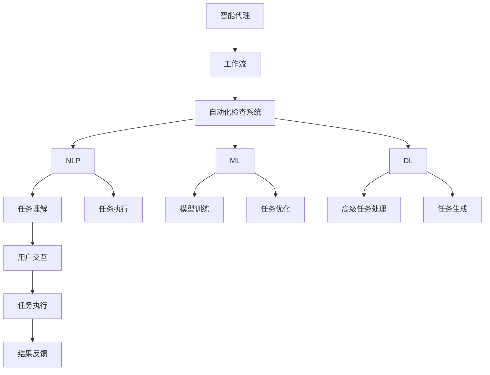

                 

# AI人工智能代理工作流AI Agent Workflow：智能代理在自动化检查系统中的应用

> 关键词：智能代理, 工作流, 自动化检查系统, 自然语言处理(NLP), 机器学习(ML), 深度学习(Deep Learning), 人机交互, 自动编程, 自动化测试

## 1. 背景介绍

### 1.1 问题由来

在当今的数字化时代，自动化和智能化已成为各行各业发展的核心驱动力。自动化检查系统作为一种提升效率、降低成本、减少人工错误的重要工具，在软件开发、测试、安全、质量控制等领域得到了广泛应用。然而，传统的手动脚本编写和自动化脚本维护，仍然面临诸多挑战：

- **脚本编写成本高**：编写自动化检查脚本需要高昂的人工成本，特别是对于复杂场景，脚本的编写和维护难度大、周期长。
- **脚本复用性差**：不同项目、不同环境下的检查脚本无法复用，导致开发和维护成本高。
- **脚本执行效率低**：手动编写和维护的脚本往往不够高效，执行效率低下，影响开发和测试进度。
- **脚本可维护性差**：复杂脚本的逻辑难以维护，代码质量和可读性差，后续修改和优化困难。

为解决这些问题，智能代理工作流（AI Agent Workflow）应运而生。智能代理能够自动生成、管理、执行自动化检查脚本，大大降低了人工编写和维护脚本的成本和复杂度，提高了脚本执行效率和可维护性。本文将深入探讨智能代理在自动化检查系统中的应用。

## 2. 核心概念与联系

### 2.1 核心概念概述

为更好地理解智能代理工作流，本节将介绍几个关键概念：

- **智能代理（AI Agent）**：指能够自动执行特定任务的人工智能系统。智能代理通常基于自然语言处理(NLP)、机器学习(ML)、深度学习(Deep Learning)等技术，具备任务理解和执行能力。

- **工作流（Workflow）**：指一组任务步骤的序列，通过自动化技术将任务步骤串联起来，形成一个连贯的执行流程。工作流可以是自动化的，也可以是半自动化的，即需要人工干预的。

- **自动化检查系统（Automated Check System）**：指通过脚本自动化执行一系列检查任务的系统。例如，代码检查、性能测试、安全漏洞检测、数据验证等。

- **自然语言处理（Natural Language Processing, NLP）**：指计算机处理、理解和生成人类语言的技术，通常用于智能代理的任务理解和执行。

- **机器学习（Machine Learning, ML）**：指通过数据训练模型，使计算机具备自主学习能力。机器学习常用于智能代理的模型训练和任务优化。

- **深度学习（Deep Learning, DL）**：指基于神经网络进行复杂任务处理的高级机器学习方法。深度学习在自然语言理解和生成等方面具有显著优势。

- **人机交互（Human-Computer Interaction, HCI）**：指人与计算机之间的交互方式，涉及输入、输出、感知等方面。智能代理通常需要与用户进行人机交互，理解用户需求并执行相应任务。

- **自动编程（Automated Programming）**：指自动生成代码、执行代码等技术，通常基于机器学习和自然语言处理技术。

- **自动化测试（Automated Testing）**：指通过脚本自动化执行测试用例，以验证软件功能和性能的技术。

- **自动化测试**：指通过脚本自动化执行测试用例，以验证软件功能和性能的技术。

这些核心概念之间的逻辑关系可以通过以下Mermaid流程图来展示：



这个流程图展示了他核心概念之间的逻辑关系：

1. 智能代理通过工作流将多个任务步骤串联起来，形成一个连贯的执行流程。
2. 自动化检查系统是智能代理的主要应用场景，通过执行一系列检查任务提升效率和质量。
3. NLP技术用于智能代理的任务理解和执行，使其能够理解用户需求。
4. ML和DL技术用于智能代理的模型训练和任务优化，提升任务执行效果。
5. 人机交互使智能代理能够与用户进行互动，执行任务。
6. 自动编程和自动化测试是智能代理的重要功能，通过自动生成和执行代码，实现任务自动化。

## 3. 核心算法原理 & 具体操作步骤
### 3.1 算法原理概述

智能代理工作流的核心算法原理，主要包括自然语言处理、任务生成、模型训练、任务执行等几个环节。智能代理通过理解和执行自然语言描述的任务，生成并执行自动化检查脚本，最终实现自动化检查任务。

### 3.2 算法步骤详解

智能代理工作流的具体操作步骤如下：

1. **任务理解**：通过自然语言处理技术，智能代理理解用户给出的任务描述，将其转化为结构化的任务定义。
2. **任务生成**：根据任务定义，智能代理自动生成对应的自动化检查脚本。
3. **模型训练**：在历史检查数据上训练模型，用于优化自动化检查脚本的执行效果。
4. **任务执行**：智能代理执行自动化检查脚本，对软件进行自动化检查，记录检查结果。
5. **结果反馈**：将检查结果反馈给用户，供用户进行决策或进一步优化任务。

### 3.3 算法优缺点

智能代理工作流的算法有以下优缺点：

**优点**：

- **高效自动化**：通过自动生成和执行检查脚本，大大降低了手动编写脚本的时间和成本。
- **可复用性强**：生成的检查脚本可重复用于不同场景，提高了脚本的复用性和可维护性。
- **执行效率高**：优化后的脚本执行效率更高，提高了开发和测试的速度。
- **灵活性高**：智能代理可以根据用户需求灵活调整任务和脚本，提高任务执行的适应性。

**缺点**：

- **依赖于数据**：智能代理的性能依赖于训练数据的质量，需要大量标注数据进行模型训练。
- **复杂度较高**：需要设计复杂的自然语言处理模型和任务生成算法，开发和维护难度较大。
- **依赖技术栈**：依赖于特定的技术栈和工具，对于新工具和新技术的适配需要一定的时间和成本。

### 3.4 算法应用领域

智能代理工作流在以下几个领域得到了广泛应用：

- **软件开发**：自动生成测试脚本、代码检查脚本、代码生成脚本等。
- **系统测试**：自动生成性能测试脚本、安全测试脚本、用户验收测试脚本等。
- **安全检查**：自动生成漏洞扫描脚本、渗透测试脚本、代码审计脚本等。
- **数据验证**：自动生成数据清洗脚本、数据验证脚本、数据生成脚本等。
- **自动化测试**：自动生成功能测试脚本、UI测试脚本、性能测试脚本等。

除了上述这些经典应用领域，智能代理工作流还在更多场景中得到了创新性地应用，如任务调度、流程自动化、多任务协调等，为软件开发、测试、运维等领域带来了新的突破。

## 4. 数学模型和公式 & 详细讲解 & 举例说明
### 4.1 数学模型构建

智能代理工作流的数学模型主要涉及自然语言处理、机器学习和深度学习等领域的知识。以下将通过具体案例，详细讲解智能代理的数学模型构建。

### 4.2 公式推导过程

假设智能代理需要执行以下任务：自动生成一个代码检查脚本，检查代码中是否存在未使用的变量。

**步骤一：任务理解**

智能代理首先需要理解任务描述，将其转化为结构化的任务定义。任务定义可以表示为：

$$
Task=\{Action:代码检查, Condition:未使用的变量, Input:代码文件\}
$$

**步骤二：任务生成**

根据任务定义，智能代理自动生成对应的自动化检查脚本。假设生成的检查脚本为：

$$
CheckScript=\{Find unused variables\}
$$

**步骤三：模型训练**

智能代理在历史代码数据上训练模型，用于优化自动化检查脚本的执行效果。假设训练数据为：

$$
\{Code1, CheckResult1; Code2, CheckResult2; \ldots\}
$$

训练模型的目标是最小化预测结果与真实结果之间的差异，即：

$$
\min_{\theta} \sum_{i} \| \text{PredictedResult}_i - \text{ActualResult}_i \|^2
$$

其中 $\theta$ 为模型参数，$\text{PredictedResult}_i$ 为模型对第 $i$ 个样本的预测结果，$\text{ActualResult}_i$ 为第 $i$ 个样本的真实结果。

**步骤四：任务执行**

智能代理执行自动化检查脚本，对代码进行检查。假设检查结果为：

$$
CheckResult=\{True, False, \ldots\}
$$

**步骤五：结果反馈**

智能代理将检查结果反馈给用户，供用户进行决策或进一步优化任务。

### 4.3 案例分析与讲解

通过上述案例，我们可以看到智能代理工作流的数学模型构建过程。智能代理首先通过自然语言处理技术理解任务描述，然后自动生成对应的自动化检查脚本，并在历史数据上训练模型以优化执行效果。最后，智能代理执行自动化检查脚本，将检查结果反馈给用户。

在实际应用中，智能代理还可以进一步结合深度学习技术，提升任务理解和执行的精度和效率。例如，在任务生成过程中，可以使用基于Transformer的生成模型生成高质量的自动化检查脚本，在模型训练过程中，可以使用深度学习技术对任务描述进行分类和聚类，提升模型训练的效果。

## 5. 项目实践：代码实例和详细解释说明
### 5.1 开发环境搭建

在进行智能代理工作流的项目实践前，我们需要准备好开发环境。以下是使用Python进行PyTorch开发的环境配置流程：

1. 安装Anaconda：从官网下载并安装Anaconda，用于创建独立的Python环境。

2. 创建并激活虚拟环境：
```bash
conda create -n agent-env python=3.8 
conda activate agent-env
```

3. 安装PyTorch：根据CUDA版本，从官网获取对应的安装命令。例如：
```bash
conda install pytorch torchvision torchaudio cudatoolkit=11.1 -c pytorch -c conda-forge
```

4. 安装TensorFlow：
```bash
conda install tensorflow -c conda-forge
```

5. 安装各类工具包：
```bash
pip install numpy pandas scikit-learn matplotlib tqdm jupyter notebook ipython
```

完成上述步骤后，即可在`agent-env`环境中开始智能代理工作流的实践。

### 5.2 源代码详细实现

下面我们以智能代理执行代码检查任务为例，给出使用PyTorch进行智能代理开发的PyTorch代码实现。

首先，定义智能代理的任务处理函数：

```python
import torch

def task_processing(task_desc):
    task = parse_task(task_desc)
    return task

def parse_task(task_desc):
    # 解析任务描述，生成任务定义
    pass
```

然后，定义智能代理的任务生成函数：

```python
def task_generation(task):
    check_script = generate_check_script(task)
    return check_script

def generate_check_script(task):
    # 根据任务定义，生成对应的自动化检查脚本
    pass
```

接着，定义智能代理的模型训练函数：

```python
def model_training(check_script, data):
    model = build_model()
    loss_function = build_loss_function()
    
    for i, (code, check_result) in enumerate(data):
        # 训练模型
        pass
        
    return model, loss_function
```

最后，定义智能代理的任务执行函数：

```python
def task_execution(check_script, code):
    check_result = execute_check_script(check_script, code)
    return check_result

def execute_check_script(check_script, code):
    # 执行自动化检查脚本，对代码进行检查
    pass
```

完整代码实现如下：

```python
import torch

def task_processing(task_desc):
    task = parse_task(task_desc)
    return task

def parse_task(task_desc):
    # 解析任务描述，生成任务定义
    pass

def task_generation(task):
    check_script = generate_check_script(task)
    return check_script

def generate_check_script(task):
    # 根据任务定义，生成对应的自动化检查脚本
    pass

def model_training(check_script, data):
    model = build_model()
    loss_function = build_loss_function()
    
    for i, (code, check_result) in enumerate(data):
        # 训练模型
        pass
        
    return model, loss_function

def model_building():
    # 构建模型
    pass

def build_loss_function():
    # 构建损失函数
    pass

def task_execution(check_script, code):
    check_result = execute_check_script(check_script, code)
    return check_result

def execute_check_script(check_script, code):
    # 执行自动化检查脚本，对代码进行检查
    pass
```

以上代码实现展示了智能代理工作流的完整流程，包括任务理解、任务生成、模型训练、任务执行等关键步骤。在实际应用中，还需要根据具体任务的需求，进一步优化和扩展代码实现。

### 5.3 代码解读与分析

让我们再详细解读一下关键代码的实现细节：

**task_processing函数**：
- `task_desc`参数：用户给出的任务描述。
- `parse_task`方法：解析任务描述，生成任务定义。

**task_generation函数**：
- `task`参数：任务定义。
- `generate_check_script`方法：根据任务定义，自动生成对应的自动化检查脚本。

**model_training函数**：
- `check_script`参数：自动化检查脚本。
- `data`参数：历史代码数据。
- `build_model`方法：构建模型。
- `build_loss_function`方法：构建损失函数。
- 在每个样本上，前向传播计算损失函数，反向传播更新模型参数。

**task_execution函数**：
- `check_script`参数：自动化检查脚本。
- `code`参数：待检查的代码。
- `execute_check_script`方法：执行自动化检查脚本，对代码进行检查。

在实际应用中，智能代理的代码实现还需要考虑更多因素，如模型的评估指标、模型的优化策略、模型的存储和检索等。但核心的工作流程基本与此类似。

## 6. 实际应用场景
### 6.1 软件开发

智能代理在软件开发中的应用场景非常广泛，可以用于代码生成、代码检查、代码审计、代码重构等任务。通过智能代理，开发者可以自动生成高质量的代码，减少手动编写代码的工作量，提高开发效率。

在实际应用中，智能代理可以根据用户给出的任务描述，自动生成对应的代码。例如，用户描述需要生成一个简单的Python函数，智能代理可以自动生成函数定义和代码实现。用户还可以要求代码检查，智能代理会自动检查代码中是否存在语法错误、编码规范等问题，并给出相应的提示和建议。

### 6.2 系统测试

智能代理在系统测试中的应用也非常重要。通过智能代理，测试人员可以自动生成测试脚本，对系统进行功能测试、性能测试、安全测试等。智能代理可以根据用户给出的任务描述，自动生成对应的测试脚本，并执行测试用例，生成测试报告。

在实际应用中，智能代理可以根据用户给出的任务描述，自动生成对应的测试脚本。例如，用户描述需要测试系统的登录功能，智能代理可以自动生成登录测试脚本，执行登录测试用例，并记录测试结果。智能代理还可以生成性能测试脚本和安全测试脚本，执行测试用例，生成测试报告。

### 6.3 安全检查

智能代理在安全检查中的应用也非常重要。通过智能代理，安全人员可以自动生成漏洞扫描脚本、渗透测试脚本等，对系统进行安全检查，发现潜在的安全漏洞。智能代理可以根据用户给出的任务描述，自动生成对应的安全检查脚本，并执行安全检查任务，生成安全报告。

在实际应用中，智能代理可以根据用户给出的任务描述，自动生成对应的安全检查脚本。例如，用户描述需要检查系统是否存在SQL注入漏洞，智能代理可以自动生成SQL注入漏洞扫描脚本，执行漏洞扫描任务，并生成漏洞报告。智能代理还可以生成渗透测试脚本，执行渗透测试任务，生成安全报告。

### 6.4 未来应用展望

随着智能代理工作流的不断发展和完善，其在更多领域的应用前景将更加广阔。

在智慧医疗领域，智能代理可以用于病历分析、药物研发等任务。通过智能代理，医生可以自动生成病历报告，加快诊断和治疗速度。智能代理还可以生成药物研发方案，指导药物的研发和测试。

在智能教育领域，智能代理可以用于作业批改、学情分析、知识推荐等任务。通过智能代理，教师可以自动批改作业，快速获得学生的学习情况和知识掌握情况。智能代理还可以生成个性化的学习计划，推荐适合的学习资源。

在智慧城市治理中，智能代理可以用于城市事件监测、舆情分析、应急指挥等任务。通过智能代理，城市管理者可以自动监测城市事件，及时响应突发事件。智能代理还可以生成应急响应方案，指导应急指挥工作。

除了上述这些经典应用领域，智能代理工作流还在更多场景中得到了创新性地应用，如自动化编程、多任务协同等，为各行各业带来了新的突破。

## 7. 工具和资源推荐
### 7.1 学习资源推荐

为了帮助开发者系统掌握智能代理工作流，这里推荐一些优质的学习资源：

1. 《自然语言处理综论》：全面介绍了自然语言处理的基本概念和技术，适合初学者和进阶者阅读。

2. 《深度学习》：由Ian Goodfellow等撰写的经典深度学习教材，详细介绍了深度学习的基本概念和算法，适合深度学习领域的学习者阅读。

3. 《Python深度学习》：由Francois Chollet等撰写的深度学习入门教材，基于Keras框架，适合初学者和中级学习者阅读。

4. 《Python机器学习基础教程》：由Andreas C. Müller等撰写的Python机器学习入门教材，适合初学者和中级学习者阅读。

5. 《TensorFlow实战》：由张海春撰写的TensorFlow实战教材，详细介绍了TensorFlow的使用方法和最佳实践，适合TensorFlow领域的学习者阅读。

6. 《PyTorch深度学习入门》：由张昊撰写，全面介绍了PyTorch的使用方法和最佳实践，适合PyTorch领域的学习者阅读。

通过这些资源的学习实践，相信你一定能够快速掌握智能代理工作流的精髓，并用于解决实际的开发、测试、运维等任务。

### 7.2 开发工具推荐

高效的开发离不开优秀的工具支持。以下是几款用于智能代理工作流开发的常用工具：

1. PyTorch：基于Python的开源深度学习框架，灵活动态的计算图，适合快速迭代研究。

2. TensorFlow：由Google主导开发的开源深度学习框架，生产部署方便，适合大规模工程应用。

3. Weights & Biases：模型训练的实验跟踪工具，可以记录和可视化模型训练过程中的各项指标，方便对比和调优。

4. Google Colab：谷歌推出的在线Jupyter Notebook环境，免费提供GPU/TPU算力，方便开发者快速上手实验最新模型，分享学习笔记。

5. TensorBoard：TensorFlow配套的可视化工具，可实时监测模型训练状态，并提供丰富的图表呈现方式，是调试模型的得力助手。

6. PyCharm：由JetBrains开发的Python开发工具，功能强大、界面友好，适合Python开发和学习。

合理利用这些工具，可以显著提升智能代理工作流开发的效率，加快创新迭代的步伐。

### 7.3 相关论文推荐

智能代理工作流的研究源于学界的持续研究。以下是几篇奠基性的相关论文，推荐阅读：

1. Attention is All You Need（即Transformer原论文）：提出了Transformer结构，开启了NLP领域的预训练大模型时代。

2. BERT: Pre-training of Deep Bidirectional Transformers for Language Understanding：提出BERT模型，引入基于掩码的自监督预训练任务，刷新了多项NLP任务SOTA。

3. Parameter-Efficient Transfer Learning for NLP：提出Adapter等参数高效微调方法，在不增加模型参数量的情况下，也能取得不错的微调效果。

4. Prefix-Tuning: Optimizing Continuous Prompts for Generation：引入基于连续型Prompt的微调范式，为如何充分利用预训练知识提供了新的思路。

5. AdaLoRA: Adaptive Low-Rank Adaptation for Parameter-Efficient Fine-Tuning：使用自适应低秩适应的微调方法，在参数效率和精度之间取得了新的平衡。

这些论文代表了大语言模型微调技术的发展脉络。通过学习这些前沿成果，可以帮助研究者把握学科前进方向，激发更多的创新灵感。

## 8. 总结：未来发展趋势与挑战

### 8.1 总结

本文对智能代理工作流进行了全面系统的介绍。首先阐述了智能代理工作流的背景和意义，明确了智能代理在自动化检查系统中的重要价值。其次，从原理到实践，详细讲解了智能代理的数学模型和关键步骤，给出了智能代理开发的完整代码实例。同时，本文还广泛探讨了智能代理工作流在软件开发、系统测试、安全检查等多个领域的应用前景，展示了智能代理工作流的巨大潜力。

通过本文的系统梳理，可以看到，智能代理工作流作为一种自动化技术，正在成为软件开发、测试、运维等领域的重要手段，极大地提高了工作效率和质量。未来，伴随智能代理工作流的发展和优化，必将带来更多智能化、自动化的解决方案，进一步推动人工智能技术在各行各业的应用。

### 8.2 未来发展趋势

展望未来，智能代理工作流将呈现以下几个发展趋势：

1. **智能化程度提升**：未来的智能代理将具备更强的任务理解和执行能力，能够更好地理解和执行复杂的自然语言任务，提高任务执行的智能化水平。

2. **模型优化改进**：智能代理的性能将依赖于更好的模型优化和训练方法，如基于深度学习的生成模型、基于强化学习的任务优化方法等，提升任务执行的效率和效果。

3. **多模态融合**：未来的智能代理将融合多模态数据，如文本、图像、语音等，提升任务理解和执行的全面性和准确性。

4. **实时性增强**：智能代理的执行过程将更加实时化，能够快速响应用户的请求，提供即时反馈和结果。

5. **泛用性增强**：智能代理将具备更强的泛用性，能够适应更多领域、更多类型的任务，提高其应用的广泛性和灵活性。

6. **自动化程度提高**：智能代理的自动化程度将更高，能够自动生成、执行、优化、反馈整个任务流程，提高任务执行的自动化水平。

以上趋势凸显了智能代理工作流的发展潜力，未来有望成为人工智能技术落地应用的重要范式。这些方向的探索发展，必将进一步提升智能代理的性能和应用范围，为各行各业带来新的变革。

### 8.3 面临的挑战

尽管智能代理工作流已经取得了一定的成就，但在迈向更加智能化、自动化、实时化的应用过程中，仍然面临诸多挑战：

1. **依赖数据质量**：智能代理的性能依赖于训练数据的质量，需要大量高质量的数据进行模型训练，获取高质量数据是智能代理发展的重要瓶颈。

2. **模型复杂度**：智能代理的模型通常较为复杂，需要处理大量的自然语言数据和任务数据，模型训练和优化难度大。

3. **实时性要求高**：智能代理需要实时响应用户请求，对计算资源和算法的要求较高，需要进一步优化算力和算法。

4. **可解释性不足**：智能代理的内部机制复杂，模型的决策过程缺乏可解释性，难以进行调试和优化。

5. **多模态数据融合**：智能代理需要融合多模态数据，如文本、图像、语音等，如何高效融合多模态数据，提升任务执行的全面性和准确性，还需要进一步探索。

6. **跨领域应用难度大**：智能代理在特定领域的应用，如医疗、法律等，往往需要结合领域知识进行优化，难度较大。

7. **伦理道德问题**：智能代理需要考虑伦理道德问题，避免输出有害信息，保护用户隐私和数据安全。

正视智能代理工作流面临的这些挑战，积极应对并寻求突破，将使智能代理工作流迈向更加成熟和实用。相信随着学界和产业界的共同努力，这些挑战终将一一被克服，智能代理工作流必将在构建智能自动化系统中发挥更大的作用。

### 8.4 研究展望

面向未来，智能代理工作流需要在以下几个方面进行进一步研究：

1. **跨领域智能代理**：开发能够适应不同领域、不同任务类型的智能代理，提升智能代理的泛用性和适应性。

2. **实时智能代理**：开发实时响应用户请求的智能代理，提高智能代理的实时性和交互性。

3. **多模态智能代理**：开发能够融合多模态数据的智能代理，提升任务执行的全面性和准确性。

4. **智能代理的伦理道德**：研究智能代理的伦理道德问题，确保智能代理的输出符合人类价值观和伦理道德。

5. **智能代理的可解释性**：研究智能代理的可解释性，提升模型的透明性和可解释性，便于调试和优化。

6. **智能代理的自动化优化**：研究智能代理的自动化优化方法，提升智能代理的任务执行效率和效果。

这些研究方向将推动智能代理工作流的发展，带来更加智能化、自动化的解决方案，提升人工智能技术的应用效果和价值。面向未来，智能代理工作流将在更多的领域和场景中发挥作用，为各行各业带来新的变革和突破。

## 9. 附录：常见问题与解答

**Q1：智能代理工作流是否适用于所有自动化任务？**

A: 智能代理工作流在大多数自动化任务上都能取得不错的效果，特别是对于数据量较大的任务。但对于一些需要高度人工干预的任务，如复杂的交互式任务，智能代理的效率可能无法达到预期。此外，对于一些特定领域的任务，如医疗、法律等，智能代理需要结合领域知识进行优化，难度较大。

**Q2：如何选择合适的智能代理工作流工具？**

A: 选择合适的智能代理工作流工具需要考虑任务类型、数据规模、技术栈等因素。常用的智能代理工作流工具包括PyTorch、TensorFlow、Weights & Biases等，可以根据项目需求进行选择。例如，PyTorch和TensorFlow适用于深度学习任务，Weights & Biases适用于模型训练跟踪。

**Q3：智能代理工作流的开发难度大吗？**

A: 智能代理工作流的开发难度较大，需要设计复杂的自然语言处理模型和任务生成算法。通常需要熟悉自然语言处理、深度学习、计算机视觉等技术，并具备一定的算法设计和实现能力。建议从简单的任务开始，逐步积累经验，提高开发水平。

**Q4：智能代理工作流的优势是什么？**

A: 智能代理工作流的优势包括：

- **高效自动化**：通过自动生成和执行任务脚本，大大降低了手动编写脚本的时间和成本。
- **可复用性强**：生成的任务脚本可重复用于不同场景，提高了脚本的复用性和可维护性。
- **执行效率高**：优化后的任务脚本执行效率更高，提高了开发和测试的速度。
- **灵活性高**：智能代理可以根据用户需求灵活调整任务和脚本，提高任务执行的适应性。

**Q5：智能代理工作流的局限性是什么？**

A: 智能代理工作流的局限性包括：

- **依赖于数据**：智能代理的性能依赖于训练数据的质量，需要大量高质量的数据进行模型训练。
- **复杂度较高**：需要设计复杂的自然语言处理模型和任务生成算法，开发和维护难度较大。
- **依赖技术栈**：依赖于特定的技术栈和工具，对于新工具和新技术的适配需要一定的时间和成本。

这些问题是智能代理工作流在实际应用中需要面对的挑战，需要结合具体任务进行优化和改进。

