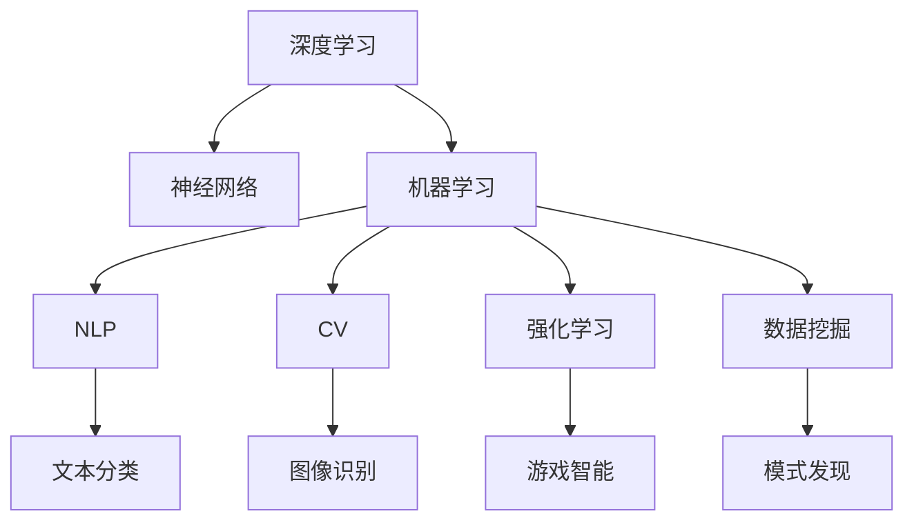

                 

# AI人工智能核心算法原理与代码实例讲解：智能系统

> 关键词：人工智能,智能系统,算法原理,核心算法,代码实例,深度学习,机器学习,自然语言处理(NLP),计算机视觉(CV),强化学习,数据挖掘,应用场景

## 1. 背景介绍

### 1.1 问题由来
随着计算机科学的发展，人工智能（AI）已经成为现代科技的重要组成部分，极大地推动了各行各业的智能化进程。从自动驾驶汽车、智能家居、机器人，到语音识别、图像识别、自然语言处理等，AI技术已经渗透到我们生活的方方面面。这些智能系统的核心，在于其背后的算法和架构，即AI算法原理。

### 1.2 问题核心关键点
AI算法原理主要涉及深度学习、机器学习、自然语言处理、计算机视觉和强化学习等多个领域。这些算法通过将数据转化为模型参数，进而进行模式识别和预测。AI算法原理的核心是数据的处理和模型的训练，其中涉及到数据的特征提取、模型结构的设计、训练方法的优化等多个环节。这些核心关键点，使得AI算法原理在实际应用中具有广泛的适用性和强大的能力。

## 2. 核心概念与联系

### 2.1 核心概念概述

为更好地理解AI核心算法原理，本节将介绍几个密切相关的核心概念：

- 深度学习（Deep Learning）：一种基于神经网络的机器学习技术，通过多层次的非线性变换来提取数据的复杂特征。
- 神经网络（Neural Network）：由多层神经元组成，通过前向传播和反向传播进行模型训练和预测。
- 机器学习（Machine Learning）：一种通过算法让计算机系统从数据中学习，从而进行预测和决策的技术。
- 自然语言处理（Natural Language Processing, NLP）：涉及文本处理、语音识别、情感分析等，是AI的重要应用方向。
- 计算机视觉（Computer Vision, CV）：涉及图像识别、物体检测、场景理解等，是AI的另一个重要应用方向。
- 强化学习（Reinforcement Learning）：通过奖励和惩罚机制，让机器在不断尝试中学习最优策略。
- 数据挖掘（Data Mining）：从大规模数据中发现潜在的模式和知识。

这些核心概念之间的逻辑关系可以通过以下Mermaid流程图来展示：



这个流程图展示了大AI核心算法原理的各个组成部分及其之间的关系：

1. 深度学习作为核心，通过神经网络构建复杂模型。
2. 机器学习是深度学习和强化学习的基础。
3. NLP和CV是深度学习在文本和图像处理上的具体应用。
4. 强化学习是让机器自主学习策略的高级形式。
5. 数据挖掘是发现数据潜在模式和知识的重要手段。

这些核心概念共同构成了AI核心算法原理的理论基础，使得AI技术能够广泛应用于各种场景。

## 3. 核心算法原理 & 具体操作步骤
### 3.1 算法原理概述

AI核心算法原理的本质是通过数据学习模型，从而进行预测和决策。其核心在于数据的特征提取和模型的训练。

以深度学习为例，算法原理包括以下几个步骤：

1. 数据准备：将原始数据转换为模型可以处理的格式，如将文本数据转化为词向量，将图像数据转化为像素矩阵等。
2. 模型构建：根据具体任务设计神经网络结构，如卷积神经网络(CNN)用于图像处理，循环神经网络(RNN)用于序列数据处理。
3. 模型训练：使用训练数据集，通过前向传播和反向传播算法，优化模型参数。
4. 模型评估：使用测试数据集，评估模型性能。
5. 模型应用：将训练好的模型应用于实际问题中，进行预测和决策。

### 3.2 算法步骤详解

以下以深度学习为例，详细介绍深度学习算法的主要步骤：

**Step 1: 数据准备**

1. 数据收集：从不同渠道获取数据，如文本、图像、视频等。
2. 数据清洗：去除数据中的噪声和错误，确保数据质量。
3. 数据预处理：将原始数据转换为模型可以处理的格式，如文本分词、图像归一化等。
4. 数据划分：将数据划分为训练集、验证集和测试集，以便于模型训练和评估。

**Step 2: 模型构建**

1. 选择模型：根据具体任务选择合适的深度学习模型，如卷积神经网络(CNN)用于图像处理，循环神经网络(RNN)用于序列数据处理。
2. 设计网络结构：根据模型类型，设计相应的网络结构，如卷积层、池化层、全连接层等。
3. 定义损失函数：根据具体任务，选择适当的损失函数，如交叉熵、均方误差等。
4. 定义优化器：选择适当的优化算法，如随机梯度下降(SGD)、Adam等，并设置学习率、批大小等参数。

**Step 3: 模型训练**

1. 训练过程：在训练集上，进行多次迭代，每次迭代包含前向传播和反向传播两个阶段。
2. 前向传播：将输入数据通过网络，得到预测结果。
3. 损失计算：将预测结果与真实结果进行比较，计算损失。
4. 反向传播：将损失通过链式法则，反向传播到每一层，更新模型参数。
5. 参数更新：根据优化器，更新模型参数，使损失最小化。

**Step 4: 模型评估**

1. 验证过程：在验证集上，进行多次迭代，计算模型在验证集上的性能。
2. 性能指标：计算模型的精度、召回率、F1分数等指标，评估模型性能。
3. 参数调整：根据验证集上的性能，调整模型的超参数，如学习率、批大小等。

**Step 5: 模型应用**

1. 模型部署：将训练好的模型部署到实际应用中，如服务器、移动设备等。
2. 预测过程：将新的数据输入模型，得到预测结果。
3. 模型监控：实时监控模型的性能，确保模型稳定运行。

### 3.3 算法优缺点

深度学习算法具有以下优点：

1. 模型能力强：深度学习模型可以学习到复杂特征，适应各种复杂场景。
2. 精度高：深度学习模型在图像识别、语音识别、自然语言处理等任务上，精度表现优异。
3. 自动化程度高：深度学习模型可以自动学习特征，减少人工干预。

然而，深度学习算法也存在以下缺点：

1. 数据需求大：深度学习模型需要大量的标注数据进行训练，数据收集和标注成本较高。
2. 模型复杂度高：深度学习模型结构复杂，训练和推理速度较慢。
3. 可解释性差：深度学习模型通常是黑盒模型，难以解释其内部工作机制。
4. 泛化能力有限：深度学习模型容易出现过拟合现象，泛化能力较差。

### 3.4 算法应用领域

深度学习算法已经在多个领域得到了广泛应用，例如：

- 图像识别：如人脸识别、物体检测、图像分类等。
- 自然语言处理：如机器翻译、情感分析、语音识别等。
- 语音识别：如自动语音识别、语音合成等。
- 强化学习：如游戏智能、机器人控制等。
- 数据挖掘：如模式发现、异常检测等。
- 计算机视觉：如视频分析、目标跟踪等。

除了上述这些经典应用外，深度学习算法还被创新性地应用到更多场景中，如医疗影像分析、智能推荐系统、自动化驾驶等，为各行业带来了新的突破。

## 4. 数学模型和公式 & 详细讲解 & 举例说明

### 4.1 数学模型构建

深度学习模型的数学模型主要由以下几个部分组成：

1. 输入层：将原始数据转换为模型可以处理的格式。
2. 隐藏层：通过非线性变换，提取数据特征。
3. 输出层：根据任务类型，输出预测结果。

以一个简单的线性回归模型为例，其数学模型可以表示为：

$$
y = \theta^T x + b
$$

其中，$y$ 为输出，$x$ 为输入向量，$\theta$ 为模型参数，$b$ 为偏置项。

### 4.2 公式推导过程

以一个简单的多层感知器（MLP）为例，其数学模型可以表示为：

$$
y = \sigma(W_l x_l + b_l)
$$

其中，$x_l$ 为第$l$层的输入向量，$W_l$ 和 $b_l$ 分别为第$l$层的权重和偏置项，$\sigma$ 为激活函数。

假设共有$n$层神经网络，则前向传播过程可以表示为：

$$
x_{l+1} = \sigma(W_l x_l + b_l), \quad l=1,\dots,n
$$

最终输出结果为：

$$
y = \sigma(W_n x_n + b_n)
$$

在训练过程中，通过反向传播算法，计算损失函数对各参数的梯度，并使用优化算法进行参数更新。具体步骤如下：

1. 前向传播：计算输入数据通过各层神经网络的输出。
2. 计算损失：将输出结果与真实结果进行比较，计算损失。
3. 反向传播：将损失通过链式法则，反向传播到每一层，计算梯度。
4. 参数更新：根据优化算法，更新模型参数。

### 4.3 案例分析与讲解

以一个简单的图像分类任务为例，展示深度学习算法的应用。

**Step 1: 数据准备**

1. 数据收集：从ImageNet等公开数据集收集图像数据，并进行标注。
2. 数据清洗：去除噪声和错误数据，确保数据质量。
3. 数据预处理：对图像进行归一化、缩放等处理，转换为模型可以处理的格式。
4. 数据划分：将数据划分为训练集、验证集和测试集。

**Step 2: 模型构建**

1. 选择模型：选择卷积神经网络（CNN）作为图像分类的模型。
2. 设计网络结构：设计包含卷积层、池化层、全连接层等的多层网络结构。
3. 定义损失函数：选择交叉熵损失函数，用于衡量分类精度。
4. 定义优化器：选择Adam优化算法，并设置学习率为0.001。

**Step 3: 模型训练**

1. 训练过程：在训练集上，进行多次迭代，每次迭代包含前向传播和反向传播两个阶段。
2. 前向传播：将输入图像通过网络，得到预测结果。
3. 损失计算：将预测结果与真实结果进行比较，计算交叉熵损失。
4. 反向传播：将损失通过链式法则，反向传播到每一层，更新模型参数。
5. 参数更新：根据Adam优化算法，更新模型参数，使损失最小化。

**Step 4: 模型评估**

1. 验证过程：在验证集上，进行多次迭代，计算模型在验证集上的精度、召回率等指标。
2. 性能指标：计算模型的精度、召回率、F1分数等指标，评估模型性能。
3. 参数调整：根据验证集上的性能，调整模型的超参数，如学习率、批大小等。

**Step 5: 模型应用**

1. 模型部署：将训练好的模型部署到服务器上，进行推理预测。
2. 预测过程：将新的图像输入模型，得到预测结果。
3. 模型监控：实时监控模型的性能，确保模型稳定运行。

## 5. 项目实践：代码实例和详细解释说明

### 5.1 开发环境搭建

在进行深度学习算法实践前，我们需要准备好开发环境。以下是使用Python进行TensorFlow和PyTorch开发的環境配置流程：

1. 安装Anaconda：从官网下载并安装Anaconda，用于创建独立的Python环境。

2. 创建并激活虚拟环境：
```bash
conda create -n tf-env python=3.8
conda activate tf-env
```

3. 安装TensorFlow：根据CUDA版本，从官网获取对应的安装命令。例如：
```bash
conda install tensorflow -c tf -c conda-forge
```

4. 安装PyTorch：从官网下载并安装PyTorch，适用于Python 3.8及以上版本。
```bash
pip install torch torchvision torchaudio
```

5. 安装各类工具包：
```bash
pip install numpy pandas scikit-learn matplotlib tqdm jupyter notebook ipython
```

完成上述步骤后，即可在`tf-env`环境中开始深度学习算法的实践。

### 5.2 源代码详细实现

下面我们以图像分类任务为例，给出使用TensorFlow进行卷积神经网络（CNN）的深度学习算法开发的PyTorch代码实现。

首先，定义CNN模型的结构：

```python
import torch
import torch.nn as nn

class CNN(nn.Module):
    def __init__(self):
        super(CNN, self).__init__()
        self.conv1 = nn.Conv2d(3, 16, 3, padding=1)
        self.conv2 = nn.Conv2d(16, 32, 3, padding=1)
        self.pool = nn.MaxPool2d(2, 2)
        self.fc1 = nn.Linear(32*8*8, 512)
        self.fc2 = nn.Linear(512, 10)

    def forward(self, x):
        x = self.conv1(x)
        x = nn.functional.relu(x)
        x = self.pool(x)
        x = self.conv2(x)
        x = nn.functional.relu(x)
        x = self.pool(x)
        x = x.view(-1, 32*8*8)
        x = self.fc1(x)
        x = nn.functional.relu(x)
        x = self.fc2(x)
        return x
```

然后，定义数据集和数据加载器：

```python
from torch.utils.data import DataLoader
from torchvision.datasets import CIFAR10
from torchvision.transforms import ToTensor

train_dataset = CIFAR10(root='./data', train=True, download=True, transform=ToTensor())
train_loader = DataLoader(train_dataset, batch_size=64, shuffle=True)
test_dataset = CIFAR10(root='./data', train=False, download=True, transform=ToTensor())
test_loader = DataLoader(test_dataset, batch_size=64, shuffle=False)
```

接着，定义模型和损失函数：

```python
from torch.optim import Adam

model = CNN()
criterion = nn.CrossEntropyLoss()
optimizer = Adam(model.parameters(), lr=0.001)
```

最后，启动训练流程并在测试集上评估：

```python
epochs = 10
for epoch in range(epochs):
    model.train()
    for data, target in train_loader:
        optimizer.zero_grad()
        output = model(data)
        loss = criterion(output, target)
        loss.backward()
        optimizer.step()
    model.eval()
    with torch.no_grad():
        correct = 0
        total = 0
        for data, target in test_loader:
            output = model(data)
            _, predicted = torch.max(output.data, 1)
            total += target.size(0)
            correct += (predicted == target).sum().item()
        print(f'Epoch {epoch+1}, Loss: {loss:.4f}, Accuracy: {100 * correct / total:.2f}%')
```

以上就是使用TensorFlow进行CNN图像分类任务的深度学习算法开发的完整代码实现。可以看到，利用TensorFlow和PyTorch库，深度学习算法的实现变得相对简洁高效。

### 5.3 代码解读与分析

让我们再详细解读一下关键代码的实现细节：

**CNN类**：
- `__init__`方法：初始化卷积层、池化层和全连接层等组件。
- `forward`方法：定义前向传播过程，将输入数据通过网络，得到预测结果。

**数据集和数据加载器**：
- 定义CIFAR-10数据集，并进行归一化、缩放等处理。
- 使用DataLoader将数据集划分为批处理，方便模型训练。

**模型和损失函数**：
- 定义CNN模型结构，包含卷积层、池化层和全连接层。
- 选择交叉熵损失函数，用于衡量分类精度。
- 定义Adam优化器，并设置学习率。

**训练流程**：
- 定义总的epoch数，循环迭代
- 每个epoch内，在训练集上训练，输出损失和准确率
- 在测试集上评估，输出最终结果

可以看到，TensorFlow和PyTorch库使得深度学习算法的实现变得相对简单，开发者可以将更多精力放在模型改进和算法优化上，而不必过多关注底层的实现细节。

当然，工业级的系统实现还需考虑更多因素，如模型的保存和部署、超参数的自动搜索、更灵活的任务适配层等。但核心的深度学习算法基本与此类似。

## 6. 实际应用场景
### 6.1 智能推荐系统

深度学习算法在智能推荐系统中具有广泛的应用。传统的推荐系统往往只依赖用户的历史行为数据进行物品推荐，难以充分挖掘用户兴趣和需求。通过深度学习算法，推荐系统能够从文本、图像、视频等多种数据源中学习用户兴趣，提供更加个性化和多样化的推荐结果。

在具体实现中，可以收集用户浏览、点击、评论、分享等行为数据，提取和用户交互的物品标题、描述、标签等文本内容。将文本内容作为模型输入，用户的后续行为作为监督信号，在此基础上微调预训练语言模型。微调后的模型能够从文本内容中准确把握用户的兴趣点。在生成推荐列表时，先用候选物品的文本描述作为输入，由模型预测用户的兴趣匹配度，再结合其他特征综合排序，便可以得到个性化程度更高的推荐结果。

### 6.2 医疗影像分析

深度学习算法在医疗影像分析中也有广泛应用。通过深度学习算法，可以训练模型自动识别医学影像中的病变区域，辅助医生进行诊断。例如，在乳腺癌影像分析中，可以训练模型自动识别乳腺癌病灶，并提供自动报告，提高医生的诊断效率和准确性。

在具体实现中，可以收集大量的医学影像数据，并进行标注。将标注好的数据集划分为训练集、验证集和测试集，在训练集上训练深度学习模型。训练后的模型可以实时处理新的医学影像数据，自动识别病变区域，并输出诊断报告。

### 6.3 自然语言处理

深度学习算法在自然语言处理中也有广泛应用。通过深度学习算法，可以训练模型进行文本分类、情感分析、机器翻译等任务。例如，在机器翻译中，可以训练模型将源语言文本翻译为目标语言文本，提高翻译质量和效率。

在具体实现中，可以收集大量的文本数据，并进行标注。将标注好的数据集划分为训练集、验证集和测试集，在训练集上训练深度学习模型。训练后的模型可以实时处理新的文本数据，进行翻译、分类等任务。

### 6.4 未来应用展望

随着深度学习算法的不断发展，其应用场景将进一步扩展。未来，深度学习算法有望在更多的领域得到应用，为各行业带来新的突破。例如：

- 智能制造：通过深度学习算法，可以训练模型进行质量检测、设备故障预测等任务，提高生产效率和产品质量。
- 金融分析：通过深度学习算法，可以训练模型进行股票预测、信用评分等任务，提高金融决策的准确性和效率。
- 农业生产：通过深度学习算法，可以训练模型进行作物病害预测、土壤质量分析等任务，提高农业生产效率和可持续发展能力。
- 环境保护：通过深度学习算法，可以训练模型进行气候变化预测、环境污染监测等任务，为环境保护提供支持。

## 7. 工具和资源推荐
### 7.1 学习资源推荐

为了帮助开发者系统掌握深度学习算法的理论基础和实践技巧，这里推荐一些优质的学习资源：

1. 《深度学习》书籍：Ian Goodfellow等著，详细介绍了深度学习的基本概念和算法。
2. Coursera《深度学习专项课程》：Andrew Ng等主讲，系统讲解了深度学习的基本原理和实践。
3. TensorFlow官方文档：详细介绍了TensorFlow的使用方法和算法原理。
4. PyTorch官方文档：详细介绍了PyTorch的使用方法和算法原理。
5. Kaggle竞赛平台：提供丰富的深度学习竞赛项目，练习深度学习算法。

通过对这些资源的学习实践，相信你一定能够快速掌握深度学习算法的精髓，并用于解决实际的深度学习问题。

### 7.2 开发工具推荐

高效的开发离不开优秀的工具支持。以下是几款用于深度学习算法开发的常用工具：

1. TensorFlow：由Google主导开发的开源深度学习框架，生产部署方便，适合大规模工程应用。
2. PyTorch：由Facebook主导开发的开源深度学习框架，灵活动态的计算图，适合快速迭代研究。
3. Keras：基于TensorFlow和Theano等框架的高级API，简单易用。
4. Jupyter Notebook：用于编写和共享Python代码的在线编辑器。
5. GitHub：开源社区，提供代码托管和协作开发功能。

合理利用这些工具，可以显著提升深度学习算法的开发效率，加快创新迭代的步伐。

### 7.3 相关论文推荐

深度学习算法的发展源于学界的持续研究。以下是几篇奠基性的相关论文，推荐阅读：

1. 《深度学习》：Ian Goodfellow等著，详细介绍了深度学习的基本概念和算法。
2. 《ImageNet分类挑战》：Alex Krizhevsky等著，展示了深度学习算法在图像分类任务上的强大能力。
3. 《自然语言处理综述》：Yoshua Bengio等著，总结了自然语言处理领域的最新进展。
4. 《强化学习综述》：Richard S. Sutton和Andrew G. Barto等著，总结了强化学习领域的最新进展。
5. 《深度学习应用》：Fei-Fei Li等著，介绍了深度学习算法在实际应用中的成功案例。

这些论文代表了大深度学习算法的发展脉络。通过学习这些前沿成果，可以帮助研究者把握学科前进方向，激发更多的创新灵感。

## 8. 总结：未来发展趋势与挑战

### 8.1 总结

本文对深度学习算法进行了全面系统的介绍。首先阐述了深度学习算法在AI核心算法原理中的地位，明确了深度学习算法在实际应用中的重要性和广泛性。其次，从原理到实践，详细讲解了深度学习算法的数学模型和具体步骤，给出了深度学习算法开发的全流程代码实例。同时，本文还广泛探讨了深度学习算法在智能推荐系统、医疗影像分析、自然语言处理等多个领域的应用前景，展示了深度学习算法的强大能力。

通过本文的系统梳理，可以看到，深度学习算法作为AI核心算法原理的重要组成部分，已经在多个领域得到了广泛应用，为各行业带来了新的突破。未来，伴随深度学习算法的持续演进，其应用范围将进一步扩展，为人类认知智能的进化带来深远影响。

### 8.2 未来发展趋势

展望未来，深度学习算法的技术发展将呈现以下几个趋势：

1. 模型规模持续增大。随着算力成本的下降和数据规模的扩张，深度学习模型的参数量还将持续增长。超大规模模型蕴含的丰富知识，有望支撑更加复杂多变的应用场景。
2. 模型结构更加多样化。未来将出现更多结构新颖的深度学习模型，如GPT、BERT等，这些模型具有更强的语言理解和生成能力，将进一步拓展自然语言处理领域的应用。
3. 模型训练效率提高。随着算法和硬件的进步，深度学习模型的训练和推理速度将进一步提升，加速模型在大规模数据上的训练和部署。
4. 模型可解释性增强。未来将出现更多可解释性强的深度学习模型，如决策树、LSTM等，这些模型能够提供更为直观的推理过程，帮助用户理解和信任模型。
5. 模型泛化能力增强。未来将出现更多泛化能力强的深度学习模型，如对抗训练、自适应学习等，这些模型能够更好地应对数据分布的变化，提高模型的鲁棒性。

以上趋势凸显了深度学习算法的广阔前景。这些方向的探索发展，必将进一步提升深度学习算法的效果和应用范围，为构建人机协同的智能系统铺平道路。

### 8.3 面临的挑战

尽管深度学习算法已经取得了瞩目成就，但在迈向更加智能化、普适化应用的过程中，它仍面临着诸多挑战：

1. 数据需求大。深度学习算法需要大量的标注数据进行训练，数据收集和标注成本较高，难以满足大规模应用需求。
2. 模型复杂度高。深度学习模型结构复杂，训练和推理速度较慢，难以在大规模数据上高效应用。
3. 模型可解释性差。深度学习模型通常是黑盒模型，难以解释其内部工作机制，难以满足高风险领域的应用需求。
4. 泛化能力有限。深度学习模型容易出现过拟合现象，泛化能力较差，难以应对数据分布的变化。
5. 资源消耗大。深度学习算法需要大量的计算资源进行训练和推理，难以在大规模应用中高效部署。

这些挑战需要研究者在数据采集、算法设计、模型训练、资源优化等多个方面进行持续优化，才能确保深度学习算法在大规模应用中取得理想的效果。

### 8.4 研究展望

面对深度学习算法所面临的挑战，未来的研究需要在以下几个方面寻求新的突破：

1. 探索无监督和半监督深度学习算法。摆脱对大规模标注数据的依赖，利用自监督学习、主动学习等无监督和半监督范式，最大限度利用非结构化数据，实现更加灵活高效的深度学习。
2. 研究参数高效和计算高效的深度学习算法。开发更加参数高效的深度学习算法，如Transformer、BERT等，在固定大部分预训练参数的情况下，只更新极少量的任务相关参数。同时优化深度学习算法的计算图，减少前向传播和反向传播的资源消耗，实现更加轻量级、实时性的部署。
3. 引入更多先验知识。将符号化的先验知识，如知识图谱、逻辑规则等，与深度学习模型进行巧妙融合，引导深度学习算法学习更准确、合理的知识表示。同时加强不同模态数据的整合，实现视觉、语音等多模态信息与文本信息的协同建模。
4. 结合因果分析和博弈论工具。将因果分析方法引入深度学习算法，识别出模型决策的关键特征，增强输出解释的因果性和逻辑性。借助博弈论工具刻画人机交互过程，主动探索并规避模型的脆弱点，提高系统稳定性。
5. 纳入伦理道德约束。在深度学习算法的训练目标中引入伦理导向的评估指标，过滤和惩罚有偏见、有害的输出倾向。同时加强人工干预和审核，建立深度学习算法的监管机制，确保输出符合人类价值观和伦理道德。

这些研究方向的探索，必将引领深度学习算法迈向更高的台阶，为构建安全、可靠、可解释、可控的智能系统铺平道路。面向未来，深度学习算法还需要与其他人工智能技术进行更深入的融合，如知识表示、因果推理、强化学习等，多路径协同发力，共同推动自然语言理解和智能交互系统的进步。只有勇于创新、敢于突破，才能不断拓展深度学习算法的边界，让智能技术更好地造福人类社会。

## 9. 附录：常见问题与解答

**Q1: 深度学习算法是否适用于所有任务？**

A: 深度学习算法在许多领域，如图像识别、自然语言处理等，都取得了显著的成果。但对于一些特定领域，如医疗、法律等，仅仅依靠通用语料预训练的模型可能难以很好地适应。此时需要在特定领域语料上进一步预训练，再进行微调，才能获得理想效果。

**Q2: 如何选择深度学习算法的模型结构和超参数？**

A: 选择深度学习算法的模型结构和超参数是一个重要的问题。一般来说，可以通过以下步骤来选择：

1. 确定任务类型：根据任务类型选择合适的深度学习算法，如卷积神经网络用于图像分类，循环神经网络用于序列数据处理。
2. 设计网络结构：根据任务类型和数据特点设计网络结构，如卷积层、池化层、全连接层等。
3. 调整超参数：根据验证集上的性能调整超参数，如学习率、批大小、迭代次数等。

**Q3: 深度学习算法在实际应用中需要注意哪些问题？**

A: 深度学习算法在实际应用中需要注意以下问题：

1. 数据需求大：深度学习算法需要大量的标注数据进行训练，数据收集和标注成本较高。
2. 模型复杂度高：深度学习模型结构复杂，训练和推理速度较慢。
3. 模型可解释性差：深度学习模型通常是黑盒模型，难以解释其内部工作机制。
4. 泛化能力有限：深度学习模型容易出现过拟合现象，泛化能力较差。
5. 资源消耗大：深度学习算法需要大量的计算资源进行训练和推理，难以在大规模应用中高效部署。

这些问题是深度学习算法在实际应用中必须考虑的。只有通过合理的数据采集、算法设计、模型训练、资源优化等多个方面的优化，才能确保深度学习算法在大规模应用中取得理想的效果。

通过本文的系统梳理，可以看到，深度学习算法作为AI核心算法原理的重要组成部分，已经在多个领域得到了广泛应用，为各行业带来了新的突破。未来，伴随深度学习算法的持续演进，其应用范围将进一步扩展，为人类认知智能的进化带来深远影响。

---

作者：禅与计算机程序设计艺术 / Zen and the Art of Computer Programming

