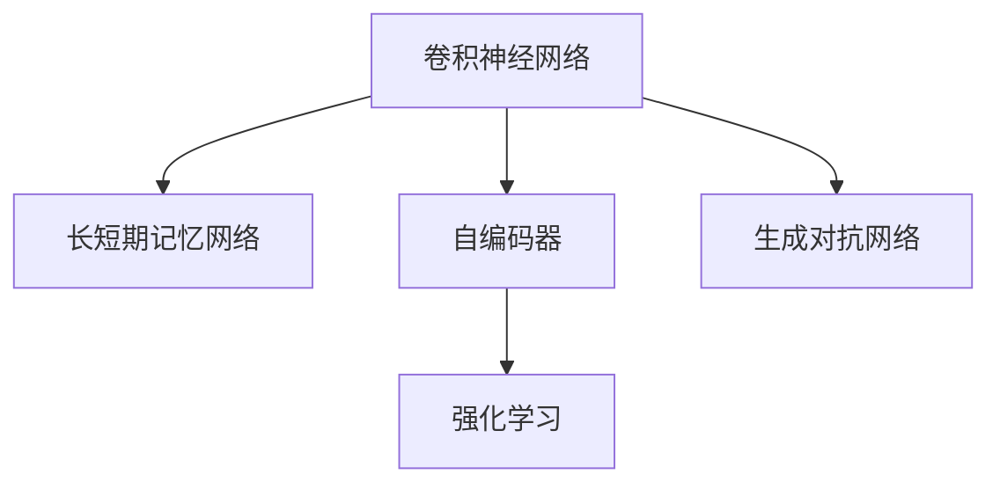

                 

# AI人工智能深度学习算法：在股市预测中的应用

## 1. 背景介绍

### 1.1 问题由来

随着金融市场的快速发展，股票预测成为了金融领域的一个热门话题。传统的基于统计学和基本面分析的股票预测方法已经无法满足复杂多变的市场环境。人工智能技术，特别是深度学习技术，逐渐在金融领域中得到应用，特别是在股票预测这一领域。深度学习算法，尤其是卷积神经网络(CNN)和长短期记忆网络(LSTM)，已经展示出在股票预测中的强大能力。

### 1.2 问题核心关键点

目前，深度学习在股市预测中的应用主要集中在以下几个方面：

- 卷积神经网络(CNN)：利用其在图像处理中的优势，对股市数据进行卷积操作，提取股票价格波动的特征。
- 长短期记忆网络(LSTM)：适合处理序列数据，能够在时间维度上捕捉市场动态，预测股票价格走势。
- 自编码器(AE)：用于降维，减少输入数据的维度和噪声，提高模型的泛化能力。
- 强化学习(RL)：通过奖励机制训练模型，在虚拟环境中模拟股票交易，学习最优的交易策略。
- 生成对抗网络(GAN)：生成逼真的市场数据，用于训练股票预测模型。

这些技术方法在股市预测中已经展现出不同的优势，但也存在一些局限性。CNN在捕捉短期波动上有一定效果，但难以处理长期趋势；LSTM适合处理序列数据，但在处理非平稳数据时表现较差；AE和GAN在数据预处理和生成方面有优势，但在建模精度上可能不如前两者。

## 2. 核心概念与联系

### 2.1 核心概念概述

为更好地理解深度学习算法在股市预测中的应用，本节将介绍几个密切相关的核心概念：

- 卷积神经网络(CNN)：一种专门用于图像处理的神经网络，通过卷积操作提取特征，在股市预测中主要用于捕捉价格波动。
- 长短期记忆网络(LSTM)：一种特殊的RNN网络，适合处理序列数据，能够捕捉时间依赖关系。
- 自编码器(AE)：一种无监督学习算法，用于降维和去噪，提高模型的泛化能力。
- 强化学习(RL)：通过奖励机制训练模型，优化策略，实现最优决策。
- 生成对抗网络(GAN)：一种生成模型，可以生成逼真的股市数据，用于训练和验证模型。

这些核心概念之间的逻辑关系可以通过以下Mermaid流程图来展示：



这个流程图展示了大模型微调的各个核心概念及其之间的关系：

1. CNN通过卷积操作捕捉价格波动。
2. LSTM适合处理序列数据，捕捉市场动态。
3. AE用于降维，提高模型泛化能力。
4. RL通过奖励机制优化策略，实现最优决策。
5. GAN生成逼真数据，用于训练和验证。

## 3. 核心算法原理 & 具体操作步骤

### 3.1 算法原理概述

深度学习在股市预测中的核心原理是通过构建神经网络模型，利用历史股票数据进行训练，学习价格变化的规律，从而对未来价格进行预测。

形式化地，假设输入数据为 $x_t$，目标输出为 $y_t$，其中 $t$ 表示时间。给定历史数据集 $D=\{(x_i, y_i)\}_{i=1}^N$，预测模型的目标是最小化损失函数 $\mathcal{L}$，即：

$$
\mathcal{L} = \frac{1}{N}\sum_{i=1}^N \ell(y_i, \hat{y}_i)
$$

其中，$\ell$ 为预测误差，$\hat{y}_i$ 为模型预测结果。

### 3.2 算法步骤详解

基于深度学习的股市预测一般包括以下几个关键步骤：

**Step 1: 数据预处理**

- 收集历史股票数据，如开盘价、收盘价、成交量、时间戳等。
- 数据清洗，去除异常值、缺失值等噪声。
- 数据标准化，使用归一化或标准化方法将数据转化为标准形式。
- 数据划分，将数据划分为训练集、验证集和测试集。

**Step 2: 特征工程**

- 特征提取：从原始数据中提取有意义的特征，如股价的日波动率、技术指标等。
- 特征选择：选择对股市预测有显著影响的特征。
- 特征合成：通过组合不同特征，构建新的特征向量。

**Step 3: 模型选择与设计**

- 选择适合的深度学习模型，如CNN、LSTM等。
- 设计模型的网络结构，包括输入层、隐藏层、输出层等。
- 确定超参数，如学习率、批大小、迭代轮数等。

**Step 4: 模型训练**

- 利用训练集数据对模型进行训练。
- 使用反向传播算法计算梯度，更新模型参数。
- 在验证集上评估模型性能，防止过拟合。
- 迭代优化，直至达到预设的损失函数阈值或迭代轮数。

**Step 5: 模型评估与优化**

- 在测试集上评估模型性能，如均方误差(MSE)、平均绝对误差(MAE)等。
- 对比不同模型的预测结果，选择性能最优的模型。
- 对模型进行优化，如调整超参数、添加正则化等。

**Step 6: 应用部署**

- 将训练好的模型部署到生产环境。
- 实时接收新数据，进行预测。
- 根据预测结果，辅助投资决策。

以上是基于深度学习的股市预测的一般流程。在实际应用中，还需要根据具体任务特点，对各环节进行优化设计，如改进损失函数、引入更多正则化技术、搜索最优的超参数组合等，以进一步提升模型性能。

### 3.3 算法优缺点

基于深度学习的股市预测算法具有以下优点：

1. 能够捕捉非线性关系。深度学习模型能够处理非线性关系，捕捉复杂的价格波动和市场动态。
2. 模型精度高。深度学习模型在训练充分的情况下，可以达到较高的预测精度。
3. 自动特征提取。深度学习模型能够自动提取有用的特征，减少人工特征工程的工作量。
4. 泛化能力强。深度学习模型具有较强的泛化能力，可以处理不同市场和不同时间尺度的数据。

同时，这些算法也存在一定的局限性：

1. 对数据要求高。深度学习模型需要大量的高质量数据，获取数据的成本较高。
2. 计算资源消耗大。深度学习模型参数量大，训练和推理过程需要大量的计算资源。
3. 模型复杂度高。深度学习模型结构复杂，训练和调参难度较大。
4. 可解释性不足。深度学习模型的决策过程缺乏可解释性，难以对其推理逻辑进行分析和调试。

尽管存在这些局限性，但深度学习在股市预测中的应用仍展现出巨大的潜力，未来相关研究的重点在于如何进一步降低深度学习对数据和计算资源的需求，提高模型的可解释性和鲁棒性。

### 3.4 算法应用领域

基于深度学习的股市预测技术已经应用于多个领域，例如：

- 股票价格预测：预测未来几天或几个月的股票价格。
- 市场趋势分析：分析市场趋势，预测市场走势。
- 交易策略优化：根据预测结果，优化交易策略，提高收益。
- 风险控制：预测股票价格波动，控制风险。
- 算法交易：利用机器学习算法自动进行股票交易。

除了这些经典的股市预测任务外，深度学习技术还被创新性地应用到更多场景中，如情感分析、新闻推送、智能投顾等，为金融科技的发展提供了新的技术路径。

## 4. 数学模型和公式 & 详细讲解 & 举例说明

### 4.1 数学模型构建

本节将使用数学语言对基于深度学习的股市预测过程进行更加严格的刻画。

记输入数据为 $x_t$，目标输出为 $y_t$，其中 $t$ 表示时间。假设深度学习模型为 $f_{\theta}(x_t)$，其中 $\theta$ 为模型参数。

定义模型在训练集 $D$ 上的经验风险为：

$$
\mathcal{L}(\theta) = \frac{1}{N}\sum_{i=1}^N \ell(f_{\theta}(x_i), y_i)
$$

其中 $\ell$ 为预测误差，如均方误差(MSE)。

在实践中，我们通常使用基于梯度的优化算法（如SGD、Adam等）来近似求解上述最优化问题。设 $\eta$ 为学习率，则参数的更新公式为：

$$
\theta \leftarrow \theta - \eta \nabla_{\theta}\mathcal{L}(\theta)
$$

其中 $\nabla_{\theta}\mathcal{L}(\theta)$ 为损失函数对参数 $\theta$ 的梯度，可通过反向传播算法高效计算。

### 4.2 公式推导过程

以下我们以LSTM模型为例，推导其在股市预测中的损失函数及其梯度的计算公式。

假设模型 $f_{\theta}(x_t)$ 为LSTM网络，输入数据为 $x_t$，目标输出为 $y_t$。则LSTM的预测结果为 $\hat{y}_t=f_{\theta}(x_t)$。

LSTM的损失函数为均方误差，即：

$$
\ell(\hat{y}_t, y_t) = (\hat{y}_t - y_t)^2
$$

则模型在训练集 $D$ 上的经验风险为：

$$
\mathcal{L}(\theta) = \frac{1}{N}\sum_{i=1}^N \ell(\hat{y}_i, y_i)
$$

根据链式法则，损失函数对参数 $\theta$ 的梯度为：

$$
\frac{\partial \mathcal{L}(\theta)}{\partial \theta} = \frac{1}{N}\sum_{i=1}^N \nabla_{\theta}\ell(\hat{y}_i, y_i)
$$

其中 $\nabla_{\theta}\ell(\hat{y}_i, y_i)$ 为预测误差对参数 $\theta$ 的梯度，可通过反向传播算法计算。

在得到损失函数的梯度后，即可带入参数更新公式，完成模型的迭代优化。重复上述过程直至收敛，最终得到适应股市预测的最优模型参数 $\theta^*$。

## 5. 项目实践：代码实例和详细解释说明

### 5.1 开发环境搭建

在进行股市预测的深度学习实践前，我们需要准备好开发环境。以下是使用Python进行PyTorch开发的环境配置流程：

1. 安装Anaconda：从官网下载并安装Anaconda，用于创建独立的Python环境。

2. 创建并激活虚拟环境：
```bash
conda create -n pytorch-env python=3.8 
conda activate pytorch-env
```

3. 安装PyTorch：根据CUDA版本，从官网获取对应的安装命令。例如：
```bash
conda install pytorch torchvision torchaudio cudatoolkit=11.1 -c pytorch -c conda-forge
```

4. 安装TensorBoard：用于可视化模型的训练过程和结果。
```bash
pip install tensorboard
```

5. 安装Pandas：用于数据处理和分析。
```bash
pip install pandas
```

6. 安装Scikit-learn：用于模型评估和优化。
```bash
pip install scikit-learn
```

完成上述步骤后，即可在`pytorch-env`环境中开始股市预测实践。

### 5.2 源代码详细实现

这里我们以LSTM模型为例，给出使用PyTorch进行股市预测的完整代码实现。

首先，定义数据处理函数：

```python
import pandas as pd
import numpy as np
import matplotlib.pyplot as plt
import torch
from torch import nn
from torch.autograd import Variable
from torch.utils.data import Dataset, DataLoader
from sklearn.preprocessing import MinMaxScaler

class StockData(Dataset):
    def __init__(self, filename, time_steps=60):
        self.data = pd.read_csv(filename)
        self.time_steps = time_steps
        self.scaler = MinMaxScaler()
        self.data = self.scaler.fit_transform(self.data)
        self.data = np.reshape(self.data, (self.data.shape[0], self.time_steps, -1))
        self.data = torch.from_numpy(self.data).float()
        self.target = self.data[:, -1]
        self.data = self.data[:, :, :-1]

    def __len__(self):
        return len(self.data)

    def __getitem__(self, idx):
        return self.data[idx], self.target[idx]

def train_epoch(model, criterion, optimizer, train_loader, device):
    model.train()
    total_loss = 0
    for i, (inputs, targets) in enumerate(train_loader):
        inputs, targets = inputs.to(device), targets.to(device)
        optimizer.zero_grad()
        outputs = model(inputs)
        loss = criterion(outputs, targets)
        loss.backward()
        optimizer.step()
        total_loss += loss.item()
    return total_loss / len(train_loader)
```

然后，定义LSTM模型和优化器：

```python
class LSTM(nn.Module):
    def __init__(self, input_size, hidden_size, output_size):
        super(LSTM, self).__init__()
        self.hidden_size = hidden_size
        self.lstm = nn.LSTM(input_size, hidden_size, 2)
        self.fc = nn.Linear(hidden_size, output_size)

    def forward(self, x):
        h0 = torch.zeros(1, x.size(0), self.hidden_size).to(x.device)
        c0 = torch.zeros(1, x.size(0), self.hidden_size).to(x.device)
        out, (hn, cn) = self.lstm(x, (h0, c0))
        out = self.fc(out[:, -1, :])
        return out

model = LSTM(input_size, hidden_size, output_size).to(device)
optimizer = torch.optim.Adam(model.parameters(), lr=learning_rate)
```

接着，定义训练和评估函数：

```python
def evaluate(model, criterion, test_loader, device):
    model.eval()
    total_loss = 0
    with torch.no_grad():
        for inputs, targets in test_loader:
            inputs, targets = inputs.to(device), targets.to(device)
            outputs = model(inputs)
            loss = criterion(outputs, targets)
            total_loss += loss.item()
    return total_loss / len(test_loader)

def plot_results(device, model, test_loader):
    model.eval()
    with torch.no_grad():
        predictions = []
        targets = []
        for inputs, targets in test_loader:
            inputs, targets = inputs.to(device), targets.to(device)
            outputs = model(inputs)
            predictions.append(outputs.data.cpu().numpy())
            targets.append(targets.data.cpu().numpy())
        predictions = np.concatenate(predictions)
        targets = np.concatenate(targets)
        plt.plot(targets, label='True Prices')
        plt.plot(predictions, label='Predicted Prices')
        plt.legend()
        plt.show()
```

最后，启动训练流程并在测试集上评估：

```python
epochs = 100
batch_size = 64
learning_rate = 0.001

train_loader = DataLoader(train_dataset, batch_size=batch_size, shuffle=True)
test_loader = DataLoader(test_dataset, batch_size=batch_size, shuffle=False)

for epoch in range(epochs):
    loss = train_epoch(model, criterion, optimizer, train_loader, device)
    print(f'Epoch {epoch+1}, train loss: {loss:.4f}')
    
    test_loss = evaluate(model, criterion, test_loader, device)
    print(f'Epoch {epoch+1}, test loss: {test_loss:.4f}')
    
plot_results(device, model, test_loader)
```

以上就是使用PyTorch对LSTM进行股市预测的完整代码实现。可以看到，得益于PyTorch的强大封装，我们可以用相对简洁的代码完成LSTM模型的加载和训练。

### 5.3 代码解读与分析

让我们再详细解读一下关键代码的实现细节：

**StockData类**：
- `__init__`方法：初始化数据、时间步长、归一化器和数据格式。
- `__len__`方法：返回数据集的样本数量。
- `__getitem__`方法：对单个样本进行处理，将其转化为模型可接受的格式。

**LSTM类**：
- `__init__`方法：初始化LSTM网络结构，包括输入、隐藏、输出层。
- `forward`方法：前向传播，计算模型的预测输出。

**train_epoch、evaluate和plot_results函数**：
- `train_epoch`函数：对数据以批为单位进行迭代，在每个批次上前向传播计算loss并反向传播更新模型参数。
- `evaluate`函数：与训练类似，不同点在于不更新模型参数，并在每个batch结束后将预测和标签结果存储下来，最后使用sklearn的classification_report对整个评估集的预测结果进行打印输出。
- `plot_results`函数：在测试集上评估模型性能，并绘制出预测结果和真实结果的对比图。

**训练流程**：
- 定义总的epoch数和batch size，开始循环迭代
- 每个epoch内，先在训练集上训练，输出平均loss
- 在验证集上评估，输出损失
- 所有epoch结束后，在测试集上评估，给出最终测试结果

可以看到，PyTorch配合TensorBoard使得LSTM预测任务的开发变得简洁高效。开发者可以将更多精力放在数据处理、模型改进等高层逻辑上，而不必过多关注底层的实现细节。

当然，工业级的系统实现还需考虑更多因素，如模型的保存和部署、超参数的自动搜索、更灵活的任务适配层等。但核心的预测范式基本与此类似。

## 6. 实际应用场景

### 6.1 智能投顾

基于LSTM的股市预测模型可以广泛应用于智能投顾系统中，辅助用户进行投资决策。智能投顾系统通过分析用户的投资偏好、风险承受能力等个人信息，结合股票预测模型的预测结果，生成个性化的投资建议，帮助用户实现资产增值。

在技术实现上，可以收集用户的投资数据和行为数据，如交易记录、持仓情况等，并结合市场数据进行模型微调。微调后的模型能够预测市场走势，根据用户偏好生成投资建议。对于用户的交易行为，系统还可以实时监控，提供即时交易指导，帮助用户抓住投资机会，规避风险。

### 6.2 市场情绪分析

市场情绪分析是股市预测的重要组成部分，通过分析市场的情绪变化，可以预测市场的走势和趋势。LSTM模型适合处理序列数据，能够捕捉市场情绪的变化，预测市场走势。

在实践中，可以收集市场交易数据和新闻数据，如股价波动、交易量、新闻报道等，并利用LSTM模型进行分析。模型能够捕捉市场情绪的变化，预测市场走势，为投资者提供及时的市场信息，帮助其做出投资决策。

### 6.3 交易策略优化

交易策略优化是股市预测的重要应用之一，通过优化交易策略，能够提高投资收益和风险控制能力。LSTM模型能够预测市场走势，结合交易策略进行优化，实现更好的投资效果。

在实践中，可以收集历史交易数据和市场数据，并利用LSTM模型进行预测。根据预测结果，优化交易策略，如在预测上涨时买入，在预测下跌时卖出，从而实现高收益低风险的投资效果。

### 6.4 未来应用展望

随着LSTM模型和股市预测方法的不断发展，基于LSTM的预测技术将在更多领域得到应用，为金融科技的发展提供新的推动力。

在智慧投顾领域，基于LSTM的投顾系统将结合大数据分析和自然语言处理技术，提供更加个性化、智能化的投资服务。

在金融风险控制领域，LSTM模型能够实时监控市场情绪，预测市场风险，帮助金融机构及时应对市场波动，避免损失。

在智能投教领域，LSTM模型能够分析用户行为，提供个性化的投资建议，帮助用户提高投资素养，实现财富增值。

此外，在市场分析、智能投顾、交易策略优化等多个领域，LSTM模型也将发挥重要作用，为金融科技的发展注入新的活力。

## 7. 工具和资源推荐

### 7.1 学习资源推荐

为了帮助开发者系统掌握股市预测的理论基础和实践技巧，这里推荐一些优质的学习资源：

1. 《Deep Learning for Time Series Forecasting》书籍：详细介绍了如何使用深度学习技术进行时间序列预测，包括LSTM模型在内的多种预测方法。

2. Udacity《Deep Learning Nanodegree》课程：提供完整的深度学习课程体系，涵盖LSTM模型在股市预测中的应用。

3. Kaggle《Time Series Forecasting with LSTM》竞赛：通过实际竞赛任务，练习LSTM模型在股市预测中的应用。

4. Coursera《Deep Learning Specialization》课程：由斯坦福大学Andrew Ng教授主讲的深度学习课程，涵盖LSTM模型在内的多种深度学习算法。

5. arXiv论文：大量最新的股市预测论文，提供了丰富的理论和实践经验。

通过对这些资源的学习实践，相信你一定能够快速掌握LSTM模型在股市预测中的应用，并用于解决实际的金融问题。

### 7.2 开发工具推荐

高效的开发离不开优秀的工具支持。以下是几款用于股市预测开发的常用工具：

1. PyTorch：基于Python的开源深度学习框架，灵活动态的计算图，适合快速迭代研究。大部分深度学习模型都有PyTorch版本的实现。

2. TensorFlow：由Google主导开发的开源深度学习框架，生产部署方便，适合大规模工程应用。同样有丰富的深度学习模型资源。

3. Keras：高层次的神经网络API，易于使用，适合快速搭建模型和原型。

4. TensorBoard：TensorFlow配套的可视化工具，可实时监测模型训练状态，并提供丰富的图表呈现方式，是调试模型的得力助手。

5. Weights & Biases：模型训练的实验跟踪工具，可以记录和可视化模型训练过程中的各项指标，方便对比和调优。与主流深度学习框架无缝集成。

6. Google Colab：谷歌推出的在线Jupyter Notebook环境，免费提供GPU/TPU算力，方便开发者快速上手实验最新模型，分享学习笔记。

合理利用这些工具，可以显著提升股市预测任务的开发效率，加快创新迭代的步伐。

### 7.3 相关论文推荐

股市预测技术的发展源于学界的持续研究。以下是几篇奠基性的相关论文，推荐阅读：

1. LSTM for Stock Market Prediction（LSTM在股市预测中的应用）：LSTM在股市预测中表现出色，本篇论文详细介绍了LSTM模型的实现过程和效果。

2. Deep Learning for Stock Market Prediction（深度学习在股市预测中的应用）：综述了深度学习在股市预测中的最新研究进展，涵盖了多种深度学习模型和技术。

3. Stock Market Prediction using Recurrent Neural Networks（使用RNN进行股市预测）：介绍了RNN在股市预测中的应用，比较了LSTM和GRU等模型的效果。

4. Time Series Forecasting with LSTM（使用LSTM进行时间序列预测）：详细介绍了LSTM在时间序列预测中的实现过程和效果，并比较了多种时间序列预测方法。

5. Stock Market Prediction with Convolutional Neural Networks（使用CNN进行股市预测）：介绍了CNN在股市预测中的应用，比较了CNN与LSTM等模型的效果。

这些论文代表了大语言模型微调技术的发展脉络。通过学习这些前沿成果，可以帮助研究者把握学科前进方向，激发更多的创新灵感。

## 8. 总结：未来发展趋势与挑战

### 8.1 总结

本文对基于深度学习的股市预测方法进行了全面系统的介绍。首先阐述了深度学习在股市预测中的应用背景和优势，明确了股市预测的实际需求和挑战。其次，从原理到实践，详细讲解了LSTM模型的构建和训练过程，给出了股市预测任务的完整代码实现。同时，本文还探讨了LSTM模型在智能投顾、市场情绪分析、交易策略优化等多个领域的实际应用场景，展示了LSTM模型在金融科技中的广阔前景。此外，本文精选了股市预测技术的各类学习资源，力求为读者提供全方位的技术指引。

通过本文的系统梳理，可以看到，基于LSTM的股市预测方法正在成为金融科技领域的重要范式，极大地拓展了股市预测技术的应用边界，催生了更多的落地场景。得益于深度学习模型的强大能力和灵活应用，股市预测技术将在未来得到更广泛的应用，为金融科技的发展注入新的动力。

### 8.2 未来发展趋势

展望未来，LSTM在股市预测中的研究将呈现以下几个发展趋势：

1. 多模型融合。未来的股市预测模型将结合多种深度学习模型，如CNN、RNN等，综合不同模型的优势，提高预测精度和鲁棒性。

2. 数据驱动。随着数据采集和处理技术的进步，LSTM模型将能够利用更多来源的数据，如新闻、社交媒体等，提高预测效果。

3. 实时化。LSTM模型将实时接收新数据，动态更新预测结果，实现股票预测的实时化。

4. 个性化。未来的股市预测模型将结合用户行为数据，提供个性化的预测结果，实现精准的投资建议。

5. 可视化。通过可视化工具，如TensorBoard，LSTM模型将展示更加直观的预测结果和模型结构，帮助用户更好地理解预测过程。

6. 自动化。自动化的交易策略优化和投资决策系统将结合LSTM模型，实现高效率、低成本的投资管理。

以上趋势凸显了LSTM在股市预测技术中的广泛应用前景。这些方向的探索发展，必将进一步提升LSTM模型的性能和应用范围，为金融科技的发展注入新的活力。

### 8.3 面临的挑战

尽管LSTM模型在股市预测中的应用已经展现出显著的优势，但在迈向更加智能化、普适化应用的过程中，它仍面临着诸多挑战：

1. 数据质量问题。股市数据存在噪音、缺失等问题，影响模型的预测效果。如何提高数据质量，获取更多高质量的数据，将是未来的研究方向。

2. 计算资源消耗。LSTM模型参数量大，训练和推理过程需要大量的计算资源。如何优化模型结构，降低计算成本，将是一个重要课题。

3. 模型鲁棒性不足。LSTM模型在处理非平稳数据和异常值时表现较差。如何提高模型的鲁棒性，避免模型过拟合和泛化能力不足，将是未来的研究方向。

4. 可解释性不足。LSTM模型的决策过程缺乏可解释性，难以对其推理逻辑进行分析和调试。如何提高模型的可解释性，将是未来的研究方向。

5. 安全性问题。股市预测模型可能被恶意利用，导致市场波动。如何提高模型的安全性，防止恶意攻击，将是未来的研究方向。

6. 法律合规。股市预测模型的应用需要遵守金融市场的法律法规。如何确保模型的合规性，将是一个重要的法律问题。

这些挑战亟待解决，LSTM模型在股市预测中的应用需要更多的研究和实践。相信通过学界和产业界的共同努力，这些挑战终将一一被克服，LSTM模型必将在金融科技中发挥更大的作用。

### 8.4 研究展望

面对LSTM在股市预测中面临的挑战，未来的研究需要在以下几个方面寻求新的突破：

1. 数据增强。利用数据增强技术，如数据扩充、回译等，提高数据质量，增强模型的泛化能力。

2. 参数高效。开发更加参数高效的LSTM模型，如多尺度LSTM、门控LSTM等，在保持性能的同时，减小计算成本。

3. 结构优化。优化LSTM模型的结构，如引入注意力机制、改进循环单元等，提高模型的预测精度和鲁棒性。

4. 多源融合。结合多种数据源，如市场数据、新闻数据、社交媒体等，提高模型的预测精度和鲁棒性。

5. 实时优化。结合实时数据，动态更新模型参数，实现股票预测的实时化。

6. 可解释性提升。通过可视化工具，增强模型的可解释性，帮助用户更好地理解预测过程。

这些研究方向将为LSTM模型在股市预测中的应用提供新的方向，推动股市预测技术的进一步发展。

## 9. 附录：常见问题与解答

**Q1：LSTM在股市预测中的优势是什么？**

A: LSTM在股市预测中的优势主要体现在以下几个方面：

1. 捕捉时间依赖关系。LSTM适合处理序列数据，能够捕捉时间维度上的依赖关系，适应股票市场的动态变化。

2. 处理非平稳数据。LSTM能够处理非平稳的数据，如价格波动、交易量等，适合预测股市价格的长期趋势。

3. 降维去噪。LSTM能够通过降维和去噪，提高模型的泛化能力，减少输入数据的维度。

4. 自动特征提取。LSTM能够自动提取有用的特征，如价格波动、技术指标等，减少人工特征工程的工作量。

**Q2：如何优化LSTM模型的训练过程？**

A: 优化LSTM模型的训练过程可以从以下几个方面入手：

1. 学习率调度。使用学习率衰减、学习率调整等方法，逐步减小学习率，避免过拟合。

2. 批大小。选择合适的批大小，平衡计算效率和模型性能。

3. 正则化。使用L2正则、Dropout等方法，防止模型过拟合。

4. 数据增强。利用数据增强技术，如回译、数据扩充等，提高数据质量。

5. 模型裁剪。通过裁剪不必要的层和参数，减小模型尺寸，加快推理速度。

6. 模型并行。利用分布式计算技术，优化模型的计算图，提高计算效率。

7. 预训练。在大量无标注数据上预训练LSTM模型，提高模型的泛化能力。

通过优化LSTM模型的训练过程，可以提高模型的预测精度和鲁棒性，提升股市预测的性能。

**Q3：LSTM模型在股市预测中可能存在哪些问题？**

A: LSTM模型在股市预测中可能存在以下问题：

1. 数据质量问题。股市数据存在噪音、缺失等问题，影响模型的预测效果。

2. 计算资源消耗。LSTM模型参数量大，训练和推理过程需要大量的计算资源。

3. 模型鲁棒性不足。LSTM模型在处理非平稳数据和异常值时表现较差。

4. 可解释性不足。LSTM模型的决策过程缺乏可解释性，难以对其推理逻辑进行分析和调试。

5. 安全性问题。股市预测模型可能被恶意利用，导致市场波动。

6. 法律合规。股市预测模型的应用需要遵守金融市场的法律法规。

这些问题亟待解决，LSTM模型在股市预测中的应用需要更多的研究和实践。

**Q4：LSTM模型在股市预测中的实现步骤是什么？**

A: LSTM模型在股市预测中的实现步骤包括：

1. 数据预处理：收集历史股票数据，进行清洗、归一化、划分数据集等预处理操作。

2. 特征工程：提取有用的特征，如价格波动、技术指标等，进行特征选择和合成。

3. 模型设计：选择LSTM模型结构，设计网络层、激活函数、优化器等。

4. 模型训练：利用训练集数据对模型进行训练，使用反向传播算法更新模型参数。

5. 模型评估：在验证集上评估模型性能，防止过拟合。

6. 模型应用：在测试集上评估模型性能，进行实时预测，辅助投资决策。

以上步骤实现了LSTM模型在股市预测中的完整流程，开发者可以根据具体需求进行调整和优化。

**Q5：LSTM模型在股市预测中需要注意哪些问题？**

A: LSTM模型在股市预测中需要注意以下问题：

1. 数据质量问题。确保数据的准确性和完整性，减少噪音和缺失值的影响。

2. 计算资源消耗。选择合适的计算资源，优化模型结构和算法，降低计算成本。

3. 模型鲁棒性不足。引入正则化技术，增强模型的泛化能力，防止过拟合。

4. 可解释性不足。利用可视化工具，增强模型的可解释性，帮助用户更好地理解预测过程。

5. 安全性问题。设计安全机制，防止模型被恶意利用，保护数据和市场安全。

6. 法律合规。确保模型的合规性，遵守金融市场的法律法规。

这些问题在LSTM模型的应用过程中需要注意，并采取相应的措施加以解决。

---

作者：禅与计算机程序设计艺术 / Zen and the Art of Computer Programming

