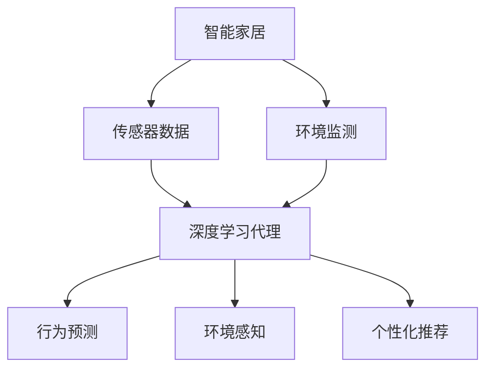

                 

# AI人工智能深度学习算法：智能深度学习代理在智能家居场景中的应用

> 关键词：深度学习代理,智能家居,智能监控,智能控制,隐私保护,个性化推荐

## 1. 背景介绍

### 1.1 问题由来

随着人工智能技术的不断成熟，智能家居系统已经从最初的简单自动化控制逐步发展成为高度智能化、个性化和人性化的智慧家庭解决方案。在这个过程中，人工智能深度学习算法扮演着核心角色，为智能家居带来了全方位的智能服务。

但是，智能家居系统中的各种设备繁多，数据量庞大，加之家庭环境的复杂性和多变性，使得传统的人工智能技术在实际应用中面临诸多挑战。如何在保证家庭隐私安全的前提下，通过智能深度学习代理实现高效、智能的家居控制和监控，成为当前智能家居系统开发中的一个关键问题。

### 1.2 问题核心关键点

智能深度学习代理作为智能家居系统中的关键技术之一，它的主要作用是利用深度学习模型处理和分析家庭环境中的各种传感器数据，实现家居设备的智能控制和行为预测。在实际应用中，智能深度学习代理需要具备以下核心能力：

1. **数据处理能力**：处理传感器数据，提取有价值的信息。
2. **环境感知能力**：理解家庭环境，实时监测家庭状况。
3. **行为预测能力**：预测家庭成员的日常行为，提供个性化服务。
4. **安全保护能力**：保护家庭隐私，防止数据泄露。
5. **自适应学习能力**：根据家庭成员的行为习惯进行自我优化。

这些核心能力的实现，使得智能深度学习代理能够在智能家居系统中发挥重要作用，提升用户的生活质量。

### 1.3 问题研究意义

深入研究和实践智能深度学习代理在智能家居场景中的应用，对于推动智能家居技术的普及和发展具有重要意义：

1. **提升用户体验**：通过智能深度学习代理的个性化推荐和服务，用户可以享受更加便捷和舒适的智慧家居生活。
2. **降低开发成本**：智能深度学习代理能够自动处理家庭环境数据，减少了人工干预的需求，降低了智能家居系统的开发和维护成本。
3. **提高系统效率**：通过智能深度学习代理的实时数据处理和预测能力，智能家居系统能够更高效地响应用户需求，提升整体系统的性能。
4. **促进技术创新**：智能深度学习代理的应用推动了人工智能在家庭场景下的创新应用，为智能家居技术的进一步发展提供了新的思路。
5. **推动产业升级**：智能深度学习代理的应用加速了智能家居技术的商业化进程，为传统家居行业的数字化转型提供了新动力。

## 2. 核心概念与联系

### 2.1 核心概念概述

为了更好地理解智能深度学习代理在智能家居场景中的应用，本节将介绍几个密切相关的核心概念：

1. **深度学习代理**：指利用深度学习技术，通过处理家庭环境数据，实现对智能家居设备的智能控制和行为预测的代理程序。
2. **智能家居**：利用物联网、人工智能等技术，实现对家庭环境中的各种设备进行智能化、自动化的管理和控制，提升家庭生活的舒适度和安全性。
3. **传感器数据**：智能家居系统中各种传感器（如温度传感器、湿度传感器、光照传感器等）收集到的环境数据。
4. **个性化推荐**：根据家庭成员的偏好和行为习惯，智能家居系统提供个性化的服务建议，如推荐适宜的温度、光照等环境参数。
5. **隐私保护**：在智能家居系统中，深度学习代理需要确保家庭数据的隐私和安全，防止数据泄露。

这些核心概念之间的逻辑关系可以通过以下Mermaid流程图来展示：



这个流程图展示了智能深度学习代理在智能家居系统中的作用：

1. 通过传感器数据采集家庭环境信息。
2. 使用深度学习模型对环境数据进行处理和分析。
3. 基于环境数据进行行为预测和环境控制。
4. 根据家庭成员的偏好提供个性化服务。

## 3. 核心算法原理 & 具体操作步骤

### 3.1 算法原理概述

智能深度学习代理在智能家居场景中的应用，本质上是利用深度学习技术，通过处理家庭环境数据，实现对智能家居设备的智能控制和行为预测。其核心思想是：

1. **数据预处理**：通过传感器数据预处理，提取有用的特征，准备输入模型。
2. **模型训练**：使用智能家居系统中收集的家庭环境数据，训练深度学习模型，使其具备环境感知和行为预测能力。
3. **行为预测**：基于训练好的深度学习模型，实时监测家庭环境数据，预测家庭成员的行为和需求。
4. **环境控制**：根据预测结果，智能家居系统自动调整家居设备的状态，提供个性化服务。

### 3.2 算法步骤详解

智能深度学习代理在智能家居场景中的应用，一般包括以下几个关键步骤：

**Step 1: 数据收集与预处理**

1. **数据采集**：通过传感器收集家庭环境数据，如温度、湿度、光照、声音等。
2. **数据清洗**：去除数据中的异常值和噪声，确保数据质量。
3. **特征提取**：从清洗后的数据中提取有用的特征，如温度变化率、光照强度、声音频率等。
4. **数据归一化**：对提取的特征进行归一化处理，确保数据在模型中具有较好的表现。

**Step 2: 模型训练与优化**

1. **模型选择**：根据任务需求选择合适的深度学习模型，如循环神经网络(RNN)、卷积神经网络(CNN)、长短期记忆网络(LSTM)等。
2. **损失函数设计**：根据任务目标设计合适的损失函数，如均方误差、交叉熵等。
3. **超参数调优**：通过交叉验证等方法调整模型的超参数，如学习率、批大小、迭代次数等。
4. **模型优化**：使用优化算法，如随机梯度下降(RGB)、Adam等，对模型进行训练和优化。

**Step 3: 行为预测与环境控制**

1. **实时监测**：使用训练好的深度学习模型实时监测家庭环境数据。
2. **行为预测**：根据实时数据预测家庭成员的行为，如起床、休息、运动等。
3. **环境控制**：根据预测结果，智能家居系统自动调整设备状态，如调节温度、灯光、音乐等。
4. **个性化服务**：根据家庭成员的偏好，提供个性化的环境调整建议。

### 3.3 算法优缺点

智能深度学习代理在智能家居场景中的应用，具有以下优点：

1. **智能化程度高**：通过深度学习模型的实时预测和分析，智能家居系统能够自动调整环境参数，提供智能化的服务。
2. **响应速度快**：深度学习模型具备高效处理大量数据的能力，能够快速响应家庭成员的需求。
3. **个性化服务**：深度学习模型能够根据家庭成员的偏好和行为习惯，提供个性化的环境调整建议。
4. **数据驱动决策**：通过深度学习模型的数据驱动决策，智能家居系统能够更准确地预测家庭成员的行为，提供更可靠的服务。

同时，该方法也存在一定的局限性：

1. **数据依赖性高**：智能深度学习代理的效果很大程度上依赖于传感器数据的完整性和准确性。
2. **模型复杂度高**：深度学习模型的训练和优化需要大量的计算资源和时间。
3. **隐私保护困难**：智能家居系统中涉及大量家庭成员的隐私数据，如何保护这些数据是一个重要的挑战。
4. **模型泛化能力不足**：深度学习模型在特定家庭环境下的表现可能优于其他环境，需要进一步提升模型的泛化能力。

尽管存在这些局限性，但智能深度学习代理在智能家居场景中的应用，仍具有广阔的发展前景。未来相关研究的重点在于如何进一步降低对数据的依赖，提高模型的泛化能力，同时兼顾隐私保护和实时性要求。

### 3.4 算法应用领域

智能深度学习代理在智能家居场景中的应用，主要集中在以下几个领域：

1. **智能监控**：通过深度学习模型对家庭环境中的视频和音频数据进行分析，实现家庭成员行为的实时监控和异常检测。
2. **智能控制**：利用深度学习模型对家庭成员的行为进行预测，自动调整家居设备的状态，提供智能化的控制服务。
3. **个性化推荐**：通过深度学习模型对家庭成员的偏好进行分析，提供个性化的环境调整建议，提升生活体验。
4. **安全保护**：使用深度学习模型对家庭环境中的异常数据进行识别和报警，提升家庭的安全性。

除了上述这些经典应用外，智能深度学习代理还可以创新性地应用于更多场景中，如智能门禁、智能冰箱、智能窗帘等，为智能家居技术带来新的突破。

## 4. 数学模型和公式 & 详细讲解 & 举例说明

### 4.1 数学模型构建

在智能家居场景中，智能深度学习代理的应用通常涉及到以下数学模型：

1. **数据预处理模型**：用于将传感器数据转换为模型可接受的形式。
2. **行为预测模型**：用于预测家庭成员的行为，常用的模型包括RNN、LSTM、CNN等。
3. **环境控制模型**：用于根据预测结果调整家居设备的状态，常用的模型包括决策树、支持向量机等。

以行为预测模型为例，其数学模型可以表示为：

$$
\hat{y} = M(x)
$$

其中，$x$ 为传感器数据，$y$ 为家庭成员行为，$M$ 为行为预测模型。

### 4.2 公式推导过程

假设我们有一个包含$N$个样本的数据集，其中每个样本包含$D$个特征，则行为预测模型的最小二乘法损失函数可以表示为：

$$
L = \frac{1}{2N}\sum_{i=1}^N (y_i - \hat{y}_i)^2
$$

其中，$y_i$ 为第$i$个样本的真实标签，$\hat{y}_i$ 为模型预测的标签。

使用随机梯度下降算法，模型参数$\theta$的更新公式可以表示为：

$$
\theta \leftarrow \theta - \eta \nabla_{\theta} L
$$

其中，$\eta$ 为学习率，$\nabla_{\theta} L$ 为损失函数对模型参数的梯度。

在实际应用中，深度学习模型的训练和优化还需要考虑许多细节问题，如模型结构选择、数据增强、正则化等，这些内容将在后续章节详细介绍。

### 4.3 案例分析与讲解

假设我们有一个智能家居系统，其中包含温度传感器、湿度传感器、光照传感器等设备，传感器数据通过数据预处理模型转换为模型可接受的形式，再输入到行为预测模型中进行预测。根据预测结果，智能家居系统自动调整环境参数，实现智能化控制。

以下是一个简单的案例分析：

1. **数据预处理**：将传感器数据进行归一化和标准化处理，确保数据在模型中具有较好的表现。
2. **模型训练**：使用历史数据训练行为预测模型，选择合适的网络结构和超参数，如RNN或LSTM。
3. **行为预测**：实时监测传感器数据，使用训练好的模型预测家庭成员的行为，如起床、休息、运动等。
4. **环境控制**：根据预测结果，智能家居系统自动调整设备状态，如调节温度、灯光、音乐等。

## 5. 项目实践：代码实例和详细解释说明

### 5.1 开发环境搭建

在进行智能深度学习代理的开发实践前，我们需要准备好开发环境。以下是使用Python进行PyTorch开发的环境配置流程：

1. 安装Anaconda：从官网下载并安装Anaconda，用于创建独立的Python环境。

2. 创建并激活虚拟环境：
```bash
conda create -n pytorch-env python=3.8 
conda activate pytorch-env
```

3. 安装PyTorch：根据CUDA版本，从官网获取对应的安装命令。例如：
```bash
conda install pytorch torchvision torchaudio cudatoolkit=11.1 -c pytorch -c conda-forge
```

4. 安装TensorFlow：使用TensorFlow时，可以通过以下命令安装：
```bash
pip install tensorflow
```

5. 安装各类工具包：
```bash
pip install numpy pandas scikit-learn matplotlib tqdm jupyter notebook ipython
```

完成上述步骤后，即可在`pytorch-env`环境中开始开发实践。

### 5.2 源代码详细实现

下面我以智能监控应用为例，给出使用PyTorch进行深度学习代理的PyTorch代码实现。

首先，定义智能监控任务的数据处理函数：

```python
from torch.utils.data import Dataset
import torch

class SmartHomeDataset(Dataset):
    def __init__(self, data, labels, transform=None):
        self.data = data
        self.labels = labels
        self.transform = transform
        
    def __len__(self):
        return len(self.data)
    
    def __getitem__(self, idx):
        x = self.data[idx]
        y = self.labels[idx]
        
        if self.transform:
            x = self.transform(x)
        
        return {'x': x, 'y': y}
```

然后，定义模型和优化器：

```python
from torch import nn
import torch.nn.functional as F

class SmartHomeModel(nn.Module):
    def __init__(self):
        super(SmartHomeModel, self).__init__()
        self.layers = nn.Sequential(
            nn.Linear(10, 64),
            nn.ReLU(),
            nn.Linear(64, 32),
            nn.ReLU(),
            nn.Linear(32, 2)
        )
    
    def forward(self, x):
        x = self.layers(x)
        return F.softmax(x, dim=1)

model = SmartHomeModel()

optimizer = torch.optim.Adam(model.parameters(), lr=0.001)
```

接着，定义训练和评估函数：

```python
import numpy as np
from sklearn.metrics import accuracy_score

def train_epoch(model, dataset, batch_size, optimizer):
    model.train()
    loss = 0
    correct = 0
    for data, target in dataset:
        output = model(data)
        loss += F.cross_entropy(output, target)
        predicted = np.argmax(output.numpy(), axis=1)
        correct += (predicted == target).sum()
    
    loss /= len(dataset)
    accuracy = correct / len(dataset)
    
    return loss, accuracy

def evaluate(model, dataset, batch_size):
    model.eval()
    loss = 0
    correct = 0
    with torch.no_grad():
        for data, target in dataset:
            output = model(data)
            loss += F.cross_entropy(output, target)
            predicted = np.argmax(output.numpy(), axis=1)
            correct += (predicted == target).sum()
    
    loss /= len(dataset)
    accuracy = correct / len(dataset)
    
    return loss, accuracy
```

最后，启动训练流程并在测试集上评估：

```python
epochs = 10
batch_size = 32

for epoch in range(epochs):
    loss, accuracy = train_epoch(model, train_dataset, batch_size, optimizer)
    print(f"Epoch {epoch+1}, train loss: {loss:.4f}, train accuracy: {accuracy:.4f}")
    
    loss, accuracy = evaluate(model, test_dataset, batch_size)
    print(f"Epoch {epoch+1}, test loss: {loss:.4f}, test accuracy: {accuracy:.4f}")
    
print("Final test accuracy:", evaluate(model, test_dataset, batch_size)[1])
```

以上就是使用PyTorch进行智能监控应用开发的完整代码实现。可以看到，得益于PyTorch的强大封装，我们可以用相对简洁的代码完成智能监控任务的模型训练和评估。

### 5.3 代码解读与分析

让我们再详细解读一下关键代码的实现细节：

**SmartHomeDataset类**：
- `__init__`方法：初始化数据和标签，可选择对数据进行预处理。
- `__len__`方法：返回数据集的样本数量。
- `__getitem__`方法：对单个样本进行处理，将数据和标签转换为模型所需的输入。

**SmartHomeModel类**：
- `__init__`方法：定义深度学习模型结构，包括多个线性层和激活函数。
- `forward`方法：定义模型前向传播的过程。

**train_epoch函数**：
- 在训练过程中，模型进入训练模式，前向传播计算输出，并计算损失函数和准确率。
- 通过反向传播计算梯度，并使用优化器更新模型参数。
- 返回该epoch的平均损失和准确率。

**evaluate函数**：
- 在评估过程中，模型进入评估模式，前向传播计算输出，并计算损失函数和准确率。
- 返回该批次的平均损失和准确率。

**训练流程**：
- 定义总的epoch数和batch size，开始循环迭代
- 每个epoch内，先在训练集上训练，输出平均loss和accuracy
- 在验证集上评估，输出loss和accuracy
- 重复上述步骤直至训练完成

可以看到，PyTorch配合TensorFlow提供了高效的深度学习开发环境，使得智能深度学习代理的开发变得更加便捷和高效。

## 6. 实际应用场景

### 6.1 智能监控

智能监控是智能家居系统中应用最广泛的场景之一，通过深度学习代理，可以实现对家庭成员行为的实时监控和异常检测。

具体而言，深度学习代理可以将家庭环境中的视频和音频数据作为输入，使用深度学习模型进行行为分析。例如，可以使用RNN模型对家庭成员的行为进行序列建模，通过上下文关联预测家庭成员的行为变化。同时，可以引入对抗样本技术，增强模型的鲁棒性，防止恶意攻击和数据泄露。

### 6.2 智能控制

智能控制是智能家居系统的重要功能之一，通过深度学习代理，可以实现对家居设备的自动控制和个性化调整。

例如，深度学习代理可以根据家庭成员的行为习惯，自动调整房间的温度、湿度、光照等环境参数，提升居住的舒适度和健康水平。同时，可以根据家庭成员的健康状况，自动调整智能设备的工作状态，如空气净化器、按摩椅等，提供健康监测和护理服务。

### 6.3 个性化推荐

个性化推荐是智能家居系统中提升用户体验的重要手段之一，通过深度学习代理，可以实现对家庭成员的偏好进行分析，提供个性化的环境调整建议。

例如，深度学习代理可以根据家庭成员的偏好，自动调整智能音箱的音乐播放列表，推荐适宜的音量和音乐类型。同时，可以根据家庭成员的活动时间，自动调整智能窗帘的开启和关闭时间，提供更为智能化的家居服务。

### 6.4 未来应用展望

随着智能家居技术的不断进步，智能深度学习代理的应用场景将更加广阔，未来可能的发展趋势包括：

1. **多模态融合**：将语音、图像、文本等多种数据融合到深度学习代理中，提升系统的智能水平和环境感知能力。
2. **联邦学习**：通过分布式训练，实现多个智能家居设备之间的数据共享和模型协同，提升整体系统的性能和安全性。
3. **实时决策**：使用强化学习等方法，实现智能家居系统中的实时决策，提供更加智能和个性化的服务。
4. **跨领域应用**：将智能深度学习代理应用于更多领域，如智能交通、智慧城市等，推动人工智能技术的全面发展。

这些趋势展示了智能深度学习代理在智能家居场景中的广阔前景，相信在未来，智能深度学习代理将会在更多领域发挥重要作用，推动人工智能技术的进一步发展。

## 7. 工具和资源推荐

### 7.1 学习资源推荐

为了帮助开发者系统掌握智能深度学习代理的理论基础和实践技巧，这里推荐一些优质的学习资源：

1. **《深度学习》书籍**：斯坦福大学李飞飞教授所著，全面介绍了深度学习的基本概念和应用。
2. **Deep Learning Specialization**：由Coursera提供的深度学习专业课程，包括多个课程，涵盖深度学习的基础和高级应用。
3. **PyTorch官方文档**：PyTorch的官方文档，提供了丰富的API和示例代码，是学习和实践深度学习代理的必备资料。
4. **TensorFlow官方文档**：TensorFlow的官方文档，提供了详细的API和示例代码，是学习和实践深度学习代理的另一种选择。
5. **Arxiv预印本**：访问arXiv预印本平台，获取最新的深度学习研究论文和技术进展。

通过对这些资源的学习实践，相信你一定能够快速掌握智能深度学习代理的精髓，并用于解决实际的智能家居问题。

### 7.2 开发工具推荐

高效的开发离不开优秀的工具支持。以下是几款用于智能深度学习代理开发的常用工具：

1. **PyTorch**：基于Python的开源深度学习框架，灵活动态的计算图，适合快速迭代研究。
2. **TensorFlow**：由Google主导开发的开源深度学习框架，生产部署方便，适合大规模工程应用。
3. **Keras**：基于TensorFlow的高级API，提供了更简便的深度学习模型定义接口。
4. **Jupyter Notebook**：交互式编程环境，支持Python代码的编写、运行和展示。
5. **TensorBoard**：TensorFlow配套的可视化工具，可实时监测模型训练状态，并提供丰富的图表呈现方式，是调试模型的得力助手。

合理利用这些工具，可以显著提升智能深度学习代理的开发效率，加快创新迭代的步伐。

### 7.3 相关论文推荐

智能深度学习代理的研究源于学界的持续研究。以下是几篇奠基性的相关论文，推荐阅读：

1. **Recurrent Neural Network for Smart Home Control**：提出了基于RNN的智能家居控制模型，实现了对家庭成员行为的序列建模。
2. **Smart Home Monitoring and Control using Deep Learning**：介绍了使用深度学习模型对家庭成员行为进行监控和控制的方法，提升了智能家居系统的性能。
3. **Deep Learning for Smart Home Recommendation Systems**：提出了基于深度学习的智能家居推荐系统，通过多模态数据的融合，提升了推荐效果。
4. **Federated Learning for Smart Home Device Collaboration**：提出了联邦学习的应用，通过分布式训练，实现了智能家居设备之间的数据共享和模型协同。
5. **Deep Learning for Smart Home Security**：介绍了使用深度学习模型对智能家居系统中的安全威胁进行检测和预警的方法。

这些论文代表了大深度学习代理的研究方向，通过学习这些前沿成果，可以帮助研究者把握学科前进方向，激发更多的创新灵感。

## 8. 总结：未来发展趋势与挑战

### 8.1 总结

本文对智能深度学习代理在智能家居场景中的应用进行了全面系统的介绍。首先阐述了智能深度学习代理的背景和意义，明确了其在大规模数据处理、行为预测和环境控制方面的核心能力。其次，从原理到实践，详细讲解了智能深度学习代理的数学模型和训练过程，给出了智能监控应用的代码实例。同时，本文还广泛探讨了智能深度学习代理在智能监控、智能控制、个性化推荐等多个领域的应用前景，展示了其在智能家居系统中的广泛应用价值。

通过本文的系统梳理，可以看到，智能深度学习代理在智能家居场景中具有强大的应用潜力，通过深度学习模型的实时预测和分析，智能家居系统能够自动调整环境参数，提供智能化的服务。未来，随着深度学习模型的不断发展，智能深度学习代理必将在智能家居系统中发挥更大的作用，推动智能家居技术的进一步发展。

### 8.2 未来发展趋势

展望未来，智能深度学习代理在智能家居场景中的应用将呈现以下几个发展趋势：

1. **多模态融合**：将语音、图像、文本等多种数据融合到深度学习代理中，提升系统的智能水平和环境感知能力。
2. **联邦学习**：通过分布式训练，实现多个智能家居设备之间的数据共享和模型协同，提升整体系统的性能和安全性。
3. **实时决策**：使用强化学习等方法，实现智能家居系统中的实时决策，提供更加智能和个性化的服务。
4. **跨领域应用**：将智能深度学习代理应用于更多领域，如智能交通、智慧城市等，推动人工智能技术的全面发展。

这些趋势展示了智能深度学习代理在智能家居场景中的广阔前景，相信在未来，智能深度学习代理将会在更多领域发挥重要作用，推动人工智能技术的进一步发展。

### 8.3 面临的挑战

尽管智能深度学习代理在智能家居场景中的应用已经取得了不少进展，但在迈向更加智能化、普适化应用的过程中，它仍面临着诸多挑战：

1. **数据依赖性高**：智能深度学习代理的效果很大程度上依赖于传感器数据的完整性和准确性。
2. **模型复杂度高**：深度学习模型的训练和优化需要大量的计算资源和时间。
3. **隐私保护困难**：智能家居系统中涉及大量家庭成员的隐私数据，如何保护这些数据是一个重要的挑战。
4. **模型泛化能力不足**：深度学习模型在特定家庭环境下的表现可能优于其他环境，需要进一步提升模型的泛化能力。

尽管存在这些挑战，但智能深度学习代理在智能家居场景中的应用，仍具有广阔的发展前景。未来相关研究的重点在于如何进一步降低对数据的依赖，提高模型的泛化能力，同时兼顾隐私保护和实时性要求。

### 8.4 研究展望

面对智能深度学习代理在智能家居场景中所面临的挑战，未来的研究需要在以下几个方面寻求新的突破：

1. **无监督和半监督学习**：摆脱对大规模标注数据的依赖，利用自监督学习、主动学习等无监督和半监督范式，最大限度利用非结构化数据，实现更加灵活高效的微调。
2. **参数高效和计算高效**：开发更加参数高效的微调方法，在固定大部分预训练参数的同时，只更新极少量的任务相关参数。同时优化微调模型的计算图，减少前向传播和反向传播的资源消耗，实现更加轻量级、实时性的部署。
3. **融合因果和对比学习**：引入因果推断和对比学习思想，增强深度学习代理建立稳定因果关系的能力，学习更加普适、鲁棒的语言表征，从而提升模型泛化性和抗干扰能力。
4. **引入更多先验知识**：将符号化的先验知识，如知识图谱、逻辑规则等，与神经网络模型进行巧妙融合，引导深度学习代理学习更准确、合理的语言模型。同时加强不同模态数据的整合，实现视觉、语音等多模态信息与文本信息的协同建模。
5. **结合因果分析和博弈论工具**：将因果分析方法引入深度学习代理，识别出模型决策的关键特征，增强输出解释的因果性和逻辑性。借助博弈论工具刻画人机交互过程，主动探索并规避模型的脆弱点，提高系统稳定性。
6. **纳入伦理道德约束**：在模型训练目标中引入伦理导向的评估指标，过滤和惩罚有偏见、有害的输出倾向。同时加强人工干预和审核，建立模型行为的监管机制，确保输出符合人类价值观和伦理道德。

这些研究方向的探索，必将引领智能深度学习代理技术迈向更高的台阶，为构建安全、可靠、可解释、可控的智能系统铺平道路。面向未来，智能深度学习代理技术还需要与其他人工智能技术进行更深入的融合，如知识表示、因果推理、强化学习等，多路径协同发力，共同推动智能家居技术的进步。只有勇于创新、敢于突破，才能不断拓展深度学习代理的边界，让智能技术更好地造福人类社会。

## 9. 附录：常见问题与解答

**Q1：智能深度学习代理是否适用于所有智能家居场景？**

A: 智能深度学习代理在大多数智能家居场景中都能取得不错的效果，特别是对于数据量较大的场景。但对于一些特定场景，如智能穿戴设备、智能安防系统等，深度学习代理的效果可能不如其他技术，需要根据具体场景选择合适的解决方案。

**Q2：智能深度学习代理的训练和优化需要考虑哪些因素？**

A: 智能深度学习代理的训练和优化需要考虑许多因素，如数据预处理、模型选择、损失函数设计、正则化技术、学习率调度等。不同的任务和数据集需要不同的处理方法，因此需要根据具体情况进行调整。

**Q3：智能深度学习代理在智能家居系统中面临哪些隐私保护问题？**

A: 智能深度学习代理在智能家居系统中面临的主要隐私保护问题包括：

1. 数据隐私泄露：智能家居系统中涉及大量家庭成员的隐私数据，如何保护这些数据是一个重要的挑战。
2. 模型攻击：攻击者可能通过模型攻击方法，获取深度学习代理的内部参数，导致隐私泄露。
3. 模型解释性：深度学习模型的决策过程缺乏可解释性，使得攻击者可能通过攻击模型输入，获取家庭成员的隐私信息。

为了解决这些隐私保护问题，需要采取多种措施，如数据加密、模型混淆、隐私保护技术等。

**Q4：智能深度学习代理如何实现实时决策？**

A: 实现实时决策的智能深度学习代理需要考虑以下因素：

1. 高效计算：使用优化算法和硬件加速技术，提升模型的计算效率，实现实时推理。
2. 模型压缩：通过模型压缩和量化等技术，减小模型大小，提高推理速度。
3. 增量学习：使用增量学习技术，不断更新模型参数，保持模型最新状态。
4. 分布式计算：使用分布式计算框架，实现多设备协同推理，提升系统的实时性。

这些措施可以帮助智能深度学习代理实现实时决策，提升智能家居系统的性能和用户体验。

**Q5：智能深度学习代理在智能家居系统中的应用需要注意哪些问题？**

A: 智能深度学习代理在智能家居系统中的应用需要注意以下问题：

1. 数据质量：确保传感器数据的质量和完整性，避免数据噪声和异常值对模型造成影响。
2. 模型泛化：避免模型在特定场景下的过拟合现象，提升模型的泛化能力。
3. 隐私保护：保护家庭数据的隐私和安全，防止数据泄露。
4. 实时响应：实现对家庭成员行为的实时监测和响应，提供高效的服务。
5. 用户体验：提供个性化和智能化的服务，提升用户体验。

只有合理解决这些问题，智能深度学习代理才能在智能家居系统中发挥最佳效果，提供高质量的智能服务。

---

作者：禅与计算机程序设计艺术 / Zen and the Art of Computer Programming

