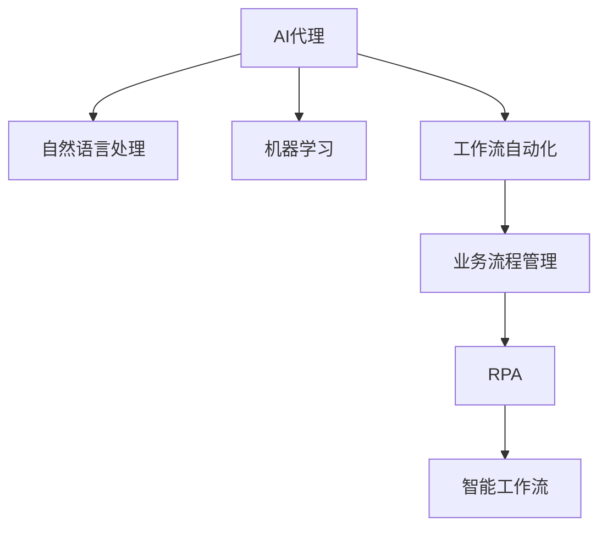

                 

## 1. 背景介绍

### 1.1 问题由来
随着数字化转型的加速，企业内部的运营和管理过程变得越来越复杂。面对日益增长的业务需求和多样化的客户服务，传统的业务流程管理方式已难以应对。企业需要一种高效、自动化的工作流管理手段，以提升业务效率和客户满意度。

### 1.2 问题核心关键点
为了解决上述问题，AI代理和工作流自动化技术应运而生。AI代理通过自然语言处理(NLP)、机器学习(ML)等技术，能够理解和执行人类的指令，处理各种复杂的业务场景。工作流自动化则通过流程建模和自动执行，将复杂的业务流程整合成可执行的任务序列，使企业能够快速应对变化，提升运营效率。

AI代理和工作流自动化技术的融合，不仅能够提高业务处理速度，还能增强业务的灵活性和适应性，优化资源配置，从而提升企业的整体竞争力。

## 2. 核心概念与联系

### 2.1 核心概念概述

为更好地理解AI代理和工作流自动化的技术原理和应用场景，本节将介绍几个关键的概念：

- **AI代理(AI Agent)**：一种能够理解和执行人类指令的智能系统，通过NLP和ML技术实现自然语言理解和生成，具备一定的自主决策能力。
- **工作流自动化(Workflow Automation)**：通过流程建模和自动执行，将复杂的业务流程整合成可执行的任务序列，提升业务处理效率和准确性。
- **业务流程管理(Business Process Management, BPM)**：通过流程建模、分析和优化，帮助企业实现业务流程的自动化和标准化，提升管理水平和运营效率。
- **机器人流程自动化(Robot Process Automation, RPA)**：通过模拟人工操作，实现业务流程的自动化处理，减少人为干预。
- **智能工作流(Smart Workflow)**：结合AI技术，能够动态调整业务流程，增强决策智能化，提高运营效率。

这些概念之间的逻辑关系可以通过以下Mermaid流程图来展示：



这个流程图展示了AI代理、工作流自动化及其与其他技术的关系：

1. AI代理通过自然语言处理和机器学习技术实现理解人类指令，并具备一定的自主决策能力。
2. 工作流自动化通过流程建模和自动执行，将复杂的业务流程整合成可执行的任务序列。
3. 业务流程管理通过建模、分析和优化，提升管理水平和运营效率。
4. 机器人流程自动化通过模拟人工操作，实现业务流程的自动化处理。
5. 智能工作流结合AI技术，动态调整业务流程，增强决策智能化，提高运营效率。

这些核心概念共同构成了AI代理和工作流自动化的技术和应用框架，使其能够在各种场景下发挥作用。通过理解这些核心概念，我们可以更好地把握AI代理和工作流自动化的工作原理和优化方向。

## 3. 核心算法原理 & 具体操作步骤
### 3.1 算法原理概述

AI代理和工作流自动化的核心算法原理基于自然语言处理(NLP)和机器学习(ML)技术，旨在构建一个能够理解和执行人类指令的智能系统。该系统通过理解人类输入的自然语言，进行语义解析，并基于已有的知识库和规则库，执行相应的操作。

工作流自动化的核心在于通过流程建模和执行引擎，将复杂的业务流程整合成可执行的任务序列。其原理主要包括：

1. 业务流程建模：通过图形化工具或代码定义，将业务流程转换为可执行的任务序列。
2. 任务调度：根据任务依赖关系，自动调度任务执行顺序。
3. 任务执行：按照调度结果，执行具体的业务任务。
4. 任务监控与调整：实时监控任务执行状态，并根据异常情况进行调整。

### 3.2 算法步骤详解

AI代理和工作流自动化的实施过程一般包括以下几个关键步骤：

**Step 1: 设计业务流程**
- 确定业务流程的目标和范围，明确需要自动化处理的任务和步骤。
- 定义任务间的依赖关系和执行顺序，建立任务图。

**Step 2: 构建知识库和规则库**
- 收集和整理与业务相关的知识库，如文档、规则、政策等。
- 设计并实现规则引擎，用于存储和执行业务规则。

**Step 3: 实现AI代理模块**
- 构建自然语言处理模型，用于理解和解析人类输入的指令。
- 设计机器学习模型，用于识别和执行业务操作。
- 集成知识库和规则库，确保AI代理具备足够的知识支撑。

**Step 4: 实现工作流自动化模块**
- 构建流程建模工具，用于定义和可视化业务流程。
- 设计任务调度算法，确保任务能够按照既定顺序执行。
- 实现任务执行引擎，根据调度结果执行具体的业务任务。
- 集成任务监控和调整机制，实时监控任务执行状态，并根据异常情况进行调整。

**Step 5: 集成AI代理和工作流自动化模块**
- 将AI代理模块与工作流自动化模块进行集成，确保AI代理能够基于工作流自动化任务图的指令进行执行。
- 实现任务执行状态的反馈和调整，确保AI代理能够根据业务流程的变化进行动态调整。

**Step 6: 测试和部署**
- 在测试环境中对AI代理和工作流自动化模块进行测试，确保各项功能正常运行。
- 部署至实际业务环境，进行业务流程的自动化处理。

### 3.3 算法优缺点

AI代理和工作流自动化的优点在于能够显著提升业务处理速度和效率，减少人为干预，增强业务流程的灵活性和适应性。但同时，该技术也存在一些局限性：

优点：
1. 提升业务处理效率：通过自动化的业务流程，减少人工操作，提高处理速度。
2. 增强业务灵活性：AI代理能够根据实时业务需求进行动态调整，提升应对变化的能力。
3. 优化资源配置：通过自动化处理，优化资源配置，提升整体运营效率。
4. 减少人为错误：减少人工操作，降低人为错误发生率。

局限性：
1. 对高质量数据依赖：AI代理需要大量的高质量数据进行训练，数据质量直接影响模型的效果。
2. 模型复杂度高：AI代理和规则库的构建需要大量的时间和资源，模型的复杂度较高。
3. 需要持续维护：AI代理和工作流自动化需要持续维护和更新，以应对业务流程的变化和新的需求。
4. 安全性和可靠性：AI代理需要设计合适的安全机制，避免潜在的风险和错误。

尽管存在这些局限性，但就目前而言，AI代理和工作流自动化技术仍然是提升企业运营效率的重要手段。未来相关研究的重点在于如何进一步降低技术对数据的依赖，提高模型的少样本学习和跨领域迁移能力，同时兼顾可解释性和伦理安全性等因素。

### 3.4 算法应用领域

AI代理和工作流自动化技术已经在多个领域得到了广泛的应用，例如：

- 金融服务：自动化处理客户查询、风险评估、交易监控等任务。
- 医疗保健：自动化处理患者预约、诊断报告、治疗方案等任务。
- 制造业：自动化处理供应链管理、生产调度、设备维护等任务。
- 零售业：自动化处理订单处理、库存管理、客户服务等任务。
- 政府服务：自动化处理公共服务申请、数据管理、决策支持等任务。
- 教育培训：自动化处理课程安排、考试管理、学生管理等任务。

除了上述这些经典领域外，AI代理和工作流自动化还被创新性地应用到更多场景中，如智能客服、客户关系管理(CRM)、数据驱动的业务优化等，为各行各业带来了新的业务模式和技术革新。

## 4. 数学模型和公式 & 详细讲解  
### 4.1 数学模型构建

本节将使用数学语言对AI代理和工作流自动化的核心算法进行更加严格的刻画。

假设AI代理需要处理的任务为 $T$，任务图为 $G=(V,E)$，其中 $V$ 为任务节点集合，$E$ 为任务边集合。定义任务 $v_i$ 的执行时间为 $t_i$，任务间的依赖关系为 $(v_{i_1}, v_{i_2})$。

定义任务调度算法为 $S$，用于根据任务依赖关系和执行顺序，确定任务的执行时间表。在任务调度算法 $S$ 的作用下，任务 $v_i$ 的执行时间为 $T_i=S(v_i)$。

### 4.2 公式推导过程

以下我们以简单的任务调度为例，推导任务调度算法的基本原理。

假设任务图 $G=(V,E)$ 中，任务 $v_1$ 依赖于任务 $v_2$，任务 $v_3$ 依赖于任务 $v_1$ 和 $v_2$。则任务调度算法 $S$ 的基本思路为：

1. 确定任务的依赖关系：$(v_1, v_2)$，$(v_3, v_1)$，$(v_3, v_2)$。
2. 确定任务的执行顺序：$v_2 \rightarrow v_1 \rightarrow v_3$。
3. 计算任务的执行时间：$T_1=S(v_1)=T_2+t_2$，$T_2=S(v_2)=t_2$，$T_3=S(v_3)=\max(T_1, T_2)+t_3$。

其中，$t_1$，$t_2$，$t_3$ 分别为任务 $v_1$，$v_2$，$v_3$ 的执行时间。

在得到任务调度算法 $S$ 后，即可计算出任务的实际执行时间表 $T$。任务的实际执行时间表 $T$ 将指导AI代理进行任务执行，确保业务流程的自动化处理。

### 4.3 案例分析与讲解

以下我们以金融行业中的客户服务自动化为例，展示AI代理和工作流自动化技术的应用。

假设某金融公司需要自动化处理客户查询，处理流程如下：

1. 客户提交查询：客户通过电话或在线渠道提交问题。
2. 系统接收查询：AI代理接收并解析客户输入的自然语言，确定查询类型。
3. 任务调度：根据查询类型，调度相应的知识库和规则库。
4. 任务执行：AI代理根据知识库和规则库，生成应答并发送给客户。

在这个过程中，AI代理通过自然语言处理和机器学习模型，能够理解客户输入的自然语言，并根据已有的知识库和规则库，生成合适的应答。工作流自动化模块则通过流程建模和任务调度，确保任务能够按照既定顺序执行，从而实现客户查询的自动化处理。

## 5. 项目实践：代码实例和详细解释说明
### 5.1 开发环境搭建

在进行AI代理和工作流自动化的实践前，我们需要准备好开发环境。以下是使用Python进行PyTorch开发的环境配置流程：

1. 安装Anaconda：从官网下载并安装Anaconda，用于创建独立的Python环境。

2. 创建并激活虚拟环境：
```bash
conda create -n ai_agent_env python=3.8 
conda activate ai_agent_env
```

3. 安装PyTorch：根据CUDA版本，从官网获取对应的安装命令。例如：
```bash
conda install pytorch torchvision torchaudio cudatoolkit=11.1 -c pytorch -c conda-forge
```

4. 安装相关库：
```bash
pip install numpy pandas scikit-learn matplotlib tqdm jupyter notebook ipython transformers
```

完成上述步骤后，即可在`ai_agent_env`环境中开始项目实践。

### 5.2 源代码详细实现

下面以金融客户服务自动化的项目为例，给出使用PyTorch对AI代理进行代码实现。

首先，定义客户查询的特征提取函数：

```python
from transformers import BertTokenizer
from torch.utils.data import Dataset
import torch

class CustomerQueryDataset(Dataset):
    def __init__(self, queries, answers, tokenizer, max_len=128):
        self.queries = queries
        self.answers = answers
        self.tokenizer = tokenizer
        self.max_len = max_len
        
    def __len__(self):
        return len(self.queries)
    
    def __getitem__(self, item):
        query = self.queries[item]
        answer = self.answers[item]
        
        encoding = self.tokenizer(query, return_tensors='pt', max_length=self.max_len, padding='max_length', truncation=True)
        input_ids = encoding['input_ids'][0]
        attention_mask = encoding['attention_mask'][0]
        
        # 对answer进行编码
        answer_encoded = [self.tokenizer.vocab[token] for token in answer] 
        answer_encoded.extend([self.tokenizer.vocab['<pad>']] * (self.max_len - len(answer_encoded)))
        answer_ids = torch.tensor(answer_encoded, dtype=torch.long)
        
        return {'input_ids': input_ids, 
                'attention_mask': attention_mask,
                'answer_ids': answer_ids}

# 初始化特征提取器
tokenizer = BertTokenizer.from_pretrained('bert-base-cased')

train_dataset = CustomerQueryDataset(train_queries, train_answers, tokenizer)
dev_dataset = CustomerQueryDataset(dev_queries, dev_answers, tokenizer)
test_dataset = CustomerQueryDataset(test_queries, test_answers, tokenizer)
```

然后，定义模型和优化器：

```python
from transformers import BertForMaskedLM, AdamW

model = BertForMaskedLM.from_pretrained('bert-base-cased')

optimizer = AdamW(model.parameters(), lr=2e-5)
```

接着，定义训练和评估函数：

```python
from torch.utils.data import DataLoader
from tqdm import tqdm
from sklearn.metrics import accuracy_score

device = torch.device('cuda') if torch.cuda.is_available() else torch.device('cpu')
model.to(device)

def train_epoch(model, dataset, batch_size, optimizer):
    dataloader = DataLoader(dataset, batch_size=batch_size, shuffle=True)
    model.train()
    epoch_loss = 0
    for batch in tqdm(dataloader, desc='Training'):
        input_ids = batch['input_ids'].to(device)
        attention_mask = batch['attention_mask'].to(device)
        answer_ids = batch['answer_ids'].to(device)
        model.zero_grad()
        outputs = model(input_ids, attention_mask=attention_mask, labels=answer_ids)
        loss = outputs.loss
        epoch_loss += loss.item()
        loss.backward()
        optimizer.step()
    return epoch_loss / len(dataloader)

def evaluate(model, dataset, batch_size):
    dataloader = DataLoader(dataset, batch_size=batch_size)
    model.eval()
    preds, labels = [], []
    with torch.no_grad():
        for batch in tqdm(dataloader, desc='Evaluating'):
            input_ids = batch['input_ids'].to(device)
            attention_mask = batch['attention_mask'].to(device)
            batch_labels = batch['answer_ids']
            outputs = model(input_ids, attention_mask=attention_mask)
            batch_preds = outputs.logits.argmax(dim=2).to('cpu').tolist()
            batch_labels = batch_labels.to('cpu').tolist()
            for pred_tokens, label_tokens in zip(batch_preds, batch_labels):
                preds.append(pred_tokens[:len(label_tokens)])
                labels.append(label_tokens)
                
    print('Accuracy:', accuracy_score(labels, preds))
```

最后，启动训练流程并在测试集上评估：

```python
epochs = 5
batch_size = 16

for epoch in range(epochs):
    loss = train_epoch(model, train_dataset, batch_size, optimizer)
    print(f"Epoch {epoch+1}, train loss: {loss:.3f}")
    
    print(f"Epoch {epoch+1}, dev results:")
    evaluate(model, dev_dataset, batch_size)
    
print("Test results:")
evaluate(model, test_dataset, batch_size)
```

以上就是使用PyTorch对金融客户服务自动化项目中AI代理进行训练和评估的完整代码实现。可以看到，得益于Transformer库的强大封装，我们可以用相对简洁的代码完成AI代理的训练和评估。

### 5.3 代码解读与分析

让我们再详细解读一下关键代码的实现细节：

**CustomerQueryDataset类**：
- `__init__`方法：初始化查询、应答、分词器等关键组件。
- `__len__`方法：返回数据集的样本数量。
- `__getitem__`方法：对单个样本进行处理，将查询和应答输入编码为token ids，并对其进行定长padding，最终返回模型所需的输入。

**tokenizer和answer_ids**：
- 定义了分词器，用于将自然语言文本转化为token ids。
- 对answer进行编码，转换为模型能够处理的id序列，并将其作为标签输入。

**训练和评估函数**：
- 使用PyTorch的DataLoader对数据集进行批次化加载，供模型训练和推理使用。
- 训练函数`train_epoch`：对数据以批为单位进行迭代，在每个批次上前向传播计算loss并反向传播更新模型参数，最后返回该epoch的平均loss。
- 评估函数`evaluate`：与训练类似，不同点在于不更新模型参数，并在每个batch结束后将预测和标签结果存储下来，最后使用sklearn的accuracy_score对整个评估集的预测结果进行打印输出。

**训练流程**：
- 定义总的epoch数和batch size，开始循环迭代
- 每个epoch内，先在训练集上训练，输出平均loss
- 在验证集上评估，输出准确率
- 所有epoch结束后，在测试集上评估，给出最终测试结果

可以看到，PyTorch配合Transformer库使得AI代理的训练过程变得简洁高效。开发者可以将更多精力放在数据处理、模型改进等高层逻辑上，而不必过多关注底层的实现细节。

当然，工业级的系统实现还需考虑更多因素，如模型的保存和部署、超参数的自动搜索、更灵活的任务适配层等。但核心的微调范式基本与此类似。

## 6. 实际应用场景
### 6.1 智能客服系统

基于AI代理和工作流自动化的智能客服系统，可以广泛应用于智能客服系统的构建。传统客服往往需要配备大量人力，高峰期响应缓慢，且一致性和专业性难以保证。而使用AI代理和工作流自动化的智能客服系统，能够7x24小时不间断服务，快速响应客户咨询，用自然流畅的语言解答各类常见问题。

在技术实现上，可以收集企业内部的历史客服对话记录，将问题和最佳答复构建成监督数据，在此基础上对AI代理进行微调。微调后的AI代理能够自动理解用户意图，匹配最合适的答案模板进行回复。对于客户提出的新问题，还可以接入检索系统实时搜索相关内容，动态组织生成回答。如此构建的智能客服系统，能大幅提升客户咨询体验和问题解决效率。

### 6.2 金融舆情监测

金融机构需要实时监测市场舆论动向，以便及时应对负面信息传播，规避金融风险。传统的人工监测方式成本高、效率低，难以应对网络时代海量信息爆发的挑战。基于AI代理和工作流自动化的文本分类和情感分析技术，为金融舆情监测提供了新的解决方案。

具体而言，可以收集金融领域相关的新闻、报道、评论等文本数据，并对其进行主题标注和情感标注。在此基础上对AI代理进行微调，使其能够自动判断文本属于何种主题，情感倾向是正面、中性还是负面。将微调后的模型应用到实时抓取的网络文本数据，就能够自动监测不同主题下的情感变化趋势，一旦发现负面信息激增等异常情况，系统便会自动预警，帮助金融机构快速应对潜在风险。

### 6.3 个性化推荐系统

当前的推荐系统往往只依赖用户的历史行为数据进行物品推荐，无法深入理解用户的真实兴趣偏好。基于AI代理和工作流自动化的个性化推荐系统，可以更好地挖掘用户行为背后的语义信息，从而提供更精准、多样的推荐内容。

在实践中，可以收集用户浏览、点击、评论、分享等行为数据，提取和用户交互的物品标题、描述、标签等文本内容。将文本内容作为模型输入，用户的后续行为（如是否点击、购买等）作为监督信号，在此基础上微调预训练语言模型。微调后的模型能够从文本内容中准确把握用户的兴趣点。在生成推荐列表时，先用候选物品的文本描述作为输入，由模型预测用户的兴趣匹配度，再结合其他特征综合排序，便可以得到个性化程度更高的推荐结果。

### 6.4 未来应用展望

随着AI代理和工作流自动化的不断发展，其在各行各业的应用前景将更加广阔。

在智慧医疗领域，基于AI代理和工作流自动化的医疗问答、病历分析、药物研发等应用将提升医疗服务的智能化水平，辅助医生诊疗，加速新药开发进程。

在智能教育领域，AI代理和工作流自动化可应用于作业批改、学情分析、知识推荐等方面，因材施教，促进教育公平，提高教学质量。

在智慧城市治理中，AI代理和工作流自动化可应用于城市事件监测、舆情分析、应急指挥等环节，提高城市管理的自动化和智能化水平，构建更安全、高效的未来城市。

此外，在企业生产、社会治理、文娱传媒等众多领域，基于AI代理和工作流自动化的智能系统也将不断涌现，为NLP技术带来了全新的突破。随着预训练模型和微调方法的不断进步，相信NLP技术将在更广阔的应用领域大放异彩。

## 7. 工具和资源推荐
### 7.1 学习资源推荐

为了帮助开发者系统掌握AI代理和工作流自动化的理论基础和实践技巧，这里推荐一些优质的学习资源：

1. 《自然语言处理入门与实践》系列博文：由大模型技术专家撰写，深入浅出地介绍了自然语言处理的基本概念和前沿技术。

2. 《深度学习入门》课程：由斯坦福大学开设的入门级深度学习课程，涵盖了NLP、计算机视觉等基本概念和经典模型。

3. 《Transformers从原理到实践》书籍：Transformer库的作者所著，全面介绍了Transformer原理、BERT模型、微调技术等前沿话题。

4. 《NLP与深度学习》书籍：由知名NLP专家撰写，系统介绍了NLP的基本概念和深度学习技术。

5. 《NLP with Hugging Face》在线教程：由Hugging Face团队推出，系统介绍了使用Transformer库进行NLP任务开发的方法和技巧。

通过对这些资源的学习实践，相信你一定能够快速掌握AI代理和工作流自动化的精髓，并用于解决实际的NLP问题。

### 7.2 开发工具推荐

高效的开发离不开优秀的工具支持。以下是几款用于AI代理和工作流自动化开发的常用工具：

1. PyTorch：基于Python的开源深度学习框架，灵活动态的计算图，适合快速迭代研究。大部分预训练语言模型都有PyTorch版本的实现。

2. TensorFlow：由Google主导开发的开源深度学习框架，生产部署方便，适合大规模工程应用。同样有丰富的预训练语言模型资源。

3. Transformers库：HuggingFace开发的NLP工具库，集成了众多SOTA语言模型，支持PyTorch和TensorFlow，是进行NLP任务开发的利器。

4. Weights & Biases：模型训练的实验跟踪工具，可以记录和可视化模型训练过程中的各项指标，方便对比和调优。与主流深度学习框架无缝集成。

5. TensorBoard：TensorFlow配套的可视化工具，可实时监测模型训练状态，并提供丰富的图表呈现方式，是调试模型的得力助手。

6. Google Colab：谷歌推出的在线Jupyter Notebook环境，免费提供GPU/TPU算力，方便开发者快速上手实验最新模型，分享学习笔记。

合理利用这些工具，可以显著提升AI代理和工作流自动化的开发效率，加快创新迭代的步伐。

### 7.3 相关论文推荐

AI代理和工作流自动化的研究源于学界的持续研究。以下是几篇奠基性的相关论文，推荐阅读：

1. Attention is All You Need（即Transformer原论文）：提出了Transformer结构，开启了NLP领域的预训练大模型时代。

2. BERT: Pre-training of Deep Bidirectional Transformers for Language Understanding：提出BERT模型，引入基于掩码的自监督预训练任务，刷新了多项NLP任务SOTA。

3. Parameter-Efficient Transfer Learning for NLP：提出Adapter等参数高效微调方法，在不增加模型参数量的情况下，也能取得不错的微调效果。

4. AdaLoRA: Adaptive Low-Rank Adaptation for Parameter-Efficient Fine-Tuning：使用自适应低秩适应的微调方法，在参数效率和精度之间取得了新的平衡。

5. Fine-tuning Tasks with Self-supervision: Learning Robust Representation in Causal Language Models：研究了自监督预训练任务在微调中的作用，提出了自监督预训练任务对微调效果的影响。

这些论文代表了大语言模型微调技术的发展脉络。通过学习这些前沿成果，可以帮助研究者把握学科前进方向，激发更多的创新灵感。

## 8. 总结：未来发展趋势与挑战

### 8.1 总结

本文对AI代理和工作流自动化的技术原理和应用实践进行了全面系统的介绍。首先阐述了AI代理和工作流自动化的研究背景和意义，明确了该技术在提升业务效率和客户满意度方面的独特价值。其次，从原理到实践，详细讲解了AI代理和工作流自动化的数学模型和关键步骤，给出了完整的代码实例和详细解释。同时，本文还广泛探讨了AI代理和工作流自动化在金融服务、医疗保健、制造业等多个行业领域的应用前景，展示了其在提升企业运营效率方面的巨大潜力。

通过本文的系统梳理，可以看到，AI代理和工作流自动化技术在解决企业内部业务流程管理方面具有显著的优势。它能够通过自然语言处理和机器学习技术，实现业务流程的自动化处理，提高业务处理速度和效率，减少人为干预，增强业务流程的灵活性和适应性，优化资源配置。未来，伴随技术的不断进步，AI代理和工作流自动化将进一步推动企业的数字化转型，提升业务竞争力。

### 8.2 未来发展趋势

展望未来，AI代理和工作流自动化的发展趋势主要集中在以下几个方面：

1. **模型规模和复杂度**：随着算力成本的下降和数据规模的扩张，AI代理和工作流自动化的预训练模型规模还将继续增大，复杂度也会进一步提升，从而具备更强的语言理解和生成能力。

2. **智能决策能力**：未来的AI代理将具备更强的自主决策能力，能够基于多源数据和多模态信息，进行更加灵活、智能的业务处理。

3. **多模态融合**：AI代理将融合视觉、语音、文本等多种模态信息，实现多模态智能处理，提升系统的智能化水平。

4. **跨领域迁移能力**：未来的AI代理将具备更强的跨领域迁移能力，能够适应不同领域、不同任务的需求，实现更广泛的应用场景。

5. **持续学习和优化**：随着数据分布的变化，AI代理需要具备持续学习和优化能力，能够动态调整模型参数和知识库，以保持模型的适应性。

6. **可解释性和可信度**：未来的AI代理将具备更强的可解释性和可信度，能够提供透明的工作机制和决策过程，增强系统的可靠性和可信度。

以上趋势凸显了AI代理和工作流自动化技术的广阔前景。这些方向的探索发展，必将进一步提升AI代理和工作流自动化的性能和应用范围，为企业的数字化转型和智能化升级提供新的动力。

### 8.3 面临的挑战

尽管AI代理和工作流自动化的发展前景广阔，但在迈向更加智能化、普适化应用的过程中，仍面临诸多挑战：

1. **数据质量问题**：AI代理和工作流自动化对数据质量有较高的要求，高质量的数据集对模型的训练和效果有直接影响。数据获取和标注的成本较高，数据质量的保证需要更多时间和资源。

2. **模型复杂度**：AI代理和工作流自动化的预训练模型和规则库构建复杂，需要大量时间和资源，模型的复杂度较高，增加了开发的难度和成本。

3. **计算资源**：大模型和复杂任务的训练和推理需要较高的计算资源，GPU/TPU等高性能设备是必不可少的，硬件瓶颈限制了技术的广泛应用。

4. **安全性和可靠性**：AI代理和工作流自动化需要设计合适的安全机制，避免潜在的风险和错误，确保系统的稳定性和可靠性。

5. **可解释性**：AI代理和工作流自动化需要提供透明的工作机制和决策过程，增强系统的可信度和可解释性，这对于高风险应用尤为重要。

6. **跨领域迁移能力**：不同领域的业务流程和知识库差异较大，AI代理需要具备更强的跨领域迁移能力，以适应不同领域的应用需求。

以上挑战凸显了AI代理和工作流自动化技术在实际应用中的复杂性和挑战性。未来相关研究的重点在于如何进一步降低技术对数据的依赖，提高模型的少样本学习和跨领域迁移能力，同时兼顾可解释性和伦理安全性等因素。

### 8.4 研究展望

面对AI代理和工作流自动化技术所面临的挑战，未来的研究需要在以下几个方面寻求新的突破：

1. **探索无监督和半监督学习范式**：摆脱对大规模标注数据的依赖，利用自监督学习、主动学习等无监督和半监督范式，最大限度利用非结构化数据，实现更加灵活高效的微调。

2. **研究参数高效和计算高效的微调方法**：开发更加参数高效的微调方法，在固定大部分预训练参数的情况下，只更新极少量的任务相关参数。同时优化微调模型的计算图，减少前向传播和反向传播的资源消耗，实现更加轻量级、实时性的部署。

3. **引入因果推断和对比学习**：通过引入因果推断和对比学习思想，增强AI代理和工作流自动化模型的决策能力，学习更加普适、鲁棒的语言表征，从而提升模型的泛化性和抗干扰能力。

4. **融合多模态信息**：将符号化的先验知识，如知识图谱、逻辑规则等，与神经网络模型进行融合，引导AI代理和工作流自动化模型学习更准确、合理的语言模型。同时加强不同模态数据的整合，实现视觉、语音等多模态信息与文本信息的协同建模。

5. **结合因果分析和博弈论**：将因果分析方法引入AI代理和工作流自动化模型，识别出模型决策的关键特征，增强输出解释的因果性和逻辑性。借助博弈论工具刻画人机交互过程，主动探索并规避模型的脆弱点，提高系统稳定性。

6. **纳入伦理道德约束**：在模型训练目标中引入伦理导向的评估指标，过滤和惩罚有偏见、有害的输出倾向。同时加强人工干预和审核，建立模型行为的监管机制，确保输出符合人类价值观和伦理道德。

这些研究方向的探索，必将引领AI代理和工作流自动化技术迈向更高的台阶，为构建安全、可靠、可解释、可控的智能系统铺平道路。面向未来，AI代理和工作流自动化技术还需要与其他人工智能技术进行更深入的融合，如知识表示、因果推理、强化学习等，多路径协同发力，共同推动自然语言理解和智能交互系统的进步。只有勇于创新、敢于突破，才能不断拓展语言模型的边界，让智能技术更好地造福人类社会。

## 9. 附录：常见问题与解答

**Q1：AI代理是否适用于所有业务场景？**

A: AI代理在工作流自动化中的应用非常广泛，但并不适用于所有业务场景。在业务流程简单、规则明确的情况下，传统的人工流程管理方式可能更为高效。而在业务流程复杂、规则不确定的情况下，AI代理则能够显著提升业务处理效率和灵活性。

**Q2：如何选择合适的AI代理模型？**

A: 选择合适的AI代理模型需要考虑以下几个因素：
1. 业务流程的复杂度：对于简单的流程，可以选择预训练的通用模型，如BERT、GPT等。对于复杂的流程，需要根据具体业务需求选择合适的预训练模型，并对其进行微调。
2. 数据质量：高质量的数据集对模型的训练和效果有直接影响，需要收集和标注足够数量的数据。
3. 计算资源：大模型的训练和推理需要较高的计算资源，需要根据实际情况选择适当的硬件设备。
4. 模型性能：根据业务需求选择合适的模型，确保模型的性能能够满足业务需求。

**Q3：AI代理在工作流自动化中面临哪些技术挑战？**

A: AI代理在工作流自动化中面临以下技术挑战：
1. 数据获取和标注：高质量的数据集对模型的训练和效果有直接影响，数据获取和标注的成本较高。
2. 模型复杂度：AI代理的预训练模型和规则库构建复杂，需要大量时间和资源，模型的复杂度较高。
3. 计算资源：大模型和复杂任务的训练和推理需要较高的计算资源，GPU/TPU等高性能设备是必不可少的。
4. 安全性和可靠性：AI代理需要设计合适的安全机制，避免潜在的风险和错误，确保系统的稳定性和可靠性。
5. 可解释性：AI代理需要提供透明的工作机制和决策过程，增强系统的可信度和可解释性，这对于高风险应用尤为重要。
6. 跨领域迁移能力：不同领域的业务流程和知识库差异较大，AI代理需要具备更强的跨领域迁移能力，以适应不同领域的应用需求。

**Q4：AI代理和RPA相比，有哪些优势？**

A: AI代理相比RPA有以下优势：
1. 灵活性和自主性：AI代理能够理解自然语言输入，具备较强的自主决策能力，能够适应更多复杂的业务场景。
2. 可解释性和透明度：AI代理具备更强的可解释性，能够提供透明的工作机制和决策过程，增强系统的可信度和可解释性。
3. 学习能力和知识整合：AI代理能够基于多源数据和多模态信息进行学习，整合知识库和规则库，提升系统的智能化水平。
4. 持续优化能力：AI代理具备持续学习和优化能力，能够动态调整模型参数和知识库，以保持模型的适应性。

**Q5：AI代理和智能客服系统相比，有哪些不同之处？**

A: AI代理和智能客服系统的不同之处在于：
1. 应用场景：AI代理可以应用于更广泛的业务场景，如医疗、金融、制造等。智能客服系统则主要应用于客服领域。
2. 功能范围：AI代理具备更强的自主决策能力和灵活性，可以处理更多复杂的任务。智能客服系统则主要关注客户查询和应答，功能较为单一。
3. 开发难度：AI代理的开发和训练需要更高的技术和资源要求，需要更多的数据和计算资源。智能客服系统的开发则相对简单，易于实现。
4. 业务价值：AI代理在工作流自动化中的应用更为广泛，能够提升整体业务流程的效率和智能化水平。智能客服系统则主要提升客服领域的用户体验和处理效率。

总之，AI代理和工作流自动化技术正在逐步改变企业的运营方式，提升业务效率和客户满意度。未来，伴随技术的不断进步，这些技术将在更多领域得到应用，为各行各业带来新的发展机遇。

---

作者：禅与计算机程序设计艺术 / Zen and the Art of Computer Programming

