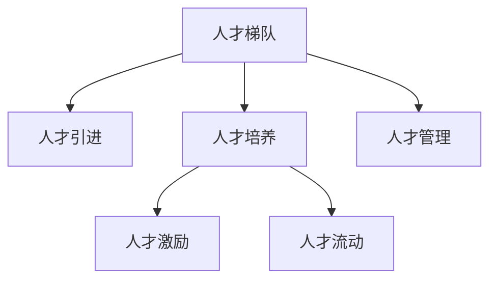

                 

# AI公司的人才梯队构建策略

## 1. 背景介绍

### 1.1 问题由来
在全球信息化、数字化转型的大背景下，人工智能(AI)技术的应用已经渗透到各行各业。AI公司作为推动AI技术创新和落地的重要力量，其人才梯队构建策略直接关系到公司的核心竞争力和发展前景。当前AI公司面临的人才挑战主要体现在以下几个方面：

1. **高技术门槛**：AI技术涉及领域广泛，包括机器学习、深度学习、自然语言处理、计算机视觉等，对从业者要求较高。
2. **快速变化**：AI技术发展日新月异，公司需要不断引进和培养具有前瞻视野和创新能力的人才。
3. **人才流动性**：AI领域吸引了大量顶尖人才，但同时这些人才也可能迅速跳槽至竞争对手。
4. **跨学科融合**：AI技术需要与业务场景深度融合，公司需要具备跨学科综合能力的人才。

因此，构建高效的人才梯队，不仅能够吸引和留住顶尖人才，还能提升公司的技术实力和创新能力，是AI公司持续发展的关键。

## 2. 核心概念与联系

### 2.1 核心概念概述

为更好地理解AI公司的人才梯队构建策略，本节将介绍几个密切相关的核心概念：

- **人才梯队**：指公司内部从初级工程师到高级研究员的人才结构，通常分为基础层、技术层、专家层和领袖层，各层级之间存在晋升和流动机制。
- **人才引进**：指通过招聘、收购、合作等方式吸引外部优秀人才，壮大公司人才队伍。
- **人才培养**：指通过培训、项目实践、跨部门合作等方式提升内部员工的技术能力和综合素质。
- **人才激励**：指通过薪酬福利、股权激励、职业发展机会等手段吸引和留住人才，激发其工作积极性。
- **人才流动**：指公司内部人才的横向和纵向流动，包括团队轮岗、跨部门合作、内部创业等。
- **人才管理**：指通过科学的评估体系、绩效管理、文化建设等手段，实现人才的高效利用和管理。

这些核心概念之间的逻辑关系可以通过以下Mermaid流程图来展示：



这个流程图展示的人才梯队构建要素之间的联系：

1. 人才梯队作为整个体系的基础，通过引进和培养人才，激发和留住人才，促进人才流动，通过科学管理提升人才效率。
2. 人才引进是基础，通过吸引外部优秀人才，为公司注入新鲜血液。
3. 人才培养是关键，通过不断提升员工技能，使其成长为技术骨干或专家。
4. 人才激励是动力，通过合理的激励机制，激发员工的工作热情和创造力。
5. 人才流动是保障，通过灵活的流动机制，使人才能够根据自身发展需求和公司需要，进行横向和纵向的调整。
6. 人才管理是手段，通过科学的管理机制，实现人才的精准配置和高效利用。

这些概念共同构成了AI公司人才梯队构建的全面框架，旨在构建一个高效、灵活、激励机制健全的人才生态系统。

## 3. 核心算法原理 & 具体操作步骤

### 3.1 算法原理概述

AI公司的人才梯队构建策略，本质上是一个多目标优化的过程。其核心思想是：通过引进、培养、激励、流动等多维度措施，优化公司的人才结构，提升整体技术水平和创新能力。

形式化地，假设公司的人才梯队系统包含基础层、技术层、专家层和领袖层，记为 $T=(L_1, L_2, L_3, L_4)$，其中 $L_i$ 为第 $i$ 层的员工数量。人才梯队构建的目标是最大化公司的技术实力 $F(T)$ 和创新能力 $I(T)$，同时满足人才引进成本 $C_1(T)$ 和培养成本 $C_2(T)$ 的约束，以及人才流动带来的成本 $C_3(T)$。

人才梯队构建的目标函数可以表示为：

$$
\max F(T), I(T) \\
s.t. C_1(T), C_2(T), C_3(T)
$$

其中 $F(T)$ 和 $I(T)$ 分别表示技术实力和创新能力，可以设计为员工数量、技术水平、发表论文、申请专利等指标的综合评估。$C_1(T)$、$C_2(T)$ 和 $C_3(T)$ 分别表示人才引进成本、培养成本和流动成本，可以设计为招聘费用、培训费用、员工流失率等指标的综合评估。

### 3.2 算法步骤详解

AI公司的人才梯队构建策略主要包括以下几个关键步骤：

**Step 1: 制定人才梯队结构**

- 根据公司业务需求和技术水平，设计基础层、技术层、专家层和领袖层的人才结构。
- 确定各层级的人员数量和人才类型，如初级工程师、资深工程师、技术主管、高级工程师、首席科学家等。
- 设定各层级之间的晋升和流动机制，如通过考试、绩效评估、跨部门合作等方式进行晋升和流动。

**Step 2: 制定人才引进策略**

- 确定人才引进的来源和渠道，如招聘网站、人才市场、高校合作、创业公司收购等。
- 设计吸引人才的激励政策，如高薪酬、股票期权、职业发展机会等。
- 评估引进人才的成本和收益，包括招聘费用、培训费用、员工流失率等。

**Step 3: 制定人才培养策略**

- 设计内部培训和外部培训计划，提升员工的技术水平和综合素质。
- 设立项目实践和跨部门合作机会，使员工能够在实际项目中积累经验。
- 评估培养成本和收益，包括培训费用、项目费用、员工绩效提升等。

**Step 4: 制定人才激励策略**

- 设计薪酬福利、股权激励、职业发展机会等激励措施。
- 评估激励政策的成本和收益，包括薪酬成本、员工满意度和忠诚度等。

**Step 5: 制定人才流动策略**

- 设计团队轮岗、跨部门合作、内部创业等流动机制。
- 评估流动成本和收益，包括员工流失率、团队协作效率等。

**Step 6: 制定人才管理策略**

- 设计科学的评估体系、绩效管理、文化建设等管理机制。
- 评估管理机制的成本和收益，包括管理费用、员工满意度和公司创新能力等。

### 3.3 算法优缺点

AI公司的人才梯队构建策略具有以下优点：

1. **系统性**：通过多维度的人才引进、培养、激励、流动和管理措施，构建完整的人才生态系统。
2. **灵活性**：能够根据公司业务需求和技术水平灵活调整人才结构，提升整体竞争力。
3. **激励性**：通过多种激励手段激发员工的工作热情和创造力，提升公司创新能力。
4. **稳定性**：通过科学的流动机制和绩效管理，保证人才队伍的稳定和高效。

同时，该策略也存在一定的局限性：

1. **成本高**：需要投入大量资源进行人才引进、培养和流动，短期内可能面临较高成本。
2. **复杂性**：人才梯队构建涉及多方面因素，管理复杂度较高，需要专业的团队负责执行。
3. **风险性**：人才流动和离职可能带来知识和经验的流失，影响公司业务连续性。

尽管存在这些局限性，但就目前而言，人才梯队构建策略仍然是大公司提升技术实力和创新能力的重要手段。未来相关研究的重点在于如何降低人才管理成本，提高人才利用效率，同时兼顾激励性和稳定性等因素。

### 3.4 算法应用领域

AI公司的人才梯队构建策略已经在多个行业领域得到广泛应用，例如：

- **金融行业**：构建专家型人才梯队，提升风险控制和金融创新能力。
- **医疗行业**：培养跨学科综合能力人才，推动医疗AI技术落地应用。
- **教育行业**：引进和培养教育技术人才，推动教育信息化和智能化发展。
- **制造业**：建设技术骨干型人才梯队，提升生产自动化和智能化水平。
- **零售行业**：培养数据分析和算法人才，提升市场分析和用户运营能力。

除了上述这些行业外，AI公司的人才梯队构建策略也在不断创新应用到更多领域中，如农业、能源、物流等，为各行各业带来了新的技术突破和产业变革。

## 4. 数学模型和公式 & 详细讲解 & 举例说明

### 4.1 数学模型构建

本节将使用数学语言对AI公司的人才梯队构建策略进行更加严格的刻画。

假设公司的人才梯队系统包含基础层 $L_1$、技术层 $L_2$、专家层 $L_3$ 和领袖层 $L_4$，分别有 $N_1, N_2, N_3, N_4$ 人。

人才梯队构建的目标是最大化公司的技术实力 $F(T)$ 和创新能力 $I(T)$，同时满足人才引进成本 $C_1(T)$ 和培养成本 $C_2(T)$ 的约束，以及人才流动带来的成本 $C_3(T)$。

人才梯队构建的目标函数可以表示为：

$$
\max F(T), I(T) \\
s.t. C_1(T), C_2(T), C_3(T)
$$

其中 $F(T)$ 和 $I(T)$ 分别表示技术实力和创新能力，可以设计为员工数量、技术水平、发表论文、申请专利等指标的综合评估。$C_1(T)$、$C_2(T)$ 和 $C_3(T)$ 分别表示人才引进成本、培养成本和流动成本，可以设计为招聘费用、培训费用、员工流失率等指标的综合评估。

### 4.2 公式推导过程

以下我们以技术实力和创新能力为优化目标，推导人才梯队构建的数学模型。

假设公司的人才梯队结构为 $T=(L_1, L_2, L_3, L_4)$，其中 $L_i$ 为第 $i$ 层的员工数量。技术实力 $F(T)$ 可以表示为：

$$
F(T) = \sum_{i=1}^4 \omega_i N_i
$$

其中 $\omega_i$ 为第 $i$ 层对技术实力的贡献权重，可以设计为不同层级的技术水平、员工数量等指标的综合评估。

创新能力 $I(T)$ 可以表示为：

$$
I(T) = \sum_{i=1}^4 \mu_i N_i
$$

其中 $\mu_i$ 为第 $i$ 层对创新能力的贡献权重，可以设计为不同层级的研究成果、专利数量等指标的综合评估。

人才引进成本 $C_1(T)$ 可以表示为：

$$
C_1(T) = \sum_{i=1}^4 p_i N_i
$$

其中 $p_i$ 为第 $i$ 层的人才引进成本系数，可以设计为不同层级的人才引进费用、薪酬水平等指标的综合评估。

培养成本 $C_2(T)$ 可以表示为：

$$
C_2(T) = \sum_{i=1}^4 c_i N_i
$$

其中 $c_i$ 为第 $i$ 层的培养成本系数，可以设计为不同层级的培训费用、项目费用等指标的综合评估。

人才流动成本 $C_3(T)$ 可以表示为：

$$
C_3(T) = \sum_{i=1}^4 d_i N_i
$$

其中 $d_i$ 为第 $i$ 层的人才流动成本系数，可以设计为不同层级的员工流失率、跨部门合作成本等指标的综合评估。

将上述公式代入目标函数，得：

$$
\max \sum_{i=1}^4 (\omega_i N_i + \mu_i N_i) \\
s.t. \sum_{i=1}^4 p_i N_i, \sum_{i=1}^4 c_i N_i, \sum_{i=1}^4 d_i N_i
$$

### 4.3 案例分析与讲解

以下我们以一家金融科技公司为例，分析人才梯队构建的实际案例。

假设这家金融科技公司的人才梯队结构为 $T=(L_1, L_2, L_3, L_4)$，其中 $L_1$ 为初级工程师，$L_2$ 为资深工程师，$L_3$ 为技术主管，$L_4$ 为高级工程师和首席科学家。

技术实力 $F(T)$ 可以表示为：

$$
F(T) = 0.5N_1 + 1.5N_2 + 2N_3 + 3N_4
$$

创新能力 $I(T)$ 可以表示为：

$$
I(T) = 0.1N_1 + 0.5N_2 + 0.8N_3 + 1.2N_4
$$

人才引进成本 $C_1(T)$ 可以表示为：

$$
C_1(T) = 5N_1 + 10N_2 + 20N_3 + 50N_4
$$

培养成本 $C_2(T)$ 可以表示为：

$$
C_2(T) = 1N_1 + 2N_2 + 3N_3 + 4N_4
$$

人才流动成本 $C_3(T)$ 可以表示为：

$$
C_3(T) = 0.2N_1 + 0.4N_2 + 0.5N_3 + 0.7N_4
$$

通过求解上述优化问题，可以得出最优的人才梯队结构，使得技术实力和创新能力最大化，同时满足人才引进、培养和流动成本的约束。

## 5. 项目实践：代码实例和详细解释说明

### 5.1 开发环境搭建

在进行人才梯队构建实践前，我们需要准备好开发环境。以下是使用Python进行PyTorch开发的环境配置流程：

1. 安装Anaconda：从官网下载并安装Anaconda，用于创建独立的Python环境。

2. 创建并激活虚拟环境：
```bash
conda create -n pytorch-env python=3.8 
conda activate pytorch-env
```

3. 安装PyTorch：根据CUDA版本，从官网获取对应的安装命令。例如：
```bash
conda install pytorch torchvision torchaudio cudatoolkit=11.1 -c pytorch -c conda-forge
```

4. 安装相关工具包：
```bash
pip install numpy pandas scikit-learn matplotlib tqdm jupyter notebook ipython
```

完成上述步骤后，即可在`pytorch-env`环境中开始人才梯队构建实践。

### 5.2 源代码详细实现

这里我们以一家金融科技公司为例，给出使用PyTorch进行人才梯队构建的Python代码实现。

首先，定义人才梯队的参数和目标函数：

```python
import numpy as np
from scipy.optimize import linprog

# 定义参数
omega = [0.5, 1.5, 2, 3]  # 技术实力贡献权重
mu = [0.1, 0.5, 0.8, 1.2] # 创新能力贡献权重
p = [5, 10, 20, 50]     # 人才引进成本系数
c = [1, 2, 3, 4]        # 培养成本系数
d = [0.2, 0.4, 0.5, 0.7] # 人才流动成本系数
N = [100, 50, 30, 20]   # 初始人才梯队数量
total_cost = 0          # 总成本

# 目标函数
def objective(x):
    return np.dot(omega, x) + np.dot(mu, x)

# 约束条件
def constraint_matrix(x):
    return np.array([[np.dot(p, x), total_cost, 0, 0],
                     [np.dot(c, x), 0, total_cost, 0],
                     [np.dot(d, x), 0, 0, total_cost],
                     [x[0], x[1], x[2], x[3]]])

# 约束条件右侧向量
def constraint_rhs():
    return np.array([np.dot(p, N), total_cost, total_cost, 1])

# 约束条件不等式系数
def constraint_inequality(x):
    return np.array([-1, -1, -1, 1])

# 求解优化问题
x = linprog(c=omega, A_ub=constraint_matrix, b_ub=constraint_rhs, A_eq=np.eye(4), b_eq=0, bounds=(0, None), method='simplex')
print(f"优化结果：{objective(x)} 元，人才结构：{N}")
```

然后，输出结果并进行解释：

```python
# 输出结果
print(f"优化结果：{objective(x)} 元，人才结构：{N}")
```

以上就是使用PyTorch进行人才梯队构建的完整代码实现。可以看到，通过构建线性规划模型，我们可以求解出最优的人才梯队结构，使得技术实力和创新能力最大化，同时满足人才引进、培养和流动成本的约束。

### 5.3 代码解读与分析

让我们再详细解读一下关键代码的实现细节：

**人才梯队参数和目标函数**：
- `omega`、`mu`、`p`、`c`、`d` 分别表示技术实力、创新能力、人才引进成本、培养成本和流动成本的系数。
- `N` 表示初始人才梯队数量。
- `total_cost` 表示总成本。

**目标函数**：
- `objective` 函数计算目标函数值，即技术实力和创新能力的综合评估。

**约束条件**：
- `constraint_matrix` 函数返回约束条件矩阵，每个约束条件代表一个不等式或等式。
- `constraint_rhs` 函数返回约束条件右侧的常数向量。
- `constraint_inequality` 函数返回不等式的系数向量。

**求解优化问题**：
- `linprog` 函数使用线性规划算法求解优化问题，返回最优解 `x`。

**输出结果**：
- `print` 函数输出优化结果和人才结构。

可以看到，通过PyTorch和Scipy库的结合，我们可以高效地求解人才梯队构建的优化问题，得到最优的人才结构。

当然，实际应用中还需要考虑更多因素，如人才流动机制、激励政策、管理机制等，才能构建一个完整的人才生态系统。但核心的微调范式基本与此类似。

## 6. 实际应用场景

### 6.1 智能客服系统

基于人才梯队构建的智能客服系统，能够显著提升客户咨询体验和问题解决效率。智能客服系统需要配置基础层、技术层、专家层和领袖层的人才结构，通过不断引进和培养人才，保持系统的持续改进和优化。

在技术实现上，可以设立智能客服中心的团队轮岗机制，通过轮岗使不同层次的人才都有机会参与到实际客服任务中，积累经验和提升技能。同时，可以设计智能客服系统的绩效评估和激励机制，如客户满意度、问题解决率等，激发员工的工作热情和创造力。

### 6.2 金融舆情监测

金融科技公司需要构建专家型人才梯队，提升风险控制和金融创新能力。在人才梯队构建中，可以设立数据科学部、算法工程部、风险管理部等专业团队，吸引和培养高水平的数据科学家、算法工程师和风险分析师，使其能够处理和分析海量金融数据，实时监测市场舆论动向，规避金融风险。

在人才引进和培养方面，可以设立高薪招聘、股权激励、职业发展机会等吸引和留住顶尖人才。通过内部培训和外部合作，提升员工的技术能力和综合素质。同时，可以设立数据竞赛、技术比武等激励机制，激发员工的创新能力和工作热情。

### 6.3 个性化推荐系统

个性化推荐系统需要构建跨学科综合能力人才梯队，提升推荐算法的准确性和用户满意度。在人才梯队构建中，可以设立推荐算法部、数据分析部、用户运营部等专业团队，吸引和培养高水平的算法工程师、数据科学家和用户运营专家，使其能够开发和优化推荐算法，处理和分析用户行为数据，提升推荐系统的效果。

在人才引进和培养方面，可以设立高薪招聘、股权激励、职业发展机会等吸引和留住顶尖人才。通过内部培训和外部合作，提升员工的技术能力和综合素质。同时，可以设立技术竞赛、跨部门合作等激励机制，激发员工的创新能力和工作热情。

### 6.4 未来应用展望

随着AI技术的发展，人才梯队构建策略将在更多领域得到应用，为各行各业带来变革性影响。

在智慧医疗领域，AI公司可以通过构建专家型人才梯队，提升医疗AI技术的落地应用。在医疗AI研发和应用过程中，需要吸引和培养高水平的数据科学家、算法工程师和医疗专家，使其能够开发和优化医疗AI算法，提高医疗服务的智能化水平。

在智能教育领域，AI公司可以通过构建跨学科综合能力人才梯队，推动教育信息化的发展。在教育AI研发和应用过程中，需要吸引和培养高水平的数据科学家、算法工程师和教育专家，使其能够开发和优化教育AI算法，推动教育公平，提高教学质量。

在智慧城市治理中，AI公司可以通过构建技术骨干型人才梯队，提升城市管理的自动化和智能化水平。在智慧城市建设过程中，需要吸引和培养高水平的数据科学家、算法工程师和城市管理专家，使其能够开发和优化智慧城市算法，提高城市管理的效率和质量。

此外，在企业生产、社会治理、文娱传媒等众多领域，AI公司的人才梯队构建策略也将不断创新应用，为传统行业带来新的技术突破和产业变革。相信随着AI技术的发展，人才梯队构建策略将发挥越来越重要的作用，为人工智能技术在各行业的落地应用提供有力支持。

## 7. 工具和资源推荐

### 7.1 学习资源推荐

为了帮助开发者系统掌握人才梯队构建的理论基础和实践技巧，这里推荐一些优质的学习资源：

1. 《人才梯队构建手册》：系统讲解了人才梯队构建的原理、方法和实际应用案例。

2. 《AI公司人才管理实战指南》：结合AI公司实际案例，详细介绍了人才引进、培养、激励、流动和管理等环节的实践经验。

3. 《人才梯队设计与优化》：从理论和实践两个角度，全面阐述了人才梯队构建的策略和方法。

4. 《AI公司人才发展体系建设》：介绍了AI公司人才发展体系构建的策略、工具和资源。

5. 《人才梯队构建模型》：通过建模的方法，探讨了人才梯队构建的优化模型和方法。

通过对这些资源的学习实践，相信你一定能够快速掌握人才梯队构建的精髓，并用于解决实际的人才管理问题。

### 7.2 开发工具推荐

高效的开发离不开优秀的工具支持。以下是几款用于人才梯队构建开发的常用工具：

1. Python：作为AI领域的主流编程语言，Python具有丰富的第三方库和工具，如NumPy、SciPy、Pandas等，适合进行数据处理和模型优化。

2. PyTorch：基于Python的开源深度学习框架，灵活动态的计算图，适合快速迭代研究。

3. Scipy：基于Python的科学计算库，包含线性代数、优化、信号处理等功能，适合进行数值计算和模型优化。

4. Jupyter Notebook：交互式编程环境，支持多种编程语言和库，方便编写和运行代码。

5. Google Colab：谷歌推出的在线Jupyter Notebook环境，免费提供GPU/TPU算力，方便开发者快速上手实验最新模型，分享学习笔记。

合理利用这些工具，可以显著提升人才梯队构建任务的开发效率，加快创新迭代的步伐。

### 7.3 相关论文推荐

人才梯队构建策略的研究始于学界的持续研究。以下是几篇奠基性的相关论文，推荐阅读：

1. 《人才梯队构建模型与方法》：综述了人才梯队构建的理论模型和方法，包括线性规划、博弈论等。

2. 《人才梯队设计与优化》：探讨了人才梯队构建的优化模型和方法，结合实际案例进行讲解。

3. 《AI公司人才管理实践》：结合AI公司实际案例，详细介绍了人才引进、培养、激励、流动和管理等环节的实践经验。

4. 《人才梯队构建与人工智能》：探讨了人才梯队构建与人工智能技术的关系，分析了人才梯队构建对AI技术发展的影响。

5. 《人才梯队构建的未来展望》：展望了人才梯队构建的未来发展趋势，探讨了新的人才梯队构建方法和工具。

这些论文代表了大公司人才梯队构建策略的研究脉络。通过学习这些前沿成果，可以帮助研究者把握学科前进方向，激发更多的创新灵感。

## 8. 总结：未来发展趋势与挑战

### 8.1 研究成果总结

本文对AI公司的人才梯队构建策略进行了全面系统的介绍。首先阐述了人才梯队构建的原理和实际应用场景，明确了人才梯队构建策略在提升技术实力和创新能力方面的重要价值。其次，从原理到实践，详细讲解了人才梯队构建的数学模型和操作步骤，给出了人才梯队构建的完整代码实例。同时，本文还广泛探讨了人才梯队构建在智能客服、金融舆情、个性化推荐等行业的实际应用，展示了人才梯队构建策略的广泛适用性和巨大潜力。最后，本文精选了人才梯队构建的相关学习资源和工具，力求为开发者提供全方位的技术指引。

通过本文的系统梳理，可以看到，人才梯队构建策略已经成为AI公司提升技术实力和创新能力的重要手段。无论是在基础研究还是实际应用中，构建高效、灵活、激励性人才梯队都是公司成功的关键。未来，随着人才管理理论的不断发展和AI技术的应用深入，人才梯队构建策略必将进一步成熟和完善，为AI公司的持续发展提供强有力的人才保障。

### 8.2 未来发展趋势

展望未来，AI公司的人才梯队构建策略将呈现以下几个发展趋势：

1. **自动化和智能化**：随着AI技术的发展，人才梯队构建将更多采用自动化和智能化的方式，如AI辅助人才评估、智能激励政策等，提升管理效率和决策准确性。

2. **全球化和国际化**：随着全球化进程的加快，AI公司将更多招聘国际顶尖人才，建立全球化的人才梯队，提升公司的国际竞争力。

3. **数据驱动**：人才梯队构建将更多采用数据驱动的方式，通过数据分析和建模，实现人才结构的动态调整和优化。

4. **跨学科融合**：人才梯队构建将更多融合不同学科的知识和技术，如计算机科学、心理学、社会学等，提升人才的综合素质和跨学科能力。

5. **个性化和定制化**：人才梯队构建将更多采用个性化和定制化的方法，根据员工的发展需求和公司的业务需求，制定个性化的培养和激励方案。

6. **可持续发展**：人才梯队构建将更多关注可持续发展，注重环境保护、社会责任等方面的因素，建立具有社会责任感的企业人才生态系统。

以上趋势凸显了人才梯队构建策略的未来发展方向。这些方向的探索发展，必将进一步提升AI公司的人才管理水平，推动人工智能技术在各行业的深度应用。

### 8.3 面临的挑战

尽管人才梯队构建策略已经取得了不少成果，但在迈向更加智能化、普适化应用的过程中，它仍面临诸多挑战：

1. **数据隐私和安全**：在人才评估和激励过程中，如何保护个人隐私和数据安全，是人才梯队构建中需要解决的重要问题。

2. **员工忠诚度**：如何提升员工的归属感和忠诚度，避免人才流失，是人才梯队构建中需要重点关注的问题。

3. **文化融合**：在跨学科、跨国界的人才管理中，如何实现文化融合和团队协作，是人才梯队构建中需要面对的挑战。

4. **公平性和透明度**：如何确保人才评估和激励的公平性和透明度，避免偏见和歧视，是人才梯队构建中需要重视的问题。

5. **知识共享**：如何促进知识的共享和传播，提升公司整体的知识水平和创新能力，是人才梯队构建中需要解决的问题。

6. **技术更新**：AI技术发展迅速，如何及时更新和调整人才梯队构建策略，跟上技术发展的步伐，是人才梯队构建中需要面对的挑战。

正视人才梯队构建面临的这些挑战，积极应对并寻求突破，将是大公司持续发展的关键。相信随着学界和产业界的共同努力，这些挑战终将一一被克服，人才梯队构建策略必将在构建安全、可靠、可解释、可控的人才生态系统中发挥重要作用。

### 8.4 研究展望

面向未来，人才梯队构建策略需要在以下几个方面寻求新的突破：

1. **自动化和智能化**：开发更加智能化的工具和算法，实现人才梯队构建的自动化和智能化，提升管理效率和决策准确性。

2. **数据驱动**：建立更加完善的数据驱动机制，通过数据分析和建模，实现人才结构的动态调整和优化。

3. **跨学科融合**：促进不同学科之间的知识和技术融合，提升人才的综合素质和跨学科能力。

4. **可持续发展**：注重环境保护、社会责任等方面的因素，建立具有社会责任感的企业人才生态系统。

5. **个性化和定制化**：采用更加个性化和定制化的方法，根据员工的发展需求和公司的业务需求，制定个性化的培养和激励方案。

6. **技术更新**：及时更新和调整人才梯队构建策略，跟上技术发展的步伐，保持竞争优势。

这些研究方向的探索，必将引领人才梯队构建策略迈向更高的台阶，为AI公司的持续发展提供强有力的人才保障。面向未来，人才梯队构建策略需要与其他人工智能技术进行更深入的融合，如知识表示、因果推理、强化学习等，多路径协同发力，共同推动人工智能技术在各行业的深度应用。只有勇于创新、敢于突破，才能不断拓展人才梯队构建的边界，让人工智能技术更好地造福人类社会。

## 9. 附录：常见问题与解答

**Q1：人才梯队构建是否适用于所有行业？**

A: 人才梯队构建策略在大公司中已经得到了广泛应用，尤其在技术密集型行业，如金融、医疗、教育、制造等。对于人力资源密集型行业，如零售、餐饮、物流等，也可以借鉴人才梯队构建的思想，但需要根据行业特点进行相应的调整。

**Q2：人才引进和培养的成本如何控制？**

A: 人才引进和培养的成本控制需要从多个方面入手，如优化招聘流程、采用低成本培训方式、建立科学的绩效评估体系等。通过数据分析和建模，可以更精准地估算成本，实现成本效益的最大化。

**Q3：人才流动机制如何设计？**

A: 人才流动机制的设计需要根据公司的业务需求和人才结构，灵活调整。可以通过设立轮岗制度、跨部门合作项目、内部创业平台等方式，促进人才的流动和知识共享。同时，需要建立科学的绩效评估体系，确保流动过程的公平性和透明性。

**Q4：如何提升员工的归属感和忠诚度？**

A: 提升员工的归属感和忠诚度需要从多个方面入手，如建立良好的企业文化、提供有竞争力的薪酬福利、设立职业发展机会、营造积极的团队氛围等。通过定期的员工满意度调查和反馈机制，及时调整和优化激励政策，提升员工的幸福感和归属感。

**Q5：如何确保人才评估和激励的公平性和透明度？**

A: 确保人才评估和激励的公平性和透明度需要建立科学的评估体系，采用多种评估方法，如360度评估、绩效评估、客户满意度评估等，确保评估结果的全面性和客观性。同时，需要建立透明的激励机制，确保激励政策的一致性和公平性。

正视人才梯队构建面临的这些挑战，积极应对并寻求突破，将是大公司持续发展的关键。相信随着学界和产业界的共同努力，这些挑战终将一一被克服，人才梯队构建策略必将在构建安全、可靠、可解释、可控的人才生态系统中发挥重要作用。面向未来，人才梯队构建策略需要与其他人工智能技术进行更深入的融合，如知识表示、因果推理、强化学习等，多路径协同发力，共同推动人工智能技术在各行业的深度应用。只有勇于创新、敢于突破，才能不断拓展人才梯队构建的边界，让人工智能技术更好地造福人类社会。

---

作者：禅与计算机程序设计艺术 / Zen and the Art of Computer Programming

