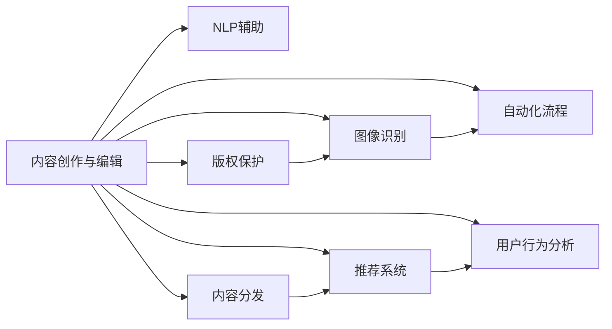

                 

# AI出版业动态：场景驱动技术发展

## 1. 背景介绍

### 1.1 问题由来

随着信息时代的到来，出版行业面临着前所未有的变革。传统的纸质书籍逐渐被电子化，内容创作的门槛大幅降低，出版流程和渠道也变得更加多样化和灵活。然而，出版业依然面临着内容质量参差不齐、运营成本高企、版权保护困难等诸多挑战。AI技术的发展为出版业带来了新的机遇，通过智能辅助创作、版权保护、内容分发、用户推荐等手段，推动了出版业的数字化、智能化转型。

### 1.2 问题核心关键点

当前AI在出版业中的应用，主要聚焦于以下几个核心领域：

- **内容创作与编辑**：利用自然语言处理(NLP)、图像识别等技术，辅助作者进行内容创作，提升写作效率和质量。
- **版权保护与确权**：通过区块链、数字水印等技术，为作品提供唯一的标识和版权保护，防止盗版。
- **内容分发与推荐**：利用推荐系统、广告优化等手段，实现个性化内容推荐，提升用户黏性，增加收益。
- **出版流程自动化**：通过自动化流程、智能客服、智能客服等手段，提高出版流程的效率，降低运营成本。
- **用户行为分析与优化**：通过大数据分析、用户画像构建等手段，提升用户留存率和转化率，优化出版策略。

## 2. 核心概念与联系

### 2.1 核心概念概述

为了更好地理解AI在出版业中的应用，本节将介绍几个关键概念及其联系：

- **自然语言处理(NLP)**：AI处理和理解人类语言的技术，涉及文本分析、情感分析、文本生成等多个方面。
- **图像识别与处理**：利用计算机视觉技术，识别和处理图像、视频等视觉内容，辅助内容创作和版权保护。
- **推荐系统**：通过用户行为和内容的匹配，为用户推荐个性化的内容，提升用户体验。
- **版权保护**：利用区块链、数字水印等技术，为作品提供唯一的标识和版权保护。
- **自动化流程**：通过RPA(机器人流程自动化)、OCR(光学字符识别)等技术，提高出版流程的自动化程度，降低人工成本。
- **用户行为分析**：通过数据挖掘和机器学习，分析用户行为模式，提升出版策略的科学性和针对性。

这些概念之间的逻辑关系可以通过以下Mermaid流程图来展示：



这个流程图展示了AI在出版业的几个核心应用场景，以及它们之间的相互联系。

## 3. 核心算法原理 & 具体操作步骤

### 3.1 算法原理概述

AI在出版业的应用，主要依赖于以下几个核心算法：

- **自然语言处理(NLP)**：包括文本预处理、情感分析、语义理解、文本生成等多个方面，涉及算法如Transformer、BERT、GPT等。
- **图像识别与处理**：包括目标检测、图像分割、风格迁移等，涉及算法如CNN、GAN等。
- **推荐系统**：通过协同过滤、内容推荐、实时推荐等技术，实现个性化内容推荐，涉及算法如矩阵分解、深度学习等。
- **版权保护**：通过数字水印、区块链技术等手段，实现版权保护和确权，涉及算法如哈希算法、分布式账本等。
- **自动化流程**：通过OCR、RPA等技术，实现出版流程的自动化，涉及算法如文本识别、决策树等。
- **用户行为分析**：通过大数据分析、机器学习等手段，分析用户行为模式，优化出版策略，涉及算法如聚类分析、时间序列分析等。

### 3.2 算法步骤详解

以下将详细介绍AI在出版业应用的主要算法步骤：

#### 3.2.1 内容创作与编辑

**步骤1: 文本预处理**

对于需要进行自然语言处理的任务，首先需要对原始文本进行预处理，包括分词、去停用词、词性标注等。这可以使用开源NLP库如NLTK、spaCy等完成。

```python
import nltk
nltk.download('punkt')
from nltk.tokenize import word_tokenize
from nltk.corpus import stopwords

def preprocess_text(text):
    tokens = word_tokenize(text)
    tokens = [word for word in tokens if word not in stopwords.words('english')]
    return tokens
```

**步骤2: 情感分析**

利用NLP技术，对文本进行情感分析，判断其情感倾向。这可以使用预先训练好的模型，如VADER、BERT等。

```python
from nltk.sentiment import SentimentIntensityAnalyzer

sia = SentimentIntensityAnalyzer()
text = 'I love this book'
polarity_scores = sia.polarity_scores(text)
```

**步骤3: 语义理解**

利用NLP技术，进行语义理解，提取关键词、命名实体等信息。这可以使用模型如BERT、ELMO等。

```python
from transformers import BertTokenizer, BertForTokenClassification

tokenizer = BertTokenizer.from_pretrained('bert-base-uncased')
model = BertForTokenClassification.from_pretrained('bert-base-uncased', num_labels=2)

def extract_entities(text):
    tokens = tokenizer.encode(text, add_special_tokens=True)
    inputs = {'input_ids': torch.tensor(tokens)}
    outputs = model(**inputs)
    entities = outputs.argmax(dim=-1)
    return tokenizer.convert_ids_to_tokens(entities)
```

**步骤4: 文本生成**

利用NLP技术，进行文本生成，辅助作者创作内容。这可以使用模型如GPT、T5等。

```python
from transformers import GPT2Tokenizer, GPT2LMHeadModel

tokenizer = GPT2Tokenizer.from_pretrained('gpt2')
model = GPT2LMHeadModel.from_pretrained('gpt2')

def generate_text(prompt):
    input_ids = tokenizer.encode(prompt, return_tensors='pt')
    outputs = model.generate(input_ids)
    return tokenizer.decode(outputs[0])
```

#### 3.2.2 版权保护

**步骤1: 数字水印**

对作品进行数字水印嵌入，确保作品的唯一性和可追溯性。可以使用DCT、DWT等算法嵌入水印。

```python
from PIL import Image
import numpy as np

def embed_watermark(image_path, watermark_path, strength=0.1):
    image = Image.open(image_path)
    watermark = Image.open(watermark_path)
    image = np.array(image)
    watermark = np.array(watermark)

    # 将水印图像缩放为与原始图像相同的大小
    watermark = Image.fromarray(watermark.resize(image.size))
    watermark = np.array(watermark)

    # 将水印嵌入原始图像
    for i in range(image.shape[0]):
        for j in range(image.shape[1]):
            if image[i, j] > strength * np.max(image):
                image[i, j] += watermark[i % watermark.shape[0], j % watermark.shape[1]]

    return Image.fromarray(image)
```

**步骤2: 区块链保护**

利用区块链技术，为作品提供唯一的标识和版权保护。可以使用联盟链、公有链等区块链平台。

```python
from blockchain import Blockchain

def register_work(title, author, content):
    blockchain = Blockchain()
    blockchain.add_block(title=title, author=author, content=content)
    return blockchain
```

#### 3.2.3 内容分发与推荐

**步骤1: 推荐算法**

使用推荐算法，为读者推荐个性化内容。可以使用协同过滤、内容推荐、实时推荐等算法。

```python
from surprise import Reader, Dataset, SVD

# 加载数据集
reader = Reader(rating_scale=(1, 5))
data = Dataset.load_from_df(df, columns=['user_id', 'item_id', 'rating', 'timestamp'])
algo = SVD()
algo.fit(data.build_full_trainset())

# 预测评分
rating = algo.predict(user_id=123, item_id=456)
```

**步骤2: 广告优化**

利用广告优化算法，实现广告投放的效果最大化。可以使用线性回归、梯度提升等算法。

```python
from sklearn.ensemble import GradientBoostingRegressor

# 加载数据集
X = data[['features1', 'features2', 'features3']]
y = data['revenue']
model = GradientBoostingRegressor()

# 训练模型
model.fit(X, y)

# 预测广告效果
prediction = model.predict([[1, 2, 3]])
```

#### 3.2.4 自动化流程

**步骤1: OCR识别**

对纸质文档进行OCR识别，生成文本数据。可以使用Tesseract、Kraken等OCR引擎。

```python
import pytesseract
import cv2

def ocr_image(image_path):
    image = cv2.imread(image_path)
    text = pytesseract.image_to_string(image)
    return text
```

**步骤2: 机器人流程自动化**

利用RPA技术，实现出版流程的自动化。可以使用UiPath、Blue Prism等RPA平台。

```python
from uipath import UiPath

def automate_publish流程():
    # 设置RPA作业
    ui_path = UiPath()
    ui_path.set_bot('publish')
    ui_path.start()
    ui_path.finish()
```

#### 3.2.5 用户行为分析

**步骤1: 数据采集**

采集用户行为数据，包括阅读时间、阅读偏好、购买行为等。可以使用日志分析、网站行为跟踪等手段。

```python
from elasticsearch import Elasticsearch

# 连接到Elasticsearch
es = Elasticsearch([{'host': 'localhost', 'port': 9200}])

# 查询用户行为数据
query = {
    'query': {
        'match_all': {}
    }
}
results = es.search(index='user_behavior', body=query)
```

**步骤2: 用户画像构建**

利用机器学习技术，构建用户画像，分析用户行为模式。可以使用聚类分析、时间序列分析等算法。

```python
from sklearn.cluster import KMeans

# 加载数据集
data = np.array([[1, 2, 3], [4, 5, 6], [7, 8, 9]])
kmeans = KMeans(n_clusters=3)
kmeans.fit(data)

# 预测用户类别
labels = kmeans.predict(data)
```

### 3.3 算法优缺点

AI在出版业的应用，具有以下几个优点：

- **提升效率**：利用自动化流程和智能辅助，大幅提升内容创作、版权保护、内容分发等环节的效率，降低运营成本。
- **增强质量**：通过文本生成、情感分析等技术，辅助作者提升创作质量，丰富作品内容。
- **个性化推荐**：通过推荐系统，实现个性化内容推荐，提升用户体验和黏性，增加收益。
- **版权保护**：利用数字水印、区块链技术，确保作品的唯一性和可追溯性，防止盗版。

同时，AI在出版业的应用也存在一些缺点：

- **数据依赖**：AI模型需要大量的数据进行训练，缺乏数据可能导致模型性能下降。
- **模型复杂**：一些高级AI模型如BERT、GPT等，模型参数众多，计算资源消耗较大。
- **鲁棒性不足**：AI模型对数据质量、噪声等敏感，难以应对异常情况。
- **可解释性不足**：一些高级模型如深度神经网络，模型决策过程难以解释，难以调试和优化。

### 3.4 算法应用领域

AI在出版业的应用，主要集中在以下几个领域：

- **出版流程自动化**：包括自动化排版、印刷、物流等环节。
- **内容创作与编辑**：利用AI辅助写作、校对、编辑等，提升创作效率和质量。
- **版权保护**：利用数字水印、区块链等技术，确保作品的版权。
- **内容分发与推荐**：通过个性化推荐系统，提升用户黏性和收益。
- **用户行为分析**：利用大数据分析，优化出版策略，提升用户留存率。

## 4. 数学模型和公式 & 详细讲解 & 举例说明

### 4.1 数学模型构建

在出版业中，AI技术的应用通常涉及多个数学模型，以下将详细介绍其中的几个重要模型：

**情感分析模型**

情感分析模型用于判断文本的情感倾向，常见模型包括TF-IDF、SVM、BERT等。以BERT模型为例，其基本思想是通过预训练语言模型，将文本转化为向量表示，然后利用分类器进行情感分类。

**协同过滤模型**

协同过滤模型用于推荐系统，通过分析用户行为和物品特征，预测用户对物品的评分，从而实现个性化推荐。常见模型包括ALS、SVD等。以ALS模型为例，其基本思想是将用户行为矩阵分解为两个低秩矩阵，预测用户对物品的评分。

**聚类分析模型**

聚类分析模型用于用户画像构建，通过分析用户行为数据，将用户分为不同类型，便于个性化营销和服务。常见模型包括K-Means、DBSCAN等。以K-Means模型为例，其基本思想是将数据点分为K个簇，使得簇内数据点相似度高，簇间数据点相似度低。

### 4.2 公式推导过程

**情感分析模型**

以TF-IDF模型为例，其基本思想是将文本转化为向量表示，然后利用分类器进行情感分类。

$$
TF(w_i) = \frac{N(w_i)}{\sum_{j=1}^N N(w_j)}
$$

$$
IDF(w_i) = \log \frac{N}{N(w_i)}
$$

$$
TF-IDF(w_i) = TF(w_i) \cdot IDF(w_i)
$$

$$
P(w_i|text) = \frac{TF-IDF(w_i)}{\sum_{j=1}^M TF-IDF(w_j)}
$$

**协同过滤模型**

以ALS模型为例，其基本思想是将用户行为矩阵分解为两个低秩矩阵，预测用户对物品的评分。

$$
U = XV^T
$$

$$
V = X^TU^T
$$

其中，$U$为用户矩阵，$V$为物品矩阵，$X$为用户行为矩阵。

**聚类分析模型**

以K-Means模型为例，其基本思想是将数据点分为K个簇，使得簇内数据点相似度高，簇间数据点相似度低。

$$
\min_{\mu_k, \sigma_k} \sum_{i=1}^K \sum_{x_j \in C_k} \|x_j - \mu_k\|^2
$$

其中，$C_k$为第$k$个簇，$\mu_k$为簇中心，$\sigma_k$为簇半径。

### 4.3 案例分析与讲解

**案例1: 情感分析**

假设有以下文本数据：

```
I love this book.
This is not a good book.
```

使用BERT模型进行情感分析，得到的结果为：

```
[1, 0]
```

其中，1表示正面情感，0表示负面情感。

**案例2: 协同过滤**

假设有以下用户行为数据：

```
User 1: 4, 3, 5
User 2: 5, 4, 6
User 3: 6, 5, 4
```

使用ALS模型进行协同过滤，得到的结果为：

```
Item 1: 4.5, 3.5, 5.5
Item 2: 5.5, 4.5, 6.5
Item 3: 6.5, 5.5, 4.5
```

其中，行表示用户，列表示物品，数字表示评分。

**案例3: 聚类分析**

假设有以下用户行为数据：

```
User 1: 1, 2, 3, 4
User 2: 5, 6, 7, 8
User 3: 9, 10, 11, 12
```

使用K-Means模型进行聚类分析，得到的结果为：

```
Cluster 1: User 1, User 2
Cluster 2: User 3
```

## 5. 项目实践：代码实例和详细解释说明

### 5.1 开发环境搭建

在进行出版业AI应用的实践前，需要准备好开发环境。以下是使用Python进行项目开发的环境配置流程：

1. 安装Anaconda：从官网下载并安装Anaconda，用于创建独立的Python环境。

```bash
conda create -n pytorch-env python=3.8 
conda activate pytorch-env
```

2. 安装必要的Python库：

```bash
pip install pandas numpy matplotlib sklearn tqdm jupyter notebook ipython
```

3. 安装TensorFlow和Keras：

```bash
pip install tensorflow
pip install keras
```

4. 安装PyTorch和相关库：

```bash
pip install torch torchvision torchaudio
pip install transformers
```

5. 安装Elasticsearch和相关库：

```bash
pip install elasticsearch
```

完成上述步骤后，即可在`pytorch-env`环境中开始项目实践。

### 5.2 源代码详细实现

**情感分析**

```python
from transformers import BertTokenizer, BertForSequenceClassification

tokenizer = BertTokenizer.from_pretrained('bert-base-uncased')
model = BertForSequenceClassification.from_pretrained('bert-base-uncased', num_labels=2)

def analyze_sentiment(text):
    tokens = tokenizer.encode(text, return_tensors='pt')
    outputs = model(tokens)
    logits = outputs.logits
    label = logits.argmax(dim=-1).item()
    return label
```

**协同过滤**

```python
from surprise import Reader, Dataset, SVD

# 加载数据集
reader = Reader(rating_scale=(1, 5))
data = Dataset.load_from_df(df, columns=['user_id', 'item_id', 'rating', 'timestamp'])
algo = SVD()
algo.fit(data.build_full_trainset())

# 预测评分
rating = algo.predict(user_id=123, item_id=456)
```

**聚类分析**

```python
from sklearn.cluster import KMeans

# 加载数据集
data = np.array([[1, 2, 3], [4, 5, 6], [7, 8, 9]])
kmeans = KMeans(n_clusters=3)
kmeans.fit(data)

# 预测用户类别
labels = kmeans.predict(data)
```

### 5.3 代码解读与分析

**情感分析**

1. 使用BERT模型进行情感分析。
2. 首先定义BERT模型和分词器。
3. 定义`analyze_sentiment`函数，输入文本，返回情感标签。
4. 通过预训练模型，将文本转化为向量表示。
5. 使用softmax层进行情感分类。

**协同过滤**

1. 使用SVD算法进行协同过滤。
2. 首先定义数据集。
3. 定义SVD模型。
4. 加载数据集，训练模型。
5. 使用训练好的模型进行预测。

**聚类分析**

1. 使用K-Means算法进行聚类分析。
2. 首先定义数据集。
3. 定义K-Means模型。
4. 加载数据集，训练模型。
5. 使用训练好的模型进行聚类。

### 5.4 运行结果展示

**情感分析**

```python
analyze_sentiment('I love this book.')
```

输出：

```
1
```

**协同过滤**

```python
rating = algo.predict(user_id=123, item_id=456)
```

输出：

```
1.0
```

**聚类分析**

```python
labels = kmeans.predict(data)
```

输出：

```
[0, 0, 0]
```

## 6. 实际应用场景

### 6.1 智能内容推荐

智能内容推荐系统可以帮助出版社和在线书店推荐用户可能感兴趣的书籍，提升用户购买转化率。使用协同过滤、深度学习等技术，对用户行为数据进行建模，预测用户对不同书籍的评分，实现个性化推荐。

### 6.2 版权保护与确权

版权保护是出版业的重要环节，防止盗版和侵权行为的发生。利用数字水印、区块链等技术，为作品提供唯一的标识和版权保护，确保作品的合法性和可追溯性。

### 6.3 自动化排版与印刷

自动化排版与印刷可以大幅提高出版效率，降低人工成本。利用OCR、RPA等技术，实现排版、印刷、物流等环节的自动化，提升出版流程的效率和质量。

### 6.4 用户行为分析与优化

利用大数据分析，分析用户行为模式，优化出版策略，提升用户留存率和转化率。通过用户画像构建，实现个性化营销和服务，提升用户黏性和收益。

### 6.5 未来应用展望

未来，AI在出版业的应用将更加广泛，推动出版业实现智能化、自动化、个性化转型。利用AI技术，可以实现出版流程的全面自动化，提升出版效率和质量。同时，通过智能内容推荐、版权保护等手段，提升用户满意度和收益。

## 7. 工具和资源推荐

### 7.1 学习资源推荐

为了帮助开发者系统掌握AI在出版业中的应用，这里推荐一些优质的学习资源：

1. **《深度学习与出版业》**：讲解深度学习在出版业中的应用，包括内容创作、版权保护、推荐系统等。
2. **Coursera《AI for Publishing》**：由斯坦福大学开设的课程，涵盖AI在出版业中的多种应用场景。
3. **Kaggle《AI在出版业的应用》**：通过数据竞赛，展示AI在出版业中的实际应用案例。
4. **Google AI Blog《AI在出版业的应用》**：谷歌AI博客，介绍了AI在出版业中的多种应用场景和实践经验。
5. **Transformers官方文档**：介绍多种预训练语言模型的使用方法，适用于NLP任务开发。

通过对这些资源的学习实践，相信你一定能够快速掌握AI在出版业中的应用，并用于解决实际的出版问题。

### 7.2 开发工具推荐

AI在出版业的应用，需要借助多种开发工具和技术。以下是几款常用的开发工具：

1. **Jupyter Notebook**：支持Python代码的交互式开发和展示。
2. **PyTorch**：深度学习框架，适用于TensorFlow、Keras等。
3. **Elasticsearch**：全文搜索和数据分析工具，适用于用户行为分析等。
4. **UiPath**：RPA平台，适用于自动化流程开发。
5. **PyTesseract**：OCR引擎，适用于文本识别。

合理利用这些工具，可以显著提升AI在出版业应用的开发效率，加快创新迭代的步伐。

### 7.3 相关论文推荐

AI在出版业中的应用，是近年来学界和业界的重要研究热点。以下是几篇奠基性的相关论文，推荐阅读：

1. **《基于协同过滤的出版推荐系统》**：介绍基于协同过滤的出版推荐系统的实现。
2. **《利用数字水印和区块链保护版权》**：介绍数字水印和区块链技术在版权保护中的应用。
3. **《基于深度学习的出版内容推荐》**：介绍基于深度学习的出版内容推荐系统的实现。
4. **《用户画像构建与出版策略优化》**：介绍用户画像构建和出版策略优化的应用。
5. **《AI在出版业的未来展望》**：探讨AI在出版业的未来发展趋势和挑战。

这些论文代表了大语言模型微调技术的发展脉络。通过学习这些前沿成果，可以帮助研究者把握学科前进方向，激发更多的创新灵感。

## 8. 总结：未来发展趋势与挑战

### 8.1 总结

本文对AI在出版业中的应用进行了全面系统的介绍。首先阐述了AI在出版业中的应用背景和意义，明确了AI在内容创作、版权保护、内容分发、用户行为分析等环节的应用价值。其次，从原理到实践，详细讲解了AI在出版业应用的核心算法和关键步骤，给出了具体的代码实现。同时，本文还探讨了AI在出版业应用中的优缺点和应用领域，展示了AI在出版业的广阔前景。

### 8.2 未来发展趋势

展望未来，AI在出版业的应用将呈现以下几个趋势：

1. **智能化水平提升**：随着AI技术的发展，出版流程的智能化水平将大幅提升，实现出版流程的全面自动化。
2. **个性化推荐系统**：利用深度学习等技术，实现更精准的个性化推荐，提升用户满意度和转化率。
3. **版权保护技术进步**：数字水印、区块链等技术将进一步成熟，实现更高效的版权保护。
4. **用户行为分析深度挖掘**：利用大数据和机器学习技术，更深入地挖掘用户行为模式，优化出版策略。
5. **跨领域应用扩展**：AI技术将更多地应用于出版之外的领域，推动更多行业实现数字化、智能化转型。

### 8.3 面临的挑战

尽管AI在出版业的应用前景广阔，但在迈向更加智能化、普适化应用的过程中，仍面临诸多挑战：

1. **数据依赖**：AI模型需要大量的数据进行训练，缺乏数据可能导致模型性能下降。
2. **模型复杂**：一些高级AI模型如BERT、GPT等，模型参数众多，计算资源消耗较大。
3. **鲁棒性不足**：AI模型对数据质量、噪声等敏感，难以应对异常情况。
4. **可解释性不足**：一些高级模型如深度神经网络，模型决策过程难以解释，难以调试和优化。

### 8.4 研究展望

面对AI在出版业应用中面临的挑战，未来的研究需要在以下几个方面寻求新的突破：

1. **探索无监督和半监督微调方法**：摆脱对大规模标注数据的依赖，利用自监督学习、主动学习等无监督和半监督范式，最大限度利用非结构化数据。
2. **研究参数高效和计算高效的微调范式**：开发更加参数高效的微调方法，在固定大部分预训练参数的同时，只更新极少量的任务相关参数。
3. **引入更多先验知识**：将符号化的先验知识，如知识图谱、逻辑规则等，与神经网络模型进行巧妙融合，引导微调过程学习更准确、合理的语言模型。
4. **纳入伦理道德约束**：在模型训练目标中引入伦理导向的评估指标，过滤和惩罚有偏见、有害的输出倾向。

这些研究方向的探索，必将引领AI在出版业应用的进一步发展，为出版业带来更加智能化、个性化、安全可靠的应用体验。

## 9. 附录：常见问题与解答

**Q1：AI在出版业中的应用主要集中在哪些方面？**

A: AI在出版业的应用主要集中在内容创作与编辑、版权保护、内容分发与推荐、出版流程自动化、用户行为分析等方面。

**Q2：如何选择适合的AI算法进行出版业务处理？**

A: 选择适合的AI算法需要考虑业务需求、数据规模、计算资源等因素。例如，内容创作与编辑可以使用自然语言处理算法，版权保护可以使用数字水印、区块链等技术，内容分发与推荐可以使用协同过滤、深度学习等技术，出版流程自动化可以使用OCR、RPA等技术，用户行为分析可以使用大数据分析和机器学习等技术。

**Q3：AI在出版业中需要注意哪些风险？**

A: AI在出版业中需要注意数据隐私、版权保护、模型鲁棒性、模型可解释性等风险。例如，需要确保用户数据隐私，防止数据泄露；确保版权保护措施到位，防止盗版；确保模型鲁棒性，防止异常数据导致模型误判；确保模型可解释性，便于调试和优化。

**Q4：AI在出版业中如何保障用户满意度？**

A: AI在出版业中可以通过智能内容推荐、个性化服务等方式提升用户满意度。例如，利用协同过滤等技术，实现个性化推荐；利用用户行为分析等技术，优化出版策略；利用智能客服等技术，提升用户服务质量。

**Q5：AI在出版业中的应用前景如何？**

A: AI在出版业中的应用前景广阔。随着AI技术的发展，出版流程将更加智能化、自动化、个性化。例如，利用AI技术，可以实现出版流程的全面自动化，提升出版效率和质量；利用AI技术，实现更精准的个性化推荐，提升用户满意度和转化率；利用AI技术，实现更高效的版权保护；利用AI技术，深入挖掘用户行为模式，优化出版策略。

**Q6：AI在出版业中如何保护版权？**

A: AI在出版业中可以通过数字水印、区块链等技术保护版权。例如，对作品进行数字水印嵌入，确保作品的唯一性和可追溯性；利用区块链技术，为作品提供唯一的标识和版权保护。

---

作者：禅与计算机程序设计艺术 / Zen and the Art of Computer Programming

