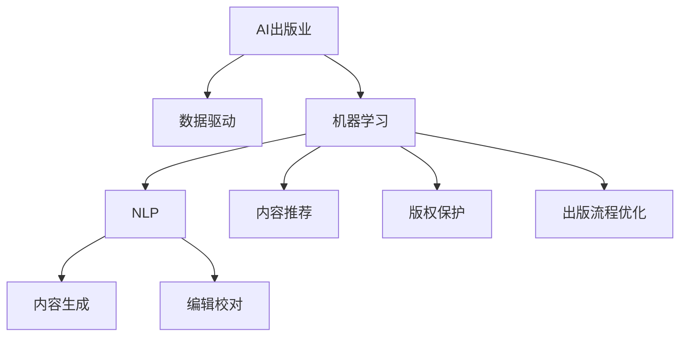

                 

# AI出版业挑战：降本增效与场景创新

> 关键词：AI出版业，数据驱动，机器学习，自然语言处理，内容推荐，版权保护，出版流程优化

## 1. 背景介绍

### 1.1 问题由来

近年来，出版业面临着巨大的挑战和变革。数字化浪潮的冲击，导致纸质书的销量锐减，传统出版社的生存空间被严重挤压。同时，海量信息的爆炸，使得读者筛选信息的需求日益增长，传统的出版和分发方式已经难以满足市场需求。在这一背景下，出版业亟需借助AI技术，进行数字化转型，实现降本增效和场景创新。

### 1.2 问题核心关键点

AI技术的应用，已经在出版业的多个环节发挥了重要作用。从内容生成、编辑校对、版权保护，到读者推荐、销售渠道优化，AI技术带来了诸多机遇和挑战。

当前出版业面临的关键问题包括：

- 如何利用AI降低出版成本，提升效率，实现降本增效？
- 如何利用AI提升内容质量，提高读者满意度？
- 如何利用AI技术创新出版场景，拓展市场边界？

## 2. 核心概念与联系

### 2.1 核心概念概述

为了更好地理解AI在出版业中的应用，本节将介绍几个密切相关的核心概念：

- AI出版业（AI Publishing Industry）：利用AI技术，对出版业的各个环节进行智能化优化，提升出版质量和效率。
- 数据驱动（Data-Driven）：通过大规模数据分析，发现出版业运行规律，指导出版策略和决策制定。
- 机器学习（Machine Learning）：利用数据训练模型，实现对出版业务的自动化、智能化预测和优化。
- 自然语言处理（Natural Language Processing, NLP）：使用机器学习技术处理和理解人类语言，应用于内容生成、编辑校对等环节。
- 内容推荐（Content Recommendation）：利用用户行为数据，推荐符合用户兴趣的内容，提升用户粘性。
- 版权保护（Copyright Protection）：利用AI技术自动识别和保护内容版权，打击盗版侵权。
- 出版流程优化（Publishing Workflow Optimization）：通过自动化流程和智能化管理，提升出版效率，减少人工错误。

这些概念之间的逻辑关系可以通过以下Mermaid流程图来展示：



这个流程图展示了大语言模型的核心概念及其之间的关系：

1. 数据驱动和大语言模型从海量数据中发现出版行业的运行规律。
2. 机器学习利用这些规律，训练出智能化模型，服务于出版业务的各个环节。
3. 自然语言处理技术应用于内容生成、编辑校对等环节，提升内容质量和自动化水平。
4. 内容推荐和版权保护技术，帮助出版社和内容创作者保护权益，提升用户体验。
5. 出版流程优化技术，提升出版效率，降低成本。

## 3. 核心算法原理 & 具体操作步骤

### 3.1 算法原理概述

AI在出版业的应用，主要基于以下几个核心算法：

1. 自然语言处理（NLP）：通过语义分析、文本分类等技术，实现对出版内容的智能化处理。
2. 机器学习（ML）：通过监督学习和无监督学习，构建预测和优化模型，服务于出版业务的各个环节。
3. 推荐系统：利用协同过滤、深度学习等算法，为读者推荐符合其兴趣的内容。
4. 版权保护：通过图像识别、文本相似度计算等技术，自动识别和保护内容版权。

### 3.2 算法步骤详解

基于AI的出版业优化流程，一般包括以下几个关键步骤：

**Step 1: 数据收集与预处理**
- 收集出版业务相关的数据，如用户行为、出版物内容、销售数据等。
- 进行数据清洗和预处理，去除噪声，标准化格式。

**Step 2: 模型训练与优化**
- 利用收集的数据，选择合适的算法和模型，如NLP模型、推荐模型等。
- 使用历史数据进行训练，调整模型参数，优化模型性能。

**Step 3: 部署与应用**
- 将训练好的模型部署到实际应用中，如内容推荐系统、版权保护系统等。
- 定期收集用户反馈，持续优化模型，提升用户体验。

**Step 4: 监控与评估**
- 实时监控模型的运行状态，收集关键指标数据。
- 定期评估模型性能，及时发现和解决潜在问题。

### 3.3 算法优缺点

AI技术在出版业的应用，具有以下优点：

1. 提升效率：通过自动化流程和智能化管理，显著降低出版成本，提高效率。
2. 提升质量：利用NLP和大模型技术，提升内容生成和编辑校对质量，减少人工错误。
3. 个性化推荐：利用推荐系统，实现精准的用户内容推荐，提升用户粘性。
4. 版权保护：通过版权保护技术，自动识别和保护内容版权，打击盗版侵权。

同时，AI技术在出版业的应用，也存在以下缺点：

1. 数据依赖：AI技术的应用依赖于高质量的数据，数据不足或数据质量问题会影响模型的效果。
2. 模型复杂度：复杂的模型可能导致计算资源消耗大，推理速度慢。
3. 可解释性：许多AI模型尤其是深度学习模型，其决策过程难以解释，对出版管理带来了挑战。
4. 版权争议：AI技术在版权保护中的应用，可能引发版权争议和技术侵权问题。

尽管存在这些局限性，但就目前而言，AI技术在出版业的应用已经取得了一定的成效，未来还有很大的发展空间。

### 3.4 算法应用领域

AI技术在出版业的应用，覆盖了出版业务的各个环节，具体包括：

- 内容生成：利用NLP和大模型，自动生成新闻、文章、书籍等出版内容。
- 编辑校对：利用自然语言处理技术，自动检测和修正语法、拼写、排版等错误。
- 版权保护：利用图像识别、文本相似度计算等技术，自动识别和保护内容版权。
- 内容推荐：利用推荐系统，为用户推荐符合其兴趣的出版物，提升用户粘性。
- 出版流程优化：利用AI技术，优化出版流程，提升出版效率，降低成本。

此外，AI技术还应用于出版商的营销、广告投放、用户分析等多个环节，推动出版业务的全面智能化转型。

## 4. 数学模型和公式 & 详细讲解 & 举例说明

### 4.1 数学模型构建

基于AI的出版业优化流程，可以构建以下数学模型：

- **内容生成模型**：利用NLP技术，生成符合用户兴趣的出版内容。常见的模型包括基于Transformer的生成模型、GPT等。
- **编辑校对模型**：利用NLP技术，检测和修正文本错误。常见的模型包括BERT、BERT-Classification等。
- **推荐模型**：利用协同过滤、深度学习等算法，为用户推荐出版物。常见的模型包括CF、DNN、KNN等。
- **版权保护模型**：利用图像识别、文本相似度计算等技术，自动识别和保护内容版权。常见的模型包括CNN、RNN等。
- **出版流程优化模型**：利用优化算法，优化出版流程，提高效率。常见的算法包括遗传算法、模拟退火等。

### 4.2 公式推导过程

以推荐系统为例，常见的协同过滤算法包括基于用户的协同过滤和基于物品的协同过滤。

**基于用户的协同过滤**：
设用户集合为 $U$，物品集合为 $I$，用户对物品的评分矩阵为 $R_{UI}$，用户 $u$ 对物品 $i$ 的评分为 $r_{ui}$。基于用户的协同过滤算法，通过对用户 $u$ 的历史评分数据 $R_{ui}$ 进行加权平均，得到用户 $u$ 对物品 $i$ 的预测评分 $r_{ui}^{'}$：

$$
r_{ui}^{'} = \frac{\sum_{v \in U} r_{vi} \cdot \alpha_v}{\sum_{v \in U} \alpha_v}
$$

其中 $\alpha_v$ 表示用户 $v$ 的重要性权重，可以根据历史评分数据等计算得到。

**基于物品的协同过滤**：
设物品集合为 $I$，用户集合为 $U$，物品 $i$ 对用户 $u$ 的评分向量为 $R_{iu}$，物品 $i$ 对用户 $u$ 的预测评分 $r_{iu}^{'}$ 为：

$$
r_{iu}^{'} = \frac{\sum_{v \in U} r_{vi} \cdot \alpha_i}{\sum_{v \in U} \alpha_i}
$$

其中 $\alpha_i$ 表示物品 $i$ 的重要性权重，可以根据历史评分数据等计算得到。

### 4.3 案例分析与讲解

以出版流程优化为例，传统的出版流程需要经过校对、排版、印刷等多个环节，周期长、成本高。通过引入AI技术，可以优化出版流程，提升效率。

具体而言，可以构建出版流程优化模型，利用遗传算法对流程进行优化。以出版流程的各个环节为基因，根据优化目标构建适应度函数，通过遗传算法不断调整各个环节的权重，直至达到最优的出版流程。

## 5. 项目实践：代码实例和详细解释说明

### 5.1 开发环境搭建

在进行AI出版业优化项目的开发前，我们需要准备好开发环境。以下是使用Python进行PyTorch开发的环境配置流程：

1. 安装Anaconda：从官网下载并安装Anaconda，用于创建独立的Python环境。

2. 创建并激活虚拟环境：
```bash
conda create -n ai_publishing python=3.8 
conda activate ai_publishing
```

3. 安装PyTorch：根据CUDA版本，从官网获取对应的安装命令。例如：
```bash
conda install pytorch torchvision torchaudio cudatoolkit=11.1 -c pytorch -c conda-forge
```

4. 安装Transformers库：
```bash
pip install transformers
```

5. 安装各类工具包：
```bash
pip install numpy pandas scikit-learn matplotlib tqdm jupyter notebook ipython
```

完成上述步骤后，即可在`ai_publishing`环境中开始AI出版业优化实践。

### 5.2 源代码详细实现

这里我们以内容推荐系统为例，给出使用Transformers库对BERT模型进行内容推荐训练的PyTorch代码实现。

首先，定义推荐系统所需的数据处理函数：

```python
from transformers import BertTokenizer
from torch.utils.data import Dataset
import torch

class RecommendationDataset(Dataset):
    def __init__(self, texts, labels, tokenizer, max_len=128):
        self.texts = texts
        self.labels = labels
        self.tokenizer = tokenizer
        self.max_len = max_len
        
    def __len__(self):
        return len(self.texts)
    
    def __getitem__(self, item):
        text = self.texts[item]
        label = self.labels[item]
        
        encoding = self.tokenizer(text, return_tensors='pt', max_length=self.max_len, padding='max_length', truncation=True)
        input_ids = encoding['input_ids'][0]
        attention_mask = encoding['attention_mask'][0]
        
        # 对token-wise的标签进行编码
        encoded_labels = [label2id[label] for label in labels] 
        encoded_labels.extend([label2id['O']] * (self.max_len - len(encoded_labels)))
        labels = torch.tensor(encoded_labels, dtype=torch.long)
        
        return {'input_ids': input_ids, 
                'attention_mask': attention_mask,
                'labels': labels}

# 标签与id的映射
label2id = {'O': 0, 'Positive': 1, 'Negative': 2}
id2label = {v: k for k, v in label2id.items()}

# 创建dataset
tokenizer = BertTokenizer.from_pretrained('bert-base-cased')

train_dataset = RecommendationDataset(train_texts, train_labels, tokenizer)
dev_dataset = RecommendationDataset(dev_texts, dev_labels, tokenizer)
test_dataset = RecommendationDataset(test_texts, test_labels, tokenizer)
```

然后，定义模型和优化器：

```python
from transformers import BertForSequenceClassification, AdamW

model = BertForSequenceClassification.from_pretrained('bert-base-cased', num_labels=len(label2id))

optimizer = AdamW(model.parameters(), lr=2e-5)
```

接着，定义训练和评估函数：

```python
from torch.utils.data import DataLoader
from tqdm import tqdm
from sklearn.metrics import classification_report

device = torch.device('cuda') if torch.cuda.is_available() else torch.device('cpu')
model.to(device)

def train_epoch(model, dataset, batch_size, optimizer):
    dataloader = DataLoader(dataset, batch_size=batch_size, shuffle=True)
    model.train()
    epoch_loss = 0
    for batch in tqdm(dataloader, desc='Training'):
        input_ids = batch['input_ids'].to(device)
        attention_mask = batch['attention_mask'].to(device)
        labels = batch['labels'].to(device)
        model.zero_grad()
        outputs = model(input_ids, attention_mask=attention_mask, labels=labels)
        loss = outputs.loss
        epoch_loss += loss.item()
        loss.backward()
        optimizer.step()
    return epoch_loss / len(dataloader)

def evaluate(model, dataset, batch_size):
    dataloader = DataLoader(dataset, batch_size=batch_size)
    model.eval()
    preds, labels = [], []
    with torch.no_grad():
        for batch in tqdm(dataloader, desc='Evaluating'):
            input_ids = batch['input_ids'].to(device)
            attention_mask = batch['attention_mask'].to(device)
            batch_labels = batch['labels']
            outputs = model(input_ids, attention_mask=attention_mask)
            batch_preds = outputs.logits.argmax(dim=2).to('cpu').tolist()
            batch_labels = batch_labels.to('cpu').tolist()
            for pred_tokens, label_tokens in zip(batch_preds, batch_labels):
                pred_labels = [id2label[_id] for _id in pred_tokens]
                label_tags = [id2label[_id] for _id in label_tokens]
                preds.append(pred_labels[:len(label_tags)])
                labels.append(label_tags)
                
    print(classification_report(labels, preds))
```

最后，启动训练流程并在测试集上评估：

```python
epochs = 5
batch_size = 16

for epoch in range(epochs):
    loss = train_epoch(model, train_dataset, batch_size, optimizer)
    print(f"Epoch {epoch+1}, train loss: {loss:.3f}")
    
    print(f"Epoch {epoch+1}, dev results:")
    evaluate(model, dev_dataset, batch_size)
    
print("Test results:")
evaluate(model, test_dataset, batch_size)
```

以上就是使用PyTorch对BERT模型进行内容推荐训练的完整代码实现。可以看到，通过使用PyTorch和Transformers库，我们可以较为简便地实现基于BERT的内容推荐系统。

### 5.3 代码解读与分析

让我们再详细解读一下关键代码的实现细节：

**RecommendationDataset类**：
- `__init__`方法：初始化文本、标签、分词器等关键组件。
- `__len__`方法：返回数据集的样本数量。
- `__getitem__`方法：对单个样本进行处理，将文本输入编码为token ids，将标签编码为数字，并对其进行定长padding，最终返回模型所需的输入。

**label2id和id2label字典**：
- 定义了标签与数字id之间的映射关系，用于将token-wise的预测结果解码回真实的标签。

**训练和评估函数**：
- 使用PyTorch的DataLoader对数据集进行批次化加载，供模型训练和推理使用。
- 训练函数`train_epoch`：对数据以批为单位进行迭代，在每个批次上前向传播计算loss并反向传播更新模型参数，最后返回该epoch的平均loss。
- 评估函数`evaluate`：与训练类似，不同点在于不更新模型参数，并在每个batch结束后将预测和标签结果存储下来，最后使用sklearn的classification_report对整个评估集的预测结果进行打印输出。

**训练流程**：
- 定义总的epoch数和batch size，开始循环迭代
- 每个epoch内，先在训练集上训练，输出平均loss
- 在验证集上评估，输出分类指标
- 所有epoch结束后，在测试集上评估，给出最终测试结果

可以看到，PyTorch配合Transformers库使得BERT模型的微调代码实现变得简洁高效。开发者可以将更多精力放在数据处理、模型改进等高层逻辑上，而不必过多关注底层的实现细节。

当然，工业级的系统实现还需考虑更多因素，如模型的保存和部署、超参数的自动搜索、更灵活的任务适配层等。但核心的微调范式基本与此类似。

## 6. 实际应用场景

### 6.1 智能内容推荐

AI出版业的重要应用场景之一是智能内容推荐。通过利用用户行为数据和出版内容特征，利用机器学习算法，推荐符合用户兴趣的出版物，提升用户粘性。

在技术实现上，可以构建基于协同过滤、深度学习等算法的推荐系统，实时采集用户浏览、点击、评价等行为数据，生成用户兴趣画像，并实时推荐与之匹配的出版物。

### 6.2 版权保护与合规检测

版权保护是出版业面临的另一个重要问题。利用AI技术，可以实现高效的版权保护和合规检测。

具体而言，可以构建基于图像识别、文本相似度计算的版权保护系统。该系统可以自动识别出版物中的图像、文字、表格等内容的版权归属，并与版权数据库进行比对，判断是否存在侵权行为。同时，系统还可以对出版物是否符合相关法律法规进行合规检测，防止发布违法违规内容。

### 6.3 出版流程自动化

AI技术还可以用于出版流程的自动化管理。通过构建基于AI的出版流程优化模型，可以对出版流程的各个环节进行智能化管理，提升出版效率，降低人工错误。

例如，可以构建出版流程优化模型，利用遗传算法对流程进行优化。以出版流程的各个环节为基因，根据优化目标构建适应度函数，通过遗传算法不断调整各个环节的权重，直至达到最优的出版流程。

### 6.4 未来应用展望

随着AI技术在出版业的应用不断深入，未来的出版业将迎来更加智能化、个性化的发展。

1. **个性化定制**：通过利用AI技术，为读者提供个性化的出版物推荐和定制化服务，满足不同读者的需求。
2. **智能编辑**：利用AI技术进行智能化编辑，自动检测和修正文本错误，提升内容质量。
3. **实时内容生成**：利用AI技术进行实时内容生成，自动生成新闻、文章、书籍等内容，满足读者多样化的需求。
4. **智能版权保护**：通过AI技术构建智能版权保护系统，自动识别和保护内容版权，打击盗版侵权。
5. **出版流程自动化**：通过AI技术实现出版流程的自动化管理，提升出版效率，降低成本。

AI技术的应用，将极大推动出版业的数字化转型和智能化升级，为出版业带来新的生机和活力。

## 7. 工具和资源推荐

### 7.1 学习资源推荐

为了帮助开发者系统掌握AI在出版业的应用，这里推荐一些优质的学习资源：

1. 《深度学习与出版业》系列博文：由AI出版业专家撰写，深入浅出地介绍了深度学习在出版业的应用，涵盖内容生成、版权保护等多个方面。

2. Coursera《AI for Everyone》课程：由斯坦福大学开设的AI入门课程，包含大量与出版业相关的AI应用案例。

3. 《AI出版业实践指南》书籍：总结了AI在出版业的具体应用实践，涵盖智能推荐、版权保护等多个环节。

4. HuggingFace官方文档：提供了大量预训练语言模型和完整的微调样例代码，是进行AI出版业优化的必备资料。

5. CLUE开源项目：中文语言理解测评基准，涵盖大量不同类型的中文出版物数据集，并提供了基于AI的baseline模型，助力中文出版业的技术发展。

通过对这些资源的学习实践，相信你一定能够快速掌握AI在出版业的应用，并用于解决实际的出版问题。

### 7.2 开发工具推荐

高效的开发离不开优秀的工具支持。以下是几款用于AI出版业优化的常用工具：

1. PyTorch：基于Python的开源深度学习框架，灵活动态的计算图，适合快速迭代研究。大部分预训练语言模型都有PyTorch版本的实现。

2. TensorFlow：由Google主导开发的开源深度学习框架，生产部署方便，适合大规模工程应用。同样有丰富的预训练语言模型资源。

3. Transformers库：HuggingFace开发的NLP工具库，集成了众多SOTA语言模型，支持PyTorch和TensorFlow，是进行AI出版业优化的利器。

4. Weights & Biases：模型训练的实验跟踪工具，可以记录和可视化模型训练过程中的各项指标，方便对比和调优。与主流深度学习框架无缝集成。

5. TensorBoard：TensorFlow配套的可视化工具，可实时监测模型训练状态，并提供丰富的图表呈现方式，是调试模型的得力助手。

6. Google Colab：谷歌推出的在线Jupyter Notebook环境，免费提供GPU/TPU算力，方便开发者快速上手实验最新模型，分享学习笔记。

合理利用这些工具，可以显著提升AI出版业优化的开发效率，加快创新迭代的步伐。

### 7.3 相关论文推荐

AI技术在出版业的发展源于学界的持续研究。以下是几篇奠基性的相关论文，推荐阅读：

1. Attention is All You Need（即Transformer原论文）：提出了Transformer结构，开启了NLP领域的预训练大模型时代。

2. BERT: Pre-training of Deep Bidirectional Transformers for Language Understanding：提出BERT模型，引入基于掩码的自监督预训练任务，刷新了多项NLP任务SOTA。

3. Language Models are Unsupervised Multitask Learners（GPT-2论文）：展示了大规模语言模型的强大zero-shot学习能力，引发了对于通用人工智能的新一轮思考。

4. Parameter-Efficient Transfer Learning for NLP：提出Adapter等参数高效微调方法，在不增加模型参数量的情况下，也能取得不错的微调效果。

5. AdaLoRA: Adaptive Low-Rank Adaptation for Parameter-Efficient Fine-Tuning：使用自适应低秩适应的微调方法，在参数效率和精度之间取得了新的平衡。

这些论文代表了大语言模型在出版业的应用发展脉络。通过学习这些前沿成果，可以帮助研究者把握学科前进方向，激发更多的创新灵感。

## 8. 总结：未来发展趋势与挑战

### 8.1 总结

本文对AI在出版业中的应用进行了全面系统的介绍。首先阐述了AI技术在出版业优化中的研究背景和意义，明确了出版业智能化转型的重要性和紧迫性。其次，从原理到实践，详细讲解了AI在出版业优化中的数学模型和核心算法，给出了微调任务开发的完整代码实例。同时，本文还广泛探讨了AI技术在出版业的多个应用场景，展示了其在出版业的广阔前景。

通过本文的系统梳理，可以看到，AI技术在出版业的优化过程中，具有显著的降本增效和场景创新能力，能够为出版业带来巨大的变革。未来，伴随AI技术的不断演进，出版业将更加智能化、个性化，为广大读者和内容创作者提供更加优质和高效的服务。

### 8.2 未来发展趋势

展望未来，AI在出版业的应用将呈现以下几个发展趋势：

1. **智能化程度提升**：AI技术的应用将更加普及，出版业务的各个环节将实现全面智能化。内容生成、编辑校对、版权保护、内容推荐等环节都将被AI技术所覆盖。
2. **个性化服务普及**：通过利用AI技术，实现更加精准的用户内容推荐，提升用户粘性。出版业将更加注重个性化服务的普及和应用。
3. **实时内容生成**：利用AI技术进行实时内容生成，满足读者多样化的需求。出版业将更加注重实时内容的生产和发布。
4. **版权保护加强**：通过AI技术构建智能版权保护系统，自动识别和保护内容版权，打击盗版侵权。版权保护将成为出版业的重要环节。
5. **出版流程优化**：通过AI技术实现出版流程的自动化管理，提升出版效率，降低成本。出版业将更加注重流程优化和自动化。

以上趋势凸显了AI技术在出版业中的重要作用和巨大潜力。这些方向的探索发展，必将进一步推动出版业的数字化转型和智能化升级，为出版业带来新的生机和活力。

### 8.3 面临的挑战

尽管AI技术在出版业的应用已经取得了一定的成效，但在迈向更加智能化、普适化应用的过程中，它仍面临诸多挑战：

1. **数据依赖**：AI技术的应用依赖于高质量的数据，数据不足或数据质量问题会影响模型的效果。如何获取和清洗高质量数据，是出版业面临的重要问题。
2. **模型复杂度**：复杂的模型可能导致计算资源消耗大，推理速度慢。如何优化模型结构，降低计算成本，是出版业需要解决的技术难题。
3. **版权争议**：AI技术在版权保护中的应用，可能引发版权争议和技术侵权问题。如何构建合规的版权保护系统，是出版业需要关注的重要问题。
4. **可解释性**：许多AI模型尤其是深度学习模型，其决策过程难以解释，对出版管理带来了挑战。如何提高模型的可解释性，是出版业需要解决的技术问题。

尽管存在这些挑战，但AI技术在出版业的应用前景依然广阔，未来需要通过技术创新和实践探索，不断突破现有瓶颈，推动出版业向更加智能化、普适化方向发展。

### 8.4 研究展望

面向未来，AI在出版业的研究和应用方向如下：

1. **无监督和半监督学习**：探索无监督和半监督学习范式，降低对标注数据的需求，利用非结构化数据进行智能化优化。
2. **参数高效微调**：开发更加参数高效的微调方法，在固定大部分预训练参数的同时，只更新极少量的任务相关参数，提高模型效率。
3. **多模态信息融合**：将符号化的先验知识与神经网络模型进行融合，引导微调过程学习更准确、合理的语言模型，提升模型的可解释性和适用性。
4. **因果学习和博弈论**：引入因果分析和博弈论工具，增强模型的鲁棒性和可控性，提高出版业的智能化水平。
5. **伦理和安全**：在模型训练目标中引入伦理导向的评估指标，过滤和惩罚有偏见、有害的输出倾向，构建安全的出版业应用系统。

这些研究方向的探索，必将引领AI在出版业的应用向更高的台阶迈进，为出版业的智能化转型提供更加有力的技术保障。

## 9. 附录：常见问题与解答

**Q1：AI在出版业中的应用效果如何？**

A: AI技术在出版业的应用效果显著。通过内容生成、编辑校对、版权保护、内容推荐等环节的智能化优化，出版业实现了降本增效和场景创新。AI技术能够显著提升出版质量，提升用户满意度，提升出版效率，降低成本。

**Q2：AI技术在出版业的应用是否存在数据依赖？**

A: AI技术在出版业的应用确实存在数据依赖。高质量的数据是AI技术发挥效能的基础。在出版业，数据的获取、清洗和标注成本较高，但一旦获取到高质量数据，AI技术的应用效果将显著提升。

**Q3：AI技术在版权保护中的应用是否存在技术侵权问题？**

A: AI技术在版权保护中的应用可能存在技术侵权问题。AI技术在版权保护中的应用，需要确保模型的合规性和准确性，避免因技术误判导致的版权侵权。出版业应加强技术合规审核，构建合规的版权保护系统。

**Q4：AI技术在出版业中的应用是否存在伦理和安全问题？**

A: AI技术在出版业中的应用确实存在伦理和安全问题。AI技术的决策过程难以解释，可能存在偏见和误判。出版业应加强模型的可解释性，构建安全的出版业应用系统，确保模型的公平性和安全性。

**Q5：AI技术在出版业中的应用是否存在数据隐私问题？**

A: AI技术在出版业中的应用确实存在数据隐私问题。出版业应加强数据隐私保护，确保用户数据的安全性和隐私性。出版业应制定数据隐私保护政策，规范数据使用行为，确保用户数据的安全。

综上所述，AI技术在出版业中的应用前景广阔，但也需要关注数据依赖、模型复杂度、版权争议、可解释性、伦理和安全等问题，通过技术创新和实践探索，不断突破现有瓶颈，推动出版业向更加智能化、普适化方向发展。

