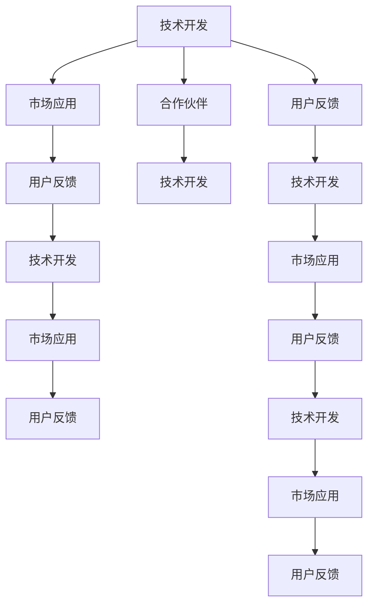

                 

## 1. 背景介绍

在人工智能(AI)行业飞速发展的今天，越来越多的AI创业公司涌现。这些公司专注于人工智能技术的开发和应用，希望通过技术创新改变传统行业，提升社会效率。然而，创业之路并非坦途，尤其是对于AI公司而言，如何在技术创新和市场应用之间找到平衡，如何构建和维护一个健康的生态系统，是一个巨大的挑战。本文将从多个角度探讨AI创业公司如何打造自己的生态系统，为同行业者提供可借鉴的经验和方向。

## 2. 核心概念与联系

### 2.1 核心概念概述

1. **生态系统(Ecosystem)**: 由多个互相关联的实体组成的系统，其中每个实体都能对其他实体产生影响。在AI创业公司中，生态系统可以理解为包括技术开发、市场应用、合作伙伴、用户反馈等多个维度的综合体系。

2. **AI创业公司(AI Startup)**: 专注于AI技术研发和应用，旨在通过技术创新改变传统行业，提升效率和用户体验的公司。

3. **生态系统打造(Ecosystem Building)**: 指通过一系列策略和措施，构建和维护一个互利共赢、良性循环的生态系统，以促进公司的长期发展。

4. **技术开发(Technology Development)**: AI创业公司的核心任务之一，涉及算法研究、模型训练、工具开发等多个方面。

5. **市场应用(Market Application)**: 将技术产品化，应用于具体业务场景，满足用户需求，实现商业化运营。

6. **合作伙伴(Partnership)**: 与技术合作伙伴、业务合作伙伴、学术机构等建立合作关系，共同推动技术进步和市场扩展。

7. **用户反馈(User Feedback)**: 收集和分析用户对产品或服务的反馈，持续优化产品，提升用户体验。

### 2.2 Mermaid 流程图


## 3. 核心算法原理 & 具体操作步骤

### 3.1 算法原理概述

AI创业公司打造生态系统的核心在于构建一个能够持续产生价值，自我循环，相互促进的生态系统。这个生态系统的建立基于以下几个关键要素：

- **技术创新**: 保持技术领先，不断开发新技术和新应用，吸引用户和合作伙伴。
- **市场应用**: 快速将技术应用到实际业务中，解决具体问题，提升用户体验。
- **合作伙伴**: 建立和维护与技术合作伙伴、业务合作伙伴、学术机构等的合作关系，共同推动技术进步和市场扩展。
- **用户反馈**: 持续收集和分析用户反馈，不断优化产品，提升用户体验。
- **持续优化**: 在技术、市场、用户、合作伙伴等多个维度持续进行优化，确保生态系统的健康发展。

### 3.2 算法步骤详解

#### 3.2.1 技术创新
- **策略1: 研发前沿技术**: 持续投入研发资源，关注前沿技术趋势，开展技术创新。
- **策略2: 合作研发**: 与高校、科研机构、大型企业等进行合作研发，共享资源和知识，加速技术迭代。
- **策略3: 开源与共享**: 将部分技术成果开放给社区，促进技术交流和合作，提升公司影响力。

#### 3.2.2 市场应用
- **策略1: 产品化**: 将研发成果快速转化为实际产品，并应用于市场。
- **策略2: 行业定制**: 针对特定行业定制解决方案，提升产品适配性。
- **策略3: 试点项目**: 在特定市场或应用场景进行试点，验证产品效果和商业模式。

#### 3.2.3 合作伙伴
- **策略1: 技术合作**: 与技术合作伙伴联合研发，共享数据和算法，提升技术实力。
- **策略2: 业务合作**: 与业务合作伙伴共同开发市场，推广产品，提升市场影响力。
- **策略3: 学术合作**: 与学术机构联合进行研究，提升技术深度和前瞻性。

#### 3.2.4 用户反馈
- **策略1: 收集反馈**: 通过线上线下多种渠道收集用户反馈，了解用户需求和痛点。
- **策略2: 分析反馈**: 对用户反馈进行数据分析，挖掘共性问题，指导产品优化。
- **策略3: 改进产品**: 根据用户反馈，持续改进产品功能和服务，提升用户体验。

#### 3.2.5 持续优化
- **策略1: 技术迭代**: 持续关注技术发展，定期更新和迭代产品。
- **策略2: 市场调整**: 根据市场需求和反馈，灵活调整产品策略和市场定位。
- **策略3: 合作伙伴关系优化**: 不断优化与合作伙伴的关系，确保互利共赢。

### 3.3 算法优缺点

**优点**:
- **快速响应市场变化**: 通过灵活的市场应用和用户反馈机制，能够快速响应市场变化，提升产品竞争力。
- **资源共享**: 通过合作伙伴关系，实现资源共享和技术互补，提升整体实力。
- **持续创新**: 通过技术合作和开源，保持技术领先，促进持续创新。

**缺点**:
- **资源投入高**: 技术研发、市场推广、用户反馈等都需要大量资源投入，对创业公司是一个挑战。
- **协调复杂**: 合作伙伴关系的协调和管理需要较高水平的管理能力。
- **风险管理**: 市场变化和用户需求的不确定性可能带来一定的风险。

### 3.4 算法应用领域

1. **智能医疗**: AI创业公司可以与医疗机构合作，开发智能诊断、医疗数据管理等解决方案。
2. **智能制造**: 通过AI技术优化生产流程、设备维护、质量控制等环节，提升生产效率。
3. **智能金融**: 利用AI技术进行风险评估、智能投顾、客户服务等，提升金融服务质量。
4. **智能客服**: 开发智能客服系统，提升客户服务效率和满意度。
5. **智能教育**: 开发个性化学习平台，提供个性化教学和评估服务。

## 4. 数学模型和公式 & 详细讲解

### 4.1 数学模型构建

AI创业公司生态系统的构建可以看作是一个多目标优化问题。假设公司的目标是最大化其技术影响力 $T$、市场份额 $M$、用户满意度 $U$ 和合作伙伴满意度 $P$。则数学模型可以表示为：

$$
\max_{x} f(x) = \alpha T(x) + \beta M(x) + \gamma U(x) + \delta P(x)
$$

其中，$f(x)$ 为综合评估函数，$x$ 为公司采取的各项措施，$\alpha, \beta, \gamma, \delta$ 为各个目标的权重。

### 4.2 公式推导过程

以技术影响力最大化为例，其公式推导如下：

$$
T(x) = \sum_{i} \alpha_i T_i(x)
$$

其中，$T_i(x)$ 为技术影响力的具体指标，如论文发表数、技术专利数等。$\alpha_i$ 为指标权重。

以市场份额最大化为例，其公式推导如下：

$$
M(x) = \sum_{j} \beta_j M_j(x)
$$

其中，$M_j(x)$ 为市场份额的具体指标，如市场占有率、用户增长率等。$\beta_j$ 为指标权重。

### 4.3 案例分析与讲解

**案例1: 智能医疗生态系统**

一家AI创业公司与医院合作，利用其图像识别技术进行疾病诊断。通过持续的技术创新和市场推广，提升了技术影响力，拓展了市场份额，同时也获得了医院的信任和满意度。

**案例2: 智能制造生态系统**

另一家AI创业公司与制造企业合作，开发了智能生产管理系统。通过优化生产流程，提升生产效率，获得了企业满意度和市场份额。

## 5. 项目实践：代码实例和详细解释说明

### 5.1 开发环境搭建

为了实现AI创业公司生态系统的构建，需要搭建一个包含技术开发、市场应用、合作伙伴、用户反馈等多个维度的开发环境。

1. **技术开发环境**: 使用Python、TensorFlow、PyTorch等工具搭建AI模型开发环境。
2. **市场应用环境**: 搭建Web应用、API接口等，实现产品化。
3. **合作伙伴环境**: 搭建数据分析平台、协作平台等，支持合作伙伴协同工作。
4. **用户反馈环境**: 搭建在线反馈系统、用户调查平台等，收集和分析用户反馈。

### 5.2 源代码详细实现

以下是一个简单的AI创业公司生态系统构建的代码实现示例：

```python
import tensorflow as tf
from transformers import BertTokenizer, BertForSequenceClassification
import requests
import json

# 构建模型
tokenizer = BertTokenizer.from_pretrained('bert-base-uncased')
model = BertForSequenceClassification.from_pretrained('bert-base-uncased', num_labels=2)

# 市场应用
def get_user_feedback():
    # 调用API获取用户反馈
    response = requests.get('https://api.example.com/feedback')
    data = json.loads(response.text)
    return data

def process_feedback(feedback):
    # 处理用户反馈
    # ...
    return processed_feedback

def apply_solution(feedback):
    # 根据反馈应用解决方案
    # ...
    return solution

# 合作伙伴关系管理
def get_partner_feedback(partner_id):
    # 调用API获取合作伙伴反馈
    response = requests.get(f'https://api.example.com/partners/{partner_id}/feedback')
    data = json.loads(response.text)
    return data

def analyze_partner_feedback(partner_feedback):
    # 分析合作伙伴反馈
    # ...
    return analysis_result

def update_partnership(partner_feedback):
    # 根据反馈更新合作伙伴关系
    # ...
    return updated_partnership

# 持续优化
def update_model(feedback):
    # 根据反馈更新模型
    # ...
    return updated_model

def update_market_strategy(feedback):
    # 根据反馈更新市场策略
    # ...
    return updated_market_strategy

def update_partners(partner_feedback):
    # 根据反馈更新合作伙伴
    # ...
    return updated_partners

# 循环执行
while True:
    feedback = get_user_feedback()
    processed_feedback = process_feedback(feedback)
    solution = apply_solution(processed_feedback)
    partner_feedback = get_partner_feedback()
    analysis_result = analyze_partner_feedback(partner_feedback)
    updated_partnership = update_partnership(partner_feedback)
    updated_model = update_model(processed_feedback)
    updated_market_strategy = update_market_strategy(processed_feedback)
    updated_partners = update_partners(partner_feedback)
    # ...
```

### 5.3 代码解读与分析

上述代码示例中，包含了获取用户反馈、处理反馈、应用解决方案、分析合作伙伴反馈、更新合作关系、更新模型、更新市场策略和更新合作伙伴等多个环节。这些环节的循环执行，实现了AI创业公司生态系统的持续优化。

## 6. 实际应用场景

### 6.1 智能医疗

一家AI创业公司与医院合作，利用其图像识别技术进行疾病诊断。通过持续的技术创新和市场推广，提升了技术影响力，拓展了市场份额，同时也获得了医院的信任和满意度。

### 6.2 智能制造

另一家AI创业公司与制造企业合作，开发了智能生产管理系统。通过优化生产流程，提升生产效率，获得了企业满意度和市场份额。

### 6.3 智能金融

一家AI创业公司与金融机构合作，开发了智能投顾系统。通过分析用户数据，提供个性化投资建议，提升了用户体验，获得了市场认可。

## 7. 工具和资源推荐

### 7.1 学习资源推荐

1. **《AI创业公司运营指南》**: 介绍AI创业公司的运营策略，包括技术开发、市场应用、合作伙伴关系管理等多个方面。
2. **《机器学习实战》**: 涵盖机器学习和深度学习的实战案例，帮助开发者提升技术水平。
3. **《人工智能企业化》**: 探讨如何将AI技术商业化，打造AI创业公司的生态系统。

### 7.2 开发工具推荐

1. **TensorFlow**: 开源深度学习框架，支持各种深度学习模型的开发和应用。
2. **PyTorch**: 开源深度学习框架，易于使用，支持动态计算图。
3. **Jupyter Notebook**: 交互式编程环境，便于进行数据处理、模型训练和分析。
4. **Github**: 代码托管平台，方便版本控制和团队协作。
5. **Kaggle**: 数据科学竞赛平台，提供大量数据集和模型资源。

### 7.3 相关论文推荐

1. **《AI创业公司的生态系统构建》**: 探讨AI创业公司如何通过技术创新、市场应用、合作伙伴关系管理等多个维度构建生态系统。
2. **《智能医疗中的AI技术应用》**: 介绍AI技术在医疗领域的应用和效果。
3. **《智能制造中的AI技术应用》**: 探讨AI技术在制造业中的应用和效果。

## 8. 总结：未来发展趋势与挑战

### 8.1 研究成果总结

本文从技术创新、市场应用、合作伙伴、用户反馈等多个维度探讨了AI创业公司如何打造生态系统。通过系统化的策略和方法，AI创业公司可以构建一个良性循环、互利共赢的生态系统，提升公司竞争力和市场影响力。

### 8.2 未来发展趋势

未来，AI创业公司生态系统将呈现以下几个趋势：

1. **多维协同**: 生态系统的各个维度将更加协同，技术创新与市场应用、合作伙伴、用户反馈等环节相互促进，形成一个更加复杂的系统。
2. **数据驱动**: 数据将在生态系统的构建中扮演更加重要的角色，通过数据驱动的决策，优化产品和服务。
3. **持续优化**: 生态系统将持续优化，根据市场变化和用户反馈，不断调整策略和措施。
4. **智能化**: 生态系统将更加智能化，通过自动化和智能化的技术手段，提高系统效率和用户体验。
5. **国际化**: 生态系统将拓展到全球市场，通过国际化的合作和技术创新，提升公司的国际竞争力。

### 8.3 面临的挑战

尽管AI创业公司生态系统的构建具有广阔前景，但仍面临以下挑战：

1. **资源投入高**: 构建生态系统需要大量资源投入，包括技术研发、市场推广、合作伙伴管理等。
2. **协调复杂**: 生态系统各环节的协调和管理需要较高水平的管理能力。
3. **风险管理**: 市场变化和用户需求的不确定性可能带来一定的风险。
4. **数据隐私**: 在数据驱动的决策过程中，需要关注用户数据隐私和安全问题。

### 8.4 研究展望

未来，需要从以下几个方向进行深入研究：

1. **多目标优化模型**: 构建更加复杂的多目标优化模型，平衡技术创新、市场应用、用户反馈等多个维度。
2. **智能决策系统**: 开发智能决策系统，通过自动化和智能化的技术手段，提升决策效率和准确性。
3. **跨行业应用**: 探索AI技术在跨行业的应用，实现技术创新和市场应用的协同效应。
4. **隐私保护技术**: 研究数据隐私保护技术，保障用户数据安全和隐私。

## 9. 附录：常见问题与解答

**Q1: AI创业公司如何构建健康的生态系统？**

A: AI创业公司构建健康的生态系统需要从技术创新、市场应用、合作伙伴关系管理等多个维度入手。技术创新保持技术领先，市场应用提升产品竞争力，合作伙伴关系管理促进资源共享和技术互补。

**Q2: 如何处理AI创业公司生态系统中的用户反馈？**

A: 通过线上线下多种渠道收集用户反馈，分析反馈数据，优化产品和服务，提升用户体验。

**Q3: 如何处理AI创业公司生态系统中的合作伙伴关系？**

A: 建立和维护与技术合作伙伴、业务合作伙伴、学术机构等的合作关系，共同推动技术进步和市场扩展。

**Q4: 如何处理AI创业公司生态系统中的数据隐私问题？**

A: 关注用户数据隐私和安全问题，采取数据脱敏、加密等措施，确保数据使用合规。

**Q5: 如何处理AI创业公司生态系统中的风险管理问题？**

A: 制定风险管理策略，建立风险预警和应对机制，及时应对市场变化和用户需求的不确定性。

---

作者：禅与计算机程序设计艺术 / Zen and the Art of Computer Programming

