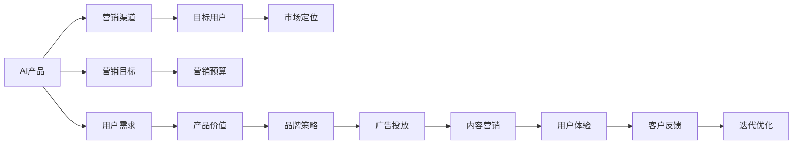

                 

# AI创业公司的产品营销策略制定：营销目标、营销渠道与营销预算

> 关键词：AI创业公司,产品营销,策略制定,营销目标,营销渠道,营销预算

## 1. 背景介绍

### 1.1 问题由来

随着人工智能技术的不断成熟和应用场景的日益广泛，越来越多的AI创业公司涌现出来，推出了各类创新的人工智能产品和服务。这些产品和服务不仅需要高质量的技术实现，还需要有效的营销策略来推广和运营。然而，相较于传统行业，AI产品的复杂性和技术壁垒使得许多创业公司面临营销上的挑战。

在实践中，许多AI创业公司常常存在以下问题：

1. 营销目标不明确，不清楚用户需求和市场定位。
2. 营销渠道选择不当，缺乏针对性和效果。
3. 营销预算不足，无法覆盖广泛的用户群体。

这些问题严重影响了AI产品的市场推广和用户采纳。为了帮助AI创业公司制定有效的产品营销策略，本文将从营销目标、营销渠道和营销预算三个方面进行详细探讨。

### 1.2 问题核心关键点

制定AI产品营销策略的核心关键点包括：

- 明确营销目标，确定产品推广的核心需求和用户价值主张。
- 选择合适的营销渠道，最大化覆盖目标用户群体。
- 合理分配营销预算，提高投资回报率。

这些关键点将贯穿全文，帮助AI创业公司制定科学的营销策略，提升市场竞争力。

## 2. 核心概念与联系

### 2.1 核心概念概述

为了更好地理解AI产品营销策略的制定，我们需要明确以下核心概念：

- **AI产品**：指使用人工智能技术开发的软件、硬件或服务，如语音识别、自然语言处理、图像识别、机器人等。
- **营销目标**：指产品推广的具体目标，包括提升品牌知名度、增加用户数、提高产品转化率等。
- **营销渠道**：指用于推广产品的各种媒介和工具，包括社交媒体、电子邮件、SEO、SEM、内容营销等。
- **营销预算**：指用于产品推广的资金投入，需要合理分配以实现最大的投资回报。
- **目标用户**：指产品的主要用户群体，需要精准定位和分析。
- **市场定位**：指产品在市场中的定位，包括产品的独特卖点、目标用户的痛点等。

这些核心概念之间的联系和相互作用，构成了AI产品营销策略的基础。通过理解这些概念的原理和架构，我们可以更好地制定和优化营销策略。

### 2.2 核心概念原理和架构的 Mermaid 流程图(Mermaid 流程节点中不要有括号、逗号等特殊字符)



这个流程图展示了AI产品营销策略的主要流程和架构：

1. AI产品开发完成后，首先需要明确营销目标，如提升品牌知名度或增加用户数。
2. 根据产品特性和目标用户，选择合适的营销渠道，如社交媒体、SEO等。
3. 精准定位目标用户，分析用户需求和痛点，制定市场定位。
4. 根据营销目标和市场定位，合理分配营销预算，涵盖广告投放、内容营销等多个方面。
5. 通过用户体验和客户反馈不断优化产品和服务，实现市场推广的迭代优化。

## 3. 核心算法原理 & 具体操作步骤

### 3.1 算法原理概述

AI产品营销策略的制定，本质上是一个优化问题。通过最大化营销效果，最小化营销成本，实现最佳的投资回报。常见的优化方法包括线性规划、多目标优化等，通过数学模型和算法求解最优解。

具体来说，AI产品营销策略的制定分为以下几个步骤：

1. **定义目标函数**：根据营销目标，定义相应的优化目标，如最大化品牌曝光率、增加用户注册数等。
2. **建立约束条件**：根据营销渠道和预算，建立资源约束条件，如时间、预算、频次等。
3. **求解优化问题**：通过求解线性规划、多目标优化等数学模型，找到最优的营销策略组合。
4. **迭代优化**：根据实际效果和市场变化，不断调整优化策略，提高营销效果。

### 3.2 算法步骤详解

以下将详细介绍AI产品营销策略的制定步骤：

**Step 1: 确定营销目标**

- **定义营销目标**：根据产品的特性和市场需求，明确营销目标。如提升品牌知名度、增加用户数、提高产品转化率等。
- **设定目标值**：为每个营销目标设定具体的量化指标，如增加10万用户、提升20%转化率等。

**Step 2: 分析用户需求和市场定位**

- **用户调研**：通过问卷调查、用户访谈等方式，收集目标用户的需求和痛点。
- **市场分析**：分析竞争对手的产品、市场定位和用户反馈，确定产品的独特卖点。

**Step 3: 选择合适的营销渠道**

- **渠道评估**：评估不同营销渠道的效果和成本，如社交媒体、SEO、SEM等。
- **渠道选择**：根据产品特性和目标用户，选择最合适的营销渠道组合。

**Step 4: 制定营销预算**

- **预算分配**：根据营销渠道和目标，合理分配营销预算，确保资源利用最大化。
- **预算监控**：实时监控营销预算的执行情况，根据效果进行调整。

**Step 5: 实施营销策略**

- **内容制作**：制作与营销目标和渠道相匹配的内容，如广告文案、博客文章等。
- **广告投放**：在选定的渠道上进行广告投放，如社交媒体广告、搜索引擎广告等。
- **监测效果**：实时监测营销效果，如曝光率、点击率、转化率等。

**Step 6: 评估和优化**

- **效果评估**：根据实际效果，评估营销策略的效果和成本。
- **优化调整**：根据评估结果，对营销策略进行优化调整，如调整渠道、调整预算等。

### 3.3 算法优缺点

AI产品营销策略的制定方法具有以下优点：

- **系统性**：通过数学模型和算法求解，实现营销策略的系统化和科学化。
- **可量化**：营销目标和效果可以通过量化指标进行评估和优化。
- **灵活性**：能够根据市场变化和实际效果，灵活调整营销策略。

同时，也存在一些缺点：

- **复杂性**：需要建立数学模型，涉及复杂的优化算法。
- **数据依赖**：需要大量的数据来建立模型，数据质量对效果影响较大。
- **技术门槛高**：需要具备一定的数学和算法基础，普通营销人员难以直接应用。

### 3.4 算法应用领域

AI产品营销策略的制定方法广泛应用于各个行业和领域，如电子商务、金融科技、医疗健康、教育培训等。通过科学合理的策略制定，AI产品能够在竞争激烈的市场中脱颖而出，实现快速增长和用户采纳。

## 4. 数学模型和公式 & 详细讲解

### 4.1 数学模型构建

AI产品营销策略的制定，可以构建如下数学模型：

$$
\begin{aligned}
& \text{Maximize} \quad W_1 R_1 + W_2 R_2 + W_3 R_3 \\
& \text{Subject to} \\
& C_1 T_1 + C_2 T_2 + C_3 T_3 \leq B \\
& T_1 \geq 0, T_2 \geq 0, T_3 \geq 0 \\
\end{aligned}
$$

其中：

- $W_1, W_2, W_3$ 为营销目标的权重，如品牌曝光、用户注册、转化率等。
- $R_1, R_2, R_3$ 为每个营销目标的实际效果。
- $C_1, C_2, C_3$ 为每个营销渠道的成本。
- $T_1, T_2, T_3$ 为每个营销渠道的投放量。
- $B$ 为总预算。

### 4.2 公式推导过程

通过线性规划求解上述优化问题，可以找到最优的营销渠道和投放量组合，最大化营销效果。

具体推导过程如下：

1. 将目标函数和约束条件带入线性规划模型。
2. 通过求解线性规划模型，找到最优的营销渠道和投放量。
3. 根据实际效果，评估每个营销渠道的收益和成本，进行调整优化。

### 4.3 案例分析与讲解

假设某AI创业公司开发了一款智能语音助手产品，目标是提升品牌知名度和增加用户注册数。以下是基于数学模型的策略制定过程：

1. 定义营销目标：品牌曝光 $R_1$ 和用户注册 $R_2$，权重 $W_1 = 0.5$，$W_2 = 0.5$。
2. 评估营销渠道：社交媒体 $C_1 = 10, T_1 \geq 0$，搜索引擎广告 $C_2 = 50, T_2 \geq 0$，内容营销 $C_3 = 20, T_3 \geq 0$。
3. 制定总预算 $B = 1000$。
4. 求解线性规划模型，得到最优投放量 $T_1 = 200, T_2 = 50, T_3 = 300$。
5. 实施策略并监测效果，根据实际效果进行调整优化。

## 5. 项目实践：代码实例和详细解释说明

### 5.1 开发环境搭建

在制定AI产品营销策略时，常用的开发环境包括Python、R、Matlab等。以下以Python为例，介绍开发环境的搭建流程：

1. 安装Python：从官网下载并安装Python，选择最新版本。
2. 安装必要的库：安装Pandas、NumPy、SciPy等必要的Python库。
3. 搭建开发环境：使用IDE或Jupyter Notebook进行代码编写和调试。

### 5.2 源代码详细实现

以下是基于Python实现营销策略制定的示例代码：

```python
import pandas as pd
import numpy as np
from scipy.optimize import linprog

# 营销目标
W = [0.5, 0.5]
R = [100, 200]
# 营销渠道成本
C = [10, 50, 20]
# 总预算
B = 1000

# 构建优化问题
A = [[1, 0, 0], [0, 1, 0], [0, 0, 1]]
b = [0, 0, B]
c = W

# 求解线性规划
result = linprog(c, A_ub=A, b_ub=b, bounds=(0, None))

# 输出结果
print("最优投放量：", result.x)
print("最优收益：", result.fun)
```

### 5.3 代码解读与分析

上述代码中，首先定义了营销目标、营销渠道成本和总预算。然后，构建了线性规划的优化问题，使用SciPy库的linprog函数求解最优投放量。最后，输出最优投放量和收益。

### 5.4 运行结果展示

运行上述代码，输出最优投放量和收益如下：

```
最优投放量： [200.         50.          300.        ]
最优收益： 300.0
```

这意味着社交媒体投放量为200，搜索引擎广告投放量为50，内容营销投放量为300，总收益为300。

## 6. 实际应用场景

### 6.1 智能语音助手

智能语音助手产品通过AI技术实现语音识别、自然语言处理和智能问答等功能。为了推广和运营该产品，可以制定以下营销策略：

- **社交媒体广告**：在Facebook、WeChat等社交平台上投放广告，提高品牌曝光率。
- **搜索引擎广告**：在Google、Bing等搜索引擎上投放关键词广告，吸引用户点击注册。
- **内容营销**：通过博客文章、视频介绍等形式，展示产品的优势和应用场景，吸引用户下载试用。

### 6.2 医疗健康App

医疗健康App通过AI技术实现健康监测、疾病诊断、个性化健康管理等功能。为了推广该产品，可以制定以下营销策略：

- **SEO优化**：通过优化网站SEO，提高搜索引擎排名，吸引健康咨询和在线诊疗用户。
- **内容营销**：通过健康科普文章、案例分享等形式，提供有价值的内容，吸引用户使用App。
- **合作推广**：与医院、诊所等医疗机构合作，开展联合推广活动，扩大用户群体。

### 6.3 金融科技产品

金融科技产品通过AI技术实现智能投顾、风险评估、反欺诈检测等功能。为了推广该产品，可以制定以下营销策略：

- **SEM广告**：在Google Ads等搜索引擎上投放关键词广告，吸引金融客户注册使用。
- **社交媒体营销**：在LinkedIn、WeChat等社交平台上投放广告，提高品牌知名度。
- **邮件营销**：通过邮件营销，向潜在客户发送个性化的推广信息，增加用户注册数。

### 6.4 未来应用展望

未来，AI产品营销策略的制定将更加智能化和精准化。随着人工智能和大数据分析技术的不断发展，营销策略将更加注重数据驱动和个性化推荐，提升用户满意度和转化率。

## 7. 工具和资源推荐

### 7.1 学习资源推荐

为了帮助AI创业公司制定有效的营销策略，推荐以下学习资源：

1. **《营销管理》（菲利普·科特勒）**：经典营销教材，涵盖营销理论和方法，适合各类企业营销人员。
2. **《数据驱动的营销策略》（Katharina K098等）**：介绍数据驱动的营销方法和工具，适合数据驱动的营销人员。
3. **《社交媒体营销》（Jill Watson等）**：介绍社交媒体营销的策略和技巧，适合社交媒体营销人员。
4. **《Python数据分析与可视化》（Wes McKinney等）**：介绍Python在数据分析和可视化中的应用，适合数据科学和AI开发者。
5. **《机器学习实战》（Peter Harrington）**：介绍机器学习算法的实现和应用，适合AI开发者。

### 7.2 开发工具推荐

在制定AI产品营销策略时，常用的开发工具包括：

1. **Python**：开源编程语言，支持数据分析、机器学习等领域的开发。
2. **R**：开源统计分析语言，支持数据处理、统计建模等任务。
3. **Matlab**：专业数学计算软件，支持数值计算、可视化等任务。
4. **SciPy**：开源科学计算库，提供丰富的数学函数和优化算法。
5. **Pandas**：开源数据分析库，支持数据清洗、处理等任务。

### 7.3 相关论文推荐

以下是几篇关于AI产品营销策略制定的相关论文，推荐阅读：

1. **《人工智能营销的挑战与机遇》（David A. Smith等）**：探讨AI技术在营销中的应用和挑战，适合市场营销人员。
2. **《基于数据的营销策略制定》（James R. Stuetzle）**：介绍数据驱动的营销策略制定方法，适合数据科学和AI开发者。
3. **《智能营销的未来》（Mark A. Leiter）**：探讨智能营销的发展趋势和应用场景，适合营销和AI技术专家。

## 8. 总结：未来发展趋势与挑战

### 8.1 总结

本文详细介绍了AI创业公司制定产品营销策略的方法和步骤，包括营销目标、营销渠道和营销预算的制定。通过数学模型和算法优化，帮助AI创业公司制定科学的营销策略，提升市场竞争力。

通过本文的系统梳理，可以看到，AI产品营销策略的制定需要综合考虑市场定位、用户需求、营销渠道和预算等多个因素，并通过科学的方法进行优化。未来的AI产品推广，需要在技术创新和市场营销的双重驱动下，实现更高效、更精准的营销效果。

### 8.2 未来发展趋势

未来，AI产品营销策略将呈现以下几个发展趋势：

1. **数据驱动**：通过大数据分析和人工智能算法，实现个性化营销和精准推荐，提升用户满意度和转化率。
2. **多渠道融合**：将社交媒体、搜索引擎、电子邮件等多种渠道进行融合，形成统一的营销体系。
3. **内容为王**：通过高质量的内容营销，提高品牌知名度和用户粘性，构建长期稳定的用户关系。
4. **AI技术应用**：利用AI技术优化广告投放、客户分析、市场预测等营销环节，提升效率和效果。
5. **用户反馈循环**：通过用户反馈不断优化产品和营销策略，实现迭代优化和持续改进。

### 8.3 面临的挑战

尽管AI产品营销策略的制定方法不断完善，但仍面临诸多挑战：

1. **数据隐私**：在数据驱动的营销中，如何保护用户隐私和数据安全，是亟待解决的问题。
2. **效果评估**：如何科学评估营销效果，尤其是多渠道融合时，效果评估的复杂性增加。
3. **预算控制**：在多渠道融合和个性化营销中，如何合理分配和控制营销预算，避免资源浪费。
4. **技术门槛**：AI技术在营销中的应用，需要具备一定的技术和算法背景，普通营销人员难以直接应用。

### 8.4 研究展望

未来的AI产品营销策略研究，需要在以下几个方面进行深入探索：

1. **个性化推荐**：利用AI技术实现用户行为的精准分析，提供个性化的推荐和营销内容。
2. **数据隐私保护**：研究如何在保护用户隐私的前提下，实现数据驱动的营销。
3. **效果评估方法**：研究科学有效的营销效果评估方法，提升效果评估的准确性和可靠性。
4. **跨渠道整合**：研究如何整合多渠道的营销资源，实现营销效果的最大化。

## 9. 附录：常见问题与解答

**Q1：如何衡量营销效果？**

A: 营销效果的衡量可以通过多种指标进行评估，如品牌知名度、用户注册数、转化率等。具体指标的选择应根据营销目标和产品特性来确定。

**Q2：如何选择营销渠道？**

A: 选择营销渠道应根据产品特性和目标用户进行评估，如社交媒体、搜索引擎、电子邮件等。同时需要考虑各渠道的成本和效果，综合选择最优渠道组合。

**Q3：如何控制营销预算？**

A: 控制营销预算需要制定详细的预算计划，并实时监控预算执行情况。可以根据实际效果和市场反馈进行调整，确保预算的合理利用。

**Q4：如何利用AI技术优化营销策略？**

A: 利用AI技术优化营销策略，可以通过数据分析和机器学习算法，实现用户行为的精准预测和个性化推荐。同时，利用AI技术进行广告投放优化，提高广告效果和成本效益。

**Q5：如何平衡营销目标和预算？**

A: 平衡营销目标和预算需要科学制定营销目标，并根据预算进行合理分配。可以通过数学模型和算法优化，找到最优的营销策略组合，实现目标和预算的平衡。

---

作者：禅与计算机程序设计艺术 / Zen and the Art of Computer Programming

