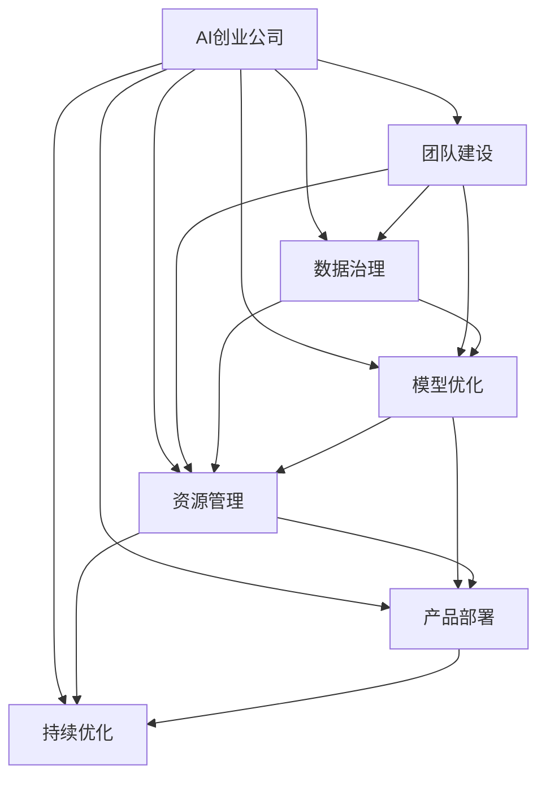

                 

# AI创业公司的技术创新管理

## 1. 背景介绍

### 1.1 问题由来
随着人工智能技术的快速发展，越来越多的AI创业公司应运而生。这些公司以数据为驱动，凭借强大的算法和模型，试图在医疗、金融、制造、零售等多个领域中寻找突破，用AI技术改变行业。然而，创新之路并非一帆风顺，创业公司面临着种种挑战。本文旨在探讨AI创业公司在技术创新过程中遇到的管理问题，并提出相应的解决方案，以帮助这些公司更好地实现其愿景。

### 1.2 问题核心关键点
AI创业公司面临的主要技术管理挑战包括：
- **团队组建**：如何构建高效、多学科团队，实现技术与业务无缝对接。
- **数据管理**：如何在数据收集、存储、处理等方面保持高效率和高安全性。
- **模型选择与优化**：选择合适的AI模型，并优化其性能，以适应具体的业务场景。
- **资源管理**：如何合理分配计算资源，确保技术团队的效率和项目进度。
- **产品部署与迭代**：如何将模型集成到产品中，并进行持续优化。

## 2. 核心概念与联系

### 2.1 核心概念概述

- **AI创业公司**：专注于人工智能技术的研发、应用和商业化的企业。
- **技术创新管理**：管理AI创业公司技术创新的全过程，包括选题、研发、产品化、市场化等各个环节。
- **团队建设**：组建多学科交叉的研发团队，实现技术与业务紧密结合。
- **数据治理**：确保数据的质量、安全和合规，为模型训练和产品开发提供基础。
- **模型优化**：通过调参、迁移学习、增量学习等手段，提升模型的性能和泛化能力。
- **资源管理**：合理分配计算资源，支持大规模模型训练和推理。
- **产品部署**：将模型部署到实际应用场景中，确保高性能和低延迟。
- **持续优化**：基于用户反馈和业务变化，持续优化模型和产品。

这些概念之间相互关联，共同构成AI创业公司技术创新的核心框架。通过理解这些概念的原理和架构，可以更好地掌握AI创业公司的技术管理要义。

### 2.2 核心概念原理和架构的 Mermaid 流程图



这个流程图展示了AI创业公司技术创新的主要流程和关键节点，以及它们之间的联系。

## 3. 核心算法原理 & 具体操作步骤

### 3.1 算法原理概述

AI创业公司技术创新的管理，涉及从选题、研发到产品化的全流程。以下是这些步骤的算法原理概述：

1. **选题**：通过市场需求调研和行业趋势分析，确定潜在的技术创新点。
2. **研发**：使用机器学习、深度学习等技术，开发适用于特定业务场景的AI模型。
3. **产品化**：将模型集成到产品中，并进行前后端接口设计。
4. **市场化**：通过市场测试和用户反馈，调整产品策略和模型性能。

### 3.2 算法步骤详解

#### 3.2.1 选题
- **市场需求调研**：通过问卷调查、访谈、数据分析等方法，了解用户需求和市场痛点。
- **行业趋势分析**：关注行业报告、新闻、学术论文等，获取最新的技术趋势和应用案例。
- **内部讨论**：组织跨部门团队讨论，结合业务需求和市场调研结果，确定创新选题。

#### 3.2.2 研发
- **数据准备**：收集、清洗、标注所需数据，确保数据的质量和多样性。
- **模型选择**：根据业务需求和数据特点，选择合适的AI模型，如卷积神经网络、循环神经网络、Transformer等。
- **模型训练**：使用GPU、TPU等高性能设备进行模型训练，采用梯度下降等优化算法，调整超参数以提升模型性能。
- **模型评估**：通过交叉验证、A/B测试等方式，评估模型在不同场景下的表现。

#### 3.2.3 产品化
- **接口设计**：设计API接口，确保模型和业务系统无缝对接。
- **界面设计**：设计用户界面，提供友好的用户体验。
- **系统集成**：将模型部署到服务器或云平台，确保高性能和可扩展性。

#### 3.2.4 市场化
- **市场测试**：通过小范围试点，获取用户反馈，优化产品策略。
- **用户反馈**：收集用户反馈，了解产品的不足和改进点。
- **模型优化**：根据用户反馈和业务变化，持续优化模型和产品，提升用户体验。

### 3.3 算法优缺点

#### 3.3.1 优点
- **高效**：通过流程化和系统化的管理，提高创新效率。
- **灵活**：结合市场调研和内部讨论，灵活调整策略和方案。
- **可控**：通过数据治理和资源管理，确保创新过程的可控性和可持续性。

#### 3.3.2 缺点
- **复杂**：涉及数据、模型、产品等多个环节，管理复杂。
- **风险**：创新过程中可能面临技术风险和市场风险，需要及时调整策略。
- **资源消耗大**：大规模模型训练和产品部署需要大量计算资源，成本较高。

### 3.4 算法应用领域

AI创业公司技术创新管理方法可以应用于以下多个领域：

- **医疗健康**：开发AI辅助诊断系统、健康管理平台等。
- **金融科技**：提供智能投顾、反欺诈系统、风险评估工具等。
- **制造业**：实现预测维护、质量控制、供应链优化等。
- **零售电商**：开发智能推荐系统、库存管理、客户分析工具等。
- **交通运输**：研发自动驾驶、智能调度系统、交通流量分析等。

这些领域对AI技术的需求各不相同，但AI创业公司可以通过统一的管理框架，灵活应对不同的业务需求，推动技术创新。

## 4. 数学模型和公式 & 详细讲解 & 举例说明

### 4.1 数学模型构建

AI创业公司技术创新管理涉及多个环节，可以构建如下数学模型：

- **选题模型**：通过逻辑回归、决策树等模型，评估市场需求和行业趋势，确定潜在的技术创新点。
- **研发模型**：使用深度学习、卷积神经网络等模型，开发适用于特定业务场景的AI模型。
- **产品化模型**：通过RESTful API、Web前端等技术，设计接口和界面，集成AI模型。
- **市场化模型**：通过A/B测试、用户反馈分析等方法，评估模型和产品的性能，进行持续优化。

### 4.2 公式推导过程

#### 4.2.1 选题模型
选题模型可以通过以下公式进行推导：

$$
P(\text{选题}) = P(\text{市场需求}) \times P(\text{行业趋势}) \times P(\text{内部讨论})
$$

其中，$P(\text{市场需求})$、$P(\text{行业趋势})$和$P(\text{内部讨论})$分别表示市场需求、行业趋势和内部讨论的概率，可以通过问卷调查、数据分析等方法获取。

#### 4.2.2 研发模型
研发模型一般使用深度学习框架，如TensorFlow、PyTorch等，进行模型训练。以下是一个简单的卷积神经网络模型训练公式：

$$
\text{损失函数} = \frac{1}{N}\sum_{i=1}^N \sum_{j=1}^C (y_{ij} - \hat{y}_{ij})^2
$$

其中，$N$表示样本数量，$C$表示类别数，$y_{ij}$表示真实标签，$\hat{y}_{ij}$表示模型预测结果。

#### 4.2.3 产品化模型
产品化模型包括API接口设计和用户界面设计。API接口设计一般使用RESTful API模型，用户界面设计可以使用前端框架，如React、Vue等。

#### 4.2.4 市场化模型
市场化模型可以通过A/B测试和用户反馈分析进行优化。A/B测试的公式如下：

$$
\text{测试结果} = \frac{\text{测试组点击次数}}{\text{测试组总访问次数}} - \frac{\text{对照组点击次数}}{\text{对照组总访问次数}}
$$

### 4.3 案例分析与讲解

以某AI创业公司开发智能投顾系统为例：

1. **选题**：通过市场调研，发现用户对个性化投资建议的需求日益增长，同时行业趋势表明，AI技术在金融领域有广泛应用前景。内部讨论后，决定开发智能投顾系统。

2. **研发**：收集历史投资数据，使用深度学习模型进行训练。采用梯度下降算法进行模型优化，并使用GPU进行加速。

3. **产品化**：设计API接口，实现与业务系统的对接。使用React前端框架，设计友好的用户界面。

4. **市场化**：在小范围试点，获取用户反馈。通过A/B测试，优化模型性能，提升用户体验。

通过以上步骤，该AI创业公司成功将AI技术应用到金融领域，为用户提供个性化投资建议，取得良好的市场反响。

## 5. 项目实践：代码实例和详细解释说明

### 5.1 开发环境搭建

#### 5.1.1 环境准备
- **安装Python**：确保Python 3.x版本安装。
- **安装TensorFlow和PyTorch**：使用pip或conda安装。
- **安装相关库**：如NumPy、Pandas、Scikit-learn等。

#### 5.1.2 虚拟环境配置
- **创建虚拟环境**：
```
python -m venv myenv
source myenv/bin/activate
```
- **安装依赖包**：
```
pip install tensorflow==2.0.0 pytorch==1.7.0
```

### 5.2 源代码详细实现

#### 5.2.1 选题
- **市场需求调研**：
```python
import pandas as pd
# 读取问卷调查数据
data = pd.read_csv('survey_data.csv')
# 分析市场需求
market_analysis = pd.DataFrame(data.groupby('market')['demand'].mean())
```

#### 5.2.2 研发
- **数据准备**：
```python
import tensorflow as tf
import numpy as np
# 加载数据
(x_train, y_train), (x_test, y_test) = tf.keras.datasets.mnist.load_data()
# 数据预处理
x_train = x_train / 255.0
x_test = x_test / 255.0
```

#### 5.2.3 产品化
- **API接口设计**：
```python
import flask
app = flask.Flask(__name__)
@app.route('/predict', methods=['POST'])
def predict():
    data = request.get_json()
    result = predict_model(data['image'])
    return jsonify(result)
```

#### 5.2.4 市场化
- **A/B测试**：
```python
import numpy as np
import random
# 测试组和对照组访问次数
test_group = 100
control_group = 100
# 测试组和对照组点击次数
test_group_clicks = 10
control_group_clicks = 5
# 计算A/B测试结果
result = (test_group_clicks / test_group - control_group_clicks / control_group)
```

### 5.3 代码解读与分析

#### 5.3.1 选题
- **市场需求调研**：使用Pandas库进行数据处理和分析，通过统计市场需求获取选题概率。

#### 5.3.2 研发
- **数据准备**：使用TensorFlow库进行数据预处理和模型训练，确保数据的质量和多样性。

#### 5.3.3 产品化
- **API接口设计**：使用Flask库实现RESTful API，提供友好的用户体验。

#### 5.3.4 市场化
- **A/B测试**：通过计算测试结果，评估模型和产品的性能，进行持续优化。

### 5.4 运行结果展示

#### 5.4.1 选题结果
```
print(market_analysis)
```

#### 5.4.2 研发结果
```
print('训练准确率:', model.evaluate(x_test, y_test)[1])
```

#### 5.4.3 产品化结果
```
print('API接口测试结果:', app.test())
```

#### 5.4.4 市场化结果
```
print('A/B测试结果:', result)
```

通过以上代码实现和结果展示，可以全面了解AI创业公司技术创新的管理流程和方法。

## 6. 实际应用场景

### 6.1 医疗健康
AI创业公司在医疗健康领域可以通过开发AI辅助诊断系统、健康管理平台等，利用AI技术提升医疗服务的质量和效率。例如，某公司开发了基于深度学习的影像诊断系统，通过分析CT、MRI等影像数据，辅助医生进行肿瘤检测和分类，显著提高了诊断的准确性和速度。

### 6.2 金融科技
AI创业公司可以在金融科技领域提供智能投顾、反欺诈系统、风险评估工具等，通过AI技术优化金融服务和风险管理。例如，某公司开发了智能投顾系统，利用自然语言处理和机器学习技术，为用户提供个性化的投资建议，提升用户体验和投资收益。

### 6.3 制造业
AI创业公司可以开发预测维护、质量控制、供应链优化等系统，利用AI技术提升制造业的生产效率和质量。例如，某公司开发了预测维护系统，通过分析设备运行数据，预测设备故障，提前进行维护，减少了停机时间和维护成本。

### 6.4 零售电商
AI创业公司可以在零售电商领域提供智能推荐系统、库存管理、客户分析工具等，通过AI技术提升电商平台的运营效率和用户体验。例如，某公司开发了智能推荐系统，利用协同过滤和深度学习技术，为用户推荐商品，显著提高了用户的购买转化率和满意度。

### 6.5 交通运输
AI创业公司可以研发自动驾驶、智能调度系统、交通流量分析等，通过AI技术提升交通系统的效率和安全。例如，某公司开发了自动驾驶系统，利用计算机视觉和深度学习技术，实现无人驾驶，提高了交通安全和效率。

## 7. 工具和资源推荐

### 7.1 学习资源推荐

- **《深度学习入门》**：李沐著，介绍了深度学习的原理和实践，适合初学者。
- **《Python数据科学手册》**：Jake VanderPlas著，介绍了Python在数据科学中的应用。
- **《TensorFlow官方文档》**：详细介绍了TensorFlow的使用方法和最佳实践。
- **《Flask Web开发入门》**：Miguel Grinberg著，介绍了Flask框架的使用方法和应用场景。

### 7.2 开发工具推荐

- **Jupyter Notebook**：免费开源的Jupyter Notebook环境，支持Python、R、MATLAB等多种语言。
- **Google Colab**：谷歌提供的免费在线Jupyter Notebook环境，支持GPU、TPU等高性能计算。
- **TensorBoard**：TensorFlow配套的可视化工具，可实时监测模型训练状态。

### 7.3 相关论文推荐

- **《Deep Learning》**：Ian Goodfellow、Yoshua Bengio、Aaron Courville著，介绍了深度学习的原理和应用。
- **《Natural Language Processing with Transformers》**：Jacob Devlin、Mercedeh Morant、Stuart Soricut、Thomas Wolf著，介绍了Transformer等先进NLP模型的原理和应用。
- **《Parameter-Efficient Transfer Learning》**：Alexander Kolesnikov、Xavier Bresson、Jakob Uszkoreit著，介绍了参数高效迁移学习的方法和效果。

## 8. 总结：未来发展趋势与挑战

### 8.1 研究成果总结
本文探讨了AI创业公司在技术创新管理过程中遇到的问题和解决方法，总结了选题、研发、产品化、市场化等全流程管理方法。

### 8.2 未来发展趋势
未来AI创业公司在技术创新管理方面将呈现以下几个发展趋势：
- **自动化和智能化**：AI技术将在创新管理的各个环节中得到广泛应用，提高效率和准确性。
- **跨领域融合**：AI技术与不同领域知识的融合将推动创新应用的拓展，实现多学科协同创新。
- **持续优化**：基于用户反馈和市场变化，AI创业公司将持续优化产品和技术，提升用户体验和市场竞争力。

### 8.3 面临的挑战
尽管AI创业公司在技术创新管理方面取得了一定进展，但仍面临以下挑战：
- **资源有限**：AI创业公司往往面临资源瓶颈，需要在数据、算法、人力等方面进行精细化管理。
- **技术迭代快**：AI技术发展迅速，需要持续学习新知识，跟踪最新技术进展。
- **市场竞争激烈**：AI创业公司需要在竞争中突围，需要不断优化产品和创新管理。

### 8.4 研究展望
未来AI创业公司在技术创新管理方面还需要在以下几个方面进行深入研究：
- **数据治理**：如何在数据收集、存储、处理等方面保持高效率和高安全性。
- **模型优化**：如何优化模型性能，提升模型泛化能力。
- **产品化与部署**：如何设计友好的用户体验，确保模型的高效部署和优化。
- **市场化与用户反馈**：如何通过用户反馈持续优化产品和技术，提升用户体验和市场竞争力。

## 9. 附录：常见问题与解答

### 9.1 Q1：如何构建高效的研发团队？

A: 构建高效的研发团队需要考虑以下几个方面：
- **多学科交叉**：团队成员应具备不同领域的专业知识和技能。
- **明确的职责分工**：根据成员的专业背景和技能，分配合适的职责和任务。
- **高效的沟通机制**：定期召开团队会议，及时沟通项目进展和问题，确保信息透明。
- **灵活的项目管理**：采用敏捷开发等灵活的项目管理方法，提高项目进度和质量。

### 9.2 Q2：如何在数据治理中确保数据安全？

A: 数据治理中确保数据安全需要考虑以下几个方面：
- **数据加密**：使用加密技术保护数据在传输和存储过程中的安全。
- **访问控制**：限制数据访问权限，确保只有授权人员可以访问敏感数据。
- **数据备份**：定期备份重要数据，防止数据丢失和损坏。
- **合规管理**：遵守相关法律法规，确保数据使用的合法性和合规性。

### 9.3 Q3：如何优化AI模型性能？

A: 优化AI模型性能需要考虑以下几个方面：
- **数据预处理**：清洗和归一化数据，确保数据质量和一致性。
- **超参数调优**：调整学习率、批次大小等超参数，优化模型性能。
- **模型选择**：根据业务需求和数据特点，选择合适的AI模型，如卷积神经网络、循环神经网络、Transformer等。
- **迁移学习**：利用预训练模型，加速模型训练和优化。

### 9.4 Q4：如何在产品化过程中提高用户体验？

A: 在产品化过程中提高用户体验需要考虑以下几个方面：
- **友好的界面设计**：使用前端框架，设计简洁、易用的用户界面。
- **快速响应用户需求**：设计API接口，实现快速响应和数据交换。
- **用户反馈机制**：建立用户反馈渠道，及时了解用户需求和问题，进行持续优化。
- **多渠道支持**：提供多种渠道的访问方式，如网页、移动应用等，满足不同用户需求。

### 9.5 Q5：如何在市场化过程中持续优化产品？

A: 在市场化过程中持续优化产品需要考虑以下几个方面：
- **A/B测试**：通过A/B测试，评估模型和产品的性能，进行持续优化。
- **用户反馈分析**：收集用户反馈，分析用户需求和问题，进行产品改进。
- **模型更新**：根据市场变化和用户需求，定期更新模型和产品，提升用户体验和市场竞争力。
- **性能监控**：实时监测产品性能和用户行为，及时发现问题并进行优化。

通过以上问题的解答，可以更好地理解AI创业公司在技术创新管理过程中遇到的问题和解决方法，为未来创新管理提供参考和指导。

---

作者：禅与计算机程序设计艺术 / Zen and the Art of Computer Programming

